# 1장 설계와 아키텍처란

설계와 아키텍처에는 어떤 차이가 있는가?

우선 첫째로 주장하고 싶은 바는 둘 사이에는 차이가 없다는 점이다. 아무런 차이가 없다.

'아키텍처'는 저수준의 세부사항과는 분리된 고수준의 무언가를 가리킬 때 흔히 사용되는 반면, '설계'는 저수준의 구조 또는 결정사항 등을 의미할 때가 많다.

집을 지을 때도 형태, 외관, 입면도, 공간이나 방배치가 콘센트, 전등 스위치, 전등 등 모두 어디에 위치하는지를 도메인에서 알 수 있다.

소프트웨어 설계도 마찬가지다. 저수준의 세부사항과 고수준의 구조는 모두 소프트웨어 전체 설계의 구성요소다. 개별로는 존재할 수 없고, 실제로 이 둘을 구분 짓는 경계는 뚜렷하지 않다.


## 목표는?

좋은 소프트웨어의 목표는?

> 소프트웨어 아키텍처의 목표는 필요한 시스템을 만들고 유지보수하는 데 투입되는 인력을 최소화하는 데 있다.

설계 품질을 재는 척도는 고객의 요구를 만족시키는 데 드는 비용을 재는 척도와 다름없다. 이 비용이 낮을 뿐만 아니라 시스템의 수명이 다할 때까지 낮게 유지할 수 있다면 좋은 설계라고 말할 수 있다. 새로운 기능을 출시할 때마다 비용이 증가한다면 나쁜설계다. 좋은 설계란 이처럼 단순명료하다.


## 사례 연구


이 추세로는 오래 갈 수 없다. 지금 당장의 수익이 중요치 않다.


### 엉망진창이 되어 가는 신호

개발자의 생산성은 거의 100%에서 시작했지만, 출시할 때마다 하락한다. 네번째 출시에 다다르면 확실히 생산성은 거의 바닥을 치고 결국에는 0으로 수렴한다.

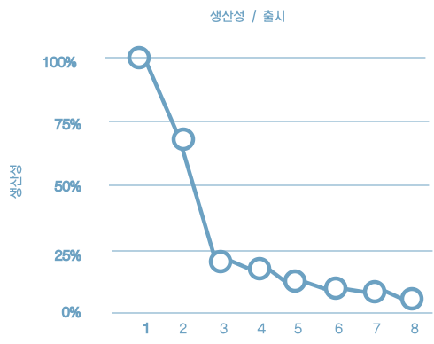

개발자 입장에서 보자면 이러한 현상은 지독한 절망감을 안겨주는데, 모두가 열심히 일하고 있기 때문이다. 전력을 기울이지 않는 개발자는 없다.

개발자의 노력은 기능 개발 보다는 엉망이 된 상황에 대처하는데 소모되기 시작한다.


### 경영자의 시각

첫번째 출시에서는 매월 수십만 달러의 인건비, 여덟 번째 출시는 월 2천만 달러가 되고, 계속 증가하는 추세다.


### 무엇이 잘못되었나?

* "느려도 꾸준하면 이긴다."
* "발 빠른 자가 경주에 이기는 것도 아니며, 힘센 자가 싸움에서 이기는 것도 아니다."
* "급할수록 돌아가라"

현대의 개발자는 뼈 빠지게 일을 하지만 그들의 뇌는 잠에 취해있다. 훌륭하고 깔끔하게 잘 설계된 코드가 중요하다는 사실을 알고 있는 바로 그 뇌가 잠자고 있다.

개발자는 "코드는 나중에 정리하면 돼. 당장은 시장에 출시하는 게 먼저야!" 라는 흔해 빠진 거짓말에 속는다.

이전에 작성한 코드로 돌아가 정리하는 일이 일어나지 않는데, 바로 다음에 만들어야 할 새로운 기능이 기다리고 있기 때문이다. 결국 엉망진창이 되고 생산성은 0을 향해 수렴하기 시작한다.

엉망진창인 코드가 서서히 쌓이면 개발자 생산성은 차츰 낮아지고, 코드가 엉망이 되는 추세는 절대 멈추거나 수그러들지 않는다.

소프트웨어 개발의 단순한 진리

> 빨리 가는 유일한 방법은 제대로 가는 것이다.

개발자는 처음부터 다시 시작하여 전체 시스템을 재설계 하는 것이 해답이라고 생각할지도 모른다. 하지만 이 생각 또한 토끼의 말과 다름없다.


## 결론

소프트웨어 아키텍처를 심각하게 고려할 수 있으려면 좋은 소프트웨어 아키텍처가 무엇인지 이해해야 한다. <u>비용은 최소화하고 생산성은 최대화</u> 할 수 있는 설계와 아키텍처를 가진 시스템을 만들려면, 이러한 결과로 이끌어 줄 시스템 아키텍처가 지닌 속성을 알고 있어야 한다.


# 2장 두가지 가치에 대한 이야기

* 모든 소프트웨어 시스템은 이해관계자에게 서로 다른 두 가지 가치를 제공하는데, 행위와 구조가 바로 그것이다. 
* 소프트웨어 개발자는 두가지 모두 반드시 높게 유지해야 하는 책임을 진다.
* 불행하게도 개발자는 한 가지 가치에만 집중하고 나머지 가치는 배제하곤 한다.
* 더 안타까운 일은 대체로 개발자가 둘 중 덜 중요한 가치에 집중하여 결국 소프트웨어 시스템이 쓸모없게 된다는 사실이다.


## 행위

* 소프트웨어의 첫번째 가치는 행위다.
* 프로그래머를 고용하는 이유는 이해관계자를 위해 수익을 창출하거나 비용을 절약하도록 만들기 위해서다.
* 많은 프로그래머가 이러한 활동이 자신이 해야 할 일의 전부라고 생각한다.
* 슬픈 일이지만 그들은 틀렸다.


## 아키텍처

* 두번째 가치는 소프트웨어라는 단어와 관련이 있다.

* 소프트웨어 단어는 부드러운(soft) + 제품(ware)이라는 단어의 합성어다.
* 소프트웨어는 '부드러움을 지니도록' 만들어졌다. 쉽게 변경하기 위해서다.
* 소프트웨어가 가진 본연의 목적을 추구하려면 반드시 '부드러워'야한다. 다시 말해 변경이 쉬워야 한다.
* 소프트웨어 개발 비용의 증가를 결정짓는 주된 요인은 바로 이 변경사항의 범위와 형태의 차이에 있다.


## 더 높은 가치

* 기능인가? 아니면 아키텍처인가? 둘 중 어느 것의 가치가 더 높은가?

* 이 말은 소프트웨어 시스템이 동작하도록 만드는 것이 더 중요한가? 아니면 소프트웨어 시스템을 더 쉽게 변경할 수 있도록 하는 것이 더 중요한가?

* 업무 관리자는 전자가 더 중요하고 개발자도 어느정도 동조하는 태도를 취한다. 하지만 이는 잘못된 태도다.

* <u>완벽하게 동작하지만 수정이 불가능한 프로그램과 동작은 하지 않지만 변경이 쉬운 프로그램이 있다면 어떤 것을 택하겠는가?</u>

* 업무 관리자에게 변경이 가능한 시스템을 원하는지 묻는다면, 당연히 그렇다고 답할것이다. 물론 현재 기능의 동작여부가 미래의 유연성보다 더 중요하다고 언급을 할 것이다.

* 하지만 추후 업무 관리자의 변경 요청에 '변경 비용이 너무 커서 현실적으로 적용할 수 없다'라고 대답하면 <u>'실질적으로 변경이 불가능한 상태에 처할 때까지 시스템을 방치했다'며 당신에게 화를 낼 가능성이 높다.</u>


## 아이젠하워 매트릭스

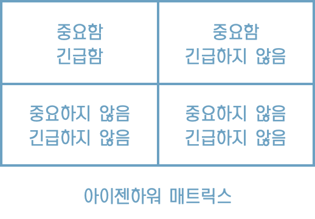

* 긴급한 문제가 아주 중요한 문제일 경우는 드물고, 중요한 문제가 몹시 긴급한 경우는 거의 없다는 사실이다.
* 소프트웨어의 첫번째 가치인 행위는 긴급하지만 매번 높은 중요도를 가지는 것은 아니다.
* 소프트웨어의 두번째 가치인 아키텍처는 중요하지만 즉각적인 긴급성을 필요로 하는 경우는 절대 없다.


다음과 같은 우선순위를 매길 수 있다.

1. 긴급하고 중요한
2. 긴급하지는 않지만 중요한
3. 긴급하지만 중요하지 않은
4. 긴급하지도 않고 중요하지도 않음

* 업무 관리자와 개발자가 흔하게 저지르는 실수는 세번째 위치한 항목을 첫번째로 격상시켜 버리는 일이다.
* 다시 말해, <u>긴급하지만 중요하지 않은 기능과 진짜로 긴급하면서 중요한 기능을 구분하지 못한다</u>.
* 이러한 실패로 인해 시스템에서 중요도가 높은 아키텍처를 무시한 채 중요도가 떨어지는 기능을 선택하게 된다.

> 기능의 긴급성이 아닌 아키텍처의 중요성을 설득하는 일은 소프트웨어 개발팀이 마땅히 책임져야 한다.


## 아키텍처를 위해 투쟁하라

* 회사에서 각팀은 각자 관점의 중요한 부분을 위해 투쟁한다.

* 개발팀도 소프트웨어를 안전하게 보호해야 할 책임이 있으므로 당신의 역할 중 하나이며, 당신의 책무 중 하나다.
* 아키텍처가 후순위가 되면 시스템을 개발하는 비용이 더 많이 들고 일부 또는 전체 시스템에 변경을 가하는 일이 현실적으로 가능해진다.
* 이는 결국 소프트웨어 개발팀이 스스로 옳다고 믿는 가치를 위해 충분히 투쟁하지 않았다는 뜻이다.


# 3장 패러다임 개요


## 구조적 프로그래밍

최초로 적용된 패러다임은 구조적 프로그래밍이다.

> 구조적 프로그래밍은 제어흐름의 직접적인 전환에 대한 규칙을 부과한다.


## 객체 지향 프로그래밍

> 객체 지향 프로그래밍은 제어흐름의 간접적인 전환에 대한 규칙을 부과한다.


## 함수형 프로그래밍

세 패러다임 중 가장 먼저 만들어졌다.

> 함수형 프로그래밍은 할당문에 대해 규칙을 부과한다.


# 4장 구조적 프로그래밍


# 5장 객체 지향 프로그래밍


# 6장 함수형 프로그래밍


# 7장 SRP: 단일 책임 원칙

* SOLID 원칙 중 그 의미가 가장 잘 전달되지 못한 원칙이 바로 단일 책임 원칙이다.

* 프로그래머가 이 원칙의 이름을 듣는다면 모든 모듈이 단 하나의 일만 해야 한다는 의미로 받아들이기 쉽다. 이것은 "함수"이다.


SRP는 아래와 같다.

> 단일 모듈은 변경의 이유가 하나, 오직 하나뿐이어야 한다.

SRP가 말하는 '변경의 이유'란 바로 이들 사용자와 이해관계자를 가리킨다.

아래와 같이 바꿔 말할 수도 있다.

> 하나의 모듈은 하나의, 오직 하나의 사용자 또는 이해관계자에 대해서만 책임져야 한다.

여기서 말하는 사용자, 이해관계자는 한명을 의미하는 것은 아니고 집단, 변경을 요청하는 한명 이상의 사람들을 가리킨다. 이런 집단을 액터(actor)라고 한다.

SRP의 최종 버전은 아래와 같다.

> 하나의 모듈은 하나의, 오직 하나의 액터에 대해서만 책임져야 한다.

그럼 '모듈'이란 무슨 뜻인가? 소스파일이다.

'응집된'이라는 단어가 SRP를 암시한다. 단일 액터를 책임지는 코드를 함께 묶어주는 힘이 바로 응집성(cohesion)이다.


이 원칙을 위반하는 징후들이다.

## 징후 1: 우발적 중복


이 클래스는 SRP를 위반하는데, 이들 세가지 메서드가 서로 매우 다른 세명의 액터를 책임지기 때문이다.

* calculatePay() 메서드는 회계팀에서 기능을 정의하며, CFO 보고를 위해 사용한다.
* reportHours() 메서드는 인사팀에서 기능을 정의하고 사용하며, COO 보고를 위해 사용한다.
* save() 메서드는 데이터베이스 관리자가 기능을 정의하고, CTO 보고를 위해 사용한다.

개발자가 이 세 메서드를 Employee라는 단일 클래스에 배치하여 새 액터가 서로 결합해 버렸다.

예를 들어 calculatePay() 메서드와 reportHours() 메서드가 초과 근무를 제외한 업무 시간을 계산하는 알고리즘을 공유한다고 해보자.
개발자는 코드 중복을 피하기 위해 이 알고리즘을 regularHours()라는 메서드에 넣었다고 해보자.


* CFO팀에서 초과근무를 제외한 업무 시간을 계산하는 방식을 약간 수정
* 반면 인사담당하는 COO팀에서는 초과근무를 제외한 업무시간을 CFO팀과 다른 목적으로 사용하기 때문에, 이 같은 변경을 원하지 않는다.
* 이런 방식은 의도하지 방식대로 변경이 되기 때문에 분리해야 한다.
* SRP는 서로 다른 액터가 의존하는 코드를 서로 분리하라고 말한다.


## 징후 2: 병합

* CTO 팀에서 employee 테이블 스키마 수정을 할 예정
* 이와 동시에 COO팀에서 reportHours 메서드의 보고서 포맷을 변경하기로 결정
* 두 명의 서로 다른 개발자가 employee 클래스를 체크아웃 받아 변경하기 시작한다. 결국 병합이 발생한다.
* 도구가 많이 좋아졌지만 병합에는 위험이 따르게 된다.
* 서로 다른 목적으로 동일한 소스파일을 변경하는 경우에 병합이 발생한다.
* 이 문제를 벗어나는 방법은 서로 다른 액터를 뒷받침하는 코드를 서로 분리하라는 것이다.


## 해결책

해결책은 메서드를 각기 다른 클래스로 이동시키는 방식이다.

EmployeeData 클래스를 만들어, 세 개의 클래스가 공유하도록 한다. 세 클래스는 서로의 존재를 몰라야 한다. 따라서 '우연한 중복'을 피할 수 있다.


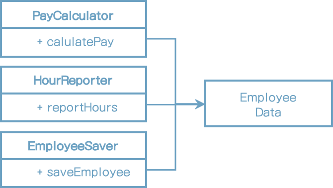


반면 이 해결책은 개발자가 세 가지 클래스를 인스턴스화하고 추적해야 한다는게 단점이다. 이러한 난관에서 빠져나올 때 흔히 쓰는 기법으로 퍼사드 패턴이 있다.


EmployeeFacade에 코드는 거의 없다. 이 클래스에는 세 클래스의 객체를 생성하고, 요청된 메서드를 가지는 객체로 위임하는 일을 책임진다.


## 결론

단일 책임 원칙은 메서드와 클래스 수준의 원칙이다.


# 8장 OCP: 개방-폐쇄 원칙

개방-폐쇄 원칙이라는 용어는 1988년에 버트란트 마이어가 만들었는데, 다음과 같다.

> 소프트웨어 개체는 확장에는 열려 있어야 하고, 변경에는 닫혀 있어야 한다.

다시 말해 소프트웨어 개체의 행위는 확장할 수 있어야 하지만, 이때 산출물을 변경해서는 안된다.

소프트웨어 아키텍처를 공부하는 가장 근본적인 이유가 바로 이 때문이다. 요구사항을 살짝 확장하는데 소프트웨어를 엄청나게 수정해야 한다면, 그 소프트웨어 시스템을 설계한 아키텍트는 엄청난 실패에 맞닥뜨린다는 것이다.


## 사고 실험

재무제표를 웹 페이지로 보여주는 시스템이 있다고 생각해보자. 음수는 빨간색으로 출력한다.

이해관계자가 동일한 정보를 보고서 형태로 변환해서 흑백 프린터로 출력해 달라고 요청했다고 해보자. 음수는 괄호로 감싸야 한다.

당연히 새로운 코드를 작성해야 한다. 그렇다면 원래 코드는 얼마나 많이 수정해야 할까? 이상적인 변경량은 0이다.


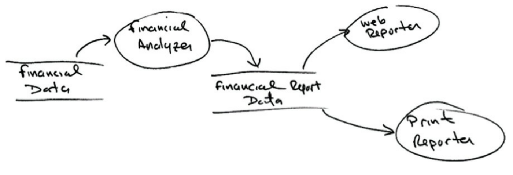


여기서 얻을 수 있는 가장 중요한 영감은 보고서 생성이 두 개의 책임으로 분리된다는 사실이다. 하나는 보고서용 데이터를 계산하는 책임이며, 나머지 하나는 이 데이터를 웹으로 보여주거나 종이로 프린트하기에 적합한 형태로 표현하는 책임이다.

책임을 분리했다면, 두 책임 중 하나에서 변경이 발생하더라도 다른 하나는 변경되지 않도록 소스코드 의존성도 확실히 조직화해야 한다.


모든 컴포넌트 관계는 단방향으로 이루어진다는 뜻이다.

위의 그림에서 interactor가 업무 규칙을 포함하고 있다는 것이다. interactor는 애플리케이션에서 가장 높은 수준의 정책을 포함한다.


## 결론

OCP의 목표는 시스템을 확장하기 쉬운 동시에 변경으로 인해 시스템에 너무 많은 영향을 받지 않도록 하는데 있다.


# 9장 LSP: 리스코프 치환 원칙

1988년 바바라 리스코프는 하위 타입을 아래와 같이 정의했다.

> 여기에서 필요한 것은 다음과 같은 치환원칙이다. S 타입의 객체 o1 각각에 대응하는 T타입 객체 o2가 있고, T타입을 이용해서 정의한 모든 프로그램 P에서 o2의 자리에 o1을 치환하더라도 P의 행위가 변하지 않는다면, S는 T의 하위 타입이다.


## 상속을 사용하도록 가이드하기

* License라는 클래스가 있다.

* 이 클래스는 calcFee()라는 메서드를 가지며, Billing 애플리케이션에서 이 메서드를 호출한다.

* License에는 PersonalLicense와 BusinessLicense라는 두가지 '하위 타입'이 존재한다.


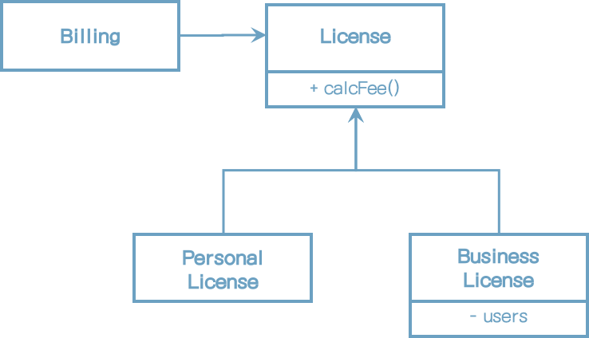


이 설계는 LSP를 준수하는데, Billing 애플리케이션의 행위가 License 하위 타입 중 무엇을 사용하는지에 전혀 의존하지 않기 때문이다. 이들 하위 타입은 모두 License 타입으로 치환할 수 있다.


## 정사각형/직사각형 문제

LSP를 위반하는 전형적인 문제로는 유명한 정사각형/직사각형 문제가 있다.


이 예제에서 Square는 Rectangle의 하위 타입으로는 적합하지 않는데, Rectangle의 높이와 너비는 서로 독립적으로 변경될 수 있는 반면, Square의 높이와 너비는 반드시 함께 변경되기 때문이다. 

아래의 코드를 보면 혼동의 이유가 분명해진다.

```java
Rectangle r = ...
r.setW(5);
r.setH(2);
assert(r.area() == 10);
```

... 코드에서 Square를 생성한다면 assert 문은 실패하게 된다.

LSP 위반을 막기 위한 유일한 방법은 (if문 등을 이용해서) Rectangle이 실제로는 Sqaure인지를 검사하는 메커니즘을 User에 추가하는 것이다.
하지만 이렇게 하면 User의 행위가 사용하는 타입에 의존하게 되므로, 결국 타입을 서로 치환할 수 없다.


## LSP와 아키텍처

초창기에 LSP는 상속을 사용하도록 가이드하는 방법 정도로 간주되었다.


## LSP 위반 사례

[사례]

* 택시 파견 서비스를 통합하는 애플리케이션을 만들고 있다.
* 고객은 어느 택시업체인지는 신경쓰지 않고 자신의 상황에 가장 적합한 택시를 찾는다.
* 고객이 이용할 택시를 결정하면, 시스템은 REST 서비스를 통해 선택된 택시를 고객 위치로 파견한다.
* 택시 파견 REST서비스의 URI가 운전기사 데이터베이스에 저장되어 있다.
* 시스템이 고객에게 알맞은 기사를 선택하면, 해당 기사의 레코드로부터 URI정보를 얻은 다음, 그 URI정보를 이용하여 해당 기사를 고객 위치로 파견한다.


밥(bob)의 택시 파견 URI은 다음과 같다.

```
purplecab.com/driver/bob
```

시스템은 이 URL에 파견에 필요한 정보를 붙이고 PUT 방식으로 호출한다.

```
purplecab.com/driver/bob
		/pickupAddress/24 Maple St.
		/pickupTime/153
		/destination/ORD
```

다른 택시업체에서도 동일한 REST 인터페이스를 준수하도록 만들어야 한다.

이제 택시업체 에크미(ACME)의 개발자는 destination 필드를 dest로 축약하여 사용했다고 치자. 

이를 위해 예외 사항 처리 로직을 추가해야만 할 것이다.

아래와 같이 if 문장을 추가하는 것이다.

```
if (driver.getDispatchUri().startsWith("acme.com"))...
```

acme라는 단어를 코드에 추가하면 끔찍할 뿐만 아니라 이해할 수도 없는 온갖 에러가 발생할 여지를 만들게 된다.


## 결론

LSP는 아키텍처 수준까지 확장할 수 있고, 반드시 확장해야만 한다. 


# 10장 ISP: 인터페이스 분리 원칙

인터페이스 분리 원칙은 다이어그램에서 그 이름이 유래했다.


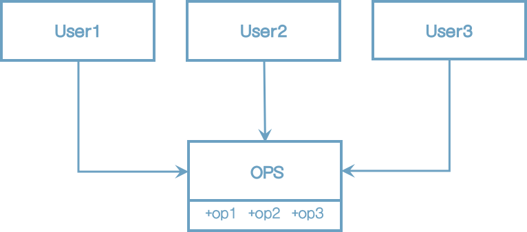


다수의 사용자가 OPS 클래스에서 오퍼레이션을 사용한다.
User1은 오직 op1을, User2는 op2만을, User3는 op3만을 사용한다.

User1에서는 op2, op3를 전혀 사용하지 않음에도 User1의 소스코드는 이 두 메서드에 의존하게 된다. op2의 소스코드가 변경되면 User1도 다시 컴파일한 후 새로 배포해야 한다.

이러한 문제는 아래와 같이 인터페이스 단위로 분리하여 해결할 수 있다.


User1의 소스 코드는 U1Ops와 op1에는 의존하지만 OPS에는 의존하지 않게 된다. 따라서 OPS에서 발생한 변경이 User1과는 전혀 관계없는 변경이라면, User1을 다시 컴파일하고 새로 배포하는 상황은 초래되지 않는다.


## ISP와 언어

정적 타입 언어는 사용자가 import, use 또는 include와 같은 타입 선언문을 사용하도록 강제한다.

동적 타입 언어는 런타임에 추론이 발생한다.


## ISP와 아키텍처

필요 이상으로 많은 걸 포함하는 모듈에 의존하는 것은 해로운 일이다. 불필요한 재컴파일과 재배포를 강제하기 때문이다.


F 프레임워크는 특정 D 데이터베이스를 반드시 사용하도록 만들었다고 가정해보자. 따라서 S는 F에 의존하며, F는 다시 D에 의존하게 된다.

F, S와는 전혀 상관없는 기능이 D 내부에서 변경이 발생하면 F를 재배포해야 할 수 있고, S까지 재배포해야 할지 모른다. 더 심각한 문제는 D 내부의 기능 중 F와 S에서 불필요한 그 기능에 문제가 발생해도 F와 S에 영향을 준다.


## 결론

여기서 배울수 있는 교훈은 불필요한 의존은 예상치 못한 문제에 빠진다는 것이다.


# 11장 DIP: 의존성 역전 원칙

의존성 역전 원칙에서 말하는, 유연성이 극대화된 시스템이란 소스코드 의존성이 추상화에 의존하며 구체에는 의존하지 않는 시스템이다.

자바와 같은 정적 타입 언어에서 이 말은 use, import, include 구분은 오직 인터페이스나 추상 클래스와 같은 추상적인 선언만을 참조야 한다는 뜻이다. 구체적인 대상에는 절대로 의존해서는 안된다.

DIP를 논의할 때 운영체제나 플랫폼 같이 안정성이 보장된 환경에 대해서는 무시하는 편이다.

우리가 의존하지 않도록 피하고자 하는 것은 바로 변동성이 큰 구체적인 요소다. 


## 안정된 추상화

추상 인터페이스에 변경이 생기면 구현체는 수정을 해야 한다. 반대로 구현체에 변경이 생기더라도 인터페이스는 수정될 필요가 없다.

실제로 뛰어난 소프트웨어 설계자와 아키텍트라면 인터페이스의 변동성을 낮추기 위해 애쓴다.

즉, 안정된 소프트웨어 아키텍처란 변동성이 큰 구현체에 의존하는 일은 지양하고, 안정된 추상 인터페이스를 선호하는 아키텍처라는 뜻이다.
아래와 같이 구체적인 코딩 실천법으로 요약할 수 있다.

* **변동성이 큰 구체 클래스를 참조하지 말라.**
    대신 추상 인터페이스를 참조하라.
* **변동성이 큰 구체 클래스로부터 파생하지 말라.** 
    상속은 소스코드에 존재하는 모든 관계 중 가장 강력한 동시에 뻣뻣해서 변경하기 어렵다. 상속은 아주 신중하게 사용해야 한다.
* **구체 함수를 오버라이드 하지 말라.** 
    구체함수는 소스코드 의존성을 필요로 한다. 구체함수를 오버라이드하면 이러한 의존성을 제거할 수 없게 되며, 의존성을 상속하게 된다.
* 구체적이며 변동성이 크다면 절대로 그 이름을 언급하지 말라.


## 팩토리

모든 언어에서 객체를 생성하려면 해당 객체를 구체적으로 정의한 코드에 대해 소스코드 의존성이 발생한다.

Application은 Service 인터페이스를 통해 ConcreteImpl의 인스턴스를 생성해야 한다. ConcreteImpl에 대해 소스코드 의존성을 만들지 않으면서 이 목적을 이루려면 Application은 ServiceFactory 인터페이스의 makeSvn 메서드를 호출한다. 이 메서드는 ServiceFactory로 부터 파생된 ServiceFactoryImpl에서 구현된다. 그리고 ServiceFactoryImpl 구현체가 ConcreteImpl의 인스턴스를 생성한 후 Service 타입으로 반환한다.


이 곡선은 구체적인 것들로부터 추상적인 것들을 분리한다.

곡선은 시스템을 두 가지 컴포넌트로 분리한다. 하나는 추상 컴포넌트이며, 다른 하나는 구체 컴포넌트다. 추상 컴포넌트는 업무 규칙을 다루기 위해 필요한 모든 세부사항을 포함한다.

제어흐름은 소스코드 의존성과는 정반대 방향으로 곡선을 가로지른다는 점에 주목하자. 다시 말해 의존성은 제어흐름과는 반대 방향으로 역전된다. 이러한 이유로 이 원칙을 의존성 역전 이라고 부른다.


## 구체 컴포넌트

위의 그림에는 구체적인 의존성이 하나(ConcreteImpl) 있고, 따라서 DIP에 위배된다. 이는 일반적인 일이다. DIP위배를 모두 없앨 수는 없다.


# 12장 컴포넌트

* 컴포넌트는 배포 단위다.
* 컴포넌트는 시스템의 구성 요소로 배포할 수 있는 가장 작은 단위다.
* 자바의 경우 jar 파일이 컴포넌트다. 닷넷에서는 DLL이다.
* 잘 설계된 컴포넌트라면 반드시 독립적으로 배포 가능한, 따라서 독립적으로 개발 가능한 능력을 갖춰야 한다.


# 13장 컴포넌트 응집도

어떤 클래스를 어떤 컴포넌트에 포함시켜야 할까?

이 장에서는 컴포넌트 응집도와 관련된 세 가지 원칙을 논의한다.

* REP: 재사용/릴리스 등가 원칙 (Reuse/Release Equivalence Principle)
* CCP: 공통 폐쇄 원칙 (Common Closure Principle)
* CRP: 공통 재사용 원칙 (Common Reuse Principle)


## REP: 재사용/릴리스 등가 원칙

> 재사용 단위는 릴리스 단위와 같다.

소프트웨어 컴포넌트가 릴리스 절차를 통해 추적 관리되지 않거나 릴리스 번호가 부여되지 않는다면 해당 컴포넌트를 재사용하고 싶어도 할 수도 없고, 하지도 않을 것이다.

릴리스 번호가 없다면 재사용 컴포넌트들이 서로 호환되는지 보증할 방법이 전혀 없다. 새로운 버전이 언제 출시되고 무엇이 변했는지를 소프트웨어 개발자들이 알아야 하기 때문이다.

이 원칙을 소프트웨어 설계와 아키텍처 관점에서 보면 단일 컴포넌트는 응집성 높은 클래스와 모듈들로 구성되어야 함을 뜻한다. 단순히 뒤죽박죽 임의로 선택된 클래스와 모듈로 구성되어서는 안된다. 컴포넌트를 구성하는 모든 모듈은 서로 공유하는 중요한 테마나 목적이 있어야 한다.

<u>하나의 컴포넌트로 묶인 클래스와 모듈은 반드시 함께 릴리스 할 수 있어야 한다.</u> 하나의 컴포넌트로 묶인 클래스와 모듈은 버전 번호가 같아야 하며, 동일한 릴리스로 추적 관리되고, 동일한 릴리스 문서에 포함되어야 한다.


## CCP: 공통 폐쇄 원칙

> 동일한 이유로 동일한 시점에 변경되는 클래스를 같은 컴포넌트로 묶어라. 서로 다른 시점에 다른 이유로 변경되는 클래스는 다른 컴포넌트로 분리하라.

이 원칙은 단일 책임 원칙을 컴포넌트 관점에서 다시 쓴 것이다. SRP에서 단일 클래스는 변경의 이유가 여러 개 있어서는 안된다고 말하듯이, 공통 폐쇄 원칙도 마찬가지로 단일 컴포넌트는 변경의 이유가 여러 개 있어서는 안된다고 말한다.

대다수의 애플리케이션에서 유지보수성은 재사용성보다 훨씬 중요하다. 애플리케이션 코드가 반드시 변경되어야 한다면 여러 컴포넌트 도처에 분산되기 보다는 단일 컴포넌트에서  발생하는 편이 낫다.

CCP는 <u>같은 이유로 변경될 가능성이 있는 클래스는 모두 한곳으로 묶을 것</u>을 권한다. 이를 통해 릴리스, 재검증, 배포하는 일과 관련된 작업량을 최소화할 수 있다.

이 원칙은 OCP와도 밀접하게 관련되어 있다. CCP에서 말하는 폐쇄(Closure)는 OCP에서 말하는 폐쇄(Closure)와 그 뜻이 같다. OPC에서는 클래스가 변경에는 닫혀 있어야 하고 확장에는 열려 있어야 한다고 말한다. 100% 완전한 폐쇄는 불가능하므로 전략적으로 폐쇄해야 한다. 우리는 발생할 가능성이 있거나 과거에 발생했던 대다수의 공통적인 변경에 대해서 클래스가 닫혀 있도록 설계한다.

CCP에서는 동일한 유형의 변경에 대해 닫혀 있는 클래스들을 하나의 컴포넌트로 묶음으로써 OCP에서 얻은 교훈을 확대 적용한다. 변경이 필요한 요구사항이 발생했을 때 그 변경이 영향을 주는 컴포넌트들이 최소한으로 한정될 가능성이 높아진다.


### SRP와의 유사성

CCP는 컴포넌트 수준의 SRP이다. CCP는 다른 이유로 변경되는 클래스를 다른 컴포넌트로 분리하라. 두 원칙은 다음과 같이 요약할 수 있다.

> 동일한 시점에 동일한 이유로 변경되는 것을 한데 묶어라. 서로 다른 시점에 다른 이유로 변경되는 것들은 서로 분리한다.


## CRP: 공통 재사용 원칙

> 컴포넌트 사용자들을 필요하지 않는 것에 의존하게 강요하지 말라.

공통 재사용 원칙도 클래스와 모듈을 어느 컴포넌트에 위치시킬지 결정할 떄 도움되는 원칙이다. CRP에서는 같이 재사용되는 경향이 있는 클래스와 모듈들은 같은 컴포넌트에 포함해야 한다고 말한다.

개별 클래스가 단독으로 재사용되는 경우는 거의 없다. 대체로 재사용 가능한 클래스는 재사용 모듈의 일부로서 해당 모듈의 다른 클래스와 상호작용하는 경우가 많다. CRP에서는 이런 클래스들이 동일한 컴포넌트에 포함되어야 한다고 말한다. 

사용되는 컴포넌트가 1개이든 그 이상이던 의존성이 생기는건 똑같다. 그로 인해 재컴파일, 재검증, 재배포 상황이 생길 수 있다.

CRP에서는 어떤 클래스를 한데 묶어도 되는지보다, 어떤 클래스를 한데 묶어서는 안되는지에 대해서 훨씬 더 많은 것을 이야기한다. CRP는 강하게 결합되지 않은 클래스들을 동일한 컴포넌트에 위치시켜서는 안된다고 말한다.


## ISP와의 관계

CRP는 ISP의 포괄적인 버전이다.

ISP에서는 사용하지 않은 메서드가 있는 클래스를 의존하지 말라고 한다. CRP는 사용하지 않는 클래스를 가진 컴포넌트를 의존하지 말라고 한다.

이 두 조언은 아래와 같이 요약할 수 있다.

> 필요하지 않은 것에 의존하지 말라.


## 컴포넌트 응집도에 대한 균형 다이어그램

REP와 CCP는 포함 원칙이며 컴포넌트를 더욱 크게 만든다.

CRP는 배제 원칙이며 컴포넌트를 작게 만든다.


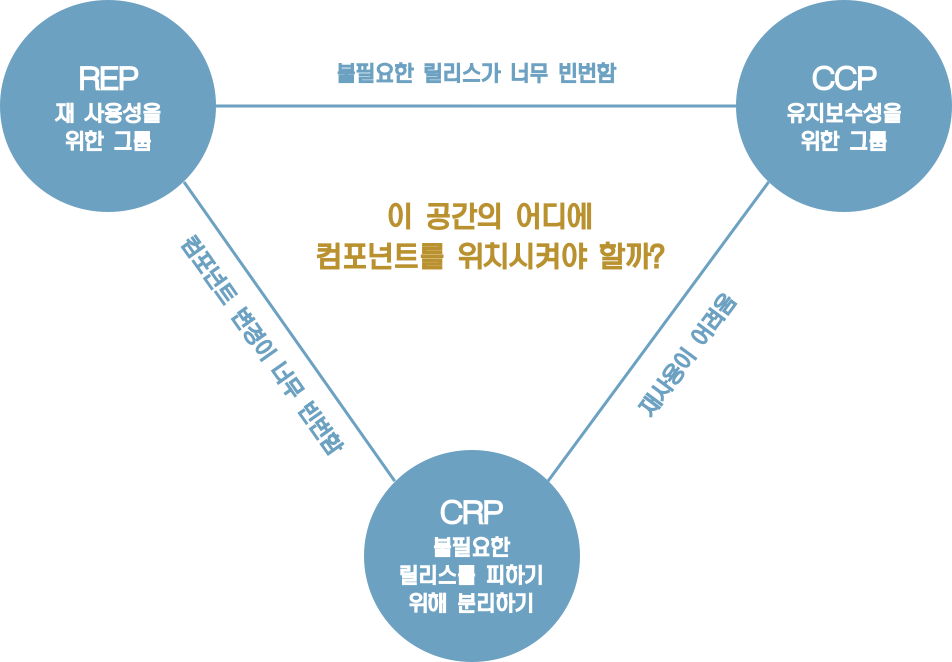


오로지 REP와 CRP에만 중점을 두면, 사소한 변경이 생겼을 때 너무 많은 컴포넌트에 영향을 미친다. 반대로 CCP와 REP에만 과도하게 집중하면 불필요한 릴리스가 너무 빈번해진다.

프로젝트 초기에는 CCP가 REP보다 훨씬 더 중요한데, 개발 가능성이 재사용성보다 더욱 중요하기 때문이다.

일반적으로 프로젝트는 삼각형의 오른쪽에서 시작하는 편이며, 이때는 오직 재사용성만 희생하면 된다. 프로젝트가 성숙해짐에 따라 왼쪽으로 이동해 간다.


# 14장 컴포넌트 결합


## ADP: 의존성 비순환 원칙

> 컴포넌트 의존성 그래프에 순환이 있어서는 안된다.

숙취 증후군(The morning after syndrome)
: 하루 종일 무언가를 작동하게 만들어 놓고 퇴근했는데, 이튿날 출근해보면 전혀 돌아가지 않는 경험을 해본적이 있는가? 
누군가 당신보다 더 늦게까지 일하면서 당신이 의존하고 있던 무언가를 수정했기 때문이다. 이런 현상을 '숙취 증후군'이라고 부른다.

숙취 증후군을 해결책으로 두 가지 방법이 발전되어 왔다. 첫 해결책은 '주 단위 빌드'이며, 두 번째 해결책은 '의존성 비순환 원칙'이다.


### 주 단위 빌드 (Weekly Build)

개발자는 일주일의 첫 4일 동안은 서로 신경 쓰지 않는다. 그런 후 금요일이 되면 변경된 코드를 모두 통합하여 시스템을 빌드한다.

그러나 프로젝트가 커지면 프로젝트 통합이 금요일 하루만에 끝마치는게 불가능해진다.


### 순환 의존성 제거하기

개발 환경을 릴리스 가능한 컴포넌트 단위로 분리하는 것이다. 컴포넌트는 개별 개발자 또는 단일 개발팀이 책임질 수 있는 작업 단위다. 개발자가 해당 컴포넌트가 동작하도록 만든 후, 해당 컴포넌트를 릴리스하여 다른 개발자가 사용할 수 있도록 만든다. 담당 개발자는 이 컴포넌트에 릴리스 번호를 부여하고, 다른 팀에서 사용할 수 있는 디렉토리로 이동한다. 그런 다음 개발자는 자신만의 공간에서 해당 컴포넌트를 지속적으로 수정한다. 나머지 개발자는 릴리스된 버전을 사용한다.

컴포넌트가 새로 릴리스 되어 사용할 수 있게 되면, 다른 팀에서는 새 릴리스를 당장 적용할지 결정해야 한다. 적용하지 않기로 했다면 그냥 과거 버전의 릴리스를 계속 사용한다.

따라서 어떤 팀도 다른 팀에 의해 좌우되지 않는다. 특정 컴포넌트가 변경되더라도 다른 팀에 즉각 영향을 주지 않는다. 

그림 14.1의 다이어그램은 구조가 방향 그래프(directed graph) 임에 주의하자.

한가지 더 주목할 점이 있다. 어느 컴포넌트에서 시작하더라도, 의존성 관계를 따라가면서 최초의 컴포넌트로 되돌아갈 수 없다는 사실이다. 이 구조에는 순환이 없다. 즉, 이 구조는 비순환 방향 그래프(directed acyclic graph, DAG)다.


* Presenters를 담당하는 팀에서 새로운 릴리스를 할때 영향을 받는 컴포넌트는?
    View와 Main 컴포넌트다.
* Main을 변경할 때 영향을 받는 컴포넌트는?
    없다.


### 순환이 컴포넌트 의존성 그래프에 미치는 영향


Entity에 포함된 클래스 하나가 Authorizer에 포함된 클래스 하나를 사용하도록 변경할 수 밖에 없다고 가정해보자. 이럴때는 순환 의존성이 발생한다.

Database 컴포넌트 개발자는 Entities 컴포넌트와 호환되어야 한다. 하지만 Entities 컴포넌트에는 순환이 있으므로 Database 컴포넌트는 또한 Authorizer와 호환되어야 한다. 이로 인해 Database는 릴리스 하기가 훨씬 어려워진다. Entities, Authorizer, Interactors는 사실상 하나의 거대한 컴포넌트가 되어 버린다.

또한 Entities 컴포넌트를 테스트할때 Authorizer와 Interactors까지도 반드시 빌드하고 통합해야 한다.


### 순환 끊기

1. 의존성 역전 원칙(DIP)을 적용한다.  그림 14.3처럼 User가 필요로 하는 메서드를 제공하는 인터페이스를 생성한다. 그리고 이 인터페이스는 Entities에 위치시키고 Authorizer는 이 인터페이스를 상속받는다. 

    

    

    

2. Entities와 Authorizer가 모두 의존하는 새로운 컴포넌트를 만든다. 그리고 두 컴포넌트가 모두 의존하는 클래스들을 새로운 컴포넌트로 이동시킨다.


### 흐트러짐 (Jitters)

두번째 해결책에서 시사하는 바는 요구사항이 변경되면 컴포넌트 구조도 변경될 수 있다는 사실이다. 따라서 의존성 구조에 순환이 발생하는지를 항상 관찰해야 한다.


## 하향식(top-down) 설계

컴포넌트 구조는 하향식으로 설계될 수 없다. 컴포넌트는 시스템에서 가장 먼저 설계할수 있는 대상이 아니며, 오히려 시스템이 성장하고 변경될 때 함께 진화한다.

컴포넌트 의존성 다이어그램은 애플리케이션의 기능을 기술하는 일과는 거의 관련이 없다. 오히려 빌드 가능성과 유지보수성을 보여주는 지도와 같다. 이러한 이유로 컴포넌트 구조는 프로젝트 초기에 설계할 수 없다.

GUI에서 표현 형식이 변경되더라도 업무 규칙에 까지 영향을 주는 일은 바라지 않는다. 출력할 보고서에 무언가가 추가되거나 수정되더라도 최상위 수준의 정책이 영향받는 일은 원치 않는다. 


## SDP: 안정된 의존성 원칙

> 안정성의 방향으로(더 안정된 쪽에) 의존하라.

설계를 유지하다 보면 변경을 불가피하다. 공통 폐쇄 원칙을 준수함으로써, 컴포넌트가 다른 유형의 변경에는 영향을 받지 않으면서도 특정 유형의 변경에만 민감하게 만들 수 있다. 이처럼 컴포넌트 중 일부는 변동성을 지니도록 설계한다. 우리는 변동성을 지니도록 설계한 컴포넌트는 언젠가 변경되리라 예상한다.

당신이 모듈을 만들 때는 변경하기 쉽도록 설계했지만, 이 모듈에 의존성을 매달아 버리면 당신의 모듈도 변경하기 어려워진다. 안정된 의존성 원칙(Stable Dependencies Principle, SDP)을 준수하면 변경하기 어려운 모듈이 변경하기 쉽게 만들어진 모듈에 의존하지 않도록 만들수 있다.


### 안정성

안정성이란 무슨 뜻인가? (동전 옆면?)
동전 옆면이 안정적이지 않은 이유는 그다지 힘을 쓰지 않고도 넘어뜨릴 수 있게 때문이다. 반면 탁자는 상당히 안정적인데 탁자를 뒤집으려면 상당한 수고를 감수해야 하기 때문이다.

소프트웨어 컴포넌트를 변경하기 어렵게 만드는 요인은 여러가지인데 그 중 컴포넌트의 크기, 복잡도, 간결함 등이 있다.

소프트웨어 컴포넌트를 변경하기 어렵게 하는 확실한 방법은 수많은 다른 컴포넌트가 해당 컴포넌트에 의존하게 만드는 것이다. 

그림 14.5의 X는 안정된 컴포넌트다. 따라서 X컴포넌트는 변경하지 말아야 할 이유가 세 가지나 되기 때문이다.


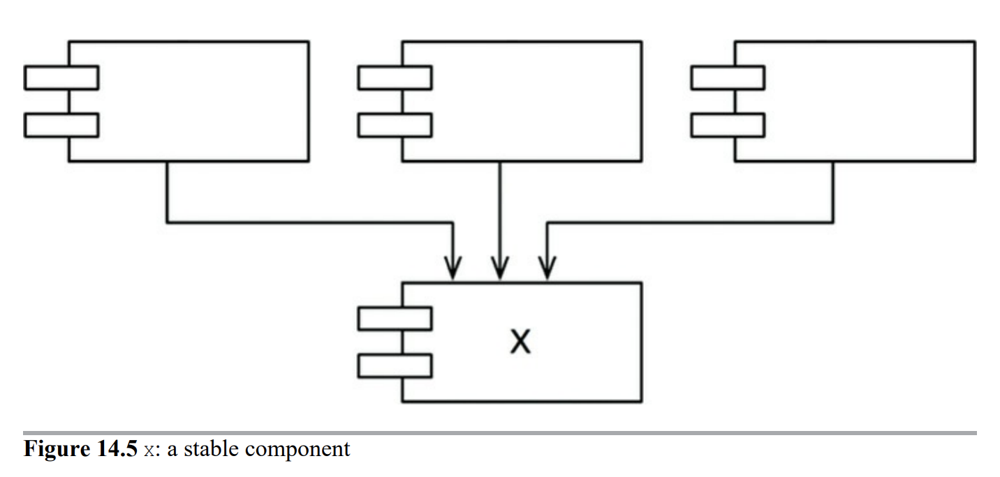


그림 14.6의 Y는 상당히 불안정한 컴포넌트다. 어떤 컴포넌트도 Y에 의존하지 않으므로 Y는 책임성이 없다고 말할 수 있다. 


### 안정성 지표

컴포넌트 안정성을 어떻게 측정할 수 있을까? 컴포넌트로 들어오고 나가는 의존성의 개수를 세어 보는 방법이 있을 수 있다.

* Fain-in: 안으로 들어오는 의존성. 컴포넌트 내부의 클래스에 의존하는 컴포넌트 외부의 클래스 개수
* Fan-out: 바깥으로 나가는 의존성. 컴포넌트 외부의 클래스에 의존하는 컴포넌트 내부의 클래스 개수
* I(불안정성): I = Fan-out / (Fain-in + Fan-out). 이 지표는 [0, 1]범위의 값을 갖는다. I=0이면 최고로 안정된 컴포넌트이고 I=1이면 최고로 불안정한 컴포넌트라는 뜻이다.


## SAP: 안정된 추상화 원칙

> 컴포넌트는 안정된 정보만큼만 추상화 되어야 한다.


<u>추가 설명 필요</u>


# 15장 아키텍처란?

아키텍처라는 단어는 권력과 신비로움을 연상케 한다. 소프트웨어 아키텍트를 생각할 때면, 권한을 가지며 존경심을 불러일으키는 사람을 떠올린다.

그러면 소프트웨어 아키텍처란 무엇인가? 무슨일을 하며, 그 일은 언제 하는가?

무엇보다도 소프트웨어 아키텍트는 프로그래머이며, 앞으로도 계속 프로그래머로 남는다. 소프트웨어 아키텍트라면 코드에서 탈피하여 고수준의 문제에 집중해야 한다는 거짓말에 절대로 속아 넘어가서는 안된다. 소프트웨어 아키텍트는 코드와 동떨어져서는 안된다. 소프트웨어 아키텍트는 최고의 프로그래머이며, 앞으로도 계속 프로그래밍 작업을 맡을 뿐만 아니라 동시에 나머지 팀원들이 생산성을 극대화할 수 있는 설계를 하도록 방향을 이끌어준다. 프로그래밍 작업을 계속 하는 이유는, *발생하는 문제를 경험해보지 않는다면 다른 프로그래머를 지원하는 작업을 제대로 수행할 수 없기 때문이다.*

시스템 아키텍처는 시스템의 동작여부와는 거의 관련이 없다. 형편없는 시스템들은 대체로 운영에서는 문제를 겪지 않는다. *운영보다는 배포, 유지보수, 계속되는 개발 과정에서 어려움을 겪는다*.

좋은 아키텍처는 시스템을 쉽게 이해하고, 쉽게 개발하며, 쉽게 유지보수하고, 또 쉽게 배포하게 해준다. 아키텍처의 궁극적인 목표는 시스템의 수명과 관련된 비용은 최소화하고, 프로그래머의 생산성을 최대화 하는데 있다.


## 개발

개발하기 힘든 시스템이라면 수명이 길지도 않고 건강하지도 않을 것이다.

팀 구조가 다르다면 아키텍처 관련 결정에서도 차이가 난다. 일례로 팀이 개발자 다섯 명으로 구성될 정도로 작다면, 잘 정의된 컴포넌트나 인터페이스가 없더라도 서로 효율적으로 협력하여 모노리틱 시스템을 개발할 수 있다. 사실 이러한 팀이라면 개발 초기에는 아키텍처 관련 제약들이 오히려 방해가 된다고 여길 가능성이 높다. 

다른 한편으로 일곱 명씩으로 구성된 다섯 팀이 시스템을 개발하고 있다면 시스템을 신뢰할 수 있고 안정된 인터페이스를 갖춘, 잘 설계된 컴포넌트 단위로 분리하지 않으면 개발이 진척되지 않는다. 다른 요소를 고려하지 않는다면 이 시스템의 아키텍처는 다섯 개의 컴포넌트로 발전될 가능성이 높다.

각각 5개의 컴포넌트가 일정에 쫓겨 최적의 상태가 될 가능성은 거의 없다. (배포, 운영, 유지보수)


## 배포

소프트웨어 아키텍처는 시스템을 단 한 번에 쉽게 배포할 수 있도록 만드는데 그 목표를 두어야 한다.

예를 들어 개발 초기에 개발자가 '마이크로서비스 아키텍처'를 사용하자고 결정할 수도 있다. 이렇게 되면 컴포넌트 경계가 매우 뚜렷해지고 인터페이스가 대체로 안정화되므로 시스템을 쉽게 개발할 수 있을 것이다. 하지만 배포를 하기 위해 설정 및 작동순서를 결정하는 과정에서 오작동이 발생할 가능성이 있다.


## 운영

아키텍처가 시스템 운영에 미치는 영향은 개발, 배포, 유지보수에 미치는 영향보다는 덜 극적이다.

소프트웨어 시스템의 아키텍처가 비효율적이라면 단순히 스토리지와 서버를 추가하는 것만으로 제대로 동작하게 만들 수 있다. 하드웨어는 싸고 인력은 비싸다는 말이 있듯이 운영을 방해하는 아키텍처가 개발, 배포, 유지보수를 방해하는 아키텍처보다는 비용이 덜 든다는 뜻이다.


## 유지보수

유지보수는 모든 측면에서 봤을 때 소프트웨어 시스템에서 비용이 가장 많이 든다.

유지보수의 가장 큰 비용은 탐사(spelunking)와 이로 인한 위험부담에 있다. 탐사란 기존 소프트웨어에 새로운 기능을 추가하거나 결함을 수정할 때 소프트웨어를 파헤처서 어디를 고치는게 최선인지, 어떤 전략을 쓰는게 최적일지를 결정할 때 드는 비용이다. 이러한 변경사항을 반영할 때 의도치 않게 결함이 발생할 가능성은 항상 존재한다.

시스템을 컴포넌트로 분리하고, 안정된 인터페이스를 두어 서로 격리한다. 이를 통해 미래에 추가될 기능에 대한 길을 밝혀 둘 수 있을 뿐만 아니라 의도치 않게 장애가 발생할 위험을 크게 줄일 수 있다.


## 선택사항 열어 두기

소프트웨어는 두 종류의 가치, 즉 행위적 가치와 구조적 가치를 가진다. 이 중 두번째 가치가 더 중요한데 소프트웨어를 부드럽게 만드는 것은 바로 이 구조적 가치이기 때문이다.

소프트웨어를 부드럽게 유지하는 방법은 선택사항을 가능한 한 많이, 그리고 가능한 한 오랫동안 열어 두는 것이다. 그렇다면 열어둬야 할 선택사항이란 무엇일까? 그것은 바로 중요치 않은 세부사항(detail)이다.

모든 소프트웨어 시스템은 주요한 두가지 구성요소로 분해할 수 있다. 바로 정책과 세부사항이다. 정책요소는 모든 업무 규칙과 업무 절차를 구체화한다. 정책이란 시스템의 진정한 가치가 살아 있는 곳이다.

세부사항은 사람, 외부 시스템, 프로그래머가 정책과 소통할 때 필요한 요소지만, 정책이 가진 행위에는 조금도 영향을 미치지 않는다. 이러한 세부사항에는 입출력장치, 데이터베이스, 웹 시스템, 서버, 프레임워크, 통신 프로토콜이 있다.

아키텍트의 목표는 시스템에서 정책을 가장 핵심적인 요소로 식별하고, 동시에 세부사항은 정책에 무관하게 만들 수 있는 형태의 시스템을 구축하는데 있다. 이를 통해 세부사항을 결정하는 일은 미루거나 연기할 수 있게 된다.

* 개발 초기에는 데이터베이스 시스템을 선택할 필요가 없다. 신중한 아키텍트라면 고수준의 정책을 데이터베이스가 관계형인지, 분산형인지, 계층형인지 관련이 없도록 만들어야 한다.
* 개발 초기에는 웹 서버를 선택할 필요가 없다.
* 개발 초기에는 REST를 적용할 필요가 없다. 고수준의 정책은 외부 세계로의 인터페이스에 대해 독립적이어야 하기 때문이다.
* 개발 초기에는 의존성 주입 프레임워크를 적용할 필요가 없다.


## 장치 독립성


## 광고 우편


## 물리적 주소 할당


## 결론

좋은 아키텍트는 세부사항을 정책으로부터 신중하게 가려내고, 정책이 세부사항과 결합되지 않도록 엄격하게 분리한다. 또한 세부사항에 대한 결정을 가능한 한 오랫동안 미룰 수 있는 방향으로 정책을 설계한다.


# 16장 독립성

좋은 아키텍처는 다음을 지원해야 한다.

* 시스템의 유스케이스
* 시스템의 운영
* 시스템의 개발
* 시스템의 배포


## 유스케이스

첫번째 중요항목인 유스케이스의 경우, 시스템의 아키텍처는 시스템의 의도를 지원해야 한다는 뜻이다. 만약 시스템이 장바구니 애플리케이션이라면, 이 아키텍처는 장바구니와 관련된 유스케이스를 지원해야 한다. 실제로 아키텍트의 최우선 관심사는 유스케이스이며, 아키텍처에서도 유스케이스가 최우선이다. 아키텍처는 반드시 유스케이스를 지원해야 한다.


## 운영

시스템이 초당 100,000명의 고객을 처리해야 한다면, 이 요구와 관련된 각 유스케이스에 걸맞은 처리량과 응답시간을 보장해야 한다.


## 개발

아키텍처는 개발환경을 지원하는 데 있어 핵심적인 역할을 수행한다. 

콘웨이 법칙은 아래와 같다.

> 시스템을 설계하는 조직이라면 어디든지 그 조직의 의사소통 구조와 동일한 구조의 설계를 만들어 낼 것이다.

많은 팀으로 구성되어 관심사가 다양한 조직에서 시스템을 개발해야 한다면 각 팀이 독립적으로 행동하기 편한 아키텍처를 반드시 확보하여 개발하는 동안 서로 방해하지 않도록 해야 한다.


## 배포

배포의 목표는 '즉각적인 배포'다. 좋은 아키텍처는 수십개의 작은 설정 스크립트나 속성 파일을 약간씩 수정하는 방식을 사용하지 않는다. 또한 디텍터리나 파일을 수작으로 생성하게 내버려두지 않는다. 좋은 아키텍처는 빌드 후 즉각 배포할 수 있도록 지원해야 한다.


## 선택사항 열어놓기


## 유스케이스 결합 분리


## 결합 분리 모드


## 개발 독립성


## 배포 독립성


## 중복

중복에도 여러가지가 있다. 그중 하나는 진짜 중복이다.

또 다른 중복은 거짓된 또는 우발적인 중복이다.  중복으로 보이는 두 코드 영역이 각자의 경로로 발전한다면, 즉 서로 다른 속도와 다른 이유로 변경된다면 이 두 코드는 진짜 중복이 아니다. 몇년이 지나 다시 보면 두 코드가 매우 다르다는 사실을 알게 될 것이다.


## 결합 분리 모드 (다시)


## 결론


# 17장 경계: 선 긋기

소프트웨어 아키텍처는 선을 긋는 기술이며, 이러한 선을 경계라고 부른다. 경계 한편에 있는 요소가 반대편에 잇는 요소를 알지 못하도록 막는다. 핵심적인 업무 로직을 오염시키지 못하게 만들려는 목적으로 쓰인다.

아키텍트의 목표는 필요한 시스템을 만들고 유지하는 데 드는 인적 자원을 최소화하는 것이라는 사실을 상기하자. 인적 자원의 효율을 떨어뜨리는 요인은 무엇일까? 바로 결합(coupling)이다. 

시스템의 업무 요구사항, 즉 유스케이스와 아무런 관련이 없는 결정이다. 


## 두 가지 슬픈 이야기


# 18장 경계 해부학


# 19장 정책과 수준


# 20장 업무 규칙


# 21장 소리치는 아키텍처

건물의 청사진을 보고 있다면 이 계획서는 무슨 이야기를 해주는가?

그 계획서가 주택을 그리고 있다면, 정문, 거실로 연결되는 현관, 그리고 식당, 주방, 식탁, 가족 방이 있다. 이러한 계획서를 본다면 한 가족이 사는 주택을 보고 있다는 사실에 의심의 여지가 없을 것이다. 다시 말해, 이 아키텍처는 "집이야"라고 소리칠 것이다.

도서관의 아키텍처를 보고 있다면 커다란 정문, 체크인/체크아웃을 담당할 사서를 위한 공간, 독서 공간, 작은 회의실, 도서관의 책장이 나타날 것이다. 이 아키텍처는 "도서관이야"라고 소리칠 것이다.

자, 여러분의 애플리케이션 아키텍처는 뭐라고 소리치는가? 상위 수준의 디렉토리 구조, 최상위 패키지에 담긴 소스파일을 볼 때, 이 아키텍처는 "헬스 케어 시스템이야" 또는 "재고 관리 시스템이야"라고 소리치는가? 아니면 "레일스야", "스프링/하이버네이트야" 아니면 "ASP야" 라고 소리치는가?


## 아키텍처의 테마

"Object Oriented Software Engineering"에서 소프트웨어 아키텍처는 시스템의 유스케이스를 지원하는 구조라고 했다.

아키텍처는 프레임워크에 대한 것이 아니다. 프레임워크는 사용하는 도구일 뿐, 아키텍처가 준수해야 할 대상이 아니다. 아키텍처를 프레임워크 중심으로 만들어 버리면 유스케이스가 중심이 되는 아키텍처는 절대 나올 수 없다.


## 아키텍처의 목적

좋은 아키텍처는 유스케이스를 그 중심에 두기 때문에 프레임워크나 도구, 환경에 전혀 구애받지 않고 유스케이스를 지원하는 구조를 기술할 수 있다. 아키텍트가 주목하는 첫번째 관심사는 주택이 거주하기에 적합한 공간임을 확실히 하는것이지, 벽돌로 지어지는지를 확인하는 것이 아니다. 실제 아키텍트는 외장재(벽돌, 석조, 향나무)를 소유주가 결정할 수 있도록 애쓰지만 이 역시도 계획서가 유스케이스를 확실히 충족시킨 이후다.

좋은 소프트웨어 아키텍트는 프레임워크, 데이터베이스, 웹 서버, 그리고 여타 개발환경 문제나 도구에 대해서는 결정을 미룰 수 있도록 만든다. 프레임워크는 열어 둬야 할 선택사항이다.


## 하지만 웹은?

웹은 아키텍처일까? 애플리케이션이 웹을 통해 전달된다는 것은 세부사항이며 시스템 구조를 지배해서는 절대 안된다. 웹으로 전달할 것인지 여부는 미루어야 할 결정사항이다.


## 프레임워크는 도구일 뿐, 삶의 방식은 아니다.

프레임워크가 아키텍처의 중심을 차지하는 일을 막을 수 있는 전략을 개발하라.


## 테스트하기 쉬운 아키텍처

아키텍처는 프레임워크를 전혀 준비하지 않더라도 필요한 유스케이스 전부에 대해 단위 테스트를 할 수 있어야 한다. 테스트를 돌리는 데 웹서버가 반드시 필요한 상황이 되어서는 안된다. 데이터베이스가 반드시 연결되어 있어야만 테스트를 돌릴 수 있어서도 안된다. 엔티티 객체는 반드시 POJO이어야 한다. 프레임워크, 데이터베이스 또는 여타 복잡한 것들에 의존해서는 안된다.


## 결론

아키텍처는 시스템을 이야기하며, 시스템에 적용한 프레임워크에 대해 이야기해서는 안된다.


# 22장 클린 아키텍처

* 육각형 아키텍처(Hexagonal Architecture): 포트와 어댑터라고 알려져 있으며 앨리스터 코오본이 개발했다.

* DCI(Data, Context and Interaction):
* BCE(Boundary-Control-Entity)


이 아키텍처는 모두 세부적인 면에서는 다소 차이가 있더라도 그 내용은 상당히 비슷하다. 이들의 목표는 바로 <u>관심사의 분리</u>다.

이들 아키텍처는 모두 시스템이 다음과 같은 특징을 지니도록 만든다.

* 프레임워크 독립성. 아키텍처는 다양한 기능의 라이브러리를 제공하는 소프트웨어, 즉 프레임워크의 존재 여부에 의존하지 않는다.

* 테스트 용이성. 업무 규칙은 UI, 데이터베이스, 웹서버, 또는 여타 외부 요소가 없어도 테스트할 수 있다.

* UI 독립성. 시스템의 나머지 부분을 변경하지 않고도 UI를 쉽게 변경할 수 있다.

* 데이터베이스 독립성

* 모든 외부 에이전시에 대한 독립성. 실제로 업무 규칙은 외부 세계와의 인터페이스에 대해 전혀 알지 못한다.

    

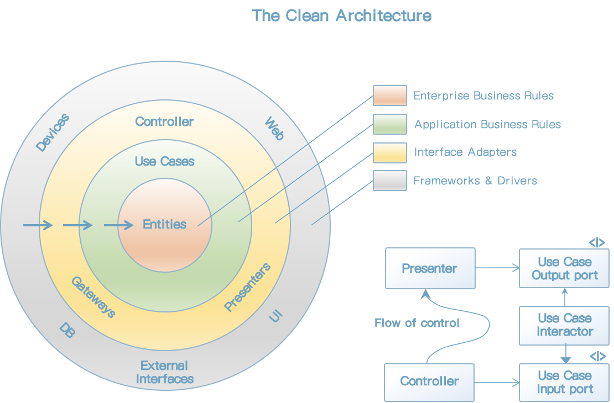


## 의존성 규칙

위의 그림에서 안으로 들어갈수록 고수준의 소프트웨어가 된다. 바깥쪽 원은 매커니즘이고, 안쪽 원은 정책이다.

이러한 아키텍처가 동작하도록 하는 가장 중요한 규칙은 의존성 규칙이다.

> 소스 코드 의존성은 반드시 안쪽으로, 고수준의 정책을 행해야 한다.

내부의 원에 속한 요소는 외부의 원에 속한 어떤 것도 알지 못한다. 


### 엔티티

엔티티는 전사적인 핵심 업무 규칙을 캡슐화한다. 

엔티티는 업무 객체가 되고 고수준인 규칙을 캡슐화한다. 외부의 무언가가 변경되더라도 엔티티가 변경될 가능성은 지극히 낮다. 


### 유스케이스

유스케이스 계층의 소프트웨어는 애플리케이션에 특화된 업무 규칙을 포함한다. 유스케이스는 엔티티로 들어오고 나가는 데이터 흐름을 조정하며 엔티티의 업무 규칙을 사용해서 유스케이스의 목적을 달성하도록 이끈다.

이 계층에서 발생한 변경이 엔티티에 영향을 줘서는 안된다. 또한 데이터베이스, UI 또는 여타 프레임워크와 같은 외부 요소에서 발생한 변경이 이 계층에 영향을 줘서도 안된다.


### 인터페이스 어댑터

인터페이스 어댑터 계층은 일련의 어댑터들로 구성된다. 프레젠터, 뷰, 컨트롤러는 모두 인터페이스 어댑터 계층에 속한다. 


### 프레임워크와 드라이버

일반적으로 데이터베이스나 웹 프레임워크 같은 프레임워크나 도구들로 구성된다.


### 원은 네 개여야만 하나?

항상 네 개만 사용해야 한다는 규칙은 없다. 하지만 어떤 경우에도 의존성 규칙은 적용된다. 


### 경계 횡단하기

그림 22.1의 우측 하단 다이어그램에 원의 경계를 횡단하는 방법을 보여준 예시가 있다. 제어 흐름은 컨트롤러에서 시작해서, 유스케이스를 지난 후, 프레젠터에서 실행되면서 마무리 된다.

제어흐름과 의존성 방향이 반대여야 하는경우 대체로 의존성 역전 원칙을 사용하여 해결한다. 

예를 들어 유스케이스가 프레젠터를 호출해야 한다고 가정해보자. 직접 호출해 버리면 의존성 규칙을 위배하기 때문에 유스케이스가 내부 원의 인터페이스를 호출하도록 하고, 외부 원의 프레젠터가 그 인터페이스를 구현하도록 만든다.


### 경계를 횡단하는 데이터는 어떤 모습인가?

경계를 가로지르는 데이터는 흔히 간단한 데이터 구조로 이루어져 있다. 경계를 가로질러 데이터를 전달할 때, 데이터는 항상 내부의 원에서 사용하기에 가장 편리한 형태를 가져야만 한다.


### 전형적인 시나리오


### 결론


# 23장 프레젠터와 험블 객체

## 험블 객체 패턴

헙블 객체 패턴은 디자인 패턴으로, 테스트하기 어려운 행위와 테스트하기 쉬운 행위를 단위 테스트 작성자가 분리하기 쉽게 하는 방법으로 고안되었다. 행위들을 두 개의 모듈 또는 클래스로 나눈다. 이들 모듈 중 하나가 험블(humble)이다. 가장 기본적인 본질은 남기고, 테스트하기 어려운 행위를 모두 험블 객체로 옮긴다. 나머지 모듈에는 험블 객체에 속하지 않은, 테스트하기 쉬운 행위를 모두 옮긴다.


## 프레젠터와 뷰

뷰는 험블 객체이고 테스트하기 어렵다. 


# 24장 부분적 경계


# 25장 계층과 경계


# 26장  메인(Main) 컴포넌트


# 27장 '크고 작은 모든' 서비스들

서비스 지향 '아키텍처'와 마이크로서비스 '아키텍처'는 최근에 큰 인기를 끌고 있는 이유는 다음과 같다.

* 서비스를 사용하면 상호 결합이 철저하게 분리되는 것처럼 보인다. 나중에 보겠지만, 이는 일부만 맞는 말이다.
* 서비스를 사용하면 개발과 배포 독립성을 지원하는 것처럼 보인다. 나중에 보겠지만, 이 역시도 일부만 맞는 말이다.


## 서비스 아키텍처?

서비스를 사용하다는 것이 아키텍처에 해당하는지 생각해보자. 이 개념은 사실이 아니다. 시스템 아키텍처는 의존성 규칙을 준수하며 고수준 정첵을 저수준의 세부사항으로부터 분리하는 경계에 의해 정의된다. 

모든 서비스가 아키텍처 관점에서 중요해야만 하는 것은 아니다. 기능을 프로세스나 플랫폼에 독립적이 되게끔 서비스들을 생성하면 의존성 규칙 준수 여부와 상관없이 큰 도움이 될 때가 많다. 그러나 서비스 그자체로는 아키텍처를 정의하지 않는다.

모노리틱 시스템이나 컴포넌트 기반 시스템에서 아키텍처를 정의하는 요소는 바로 의존성 규칙을 따르며 아키텍처 경계를 넘나드는 함수 호출들이다.


## 서비스의 이점

### 결합 분리의 오류

시스템을 서비스들로 분리함으로써 얻는 장점은 서비스 결합이 분리된다는 점이다. 각 서비스는 다른 프로세서에서 실행된다. 따라서 서비스는 다른 서비스의 변수에 직접 접근할 수 없다. 

그렇지만 꼭 그런 것만은 아니다. 서비스는 개별 변수 수준에서는 각각 결합이 분리된다. 하지만 프로세서 내의 공유자원 때문에 결합될 가능성이 여전히 존재한다. 

예를 들어 서비스 사이를 오가는 데이터 레코드에 새로운 필드를  추가한다면 이 필드를 사용해 동작하는 모든 서비스는 반드시 변경되어야 한다. 또한 이 서비스들을 이 필드에 담긴 데이터를 해석하는 방식을 사전에 완벽하게 조율해야 한다. 


### 개발 및 배포 독립성의 오류

서비스를 사용할때 얻는 이점 줌 하나는 전담팀이 서비스를 소유하고 운영한다는 점이다. 데브옵스 전략의 일환으로 전담팀에서 각 서비스를 작성하고, 유지보수하며, 운영하는 책임을 질 수 있다. 이러한 개발 및 배포 독립성은 확장 가능한 것으로 간주된다. 대규모 엔터프라이즈 시스템을 독립적으로 개발하고 배포 가능한 수십, 수백, 수천 개의 서비스들을 이용하여 만들 수 있다고 믿는다. 시스템의 개발, 유지보수, 운영 또한 비슷한 수의 독립적인 팀 단위로 분할할 수 있다고 여긴다. 

이러한 믿음에도 어느 정도 일리가 있지만, 극히 일부일 뿐이다. 첫째로, 대규모 엔터프라이즈 시스템은 서비스 기반 시스템 이외에도 모노리틱 시스템이나 컴포넌트 기반 시스템으로도 구축할 수 있다는 사실은 역사적으로 증명되어 왔다. 따라서 서비스는 확장 가능한 시스템을 구축하는 유일한 선택지가 아니다.

둘째, '결합 분리의 오류'에 따르면 서비스라고 해서 항상 독립적으로 개발하고, 배포하며, 운영할 수 있는 것은 아니다. 데이터의 행위에서 어느 정도 결합되어 있다면 결합된 정도에 맞게 개발, 배포, 운영을 조정해야만 한다.


## 야옹이 문제

택시 통합 시스템 - 고객은 승차시간, 비용, 고급 택시 여부, 운전사 경력 등 다양한 기준에 따라 택시를 선택할 수 있다고 가정하자.

확장 가능한 시스템을 구축하고 싶었기에, 수많은 작은 마이크로 시비스를 기반으로 구축하기로 결정했다. 개발팀 직원을 많은 소규모 팀으로 세분화했고, 각 팀이 팀 규모에 맞게 적당한 수의 서비스를 개발하고, 유지보수하며, 운영하는 책임을 지도록 했다.

다이어그램은 가상의 아키텍트가 서비스를 배치하여 이 애플리케이션을 어떻게 구현했는지 보여준다. TaxiUI서비스는 고객을 담당하며 고객은 모바일 기기를 이용해서 택시를 호출한다. TaxiFinder 서비스는 여러 TaxiSupplier의 현황을 검토하여 사용자에게 적합한 택시 후보들을 선별한다. TaxiFinder 서비스는 해당 사용자에 할당된 단기 데이터 레코드에 후보 택시들의 정보를 저장한다. TaxiSelector 서비스는 사용자가 지정한 비용, 시간, 고급 여부 등의 조건을 기초로 후보 택시 중에서 적합한 택시를 선택한다. 이제 TaxiSelector 서비스가 해당 택시를 TaxiDispatcher 서비스로 전달하면, TaxiDispatcher 서비스는 해당 택시에 배차 지시를 한다.


[그림 27.1] 택시 통합 서비스를 구현하기 위해 배치된 서비스들


이 시스템을 일년 이상 운영해왔다. 어느날 마케팅 부서에서 개발팀과 미팅을 잡는다. 이 미팅에서 마케터들은 도시에 야옹이를 배달하는 서비스를 제공하겠다는 계획을 발표한다. 

야옹이 배달 주문이 오면, 근처의 택시가 선택되고 승차 지점 중 한 곳에서 야옹이를 태운 후, 올바른 주소로 야옹이를 배달해야 한다. 

당연하지만, 어떤 운전자는 고양이 알러지가 있을 수 있기 때문에, 해당 운전자는 이 서비스에서 제외되어야 한다. 또한 일반 택시 승객 역시 비슷한 알러지를 일으킬 수 있으므로, 배차를 신청한 고객이 알러지가 있다고 밝힌 경우에는 지난 3일 사이에 야옹이를 배달했던 차량은 배차되지 않아야 한다.

이 기능을 구현하려면 이들 서비스 중 어디를 변경해야 할까? 다시 말해 이 서비스들은 모두 결합되어 있어서 독립적으로 개발하고 배포하거나 유지될 수 없다.

이게 바로 횡단 관심사가 지닌 문제다. 


## 객체가 구축하다

컴포넌트 기반 아키텍처에서는 이 문제를 어떻게 해결했을까? SOLID 설계 원칙을 잘 들여다보면, 다형적으로 확장할 수 있는 클래스 집합을 생성해 새로운 기능을 처리하도록 함을 알 수 있다. 

그림 27.2의 다이어그램은 이 전략을 보여준다. 이 다이어그램의 클래스들은 그림 27.1에서 보여준 서비스들과 거의 일치한다. 하지만 경계를 주목하자. 또한 의존성들이 의존성 규칙을 준수한다는 점도 주목하자.

원래 서비스의 로직 중 대다수가 이 객체 모델의 기반 클래스들 내부로 녹아들었다. 하지만 배차에 특화된 로직 부분은 Rides 컴포넌트로 추출되고, 야옹이에 대한 신규 기능은 Kittens 컴포넌트에 들어갔다. 이 두 컴포넌트는 기존 컴포넌트들에 있는 추상 기반 클래스를 템플릿 메서드나 전략 패턴 등을 이용해서 오버라이드 한다. 

두 개의 신규 컴포넌트인 Rides와 Kittens가 의존성 규칙을 준수한다는 점에 다시 한번 주목하자. 또한 이 기능들을 구현하는 클래스들은 UI의 제어하에 팩토리가 생성한다는 점에도 주목하자.

이 전략을 따르더라도 야옹이 기능을 구현하려면 TaxiUI는 어쩔 수 없이 변경해야 한다. 하지만 그 외의 것들은 변경할 필요가 없다.


[그림 27.2] 객체 지향 방식으로 횡단 관심사를 처리하기

 

## 컴포넌트 기반 서비스

이제 물어봐야 할 질문은 "서비스에도 이렇게 할 수 있을까?"다. 그 대답은 물론 "예"다.

자바의 경우, 서비스를 하나 이상의 jar 파일에 포함되는 추상 클래스들의 집합이라고 생각하라. 새로운 기능 추가 혹은 기능 확장은 새로운 jar 파일로 만든다. 이때 새로운 jar 파일을 구성하는 클래스들은 기존 jar 파일에 정의된 추상 클래스들을 확장해서 만들어진다. 그러면 새로운 기능 배포는 서비스를 재배포하는 문제가 아니라, 서비스를 로드하는 경로에 단순히 새로운 jar 파일을 추가하는 문제가 된다. 다시 말해 새로운 기능을 추가하는 행위가 개방 폐쇄 원칙을 준수하게 된다.

그림 27.3의 서비스 다이어그램은 이 구조를 보여준다. 서비스들의 존재는 이전과 달라진 게 없지만, 각 서비스의 내부는 자신만의 컴포넌트 설계로 되어 있어서 파생 클래스를 만드는 방식으로 신규 기능을 추가할 수 있다. 파생 클래스들은 각자의 컴포넌트 내부에 놓인다.

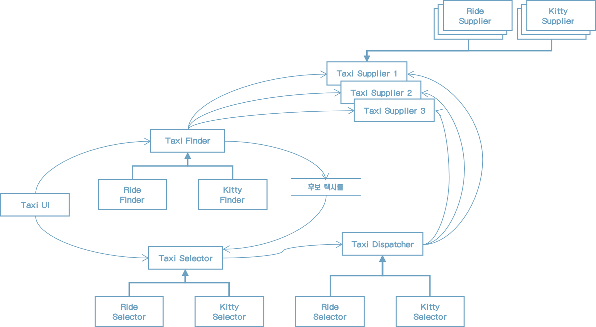

[그림 27.3] 각 서비스의 내부는 각자의 방식대로 컴포넌트를 설계할 수 있으며, 파생 클래스를 만들어서 신규 기능을 추가할 수 있다.


## 횡단 관심사

지금까지 배운 것은 아키텍처 경계가 서비스 사이에 있지 않다는 사실이다. 오히려 서비스를 관통하며, 서비스를 컴포넌트 단위로 분할한다.

모든 주요 시스템이 직면하는 횡단 관심사를 처리하려면 그림 27.4의 다이어그램에서 보듯이, 서비스 내부는 의존성 규칙도 준수하는 컴포넌트 아키텍처로 설계해야 한다. 이 서비스들은 시스템의 아키텍처 경계를 정의하지 않는다. 아키텍처 경계를 정의하는 것은 서비스 내에 위치한 컴포넌트다.

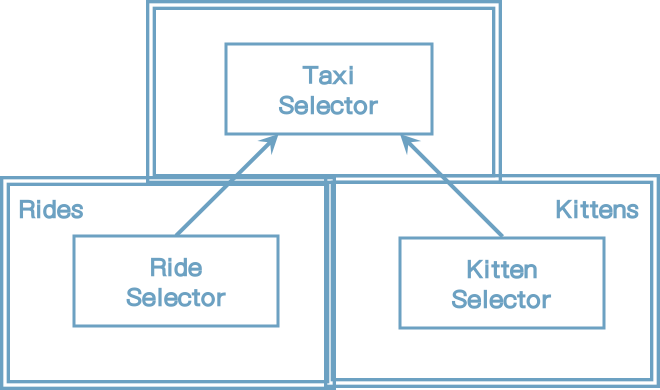

[그림 27.4] 서비스 내부는 의존성 규칙도 준수하는 컴포넌트 아키텍처로 설계해야 한다.


## 결론

서비스는 시스템의 확장성과 개발 가능성 측면에서 유용하지만, 그 자체로는 아키텍처적으로 그리 중요한 요소는 아니다. 시스템의 아키텍처는 시스템 내부에 그어진 경계와 경계를 넘나드는 의존성에 의해 정의된다. 시스템의 구성 요소가 통신하고 실행되는 물리적인 메커니즘에 의해 아키텍처가 정의되는 것은 아니다.

서비스는 단 하나의 아키텍처 경계로 둘러싸인 단일 컴포넌트로 만들 수 있다. 혹은 여러 아키텍처 경계로 분리된 다수의 컴포넌트로 구성할 수도 있다. 드물게는 클라이언트와 서비스가 강하게 결합되어 아키텍처적으로 아머런 의미가 없을 때도 있다.


# 28장 테스트 경계

테스트는 시스템의 일부이며, 아키텍처에도 관여한다.


## 시스템 컴포넌트인 테스트

테스트는 아키텍처에서 가장 바깥쪽 원으로 생각할 수 있다. 

테스트는 독립적으로 배포 가능하다. 


## 테스트를 고려한 설계

GUI는 변동성이 크다. GUI로 시스템을 조작하는 테스트 스위트는 분명 깨지기 쉽다. 따라서 시스템과 테스트를 설계할 때, GUI를 사용하지 않고 업무 규칙을 테스트 할 수 있게 해야 한다.


# 29장 클린 임베디드 아키텍처


# 30장 데이터베이스는 세부사항이다.

아키텍처 관점에서 데이터베이스는 엔티티가 아니다. 즉, 데이터베이스는 세부사항이라서 아키텍처의 구성요소 수준으로 끌어올릴 수 없다. 소프트웨어 시스템의 아키텍처와 데이터베이스의 관계를 건물로 비교하면 건물의 아키텍처와 문 손잡이의 관계와 같다.

데이터베이스는 데이터에 접근할 방법을 제공하는 유틸리티다. 아키텍처 관점에서 보면 이러한 유틸리티는 저수준의 세부사항(매커니즘)일 뿐이라서 아키텍처와는 관련이 없다.


## 관계형 데이터베이스

관계형 데이터베이스의 기술이 얼마나 뛰어나든, 유용하든, 아니면 수학적으로 견고하든, 결국은 그저 기술일 뿐이다. 그리고 이는 관계형 데이터베이스가 세부사항임을 뜻한다.

관계형 테이블은 특정한 형식의 데이터에 접근하는 경우에는 편리하지만, 데이터를 테이블에 행 단위로 배치한다는 자체는 아키텍처적으로 볼 때 전혀 중요하지 않다. 애플리케이션 유스케이스는 이러한 방식을 알아서는 안되며 관여해서도 안된다. 데이터가 테이블 구조를 가진다는 사실은 오직 아키텍처의 외부 원에 위치한 최하위 수준의 유틸리티 함수만 알아야 한다.

많은 데이터 접근 프레임워크가 테이블과 행이 객체 형태로 시스템 여기저기에서 돌아다니게 허용하는데, 아키텍처적으로 잘못된 설계다. 이렇게 하면 유스케이스, 업무 규칙, 심지어 UI조차도 관계형 데이터 구조에 결합되어 버린다.


## 데이터베이스 시스템은 왜 이렇게 널리 사용되는가?

오라클, MySQL, SQL 서버가 우위를 차지할 수 있던 이유는 무엇일까? 한마디로 답하자면, 바로 '디스크'때문이었다.

디스크때문에 피해갈 수 없는 시간 지연이라는 점을 완화하기 위해 색인, 캐시, 쿼리 계획 최적화가 필요해졌다. 


## 디스크가 없다면 어떻게 될까?


## 세부사항

데이터베이스는 그저 메커니즘에 불과하며, 디스크 표면과 RAM 사이에서 데이터를 이리저리 옮길 때 사용할 뿐이다. 


## 하지만 성능은?

성능은 아키텍처와 관련된 관심사가 아닌가? 당연히 아키텍처적인 관심사다. 하지만 데이터 저장소의 측면에서 성능은 완전히 캡슐화하여 업무 규칙과는 분리할 수 있는 관심사다. 데이터 저장소에서 데이터를 빠르게 넣고 뺄수 있어야 하는 것이 맞지만, 이는 저수준의 관심사다. 이 관심사는 저수준의 데이터 접근 메커니즘 단에서 다룰 수 있다.


## 개인적인 일화


# 31장 웹은 세부사항이다.


## 끝없이 반복하는 추

IT 역사 전체로 시야를 넓히면 웹은 아무것도 바꾸지 않았다. 웹은 우리가 발버둥치면서 생기는 여느 수많은 진동 중 하나에 불과하다. 이 진동은 우리가 태어나기 전에도 있어 왔고, 우리가 은퇴한 뒤에도 지속될 것이다.

아키텍트로서 우리는 멀리 내다봐야 한다. 이 진동은 그저 핵심 업무 규칙의 중심에서 밀어내고 싶은 단기적인 문제일 뿐이다.

Q 회사 이야기를 한번 보자. Q사는 상당히 인기를 끈 개인용 재무 시스템을 개발했다. 이어서 출시된 버전에서 웹 브라우저에서 보이고 동작하도록 변경했다. 도대체 어떤 마케팅 천재가 데스크톱에서 실행되는 개인용 재무 소프트웨어가 웹브라우저와 같은 룩앤필을 제공해야만 한다고 결정했단 말인가?

이제 자신이 Q사의 소프트웨어 아키텍트라고 상상해보자. 그리고 마케팅 천재가 웹으로 변경해야 한다고 설득하는 상황을 상상해보라. 무슨일을 해야 하나?

업무 규칙을 UI로부터 분리했어야 한다. 


## 요약

GUI는 세부사항이다. 웹은 GUI다. 따라서 웹은 세부사항이다.

웹은 입출력 장치이다.


# 32장 프레임워크는 세부사항이다


## 프레임워크 제작자

대다수의 프레임워크 제작자는 커뮤니티에 도움이 되기를 바라는 마음에 자신의 작업물을 무료로 제공한다. 칭찬 받을 일이다. 하지만 이들은 당신이 풀어야 할 특별한 관심사를 염두에 두지 않는다. 프레임워크 제작자는 당신을 알지 못하며, 당신이 풀어야 할 문제도 알지 못하기 때문이다.

프레임워크 제작자는 자신이 해결해야 할 고유한 문제나 자신의 동료와 친구들의 문제를 알고 있다. 그리고 그러한 문제들을 해결하기 위해 프레임워크를 만든다. 당신의 문제를 해결하기 위해서가 아니다.

물론 당신의 문제는 프레임워크가 풀려는 문제와 꽤 많이 겹칠 것이다.


## 혼인 관계의 비대칭성

당신은 프레임워크를 위해 대단히 큰 헌신을 해야 하지만, 프레임워크 제작자는 당신을 위해 아무런 헌신도 하지 않는다.


## 위험 요인

고려해야 할 위험 요인들은 다음과 같다.

* 프레임워크의 아키텍처는 그다지 깔끔하지 않은 경우가 많다. 의존성 규칙을 위반하는 경향이 있다. 업무 객체를 만들 때, 프레임워크 제작자는 자신의 코드를 상속할 것을 요구한다. 하지만 한번 안으로 들어가버리면 다시는 원 밖으로 나오지 않을 것이다. 결혼반지는 이미 당신의 손가락에 끼워졌고, 다시는 빼지 못할 것이다.
* 프레임워크는 애플리케이션의 초기 기능을 만드는 데는 도움이 될 것이다. 하지만 제품이 성숙해지면서 프레임워크가 제공하는 기능과 틀을 벗어나게 될 것이다.
* 프레임워크는 당신에게 도움되지 않는 방향으로 진화할 수도 있다.


## 해결책

해결책은 무엇인가?

> 프레임워크와 결혼하지 말라!

프레임워크가 아키텍처의 안쪽 원으로 들어오지 못하게 하라. 

업무 객체는 절대로 스프링에 대해 알아서는 안된다.


## 이제 선언합니다.

정말로 결혼해야만 하는 프레임워크도 존재한다. 자바를 사용한다면 표준 라이브러리와 반드시 결혼해야 한다.


# 33장 사례 연구: 비디오 판매


# 34장 빠져 있는 장

소프트웨어는 올바르게 정의된 경계, 명확한 책임, 그리고 통제된 의존성을 가진 클래스와 컴포넌트로 구성될 것이다. 하지만 악마는 디테일(구현 세부사항)에 있는 법이며, 이점을 심사숙고 하지 않는다면 마지막 고비에 걸려 넘어지기 십상일 것이다.

예를 들어 온라인 서점을 구축하고 있으며, 고객이 주문 상태를 조회할 수 있어야 한다는 유스케이스를 구현해야 한다고 해보자.


## 계층 기반 패키지

가장 단순한 설계 방식은 전통적인 수평 계층형 아키텍처다. 기술적인 관점에서 해당 코드가 하는 일에 기반해 그 코드를 분할한다. 이 방식을 '계층 기반 패키지'라고 부른다.

이 전형적인 계층형 아키텍처에는  웹, '업무 규칙', 영속성 코드를 위해 계층이 각각 하나씩 존재한다. 다시 말해 계층이라는 얇은 수평 조각으로 나뉘며, 각 계층은 유사한 종류의 것들을 묶는 도구로 사용된다. '엄격한 계층형 아키텍처'의 경우 계층은 반드시 바로 아래 계층에만 의존해야 한다.

* OrdersController: 웹 컨트롤러이며, 웹 기반 요청을 처리한다. Spring MVC 컨트롤러 등이 여기 해당한다.
* OrdersService: 주문 관련 '업무 규칙'을 정의하는 인터페이스
* OrdersServiceImpl: OrdersService의 구현체
* OrdersRepository: 영구 저장된 주문정보에 접근하는 방법을 정의하는 인터페이스
* JdbcOrdersRepository: OrdersRepository 인터페이스의 구현체

이런 방식은 엄청난 복잡함을 겪지 않고도 무언가를 작동시켜 주는 아주 빠른 방법이다. 문제는 소프트웨어가 복잡해지기 시작하면, 머지 않아 큰 그릇 세개만으로 모든 코드를 담기에 부족하다는 사실을 깨닫고 더 잘게 모듈화해야 할지를 고민하게 될 것이다.

엉클 밥이 이미 언급했듯이, 계층형 아키텍처는 업무 도메인에 대해 아무것도 말해주지 않는다는 문제도 있다. 


## 기능 기반 패키지

코드를 조직화하는 또 다른 선택지로 '기능 기반 패키지' 구조도 있다. 이는 서로 연관된 기능, 도메인 개념 또는 (도메인 주도 설계 용어를 사용한다면) Aggregate Root에 기반하여 수직의 얇은 조각으로 코드를 나누는 방식이다. 모든 타입이 하나의 자바 패키지에 속하며 패키지 이름은 그 안에 담긴 개념을 반영해 짓는다.

모두가 단 하나의 패키지에 속하게 된다. 이는 '계층 기반 패키지'를 아주 간단히 리팩터링 한 형태지만, 이제 코드의 상위 수준 구조가 업무 도메인에 대해 무언가를 알려주게 된다. 드디어 이 코드가 웹, 서비스, 리포지토리가 아니라 주문과 관련된 무언가를 한다는 걸 볼 수 있다.

또 다른 이점으로, '주문 조회하기' 유스케이스가 변경될 경우 변경해야 할 코드를 모두 찾는 작업이 더 쉬워질 수 있다. 변경해야할 코드가 여러 군데 퍼져 있지 않고 모두 한 패키지에 담겨 있기 때문이다.

나는 소프트웨어 개발팀이 수평적 계층화(계층 기반 패키지)의 문제를 깨닫고 수직적 계층화(기능 기반 패키지)로 전환하는 걸 자주 목격했다. 


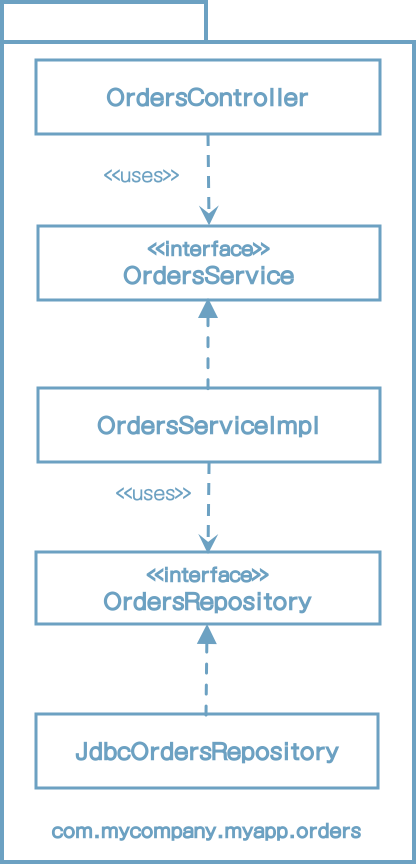


## 포트와 어댑터

엉클 밥에 따르면, '포트와 어댑터' 혹은 '육각형 아키텍처', '경계, 컨트롤러, 엔티티'등의 방식으로 접근하는 이유는 업무/도메인에 초점을 둔 코드가 프레임워크나 데이터베이스 같은 기술적인 세부 구현과 독립적이며 분리된 아키텍처를 만들기 위해서다. '내부'(도메인)와 '외부'(인프라)로 구성됨을 흔히 볼 수 있다.


'내부'영역은 도메인 개념을 모두 포함하는 반면, '외부'영역은 외부 세계(예: UI, 데이터베이스, UI, 서드파티 통합)와의 상호작용을 포함한다. 여기서 주요 규칙은 바로 '외부'가 '내부'에 의존하며, 절대 그 반대로는 안된다는 점이다. 아래는 '주문 조회하기' 유스케이스를 이 방식으로 구현한 모습이다.


여기에서 com.mycompany.myapp.domain 패키지가 '내부'이며, 나머지 패키지는 모두 '외부'다. 이전 다이어그램의 OrdersRepository가 Orders라는 간단한 이름으로 바뀌었음을 눈치챘을 것이다. 도메인 주도 설계에서는 '내부'에 존재하는 모든 것의 이름은 반드시 '유비쿼터스 도메인 언어' 관점에서 기술하라고 조언한다. 바꿔 말하면 도메인에 대해 논의할 때 우리는 '주문'에 대해 말하는 것이지, '주문 리포지토리'에 대해 말하는 것이 아니다.


## 컴포넌트 기반 패키지

계층형 아키텍처의 목적은 기능이 같은 코드끼리 서로 분리하는 것이다. 웹 관련 코드는 업무 로직으로 분리하고 업무로직은 다시 데이터 접근으로부터 분리한다. 구현관점에서 각 계층은 일반적으로 자바 패키지에 해당한다. 

예를 들어 팀에서 신규 인력을 고용하여 주문과 관련된 또 다른 유스케이스를 구현하라고 지시했다고 가정하자. OrdersController 클래스에 OrdersRepository 인터페이스를 의존성으로 주입하여 만들수도 있다.


의존성 화살표는 아래를 향하지만 OrdersController가 OrdersService를 우회하고 있다.

여기에서 우리에게 필요한 지침으로 "웹 컨트롤러는 절대로 리포지토리에 직접 접근해서는 안된다"와 같은 원칙이 필요하다. 

이런 위반사례를 정적 분석도구를 사용하여 체크할 수도 있다. 다소 조잡하지만 효과가 있다.

"컴포넌트 기반 패키지"를 도입해야하는 이유는 바로 이 때문이다.

본질적으로 이 접근법에서는 '업무 로직'과 영속성 관련 코드를 하나로 묶는데, 이 묶음을 나는 '컴포넌트'라고 부른다.


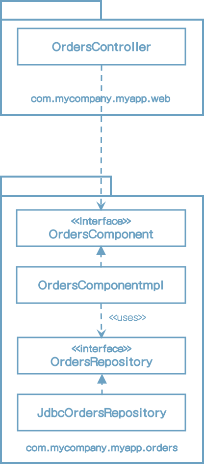


> 컴포넌트는 배포 단위다. 컴포넌트는 시스템의 구성 요소로, 배포할 수 있는 가장 작은 단위다. 자바의 경우 jar파일이 컴포넌트다.


## 조직화 vs. 캡슐화

자바 애플리케이션에서 모든 타입을 public으로 지정한다면, 패키지는 단순히 조직화를 위한 메커니즘으로 전략하여 캡슐화를 위한 메커니즘이 될 수 없다. Public 타입을 코드 베이스 어디에서도 사용할 수 있다면 패키지를 사용하는데 이점이 거의 없다. 사실상 패키지를 사용하지 않는 것과 같다. Public 지시자를 과용하면 이 장의 앞에서 제시한 네 가지 아키텍처 접근법은 본질적으로 완전히 같아진다.


네 개의 아키텍처 접근법이 모두 동일하다.


첫 번째, '계층 기반 패키지' 접근법에서 OrdersService와 OrdersRepository 인터페이스는 외부 패키지의 클래스로 부터 자신이 속한 패키지 내부로 들어오는 의존성이 존재하므로 public으로 선언되어야 한다. 반면 구현체 클래스 (OrdersServiceImpl과 JdbcOrdersRepository)는 더 제한적으로 선언할 수 있다. (패키지 protected)

두 번째, '기능 기반 패키지' 접근법에서는 OrdersController가 패키지로 들어올 수 있는 유일한 통로를 제공하므로 나머지는 모두 패키지 protected로 지정할 수 있다. 

세 번째, '포트와 어댑터' 접근법의 경우 OrdersService와 Orders 인터페이스는 외부로 들어오는 의존성을 가지므로 public을 지정해야 한다.

마지막으로 '컴포넌트 기반 패키지' 접근법에서는 컨트롤러에서 Orders Component 인터페이스로 향하는 의존성을 가지며 그 외의 모든 것은 패키지 protected로 지정할 수 있다. public 타입이 적으면 적을수록 필요한 의존성의 수도 적어진다.


옅은 색으로 표시한 타입은 더 제한적인 접근 지시자를 사용할 수 있다.


## 다른 결합 분리 모드

프로그래밍 언어가 제공하는 방법 외에도 소스코드 의존성을 분리하는 방법은 존재할 수 있다. 예를 들어 자바에는 OSGi같은 모듈 프레임워크나 자바 9에서 제공하는 새로운 모듈 시스템이 있다. 모듈 시스템을 제대로 사용하면 public 타입과 외부에 공표할 타입을 분리할 수 있다.

다른 선택지로는 소스 코드 수준에서 의존성을 분리하는 방법도 있다.

포트와 어댑터를 예를 들자면

* 업무와 도메인용 소스 코드
* 웹용 소스코드
* 데이터 영속성용 소스코드

마지막 두 소스코드 트리는 업무와 도메인 코드에 대해 컴파일 시점에 의존성을 가지며, 업무와 도메인 코드 자체는 웹이나 데이터 영속성 코드에 대해서는 아무것도 알지 못한다. 구현 관점에서 이렇게 분리하려면 빌드 도구를 사용해서 모듈이나 프로젝트가 서로 분리되도록 구성해야 한다.

하지만 이는 너무 이상적인 해결책이다. 현실에서 소스코드를 이처럼 나누다 보면 성능, 복잡성, 유지보수 문제가 생기기 때문이다.

포트와 어댑터 접근법을 적용할 때는 이보다 간단한 방법을 사용하기도 하는데, 단순히 소스코드 트리를 두개만 만드는 것이다.

* 도메인 코드('내부')
* 인프라 코드('외부')


