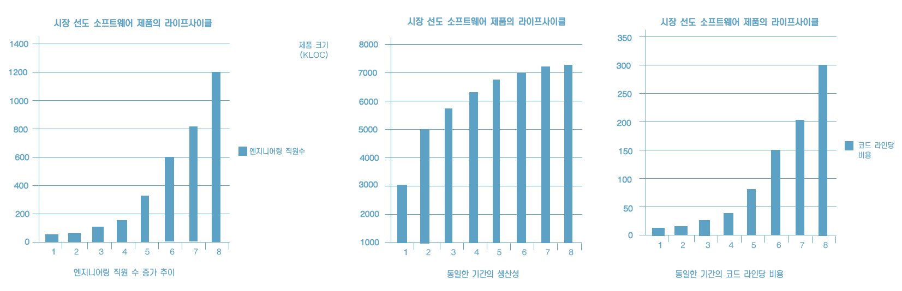
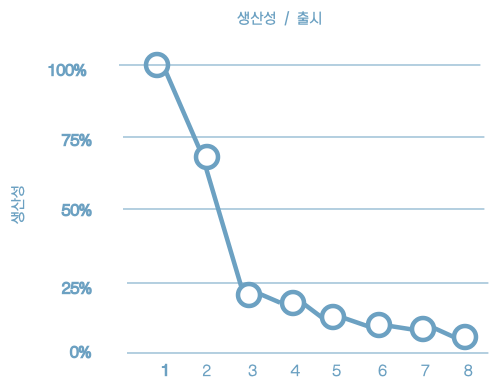
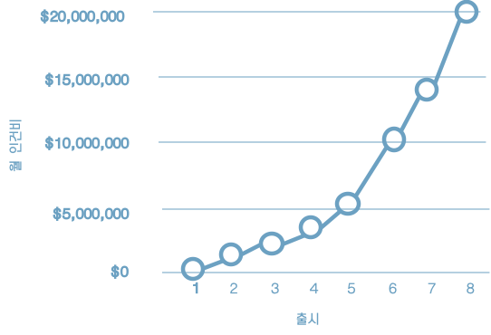

# 1장 설계와 아키텍처란

**설계와 아키텍처에는 어떤 차이가 있는가?**
우선 첫째로 주장하고 싶은 바는 둘 사이에는 차이가 없다는 점이다. 아무런 차이가 없다.

**'아키텍처'**는 저수준의 세부사항과는 분리된 고수준의 무언가를 가리킬 때 흔히 사용되는 반면, **'설계'**는 저수준의 구조 또는 결정사항 등을 의미할 때가 많다.
하지만 아키텍트가 실제로 하는 일을 살펴보면 이러한 구분은 무의미하다.

새로운 집을 설계하는 아키텍트가 있다고 하자. 이 집의 아키텍처는 아마 집의 형태, 외관, 입면도, 공간이나 방배치이며,  콘센트, 전등 스위치, 전등의 세부사항도 등 모두 어디에 위치하는지를 도면에서 알 수 있다. 다시 말해, 모든 고수준의 결정사항을 지탱하는 모든 세부사항을 자세하게 확인할 수 있다.

소프트웨어 설계도 마찬가지다. 저수준의 세부사항과 고수준의 구조는 모두 소프트웨어 전체 설계의 구성요소다. 개별로는 존재할 수 없고, 실제로 이 둘을 구분 짓는 경계는 뚜렷하지 않다.

## 목표는?

좋은 소프트웨어의 목표는?

> 소프트웨어 아키텍처의 목표는 필요한 시스템을 만들고 유지보수하는 데 투입되는 인력을 최소화하는 데 있다.

설계 품질을 재는 척도는 고객의 요구를 만족시키는 데 드는 비용을 재는 척도와 다름없다. 이 비용이 낮을 뿐만 아니라 시스템의 수명이 다할 때까지 낮게 유지할 수 있다면 좋은 설계라고 말할 수 있다. 새로운 기능을 출시할 때마다 비용이 증가한다면 나쁜설계다. 좋은 설계란 이처럼 단순명료하다.

## 사례 연구

먼저 엔지니어링 직원수가 늘어나는 추세를 사펴보자. 이러한 추세를 굉장히 고무적인 상황으로 여길 것이다.

두 번째는 생산성을 코드 라인 수로만 측정했다. 매번 새로운 기능을 출시할 때마다 개발자의 수는 지속적으로 증가했지만, 코드 생산성은 마치 한 곳으로 수렴하는 것처럼 보인다.

세 번째는 코드 한 라인당 비용을 나타낸다. 이 추세로는 오래 갈 수 없다. 지금 당장의 수익이 중요치 않다. 결국 이러한 비용 곡선은 사업 모델의 수익을 엄청나게 고갈시키며, 회사의 성장을 멈추게 하거나 완전히 망하게 만든다.

### 엉망진창이 되어 가는 신호

지금 보고 있는 것은 엉망진창이 되어 가는 신호다.

개발자의 생산성은 거의 100%에서 시작했지만, 출시할 때마다 하락한다. 네 번째 출시에 다다르면 확실히 생산성은 거의 바닥을 치고 결국에는 0으로 수렴한다.

그림) 출시별 생산성

개발자 입장에서 보자면 이러한 현상은 지독한 절망감을 안겨주는데, 모두가 열심히 일하고 있기 때문이다. 전력을 기울이지 않는 개발자는 없다.

개발자가 초인적인 노력을 기울이고, 잔업을 하며, 헌신함에도 불구하고 더 이상 진척이 없는 상황에 처하게 된다. 개발자의 노력은 기능 개발 보다는 엉망이 된 상황에 대처하는데 소모되기 시작한다. 심지어 사소한 기능을 추가하는 일도 그저 엉망이 된 코드를 이곳에서 저곳으로, 다시 다음 곳으로 이동하는 반복 작업으로 변질된다. 개발자들이 쏟은 노력의 가치가 결국 보잘것없게 된다.

### 경영자의 시각

첫번째 출시에서는 매월 수십만 달러의 인건비, 여덟 번째 출시는 월 2천만 달러가 되고, 계속 증가하는 추세다.

그림) 출시별 월 인건비

초기 출시에는 매월 수십만 달러의 비용으로 많은 기능을 탑재할 수 있었다. 하지만 마지막 출시에는 2천만 달러를 들이고도 얻은 게 거의 없다. 어떤 CFO라도 이 두 그래프를 본다면 참사를 미연에 방지하기 위한 조치를 지금 당장 취해야 한다고 할 것이다.

하지만 어떤 조치를 취해야 하나? 경영자는 무엇을 할 수 있는가?

### 무엇이 잘못되었나?

거의 2600년 전에 이솝은 토끼와 거북이 우화를 지었다. 이 우화의 교훈은 다양한 형태로 언명되어 왔다.

* "느려도 꾸준하면 이긴다."
* "발 빠른 자가 경주에 이기는 것도 아니며, 힘센 자가 싸움에서 이기는 것도 아니다."
* "급할수록 돌아가라"

현대의 개발자는 뼈 빠지게 일을 하지만 그들의 뇌는 잠에 취해있다. <u>훌륭하고 깔끔하게 잘 설계된 코드가 중요하다는 사실을 알고 있는 바로 그 뇌가 잠자고 있다.</u>

개발자는 "코드는 나중에 정리하면 돼. 당장은 시장에 출시하는 게 먼저야!" 라는 흔해 빠진 거짓말에 속는다. 이렇게 속아 넘어간 개발자라면 나중에 코드를 정리하는 경우는 한 번도 없는데, 시장의 압박은 절대로 수그러들지 않기 때문이다. '시장 출시가 먼저'라는 생각을 하는 이유는 바로 뒤에 여러 무리의 경쟁자가 뒤쫓고 있고, 경쟁자보다 앞서 가려면 가능한 한 빠르게 달려야 하기 때문이다.

결국 개발자는 절대로 태세를 전환하지 않는다. 이전에 작성한 코드로 돌아가 정리하는 일이 일어나지 않는데, 바로 다음에 만들어야 할 새로운 기능이 기다리고 있고, 다음 기능, 또 다음 기능, 또 다음 기능이 계속 기다리고 있기 때문이다. 결국 엉망진창이 되고 생산성은 0을 향해 수렴하기 시작한다.

토끼가 자신의 빠르기를 과신한 것과 마찬가지로, 개발자도 생산성을 유지할 수 있다고 자신의 능력을 과신한다. 하지만 엉망진창인 코드가 서서히 쌓이면 개발자 생산성은 차츰 낮아지고, 코드가 엉망이 되는 추세는 절대 멈추거나 수그러들지 않는다. 이대로 진행되면 결국 생산성이 0으로 수렴하는 일은 시간 문제다.

소프트웨어 개발의 단순한 진리

> 빨리 가는 유일한 방법은 제대로 가는 것이다.

이 진실이 경영자의 딜레마에 대한 해답이다. 생산성이 감소되고 비용이 증가하는 현상을 되돌릴 수 있는 유일한 방법은 개발자로 하여금 토끼처럼 과신하려는 믿음을 버리고, 만들어 낸 엉망진창인 코드를 개발자가 책임지도록 하는 것뿐이다.

개발자는 처음부터 다시 시작하여 전체 시스템을 재설계 하는 것이 해답이라고 생각할지도 모른다. 하지만 이 생각 또한 토끼의 말과 다름없다.

> 자신을 과신한다면 재설계하더라도 원래의 프로젝트와 똑같이 엉망으로 내몰린다.

## 결론

<u>소프트웨어 아키텍처를 심각하게 고려할 수 있으려면 좋은 소프트웨어 아키텍처가 무엇인지 이해해야 한다</u>. 비용은 최소화하고 생산성은 최대화 할 수 있는 설계와 아키텍처를 가진 시스템을 만들려면, 이러한 결과로 이끌어 줄 시스템 아키텍처가 지닌 속성을 알고 있어야 한다.

