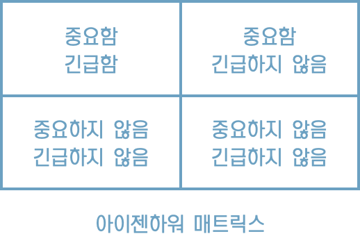

# 2장 두가지 가치에 대한 이야기

* 모든 소프트웨어 시스템은 이해관계자에게 서로 다른 두 가지 가치를 제공하는데, 행위와 구조가 바로 그것이다. 
* 소프트웨어 개발자는 두가지 모두 반드시 높게 유지해야 하는 책임을 진다.
* 불행하게도 개발자는 한 가지 가치에만 집중하고 나머지 가치는 배제하곤 한다.
* 더 안타까운 일은 대체로 개발자가 둘 중 덜 중요한 가치에 집중하여 결국 소프트웨어 시스템이 쓸모없게 된다는 사실이다.

## 행위

* 소프트웨어의 첫번째 가치는 행위다.
* 프로그래머를 고용하는 이유는 이해관계자를 위해 수익을 창출하거나 비용을 절약하도록 만들기 위해서다.
* 많은 프로그래머가 이러한 활동이 자신이 해야 할 일의 전부라고 생각한다.
* 슬픈 일이지만 그들은 틀렸다.

## 아키텍처

* 두번째 가치는 소프트웨어라는 단어와 관련이 있다.

* 소프트웨어 단어는 부드러운(soft) + 제품(ware)이라는 단어의 합성어다.
* 소프트웨어는 '부드러움을 지니도록' 만들어졌다. 쉽게 변경할 수 위해서다.
* 소프트웨어가 가진 본연의 목적을 추구하려면 반드시 '부드러워'야한다. 다시 말해 변경이 쉬워야 한다.
* 소프트웨어 개발 비용의 증가를 결정짓는 주된 요인은 바로 이 변경사항의 범위와 형태의 차이에 있다.

## 더 높은 가치

* 기능인가? 아니면 아키텍처인가? 둘 중 어느 것의 가치가 더 높은가?

* 이 말은 소프트웨어 시스템이 동작하도록 만드는 것이 더 중요한가? 아니면 소프트웨어 시스템을 더 쉽게 변경할 수 있도록 하는 것이 더 중요한가?

* 업무 관리자는 전자가 더 중요하고 개발자도 어느정도 동조하는 태도를 취한다. 하지만 이는 잘못된 태도다.

* 완벽하게 동작하지만 수정이 불가능한 프로그램과 동작은 하지 않지만 변경이 쉬운 프로그램이 있다면 어떤 것을 택하겠는가?

* 업무 관리자에게 변경이 가능한 시스템을 원하는지 묻는다면, 당연히 그렇다고 답할것이다. 물론 현재 기능의 동작여부가 미래의 유연성보다 더 중요하다고 언급을 할 것이다.

* 하지만 추후 업무 관리자의 변경 요청에 '변경 비용이 너무 커서 현실적으로 적용할 수 없다'라고 대답하면 '실질적으로 변경이 불가능한 상태에 처할 때까지 시스템을 방치했다'며 당신에게 화를 낼 가능성이 높다.

## 아이젠하워 매트릭스

* 긴급한 문제가 아주 중요한 문제일 경우는 드물고, 중요한 문제가 몹시 긴급한 경우는 거의 없다는 사실이다.
* 소프트웨어의 첫번째 가치인 행위는 긴급하지만 매번 높은 중요도를 가지는 것은 아니다.
* 소프트웨어의 두번째 가치인 아키텍처는 중요하지만 즉각적인 긴급성을 필요로 하는 경우는 절대 없다.

다음과 같은 우선순위를 매길 수 있다.

1. 긴급하고 중요한
2. 긴급하지는 않지만 중요한
3. 긴급하지만 중요하지 않은
4. 긴급하지도 않고 중요하지도 않음

* 업무 관리자와 개발자가 흔하게 저지르는 실수는 세번째 위치한 항목을 첫번째로 격상시켜 버리는 일이다.
* 다시 말해, 긴급하지만 중요하지 않은 기능과 진짜로 긴급하면서 중요한 기능을 구분하지 못한다.
* 이러한 실패로 인해 시스템에서 중요도가 높은 아키텍처를 무시한 채 중요도가 떨어지는 기능을 선택하게 된다.

> 기능의 긴급성이 아닌 아키텍처의 중요성을 설득하는 일은 소프트웨어 개발팀이 마땅히 책임져야 한다.

## 아키텍처를 위해 투쟁하라

* 회사에서 각팀은 각자 관점의 중요한 부분을 위해 투쟁한다.

* 개발팀도 소프트웨어를 안전하게 보호해야 할 책임이 있으므로 당신의 역할 중 하나이며, 당신의 책무 중 하나다.
* 아키텍처가 후순위가 되면 시스템을 개발하는 비용이 더 많이 들고 일부 또는 전체 시스템에 변경을 가하는 일이 현실적으로 가능해진다.
* 이는 결국 소프트웨어 개발팀이 스스로 옳다고 믿는 가치를 위해 충분히 투쟁하지 않았다는 뜻이다.

