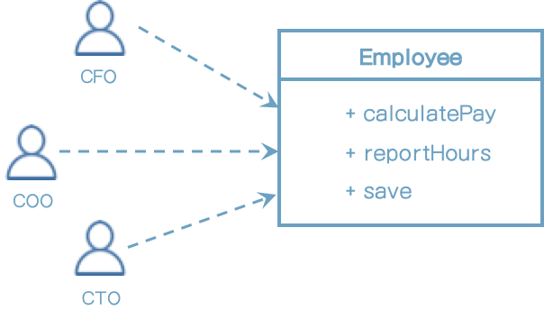
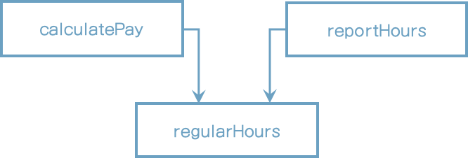
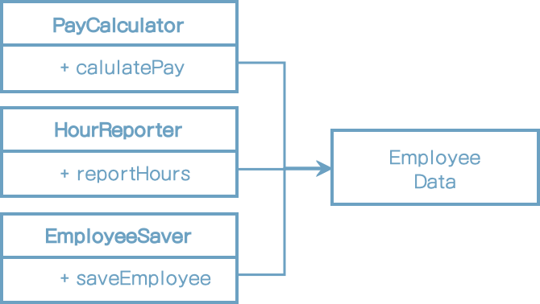
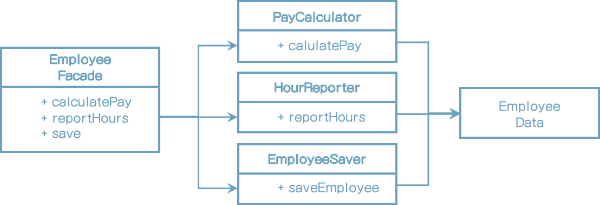
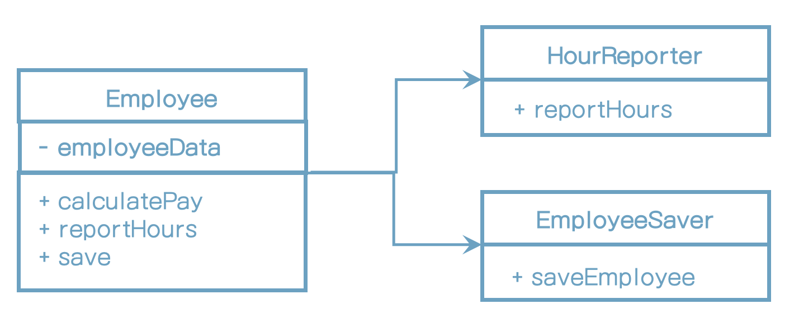

# 7장 SRP: 단일 책임 원칙

* SOLID 원칙 중 그 의미가 가장 잘 전달되지 못한 원칙이 바로 단일 책임 원칙이다.

* 프로그래머가 이 원칙의 이름을 듣는다면 모든 모듈이 단 하나의 일만 해야 한다는 의미로 받아들이기 쉽다. 이것은 "함수"이다.

SRP는 아래와 같다.

> 단일 모듈은 변경의 이유가 하나, 오직 하나뿐이어야 한다.

SRP가 말하는 '변경의 이유'란 바로 이들 사용자와 이해관계자를 가리킨다.

아래와 같이 바꿔 말할 수도 있다.

> 하나의 모듈은 하나의, 오직 하나의 사용자 또는 이해관계자에 대해서만 책임져야 한다.

여기서 말하는 사용자, 이해관계자는 한명을 의미하는 것은 아니고 집단, 변경을 요청하는 한명 이상의 사람들을 가리킨다. 이런 집단을 액터(actor)라고 한다.

SRP의 최종 버전은 아래와 같다.

> 하나의 모듈은 하나의, 오직 하나의 액터에 대해서만 책임져야 한다.

그럼 '모듈'이란 무슨 뜻인가? 소스파일이다.

'응집된'이라는 단어가 SRP를 암시한다. 단일 액터를 책임지는 코드를 함께 묶어주는 힘이 바로 응집성(cohesion)이다.

이 원칙을 위반하는 징후들이다.

## 징후 1: 우발적 중복

그림) Employee 클래스

이 클래스는 SRP를 위반하는데, 이들 세가지 메서드가 서로 매우 다른 세명의 액터를 책임지기 때문이다.

* calculatePay() 메서드는 회계팀에서 기능을 정의하며, CFO 보고를 위해 사용한다.
* reportHours() 메서드는 인사팀에서 기능을 정의하고 사용하며, COO 보고를 위해 사용한다.
* save() 메서드는 데이터베이스 관리자가 기능을 정의하고, CTO 보고를 위해 사용한다.

개발자가 이 세 메서드를 Employee라는 단일 클래스에 배치하여 새 액터가 서로 결합해 버렸다.

예를 들어 calculatePay() 메서드와 reportHours() 메서드가 초과 근무를 제외한 업무 시간을 계산하는 알고리즘을 공유한다고 해보자.
개발자는 코드 중복을 피하기 위해 이 알고리즘을 regularHours()라는 메서드에 넣었다고 해보자.

그림) 공유된 알고리즘

* CFO팀에서 초과근무를 제외한 업무 시간을 계산하는 방식을 약간 수정
* 반면 인사담당하는 COO팀에서는 초과근무를 제외한 업무시간을 CFO팀과 다른 목적으로 사용하기 때문에, 이 같은 변경을 원하지 않는다.
* 이런 방식은 의도하지 방식대로 변경이 되기 때문에 분리해야 한다.
* SRP는 서로 다른 액터가 의존하는 코드를 서로 분리하라고 말한다.

## 징후 2: 병합

* CTO 팀에서 employee 테이블 스키마 수정을 할 예정
* 이와 동시에 COO팀에서 reportHours 메서드의 보고서 포맷을 변경하기로 결정
* 두 명의 서로 다른 개발자가 employee 클래스를 체크아웃 받아 변경하기 시작한다. 결국 병합이 발생한다.
* 도구가 많이 좋아졌지만 병합에는 위험이 따르게 된다.
* 서로 다른 목적으로 동일한 소스파일을 변경하는 경우에 병합이 발생한다.
* 이 문제를 벗어나는 방법은 서로 다른 액터를 뒷받침하는 코드를 서로 분리하라는 것이다.

## 해결책

해결책은 메서드를 각기 다른 클래스로 이동시키는 방식이다.

EmployeeData 클래스를 만들어, 세 개의 클래스가 공유하도록 한다. 세 클래스는 서로의 존재를 몰라야 한다. 따라서 '우연한 중복'을 피할 수 있다.

그림) 세 클래스는 서로의 존재를 알지 못한다.

반면 이 해결책은 개발자가 세 가지 클래스를 인스턴스화하고 추적해야 한다는게 단점이다. 이러한 난관에서 빠져나올 때 흔히 쓰는 기법으로 퍼사드 패턴이 있다.

그림) 퍼사드(Facade) 패턴

EmployeeFacade에 코드는 거의 없다. 이 클래스에는 세 클래스의 객체를 생성하고, 요청된 메서드를 가지는 객체로 위임하는 일을 책임진다.

어떤 개발자는 가장 중요한 업무 규칙을 데이터와 가깝게 배치하는 방식을 선호한다. 이 경우라면 가장 중요한 메서드는 기존의 Employee 클래스에 그대로 유지하되, Employee 클래스를 덜 중요한 나머지 메서드들에 대한 퍼사드로 사용할 수도 있다(그림 7.5)

그림 7.5) 가장 중요한 메서드는 기존의 Employee 클래스에 그대로 유지하되, Employee 클래스를 덜 중요한 나머지 메서드들에 대한 퍼사드로 사용한다.

모든 클래스는 반드시 단 하나의 메서드를 가져야 한다는 주장에 근거하여 앞의 해결책에 반대할 수도 있다. 하지만 이 주장은 현실과는 전혀 다르다. 각 클래스에서 지불, 보고서 생성, 데이터 저장 기능을 구현하는 데 필요한 메서드의 개수는 실제로 훨씬 더 많을 것이다. 이들 클래스는 모두 다수의 private 메서드를 포함할 것이다.

## 결론

단일 책임 원칙은 메서드와 클래스 수준의 원칙이다.컴포넌트 수준에서는 공통 폐쇄 원칙(Common Closure Principle)이 된다. 아키텍처 경계의 생성을 책임지는 변경의 축이 된다.

