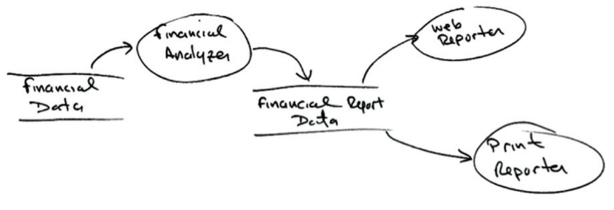
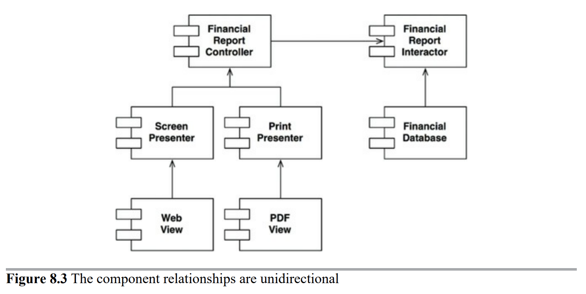

# 8장 OCP: 개방-폐쇄 원칙

개방-폐쇄 원칙이라는 용어는 1988년에 버트란트 마이어가 만들었는데, 다음과 같다.

> 소프트웨어 개체는 확장에는 열려 있어야 하고, 변경에는 닫혀 있어야 한다.

다시 말해 소프트웨어 개체의 행위는 확장할 수 있어야 하지만, 이때 산출물을 변경해서는 안된다.

소프트웨어 아키텍처를 공부하는 가장 근본적인 이유가 바로 이 때문이다. 요구사항을 살짝 확장하는데 소프트웨어를 엄청나게 수정해야 한다면, 그 소프트웨어 시스템을 설계한 아키텍트는 엄청난 실패에 맞닥뜨린다는 것이다.

## 사고 실험

재무제표를 웹 페이지로 보여주는 시스템이 있다고 생각해보자. 음수는 빨간색으로 출력한다.

이해관계자가 동일한 정보를 보고서 형태로 변환해서 흑백 프린터로 출력해 달라고 요청했다고 해보자. 음수는 괄호로 감싸야 한다.

당연히 새로운 코드를 작성해야 한다. 그렇다면 원래 코드는 얼마나 많이 수정해야 할까? 이상적인 변경량은 0이다.

여기서 얻을 수 있는 가장 중요한 영감은 보고서 생성이 두 개의 책임으로 분리된다는 사실이다. 하나는 보고서용 데이터를 계산하는 책임이며, 나머지 하나는 이 데이터를 웹으로 보여주거나 종이로 프린트하기에 적합한 형태로 표현하는 책임이다.

책임을 분리했다면, 두 책임 중 하나에서 변경이 발생하더라도 다른 하나는 변경되지 않도록 소스코드 의존성도 확실히 조직화해야 한다.

모든 컴포넌트 관계는 단방향으로 이루어진다는 뜻이다.

위의 그림에서 interactor가 업무 규칙을 포함하고 있다는 것이다. interactor는 애플리케이션에서 가장 높은 수준의 정책을 포함한다.

## 결론

OCP의 목표는 시스템을 확장하기 쉬운 동시에 변경으로 인해 시스템에 너무 많은 영향을 받지 않도록 하는데 있다.