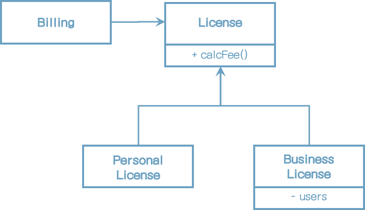
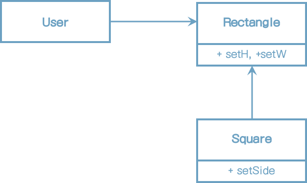

# 9장 LSP: 리스코프 치환 원칙

1988년 바바라 리스코프는 하위 타입을 아래와 같이 정의했다.

> 여기에서 필요한 것은 다음과 같은 치환원칙이다. S 타입의 객체 o1 각각에 대응하는 T타입 객체 o2가 있고, T타입을 이용해서 정의한 모든 프로그램 P에서 o2의 자리에 o1을 치환하더라도 P의 행위가 변하지 않는다면, S는 T의 하위 타입이다.


## 상속을 사용하도록 가이드하기

* License라는 클래스가 있다.

* 이 클래스는 calcFee()라는 메서드를 가지며, Billing 애플리케이션에서 이 메서드를 호출한다.

* License에는 PersonalLicense와 BusinessLicense라는 두가지 '하위 타입'이 존재한다.





이 설계는 LSP를 준수하는데, Billing 애플리케이션의 행위가 License 하위 타입 중 무엇을 사용하는지에 전혀 의존하지 않기 때문이다. 이들 하위 타입은 모두 License 타입으로 치환할 수 있다.


## 정사각형/직사각형 문제

LSP를 위반하는 전형적인 문제로는 유명한 정사각형/직사각형 문제가 있다.




이 예제에서 Square는 Rectangle의 하위 타입으로는 적합하지 않는데, Rectangle의 높이와 너비는 서로 독립적으로 변경될 수 있는 반면, Square의 높이와 너비는 반드시 함께 변경되기 때문이다. 

아래의 코드를 보면 혼동의 이유가 분명해진다.

```java
Rectangle r = ...
r.setW(5);
r.setH(2);
assert(r.area() == 10);
```

... 코드에서 Square를 생성한다면 assert 문은 실패하게 된다.

LSP 위반을 막기 위한 유일한 방법은 (if문 등을 이용해서) Rectangle이 실제로는 Sqaure인지를 검사하는 메커니즘을 User에 추가하는 것이다.
하지만 이렇게 하면 User의 행위가 사용하는 타입에 의존하게 되므로, 결국 타입을 서로 치환할 수 없다.


## LSP와 아키텍처

초창기에 LSP는 상속을 사용하도록 가이드하는 방법 정도로 간주되었다.


## LSP 위반 사례

[사례]

* 택시 파견 서비스를 통합하는 애플리케이션을 만들고 있다.
* 고객은 어느 택시업체인지는 신경쓰지 않고 자신의 상황에 가장 적합한 택시를 찾는다.
* 고객이 이용할 택시를 결정하면, 시스템은 REST 서비스를 통해 선택된 택시를 고객 위치로 파견한다.
* 택시 파견 REST서비스의 URI가 운전기사 데이터베이스에 저장되어 있다.
* 시스템이 고객에게 알맞은 기사를 선택하면, 해당 기사의 레코드로부터 URI정보를 얻은 다음, 그 URI정보를 이용하여 해당 기사를 고객 위치로 파견한다.


밥(bob)의 택시 파견 URI은 다음과 같다.

```
purplecab.com/driver/bob
```

시스템은 이 URL에 파견에 필요한 정보를 붙이고 PUT 방식으로 호출한다.

```
purplecab.com/driver/bob
		/pickupAddress/24 Maple St.
		/pickupTime/153
		/destination/ORD
```

다른 택시업체에서도 동일한 REST 인터페이스를 준수하도록 만들어야 한다.

이제 택시업체 에크미(ACME)의 개발자는 destination 필드를 dest로 축약하여 사용했다고 치자. 

이를 위해 예외 사항 처리 로직을 추가해야만 할 것이다.

아래와 같이 if 문장을 추가하는 것이다.

```
if (driver.getDispatchUri().startsWith("acme.com"))...
```

acme라는 단어를 코드에 추가하면 끔찍할 뿐만 아니라 이해할 수도 없는 온갖 에러가 발생할 여지를 만들게 된다.


## 결론

LSP는 아키텍처 수준까지 확장할 수 있고, 반드시 확장해야만 한다. 


