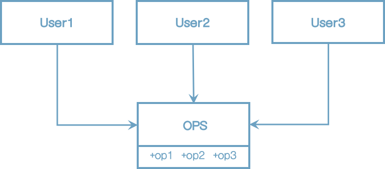
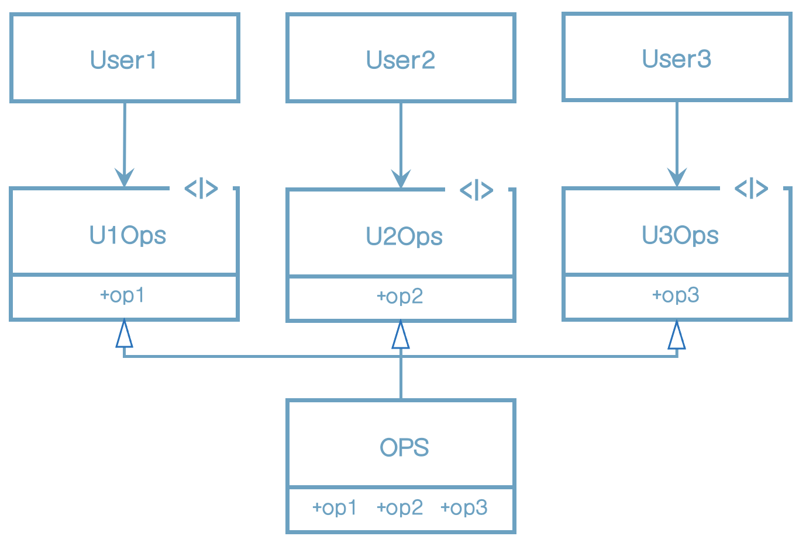

# 10장 ISP: 인터페이스 분리 원칙

인터페이스 분리 원칙(ISP)은 그림에서 보는 다이어그램에서 그 이름이 유래했다.

그림) 인터페이스 분리 원칙

다수의 사용자가 OPS 클래스에서 오퍼레이션을 사용한다. User1은 오직 op1을, User2는 op2만을, User3는 op3만을 사용한다.

그리고 OPS가 정적 타입 언어로 작성된 클래스라고 해보자. 이 경우 User1에서는 op2, op3를 전혀 사용하지 않음에도 User1의 소스코드는 이 두 메서드에 의존하게 된다. 이러한 의존성으로 인해 OPS 클래스에서 op2의 소스코드가 변경되면 User1도 다시 컴파일한 후 새로 배포해야 한다. 사실 User1과 관련된 코드는 전혀 변경되지 않았음에도 말이다.

이러한 문제는 아래와 같이 오퍼레이션을 인터페이스 단위로 분리하여 해결할 수 있다.

이번에도 마찬가지로 정적 타입 언어로 이 다이어그램을 구현했다고 가정하면, User1의 소스 코드는 U1Ops와 op1에는 의존하지만 OPS에는 의존하지 않게 된다. 따라서 OPS에서 발생한 변경이 User1과는 전혀 관계없는 변경이라면, User1을 다시 컴파일하고 새로 배포하는 상황은 초래되지 않는다.

그림) 분리된 오퍼레이션

## ISP와 언어

앞의 예제에서 본 사례는 언어 타입에 의존한다. 정적 타입 언어는 사용자가 import, use 또는 include와 같은 타입 선언문을 사용하도록 강제한다.

동적 타입 언어는 런타임에 추론이 발생한다.

이러한 사실로 인해 ISP를 아키텍처가 아니라, 언어와 관련된 문제라고 결론내릴 여지가 있다.

## ISP와 아키텍처

일반적으로, 필요 이상으로 많은 걸 포함하는 모듈에 의존하는 것은 해로운 일이다. 소스 코드 의존성의 경우 이는 분명한 사실인데, 불필요한 재컴파일과 재배포를 강제하기 때문이다. 하지만 더 고수준인 아키텍처 수준에서도 마찬가지 상황이 발생한다.

예를 들어 S 시스템 구축에 참여하고 있는 아키텍트가 있다고 해보자. 아키텍트는 F라는 프레임워크를 시스템에 도입하기를 원한다. 그리고 F 프레임워크 개발자는 특정한 D 데이터베이스를 반드시 사용하도록 만들었다고 가정해 보자. 따라서 S는 F에 의존하며, F는 다시 D에 의존하게 된다.

그림) 문제가 있는 아키텍처

F에서는 불필요한 기능, 따라서 S와는 전혀 관계없는 기능이 D에 포함된다고 가정하자. 그 기능이 D내부에서 변경이 발생하면, F를 재배포해야 할 수도 있고, S까지 재배포해야 할지 모른다. 더 심각한 문제는 D 내부의 기능 중 F와 S에서 불필요한 그 기능에 문제가 발생해도 F와 S에 영향을 준다는 사실이다.

## 결론

여기에서 배울 수 있는 교훈은 불필요한 짐을 실은 무언가에 의존하면 예상치도 못한 문제에 빠진다는 사실이다.

