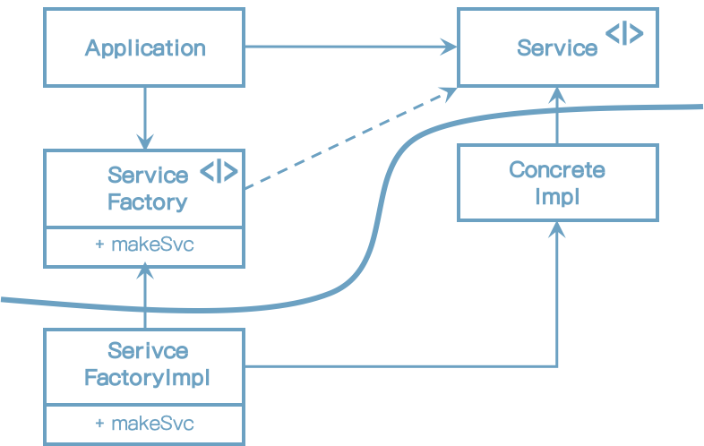

# 11장 DIP: 의존성 역전 원칙

의존성 역전 원칙에서 말하는, 유연성이 극대화된 시스템이란 소스코드 의존성이 추상화에 의존하며 구체에는 의존하지 않는 시스템이다.

자바와 같은 정적 타입 언어에서 이 말은 use, import, include 구분은 오직 인터페이스나 추상 클래스와 같은 추상적인 선언만을 참조야 한다는 뜻이다. 구체적인 대상에는 절대로 의존해서는 안된다.

DIP를 논의할 때 운영체제나 플랫폼 같이 안정성이 보장된 환경에 대해서는 무시하는 편이다.

우리가 의존하지 않도록 피하고자 하는 것은 바로 변동성이 큰 구체적인 요소다. 

## 안정된 추상화

추상 인터페이스에 변경이 생기면 구현체는 수정을 해야 한다. 반대로 구현체에 변경이 생기더라도 인터페이스는 수정될 필요가 없다.

실제로 뛰어난 소프트웨어 설계자와 안키텍트라면 인터페이스의 변동성을 낮추기 위해 애쓴다.

즉, 안정된 소프트웨어 아키텍처란 변동성이 큰 구현체에 의존하는 일은 지양하고, 안정된 추상 인터페이스를 선호하는 아키텍처라는 뜻이다.
아래와 같이 구체적인 코딩 실천법으로 요약할 수 있다.

* **변동성이 큰 구체 클래스를 참조하지 말라.**
    대신 추상 인터페이스를 참조하라.
* **변동성이 큰 구체 클래스로부터 파생하지 말라.** 
    상속은 소스코드에 존재하는 모든 관계 중 가장 강력한 동시에 뻣뻣해서 변경하기 어렵다. 상속은 아주 신중하게 사용해야 한다.
* **구체 함수를 오버라이드 하지 말라.** 
    구체함수는 소스코드 의존성을 필요로 한다. 구체함수를 오버라이드하면 이러한 의존성을 제거할 수 없게 되며, 의존성을 상속하게 된다.
* 구체적이며 변동성이 크다면 절대로 그 이름을 언급하지 말라.

## 팩토리

모든 언어에서 객체를 생성하려면 해당 객체를 구체적으로 정의한 코드에 대해 소스코드 의존성이 발생한다.

Application은 Service 인터페이스를 통해 ConcreteImpl의 인스턴스를 생성해야 한다. ConcreteImpl에 대해 소스코드 의존성을 만들지 않으면서 이 목적을 이루려면 Application은 ServiceFactory 인터페이스의 makeSvn 메서드를 호출한다. 이 메서드는 ServiceFactory로 부터 파생된 ServiceFactoryImpl에서 구현된다. 그리고 ServiceFactoryImpl 구현체가 ConcreteImpl의 인스턴스를 생성한 후 Service 타입으로 반환한다.

이 곡선은 구체적인 것들로부터 추상적인 것들을 분리한다.

곡선은 시스템을 두 가지 컴포넌트로 분리한다. 하나는 추상 컴포넌트이며, 다른 하나는 구체 컴포넌트다. 추상 컴포넌트는 업무 규칙을 다루기 위해 필요한 모든 세부사항을 포함한다.

제어흐름은 소스코드 의존성과는 정반대 방향으로 곡선을 가로지른다는 점에 주목하자. 다시 말해 의존성은 제어흐름과는 반대 방향으로 역전된다. 이러한 이유로 이 원칙을 의존성 역전 이라고 부른다.

## 구체 컴포넌트

위의 그림에는 구체적인 의존성이 하나(ConcreteImpl) 있고, 따라서 DIP에 위배된다. 이는 일반적인 일이다. DIP위배를 모두 없앨 수는 없다.