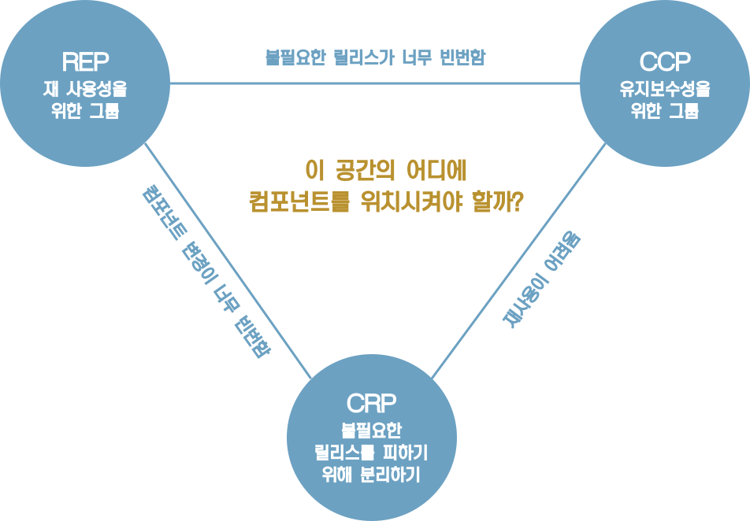

# 13장 컴포넌트 응집도

어떤 클래스를 어떤 컴포넌트에 포함시켜야 할까?

이 장에서는 컴포넌트 응집도와 관련된 세 가지 원칙을 논의한다.

* REP: 재사용/릴리스 등가 원칙 (Reuse/Release Equivalence Principle)
* CCP: 공통 폐쇄 원칙 (Common Closure Principle)
* CRP: 공통 재사용 원칙 (Common Reuse Principle)

## REP: 재사용/릴리스 등가 원칙

> 재사용 단위는 릴리스 단위와 같다.

소프트웨어 컴포넌트가 릴리스 절차를 통해 추적 관리되지 않거나 릴리스 번호가 부여되지 않는다면 해당 컴포넌트를 재사용하고 싶어도 할 수도 없고, 하지도 않을 것이다.

릴리스 번호가 없다면 재사용 컴포넌트들이 서로 호환되는지 보증할 방법이 전혀 없다. 새로운 버전이 언제 출시되고 무엇이 변했는지를 소프트웨어 개발자들이 알아야 하기 때문이다.

이 원칙을 소프트웨어 설계와 아키텍처 관점에서 보면 단일 컴포넌트는 응집성 높은 클래스와 모듈들로 구성되어야 함을 뜻한다. 단순히 뒤죽박죽 임의로 선택된 클래스와 모듈로 구성되어서는 안된다. 컴포넌트를 구성하는 모든 모듈은 서로 공유하는 중요한 테마나 목적이 있어야 한다.

<u>하나의 컴포넌트로 묶인 클래스와 모듈은 반드시 함께 릴리스 할 수 있어야 한다.</u> 하나의 컴포넌트로 묶인 클래스와 모듈은 버전 번호가 같아야 하며, 동일한 릴리스로 추적 관리되고, 동일한 릴리스 문서에 포함되어야 한다.

## CCP: 공통 폐쇄 원칙

> 동일한 이유로 동일한 시점에 변경되는 클래스를 같은 컴포넌트로 묶어라. 서로 다른 시점에 다른 이유로 변경되는 클래스는 다른 컴포넌트로 분리하라.

이 원칙은 단일 책임 원칙을 컴포넌트 관점에서 다시 쓴 것이다. SRP에서 단일 클래스는 변경의 이유가 여러 개 있어서는 안된다고 말하듯이, 공통 폐쇄 원칙도 마찬가지로 단일 컴포넌트는 변경의 이유가 여러 개 있어서는 안된다고 말한다.

대다수의 애플리케이션에서 유지보수성은 재사용성보다 훨씬 중요하다. 애플리케이션 코드가 반드시 변경되어야 한다면 여러 컴포넌트 도처에 분산되기 보다는 단일 컴포넌트에서  발생하는 편이 낫다.

CCP는 <u>같은 이유로 변경될 가능성이 있는 클래스는 모두 한곳으로 묶을 것</u>을 권한다. 이를 통해 릴리스, 재검증, 배포하는 일과 관련된 작업량을 최소화할 수 있다.

이 원칙은 OCP와도 밀접하게 관련되어 있다. CCP에서 말하는 폐쇄(Closure)는 OCP에서 말하는 폐쇄(Closure)와 그 뜻이 같다. OCP에서는 클래스가 변경에는 닫혀 있어야 하고 확장에는 열려 있어야 한다고 말한다. 100% 완전한 폐쇄는 불가능하므로 전략적으로 폐쇄해야 한다. 우리는 발생할 가능성이 있거나 과거에 발생했던 대다수의 공통적인 변경에 대해서 클래스가 닫혀 있도록 설계한다.

CCP에서는 동일한 유형의 변경에 대해 닫혀 있는 클래스들을 하나의 컴포넌트로 묶음으로써 OCP에서 얻은 교훈을 확대 적용한다. 변경이 필요한 요구사항이 발생했을 때 그 변경이 영향을 주는 컴포넌트들이 최소한으로 한정될 가능성이 높아진다.

### SRP와의 유사성

CCP는 컴포넌트 수준의 SRP이다. CCP는 다른 이유로 변경되는 클래스를 다른 컴포넌트로 분리하라. 두 원칙은 다음과 같이 요약할 수 있다.

> 동일한 시점에 동일한 이유로 변경되는 것을 한데 묶어라. 서로 다른 시점에 다른 이유로 변경되는 것들은 서로 분리한다.

## CRP: 공통 재사용 원칙

> 컴포넌트 사용자들을 필요하지 않는 것에 의존하게 강요하지 말라.

공통 재사용 원칙도 클래스와 모듈을 어느 컴포넌트에 위치시킬지 결정할 때 도움되는 원칙이다. CRP에서는 같이 재사용되는 경향이 있는 클래스와 모듈들은 같은 컴포넌트에 포함해야 한다고 말한다.

개별 클래스가 단독으로 재사용되는 경우는 거의 없다. 대체로 재사용 가능한 클래스는 재사용 모듈의 일부로서 해당 모듈의 다른 클래스와 상호작용하는 경우가 많다. CRP에서는 이런 클래스들이 동일한 컴포넌트에 포함되어야 한다고 말한다. 

CRP는 동일한 컴포넌트로 묶어서는 안되는 클래스가 무엇인지도 말해준다. 어떤 컴포넌트가 다른 컴포넌트를 사용하면, 두 컴포넌트 사이에는 의존성이 생겨난다. 사용하는 컴포넌트가 사용되는 컴포넌트에서 단 하나의 클래스만 사용할 수도 있다. 그렇다고 의존성이 조금도 약해지지 않는다.

이 같은 의존성으로 인해 사용되는 컴포넌트가 변경될 때마다 사용하는 컴포넌트도 변경해야 할 가능성이 높다. 사용하는 컴포넌트를 변경하지 않더라도, 재컴파일, 재검증, 재배포 상황이 생길 수 있다.

따라서 의존하는 컴포넌트가 있다면 해당 컴포넌트의 모든 클래스에 대해 의존함을 확실히 인지해야 한다. 바꿔 말하면 한 컴포넌트에 ㅎ속한 클래스들은 더 작게 그룹지을 수 없다.

따라서 CRP에서는 어떤 클래스를 한데 묶어도 되는지보다, 어떤 클래스를 한데 묶어서는 안되는지에 대해서 훨씬 더 많은 것을 이야기한다. CRP는 강하게 결합되지 않은 클래스들을 동일한 컴포넌트에 위치시켜서는 안된다고 말한다.

## ISP와의 관계

CRP는 ISP의 포괄적인 버전이다.

ISP에서는 사용하지 않은 메서드가 있는 클래스를 의존하지 말라고 한다. CRP는 사용하지 않는 클래스를 가진 컴포넌트를 의존하지 말라고 한다.

이 두 조언은 아래와 같이 요약할 수 있다.

> 필요하지 않은 것에 의존하지 말라.

## 컴포넌트 응집도에 대한 균형 다이어그램

REP와 CCP는 포함 원칙이며 컴포넌트를 더욱 크게 만든다.

CRP는 배제 원칙이며 컴포넌트를 작게 만든다.

오로지 REP와 CRP에만 중점을 두면, 사소한 변경이 생겼을 때 너무 많은 컴포넌트에 영향을 미친다. 반대로 CCP와 REP에만 과도하게 집중하면 불필요한 릴리스가 너무 빈번해진다.

프로젝트 초기에는 CCP가 REP보다 훨씬 더 중요한데, 개발 가능성이 재사용성보다 더욱 중요하기 때문이다.

일반적으로 프로젝트는 삼각형의 오른쪽에서 시작하는 편이며, 이때는 오직 재사용성만 희생하면 된다. 프로젝트가 성숙해짐에 따라 왼쪽으로 이동해 간다.

