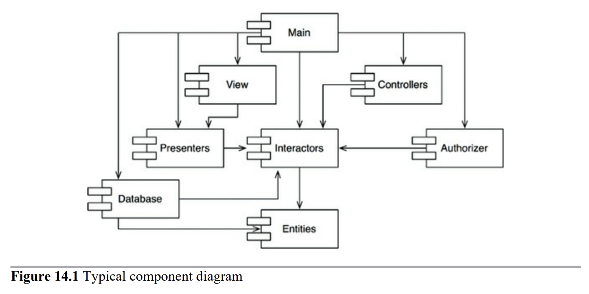
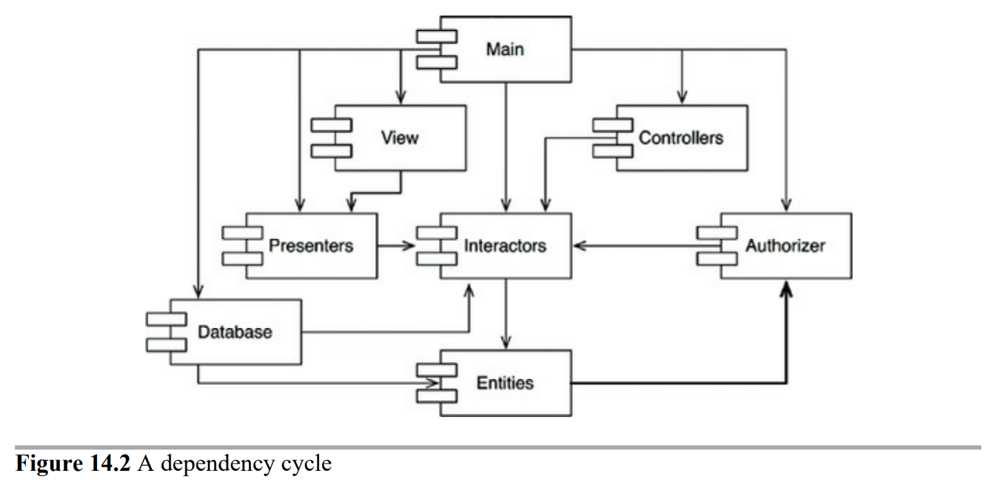
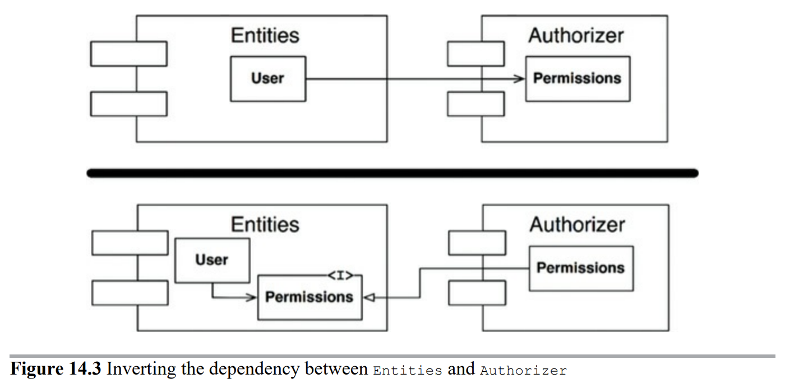
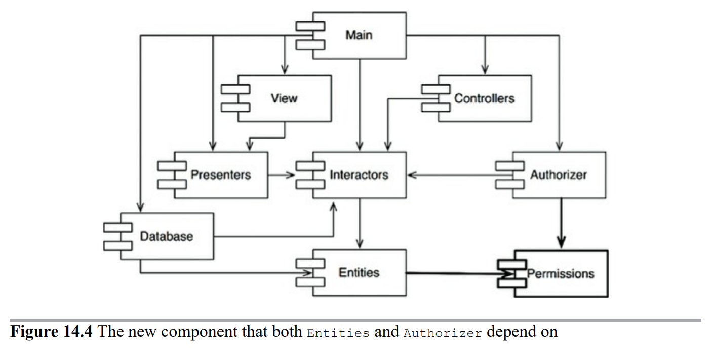
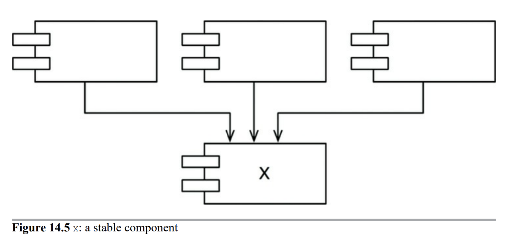
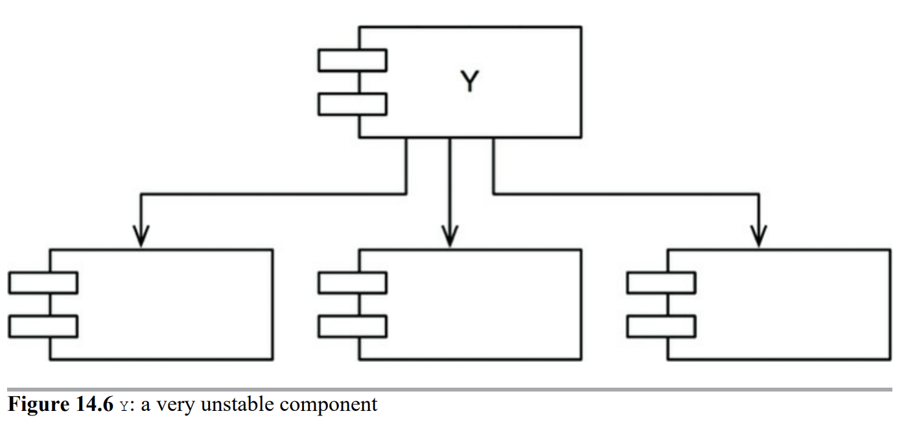

# 14장 컴포넌트 결합

## ADP: 의존성 비순환 원칙

> 컴포넌트 의존성 그래프에 순환(cycle)이 있어서는 안된다.

숙취 증후군(The morning after syndrome)
: 하루 종일 무언가를 작동하게 만들어 놓고 퇴근했는데, 이튿날 출근해보면 전혀 돌아가지 않는 경험을 해본적이 있는가? 
누군가 당신보다 더 늦게까지 일하면서 당신이 의존하고 있던 무언가를 수정했기 때문이다. 이런 현상을 '숙취 증후군'이라고 부른다.

숙취 증후군을 해결책으로 두 가지 방법이 발전되어 왔다. 첫 해결책은 '주 단위 빌드'이며, 두 번째 해결책은 '의존성 비순환 원칙(Acyclic Dependencies Principle)'이다.

### 주 단위 빌드 (Weekly Build)

개발자는 일주일의 첫 4일 동안은 서로 신경 쓰지 않는다. 그런 후 금요일이 되면 변경된 코드를 모두 통합하여 시스템을 빌드한다.

그러나 프로젝트가 커지면 프로젝트 통합이 금요일 하루만에 끝마치는게 불가능해진다.

개발보다 통합에 드는 시간이 늘어나면서 팀의 효율성도 서서히 나빠진다. 

### 순환 의존성 제거하기

이 문제의 해결책은 개발 환경을 릴리스 가능한 컴포넌트 단위로 분리하는 것이다. 이를 통해 컴포넌트는 개별 개발자 또는 단일 개발팀이 책임질 수 있는 작업 단위다. 개발자가 해당 컴포넌트가 동작하도록 만든 후, 해당 컴포넌트를 릴리스하여 다른 개발자가 사용할 수 있도록 만든다. 담당 개발자는 이 컴포넌트에 릴리스 번호를 부여하고, 다른 팀에서 사용할 수 있는 디렉토리로 이동한다. 그런 다음 개발자는 자신만의 공간에서 해당 컴포넌트를 지속적으로 수정한다. 나머지 개발자는 릴리스된 버전을 사용한다.

컴포넌트가 새로 릴리스 되어 사용할 수 있게 되면, 다른 팀에서는 새 릴리스를 당장 적용할지 결정해야 한다. 적용하지 않기로 했다면 그냥 과거 버전의 릴리스를 계속 사용한다.

따라서 어떤 팀도 다른 팀에 의해 좌우되지 않는다. 특정 컴포넌트가 변경되더라도 다른 팀에 즉각 영향을 주지 않는다. 

그림 14.1의 다이어그램은 구조가 방향 그래프(directed graph) 임에 주의하자.

한 가지 더 주목할 점이 있다. 어느 컴포넌트에서 시작하더라도, 의존성 관계를 따라가면서 최초의 컴포넌트로 되돌아갈 수 없다는 사실이다. 이 구조에는 순환이 없다. 즉, 이 구조는 비순환 방향 그래프(directed acyclic graph, DAG)다.

* Presenters를 담당하는 팀에서 새로운 릴리스를 할때 영향을 받는 컴포넌트는?
    View와 Main 컴포넌트다.
* Main을 변경할 때 영향을 받는 컴포넌트는?
    없다.

### 순환이 컴포넌트 의존성 그래프에 미치는 영향

Entity에 포함된 클래스 하나가 Authorizer에 포함된 클래스 하나를 사용하도록 변경할 수 밖에 없다고 가정해보자. 이럴때는 순환 의존성이 발생한다.

Database 컴포넌트 개발자는 Entities 컴포넌트와 호환되어야 한다. 하지만 Entities 컴포넌트에는 순환이 있으므로 Database 컴포넌트는 또한 Authorizer와 호환되어야 한다. 이로 인해 Database는 릴리스 하기가 훨씬 어려워진다. Entities, Authorizer, Interactors는 사실상 하나의 거대한 컴포넌트가 되어 버린다.

또한 Entities 컴포넌트를 테스트할때 Authorizer와 Interactors까지도 반드시 빌드하고 통합해야 한다.

### 순환 끊기

1. 의존성 역전 원칙(DIP)을 적용한다.  그림 14.3처럼 User가 필요로 하는 메서드를 제공하는 인터페이스를 생성한다. 그리고 이 인터페이스는 Entities에 위치시키고 Authorizer는 이 인터페이스를 상속받는다. 

    

    

    

2. Entities와 Authorizer가 모두 의존하는 새로운 컴포넌트를 만든다. 그리고 두 컴포넌트가 모두 의존하는 클래스들을 새로운 컴포넌트로 이동시킨다.

### 흐트러짐 (Jitters)

두 번째 해결책에서 시사하는 바는 요구사항이 변경되면 컴포넌트 구조도 변경될 수 있다는 사실이다. 따라서 의존성 구조에 순환이 발생하는지를 항상 관찰해야 한다.

## 하향식(top-down) 설계

컴포넌트 구조는 하향식으로 설계될 수 없다. 컴포넌트는 시스템에서 가장 먼저 설계할 수 있는 대상이 아니며, 오히려 시스템이 성장하고 변경될 때 함께 진화한다.

컴포넌트 의존성 다이어그램은 애플리케이션의 기능을 기술하는 일과는 거의 관련이 없다. 오히려 빌드 가능성과 유지보수성을 보여주는 지도와 같다. 이러한 이유로 컴포넌트 구조는 프로젝트 초기에 설계할 수 없다.

GUI에서 표현 형식이 변경되더라도 업무 규칙에 까지 영향을 주는 일은 바라지 않는다. 출력할 보고서에 무언가가 추가되거나 수정되더라도 최상위 수준의 정책이 영향받는 일은 원치 않는다. 

## SDP: 안정된 의존성 원칙

> 안정성의 방향으로(더 안정된 쪽에) 의존하라.

설계를 유지하다 보면 변경은 불가피하다. 공통 폐쇄 원칙을 준수함으로써, 컴포넌트가 다른 유형의 변경에는 영향을 받지 않으면서도 특정 유형의 변경에만 민감하게 만들 수 있다. 이처럼 컴포넌트 중 일부는 변동성을 지니도록 설계한다. 우리는 변동성을 지니도록 설계한 컴포넌트는 언젠가 변경되리라 예상한다.

<u>변경이 쉽지 않은 컴포넌트가 변동이 예상되는 컴포넌트에 의존하게 만들어서는 절대로 안 된다.</u> 한번 의존하게 되면 변동성이 큰 컴포넌트도 결국 변경이 어려워진다.

당신이 모듈을 만들 때는 변경하기 쉽도록 설계했지만, 이 모듈에 의존성을 매달아 버리면 당신의 모듈도 변경하기 어려워진다. 안정된 의존성 원칙(Stable Dependencies Principle, SDP)을 준수하면 변경하기 어려운 모듈이 변경하기 쉽게 만들어진 모듈에 의존하지 않도록 만들 수 있다.

### 안정성

안정성(stability)이란 무슨 뜻인가? (동전 옆면?)
동전 옆면이 안정적이지 않은 이유는 그다지 힘을 쓰지 않고도 넘어뜨릴 수 있게 때문이다. 반면 탁자는 상당히 안정적인데 탁자를 뒤집으려면 상당한 수고를 감수해야 하기 때문이다.

소프트웨어 컴포넌트를 변경하기 어렵게 만드는 요인은 여러가지인데 그 중 컴포넌트의 크기, 복잡도, 간결함 등이 있다.

소프트웨어 컴포넌트를 변경하기 어렵게 하는 확실한 방법은 수많은 다른 컴포넌트가 해당 컴포넌트에 의존하게 만드는 것이다. 

그림 14.5의 X는 안정된 컴포넌트다. 따라서 X컴포넌트는 변경하지 말아야 할 이유가 세 가지나 되기 때문이다.

그림 14.6의 Y는 상당히 불안정한 컴포넌트다. 어떤 컴포넌트도 Y에 의존하지 않으므로 Y는 책임성이 없다고 말할 수 있다. 

### 안정성 지표

컴포넌트 안정성을 어떻게 측정할 수 있을까? 컴포넌트로 들어오고 나가는 의존성의 개수를 세어 보는 방법이 있을 수 있다.

* Fain-in: 안으로 들어오는 의존성. 컴포넌트 내부의 클래스에 의존하는 컴포넌트 외부의 클래스 개수
* Fan-out: 바깥으로 나가는 의존성. 컴포넌트 외부의 클래스에 의존하는 컴포넌트 내부의 클래스 개수
* I(불안정성): I = Fan-out / (Fain-in + Fan-out). 이 지표는 [0, 1]범위의 값을 갖는다. I=0이면 최고로 안정된 컴포넌트이고 I=1이면 최고로 불안정한 컴포넌트라는 뜻이다.

## SAP: 안정된 추상화 원칙

> 컴포넌트는 안정된 정보만큼만 추상화 되어야 한다.

### 고수준 정책을 어디에 위치시켜야 하는가?

시스템에는 자주 변경해서는 절대로 안 되는 소프트웨어도 있다. 고수준 아키텍처나 정책 결정과 관련된 소프트웨어가 그 예다. 이처럼 업무 로직이나 아키텍처에 관련된 결정에는 변동성이 없기를 기대한다. 따라서 시스템에서 고수준 정책을 캡슐화하는 소프트웨어는 반드시 안정된 컴포넌트(I=0)에 위치해야 한다.

하지만 고수준 정책을 안정된 컴포넌트로 위치시키면, 그 정책을 포함하는 소스 코드는 수정하기가 어려워진다. 이로 인해 시스템 전체 아키텍처가 유연성을 잃는다. 컴포넌트가 최고로 안정된 상태이면서도(I=0) 동시에 변경에 충분히 대응할 수 있을 정도로 유연하게 만들 수 있을까? 해답은 개방 폐쇄 원칙(OCP)에서 찾을 수 있다. OCP에서는 클래스를 수정하지 않고도 확장이 충분히 가능할 정도로 클래스를 유연하게 만들 수 있을 뿐만 아니라 바람직한 방식이라고 말한다. 어떤 클래스가 이 원칙을 준수하는가? 바로 추상 클래스다.

### 안정된 추상화 원칙

안정된 추상화 원칙(Stable Abstraction Principle, SAP)은 안정성과 추상화 정도 사이의 관계를 정의한다. 이 원칙은 안정된 컴포넌트는 추상 컴포넌트여야 하며, 이를 통해 안정성이 컴포넌트를 확장하는 일을 방해해서는 안 된다고 말한다. 다른 한편으로는 불안정한 컴포넌트는 반딋 구체 컴포넌트여야 한다고 말하는데, 컴포넌트가 불안정하므로 컴포넌트 내부의 구체적인 코드를 쉽게 변경할 수 있어야 하기 때문이다.

따라서 안정적인 컴포넌트라면 반드시 인터페이스와 추상 클래스로 구성되어 쉽게 확장할 수 있어야 한다. 안정된 컴포넌트가 확장이 가능해지면 유연성을 얻게 되고 아키텍처를 과도하게 제약하지 않게 된다.

SAP와 SDP를 결합하면 컴포넌트에 대한 DIP나 마찬가지가 된다. 실제로 SDP에서는 의존성이 반드시 안정성의 방향으로 향해야 한다고 말하며, SAP에서는 안정성이 결국 추상화를 의미한다고 말하기 때문이다. 따라서 의존성은 추상화의 방향으로 향하게 된다.

