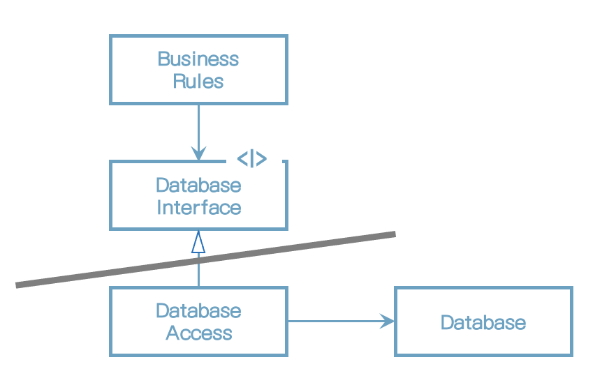

# 17장 경계: 선 긋기

소프트웨어 아키텍처는 선을 긋는 기술이며, 이러한 선을 경계라고 부른다. 경계 한편에 있는 요소가 반대편에 있는 요소를 알지 못하도록 막는다. 핵심적인 업무 로직을 오염시키지 못하게 만들려는 목적으로 쓰인다.

아키텍트의 목표는 필요한 시스템을 만들고 유지하는 데 드는 인적 자원을 최소화하는 것이라는 사실을 상기하자. <u>인적 자원의 효율을 떨어뜨리는 요인</u>은 무엇일까? 바로 <u>결합(coupling)</u>이다. 

어떤 종류의 결저잉 이른 결정일까? 바로 시스템의업무 요구사항, 즉 유스케이스와 아무런 관련이 없는 결정이다. 프레임워크, 데이터베이스, 웹 서버, 유틸리티 라이브러리, 의존성 주입에 대한 결정이 여기 포함된다. 좋은 시스템 아키텍처란 이러한 결정이 부수적이며, 결정을 연기할 수 있는 아키텍처다. 좋은 시스템 아키텍처는 이러한 결정에 의존하지 않는다.

## 두 가지 슬픈 이야기

P 회사에 대한 슬픈 이야기.

1990년대 후반에 웹이 대세가 되기 시작한다. 제품을 웹 버전으로 변환하는 프로젝트에 착수했다.

모든 도메인 객체는 세 가지 인스턴스를 가져야 한다고 너무 이른 결정으 내렸다. 하나는 GUI 티어를 위해, 또 하나는 미들웨어 티어를 위해, 나머지 하나는 데이터베이스 티어를 위해서다. 서버 간 통신에 발생하는 비용이 너무 비쌌다.

역설적이게도 P사는 서버 팜을 필요로 하는 시스템을 한 번도 판매하지 못했다. 배포했던 시스템은 모두 단일 서버였다.

이 비극은 아키텍트를 너무 이르게 결정을 내림으로써 개발 비용을 엄청나게 가중시킨 사례다.

## 어떻게 선을 그을까? 그리고 언제 그을까?

관련이 있는 것과 없는 것 사이에 선을 긋는다. GUI는 업무 규칙과는 관련 없기 때문에, 이 둘 사이에는 반드시 선이 있어야 한다. 데이터베이스는 GUI와는 관련이 없으므로, 이 둘 사이에도 반드시 선이 있어야 한다. 데이터베이스는 업무 규칙과 관련이 없으므로, 이 둘 사이에도 선이 있어야 한다.

데이터베이스는 업무 규칙이 간접적으로 사용할 수 있는 도구다. 업무 규칙은 스키마, 쿼리 언어, 또는 데이터베이스와 관련된 나머지 세부사항에 대해 어떤 것도 알아서는 안된다. 우리는 이러한 함수 집합을 통해 데이터베이스를 인터페이스 뒤로 숨길 수 있다.

그림) 인터페이스 뒤로 숨은 데이터베이스

경계선은 어디에 있는가? Database Interface 바로 아래에 그어진다.

