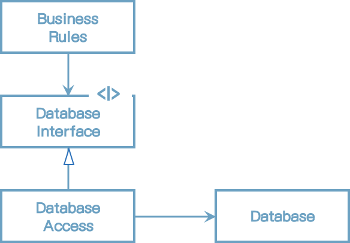
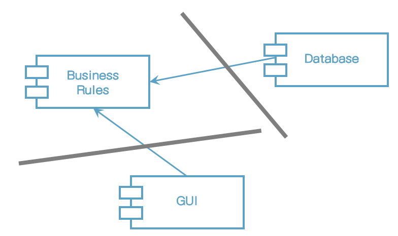

# 17장 경계: 선 긋기

소프트웨어 아키텍처는 선을 긋는 기술이며, 이러한 선을 경계라고 부른다. 경계 한편에 있는 요소가 반대편에 있는 요소를 알지 못하도록 막는다. 핵심적인 업무 로직을 오염시키지 못하게 만들려는 목적으로 쓰인다.

아키텍트의 목표는 필요한 시스템을 만들고 유지하는 데 드는 인적 자원을 최소화하는 것이라는 사실을 상기하자. <u>인적 자원의 효율을 떨어뜨리는 요인</u>은 무엇일까? 바로 <u>결합(coupling)</u>이다. 

어떤 종류의 결정이 이른 결정일까? 바로 시스템의 업무 요구사항, 즉 유스케이스와 아무런 관련이 없는 결정이다. 프레임워크, 데이터베이스, 웹 서버, 유틸리티 라이브러리, 의존성 주입에 대한 결정이 여기 포함된다. 좋은 시스템 아키텍처란 이러한 결정이 부수적이며, 결정을 연기할 수 있는 아키텍처다. 좋은 시스템 아키텍처는 이러한 결정에 의존하지 않는다.

## 두 가지 슬픈 이야기

P 회사에 대한 슬픈 이야기.

1990년대 후반에 웹이 대세가 되기 시작한다. 제품을 웹 버전으로 변환하는 프로젝트에 착수했다.

모든 도메인 객체는 세 가지 인스턴스를 가져야 한다고 너무 이른 결정을 내렸다. 하나는 GUI 티어를 위해, 또 하나는 미들웨어 티어를 위해, 나머지 하나는 데이터베이스 티어를 위해서다. 서버 간 통신에 발생하는 비용이 너무 비쌌다.

역설적이게도 P사는 서버 팜을 필요로 하는 시스템을 한 번도 판매하지 못했다. 배포했던 시스템은 모두 단일 서버였다.

이 비극은 아키텍트를 너무 이르게 결정을 내림으로써 개발 비용을 엄청나게 가중시킨 사례다.

## 어떻게 선을 그을까? 그리고 언제 그을까?

관련이 있는 것과 없는 것 사이에 선을 긋는다. GUI는 업무 규칙과는 관련 없기 때문에, 이 둘 사이에는 반드시 선이 있어야 한다. 데이터베이스는 GUI와는 관련이 없으므로, 이 둘 사이에도 반드시 선이 있어야 한다. 데이터베이스는 업무 규칙과 관련이 없으므로, 이 둘 사이에도 선이 있어야 한다.

데이터베이스는 업무 규칙을 간접적으로 사용할 수 있는 도구다. 업무 규칙은 스키마, 쿼리 언어, 또는 데이터베이스와 관련된 나머지 세부사항에 대해 어떤 것도 알아서는 안된다. 우리는 이러한 함수 집합을 통해 데이터베이스를 인터페이스 뒤로 숨길 수 있다.

그림) 인터페이스 뒤로 숨은 데이터베이스

경계선은 어디에 있는가? Database Interface 바로 아래에 그어진다.

그림) 경계선

DatabaseAccess에서출발하는 두 화살표에 주목하자. 이들 두 화살표는 DatabaseAccess 클래스로부터 바깥쪽으로 향한다. 즉, 이 도표에서 Database Access가 존재한다는 사실을 알고 있는 클래스가 없다는 뜻이다.

그림) 업무 규칙과 데이터베이스 컴포넌트

Database는 BusinessRules에 대해 알고 있다. BusinessRules는 Database에 관해 알지 못한다. 이는 DatabaseInterface 클래스는 BusinessRules 컴포넌트에 속하며 DatabaseAccess 클래스는 Database 컴포넌트에 속한다는 사실을 의미한다.

이 선의 방향이 중요하다. BusinessRules에게 있어 Database는 문제가 되지 않지만, Database는 BusinessRules 없이는 존재할 수 없다는 사실을 이 방향을 통해 알 수 있다.

두 컴포넌트 사이에 이러한 경계선을 그리고 화살표의 방향이 BusinessRules를 향하도록 만들었으므로, BusinessRules에서는 어떤종류의 데이터베이스도 사용할 수 있을을 알 수 있다. Database 컴포넌트는 다양한 구현체로 교체될 수 있으며, BusinessRules는 조금도 개의치 않는다.

업무 규칙은 전혀 개의치 않는다. 그리고 이 같은 사실은 데이터베이스에 대한 결정은 연기할 수 있으며, 데이터베이스를 결정하기에 앞서 업무 규칙을 먼저 작성하고 테스트하는 데 집중할 수 있음을 의미한다.

## 입력과 출력은?

개발자와 고객은 종종 시스템이 무엇인지에 대해 혼란스러워한다. GUI를 보고선 GUI가 시스템이라고 생각하곤 한다. 이들은 매우 중요한 원칙을 깨닫지 못했다. 입력과 출력은 중요하지 않다는 사실이다.

이 원칙은 처음에는 이해하기 힘들다. 예를 들어 비디오 게임을 생각해 보자. 이 경우 사용자 경험은 인터페이스에 의해 좌우된다. 화면, 마우스, 버튼, 음향이 바로 그 인터페이스다. 게임이 화면에 전혀 출력되지 않더라도 모델은 게임에서 발생되는 모든 이벤트를 모델링하면서 주어진 역할을 충실하게 수행한다. 인터페이슨느 모델에게 있어 중요하지 않다. 중요한 것은 업무 규칙이다.

경계와 화살표를 이와 같이 그릴 수 있으므로, GUI는 다른 종류의 인터페이스로 얼마든지 교체할 수 있으며 BusinessRules는 전혀 개의치 않는다는 사실을 알 수 있다.

## 플러그인 아키텍처

사실 소프트웨어 개발 기술의 역사는 플러그인을 손쉽게 생성하여, 확장 가능하며 유지보수가 쉬운 시스템 아키텍처를 확립할 수 있게 만드는 방법에 대한 이야기이다.

이 설계에서 수많은 종류의 사용자 인터페이스를 플러그인 형태로 연결할 수 있게 된다. 웹 기반일 수 있고, 클라이언트/서버 기반이거나, SOA나 콘솔 기반,  또는 임의의 어떤 사용자 인터페이스 기술이라도 가능하다.

데이터베이스에서도 동일하게 적용할 수 있다. 임의의 다양한 SQL 데이터베이스, NoSQL 데이터베이스, 파일 시스템 기반 데이터베이스, 어떤 종류의 데이터베이스 기술로도 대체할 수 있다.

## 플러그인에 대한 논의

ReSharper와 비주얼 스튜디오는 완전히 다른 회사의 완전히 다른 개발팀에 의해 만들어졌다.

어느 팀이 다른 팀을 위험하게 만들 수 있을까? 어느 팀이 다른 팀에 의한 영향을 안 받게될까? 의존성 구조가 답해준다. ReSharper 팀은 절대로 비주얼 스튜디오 팀을 건드릴 수 없다. 하지만 비주얼 스튜디오 팀은 원한다면 언제든지 ReSharper 팀을 완전히 무력화할 수 있다.

시스템을 플러그인 아키텍처로 배치함으로써 변경이 전파될 수 없는 방화벽을 생성할 수 있다. GUI가 업무 규칙에 플러그인 형태로 연결되면 GUI에서 발생한 변경은 전대로 업무 규칙에 영향을 미칠 수 없다.

경계는 변경의 축이 있는 지점에 그어진다. 경계의 한쪽에 위치한 컴포넌트는 경계 반대편의 컴포넌트와는 다른 속도로, 그리고 다른 이유로 변경된다.

GUI는 업무 규칙과는 다른 시점에 다른 속도로 변경되므로, 둘 사이에는 반드시 경계가 필요하다. 업무 규칙은 의존성 주임 프레임워크와는 다른 시점에 그리고 다른 이유로 변경되므로, 둘 사이에도 반드시 경계가 필요하다.

## 결론

소프트웨어 아키텍처에서 경계선을 그리려면 먼저 시스템을 컴포넌트 단위로 분할해야 한다. 일부 컴포넌트는 핵심 업무 규칙에 해당한다. 나머지 컴포넌트는 플러그인으로, 핵심 업무와는 직접적인 관련이 없지만 필수 기능을 포함한다. 그런 다음 컴포넌트 사이의 화살표가 특정 방향, 즉 핵심 업무를 향하도록 이들 컴포넌트의 소스를 배치한다.

이는 의존성 역전 원칙과 안정된 추상화 원칙을 응용한 것임을 눈치챌 수 있어야 한다. 의존성 화살표는 저수준 세부사항에서 고수준의 추상화를 향하도록 배치된다.

