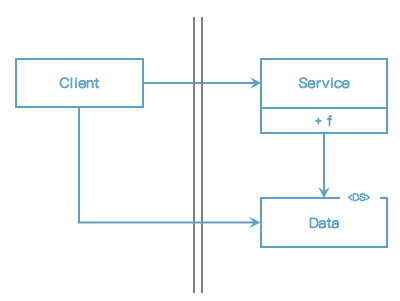
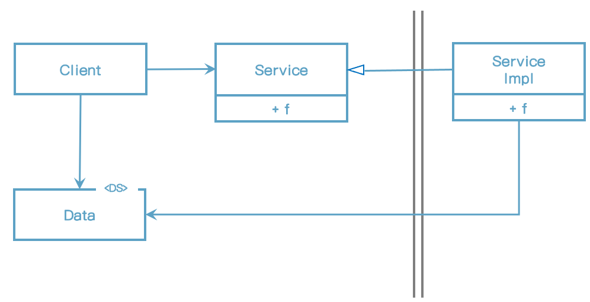

# 18장 경계 해부학

## 경계 횡단하기

런타임에 경계를 횡단한다. 함은 그저 경계 한쪽에 있는 기능에서 반대편 기능을 호출하여 데이터를 전달하는 일에 불과하다. 적절한 위치에서 경계를 횡단하게 하는 비결은 소스 코드 의존성 관리에 있다.

## 두려운 단일체

아키텍처 경계 중에서 가장 단순하며 가장 흔한 형태는 물리적으로 엄격하게 구분되지 않는 형태다. 이 형태에서 함수와 데이터가 단일 프로세서에서 같은 주소 공간을 공유하며 그저 나름의 규칙에 따라 분리되어 있을 뿐이다. 이전 장에서 나는 이를 소스 수준 분리 모드라고 불렀다.

이처럼 배포 관점에서 볼 때 단일체는 경계가 드러나지 않는다. 그렇다고 해서 단일체에는 경계가 실제로 존재하지 않거나, 경계 자체가 무의미하다는 뜻은 아니다.

가장 단순한 형태의 경계 횡단은 저수준 클라이언트에서 고수준 서비스로 향하는 함수 호출이다. 이 경우 런타임 의존성과 컴파일타임 의존성은 모두 같은 방향, 즉 저수준 컴포넌트에서 고수준 컴포넌트로 향한다.

고수준 클라이언트가 저수분 서비스를 호출해야 한다면 동적 다형성을 사용하여 제어흐름과는 반대 방향으로 의존성을 역전시킬 수 있다. 이렇게 하면 런타임 의존성은 컴파일타임 의존성과는 반대가 된다.

정적 링크된 모노리틱 구조의 실행 파일이라도 이처럼 규칙적인 방식으로 구조를 분리하면 프로젝트를 개발, 테스트, 배포하는 작업에 큰 도움이 된다. 팀들은 서로의 영역에 침범하지 않은 채 자신만의 컴포넌트를 독립적으로 작업할 수 있다. 고수준 컴포넌트는 저수준 세부사항으로부터 독립적으로 유지된다.

## 배포형 컴포넌트

아키텍처의 경계가 물리적으로 드러날 수도 있는데 그중 가장 단순한 형태는 동적 링크 라이브러리다. .NET DLL, 자바 jar 파일 등이 그 예다. 컴포넌트를 이 형태로 배포하면 따로 컴파일하지 않고 곧바로 사용할 수 있다.이는 배포 수준 분리 모드에 해당한다.

배포 수준의 컴포넌트는 단일체와 동일하다. 일반적으로 모든 함수가 동일한 프로세서와 주소 공간에 위치하며 컴포넌트를 분리하거나 컴포넌트 간 의존성을 관리하는 전략도 단일체와 동일하다.

## 스레드

스레드는 아키텍처 경계도 아니며 배포 단위도 아니다. 모든 스레드가 단 하나의 컴포넌트에 포함될 수 있 있고, 많은 컴포넌트에 걸처 분산될 수도 있다.

## 로컬 프로세스

훨씬 강한 물리적 형태를 띠는 아키텍처 경계로는 로컬 프로세스가 있다. 로컬 프로세스들은 동일한 프로세서 또는 멀티코어 시스템에 속한 여러 프로세서들에서 실행되지만, 각각이 독립된 주소 공간에서 실행된다. 종종 공유 메모리 파티션을 사용하기도 하지만, 일반적으로 메모리 보호를 통해 프로세스들이 메모리를 공유하지 못하게 한다.

로컬 프로세스 간 분리 전략은 단일체나 바이너리 컴포넌트의 경우와 동일하다. 소스 코드 의존성의 홧ㄹ표는 단일체나 바이너리 컴포넌트와 동일한 방향으로 경계를 횡단한다. 즉, 항상 고수준 컴포넌트를 향한다.

따라서 로컬 프로세스에서는 고수준 프로세서의 소스 코드가 저수준 프로세서의 이름, 물리주소, 레지스트리 조회 키를 절대로 포함해서는 안 된다. 저수준 프로세스가 고수준 프로세서의 플러그인이 되도록 만드는 것이 아키텍처 관점의 목표라는 사실을 기억하자.

## 서비스

물리적인 형태를 띠는 가장 강력한 경계는 바로 서비스다. 서비스는 자신의 물리적 위치에 구애받지 않는다. 서비스들은 모든 통신이 네트워크를 통해 이뤄진다고 가정한다.

서비스 경계를 지나는 통신은 함수 호출에 비해 매우 느리다.

## 결론

대체로 한 시스템 안에서도 통신이 빈번한 로컬 경계와 지연을 중요하게 고려해야 하는 경계가 혼합되어 있음을 의미한다.

