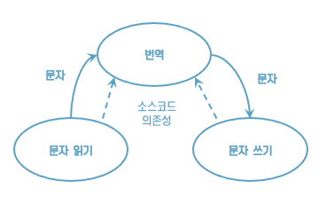
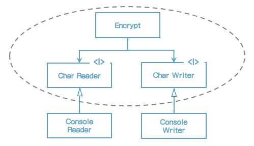

# 19장 정책과 수준

소프트웨어 시스템이란 정책을 기술한 것이다.

대다수의 주요 시스템에서 하나의 정책은 이 정책을 서술하는 여러 개의 조그만 정책들로 쪼갤 수 있다.

소프트웨어 아키텍처를 개발하는 기술에는 이러한 정책을 신중하게 분리하고, 정책이 변경되는 양상에 따라 정책을 재편성하는 일도 포함된다. 동일한 이유로 동일한 시점에 변경되는 정책은 동일한 수준에 위치하며, 동일한 컴포넌트에 속해야 한다. 서로 다른 이유로, 혹은 다른 시점에 변경되는 정책은 다른 수준에 위치하며, 반드시 다른 컴포넌트로 분리해야 한다.

흔히 아키텍처 개발은 재편성된 컴포넌트들을 비순환 방향 그래프(directed acyclic graph)로 구성하는 기술을 포함한다. 그래프에서 정점(node)은 동일한 수준의 정책을 포함하는 컴포넌트에 해당한다. 방향이 있는 간선(edge)은 컴포넌트 사이의 의존성을 나타낸다. 간선은 다른 수준에 위치한 컴포넌트를 서로 연결한다.

이러한 의존성은 소스 코드, 컴파일 타임의 의존성이다. 자바의 겨웅 import 구문에 해당한다.

좋은 아키텍처라면 각 컴포넌트를 연결할 때 의존성의 방향이 컴포넌트들이 수준을 기반으로 연결되도록 만들어야 한다. 즉, 저수준 컴포넌트가 고수준 컴포넌트에 의존하도록 설계되어야 한다.


## 수준



그림) 간단한 암호화 프로그램

자칫하면 잘못된 아키텍처가 만들어지는데, 예를 들어 암호화 프로그램을 다음처럼 작성한다면 그렇게 된다.

```java
function encypt() {
  while (true) {
    writeChar(translate(readChar()));
  }
}
```

이는 잘못된 아키텍처다. 고수준인 encrypt 함수가 저수준인 readChar와 writeChar 함수를 의존하기 때문이다.



그림) 시스템의 더 나은 아키텍처를 보여주는 클래스 다이어그램

이 클래스 다이어그램은 이 시스템의 아키텍처를 개선해본 모습이다. 주목할 점은 Encrypt 클래스, CharWriter와 CharReader 인터페이스를 둘러싸고 있는 점선으로 된 경계다. 이 경계를 횡단하는 의존성은 모두 경계 안쪽으로 향한다. 이 경계로 묶인 영역이 이 시스템에서 최고 수준의 구성요소다.

정책을 컴포넌트로 묶는 기준은 정책이 변경되는 방식에 달려있다는 사실을 상기하자. 단일 책임 원칙과 공통 폐쇄 원칙에 따르면 동일한 이유로 동일한 시점에 변경되는 정책은 함께 묶는다. 고수준 정책, 즉 입력과 출력에서부터 멀리 떨어진 정책은 저수준 정책에 비해 덜 빈번하게 변경되고, 보다 중요한 이유로 변경되는 경향이 있다. 저수준 정책, 즉 입력과 출력에 가까이 위치한 정책은 더 빈번하게 변경되며, 보다 긴급성을 요하며, 덜 중요한 이유로 변경되는 경향이 있다.

이처럼 모든 소스 코드 의존성의 방향이 고수준 정책을 향할 수 있도록 정책을 분리했다면 변경의 영향도를 줄일 수 있다. 시스템의 최저 수준에서 중요하지 않지만 긴급한 변경이 발생하더라도, 보다 높은 위치는 중요한 수준에 미치는 영향은 거의 없게 된다.


