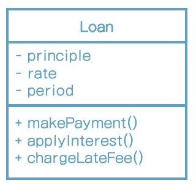

# 20장 업무 규칙

애플리케이션을 업무 규칙과 플러그인으로 구분하려면 업무 규칙이 실제로 무엇인지를 잘 이해해야만 한다.

엄밀하게 말하면 업무 규칙은 사업적으로 수익을 얻거나 비용을 줄일 수있는 규칙 또는 절차다. 더 엄밀하게 말하면 컴퓨터상으로 구현했는지와 상관없이, 업무 규칙은 사업적으로 수익을 얻거나 비용을 줄일 수 있어야 한다.

대출에 N%의 이자를 부과한다는 사실은 은행이 돈을 버는 업무 규칙이다. 

이러한 규칙을 핵심 업무 규칙이라고 부를 것이다.

핵심 업무 규칙은 보통 데이터를 요구한다. 예를 들어 대출에는 대출 잔액, 이자율, 지급 일정이 필요하다.

우리는 이러한 데이터를 핵심 업무 데이터라고 부르겠다.

핵심 규칙과 핵심 데이터는 본질적으로 결합되어 있기 때문에 객체로 만들 좋은 후보가 된다. 우리는 이러한 유형의 객체를 엔티티라고 하겠다.

## 엔티티

엔티티는 컴퓨터 시스템 내부의 객체로서, 핵심 업무 데이터를 기반으로 동작하는 일련의 조그만 핵심 업무 규칙을 구체화한다.

우리는 이러한 종류의 클래스를 생성할 때, 업무에서 핵심적인 개념을 구현하는 소프트웨어는 한데 모으고, 구축 중인 자동화 시스템의 나머지 모든 고려사항과 분리시킨다. 이 클래스는 업무의 대표자로서 독립적으로 존재한다. 이 클래스는 데이터베이스, 사용자 인터페이스, 서드파티 프레임워크에 대한 고려사항들로 인해 오염되어서는 절대 안 된다. 이 클래스는 어떤 시스템에서도 업무를 수행할 수 있으며, 시스템의 표현 형식이나 데이터 저장 방식, 그리고 해당 시스템에서 컴퓨터에 배치되는 방식과도 무관하다. 엔티티는 순전히 업무에 대한 것이며, 이외의 것은 없다.

## 유스케이스

은행 직원이 신규 대출을 생성할 때 사용하는 애플리케이션을 상상해보자. 은행에서 대출 담당자가 신청자의 신상정보를 수집하여 검증한 후, 신청자의 신용도가 500보다 낮다면 대출 견적을 제공하지 않기로 결정했다고 해 보자. 따라서 시스템에서 신상정보 화면을 모두 채우고 검증한 후, 신용도가 하한선보다 높은지가 확인된 이후에 대출 견적화면으로 진행되어야 한다는 식으로 은행에서 업무 요건을 기술했다고 해 보자.

바로 이것이 유스케이스다. 유스케이스는 자동화된 시스템이 사용되는 방법을 설명한다. 유스케이스는 사용자가 제공해야 하는 입력, 사용자에게 보여줄 출력, 그리고 해당 출력을 생성하기 위한 처리 단계를 기술한다. 엔티티 내의 핵심 업무 규칙과는 반대로, 유스케이스는 애플리케이션에 특화된 업무 규칙을 설명한다.

유스케이스만 봐서는 이 애플리케이션이 웹을 통해 전달되는지, 리치 클라이언트인지, 콘솔 기반인지 구분하기가 불가능하다.

유스케이스는 시스템이 사용자에게 어떻게 보이는지를 설명하지 않는다.

유스케이스는 객체다. 유스케이스는 애플리케이션에 특화된 업무 규칙을 구현하는 하나 이상의 함수를 제공한다. 또한 유스케이스는 입력 데이터, 출력 데이터, 엔티티에 대한 참조 데이터 등의 데이터 요소를 포함한다.

엔티티는 자신을 제어하는 유스케이스에 대해 아무것도 알지 못한다.

왜 엔티티는 고수준이며, 유스케이스는 저수준일까? 왜냐하면 유스케이스는 단일 애플리케이션에 특화되어 있으며, 따라서 해당 시스템의 입력과 출력에 보다 가깝게 위치하기 때문이다. 엔티티는 수많은 다양한 애플리케이션에서 사용될 수 있도록 일반화된 것이므로, 각 시스템의 입력이나 출력에서 더 멀리 떨어져 있다. 유스케이스는 엔티티에 의존한다. 반면 엔티티는 유스케이스에 의존하지 않는다.

## 요청 및 응답 모델

엔티티 객체를 가리키는 참조를 요청 및 응답 데이터 구조에 포함하려는 유혹은 받을 수도 있다. 하지만 이 유혹을 떨쳐내라! 이들 두 객체의 목적은 완전히 다르다. 시간이 지나면 두 객체는 완전히 다른 이유로 변경될 이고, 따라서 두 객체를 어떤 식으로든 함께 묶는 행위는 공통 폐쇄 원칙과 단일 책임 원칙을 위배하게 된다.

## 결론

업무 규칙은 소프트웨어 시스템이 존재하는 이유다. 업무 규칙은 핵심적인 기능이다. 업무 규칙은 수익을 내고 비용을 줄이는 코드를 수반한다.

업무 규칙은 사용자 인터페이스나 데이터베이스와 같은 저수준의 관심사로 인해 오염되어서는 안 되며, 원래 그대로의 모습으로 남아 있어야 한다.

