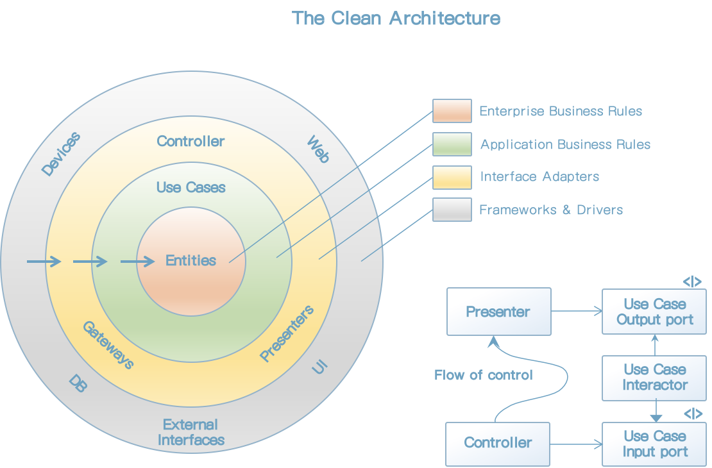

# 22장 클린 아키텍처

* 육각형 아키텍처(Hexagonal Architecture): 포트와 어댑터라고 알려져 있으며 앨리스터 코오본이 개발했다.

* DCI(Data, Context and Interaction):
* BCE(Boundary-Control-Entity)

이 아키텍처는 모두 세부적인 면에서는 다소 차이가 있더라도 그 내용은 상당히 비슷하다. 이들의 목표는 바로 <u>관심사의 분리</u>다.

이들 아키텍처는 모두 시스템이 다음과 같은 특징을 지니도록 만든다.

* 프레임워크 독립성. 아키텍처는 다양한 기능의 라이브러리를 제공하는 소프트웨어, 즉 프레임워크의 존재 여부에 의존하지 않는다.

* 테스트 용이성. 업무 규칙은 UI, 데이터베이스, 웹서버, 또는 여타 외부 요소가 없어도 테스트할 수 있다.

* UI 독립성. 시스템의 나머지 부분을 변경하지 않고도 UI를 쉽게 변경할 수 있다.

* 데이터베이스 독립성

* 모든 외부 에이전시에 대한 독립성. 실제로 업무 규칙은 외부 세계와의 인터페이스에 대해 전혀 알지 못한다.

    

## 의존성 규칙

위의 그림에서 안으로 들어갈수록 고수준의 소프트웨어가 된다. 바깥쪽 원은 매커니즘이고, 안쪽 원은 정책이다.

이러한 아키텍처가 동작하도록 하는 가장 중요한 규칙은 의존성 규칙이다.

> 소스 코드 의존성은 반드시 안쪽으로, 고수준의 정책을 행해야 한다.

내부의 원에 속한 요소는 외부의 원에 속한 어떤 것도 알지 못한다. 

### 엔티티

엔티티는 전사적인 핵심 업무 규칙을 캡슐화한다. 

엔티티는 업무 객체가 되고 고수준인 규칙을 캡슐화한다. 외부의 무언가가 변경되더라도 엔티티가 변경될 가능성은 지극히 낮다. 

### 유스케이스

유스케이스 계층의 소프트웨어는 애플리케이션에 특화된 업무 규칙을 포함한다. 유스케이스는 엔티티로 들어오고 나가는 데이터 흐름을 조정하며 엔티티의 업무 규칙을 사용해서 유스케이스의 목적을 달성하도록 이끈다.

이 계층에서 발생한 변경이 엔티티에 영향을 줘서는 안된다. 또한 데이터베이스, UI 또는 여타 프레임워크와 같은 외부 요소에서 발생한 변경이 이 계층에 영향을 줘서도 안된다.

### 인터페이스 어댑터

인터페이스 어댑터 계층은 일련의 어댑터들로 구성된다. 프레젠터, 뷰, 컨트롤러는 모두 인터페이스 어댑터 계층에 속한다. 

### 프레임워크와 드라이버

일반적으로 데이터베이스나 웹 프레임워크 같은 프레임워크나 도구들로 구성된다.

### 원은 네 개여야만 하나?

항상 네 개만 사용해야 한다는 규칙은 없다. 하지만 어떤 경우에도 의존성 규칙은 적용된다. 

### 경계 횡단하기

그림 22.1의 우측 하단 다이어그램에 원의 경계를 횡단하는 방법을 보여준 예시가 있다. 제어 흐름은 컨트롤러에서 시작해서, 유스케이스를 지난 후, 프레젠터에서 실행되면서 마무리 된다.

제어흐름과 의존성 방향이 반대여야 하는경우 대체로 의존성 역전 원칙을 사용하여 해결한다. 

예를 들어 유스케이스가 프레젠터를 호출해야 한다고 가정해보자. 직접 호출해 버리면 의존성 규칙을 위배하기 때문에 유스케이스가 내부 원의 인터페이스를 호출하도록 하고, 외부 원의 프레젠터가 그 인터페이스를 구현하도록 만든다.

### 경계를 횡단하는 데이터는 어떤 모습인가?

경계를 가로지르는 데이터는 흔히 간단한 데이터 구조로 이루어져 있다. 경계를 가로질러 데이터를 전달할 때, 데이터는 항상 내부의 원에서 사용하기에 가장 편리한 형태를 가져야만 한다.

### 전형적인 시나리오

### 결론

