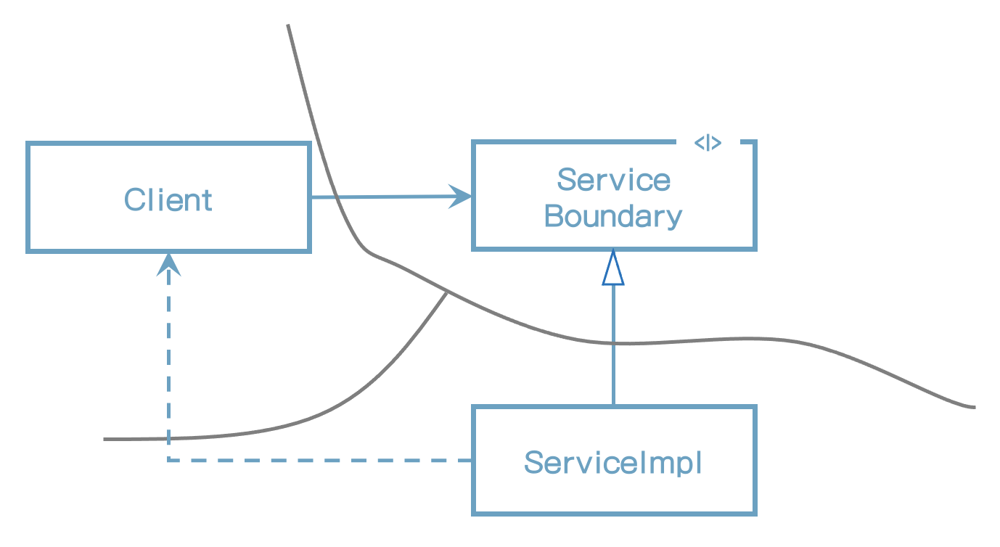
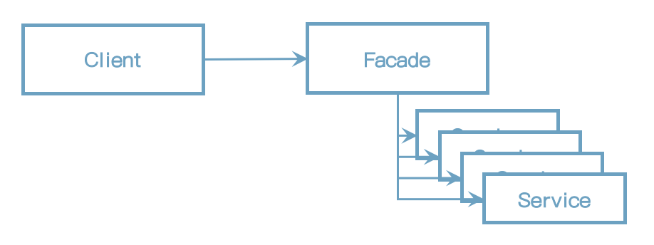

# 24장 부분적 경계

아키텍처 경계를 완벽하게 만드는 데는 비용이 많이 든다. 쌍방향의 다형적 Boundary 인터페이스, Input과 Output을 위한 데이터 구조를 만들어야 할 뿐만 아니라, 두 영역을 독립적으로 컴파일하고 배포할 수 있는 컴포넌트로 격리하는 데 필요한 모든 의존성을 관리해야 한다. 이렇게 만들려면 엄청난 노력을 기울여야 하고, 유지하는 데도 또 엄청난 노력이 든다.

많은 경우에, 뛰어난 아키텍트라면 이러한 경계를 만드는 비용이 너무 크다고 판단하면서도, 한편으로는 나중에 필요할 수도 있으므로 이러한 경계에 필요한 공간을 확보하기 원할 수도 있다.

애자일 커뮤니티에 속한 사람 중 많은 이가 이러한 종류의 선행적인 설계를 탐탁치 않게 여기는데 YAGNI(You Aren't Going to Need It) 원칙을 위배하기 때문이다. 하지만 아키텍트라면 이 문제를 검토하면서 "그래, 하지만 어쩌면 필요할지도."라는 생각이 들 수도 있다. 만약 그렇다면 부분적 경계를 구현해 볼 수 있다.

## 마지막 단계를 건너 뛰기

부분적 경계를 생성하는 방법 하나는 독립적으로 컴파일하고 배포할 수 있는 컴포넌트를 만들기 위한 작업은 모두 수행한 후, 단일 컴포넌트에 그대로 모아만 두는 것이다. 쌍방향 인터페이스도 그 컴포넌트에 있고, 입력, 출력 데이터 구조도 거기에 있으며, 모든 것이 완전히 준비되어 있다. 하지만 이 모두를 단일 컴포넌트로 컴파일해서 배포한다.

아무리 보아도 이처럼 부분적 경계를 만들려면 완벽한 경계를 만들 때 만큼의 코드량과 사전 설계가 필요하다. 하지만 다수의 컴포넌트를 관리하는 작업은 하지 않아도 된다. 

## 일차원 경계

완벽한 형태의 아키텍처 경계는 양방향으로 격리된 상태를 유지해야 하므로 쌍방향 Boundary 인터페이스를 사용한다. 양방향으로 격리된 상태를 유지하려면 초기 설정할 때나 지속적으로 유지할 때도 비용이 많이 든다.

추후 완벽한 형태의 경계로 확장할 수 있는 공간을 확보하고자 할 때 활용할 수 있는 더 간단한 구조가 그림에 나와 있다. 이는 전통적인 전략(Strategy) 패턴을 사용한 전형적인 사례다. ServiceBoundary 인터페이스는 클라이언트가 사용하며 ServiceImpl 클래스가 구현한다.

그림) 전략 패턴

이 방식이 미래에 필요할 아키텍처 경계를 위한 무대를 마련한다는 점은 명백하다. Client를 ServiceImp로 부터 격리시키는 데 필요한 의존성 역전이 이미 적용되었기 때문이다. 또한 이 다이어그램의 위험천만한 점선 화살표에서 보듯이 이러한 분리는 매우 빠르게 붕괴될 수 있다는 점 역시 분명하다. 쌍방향 인터페이스가 없고 개발자와 아키텍트가 근면 성실하고 제대로 훈련되어 있지 않다면, 이 점선과 같은 비밀 통로가 생기는 일을 막을 방법이 없다.

## 퍼사드

이보다 훨씬 더 단순한 경계를 퍼사드(Facade) 패턴으로, 그림과 같다. 이 경우에는 심지어 의존성 역전까지 희생한다. 경계는 Facade 클래스로만 간단히 정의된다. Facade 클래스에는 모든 서비스 클래스를 메서드 형태로 정의하고, 서비스 호출이 발생하면 해당 서비스 클래스로 호출을 전달한다. 클라이언트는 이들 서비스 클래스로 직접 접근할 수 없다.

그림) 파사드 패턴

하지만 Client가 모든 서비스 클래스에 대해 추이 종속성을 가지게 된 것을 주목하자. 정적 언어였다면 서비스 클래스 중 하나에서 소스 코드가 변경되면 Client도 모두 재컴파일해야 할 것이다. 이러한 구조라면 비밀 통로 또한 정말 쉽게 만들 수 있다는 사실도 충분히 파악할 수 있을 것이다.

## 결론

아키텍처 경계를 부분적으로 구현하는 간단한 방법 세 가지를 살펴봤다. 

이러한 접근법 각각은 나름의 비용과 장점을 지닌다. 각 접근법은 완벽한 형태의 경계를 담기 위한 공간으로써, 적절하게 사용할 수 있는 상황이 서로 다르다. 또한 각 접근법은 해당 경계가 실제로 구체화되지 않으면 가치가 떨어질 수 있다.

아키텍처 경계가 언제, 어디에 존재해야 할지, 그리고 그 경계를 완벽하게 구현할지 아니면 부분적으로 구현할지를 결정하는 일 또한 아키텍트의 역할이다.

