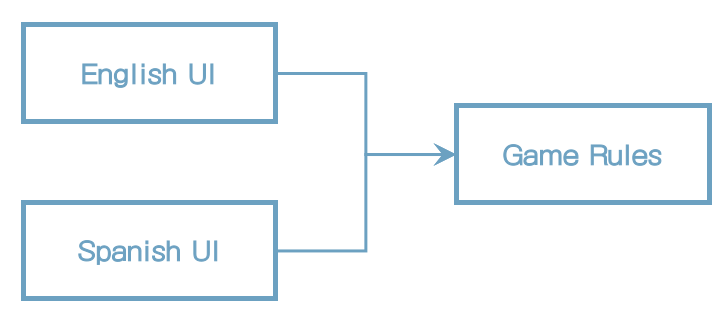

# 25장 계층과 경계

시스템 세 가지 컴포넌트(UI, 업무 규칙, 데이터베이스)로만 구성된다고 생각하기 쉽다. 몇몇 단순한 시스템에서는 이 정도로 충분하다. 하지만 대다수의 시스템에서 컴포넌트의 개수는 이보다 훨씬 많다.

## 움퍼스 사냥 게임

1972년에 발매된 인기있는 모험 게임인 움퍼스 사냥 게임

텍스트 기반 UI는 그대로 유지하되, 게임 규칙과 UI를 분리해서 우리 제품을 여러 시장에서 다양한 언어로 발매할 수 있게 만든다고 가정해 보자. 게임 규칙은 언어 독립적인 API를 사용해서 UI 컴포넌트와 통신할 것이고, UI는 API를 사람이 이해할 수 있는 언어로 변환할 것이다.

그림처럼 소스 코드 의존성을 적절히 관리하면, UI 컴포넌트가 어떤 언어를 사용하더라도 게임 규칙을 재사용할 수 있다.

그림) UI 컴포넌트가 어떤 언어를 사용하더라도 게임 규칙을 재사용할 수 있다.

또한 게임의 상태를 영속적인 저장소에 유지한다고 가정해 보자.

우리는 게임 규칙이 다양한 종류의 데이터 저장소에 대해 알지 않기를 원한다. 따라서 그림에서 보듯이 의존성 규칙을 준수할 수 있도록 의존성이 적절한 방향을 가리키게 만들어야 한다.

그림) 의존성 규칙 준수하기

## 클린 아키텍처

클린 아키텍처 접근법을 적용해서 유스케이스, 경계, 엔티티, 그리고 관련된 데이터 구조를 모두 만드는 일도 쉬운 일이다.

UI에서 언어가 유일한 변경의 축은 아니다. 이 밖에도 텍스트를 주고받는 메커니즘을 다양하게 만들고 싶을 수도 있다. 예를 들어 일반적인 셀(shell) 창을 사용하고 싶을 때도 있고, 텍스트 메시지나 채팅 애플리케이션을 사용하기를 원할 수도 있다.

그래서 언어를 통신 메커니즘으로부터 격리하는 API를 생성해야 할 수도 있다.

그림) 개선된 다이어그램

점선으로 된 테두리는 API를 정의하는 추상 컴포넌트를 가리키며, 해당 API는 추상 컴포넌트 위나 아래의 컴포넌트가 구현한다.

이러한 변형들을 모두 제거하고 순전히 API 컴포넌트만 집중하면 다이어그램을 단순화할 수 있다.

그림) 단순화된 다이어그램

그림의 다이어그램은 모두 화살표가 위로 향하도록 맞춰졌다는 점에 주목하자. 그 결과 Game Rules는 최상위에 놓인다. GameRules는 최상위 수준의 정책을 가지는 컴포넌트이므로 이치에 맞는 배치다.

