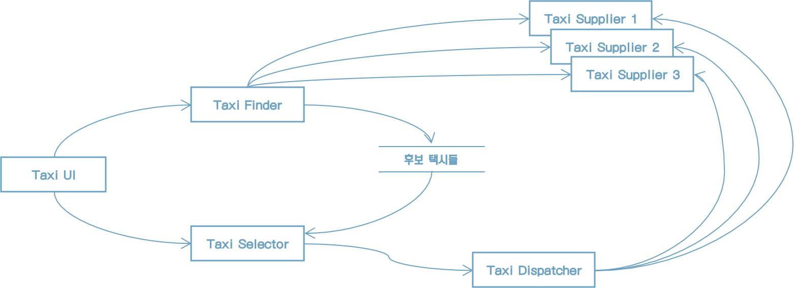
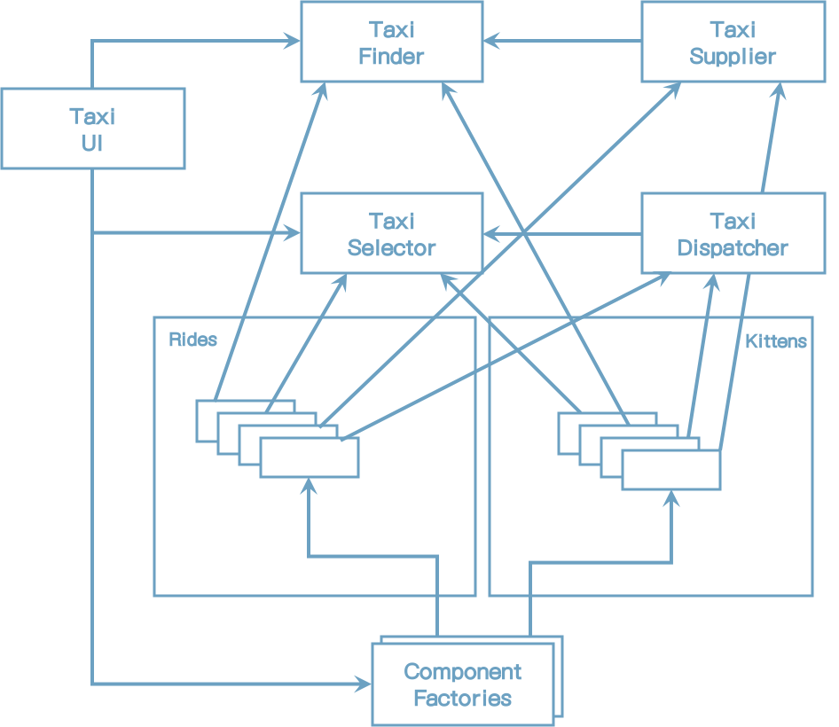
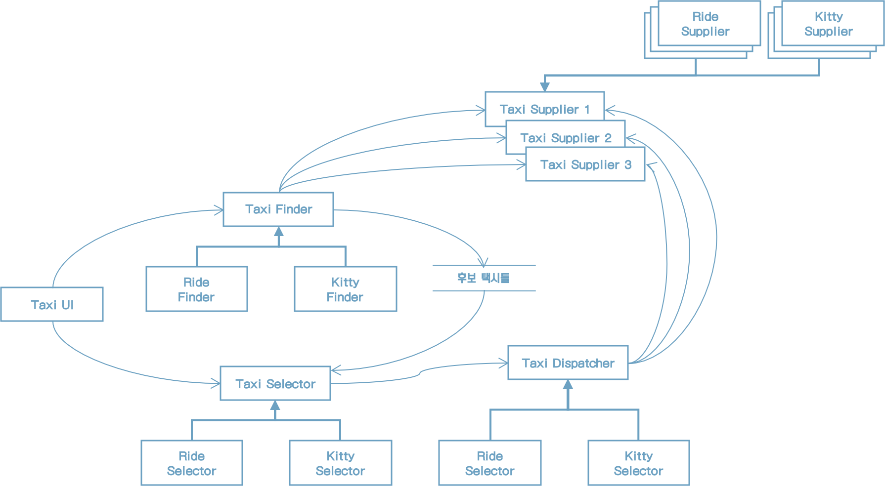
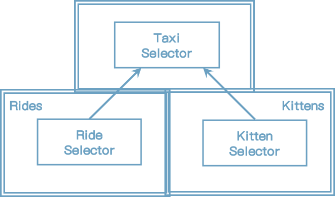

# 27장 '크고 작은 모든' 서비스들

서비스 지향 '아키텍처'와 마이크로서비스 '아키텍처'는 최근에 큰 인기를 끌고 있는 이유는 다음과 같다.

* 서비스를 사용하면 상호 결합이 철저하게 분리되는 것처럼 보인다. 나중에 보겠지만, 이는 일부만 맞는 말이다.
* 서비스를 사용하면 개발과 배포 독립성을 지원하는 것처럼 보인다. 나중에 보겠지만, 이 역시도 일부만 맞는 말이다.

## 서비스 아키텍처?

서비스를 사용하다는 것이 아키텍처에 해당하는지 생각해보자. 이 개념은 사실이 아니다. 시스템 아키텍처는 의존성 규칙을 준수하며 고수준 정첵을 저수준의 세부사항으로부터 분리하는 경계에 의해 정의된다. 

모든 서비스가 아키텍처 관점에서 중요해야만 하는 것은 아니다. 기능을 프로세스나 플랫폼에 독립적이 되게끔 서비스들을 생성하면 의존성 규칙 준수 여부와 상관없이 큰 도움이 될 때가 많다. 그러나 서비스 그자체로는 아키텍처를 정의하지 않는다.

모노리틱 시스템이나 컴포넌트 기반 시스템에서 아키텍처를 정의하는 요소는 바로 의존성 규칙을 따르며 아키텍처 경계를 넘나드는 함수 호출들이다.

## 서비스의 이점

### 결합 분리의 오류

시스템을 서비스들로 분리함으로써 얻는 장점은 서비스 결합이 분리된다는 점이다. 각 서비스는 다른 프로세서에서 실행된다. 따라서 서비스는 다른 서비스의 변수에 직접 접근할 수 없다. 

그렇지만 꼭 그런 것만은 아니다. 서비스는 개별 변수 수준에서는 각각 결합이 분리된다. 하지만 프로세서 내의 공유자원 때문에 결합될 가능성이 여전히 존재한다. 

예를 들어 서비스 사이를 오가는 데이터 레코드에 새로운 필드를  추가한다면 이 필드를 사용해 동작하는 모든 서비스는 반드시 변경되어야 한다. 또한 이 서비스들을 이 필드에 담긴 데이터를 해석하는 방식을 사전에 완벽하게 조율해야 한다. 

### 개발 및 배포 독립성의 오류

서비스를 사용할때 얻는 이점 줌 하나는 전담팀이 서비스를 소유하고 운영한다는 점이다. 데브옵스 전략의 일환으로 전담팀에서 각 서비스를 작성하고, 유지보수하며, 운영하는 책임을 질 수 있다. 이러한 개발 및 배포 독립성은 확장 가능한 것으로 간주된다. 대규모 엔터프라이즈 시스템을 독립적으로 개발하고 배포 가능한 수십, 수백, 수천 개의 서비스들을 이용하여 만들 수 있다고 믿는다. 시스템의 개발, 유지보수, 운영 또한 비슷한 수의 독립적인 팀 단위로 분할할 수 있다고 여긴다. 

이러한 믿음에도 어느 정도 일리가 있지만, 극히 일부일 뿐이다. 첫째로, 대규모 엔터프라이즈 시스템은 서비스 기반 시스템 이외에도 모노리틱 시스템이나 컴포넌트 기반 시스템으로도 구축할 수 있다는 사실은 역사적으로 증명되어 왔다. 따라서 서비스는 확장 가능한 시스템을 구축하는 유일한 선택지가 아니다.

둘째, '결합 분리의 오류'에 따르면 서비스라고 해서 항상 독립적으로 개발하고, 배포하며, 운영할 수 있는 것은 아니다. 데이터의 행위에서 어느 정도 결합되어 있다면 결합된 정도에 맞게 개발, 배포, 운영을 조정해야만 한다.

## 야옹이 문제

택시 통합 시스템 - 고객은 승차시간, 비용, 고급 택시 여부, 운전사 경력 등 다양한 기준에 따라 택시를 선택할 수 있다고 가정하자.

확장 가능한 시스템을 구축하고 싶었기에, 수많은 작은 마이크로 시비스를 기반으로 구축하기로 결정했다. 개발팀 직원을 많은 소규모 팀으로 세분화했고, 각 팀이 팀 규모에 맞게 적당한 수의 서비스를 개발하고, 유지보수하며, 운영하는 책임을 지도록 했다.

다이어그램은 가상의 아키텍트가 서비스를 배치하여 이 애플리케이션을 어떻게 구현했는지 보여준다. TaxiUI서비스는 고객을 담당하며 고객은 모바일 기기를 이용해서 택시를 호출한다. TaxiFinder 서비스는 여러 TaxiSupplier의 현황을 검토하여 사용자에게 적합한 택시 후보들을 선별한다. TaxiFinder 서비스는 해당 사용자에 할당된 단기 데이터 레코드에 후보 택시들의 정보를 저장한다. TaxiSelector 서비스는 사용자가 지정한 비용, 시간, 고급 여부 등의 조건을 기초로 후보 택시 중에서 적합한 택시를 선택한다. 이제 TaxiSelector 서비스가 해당 택시를 TaxiDispatcher 서비스로 전달하면, TaxiDispatcher 서비스는 해당 택시에 배차 지시를 한다.

[그림 27.1] 택시 통합 서비스를 구현하기 위해 배치된 서비스들

이 시스템을 일년 이상 운영해왔다. 어느날 마케팅 부서에서 개발팀과 미팅을 잡는다. 이 미팅에서 마케터들은 도시에 야옹이를 배달하는 서비스를 제공하겠다는 계획을 발표한다. 

야옹이 배달 주문이 오면, 근처의 택시가 선택되고 승차 지점 중 한 곳에서 야옹이를 태운 후, 올바른 주소로 야옹이를 배달해야 한다. 

당연하지만, 어떤 운전자는 고양이 알러지가 있을 수 있기 때문에, 해당 운전자는 이 서비스에서 제외되어야 한다. 또한 일반 택시 승객 역시 비슷한 알러지를 일으킬 수 있으므로, 배차를 신청한 고객이 알러지가 있다고 밝힌 경우에는 지난 3일 사이에 야옹이를 배달했던 차량은 배차되지 않아야 한다.

이 기능을 구현하려면 이들 서비스 중 어디를 변경해야 할까? 다시 말해 이 서비스들은 모두 결합되어 있어서 독립적으로 개발하고 배포하거나 유지될 수 없다.

이게 바로 횡단 관심사가 지닌 문제다. 

## 객체가 구출하다

컴포넌트 기반 아키텍처에서는 이 문제를 어떻게 해결했을까? SOLID 설계 원칙을 잘 들여다보면, 다형적으로 확장할 수 있는 클래스 집합을 생성해 새로운 기능을 처리하도록 함을 알 수 있다. 

그림 27.2의 다이어그램은 이 전략을 보여준다. 이 다이어그램의 클래스들은 그림 27.1에서 보여준 서비스들과 거의 일치한다. 하지만 경계를 주목하자. 또한 의존성들이 의존성 규칙을 준수한다는 점도 주목하자.

원래 서비스의 로직 중 대다수가 이 객체 모델의 기반 클래스들 내부로 녹아들었다. 하지만 배차에 특화된 로직 부분은 Rides 컴포넌트로 추출되고, 야옹이에 대한 신규 기능은 Kittens 컴포넌트에 들어갔다. 이 두 컴포넌트는 기존 컴포넌트들에 있는 추상 기반 클래스를 템플릿 메서드나 전략 패턴 등을 이용해서 오버라이드 한다. 

두 개의 신규 컴포넌트인 Rides와 Kittens가 의존성 규칙을 준수한다는 점에 다시 한번 주목하자. 또한 이 기능들을 구현하는 클래스들은 UI의 제어하에 팩토리가 생성한다는 점에도 주목하자.

이 전략을 따르더라도 야옹이 기능을 구현하려면 TaxiUI는 어쩔 수 없이 변경해야 한다. 하지만 그 외의 것들은 변경할 필요가 없다.

[그림 27.2] 객체 지향 방식으로 횡단 관심사를 처리하기

 

## 컴포넌트 기반 서비스

이제 물어봐야 할 질문은 "서비스에도 이렇게 할 수 있을까?"다. 그 대답은 물론 "예"다.

자바의 경우, 서비스를 하나 이상의 jar 파일에 포함되는 추상 클래스들의 집합이라고 생각하라. 새로운 기능 추가 혹은 기능 확장은 새로운 jar 파일로 만든다. 이때 새로운 jar 파일을 구성하는 클래스들은 기존 jar 파일에 정의된 추상 클래스들을 확장해서 만들어진다. 그러면 새로운 기능 배포는 서비스를 재배포하는 문제가 아니라, 서비스를 로드하는 경로에 단순히 새로운 jar 파일을 추가하는 문제가 된다. 다시 말해 새로운 기능을 추가하는 행위가 개방 폐쇄 원칙을 준수하게 된다.

그림 27.3의 서비스 다이어그램은 이 구조를 보여준다. 서비스들의 존재는 이전과 달라진 게 없지만, 각 서비스의 내부는 자신만의 컴포넌트 설계로 되어 있어서 파생 클래스를 만드는 방식으로 신규 기능을 추가할 수 있다. 파생 클래스들은 각자의 컴포넌트 내부에 놓인다.

[그림 27.3] 각 서비스의 내부는 각자의 방식대로 컴포넌트를 설계할 수 있으며, 파생 클래스를 만들어서 신규 기능을 추가할 수 있다.

## 횡단 관심사

지금까지 배운 것은 아키텍처 경계가 서비스 사이에 있지 않다는 사실이다. 오히려 서비스를 관통하며, 서비스를 컴포넌트 단위로 분할한다.

모든 주요 시스템이 직면하는 횡단 관심사를 처리하려면 그림 27.4의 다이어그램에서 보듯이, 서비스 내부는 의존성 규칙도 준수하는 컴포넌트 아키텍처로 설계해야 한다. 이 서비스들은 시스템의 아키텍처 경계를 정의하지 않는다. 아키텍처 경계를 정의하는 것은 서비스 내에 위치한 컴포넌트다.

[그림 27.4] 서비스 내부는 의존성 규칙도 준수하는 컴포넌트 아키텍처로 설계해야 한다.

## 결론

서비스는 시스템의 확장성과 개발 가능성 측면에서 유용하지만, 그 자체로는 아키텍처적으로 그리 중요한 요소는 아니다. 시스템의 아키텍처는 시스템 내부에 그어진 경계와 경계를 넘나드는 의존성에 의해 정의된다. 시스템의 구성 요소가 통신하고 실행되는 물리적인 메커니즘에 의해 아키텍처가 정의되는 것은 아니다.

서비스는 단 하나의 아키텍처 경계로 둘러싸인 단일 컴포넌트로 만들 수 있다. 혹은 여러 아키텍처 경계로 분리된 다수의 컴포넌트로 구성할 수도 있다. 드물게는 클라이언트와 서비스가 강하게 결합되어 아키텍처적으로 아머런 의미가 없을 때도 있다.

