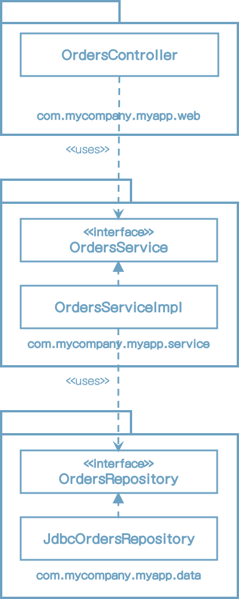
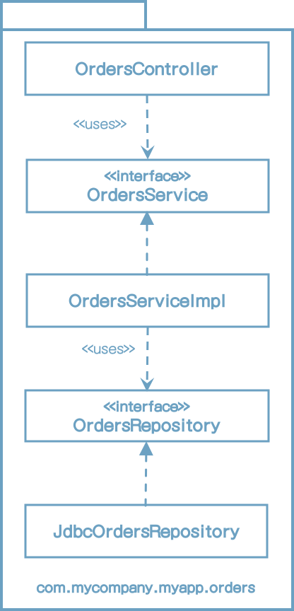
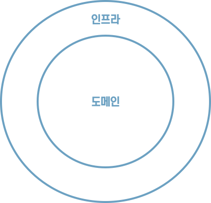
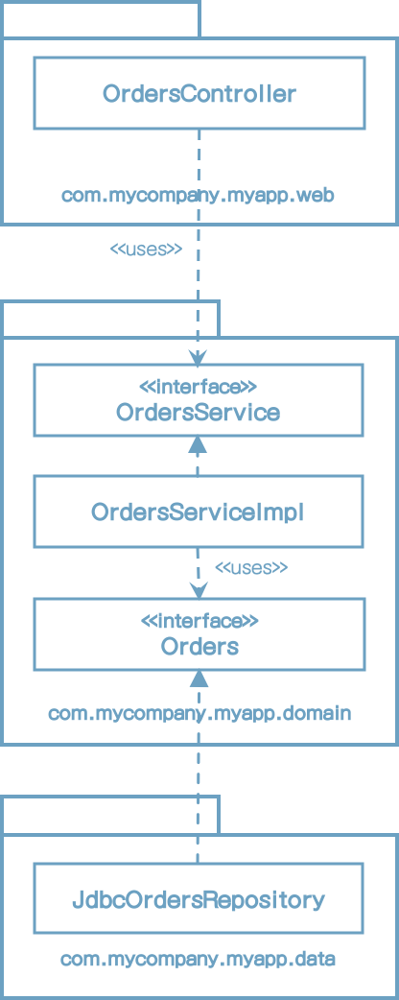
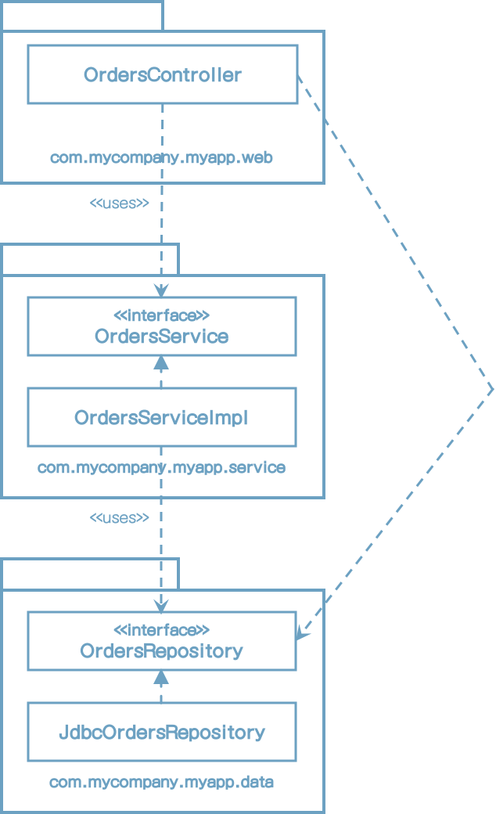
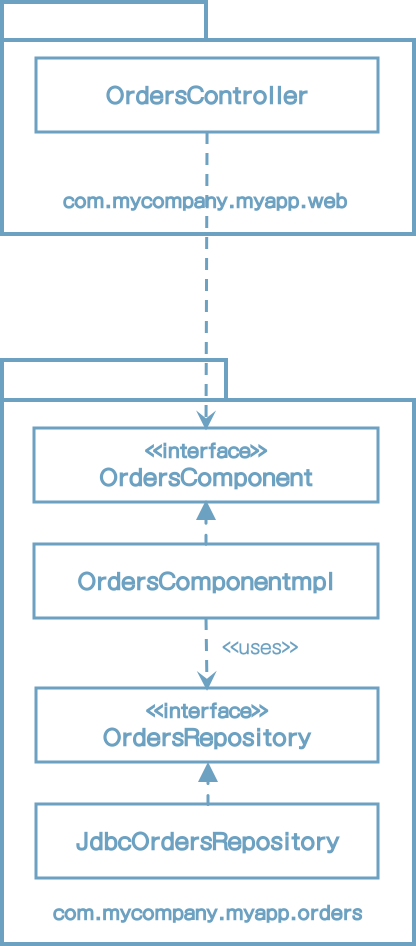
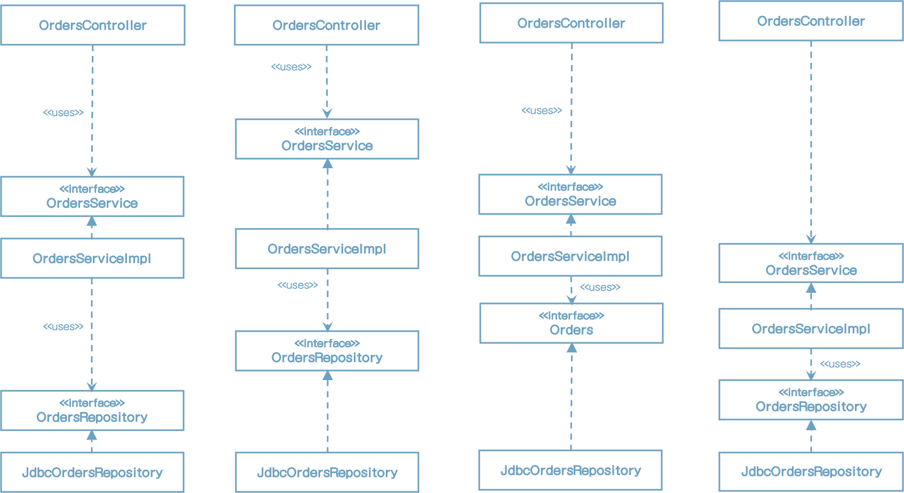
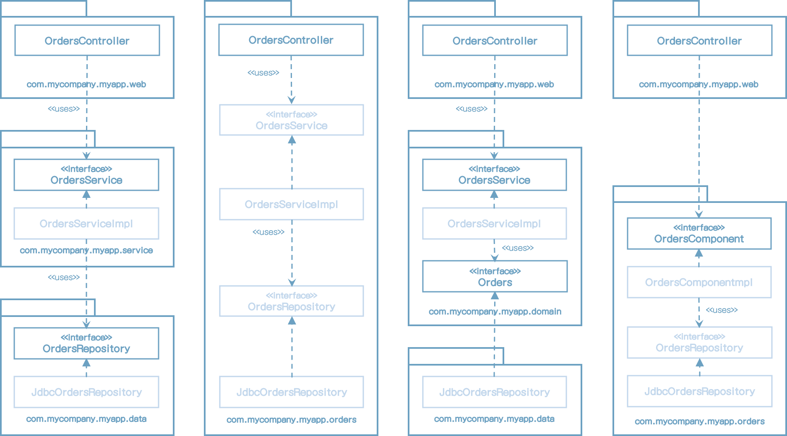

# 34장 빠져 있는 장

소프트웨어는 올바르게 정의된 경계, 명확한 책임, 그리고 통제된 의존성을 가진 클래스와 컴포넌트로 구성될 것이다. 하지만 악마는 디테일(구현 세부사항)에 있는 법이며, 이점을 심사숙고 하지 않는다면 마지막 고비에 걸려 넘어지기 십상일 것이다.

예를 들어 온라인 서점을 구축하고 있으며, 고객이 주문 상태를 조회할 수 있어야 한다는 유스케이스를 구현해야 한다고 해보자.

## 계층 기반 패키지

가장 단순한 설계 방식은 전통적인 수평 계층형 아키텍처다. 기술적인 관점에서 해당 코드가 하는 일에 기반해 그 코드를 분할한다. 이 방식을 '계층 기반 패키지'라고 부른다.

이 전형적인 계층형 아키텍처에는  웹, '업무 규칙', 영속성 코드를 위해 계층이 각각 하나씩 존재한다. 다시 말해 계층이라는 얇은 수평 조각으로 나뉘며, 각 계층은 유사한 종류의 것들을 묶는 도구로 사용된다. '엄격한 계층형 아키텍처'의 경우 계층은 반드시 바로 아래 계층에만 의존해야 한다.

* OrdersController: 웹 컨트롤러이며, 웹 기반 요청을 처리한다. Spring MVC 컨트롤러 등이 여기 해당한다.
* OrdersService: 주문 관련 '업무 규칙'을 정의하는 인터페이스
* OrdersServiceImpl: OrdersService의 구현체
* OrdersRepository: 영구 저장된 주문정보에 접근하는 방법을 정의하는 인터페이스
* JdbcOrdersRepository: OrdersRepository 인터페이스의 구현체

이런 방식은 엄청난 복잡함을 겪지 않고도 무언가를 작동시켜 주는 아주 빠른 방법이다. 문제는 소프트웨어가 복잡해지기 시작하면, 머지 않아 큰 그릇 세개만으로 모든 코드를 담기에 부족하다는 사실을 깨닫고 더 잘게 모듈화해야 할지를 고민하게 될 것이다.

엉클 밥이 이미 언급했듯이, 계층형 아키텍처는 업무 도메인에 대해 아무것도 말해주지 않는다는 문제도 있다. 

## 기능 기반 패키지

코드를 조직화하는 또 다른 선택지로 '기능 기반 패키지' 구조도 있다. 이는 서로 연관된 기능, 도메인 개념 또는 (도메인 주도 설계 용어를 사용한다면) Aggregate Root에 기반하여 수직의 얇은 조각으로 코드를 나누는 방식이다. 모든 타입이 하나의 자바 패키지에 속하며 패키지 이름은 그 안에 담긴 개념을 반영해 짓는다.

모두가 단 하나의 패키지에 속하게 된다. 이는 '계층 기반 패키지'를 아주 간단히 리팩터링 한 형태지만, 이제 코드의 상위 수준 구조가 업무 도메인에 대해 무언가를 알려주게 된다. 드디어 이 코드가 웹, 서비스, 리포지토리가 아니라 주문과 관련된 무언가를 한다는 걸 볼 수 있다.

또 다른 이점으로, '주문 조회하기' 유스케이스가 변경될 경우 변경해야 할 코드를 모두 찾는 작업이 더 쉬워질 수 있다. 변경해야할 코드가 여러 군데 퍼져 있지 않고 모두 한 패키지에 담겨 있기 때문이다.

나는 소프트웨어 개발팀이 수평적 계층화(계층 기반 패키지)의 문제를 깨닫고 수직적 계층화(기능 기반 패키지)로 전환하는 걸 자주 목격했다. 

## 포트와 어댑터

엉클 밥에 따르면, '포트와 어댑터' 혹은 '육각형 아키텍처', '경계, 컨트롤러, 엔티티'등의 방식으로 접근하는 이유는 업무/도메인에 초점을 둔 코드가 프레임워크나 데이터베이스 같은 기술적인 세부 구현과 독립적이며 분리된 아키텍처를 만들기 위해서다. '내부'(도메인)와 '외부'(인프라)로 구성됨을 흔히 볼 수 있다.

'내부'영역은 도메인 개념을 모두 포함하는 반면, '외부'영역은 외부 세계(예: UI, 데이터베이스, UI, 서드파티 통합)와의 상호작용을 포함한다. 여기서 주요 규칙은 바로 '외부'가 '내부'에 의존하며, 절대 그 반대로는 안된다는 점이다. 아래는 '주문 조회하기' 유스케이스를 이 방식으로 구현한 모습이다.

여기에서 com.mycompany.myapp.domain 패키지가 '내부'이며, 나머지 패키지는 모두 '외부'다. 이전 다이어그램의 OrdersRepository가 Orders라는 간단한 이름으로 바뀌었음을 눈치챘을 것이다. 도메인 주도 설계에서는 '내부'에 존재하는 모든 것의 이름은 반드시 '유비쿼터스 도메인 언어' 관점에서 기술하라고 조언한다. 바꿔 말하면 도메인에 대해 논의할 때 우리는 '주문'에 대해 말하는 것이지, '주문 리포지토리'에 대해 말하는 것이 아니다.

## 컴포넌트 기반 패키지

계층형 아키텍처의 목적은 기능이 같은 코드끼리 서로 분리하는 것이다. 웹 관련 코드는 업무 로직으로 분리하고 업무로직은 다시 데이터 접근으로부터 분리한다. 구현관점에서 각 계층은 일반적으로 자바 패키지에 해당한다. 

예를 들어 팀에서 신규 인력을 고용하여 주문과 관련된 또 다른 유스케이스를 구현하라고 지시했다고 가정하자. OrdersController 클래스에 OrdersRepository 인터페이스를 의존성으로 주입하여 만들수도 있다.

의존성 화살표는 아래를 향하지만 OrdersController가 OrdersService를 우회하고 있다.

여기에서 우리에게 필요한 지침으로 "웹 컨트롤러는 절대로 리포지토리에 직접 접근해서는 안된다"와 같은 원칙이 필요하다. 

이런 위반사례를 정적 분석도구를 사용하여 체크할 수도 있다. 다소 조잡하지만 효과가 있다.

"컴포넌트 기반 패키지"를 도입해야하는 이유는 바로 이 때문이다.

본질적으로 이 접근법에서는 '업무 로직'과 영속성 관련 코드를 하나로 묶는데, 이 묶음을 나는 '컴포넌트'라고 부른다.

> 컴포넌트는 배포 단위다. 컴포넌트는 시스템의 구성 요소로, 배포할 수 있는 가장 작은 단위다. 자바의 경우 jar파일이 컴포넌트다.

## 조직화 vs. 캡슐화

자바 애플리케이션에서 모든 타입을 public으로 지정한다면, 패키지는 단순히 조직화를 위한 메커니즘으로 전략하여 캡슐화를 위한 메커니즘이 될 수 없다. Public 타입을 코드 베이스 어디에서도 사용할 수 있다면 패키지를 사용하는데 이점이 거의 없다. 사실상 패키지를 사용하지 않는 것과 같다. Public 지시자를 과용하면 이 장의 앞에서 제시한 네 가지 아키텍처 접근법은 본질적으로 완전히 같아진다.

네 개의 아키텍처 접근법이 모두 동일하다.

첫 번째, '계층 기반 패키지' 접근법에서 OrdersService와 OrdersRepository 인터페이스는 외부 패키지의 클래스로 부터 자신이 속한 패키지 내부로 들어오는 의존성이 존재하므로 public으로 선언되어야 한다. 반면 구현체 클래스 (OrdersServiceImpl과 JdbcOrdersRepository)는 더 제한적으로 선언할 수 있다. (패키지 protected)

두 번째, '기능 기반 패키지' 접근법에서는 OrdersController가 패키지로 들어올 수 있는 유일한 통로를 제공하므로 나머지는 모두 패키지 protected로 지정할 수 있다. 

세 번째, '포트와 어댑터' 접근법의 경우 OrdersService와 Orders 인터페이스는 외부로 들어오는 의존성을 가지므로 public을 지정해야 한다.

마지막으로 '컴포넌트 기반 패키지' 접근법에서는 컨트롤러에서 Orders Component 인터페이스로 향하는 의존성을 가지며 그 외의 모든 것은 패키지 protected로 지정할 수 있다. public 타입이 적으면 적을수록 필요한 의존성의 수도 적어진다.

옅은 색으로 표시한 타입은 더 제한적인 접근 지시자를 사용할 수 있다.

## 다른 결합 분리 모드

프로그래밍 언어가 제공하는 방법 외에도 소스코드 의존성을 분리하는 방법은 존재할 수 있다. 예를 들어 자바에는 OSGi같은 모듈 프레임워크나 자바 9에서 제공하는 새로운 모듈 시스템이 있다. 모듈 시스템을 제대로 사용하면 public 타입과 외부에 공표할 타입을 분리할 수 있다.

다른 선택지로는 소스 코드 수준에서 의존성을 분리하는 방법도 있다.

포트와 어댑터를 예를 들자면

* 업무와 도메인용 소스 코드
* 웹용 소스코드
* 데이터 영속성용 소스코드

마지막 두 소스코드 트리는 업무와 도메인 코드에 대해 컴파일 시점에 의존성을 가지며, 업무와 도메인 코드 자체는 웹이나 데이터 영속성 코드에 대해서는 아무것도 알지 못한다. 구현 관점에서 이렇게 분리하려면 빌드 도구를 사용해서 모듈이나 프로젝트가 서로 분리되도록 구성해야 한다.

하지만 이는 너무 이상적인 해결책이다. 현실에서 소스코드를 이처럼 나누다 보면 성능, 복잡성, 유지보수 문제가 생기기 때문이다.

포트와 어댑터 접근법을 적용할 때는 이보다 간단한 방법을 사용하기도 하는데, 단순히 소스코드 트리를 두개만 만드는 것이다.

* 도메인 코드('내부')
* 인프라 코드('외부)')

