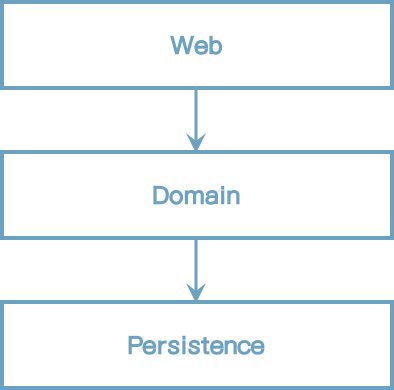
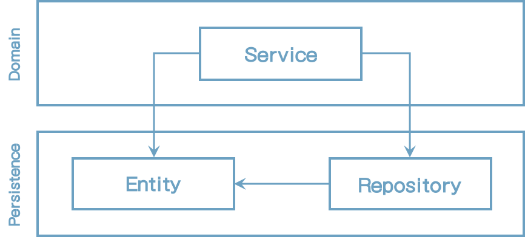
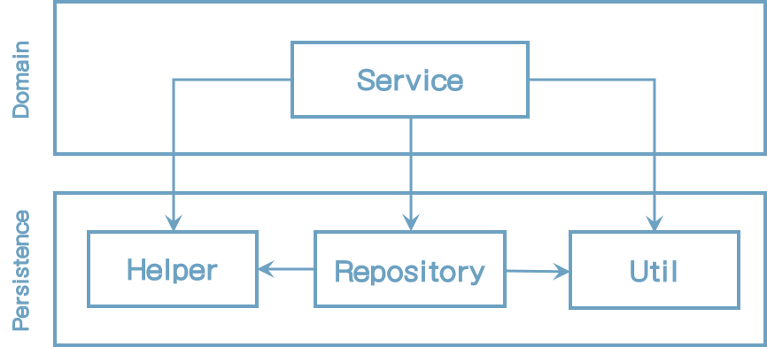
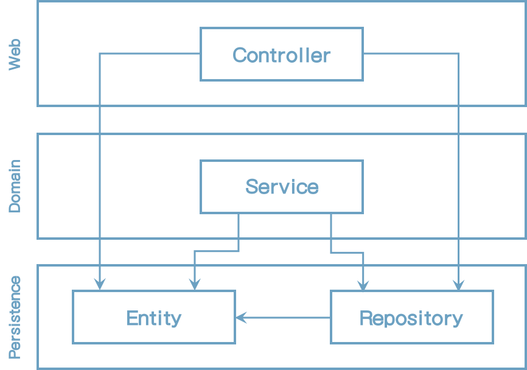
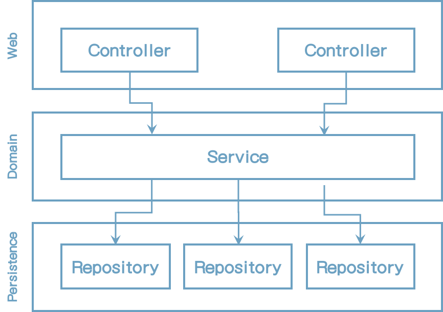

# 1 계층 구조의 문제점

예전에 계층형(웹) 애플리케이션을 개발해 본 적이 있을 것이다. 또한 지금 프로젝트에도 적용하고 있을지도 모르겠다. (실제로 난 지금도 하고 있다)

계층형에 대한 개념은 컴퓨터 과학 분야, 교육 안내서, 모범 사례 등에 많이 녹아 들어왔다. 심지어 책에서도 배웠었다. (*Software Architecture Patterns by Mark Richards, O'Reilly, 2015*)

[그림 1.1] 전통적인 웹 애플리케이션 아키텍처는 웹 계층, 도메인 계층, 영속성 계층으로 구성되어 있다.

앞의 그림은 일반적인 3개 계층으로 구성된 고수준의 뷰를 나타난다. 웹 계층은 요청을 받아서 도메인 혹은 비즈니스 계층의 서비스로 전달한다. 서비스는 비즈니스를 수행하고 영속성 계층의 컴포넌트를 호출하여 도메인 엔티티 상태를 조회하거나 수정하는 역할을 한다.

바로 그거다. 계층은 견고한 아키텍처 패턴이다. 제대로 작성한다면, 웹과 영속성 계층과는 독립적인 도메인 계층을 만들 수 있다. 또한 웹과 영속성 기술을 도메인 로직과 무관하게 언제나 변경할 수 있다. 기존 기능에 영향을 주지 않고 새 기능을 추가할 수도 있다.

좋은 계층형 아키텍처는, 선택사항들의 범위를 넓힐 수 있고 요구사항과 외부 요인을 변경하는데 쉽게 적용할 수 있다. 그리고 Uncle Bob의 견해를 믿는다면, 이것이 아키텍처에 대한 모든 것을 말하는 내용이다. (*Clean Architecture by Robert C.Martin*)

그래서, 계층형 구조에 무슨 문제가 있는 걸까?

내 경험상, 계층형 아키텍처에 나쁜 코드 스타일이 생기면 시간이 지남에 따라 점점 고치기 어려운 경향이 있다. 다음 장에서 그 이유를 설명할 것이다.

## It Promotes Database-Driven Design

정의에 의하면 전통적인 계층형 아키텍처의 기본은 데이터베이스이다.

웹 계층은 도메인 계층에 의존하고  차례로 영속성 레이어 즉 데이터베이스에 의존한다.

모든 것이 영속성 계층 위에 존재한다. 여러가지 이유로 이러한 것들이 문제가 된다.

우리가 만드는 애플리케이션에서 무엇을 만들것인지 잠시 곰곰히 생각해보자. 우리는 일반적으로 사용자들과 상호작용을 하기 위해서 어떠한 비즈니스를 결정하는 규칙이나 "정책"을 만든다. 

우리는 주로 상태(state)가 아닌 행위(behavior)를 모델링 하고 있다. 그렇다, 상태(state)도 애플리케이션에서 중요하지만, 행위가 상태를 변화시키고 비즈니스를 주도하는 것이다.

그러면, 우리는 왜 *도메인 로직*이 아니라 *데이터베이스*가 아키텍처의 중심이 되게 만들고 있는가?

당신이 과거에 만들었던 유스케이스를 생각해봐라. 도메인 로직 혹은 영속성 계층 중 어느 것을 먼저 만들기 시작했는가? 대부분은 데이터베이스 구조를 만들고 그 위에다가 도메인 로직을 구현했을 것이다.

의존관계가 자연스럽게 흘러가기 때문에 전통적인 계층형 아키텍처에서는 타당한 방법이다. 그러나 비즈니스 관점에서는 절대적으로 옳지 않다. 그 어느것 보다 도메인 로직을 우선 만들어어야 한다. 그리고 나서야 제대로 이해했는지 알아낼 수 있다. 그리고 도메인 로직을 제대로 만들었다고 생각될때 영속성과 웹 레이어를 만들기 시작해야 한다.

데이터베이스 중심 아키텍처를 주도하는 힘은 ORM(Object Relational Mapping) 프레임워크다. 오해하지 마라. 난 이 프레임워크를 좋아하고 날마다 JPA와 Hibernate를 사용하고 있다.

그러나 ORM 프레임워크와 계층형 아키텍처를 결합한다면 비즈니스 규칙이 영속성 관점으로 쉽게 섞여버릴 수 있다.

[그림 1.2] 도메인 계층에서의 데이터베이스 엔티티 사용은 영속성 계층과의 강결합을 발생시킨다.

일반적으로, 위의 그림에서 나타난대로, 영속성 계층에 ORM에서 관리하는 엔터티를 가지고 있다. 계층은 하위 계층으로만 접근할 수 있기 때문에, 도메인 계층은 엔티티에 접근할 수 있다. 사용이 허용된다면 엔티티들은 사용될 것이다.

이것으로 인해 영속성 계층과 도메인 계층 사이의 강한 결합이 생긴다. 서비스는 비즈니스 모델로서 영속성 모델을 사용하고 도메인 로직을 처리할 뿐 아니라, eager/lazy loading, database transaction, flush cache, 유사한 내부 작업들도 사용할 것이다.

영속성 코드는 사실상 도메인 코드에 녹아들게 되며 서로 변경하기 어려워진다. 이것은 우리의 아키텍처의 목표가 되어야 할 유연성과 개방성과는 정반대 현상이 되는 것이다.

## It's Prone to Shortcuts

전통적인 계층형 아키텍처에서의 유일한 규칙은, 특정 계층에서는 동일 계층 혹은 그 하위 계층으로만 접근할 수 있다.

개발팀이 합의한 다른 규칙, 툴에 의해 강제될지도 모르지만 계층형 아키텍처 그 자체로는 어떤 규칙도 없다.

그래서, 계층형 아키텍처에서 상위의 어떤 컴포넌트에 접근이 필요하다면, 컴포넌트를 계층 하위에 내려서 문제를 해결할 수도 있다.

한번 정도는 괜찮지만 한번 한다는 것은 두번 할 수 있다는 여지를 남겨주는 것이다. 누군가 그렇게 할 수도 있다면 나도 할수 있지 않겠는가?

개발자로 그럼 shortcut을 가볍게 여긴다고 말하는 것은 아니다. 그렇게 할 여지가 있다면, 마감일이 다가오면 누군가는 그렇게 할 것이다. 전에 한 적이 있다면 누군가 다시 할 수 있다는 것이다. 이것이 "깨진 유리창 이론"이라고 하는 심리학적 효과이다 - 11장(Taling shortcuts Consciously)에서 추가 설명이 있다. 

[그림 1.3] 영속성 계층의 모두를 사용할 수 있기 때문에 시간이 지남에 따라 점점 비대해진다.

소프트웨어 프로젝트 개발과 유지보수 동안에, 영속성 계층은 위의 그림과 같이 될 가능성이 많다.

계층간에 컴포넌트 들을 바닥으로 배치함으로써 영속성 계층(일반 용어로, 최하단 계층)은 점점 비대해진다. 헬퍼나 유틸리티 컴포넌트는 어떤 계층에도 포함되지 않기 때문에 그럴 가능성이 가장 크다.

그럼, 아키텍처에서 "shortcut mode"를 사용하지 못하게 하려면, 적어도 추가적인 아키텍처 규칙을 강제하지 않고는 계층형이 최선의 선택이 아니다. 그리고 "강제"라는 말의 의미는 시니어 개발자가 코드리뷰를 하는 것을 말하는 것은 아니고 규칙 위반 시 빌드 실패를 할 수 있는 규칙을 의미하는 것이다.

## 테스트 하기 점점 어려워진다

계층형 아키텍처의 일반적인 발전은 계층은 항상 건너뛸 수 있다는 것이다. 우리는 엔티티의 단일 필드만을 사용하므로 도메인 계층을 거치지 않고 웹 계층에서 영속성 계층으로 직접 접근하지 않는가?

[그림 1.4] 도메인 계층을 건너뛰는 것은 도메인 로직을 코드 내에 분산시키는 경향이 있다.

다시 말하면, 처음 몇번은 괜찮다고 생각되지만, 그러나 종종 발생한다면 두가지 단점이 있다.

첫번째, 단일 필드를 접근할지라도, 웹 계층에 도메인 로직을 구현하고 있다. 향후에 유스케이스가 확장되면 어떻게 할 것인가? 웹 레이어에 도메인 로직을 추가할 것 같고, 책임이 혼재되고 애플리케이션 도처에 도메인 로직이 퍼져있을 것 같다.

두번째, 웹 계층 테스트에서, 도메인 계층 뿐만 아니라 영속성 계층을 모킹(mock) 해야 한다. 이것은 단위테스트를 복잡하게 만든다. 우리는 시간이 없기 때문에 복잡한 테스트 준비 과정 때문에 테스트를 진행하지 않게 된다.

웹 컴포넌트가 시간에 따라 점점 성장함으로써 다른 영속성 컴포넌트로의 의존성도 많아질 것이고 테스트 복잡성도 높아질 것이다. 어떤 관점에서는 실제 테스트 코드 작성보다 코드를 이해하고 의존성을 모킹(mocking) 하는데 더 많은 시간이 걸린다.

## 유스케이스를 숨긴다

개발자로서, 우리는 새로운 유스케이스를 구현하는 새로운 코드를 만들고 싶어한다. 그러나 일반적으로 새 코드 작성보다 기존 코드 변경을 더 많이 하게 된다. 이것은 십여년이 된 끔찍한 레거시 프로젝트 뿐만 아니라 최초 개발이 시작된 신생 프로젝트에도 해당된다.

우리는 기능 추가 및 변경에 적당한 곳을 종종 찾기 때문에 아키텍처 상에서 코드를 재빠르게 찾을 수 있어야 한다. 이런 관점에서 계층형 아키텍처가 왜 방해가 되는 것일까?

이미 논의된 대로, 계층형 아키텍처에서 도메인 로직은 계층 도처에 분산될 수 있다. "쉬운" 유스케이스에 도메인 로직을 건너뛴다면 웹 계층에 존재할 지도 모르겠다. 그리고 도메인과 영속성 계층에서 접근할 수 있도록 특정 컴포넌트를 밑으로 내렸다면 영속성 계층에 존재할 수도 있다. 이 때문에 새 기능 추가할 곳을 찾기 어렵게 만들고 있는 것이다.

거기에 더한 것이 있다. 계층형 아키텍처는 도메인 서비스의 범위에 어떤 규칙도 제약하지 않는다. 아래 그림에서 나타낸대로, 시간이 지남에 따라 다양한 유스케이스를 처리할 수 있는 넓은 범위의 서비스가 될 수도 있다.

[그림 1.5] 넓은 범위의 서비스는 코드에서 특정 유스케이스를 찾기 어렵게 한다.

넓은 범위의 서비스는 영속성 계층에 많은 의존성을 가지고 웹 계층의 많은 컴포넌트는 그곳을 의존한다. 이것으로 인해 서비스 테스트가 힘들어지고 작업하고자 하는 유스케이스에 대한 서비스를 찾기도 힘들게 된다.

만일 하나의 유스케이스만을 처리하는 매우 집중화 된 좁은 범위의 도메인 서비스가 있다면 얼마나 사용하기 쉬울까? *UserService*에서 사용자 등록 유스케이스를 찾지 않고 *RegisterUserService*를 열어서 작업하면 될 것이다.

## 병렬작업이 어렵다

일반적으로 경영진들은 정해진 날짜에 소프트웨어가 완료될 거라고 생각한다. 실제로, 특정 예산범위 내에서 완료되길 기대하지만 <u>문제를 복잡하게 하지 말자.</u>

소프트웨어 개발자로서의 경력기간 동안, "완료"된 소프트웨어를 본적이 없다는 사실은 제쳐두더라도 일반적으로 정해진 날짜에 완료된다는 것은 병렬로 작업이 진행되어야 한다는 것을 의미한다.

아마 책을 읽지 않았어도 "Man-Month의 미신"이라는 명언을 알고 있을 것이다.

>  "*납기가 지체된 소프트웨어 프로젝트에 인력을 추가 투입하는 것은 프로젝트를 더 늦게 만드는 것이다*"  - The Mythical Man-Month:

또한 정상적인 프로젝트에서도 어느 정도는 적용된다. 모든 상황에서 50명 규모의 개발자 그룹이 10명의 개발자 그룹의 5배가 될거라도 기대해서는 안된다. 대규모 애플리케이션으로 작업하고 있고 그곳에서 하위 팀으로 나누고 소프트웨어를 세부화해서 작업한다면 가능할지도 모르겠지만, 대부분의 경우는 서로를 의지하는 상황에 놓이게 된다. <u>(stand on each other's feet)</u>

적절한 규모에서는 인력이 많으면 더 빠를 것이라고 기대할 수 있다. 경영진들이 우리에게 기대하는 바가 바로 그것이다.

이 기대에 부응하기 위해 아키텍처는 병렬작업을 지원해야 한다. 이것은 쉬운 작업이 아니다. 계층형 아키텍처는 이런 관점에서 실제로 도움이 되지 않는다.

애플리케이션에 신규 유스케이스를 추가한다고 생각해보자. 가용 인력 세 명의 개발자가 있다. 한명은 웹 계층에, 다른 한명은 도메인 계층에, 마지막은 영속성 계층에, 이렇게 필요한 기능을 추가할 수 있지 않을까?

글쎄, 계층형 아키텍처에서는 그런 방식으로 일이 잘 진행되지 않는다. 영속성 계층 위에서 모든 것이 빌드가 되어야 하므로 영속성 계층이 가장 먼저 개발되어야 한다. 그리고 나서 도메인 계층, 마지막으로 웹 계층 순으로 개발된다. 그래서 동시에 한명의 개발자만 기능을 개발할 수 있다.

그러나, 개발자들은 인터페이스를 먼저 정의할 수도 있고 각 개발자들은 실제 구현을 기다리지 않고 인터페이스로 작업을 진행할 수도 있다. 단, 앞에서 논의된 대로, 영속성 로직이 도메인 로직과 혼재하여 개별적인 작업이 불가능한 데이터베이스 주도 설계를 하지 않는다면 말이다.

코드에서 서비스의 범위가 넓게 존재한다면, 병렬로 또 다른 기능을 개발하는 것은 힘들 것이다. 동시에 유스케이스 작업을 함으로써 같은 서비스 코드를 동시에 수정해야 해서 코드의 충돌을 병합이 필요할 것이며 잠재적으로 기존 기능에 영향을 미치게 될 것이다.

## How Does This Help Me Build Maintainable Software?

과거에 계층형 아키텍처를 만들어본 경험이 있다면, 이 장에서 언급된 몇가지 단점과 연관 지을 수 있거나 더 많을 수도 있다.

제대로 작업이 진행되고 거기에 몇가지 규칙이 있다면 계층형 아키텍처는 유지보수가 용이하고 코드를 쉽게 수정 및 추가를 할 수 있게 한다.

그러나, 여기 내용은 계층형 아키텍처가 부적절하게 사용되는 경우에 대한 이야기이다. 엄격한 자기훈련 없이는, 무너지기 쉽고 시간이 지남에 따라 유지보수가 불가능한 상태가 된다. 매니저가 개발 만기일로 압박하면 이러한 자가 훈련은 느슨하게 될 수 밖에 없다.

계층형 아키텍처에 대한 이런 문제점을 생각해봄으로써 다음 번에 더 나은 지속가능한 솔루션의 해결책으로 논의할 때 도움이 될 것이다 - 계층형이던 다른 아키텍처 스타일이던 상관없이.

