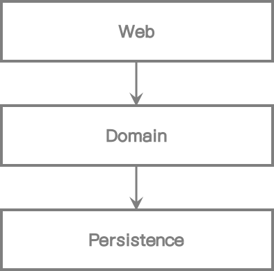
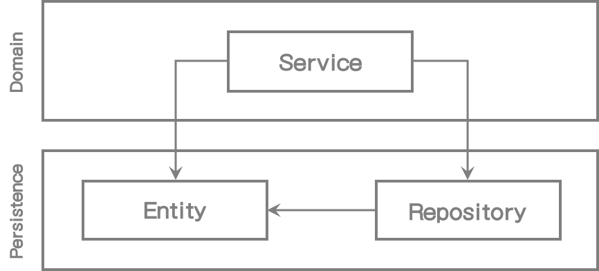
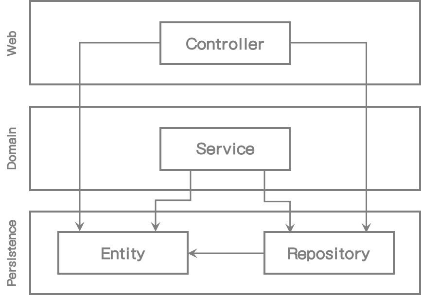
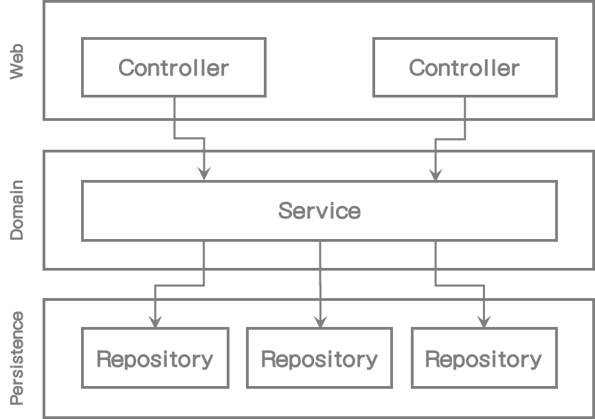

# 1. 계층형 구조의 문제점

과거에 계층형 (웹) 애플리케이션을 개발해 본 경험이 있을 것이다. 그리고 지금 프로젝트에서도 개발하고 있을지 모르겠다. (실제로 난 지금도 하고 있다)

계층형에 대한 개념은 컴퓨터 과학 분야, 교육 안내서, 모범 사례 등을 통해 우리에게 많이 알려졌다. 또한 책에서도 배웠었다. (*Software Architecture Patterns by Mark Richards, O'Reilly, 2015*)

[그림 1.1] 전통적인 웹 애플리케이션 아키텍처는 웹 계층, 도메인 계층, 영속성 계층으로 구성되어 있다.

위의 그림은 일반적인 3단 계층 아키텍처의 고수준 뷰를 나타낸다. 웹 계층은 요청을 받아서 도메인 혹은 비즈니스 계층의 서비스로 전달한다. 서비스는 비즈니스를 수행하고 영속성 계층의 컴포넌트를 호출하여 도메인 엔티티 상태를 조회 및 수정하는 역할을 한다.

이 내용이 무슨 말인지 잘 알 것이다. 계층형은 견고한 아키텍처 패턴이다. 만일 우리가 잘 사용하기만 하면 웹과 영속성 계층의 영향없이 도메인 계층을 만들 수 있다. 또한 도메인 로직에 영향을 주지 않고 웹과 영속성 기술도 바꿀 수 있다. 기존 기능에 영향을 주지 않고도 새 기능을 추가할 수도 있다.

우리는 잘 설계된 계층 구조에서 이러한 선택사항들을 항상 열어두고 요구사항과 외부 요소 변화에 빠르게 적용할 수 있다. 그리고 Uncle Bob의 의견에 따른다면 이것은 아키텍처에 대한 설명과 정확히 같은 의미이다. (*Clean Architecture by Robert C.Martin*)

그렇다면, 계층형 구조에 무슨 문제가 있는 걸까?

내 경험상으로 볼 때 계층형 아키텍처에서는 잘못된 코드 스타일이 사용될 가능성이 많아서 그 소프트웨어는 점점 수정하기 힘들어진다. 다음 장에서 그 이유를 설명할 것이다.

## 계층형은 데이터베이스 주도 설계를 유도한다

그 뜻으로 보면, 전통적인 계층형 아키텍처의 기본은 데이터베이스이다.

웹 계층은 도메인 계층에 의존하고 영속성 계층, 즉 데이터베이스에 차례로 의존한다.

영속성 계층 위에 다른 모든 계층이 존재한다. 이런 것들이 여러가지 이유로 문제가 된다.

우리는 애플리케이션 개발에서 무엇을 만들려고 하는지 한걸음 물러나 잠시 생각해보자. 일반적으로 우리는 사용자들과 상호작용하는 비즈니스 규칙이나 "정책"에 대한 모델을 만든다. 

우리는 주로 상태(state)가 아닌 행위(behavior)를 모델링 한다. 그렇다, 상태도 애플리케이션에서 중요한 요소이지만 행위가 상태를 변화시키는 것이고 비즈니스를 주도하는 것이다.

그러면 우리는 왜 아키텍처 중심을 *도메인 로직*이 아니라 *데이터베이스*에 두는 것인가?

여러분이 과거에 만들었던 애플리케이션 중 가장 최근 유스케이스를 한번 생각해보자. 도메인 로직 혹은 영속성 계층 중 어느 것을 먼저 만들었는가? 대부분 데이터베이스 구조를 만들고 그 위에 도메인 로직을 구현했을 것이다.

의존관계가 자연스럽게 흘러가기 때문에 전통적인 계층형 아키텍처에서는 잘 맞는 말이다. 하지만 비즈니스 관점으로 볼 때는 맞지 않다. 우리는 도메인 로직을 가장 먼저 만들어야 한다. 그리고 나서야 도메인을 제대로 이해했는지 알아낼 수 있다. 그리고 도메인 로직을 제대로 만들었다고 생각될 때만 영속성 및 웹 계층을 만들어야 한다.

데이터베이스 중심 아키텍처를 주도하는 힘은 ORM(Object Relational Mapping) 프레임워크다. 오해는 하지 마라. 나도 이런 프레임워크를 좋아하고 날마다 JPA와 Hibernate를 사용하고 있다.

하지만 ORM 프레임워크를 계층형 아키텍처와 결합한다면 비즈니스 규칙들이 영속성 요소들과 쉽게 섞여버릴 수 있다.

[그림 1.2] 도메인 계층에서 데이터베이스 엔티티를 사용하는 것은 영속성 계층과의 강한 결합을 발생시킨다.

위 그림에서 나타냈 듯이, 일반적으로 영속성 계층의 일부분으로서 ORM 엔터티를 가지고 있다. 계층은 하위 계층으로만 접근할 수 있기 때문에 도메인 계층은 엔티티에 접근할 수 있다.

이 때문에 영속성과 도메인 계층 사이에 강한 결합이 생긴다. 서비스는 비즈니스 모델로 영속성 모델을 사용하고, 도메인 로직도 다뤄야 하고, 기술적 요소(eager/lazy loading, database transaction, flush cache), 유사한 내부 작업들도 사용할 것이다.

영속성 코드는 사실상 도메인 코드에 녹아 들게 되며 서로 변경하기 어려워진다. 우리의 아키텍처 목표가 되어야 하는 유연성과 개방성과는 정반대 현상이 되는 것이다.

## 미봉책으로 처리하기 쉽다

전통적인 계층형 아키텍처의 유일한 규칙은 한 계층에서는 동일 혹은 하위 계층으로만 접근할 수 있다는 것이다.

개발팀내의 다른 규칙이 있고 규칙 중 몇 개는 특정 툴에 의한 제약이 생길 지는 모르지만 계층형 아키텍처 스타일 그 자체로는 어떤 규칙도 없다.

그럼 만약에 계층형 아키텍처에서 상위 컴포넌트로 접근이 필요하다면, 우리는 컴포넌트를 하위 계층으로 내려서 문제를 해결할 수도 있다.

한번 쯤은 괜찮을 수도 있다. 하지만 그런 생각은 두 세번 할 수 있는 여지를 두는 것이다. 누군가 했으면 나도 할 수 있지 않겠는가?

개발자로써 우리는 미봉책으로 처리하는 것을 너무 쉽게 생각한다는 것을 말하려는 것은 아니다. 시간에 쫓기는 상황에서는 어떤 일에 선택권이 있으면 누군가는 그렇게 할 수 있다. 이전에 누군가 한 적이 있다면 다시 할 가능성은 매우 높아진다. 이것이 "깨진 유리창 이론"이라고 하는 심리학적 효과이다 - *11장(Tailing shortcuts Consciously)*에서 추가 설명

[그림 1.3] 영속성 계층 모든 요소에 접근할 수 있어서 시간에 따라 점점 비대해진다.

수십 년의 소프트웨어 프로젝트 개발 및 유지보수에서 영속성 계층은 위의 그림과 같을 가능성이 많다.

계층 간 컴포넌트들을 바닥으로 배치함으로써 영속성 계층(최하위 계층)은 점점 비대해진다. 헬퍼나 유틸리티 컴포넌트는 어떤 계층에도 포함되지 않기 때문에 가능성이 가장 크다.

그러면 만약 아키텍처에서 미봉책으로 처리하지 못하게 하고 싶다면, 추가적인 아키텍처의 규칙을 강제적으로 만들지 않고서는 계층형은 좋은 선택이 못된다. 그리고 "강제(enforce)"라는 말은 시니어 개발자가 코드리뷰를 하라는 것이 아니라 규칙 위반 시 빌드 실패를 할 수 있는 규칙을 의미하는 것이다.

## 테스트 하기 점점 어려워진다

계층형 아키텍처에서는 계층 간에 요청을 건너뛸 수 있다. 웹 계층에서 영속성 계층으로 직접 접근한다. **엔티티**의 단일 필드만 사용하므로 도메인 계층을 접근할 필요가 없다.

[그림 1.4] 도메인 계층을 건너뛰는 것은 도메인 로직을 코드 내에 분산시킬 수 있다.

다시 말하지만, 처음 몇 번은 괜찮다고 생각될 수 있지만 너무 자주 발생한다면 두가지 단점이 생긴다.

첫번째, 단일 필드를 사용할 지라도 우리는 웹 계층에서 도메인 로직을 구현하고 있다. 향후에 유스케이스가 확장되면 어떻게 할 것인가? 웹 계층에 도메인 로직을 추가해야 할 것 같고 책임도 혼재 되며 애플리케이션 도처에 도메인 로직이 퍼져 있을 것 같다.

두번째, 웹 계층에서 테스트할 때 도메인 계층 뿐만 아니라 영속성 계층의 목(mock) 객체를 만들어야 한다. 이는 단위 테스트를 복잡하게 만든다. 그로 인해 우리는 테스트 준비가 너무 복잡하고 시간도 부족하기 때문에 테스트 자체를 하지 않게 된다.

웹 컴포넌트가 점차 커짐에 따라 다른 영속성 컴포넌트로의 의존성도 많아지고 테스트 복잡도 또한 높아질 것이다. 어떤 점에서는 실제 테스트 코드 작성하는 것 보다 코드를 이해하고 의존성을 목 객체로 변환하는 데 더 많은 시간이 걸린다.

## 유스케이스 찾기가 어렵다

개발자로서, 우리는 신규 유스케이스를 구현하는 새로운 코드를 만들고 싶다. 그러나 일반적으로는 새 코드 작성보다 기존 코드 변경에 더 많은 시간을 보낸다. 이런 상황은 십년쯤 된 끔찍한 레거시 프로젝트 뿐만 아니라 초기 유스케이스가 구현된 신규 프로젝트 역시 해당된다.

기능을 추가하고 변경할 적당한 위치를 찾을 때 아키텍처는 우리에게 이런 도움을 줄 수 있어야 한다. 이런 관점에서 볼 때 계층형 아키텍처가 왜 도움이 되지 않을까?

이미 살펴봤지만 계층형 아키텍처에서는 도메인 로직이 여러 계층에 분산될 수 있다. 간단한 유스케이스에서 도메인 로직을 사용하지 않는다면 웹 계층에 도메인 로직이 존재할 수도 있다. 그리고 도메인과 영속성 계층에서 접근하도록 특정 컴포넌트를 아래 계층으로 내렸다면 영속성 계층에 도메인 로직이 존재할 수도 있다. 이런 사항들 때문에 새 기능을 추가할 적당한 위치를 찾기 어렵다.

게다가 계층형 아키텍처는 도메인 서비스의 범위에 대해서 어떤 규칙도 제약하지 않는다. 아래 그림에서 나타난 대로 시간이 지나면서 다양한 유스케이스를 처리할 수 있는 넓은 범위의 서비스가 될 수도 있다.

[그림 1.5] 넓은 범위의 서비스는 코드에서 특정 유스케이스를 찾기 어렵게 한다.

넓은 범위의 서비스는 영속성 계층으로 많은 의존을 갖게 되고 웹 계층은 해당 서비스를 많이 의존한다. 이 때문에 서비스 테스트가 어려워지고 작업할 때 해당 유스케이스에 대한 서비스를 찾기도 힘들어진다.

만약 하나의 유스케이스만을 처리하는 매우 좁은 범위 만을 다루는 도메인 서비스가 있다면 얼마나 사용하기 쉬울까? *UserService*내에서 사용자 등록 유스케이스를 찾는 대신 단지 *RegisterUserService*를 열면 바로 작업할 수 있게 되는 것이다.

## 동시 작업이 어렵다

경영진들은 보통 정해진 날짜에 소프트웨어가 완료될 것이라고 생각한다. 실제로 예산범위 내에서 완료되기를 기대하지만 실제로는 더 복잡한 일들이 많이 생긴다.

소프트웨어 개발자로써 경력기간 동안 "완료"된 소프트웨어를 본적이 없다는 것을 제외하더라도, 정해진 날짜에 완료된다는 것은 보통 작업이 동시에 진행되어야 한다는 것을 의미한다.

책을 읽지 않았더라도 아마 "Man-Month의 미신"이라는 명언을 알고 있을 것이다.

>  "*납기가 지연된 소프트웨어 프로젝트에 인력을 추가 투입하는 것은 프로젝트를 더 늦추게 하는 것이다.*"  - The Mythical Man-Month: Essays on Software Engineering by Frederick P.Brooks, Jr., Addison-Wesley, 1995.

정상적인 프로젝트에서도 어느 정도 해당될 수 있다. 모든 상황에서 50명의 개발자 그룹이 10명의 개발자 그룹보다 5배 더 빠를 것이라고 기대해서는 안된다. 만일 대규모 애플리케이션에서 하위 팀으로 나누고 소프트웨어를 세분화 한다면 가능할 수도 있겠지만 대부분의 상황에서는 각자 자기 일만 할 것이다.

하지만, 적절한 규모에서는 프로젝트에 인력이 많으면 더 빠를 것이라고 기대할 수 있다. 그리고 경영진들이 우리에게 기대하는 바가 바로 그러한 것이다.

이러한 기대에 부응하기 위해서는 아키텍처가 병렬 작업을 지원해야 한다. 이러한 일은 쉽지 않다. 그리고 계층형 아키텍처는 이런 관점에서는 실제 도움이 안된다.

애플리케이션에 신규 유스케이스를 추가한다고 생각해보자. 우리는 가능한 세 명의 개발자가 있다. 한명은 웹 계층, 다른 한명은 도메인 계층, 세 번째는 영속성 계층 이렇게 나눠서 필요한 기능을 추가할 수 있지 않을까?

아마도 계층형 아키텍처에서는 이런 방식으로는 일이 잘 진행되지 않는다. 모든 것이 영속성 계층을 의존하기 때문에 영속성 계층이 가장 먼저 개발되어야 한다. 그리고 나서 도메인 계층, 마지막으로 웹 계층 순으로 개발된다. 그래서 한 명의 개발자만이 그 기능을 동시에 개발할 수 있다.

하지만 다른 개발자들이 실제 구현하는 것을 기다리지 않고 먼저 인터페이스를 정의하고 작업을 진행할 수도 있다. 물론, 앞에서 논의한 대로 영속성 로직이 도메인 로직과 혼재되어 개별 작업이 불가능한 데이터베이스 주도 설계를 하지 않는다면 말이다.

만일 우리 코드에서 넓은 범위를 가지는 서비스가 있다면 병렬로 다른 기능을 개발하기 힘들 수도 있다. 각 유스케이스 작업이 동일한 서비스를 동시에 수정하는 일이 발생할 수 있고 이는 코드의 충돌 머지(merge conflict) 작업을 해야 하고 잠재적으로는 기존 기능에 영향을 미치게 될 것이다.

## 유지보수하기 좋은 소프트웨어 개발에 어떤 도움이 되는가?

만약 예전에 계층형 아키텍처를 개발한 경험이 있다면, 이 장에서 언급된 몇가지 단점과 관련 있거나 심지어 더 많이 문제가 있었을 지도 모르겠다.'

`잘 마무리가 되었고` 프로젝트에 몇가지 규칙이 있다면 계층형 아키텍처는 유지보수가 용이하고 코드 수정/추가가 매우 쉬울 수도 있다.

하지만 이 장의 내용은 계층형 아키텍처가 부적절하게 사용되는 경우에 대한 이야기이다. 

엄격한 자기 관리가 없다면 이런 것들은 흐지부지되고 점점 유지보수가 불가능한 상태가 된다. 매니저가 개발 만기일로 압박하면 이러한 자기 관리는 느슨하게 될 수 밖에 없다.

계층형 아키텍처에 대한 이러한 문제점을 생각해보고 다음 번에 임시방편으로 작업하지 않고 유지보수가 쉬운 솔루션을 논의할 때 도움이 될 것이다 - 계층형이던 다른 아키텍처 스타일이던 상관없이.

