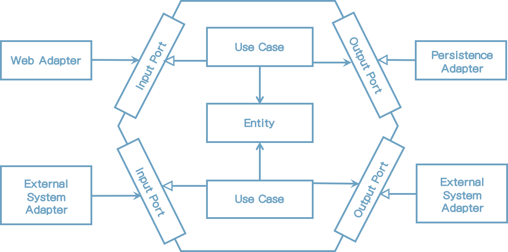

# 2. 의존성 역전

이전 장에서 계층형 아키텍처의 문제점을 이야기했고 이번 장에서 선택적인 접근방법을 논의할 거라고 기대할 지도 모르겠다. 단일 책임 원칙과 의존성 역전 원칙 부터 논의해 볼 것이다. 이것은 Robert C Martin의 도서 "Clean Architecture"에서 읽어 봤을지도 모를 SOLID 원칙 중에 "S"와 "D"에 해당된다.

## 단일 책임 원칙

소프트웨어 개발자 모두 단일 책임 원칙(SRP)을 아마 알고 있거나 적어도 안다고 믿는다.

이 원칙의 일반적인 해석은 이렇다.

> 컴포넌트는 오직 한가지 일만 해야 하고 제대로 동작해야 한다.

좋은 조언이지만 SRP에서 실제 의도와는 다르다.

"한가지 일만 한다는 것"은 SRP에서 가장 명백한 해석이고 SRP가 이렇게 해석되는 것은 당연하다. SRP 이름이 잘못 사용되는 경우를 말해보자.

다음은 SRP의 실제 정의이다.

> 컴포넌트는 변경해야 할 한가지 이유만 가져야 한다.

위의 예에서, 실제 "책임(responsibility)"은 "한가지 일만 하는 것" 대신에 "변경할 이유"로 해석 되어야 한다.

아마도, SRP를 "원칙을 변경할 하나의 이유"라고 불러야 한다.

컴포넌트가 변경될 이유가 한가지만 있다면, 오직 한가지 일만 하는 것이지만 더 중요한 것은 변경의 이유가 하나만 가지고 있다는 것이다.

아키텍처에서 그 의미가 무엇일까?

컴포넌트가 변경할 이유가 한가지만 있다면, 다른 이유로 소프트웨어를 변경할 때 이 컴포넌트는 여전히 잘 동작할 것이기 때문에 전혀 이 컴포넌트를 신경 쓸 필요가 없다.

안타깝게도, 컴포넌트들 사이의 의존 관계 때문에 코드에서 변경해야 할 이유가 너무 흔하게 나타난다. 다음 그림을 보자.

[그림 2.1] 파생된 의존성(점선 화살표)이 생기더라도 각 컴포넌트 의존성은 변경할 이유가 생긴다.

위의 그림에서, 컴포넌트 A는 다른 컴포넌트(직접적이던 파생되었던 간에)에 의존하고 반면 컴포넌트 E는 다른 의존관계를 가지지 않는다.

컴포넌트 E는 새 기능으로 변경되는 경우에만 변경할 이유가 생긴다. 하지만, 컴포넌트 A는 의존하는 다른 컴포넌트가 변경될 때 변경되어야 한다.

SRP가 위배되면 시간이 지남에 따라 변경이 힘들어 지고 많은 비용이 든다. 시간이 지남에 따라 컴포넌트는 변경에 대한 많은 이유들을 가지게 된다. 변경에 대한 많은 이유가 생긴후에는 하나의 컴포넌트 수정이 다른 컴포넌트에 잘못된 영향을 미칠 수 있다.

## 부작용에 대한 이야기

나는 한때 다른 소프트웨어 조직에서 만든 10년 된 코드로 작업하는 프로젝트 구성원의 일원이었다. 고객은 향후에 유지보수와 개발이 쉽고 비용이 덜 들어가는 개발조직을 만들기로 결정했다.

예상한 바와 같이, 코드가 실제 동작하는 것을 이해하기 쉽지 않았고, 코드의 한쪽 부분의 수정이 다른 쪽에 영향을 미쳤다. 그러나 집중적으로 테스트하고 자동화 테스트를 추가하고 많은 리팩토링 통해서 관리해갔다.

지속적으로 코드를 유지보수 및 확장해 나간 얼마 후, 고객은 지나치다 싶을 정도의 새 기능을 요청했다. 그래서 전반적으로 좀 더 적은 변경이 필요했기 때문에 구현 하는데 비용이 덜 드는 사용자 친화적인 방법으로 진행하자고 제안했다. 하지만 특정 중앙 컴포넌트에 약간의 변경이 필요했다.

고객은 거절했고 더 많은 불합리하고 비용이 많이 드는 방법으로 요구했다. 내가 그 이유를 물어봤을 때 고객은 과거 개발팀이 해왔던 하나의 컴포넌트의 변경이 다른 곳에 영향을 미쳤던 사례를 들면서 부작용이 염려가 된다고 얘기했다.

슬프게도, 잘못 설계된 소프트웨어를 수정하는 비용을 고객에게 요청하도록 보여주는 한 예다. 다행이도, 모든 고객이 그렇게 생각하지는 않을 것이다. 대신 좋은 소프트웨어를 한번 만들어 보자.

## 의존성 역전 원칙

계층형 아키텍처에서 계층 간의 의존방향은 항상 아래방향으로 향한다. 고수준에서 SRP를 적용할 때 상위 계층은 하위 계층보다 더 많은 변경의 이유를 가진다고 알게 된다.

그래서, 영속성 계층에서 도메인 계층의 의존성 때문에 영속성 계층의 변화는 잠재적으로 도메인 계층의 변화를 가져오게 된다. 그러나 도메인 코드는 우리 애플리케이션에서 가장 중요한 부분이다. 영속성 코드가 변경될 때 반드시 도메인 코드를 변경할 필요는 없다.

그럼, 이런 의존성을 어떻게 제거할 수 있을까?

의존성 역전 원칙(DIP)가 그 해결책을 제시해준다.

SRP와는 대조적으로 DIP는 그 이름에서 나타내듯이 다음과 같다.

> 코드상에서 의존성 방향을 바꿀 수 있다.

실제로 의존의 양쪽 방향에 대해 우리가 제어 가능할 때만 의존성을 바꿀 수 있다. 만일 써드파티 라이브러리에 의존성이 있다면, 그 라이브러리 코드를 수정할 수 없으므로 의존성을 바꿀 수 없다

어떻게 그 작업을 할 수 있을까? 도메인 코드의 변경 이유를 줄이기 위해서 도메인과 영속성 코드 사이의 의존성 방향을 바꿔서 영속성 코드가 도메인 코드를 의존하게 해보자.

1장(What'Worng with Layers)의 그림 1.2에 나타난 구조로 시작해보자. 영속성 계층에 엔티티와 리포지토리와 동작하는 도메인 계층에 서비스가 있다. 

우선, 엔티티를 도메인 계층으로 올리고 싶다.

우리는 엔티티가 내부 상태 변화를 더 많이 처리하는 도메인 객체와 도메인 코드를 나타내기 때문에 도메인 계층으로 올리고 싶다.

그러나 지금, 우리는 영속성 계층의 리포지토리가 도메인 레이어에 있는 엔티티를 의존하기 때문에 양쪽 계층간의 순환의존 관계를 가지고 있다. 여기가 DIP가 적용되는 장소이다. 도메인 레이어에 리포지토리용 인터페이스를 하나 생성하고 실제 구현체는 영속성 계층에 두자. 결과는 아래 그림과 같다.

[그림 2.2] 도메인 계층에 인터페이스를 둠으로써 영속성 계층이 도메인 계층을 의존하게끔 의존성 방향을 바꿀 수 있다.

우리는 이러한 기술로 도메인 로직을 영속성 코드상의 의존에서 해방시킬 수 있다. 이것이 다음 장에서 논의할 두가지 아키텍처 스타일의 핵심적인 특징이다.

## 클린 아키텍처

로버트 C.마틴은 동일한 이름의 그의 저서에서 "clean architecture" 용어를 구체화했다. 그의 의견에 의하면, 클린 아키텍처는 비즈니스 규칙은 설계상으로만 테스트 가능해야 하고 프레임워크, 데이터베이스, UI 기술, 그 외 외부 애플리케이션 혹은 인터페이스와 무관하다.

이 말의 의미는 도메인 코드는 다른 외부 의존성을 가져서는 안된다는 것을 나타낸다. 대신, DIP 덕분에 모든 의존성은 도메인 코드로 향할 수 있게 된다.

다음 그림은 아키텍처가 추상화 수준에서 어떤 모습으로 보이는지에 대한 그림을 나타낸다.

[그림 2.3] 클린 아키텍처에서 모든 의존성은 도메인 로직의 내부방향으로 향한다. 출처: "Clean Architecture" by 로버스 C.마틴

이 아키텍처에서의 계층(layer)은 동심원으로 서로 쌓여져 있다. 그런 아키텍처 상의 기본 규칙은 의존성 규칙이고 이 규칙은 계층의 모든 의존성 방향은 안쪽으로 향해야 한다고 말하고 있다.

아키텍처의 중심부에는 유스케이스로 둘러 쌓여져서 접근되는 도메인 객체가 있다. 유스케이스는 우리가 이전에 서비스라고 불렀던 것이긴 하지만 이전에 논의한 넓은 범위의 서비스가 갖는 문제를 피하기 위해 단일 책임만을 갖도록 잘게 쪼개져 있다.

중심부 주위에는 비즈니스 규칙을 지원하는 애플리케이션의 또 다른 컴포넌트들이 있다. 이것들은 영속성 혹은 UI를 제공하는 것을 의미할 수 있다. 또한, 외부 계층은 다른 써드파티 컴포넌트에게 어댑터를 제공할 수도 있다.

도메인 코드는 어느 영속성 혹은 UI 프레임워크가 사용됬는지 전혀 알지 못하기 때문에, 그러한 프레임워크 전용 코드를 포함할 수 없고 비지니스 규칙에 집중할 수 있을 것이다. 도메인 코드를 모델링 하는데 완전한 자율성을 가질 수 있다. 예를 들면 도메인 주도 설계(DDD)를 순수하게 적용할 수 있다. 영속성 혹은 UI 문제에 대해서 생각할 필요가 없게 된다.

기대한대로, 클린 아키텍처는 댓가를 치르기 마련이다. 도메인 계층이 영속성과 UI같은 외부 레이어와 완전히 분리되어 있기 때문에 계층 내에서 애플리케이션 엔티티의 모델을 가지고 있어야 한다.

예를 들어, 영속성 계층에 객체-관계 매핑(ORM) 프레임워크를 사용한다고 가정해보자. ORM 프레임워크는 일반적으로 데이터베이스 구조를 나타내는 메타를 가진 특정 엔티티 클래스와 데이터베이스 컬럼으로의 객체 필드 매핑이 사용된다. 도메인 계층이 영속성 계층을 알지 못하기 때문에, 도메인 계층에서 동일한 엔티티 클래스를 사용할 수 없고 양쪽 계층에서 새로 만들어야 한다. 이것은 도메인 계층이 영속성 계층에 데이타를 주고 받을 때 양쪽 데이터를 변환해야 한다는 것을 의미한다. 동일한 변환과정이 도메인 계층과 다른 외부 계층과의 관계에서도 해당된다.

하지만 그것은 좋은 방식이다. 이러한 디커플링(decoupling) 방식은 도메인 코드를 프레임워크에 집중적으로 나타나는 문제로 부터 해방시켜 주는 것이다. 예를 들어 Java Persistence API(Java 진영 표준 ORM-API)는 도메인 모델에서는 필요없는 기본 생성자를 가진 ORM 관리 엔티티가 필요하다. 8장*(Mapping Between Boundaries)*에서, 도메인과 영속성 계층 사이의 결합(coupling)을 수용하는 "no-mapping" 전략을 포함하여 다른 매핑 전략들에 대해 이야기 할 것이다.

로버트 C.마틴의 클린 아키텍처는 다소 추상적이기 때문에 클린 아키텍처 원칙을 좀 더 구체적으로 나타내는 "헥사고날 아키텍처(hexagonal architecture)"를 살펴보자.

## 헥사고날 아키텍처

"헥사고날 아키텍처"라는 용어는 알리스터 코오번이 만들었고 꽤 오랫동안 사용되어 왔다("헥사고날 아키텍처" 용어에 대한 출처는 알리스터 코오본 블로그에 있다. https://alistair.cockburn.us/hexagonal-architecture/). 이는 로버트 C.마틴이 그 이후에 클린 아키텍처에서 언급한 것과 동일한 원칙을 나타낸다.

[그림 2.4] 헥사고날 아키텍처는 애플리케이션 중심부가 상호 통신을 위해 각 어댑터의 포트를 제공하기 때문에 "포트 앤 어댑터" 아키텍처라고도 불린다. 

위의 그림은 헥사고날 아키텍처의 모습을 나타낸다. 애플리케이션 중심부는 그 이름과 같이 육각형으로 표현된다. 하지만, 육각형은 의미가 없다. 팔각형으로 그리고 "팔각형 아키텍처"라도 부를수도 있다. 육각형은 애플리케이션이 타 시스템 혹은 어댑터들과 더 많이 연결될 수 있다는 것을 나타내기 위해서 단지 사각형 대신 사용되었다.

육각형 내부에, 도메인 엔티티와 유스케이스가 있다. 육각형은 외부로의 의존성이 없어서 마틴의 클린 아키텍처의 의존규칙이 준수된 다는 것을 나타낸다. 대신, 모든 의존성 방향은 중심부로 향한다.

육각형 외부에 애플리케이션과 상호 통신하는 여러 개의 어댑터를 찾을 수 있다. 웹브라우저와 통신하는 웹 어댑터, 외부 시스템 통신하는 몇개의 어댑터, 그리고 데이터베이스와 통신하는 어댑터가 있다.

왼쪽에 있는 어댑터들은 애플리케이션(애플리케이션 중심부를 호출하므로)으로 들어옥, 반면에 오른쪽 어댑터는 애플리케이션(애플리케이션 중심부에서 호출되므로)에서 나가는 어댑터이다.

애플리케이션 코어와 어댑터 간에 통신하기 위해 애플리케이션 중심부는 특정 포트를 제공한다. 인바운드 어댑터, 그 포트는 중심부의 유스케이스에서 구현되는 인터페이스이고 어댑터에서 호출한다. 아웃바운드 어댑터, 어댑터에서 구현되는 인터페이스일 수 있고 중심부에서 호출된다.

이런 개념 때문에 이런 아키텍처 스타일은 또한 "포트 앤 어댑터" 아키텍처 라고 알려져 있다. 클린 아키텍처와 같이 헥사고날 아키텍처를 계층형으로 구성할 수도 있다. 최외부 계층은 애플리케이션과 타 시스템 사이를 변환하는 어댑터로 구성되어 있다. 다음으로, 애플리케이션의 인터페이스를 정의하는 것이기 때문에 애플리케이션 계층을 구성하기 위한 포트와 유스케이스 구현을 합칠 수도 있다. 마지막 계층은 도메인 엔티티를 포함한다.

다음 장에서는 코드로 아키텍처를 구성하는 방법에 대해 논의해 볼 것이다.

## How Does This Help Me Build Maintainable Software?

클린 아키텍처, 헥사고날 아키텍처 혹은 포트 앤 어댑터 아키텍처 - 의존방향을 역전시켜서 도메인 코드가 외부에 의존하지 않음으로써, 도메인 로직을 영속계층이나 UI에서 발생하는 문제와의 결합도를 낮출 수 있고 코드 전반에 변화의 이유에 대한 가짓 수를 줄여줄 수 있다. 변경에 대한 더 적은 이유는 더 나은 유지보수성을 의미한다.

도메인 코드는 비즈니스 문제를 처리하는데 있어 모델링이 좀 더 자유롭다는 반면 퍼시스턴스와 UI 코드는 퍼시스턴스와 UI 문제를 해결하는데 좀 더 자유롭게 모델링 된다.

이 책 나머지 부분에서, 헥사고날 아키텍처를 웹 애플리케이션에 적용해 볼 것이다. 애플리케이션의 패키지 구조를 만들고 의존성 주입 역할을 논의해 보는 것으로 시작해보자.