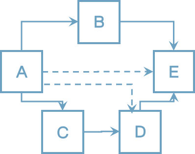
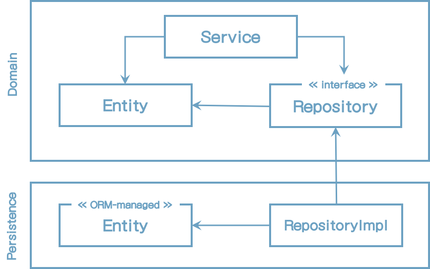
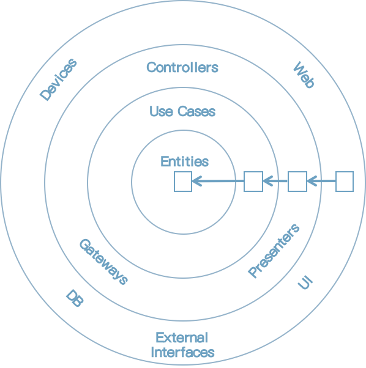

# 2 Inverting Dependencies

이전 장의 계층형 아키텍처 단점에 대해 살펴보고 이번 장에서 그 개선점에 대해 논의할 거라고 기대할 지도 모르겠다. Single Responsibility 원칙과 Dependency Inversion 원칙에 대해 논의를 시작해보려고 한다. Robert C Martin책 "Clean Architecture"에 기술된 SOLID 원칙 중에 "S"와 "D"에 해당된다.

## The Single Responsibility Principle

소프트웨어 개발자 모두 단일 책임 원칙(SRP)에 대해 일거나 적어도 안다고 믿을 것이다.

일반적인 해석은 아래와 같다.

> 컴포넌트는 오직 하나의 일만 해야 하고 제대로 동작해야 한다.

좋은 충고이지만 SRP에서 실제 의도와는 다르다.

"한가지 일만 한다는 것"은 SRP에서 가장 모호한 해석이지만 이 같이 해석되는 경우가 비일비재하다. SRP 이름이 잘못 사용되는 경우를 적어보자.

다음은 SRP의 실제 정의이다.

> 컴포넌트는 변경해야 할 한가지 이유만 가져야 한다.

위의 예에서, 실제 "책임(responsibility)"은 "한가지 일만 하는 것" 대신에 "변경할 이유"로 해석이 되어야 할 것이다.

아키텍처에서 그 의미는 무엇인가?

<u>컴포넌트가 변경할 이유가 한가지만 있다면, 다른 이유로 소프트웨어를 변경한다면 전혀 이 컴포넌트를 신경 쓸 필요가 없다. 왜냐하면 여전히 작동할 것이라고 생각되기 때문이다.</u>

안타깝게도, 컴포넌트들 사이의 의존성을 통해서 코드상에서 변경해야 할 이유가 너무 흔하게 나타난다. 다음 그림을 보자.

[그림 2.1] 컴포넌트의 딸려온 의존(점선 화살표)이 생기더라도 각각 의존성은 변경할 이유가 생긴다.

위의 그림에서, 컴포넌트 A는 다른 컴포넌트(직접적이던 파생된 의존이던간에)에 의존하고 반면 컴포넌트 E는 다른 의존관계를 가지지 않는다.

컴포넌트 E는 기능상 변경되어야 할 경우에만 변경할 이유가 생긴다. 하지만, 컴포넌트 A는 의존하는 다른 컴포넌트가 변경될 때 변경되어야 한다.

SRP가 위배되면 시간이 지남에 따라 많은 코드가 점점 복잡해지고 수정하기 힘들어진다. 시간이 지남에 따라 컴포넌트는 변경에 대한 많은 이유들을 가지게 된다. 변경에 대한 많은 이유가 생긴후에는 많은 컴포넌트가 수정자체가 힘들어지게 만든다.

## A Tale about Side Effect

나는 다른 소프트웨어 샵에서 만든 10년된 코드로 작업하는 프로젝트 구성원의 일원이었다. 고객은 향후에는 유지보수와 개발이 쉽고 비용이 덜 들어가는 개발조직을 만들기로 결정했다.

예상한 바와 같이 코드가 어떻게 동작하는지 이해하기 쉽지 않았고 코드 수정이 다른 쪽에서 부작용이 생겼다. 그러나 집중적으로 테스트하고 자동화 테스트를 추가하고 리팩토링 하면서 관리해갔다.

지속적으로 코드를 유지보수 및 확장한 후에 고객은 불편하게 느낄 정도로 새 기능을 요청했다. <u>그래서 비용이 덜 드는 방향의 사용자 친화적인 방법으로 하자고 제안했다.</u> 

고객은 거절했고 더 많은 불합리하고 <u>값비싼 솔루션</u>을 요구했다. 내가 이유를 물어봤을 때 고객은 과거 개발팀이 해왔던 하나의 컴포넌트의 변화가 다른곳에 영향을 미쳤던 사례를 들면서 부작용에 대해 걱정했다고 얘기했다.

슬프게도, 잘못 구조화된 소프트웨어를 수정하는 비용을 고객에게 요청하도록 보여주는 한 예다. 운좋게도 대부분 고객은 동의하지 않을 것이어서 좋은 소프트웨어를 만들어 보자.

## The Dependency Inversion Principle

계층형 아키텍처에서 계층간 상호작용은 항상 아래방향으로 향한다. 고수준에서 SRP를 적용할 때 상위 계층은 하위 계층보다 더 많은 변경의 이유를 가진다고 알게 된다.

그래서, 퍼시스턴스 레이어에서 도메인 레이어 의존성 때문에 퍼시스턴시 레이어의 변화는 잠재적으로 도메인 레이어의 변화를 필요로 하게 된다. 그러나 도메인 코드는 우리 애플리케이션에서 가장 중요한 부분이다. 커시스턴시 코드의 변화가 있을 때 꼭 도메인 코드를 변경할 필요는 없을것 같다.

그럼, 이런 의존성을 제거하기 위해서 무엇을 해야 할까?

의존성 역전 원칙(DIP)가 그 답을 보여준다.

SRP와는 대조적으로 DIP의 이름이 나타내는 의미는

> 코드상에서 의존성 방향을 바꿀 수 있다.

실제로 의존의 방향성을 제어할 때 의존성을 역전시킬 수 있다. 만일 써드파티 라이브러리에 의존성이 있다면, 그 라이브러리 코드를 수정할 수 없기 때문에 의존성을 역전시킬 수 없다. 

어떻게 그 작업을 할 수 있을까? 도메인과 퍼시스턴스 코드 사이 의존성 방향을 바꿔서 도메인 코드의 변경이유를 줄이기 위해 퍼시스턴스가 도메인 코드를 의존하게 해보자.

그림 1.2에 표시대로 시작해보자. 레이어에 무슨 문제가 있는것일까? 도메인 레이어에 서비스가 하나 있는데 그 서비스는 엔티티와 퍼시스턴스 레이어의 리포지토리와 통신한다.

우선, 엔티티를 도메인 레이어에 올려두고 싶어한다. 왜냐하면 그것은 도메인 객체를 나타내고 엔티티에서 발생하는 변화를 더 많이 해결할 수 있기 때문이다.

그러나 지금은, 퍼시스턴스 계층의 리포지토리는 엔티티를 의존하기 때문에 양쪽에는 순환 의존이 있다. 여기가 DIP를 적용하는 곳이다. 도메인 레이어에 리포지토리 인터페이스를 하나 생성하고 실제 구현체는 퍼시스턴스 레이어에 두자. 결과는 아래 그림과 같다.

[그림 2-2] 도메인 레이어에 인터페이스를 둠으로써 퍼시스턴스 레이어가 도메인 레이어를 의존하게끔 의존성 방향을 역전할 수 있다.

이 기술로 도메인 로직을 퍼시스턴스 코드상의 의존으로 부터 해방시킬 수 있다. 이것은 다음 장에서 논의할 두가지 아키텍처 스타일의 핵심 피처이다.

## Clean Architecture

로버트 C.마틴은 그의 저서인 "clean architecture" 용어를 구체화했다. 클린 아키텍처에서 비즈니스 규칙은 설계상으로만 테스트 가능해야 하고 프레임워크, 데이터베이스, UI 기술, 그 외 다른 요소와 무관하다라고 언급하고 있다.

이것은 도메인 코드는 다른 외부 의존성을 가져서는 안된다는 것을 의미한다. DIP 덕분에 모든 의존성은 도메인 코드로 향할 수 있게 된다.

다음 그림은 아키텍처가 추상화 수준에서 어떤 모습으로 보이는지에 대한 그림을 보여준다.

[그림 2-3] 클린 아키텍처에서 모든 의존성은 도메인 로직을 향하게 된다. 출처: "Clean Architecture" by 로버스 C.마틴

이 아키텍처상의 레이어는 중심점이 되는 원으로 쌓여져 있다. 아키텍처 상의 기본 규칙은 의존성 규칙이다. 이 규칙은 레이어상의 모든 의존성 방향은 안쪽으로 향해야 한다고 말하고 있다.

아키텍처의 중심부에는 유스케이스로 쌓여져서 접근되는 도메인 객체가 있다. 유스케이스는 우리가 서비스라고 부르는 것이다. 이것은 앞에서 논의한 넒은 범위의 서비스의 문제점을 피하고 단일 책임을 가지기 위해서 잘게 쪼개져 있다.

코어 주위에는 비즈니스 규칙을 지원하는 다른 컴포넌트들이 있다. 이것들은 퍼시스턴스 혹은 UI를 제공하는 것을 의미할 수 있다. 외부 레이어는 다른 써드파티 컴포넌트에 어댑터를 제공할 수도 있다.

도메인 코드는 퍼시스턴스 혹은 UI 프레임워크가 사용됬는지에 대해 전혀 알지 못하기 때문에 프레임워크의 어떤 코드를 포함하지 않아서 해당 비즈니스 룰에 집중할 수 있다. 도메인 코드를 모델링 하는데 자율성을 가질 수 있다. 예를 들면 DDD를 적용할 수 있다. 퍼시스턴스 혹은 UI 문제에 대해서 생각할 필요가 없다.

기대한대로 클린 아키텍처는 댓가를 치르기 마련이다. 도메인 레이어가 퍼시스턴스와 UI같은 다른 레이어와 완전히 디커플링 되어 있기 때문에 레이어 내에는 애플리케이션 엔티티의 모델을 가져야만 한다.

예를 들어, 퍼시스턴스 레이어에 ORM 프레임워크를 사용한다고 가정해보자. 일반적으로 ORM 프레임워크는 데이터베이스 구조를 나타내는 메타를 포함하는 엔티티 클래스와 데이터베이스 컬럼이 매핑되기를 기대한다. 도메인 레이어가 퍼시스턴스 레이어를 알지 못하기 때문에 도메인 레이어에서 동일한 엔티티 클래스를 사용할 수 없고 양쪽 레이어서 새로 만들어 사용해야 한다. 이것은 도메인 레이어가 퍼시스턴스 레이어에 데이타를 주고 받을 때 양쪽 데이터를 번역해야 한다는 것을 의미한다. 동일한 번역과정이 도메인 레이어와 다른 외부 레이어에도 해당된다.

그렇지만 그건 좋은 방식이다. 이러한 방식의 디커플링은 도메인 코드를 프레임에 집중되는 문제로 부터 자유롭게 하기 하기 위해서 우리가 하고자 했던 것이다. 예를 들어 Java 퍼시스턴스 API(표준 ORM-API)는 도메인 모델에서는 필요없는 기본 생성자를 필요로 한다. 8장에서 *(Mapping Between Boundaries)* 다른 매핑 전략을 얘기할 것이다. 또한 도메인과 퍼시스턴스 레이어 사이의 커플링을 수용하는 매핑없는 전략을 포함한다.

로버트 C.마틴의 클린 아키텍처는 다소 추상적이기 때문에 클린 아키텍처를 좀 더 구체적으로 나타내는 헥사고날 아키텍처를 살펴보자.

## Hexagonal Architecure

"헥사고날 아키텍처"라는 용어는 알리스터 코오번에 의해 만들어졌고 꽤 오랫동안 <u>has been around</u> 되었다. 로버트 C마틴이 클린 아키텍처에서 언급한 것과 동일한 원칙을 나타낸다.

[그림 2-4] 헥사고날 아키텍처는 애플리케이션 코어가 상호 통신을 위해 어댑터의 포트를 제공하기 때문에 "포트 앤 어댑터" 아키텍처라고도 불린다. 

위의 그림은 헥사고날 아키텍처가 보이는 모습을 나타낸다. 애플리케이션 코어는 그 이름과 같이 육각형으로 표현된다. 하지만, 육각형은 의미가 없다. 팔각형으로 그리고 팔각형 아키텍처라도 부를수도 있다. 육각형은 애플리케이션이 타 시스템 혹은 어댑터들과 더 많이 연결될 수 있다는 것을 나타내기 위해서 사각형 대신 사용되었다.

육각형 외부에 애플리케이션과 상호 통신하는 다양한 어댑터들이 있다. 웹브라우저와 통신하는 웹 어댑터, 외부 시스템과의 몇개의 어댑터들, 데이터베이스와 통신하는 어댑터 들이 있을 수 있다.

왼쪽에 있는 어댑터들은 애플리케이션을 호출하고, 반면에 오른쪽 어댑터는 애플리케이션에서 호출되는 영역이다.

애플리케이션 코어와 어댑터들 사이 통신하기 위해 애플리케이션 코어는 특정 포트를 제공한다. 호출하는 어댑터에서는 코어와 어댑터가 호출하는 유스케이스에서 구현되어야 할 인터페이스가 될 수도 있고, 어댑터에서 구현되는 인터페이스가 되고 코어에서 호출이 될 수도 있다.

이런 개념 때문에 아키텍처 스타일은 "포트 앤 어댑터"라고 알려져 있다. 클린 아키텍처와 같이 헥사고날 아키텍처를 레이어로 구성할 수도 있다. 외부 레이어는 애플리케이션과 타시스템 사이를 <u>번역하는</u> 어댑터로 구성되어 있다. 다음으로 애플리케이션 레이어를 구성하기 위해 포트와 유스케이스 구현을 결합할 수도 있다. <u>왜냐하면 애플리케이션 인터페이스를 정의하기 때문이다.</u> 마지막 레이어는 도메인 엔티티를 구성한다.

다음 장에서 코드로 아키텍처를 구성하는 방법에 대해 논의해 볼 것이다.

## How Does This Help Me Build Maintainable Software?

클린 아키텍처, 헥사고날 아키텍처 혹은 포트 앤 어댑터 아키텍터 - 도메인 코드가 외부에 의존성을 가지지 않게 하기 위해서 의존성을 역전시킴으로써 도메인 로직을 퍼시스턴스나 UI로 부터 디커플링하고 코드상 변경의 이유를 수를 줄여주고 변경의 이유가 적다는 것은 유지보수가 더 쉽다는 것을 의미한다.

도메인 코드는 비즈니스 문제를 처리하는데 있어 모델링이 좀 더 자유롭다는 반면 퍼시스턴스와 UI 코드는 퍼시스턴스와 UI 문제를 해결하는데 좀 더 자유롭게 모델링 된다.

이 책 나머지 부분에서, 웹 애플리케이션에서 헥사고날 아키텍처를 적용해볼 것이다. 애플리케이션의 패키지 구조를 만들어 의존성 주입 역할을 논의해보자.