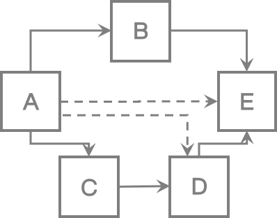
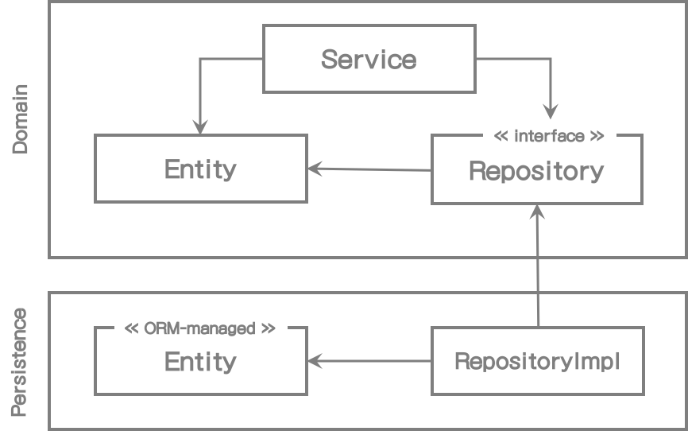
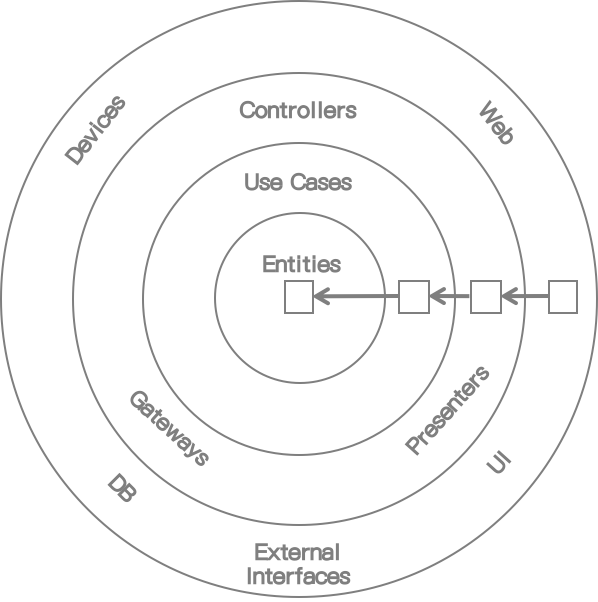
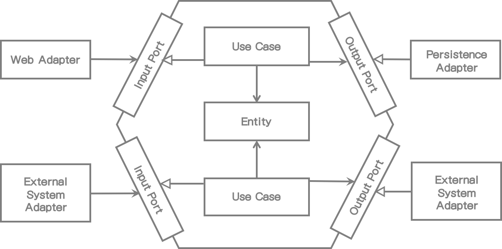

# 2. 의존성 역전

이전 장에서는 계층형 아키텍처의 문제점에 대해 살펴봤고 이번 장에서는 그 대안에 대해 이야기 할 것이다. 단일 책임 원칙과 의존성 역전 원칙부터 살펴볼 것이다. 이것은 Robert C. Martin의 도서 "Clean Architecture"의 SOLID 원칙 중에 "S"와 "D"에 해당된다.

## 단일 책임 원칙 (The Single Responsibility Principle)

아마 모든 소프트웨어 개발자라면 단일 책임 원칙(SRP)에 대해 알고 있거나 적어도 한번 쯤은 들어봤을 것이다.

이 원칙의 일반적인 설명은 이렇다.

> 컴포넌트는 오직 한가지 일만 해야 하고 제대로 동작해야 한다.

좋은 설명이지만 이는 SRP의 실제 의도와는 다르다.

"한가지 일만 한다는 것"은 SRP에서 가장 명백한 설명이고 SRP가 이렇게 설명되는 것은 당연하다. SRP 이름이 잘못 사용되는 경우를 확인해보자.

다음은 SRP의 실제 정의이다.

> 컴포넌트는 변경의 이유가 하나 뿐 이어야 한다.

보는 바와 같이, "책임"은 실제로 "한가지 일만 하는 것" 대신에 "변경의 이유"로 설명 되어야 한다.

아마도 우리는 SRP를 "원칙을 변경할 하나의 이유"라고 불러야 할 것이다.

만일 컴포넌트가 변경될 이유가 한가지만 있다면 결국 단 한가지 일만 한다는 것을 의미하지만 더 중요한 것은 변경의 이유를 한가지만 가지고 있다는 것이다.

아키텍처에서 그 의미가 무엇일까?

만일 컴포넌트를 변경할 이유가 한가지만 있다면, *다른 이유로* 소프트웨어를 변경할 때 이 컴포넌트를 전혀 신경 쓸 필요가 없다. 왜냐하면 우리는 이 컴포넌트가 여전히 잘 동작할 것이라고 알고 있기 때문이다.

안타깝게도, 컴포넌트들 사이의 의존 관계 때문에 코드 상에서 변경해야 할 이유가 너무나 흔하게 나타난다. 다음 그림을 보자.

[그림 2.1] 전이 의존성(점선 화살표)이 생기더라도 각 컴포넌트 의존성은 변경의 이유가 생긴다.

위의 그림에서, 컴포넌트 A는 다른 컴포넌트(직접적이던 전이되었던 간에)에 의존하고 반면 컴포넌트 E는 다른 의존관계를 가지지 않는다.

컴포넌트 E는 새 기능으로 변경되는 경우에만 변경할 이유가 생긴다. 하지만 컴포넌트 A는 의존하는 다른 컴포넌트가 변경될 때 변경되어야 한다.

SRP가 위배되면 점점 변경이 힘들어지고 많은 비용이 든다. 컴포넌트는 점점 더 많은 변경의 이유를 가지게 된다. 변경의 이유가 생긴 후에는 하나의 컴포넌트 수정이 다른 컴포넌트에 나쁜 영향을 미칠 수 있다.

## 부작용에 대한 이야기

나는 한때 다른 소프트웨어 조직에서 만든 10년 된 코드로 작업하는 프로젝트 멤버였다. 고객은 유지보수와 개발이 쉽고 향후에는 비용이 덜 들어가는 개발조직을 만들기로 결정했다.

예상은 했겠지만 코드의 실제 동작을 이해하기는 쉽지 않았고 코드의 한쪽 부분 수정이 다른 쪽에 영향을 미쳤다. 그러나 철저한 테스트와 자동화 테스트를 추가하고 많은 리팩토링을 통해서 관리해갔다.

그렇게 코드 유지보수 및 확장을 한지 얼마 지나지 않아 고객은 과다하게 신규 기능을 요청했다. 

그래서 나는 사용자 친화적인 방법으로 진행하는 것이 좋겠다고 제안했다. 그 방법은 전체적으로 수정이 많이 필요 없어서 비용을 절감할 수 있는 방법이었다. 그 대신 특정 핵심 컴포넌트의 변경이 조금 필요했다.

하지만 고객은 거절했고 비용이 더 많이 드는 불합리한 방법으로 하자고 했다. 내가 그 이유를 물어봤을 때 고객은, 이전 개발팀이 변경한 하나의 콤포넌트가 항상 문제를 발생시켰기 때문에 그 변경에 따른 부작용이 걱정되기 때문이라고 말했다.

안타깝게도 이 사례는 잘못 설계된 소프트웨어에 대한 수정 비용을 고객에게 지불하도록 하는 단적인 예이다. 다행히도 모든 고객이 그렇게 생각하지는 않을 것이다. 그래서 이제 우리는 좋은 소프트웨어를 한번 만들어보자.

## 의존성 역전 원칙 (Dependency Inversion Principle)

계층형 아키텍처에서는 계층 간 의존 방향이 항상 아래로 향한다. SRP를 고수준에 적용할 때, 우리는 상위 계층이 하위 계층보다 더 많은 변경의 이유를 가지게 된다고 알 수 있다.

그래서 도메인 계층이 영속성 계층을 의존하기 때문에 영속성 계층의 변경은 잠재적으로 도메인 계층의 변화를 가져오게 된다. 하지만 도메인 코드는 우리 애플리케이션에서 가장 중요한 부분이다. 우리는 영속성 코드가 변경될 때 도메인 코드의 변경을 원하지 않는다.

그럼, 이런 의존성을 어떻게 제거할 수 있을까?

의존성 역전 원칙(DIP)이 그 해결책을 제시해준다.

SRP와는 다르게 DIP는 이름에서 그 의미를 알 수 있다.

> 우리는 코드 상에서 의존성 방향을 역전시킬 수 있다.

실제로는 의존하는 양쪽 방향에 우리가 제어할 수 있을 때만 의존 방향을 바꿀 수 있다. 만일 어떤 써드파티 라이브러리를 의존하고 있다면 그 라이브러리 코드를 직접 수정할 수 없으므로 의존 방향을 바꿀 수는 없다

어떻게 그 작업을 할 수 있을까? 우선 도메인과 영속성 코드 사이의 의존성을 역전시켜서 영속성 코드가 도메인 코드를 의존하게 하자. 이는 도메인 코드의 변경의 이유를 줄여준다.

*1장(What' Wrong with Layers)*의 그림 1.2에 나타난 구조로 시작해보자. 영속성 계층의 엔티티, 리포지토리와 동작하는 도메인 계층에 서비스가 하나 있다. 

우선, 엔티티는 도메인 객체와 도메인 코드를 더 잘 나타낼 수 있기 때문에 엔티티를 도메인 계층으로 올린다.

하지만 지금은 영속성 계층의 리포지토리가 도메인 계층의 엔티티를 의존하기 때문에 두 계층간의 순환의존 관계가 있다. 여기가 DIP가 적용되는 곳이다. 도메인 계층에 리포지토리용 인터페이스를 하나 생성하고 실제 구현체는 영속성 계층에 두자. 결과는 아래 그림과 같다.

[그림 2.2] 도메인 계층에 인터페이스를 배치함으로써 영속성 계층이 도메인 계층을 의존하게 끔 의존성 방향을 바꿀 수 있다.

이런 기술로 도메인 로직을 영속성 코드로의 의존을 해방시킬 수 있다. 이것은 다음 장에서 설명할 두 가지 아키텍처 스타일의 핵심적인 특징이다.

## 클린 아키텍처

Robert C. Martin은 같은 이름의 그의 저서에서 "클린 아키텍처" 용어를 구체화했다. 그의 의견에 따르면, 클린 아키텍처에서 비즈니스 규칙은 설계만으로도 테스트 가능해야 하고 프레임워크, 데이터베이스, UI 기술, 그 외 외부 애플리케이션 혹은 인터페이스와는 무관하다.

이는 도메인 코드가 다른 외부 의존성을 가져서는 안된다는 것을 의미한다. 대신에 DIP로 모든 의존성이 도메인 코드로 향하게 된다.

다음 그림은 아키텍처가 추상화 수준에서 어떻게 보이는지를 나타낸다.

[그림 2.3] 클린 아키텍처에서 모든 의존성은 도메인 로직의 내부방향으로 향한다. 출처: "Clean Architecture" by Robert C. Martin

클린 아키텍처에서 각 계층은 동심원으로 서로 쌓여져 있다. 아키텍처 상의 핵심 규칙은 의존성 규칙이고 이는 계층의 모든 의존성 방향이 안쪽으로 향해야 한다고 말하고 있다.

아키텍처 중심부에는 유스케이스로 둘러 쌓인 도메인 객체가 있다. 유스케이스는 우리가 이전에 서비스라고 불렀던 것이긴 하지만 이전에 논의한 넓은 범위를 가지는 서비스의 문제를 해결하기 위해 단일 책임만을 갖도록 잘게 쪼개져 있다.

중심부 주위에는 비즈니스 규칙을 지원하는 애플리케이션의 또 다른 컴포넌트들이 있다. 예를 들어, 여기서의 지원은 영속성 혹은 UI를 제공하는 것을 의미할 수 있다. 또한, 외부 계층은 다른 써드파티 컴포넌트에게 어댑터를 제공할 수도 있다.

도메인 코드는 어떤 종류의 영속성 프레임워크 또는 UI 프레임워크가 사용됐는지 전혀 알 수 없고 도메인 코드에 프레임워크 전용 코드를 포함할 수 없어서 비지니스 규칙에만 집중할 수 있을 것이다. 도메인 코드를 모델링할 때 우리가 원하는 대로 자유롭게 할 수 있다. 예를 들면, 도메인 주도 설계(DDD)를 가장 순수한 방식으로 적용할 수 있다. 영속성이나 특정 UI 문제를 생각할 필요가 없어서 훨씬 더 쉬워진다.

예상은 했겠지만 클린 아키텍처는 그냥 얻어지는 것이 아니라 그만한 노력이 필요하다. 도메인 계층이 영속성과 UI같은 외부 계층과 완전히 분리되어 있기 때문에 애플리케이션 엔티티 모델을 계층 내에 가지고 있어야 한다.

예를 들어 영속성 계층에서 객체-관계 매핑(ORM) 프레임워크를 사용한다고 가정해보자. 일반적으로 ORM 프레임워크는 데이터베이스 구조를 나타내는 메타를 가진 특정 엔티티 클래스와 데이터베이스 컬럼에 객체 필드 매핑이 사용된다. 도메인 계층이 영속성 계층을 알지 못하기 때문에 도메인 계층에서는 동일한 엔티티 클래스를 사용할 수 없고 양쪽 계층에 모두 만들어야 한다. 이것은 도메인 계층이 영속성 계층과 데이터를 주고 받을 때 양쪽 데이터의 변환이 필요하다는 것을 나타낸다. 동일한 변환과정이 도메인 계층과 다른 외부 계층과의 관계에서도 적용된다.

하지만 그렇게 하는 것이 좋은 방식이다. 그런 디커플링(decoupling) 방식은 도메인 코드를 특정 프레임워크에서 발생하는 문제로부터 해방시켜줄 수 있는 바로 우리가 원하던 방식이다. 예를 들어 Java Persistence API(Java 진영 표준 ORM-API)는 도메인 모델에서는 필요 없는 기본 생성자를 가진 ORM 관리 엔티티가 필요하다. 8장*(Mapping Between Boundaries)*에서 도메인과 영속성 계층 간 결합이 발생하는 "no-mapping" 전략을 포함하여 다른 매핑 전략들을 이야기 할 것이다.

Robert C. Martin의 클린 아키텍처는 다소 추상적이기 때문에 클린 아키텍처 원칙을 좀 더 구체적으로 나타내는 "헥사고날 아키텍처(hexagonal architecture)"를 좀 더 깊게 살펴보자.

## 헥사고날 아키텍처

"헥사고날 아키텍처"라는 용어는 Alistair cockburn이 만들었고 꽤 오랫동안 사용되어 왔다("헥사고날 아키텍처" 용어에 대한 출처는 Alistair cockburn 블로그에 있다 (https://alistair.cockburn.us/hexagonal-architecture/). 이는 Robert C. Martin이 그 이후 클린 아키텍처에서 언급한 것과 동일한 원칙을 나타낸다.

[그림 2.4] 헥사고날 아키텍처는 애플리케이션 내부에서 각 어댑터당 특정 포트를 제공하기 때문에 "포트 앤 어댑터" 아키텍처 라고도 불린다. 

위의 그림은 헥사고날 아키텍처의 모습을 나타낸다. 애플리케이션 내부는 그 이름에서 알 수 있듯이 육각형으로 표현된다. 하지만 육각형은 의미가 없다. 단지 팔각형으로 표시하고 "팔각형 아키텍처"라도 부를 수도 있다. 육각형은 애플리케이션이 타 시스템 혹은 어댑터들과 더 많이 연결될 수 있다는 것을 나타내기 위한 것이며 단지 사각형 대신 사용되었다.

육각형 내부에는 도메인 엔티티와 유스케이스가 있다. 육각형은 외부방향으로는 의존성이 없어서 Martin의 클린 아키텍처 의존규칙이 준수된다는 것을 나타낸다. 대신 모든 의존 방향은 내부로 향한다.

육각형 외부에 애플리케이션과 상호 통신하는 여러 개의 어댑터가 있다. 웹브라우저와 통신하는 웹 어댑터, 외부 시스템과 통신하는 몇 개의 어댑터, 그리고 데이터베이스와 통신하는 어댑터가 있다.

왼쪽에 있는 어댑터들은 애플리케이션(애플리케이션 내부를 호출하므로)으로 들어오고, 반면에 오른쪽 어댑터들은 애플리케이션(애플리케이션 내부에서 호출되므로)에서 나가는 어댑터이다.

애플리케이션 내부와 어댑터 간 통신을 위해 애플리케이션 내부는 특정 포트를 제공한다. 인바운드 어댑터 포트는 내부 유스케이스에서 구현되는 인터페이스이고 어댑터에서 호출한다. 아웃바운드 어댑터의 포트는 어댑터에서 구현되는 인터페이스이고 내부에서 호출된다.

이런 개념들 때문에 이 아키텍처 스타일은 또한 "포트 앤 어댑터" 아키텍처 라고 알려져 있다. 클린 아키텍처와 같이 헥사고날 아키텍처를 계층형으로 구성할 수도 있다. 최외부 계층은 애플리케이션과 타 시스템 사이를 변환하는 어댑터로 구성되어 있다. 다음으로 애플리케이션 계층을 구성하는 포트와 유스케이스 구현을 합칠 수도 있다. 왜냐하면 그들은 애플리케이션의 인터페이스를 정의하기 때문이다. 마지막 계층은 도메인 엔티티가 될 것이다.

다음 장에서 코드로 아키텍처를 구성하는 방법을 논의해 볼 것이다.

## 유지보수하기 좋은 소프트웨어 개발에 어떤 도움이 되는가?

클린 아키텍처, 헥사고날 아키텍처 혹은 포트 앤 어댑터 아키텍처 - 의존 방향을 역전시켜서 도메인 코드가 외부에 의존하지 않고 도메인 로직을 영속성 및 UI에서 발생하는 문제와 분리함으로써 코드 전반적으로 변경의 이유에 대한 가짓수를 줄여준다. 변경의 이유가 적다는 것은 유지보수성이 좋다는 것을 의미한다.

도메인 코드는 비즈니스 문제에 맞게 자유롭게 모델링 되고 영속성과 UI 코드는 영속성과 UI 문제를 해결하는데 좀 더 자유롭게 모델링이 된다.

다음 장에서 헥사고날 아키텍처를 웹 애플리케이션에 적용해 볼 것이다. 애플리케이션의 패키지 구조를 만들고 의존성 주입 역할을 논의해 보는 것으로 시작해보자.

