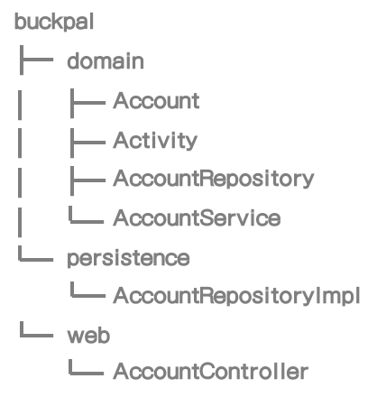
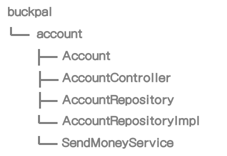
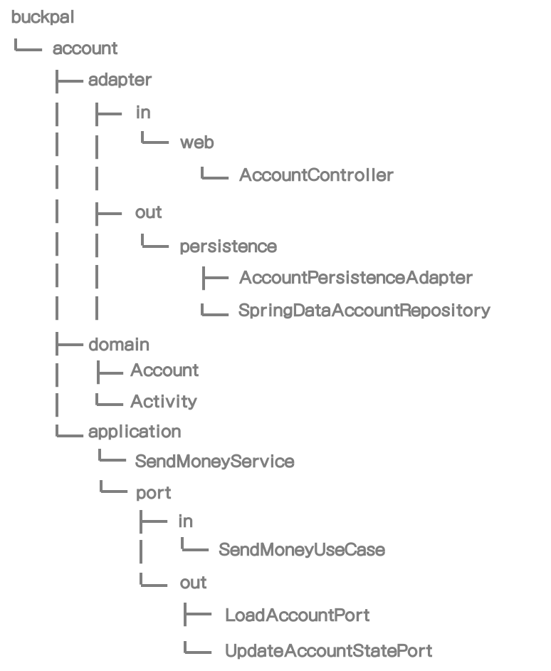
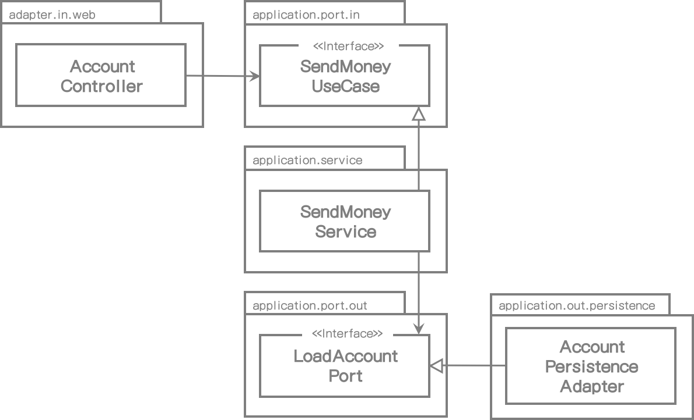

# 3. 코드 구성

> > > > 여기

코드를 잠깐 살펴 보는 것만으로 아키텍처를 이해할 수 있다면 얼마나 좋을까?

이번 장에서는 코드를 구성하는 다양한 방법을 시험해보고 헥사고날 아키텍처를 직접적으로 나타내는 패키지 구조를 소개할 것이다.

소프트웨어 프로젝트를 처음 시작할 때 가장 먼저 해야 할 일은 패키지 구조를 만드는 일이다. 프로젝트 동안 사용하려고 괜찮아 보이는 구조를 만들었다. 그리고 나서 프로젝트 기간 동안 매우 바빠졌고 여러 패키지 구조가 단지 구조화되지 않은 코드 덩어리를 보기만 좋게 묶어주는 폴더 역할만 하고 있었다는 것을 우리는 깨닫게 된다.

우리는 서문에서 소개한 BuckPal 예제 애플리케이션 코드를 구조화하는 다른 선택사항들을 논의할 것이다. 좀 더 구체적으로 말하면, 사용자가 자신의 계좌에서 다른 계좌로 이체하는 "Send Money" 유스케이스에 대해서 살펴볼 것이다.

## 계층 기반으로 구성하기

첫번째 접근법은 계층 기반으로 코드를 구성하는 것이다. 우리는 이 같이 코드를 구성할 수 있다.

[그림 3.1] 계층 기반으로 코드를 구성할 때는 기능적인 관점이 섞이는 경향이 있다.

웹, 도메인, 영속성 등 각 계층만의 전용 패키지가 있다. *1장(What's Wrong with Layers)*에서 논의한 대로, 단순 계층형 구조는 여러가지 이유로 좋은 구조가 아닐 수 있다. 그래서 우리는 **domain** 패키지 내의 도메인 코드 방향으로만 의존하게 해서 의존성 역전 원칙을 이미 적용했다. 우리는 **domain** 패키지에 **AccountRepository** 인터페이스를 두고 **persistence** 패키지에서 이를 구현함으로써 의존성 역전 원칙을 적용했다.

하지만, 이런 방식의 패키지 구조가 최적이 아닌 이유를 적어도 세가지 찾을 수 있다.

첫번째는, 기능 간 또는 애플리케이션 피처 사이에 패키지 경계가 없다는 것이다. 만일 사용자 관리에 기능을 추가한다면, **web** 패키지에 **UserController**, **domain** 패키지에 **UserService**, **UserRepository**, **User** 그리고 **persistence** 패키지에 **UserRepositoryImpl**을 추가하게 될 것이다. 구조의 개선이 이뤄지지 않는다면, 하나의 클래스 덩어리로 빠르게 뭉쳐질 것이며 애플리케이션간 서로 관련없는 피처로부터 부작용이 생길 것이다.

두번째로, 애플리케이션이 제공하는 유스케이스가 어떤 것인지 알 수 없다는 것이다. **AccountService**, **AccountController** 클래스가 어떤 유스케이스를 구현하고 있는지 말할 수 있을까? 만일 우리가 특정 기능을 찾는다면, 어떤 서비스가 구현하고 있는지 추측해야만 하고 서비스 내에 해당 메서드를 찾아야 한다.

마찬가지로, 패키지 구조 내에서 대상 아키텍처를 알 수 없다. 우리는 헥사고날 아키텍처 스타일을 따라했고 웹과 영속성 어댑터를 찾기 위해 **web**과 **persistence** 패키지 내에서 해당 클래스를 찾는다고 생각할 수 있다. 그러나 웹 어댑터에서 호출되는 기능이 무엇인지, 영속성 어댑터에서 도메인 계층에 어떤 기능을 제공하는지 쉽게 알 수 없다. 인바운드와 아웃바운드 포트는 코드 내에 숨겨져 있다.

## 기능 기반으로 구성하기

"계층 기반으로 구성하기" 접근법의 몇가지 이슈를 해결해보자.

다음은 기능 기반으로 코드를 구성하는 접근법이다.

[그림 3-2] 기능 기반으로 코드를 구성할 때,  핵심 아키텍처가 잘 나타나지 않는다.

실제로 acount 와 관련된 모든 코드를 상위의 **account** 패키지에 넣었다. 또한 계층 기반 패키지도 제거했다.

새로운 기능은 **account** 옆에 새로운 상위 패키지로 생길 것이며 외부 접근이 안되는 클래스에 대해서는 package-private을 사용하여 기능 사이에 패키지 경계를 그을 수 있다.

package-private 가시성으로 지정된 패키지 경계를 사용하여 피처 간에 불필요한 의존성을 피하게 할 수 있다.

또한 **AccountService**의 책임의 범위를 좁히기 위해서 **SendMoneyService**로 이름을 변경했다 (실제로 계층 기반 패키지에서도 할 수 있었다). 클래스 이름만으로 "Send Money"를 구현하는 코드를 찾을 수 있다. 코드 상에서 애플리케이션 기능을 알아 볼 수 있게 만드는 것을 Robert C. Martin이 그 의도를 소리친다고 하여 "소리치는 아키텍처"라고 부르는 것이다.  *(클린 아키텍처, 2017)*

하지만, 기능 기반 패키지 접근법은 계층 기반 접근법보다 아키텍처 측면에서는 불분명하다. 어댑터를 확인하기 위한 패키지 이름도 없고, 인바운드/아웃바운드 포트도 찾을 수 없다. 게다가 **SendMoneyService**가 오직 **AccountRepository** 인터페이스만 알고 있고 그 구현체는 알 수 없도록 도메인과 영속성 코드 사이 의존성을 역전 시켰을 지라도, 영속성 코드로의 의존관계가 우연히 생기지 않게 도메인 코드를 보호하는 package-private을 사용할 수 없다.

그래서 어떻게 하면 아키텍처의 가시성을 높일 수 있을까? 그림 2.4에 나타낸 것과 같이 아키텍처 다이어그램 박스(box)로 나타낼 수 있고 그 박스의 책임이 무엇인지 바로 확인할 수 있으면 좋을 것이다.

이런 것들을 표현하는 패키지 구조를 한번 만들어보자.

## 아키텍처적으로 표현하는 패키지 구조

헥사고날 아키텍처에서, 아키텍처의 주요 구성 요소로서 엔티티, 유스케이스, 인바운드/아웃바운드 포트, 인바운드/아웃바운드 어댑터가 있다. 이러한 요소들을 아키텍처를 표현하는 패키지 구조로 맞춰보자.

[그림 3.3] 아키텍처적으로 표현된 패키지 구조에서는 각 아키텍처 요소들은 놓여질 위치가 있다.

아키텍처의 각 요소는 패키지 중 하나에 직접 매핑될 수 있다. 최상위 레벨에서, **Account** 관련 유스케이스를 구현하는 모듈인 **account**라는 패키지가 있다.

그 다음 레벨에서, 도메인 모델을 포함하는 **domain** 패키지가 있다. **application** 패키지에는 도메인 모델 주위의 서비스 계층이 있다. **SendMoneyService**는 인바운드 포트 인터페이스인 **SendMoneyUseCase**를 구현하고, 아웃바운드 포트 인터페이스인 **LoadAccountPort** 그리고 영속성 어댑터에서 구현되는 **UpdateAccountStatePort**를 사용한다.

**adapter** 패키지에는 애플리케이션 계층 인바운드 포트를 호출하는 인바운드 어댑터와 애플리케이션 계층의 아웃바운드 포트의 구현체가 있는 아웃바운드 어댑터가 있다. 우리의 경우에는 각각 하위 패키지가 있는 **web**과 **persistence** 어댑터를 가진 단순 웹 애플리케이션을 만들고 있다.

이제 다됐다. 기술적인 것처럼 보이는 많은 패키지가 있어 혼란스럽지 않는가?

헥사고날 아키텍처 그림이 사무실 벽에 걸려 있고 우리가 호출하는 외부  API 수정에 대해 동료와 이야기하고 있다고 상상해보라. 이를 논의할 때 서로의 이해도를 높이기 위해 여기에 해당되는 아웃바운드 어댑터를 그림에서 직접 가리킬 수도 있다. 그리고 나서, API 클라이언트 코드는 adapter/out/[name-of-adapter] 패키지에서 찾을 수 있기 때문에 대화가 끝난 후 자리에 앉아서 곧바로 IDE로 작업을 시작할 수 있다.

이제는 좀 정리가 되어 도움이 되는 것 같지 않는가?

이 패키지 구조는 소위 "아키텍처와 코드 사이 간극(architecture-code-gap)" 혹은 "모델과 코드 사이 간극(model-code-gap)"이라는 논쟁(*Just Enough Architecture by George Fairbanks, Marshall & Brainerd, 2010, page 167*)에서 영향력을 미치는 요소이다. 이 용어에서 대부분의 소프트웨어 개발 프로젝트에서는 아키텍처가 코드와 직접 매핑될 수 없는 단지 추상화된 개념이라는 사실을 나타낸다. 패키지 구조가 아키텍처를 반영하지 않는다면 그 코드는 보통 목표 아키텍처와 더욱 더 멀어질 것이다.

또한, 이렇게 나타낸 패지키 구조는 아키텍처에 대한 긍정적 사고를 유도한다. 우리는 많은 패키지들 중에 현재 작업하는 코드를 어느 패키지에 넣어야 할지 고민해야 한다.

하지만 패키지간 접근을 허용하기 위해서 모든 패키지가 public이어야 한다는 것을 의미하지 않는가?

적어도 adapter 패키지에서는 아니다. **application** 패키지 내부의 포트 인터페이스를 제외하고는 외부에서 호출되지 않기 때문에 모든 클래스는 private-package여도 될 것이다. 그래서 application 계층에서 실수로 adapter 클래스를 의존하는 일은 없을 것이다.

하지만, **application**과 **domain** 패키지 내에서 몇 개의 클래스는 public이어야만 한다. 포트는 설계상 어댑터에서 접근되야 하므로 public이어야 한다. 도메인 클래스는 서비스와 어댑터에서 접근되어야 하므로 public이어야 한다. 서비스는 인바운드 포트 인터페이스 뒤쪽에 숨겨져 있기 때문에 public일 필요는 없다.

어댑터 코드를 해당 패키지로 옮김으로써 필요한 시점에 어댑터를 다른 구현체로 매우 쉽게 교체할 수 있는 부가적인 장점을 가지고 있다. 우리가 단순 키-값 데이터베이스 구현을 시작했다고 생각해봐라. 어떤 데이터베이스가 좋을 지 확신할 수 없기 때문에 당장은 SQL로 구현해야 할 수도 있다. 우리는 새로운 어댑터 패키지 내에서 단순히 아웃바운드 포트의 명세에 맞게 구현하기만 하면 되고 나중에 기존 패키지를 제거하면 된다.

이런 패키지 구조의 또 다른 좋은 장점은 DDD 개념과 직접적으로 매핑할 수 있다는 것이다. 우리의 경우에서는, 상위 패키지인 **account**가 다른 바운디드 컨텍스트(bounded context)와의 통신을 위한 진입점 역할을 하는 바운디드 컨텍스트이다. **domain** 패키지 내에서 DDD가 제공하는 다양한 도구를 활용하여 어떤 형태의 도메인 모델도 만들 수 있다.

이러한 패키지 구조를 유지하는 데는 소프트웨어 개발 생애주기 동안 많은 훈련이 필요하다. 또한 아키텍처-코드 간극을 넓히고 아키텍처를 반영하지 않는 패키지를 생성하는 등 패키지 구조가 적절하지 않는 경우도 있을 것이다.

완벽이라는 것은 있을 수 없다. 패키지 구조를 명시적으로 나타냄으로써 우리는 적어도 코드와 아키텍처 사이의 간극은 줄여줄 수 있다.

## 의존성 주입의 역할

위 패키지 구조는 클린 아키텍처에 도움이 되지만, *Chapter 2(Inverting Dependencies)*에서 배웠듯이 그러한 아키텍처의 필수 요구사항은 애플리케이션 계층이 인바운드/아웃바운드 어댑터에 의존성을 가져서는 안된다는 것이다.

웹 어댑터 같은 인바운드 어댑터는 제어 흐름이 어댑터와 도메인 코드 사이의 의존성과 같은 방향을 가리키기 때문에 이해하기 쉽다. 어댑터는 단순히 애플리케이션 계층 내부 서비스를 호출한다. 애플리케이션 진입점 으로서의 경계를 명확히 나타내기 위해 포트 인터페이스 사이에 있는 실제 서비스를 숨길 수도 있다.

영속성 어댑터 같은 아웃바운드 어댑터는, 의존성을 제어 흐름과 반대 방향으로 돌리기 위해 의존성 역전 원칙을 사용해야 한다.

이미 그 작동방식에 대해서는 살펴봤다.  우리는 애플리케이션 계층 내에 인터페이스를 만들고 그 인터페이스는 어댑터에서 구현된다. 헥사고날 아키텍처 내부에서 이 인터페이스는 포트이다. 그런 다음 애플리케이션 계층은 어댑터의 기능을 요청하기 위해 이 포트 인터페이스를 호출한다. (다음 그림 참조)

[그림 3.4] 웹 컨트롤러는 서비스에 구현된 인바운드 포트를 호출한다. 서비스는 어댑터에서 구현된 아웃바운드 포트를 호출한다.

하지만 포트 인터페이스를 구현하는 실제 객체가 있는 애플리케이션은 누가 제공하는가? 어댑터로의 의존성을 갖지 않기 위해 애플리케이션 계층 내부에 있는 포트를 직접 인스턴스화 하고 싶지는 않다.

여기가 의존성 주입 효과가 나타나는 곳이다. 모든 계층에 의존성을 가지는 중립 컴포넌트를 사용한다. 이 컴포넌트는 아키텍처를 구성하는 대부분 클래스의 인스턴스를 생성하는 책임이 있다.

이전 예제 그림에서, 중립 의존성 주입 콤포넌트는 **AccountController**, **SendMoneyService**, **AccountPersistenceAdapter** 클래스의 인스턴스를 만들 것이다. **AccountController**는 **SendMoneyUseCase** 인터페이스가 필요하기 때문에 생성자에서 **SendMoneyService** 클래스 인스턴스를 주입할 것이다. 컨트롤러는 인터페이스만 알면 되므로 인터페이스가 **SendMoneyService** 인스턴스를  가지고 있는지 알지 못한다.

유사한 방식으로 **SendMoneyService** 객체를 생성할 때 의존성 주입 매커니즘은 **LoadAccountPort** 인터페이스에 대해 **AccountPersistenceAdapter** 클래스 인스턴스를 주입할 것이다. 

*Chapter 9(Assembling the Application)* 에서 Spring 프레임워크 애플리케이션을 초기화하는 방법에 대해 알아볼 것이다.

## How Does This Help Me Build Maintainable Software?

우리는 실제 코드 구조를 목표 아키텍처 구조와 유사하게 만들어주는 헥사고날 아키텍처 패키지 구조에 대해 살펴봤다. 코드 내에서 아키텍처 요소들을 찾는 일은 패키지 구조를 아키텍처 다이어그램에 박스로 표시된 이름을 찾아 따라가기만 하면 되고 이는 커뮤니케이션, 개발, 유지보수에 도움을 준다.

다음 장에서 패키지 구조와 의존성 주입과정을 살펴볼 것이고 애플리케이션 계층에서 유스케이스, 웹 어댑터, 영속성 어댑터 등을 구현해볼 것이다.