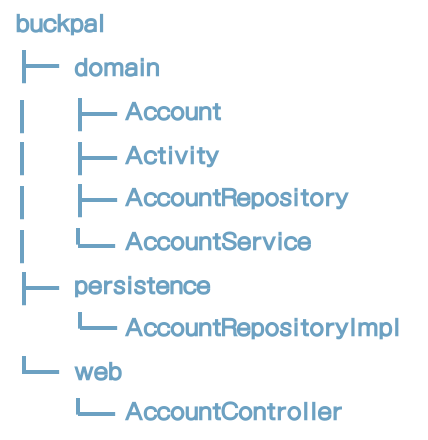
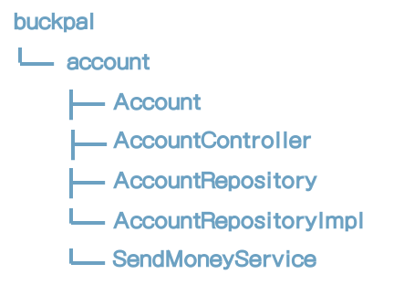
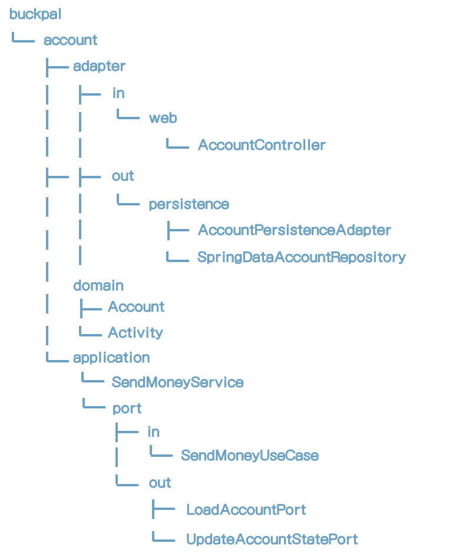
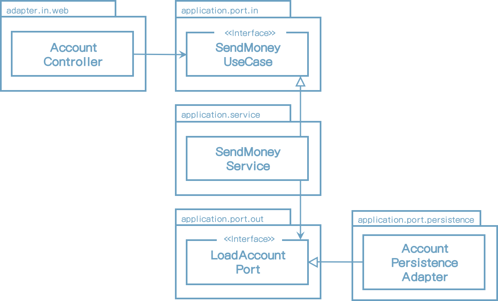

# 3 Organizing Code

아키텍처를 코드로 보고 이해한다면 좀 더 좋지 않겠는가?

이 장에서는 코드를 작성하고 헥사고날 아키텍처를 직접 구현하는 패키지 구조를 설명하는 다양한 방법을 시험해볼 것이다.

초기 소프트웨어 프로젝트에서 처음으로 해야 할 일은 패키지 구조이다. 프로젝트 괜찮아 보이는 구조를 만들었다. 그리고 나서 프로젝트 동안 정신이 없어졌고 많은 부분에서 패키지 구조는 단지 <u>혼잡한 코드의 괜찮아 보이는 구조물</u>이었다는 것을 깨닫는다. 하나의 패키지의 클래스는 임포트 되어서는 안되는 다른 패키지에서 클래스를 임포트한다.

우리는 서문에서 소개한 BuckPal 예제 애플리케이션의 코드를 구조화하는 다른 옵션을 논의할 것이다. 더욱 분명한 것은 사용자가 자신의 계좌에서 다른 계좌로 이체를 하는 "이체" 유스케이스를 살펴볼 것이다

## Organizing by Layer

코드를 구성하는 첫번째 접근법은 레이어이다. 우리는 이와 같이 코드를 구성할 수 있다.

[그림 3-1] 레이어로 코드를 구성할 때 기능적인 관점이 섞이는 경향이 있다.

웹, 도메인, 퍼시스턴스와 같은 레이어 각각에 대한 전용 패키지가 있다. 1장(What's Worng with Layers)에서 논의한 대로 단순한 레이어는 여러가지 이유로 최선의 구조는 아닐수도 있다. 그래서 여기서 도메인 패키지에 도메인 코드쪽으로 의존관계를 둠으로써 의존성 역전 원칙을 이미 적용했다. 도메인 패키지에 AccountRepository를 두고 퍼시스턴스 패키지에서 구현체를 만들었다.

그러나, 패키지 구조가 최선안이 아닌 세가지 이유를 찾을 수 있다.

첫번째, 기능적 측면과 피처 사이에 패키지 경계가 없다. 사용자 관리에 대한 피처를 추가할 때 웹 패키지에 UserController, UserService, UserRepository를 추가할 것이고 도메인 패키지에 User, 퍼시스턴스 패키지에 UserRepositoryImpl을 추가할 것이다. 구조 개선이 없다면 애플리케이션에서 클래스 덩어리가 될것이며 관련없는 피처사이의 원치 않은 부작용이 있을 것이다.

두번째, 애플리케이션이 제공하는 유스케이스가 무엇인지 알 수 없다. AccountService, AccountController 클래스가 어떤 유스케이스를 구현하고 있는지 말할 수 있는가? 특정 피처를 찾는다면 어떤 서비스가 구현하고 있는지 추측해야만 하고 서비스 내에 메서드를 찾아야 한다.

비슷하게, 패키지 구조 내부에 대상 아키텍처를 알 수 없다. 우리는 헥사고날 아키텍처 스타일을 따라했고 웹과 퍼시스턴스 어댑터를 찾기 위해 웹과 퍼시스턴스 패키지내 클래스를 찾는다. 그러나 웹 어댑터에서 호출되는 기능이 무엇인지 금방 알 수 없고 퍼시스턴스 어댑터에서 도메인 레이어에 어떤 기능을 제공하는지 알 수 없다. 입/출력 포트가 코드상에 가려져 있다.

## Organizing by Feature

"레이어로 구성하기"의 접근법에 대한 이슈 몇개를 다뤄보자.

다음 접근법은 피처로 코드를 구성하는 것이다.

[그림 3-2] 피처로 코드를 구성할 때,  아키텍처의 핵심이 드러나지 않는 경향이 있다.

원천적으로 acount 와 관련된 모든 코드는 고수준의 account 패키지에 넣었다. 또한 레이어 패키지를 제거했다.

각각의 피처 그룹은 acount 옆의 패키지로 생길 것이며 외부로 부터 접근 되서는 안되는 클래스의 가시성을 private을 사용하여 패키지 경계를 강제할 수 있다.

private 가시성을 가진 패키지 경계는 피처들 사이에 원치 않은 의존성을 피하게 할 수 있다.

또한 AccountService를 책임을 명확히 하기 위해 SendMoneyService로 명명했다. (실제로 레이어로 구성하기에서도 할 수 있었다). 클래스 이름만으로 "이체"를 구현하는 코드를 볼 수 있다. 코드상에 애플리케이션 기능을 표시하는 것을 로버트 마틴은 그 의도를 소리친다고 하여 "소리치는 아키텍처"라고 부른다.  (클린 아키텍처, 2017)'

그러나, 피처에 의한 패키지 접근법은 아키텍처 측면에서 레이어 접근법 보다 덜 가시적이다. 어댑터를 확인하기 위한 패키지가 없고 입/출력 포트도 볼 수 없다. 더욱 더 도메인 코드와 퍼시스턴스 코드 사이에 의존성을 역전시켜서 SendMoneyService는 AccountRepository 인터페이스를 알고 구현체를 모를지라도, 퍼시스턴스 코드로 도메인 코드를 보호하기 위한 private을 사용할 수 없다.

그럼 어떤게 해야 아키텍처를 쉽게 알아 볼수 있을까? 그림 2.4에 나타난대로 아키텍처 다이어그램의 박스로 나타낼 수 있고 박스의 책임이 무엇인지 바로 확인할 수 있으면 좋을 것이다.

패키지 구조를 만들기 위해 한단계 더 가보자.

## An Architectural Expressive package Structure

헥사고날 아키텍처에서는 아키텍처의 주요 구성 요소로서 엔티티, 유스케이스, 인/아웃 포트, 인/아웃 어댑터가 있다. 이 아키텍처를 표현하는 패키지 구조로 맞춰보자.

[그림 3-3] 아키텍처적으로 표현된 패키지 구조에서는 각 아키텍처 요소들은 각각의 위치를 가지고 있다.

아키텍처의 각 요소는 패키지 중 하나에 직접 매핑될 수 있다. 고수준 차원에서 **Account**의 유스케이스를 구현하는 목적으로 account 패키지가 하나 있다.

그 다음 레벨에서 도메인 모델을 포함하는 **domain** 패키지가 있다. **application** 패키지는 도메인 모델 주위의 서비스 레이어를 포함한다. **SendMoneyService**는 내부 포트 인터페이스, **SendMoneyUseCase**, 그리고 외부 포트 인터페이스, **LoadAccountPort**, **UpdateAccountStatePort**등을 구현한다.

**adapter** 패키지는 애플리케이션 계층을 호출하는 내부 어댑터와 애플리케이션 레이어의 외부 포트를 구현하는 외부 어댑터를 포함한다. 우리는 자체 서브 패키지가 있는 웹과 영속성 어댑터를 가진 단순 애플리케이션을 만들고 있다.

사무실 벽에 헥사고날 아키텍처 포스터가 있고 특정 외부 API를 수정하는 것에 대해 동료와 얘기하고 있다고 상상해보라. 논의할 때 서로의 이해도를 높이기 위해 포스트상 외부 어댑터를 직접 가리킬 수 있다. API 클라이언트 코드는 dapter/out/<name-of-dapter> 패키지에서 찾을 수 있기 때문에 곧바로 자리에 앉아 IDE로 직접 작업을 진행할 수 있다.

혼란스럽지 않고 도움이 되지 않는가?

이 패키지 구조는 소위 "아키텍처 코드 간격" 혹은 "모델 코드 간격"이라는 영향력 있는 요소이다. 이 용어는 대부분 아키텍처 개발 프로젝트에서 아키텍처는 코드와 직접적인 관련이 없는 추상화된 개념이다라는 사실을 말해주고 있다. 패키지 구조가 아키텍처를 반영하지 않는다면 코드는 기반 아키텍처와 더욱 더 멀어진다.

또한 패지키 구조를 표현하는 것은 아키텍처에 대해서 사고력을 높여준다. 많은 패키지들이 있고 현재 작업하는 코드를 어느 패키지에 넣어야 할지 고민해야 한다.

하지만 모든 패티지가 패키지간 접근을 허용하기 위해서 모두 public일 필요는 없지 않는가?

적어도 adapter 패키지에서는 사실이 아니다. application 패키지 내부에 있는 인터페이스를 제외하고는 외부에서 호출되지 않기 때문에 모든 클래스는 private일지도 모른다. application 계층에서 adapter 클래스로 <u>우연한 의존성은 없다.</u>

그러나 application과 domain 패키지 내에서 어떤 클래스는 public이어야만 한다. 포트는 설계사 ㅇ어댑터에서 접근 되어야 하지 때문에 public이어야만 한다. 도메인 클래스는 서비스와 어댑터에서 접근되어야 하므로 public이어야 한다. 서비스는 퍼블릭일 필요는 없다. 왜나하면 내부 포트 인터페이스 뒤쪽에 숨겨져 있기 때문이다.

어댑터 코드를 자신의 패키지로 옮기는 것은 필요한 시점에 어댑터를 다른 구현체로 쉽게 변경할 수 있는 부가적인 장점을 가지고 있다. 단순힌 키-값 데이터베이스를 구현하고 있다고 생각해보라. 어떤 데이터베이스가 좋을지 모르기때문에 SQL 데이터베이스로 변경할 필요가 있다. 새 어댑터 패키지에 외부 포트를 구현하고 나서 기존 패키지를 제거한다.

패키지 구조에 대한 또 다른 장점은 DDD 개념에 연결할 수 있다는 것이다. 고수준의 패키지인 account는 다른 바운디드 컨텍스트와 통신하기 위한 바운디드 컨텍스트이다. 도메인 패키지 내에서 DDD가 제공하는 다양한 도구를 활용하여 원하는 형태의 도메인 모델을 만들 수 있다.

모든 구조적인 측면에서, 소프트웨어 개발 생애주기 동안 패키지 구조를 유지하는데는 많은 훈련이 필요하다. 또한 패키지 구조가 올바르지 않는다면 <u>아키텍처/코드 간격을 넓히는 방법, 아키텍처와 관련없는 패키지를 만드는 것</u>

완벽함이란 있을 수 없다. 패키지 구조를 잘 표현하는 것은 최소한 코드와 아키텍처 사이의 간극을 줄여줄 수 있는 요소이다.

## The Role of Dependency Injection

이전에 나타낸 패키지 구조는 클린 아키텍처에 도움이 되지만 아키텍처의 필수 요구사항은 Chapter 2(Inverting Dependencies)에서 배웠듯이 애플리케이션 계층은 내/외부 어댑터에 의존성을 가져서는 안된다는 것이다.

웹 어댑터 같은 내부 어댑터는 어댑터와 도메인 코드 사이에 의존성과 같은 방향으로 흘러가기 때문에 이해가 쉽다. 어댑터는 애플리케이션 레이어 내부에 서비스를 호출한다. 애플리케이션 진입점의 경계를 분명히 나타내기 위해 포트 인터페이스 사이의 실제 서비스를 숨길지도 모르겠다.

영속성 계층과 같은 외부 어댑터에서 의존성을 제어의 방향과 반대로 돌리기 위해 의존성 역전 원칙을 사용해야 한다.

우리는 이미 어떤게 동작하는지에 대해 알아봤다. 어댑터 내부 클래스로 구현되는 애플리케이션 레이어 내부에 인터페이스를 만든다. 헥사고날 아키텍처 내부에서 이 인터페이스는 포트이다. 애플리케이션 계층은 다음 그림에서 나타난대로 어뎁터의 기능을 요청하기 위해  이 포트 인터페이스를 호출한다.

[그림 3-4] 웹 컨트롤러는 서비스에서 구현된 내부 포트를 호출한다. 서비스는 어댑터에서 구현된 외부 포트를 호출한다.

하지만 포트 인터페이스를 구현하는 실제 객체가 있는 애플리케이션을 누가 제공하는가? 우리는 애플리케이션 계층 내부에 포트를 인스턴스화 하고 싶지는 않는다. 왜냐하면 어댑터로의 의존성을 가지고 싶지 않기 때문이다.

이것이 의존성 주입의 효과가 나타나는 지점이다. 모든 레이어에 의존성을 가지고 있는 컴포넌트를 소개한다. 이 컴포넌트는 아키텍처 상의 대부분의 클래스를 인스턴스화 하는데 책임이 있다.

이전 예시 그림에서, 의존성 주입 콤포넌트는 AccountController, SendMoneyService, AccountPersistenceAdapter 클래스를 인스턴스화 할 것이다. AccountController는 SendMoneyUseCase 인터페이스가 필요하기 때문에 의존성 주입은 <u>SendMoneyService의 인스턴스를 주입할 것이다.</u> 컨트롤러는 인터페이스만 알면 되므로 실제 SendMoneyService 인스턴스를 가지고 있는지 모른다.

유사하게 SendMoneyService를 인스턴스화 할때 의존성 주입 매커니즘은 LoadAccountPort 인터페이스 외부에 있는 AccountPersistenceAdapter 클래스의 인스턴스를 주입할 것이다. 

*Chapter 9(Assembling the Application)* 에서 스프링 프레임워크로 애플리케이션 초기화하는 방법에대해 논의해 볼 것이다.

## How Does This Help Me Build Maintainable Software?

우리는 실제 코드 구조가 아키텍터 구조와 유사하게 하는 헥사고날 아키텍처의 패키지 구조에 대해 살펴봤다. 코드상 아키텍처 요소들을 찾는 일은 아키텍처 다이어그램상의 특정 박스이름으로 패키지 구조를 찾아가는 문제이며 커뮤니케이션, 개발, 유지보수에 도움을 준다.

다음 장에서 패키지 구조와 의존성 주입과정을 살펴볼 것이고 애플리케이션 계층에서 유스케이스, 웹 어댑터, 영속성 어댑터 등을 구현해볼 것이다.