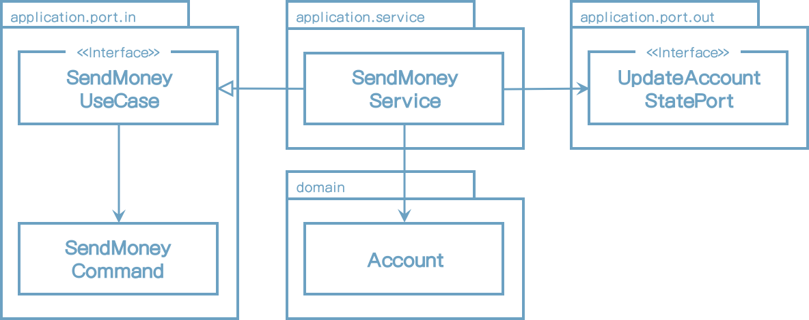

# 4. 유스케이스 구현

실제 코드상에서 논의한대로 이제 아키텍처를 어떻게 명확히 나타내는지를 한번 보자.

애플리케이션, 웹, 영속성 계층은 아키텍처에 느슨하게 결합되어 있어서 도메인 코드를 알맞게 모델링할 수 있다. DDD를 사용할 수도 있고 풍부(rich)하거나 빈약한(anemic) 도메인 모델을 구현할 수도 있고 혹은 우리 자신만의 방법으로 개발할 수도 있다.

이 장에서는 이전 장에서 소개한 헥사고날 아키텍처 스타일 유스케이스를 구현하는 방법을 나타낸다.

도메인 중심 아키텍처로 적합하기 때문에 도메인 엔터티를 만들고 거기에다가 유스케이스를 만들어 볼 것이다.


## 도메인 모델 구현하기

한 계좌에서 다른 계좌로 돈을 보내는 유스케이스를 구현할 수도 있다. 객체 지향 방식을 모델링 하는 방법 중 하나는 계좌에서 돈을 인출하며 대상 계좌로 입금할 수 있도록 입/출금용 **Account** 엔티티를 만드는 것이다.

```java
package buckpal.domain;

@AllArgsConstructor
@Getter
public class Account {
    private AccountId id;
    private Money baselineBalance;
    private ActivityWindow activityWindow;

    public Money calculateBalance() {
        return Money.add(
            this.baselineBalance,
            this.activityWindow.calculateBalance(this.id)
        );
    }

    public boolean withDraw(Money money, AccountId targetAccountId) {
        if (!mayWithDraw(money)) {
            return false;
        }

        Activity withDrawal = new Activity(
            this.id,
            this.id,
            targetAccountId,
            LocalDateTime.now(),
            money
        );
        this.activityWindow.addActivity(withDrawal);
        return true;
    }

    private boolean mayWithDraw(Money money) {
        return Money.add(
            this.calculateBalance(),
            money.negate()
        ).isPositive();
    }

    public boolean deposit(Money money, AccountId sourceAccountId) {
        Activity deposit = new Activity(
            this.id,
            sourceAccountId,
            this.id,
            LocalDateTime.now(),
            money
        );
        this.activityWindow.addActivity(deposit);
        return true;
    }
}

```


**Account** 엔티티는 실제 계좌의 현재 상태를 제공한다. 모든 인출과 입금은 **Activity** 엔티티에서 일어난다. 계좌의 모든 거래이력을 메모리로 로딩하는 것은 좋은 방법이 아니기 때문에, **Account** 엔티티는 **ActivityWindow** 값 객체에 저장된 지난 몇일 혹은 몇주의 이력만을 가져와야 한다.

현재 계좌 잔고를 계산하기 위해서 **Account** 엔티티는 계좌가 이전 거래이력 전의 잔고를 나타내는 **baselineBalance** 속성을 가지고 있다. 총 잔고는 모든 거래이력을 포함하는 기본이 되는 잔고이다.

이 모델 덕분에, 계좌로의 인출 및 입금은 **withdraw()**와 **deposit()** 메소드에서 했던 것처럼, 거래이력에 새 이력을 추가하는 것이다. 인출하기 전에 인출을 할 수 없는 규칙을 한번 확인해 볼 것이다.

이제 인출 및 입금할 수 있는 **Account** 엔티티가 있고 거기에 유스케이스를 만들 수 있다.


## 간단한 유스케이스

먼저, 유스케이스가 실제 무슨 작업을 하는지 알아보자. 일반적으로 다음 단계를 거치게 된다.

1. 입력을 받는다.
2. 비즈니스 규칙을 확인한다.
3. 모델의 상태를 변경한다.
4. 결과를 리턴한다.

유스케이스는 입력 어댑터로 부터 입력값을 받는다. "입력값 검증" 단계를 왜 호출하지 않았는지 의문이 들지도 모르겠다. 유스케이스는 도메인 로직만을 알아야 하고 입력값 검증으로 오염이 되어서는 안된다고 믿기 때문이다. 그래서, 입력값 검증은 따로 얘기할 예정이다.

그러나, 유스케이스는 *비즈니스 규칙 검증*에 대한 책임은 있다. 이러한 책임은 도메인 엔티티와 나눠서 가진다. 이 장의 후반부에서 입력값 검증과 비즈니스 규칙 검증과의 차이에 대해 논의할 예정이다.

비즈니스 규칙이 충족되었다면, 유스케이스는 입력값에 기반하여 모델 상태를 변경한다. 일반적으로, 도메인 객체 상태를 변경할 것이며 이렇게 변경된 상태는 저장된 영속성 어댑터로 구현되는 포트로 전달할 것이다. 또한, 유스케이스는 어떤 외부 어댑터를 호출할 수도 있다. 

마지막 단계는 외부 어댑터에서 오는 리턴값을 호출하는 어댑터로 리턴되는 출력 객체로 변환하는 것이다.

이런 단계를 숙지하고서 "Send Money" 유스케이스를 어떻게 구현할지 알아보자.

*1장(What's Wrong with Layers)*에서 논의한 넓은 범위의 서비스가 갖는 문제를 피하기 위해서, 우리는 모든 유스케이스를 하나의 클래스에 넣지 않고 각 유스케이스마다 분리된 서비스 클래스로 사용할 것이다.

여기 예시코드가 있다.

```java
@RequiredArgsConstructor
@Transactional
public class SendMoneyService implements SendMoneyUseCase {

    private final LoadAccountPort loadAccountPort;
    private final AccountLock accountLock;
    private final UpdateAccountStatePort updateAccountStatePort;

    @Override
    public boolean sendMoney(SendMoneyCommand command) {
        // TODO: validate business rules
        // TODO: manipuate model state
        // TODO: return output
    }
}
```

서비스는 내부 포트 인터페이스인 **SendMoneyUseCase**를 구현하고, 계좌정보를 가져오기 위해 외부 포트 인터페이스인 **LoadAccountPort**를 호출하고, 데이터베이스에 계좌 상태를 저장하기 위해서 **UpdateAccountStatePort**를 호출한다. 다음은 컴포넌트를 그림으로 적절하게 표현한 것이다.




[그림 4.1] 서비스는 유스케이스를 구현하고 도메인 모델을 수정한다. 그리고 수정된 상태를 저장하기 위해 외부 포트를 호출한다.


## 입력값 검증하기

이제, 유스케이스 클래스의 책임이 아니었다고 말했던 입력값 검증에 대한 이야기를 해보자. 하지만, 나는 입력값 검증이 애플리케이션 계층에 있어야 한다고 여전히 생각한다. 여기서 그 논의를 한번 해보자.

유스케이스 호출 전 어댑터에서 입력값 검증을 왜 하지 말아야 하는걸까? 유스케이스에 필요한 모든 것을 이미 검증했다고 믿는걸까? <u>유스케이스는 하나 이상의 어댑터에서 호출될 수 있다, 그래서 유효성 검증은 각각 어댑터에서 구현되어야 한다. 그리고 잘못 사용된 정보를 받을 수 있거나 완전히 잊어버릴 수 있다.</u>

애플리케이션 계층은 입력값 검증에 신경써야 한다. 그렇지 않으면 애플리케이션 외부에서 잘못된 입력 정보를 받을 수 있고 그 때문에 모델 상태에 심각한 문제를 유발할 수도 있다.

그러나 유스케이스 클래스가 아니라면 어느곳에서 입력값 검증을 해야 할까?

*입력 모델*을 만들어 그 일을 책임지게 할 것이다. "Send Money" 유스케이스에서, 입력 모델은 이전 코드에서 봤던 "**SendMoneyCommand**" 클래스이다. 더 정확히 말하면, 생성자 내에서 검증을 체크할 것이다.

```java
@Getter
public class SendMoneyCommand {
		private final AccountId sourceAccountId;
		private final AccountId targetAccountId;
		private final Money money;

		public SendMoneyCommand(
				AccountId sourceAccountId,
				AccountId targetAccountId,
				Money money) {
      		this.sourceAccountId = sourceAccountId;
			 this.targetAccountId = targetAccountId;
			 this.money = money;
      		requireNonNull(sourceAccountId);
      		requireNonNull(targetAccountId);
      		requireNonNull(money);
      		requireGreaterThan(money, 0);
		}
	}
```

송금을 하기 위해서 보내는 사람과 받는 사람의 ID정보, 송금 금액이 필요하다. 어떤 파라미터도 null이 되어서는 안되며 송금액도 0보다 커야 한다. 이런 조건이 위배될 때, 생성자에서 예외를 던지기만 하면 객체 생성이 실패한다.

**SendMoneyCommand** 필드를 만들 때 불변성으로 만든다. 그래서 일단 생성이 되면 유효한 상태이고 유효하지 않은 상태로 변경될 수 없다고 확신할 수 있다.

**SendMoneyCommand**는 유스케이스 API의 한 부분이기 때문에 내부 포트 패키지에 위치한다. 그래서 검증 작업은 애플리케이션 중심부에 남아있지만 신성시 되는 유스케이스 코드를 오염시키지 않는다.

그러나 매번 유효성 확인을 수작업으로 하기 원하는 걸까? java 계열에서는 이런 종류 작업에 표준인 Bean Validation API가 사용된다. 클래스 필드에 어노테이션을 붙여서 검증 규칙을 표현할 수 있다.

```java
class SendMoneyCommand extends SelfValidating<SendMoneyCommand> {

		@NotNull
		private final AccountId sourceAccountId;

		@NotNull
		private final AccountId targetAccountId;

		@NotNull
		private final Money money;

		public SendMoneyCommand(
				AccountId sourceAccountId,
				AccountId targetAccountId,
				Money money) {
			this.sourceAccountId = sourceAccountId;
			this.targetAccountId = targetAccountId;
			this.money = money;
			this.validateSelf();
		}
	}
```

**SelfValidating** 추상 클래스는 **validateSelf()** 메소드를 제공하고 생성자 마지막 부분에서 호출한다. 이것은 필드에 (이 경우는**@NotNull**) Bean Validation 어노테이션을 검증하고 위반 시 예외를 던진다. Bean Validation 방법이 유효성 검증에 명확한 정보를 나타내지 못한다면, 금액이 0보다 큰 값인지 확인했던 것처럼 직접 구현할 수도 있다. 

**SelfValidating**의 구현부는 다음과 같다.

```java
public abstract class SelfValidating<T> {

  private Validator validator;

  public SelfValidating() {
    ValidatorFactory factory = Validation.buildDefaultValidatorFactory();
    validator = factory.getValidator();
  }

  protected void validateSelf() {
    Set<ConstraintViolation<T>> violations = validator.validate((T) this);
    if (!violations.isEmpty()) {
      throw new ConstraintViolationException(violations);
    }
  }
}
```

유효성 검증이 입력 모델에 위치해 있기 때문에,유스케이스 구현부를 실제적 반부패 계층(anti-corruption layer)으로 만들었다. 이것은 그 하위 계층을 호출하는 계층형 아키텍처에서의 계층이 아니고 호출자에게 잘못된 입력값을 내뱉는 유스케이스 주변의 얇은 보호막이다.


## 생성자의 위력

이전 입력 모델, **SendMoneyCommand**은 생성자에서 많은 책임을 가진다. 클래스가 불변성을 가지기 때문에, 생성자의 인자 목록는 클래스의 각 속성에 대한 파라미터를 포함한다. 생성자는 또한, 파라미터를 검증하기 때문에 유효하지 않은 상태의 객체를 생성하는 것은 불가능하다.

우리의 케이스에서, 생성자는 3개의 파라미터만 가지고 있다. 더 많은 파라미터가 필요하다면 어떻게 해야 할까? 좀 더 편리하게 사용하기 위해 **Builder** 패턴을 사용할 수 있지 않을까? 긴 파라미터를 가지는 생성자를 private으로 만들고 그 호출을 **builder()** 메소드 안으로 숨길수 있다. 20개의 파라미터로 생성자를 호출하는 대신에 이와 같이 객체를 만들 수 있다.

```java
new SendMoneyCommandBuilder()
  	.sourceAccountId(new AccountId(41L))
  	.targetAccountId(new AccountId(42L))
  	// ... initialize many other fields
  	.build();
```

builder가 유효하지 않은 상태의 객체를 만들 수 없으므로 여전히 생성자가 유효성 검증을 할수도 있다.

좋은 방법이지 않나? **SendMoneyCommandBuilder**(소프트웨어 프로젝트에서 몇번 씩 발생하는)에 또 다른 필드를 추가해야 하면 어떤 일이 생길지 생각해보자. 생성자와 빌더에 새 필드를 추가한다. 그리고 나서 동료(혹은 전화, 이메일, 나비 등)가 지속적인 생각의 흐름을 깨트린다. 잠시 쉬고난 후에, 다시 코드 작업하러 갔는데 *builder를 호출하는 코드에 새 필드를 추가하는걸 까먹는다.*

불변성 객체를 불완전한 상태로 생성하려고 할때 컴파일러는 어떤 경고도 하지 않는다. 물론, 파라미터를 빠트렸기 때문에 런타임(단위 테스트였다면 더욱 다행)에서 검증 로직이 오류를 던질 것이다.

새 필드가 추가되거나 삭제될 때마다 builder 뒷편으로 숨기기 않고 직접 생성자를 사용한다면, 나머지 코드에서 변경을 나타내는 컴파일 에러를 확인할 수 있을 것이다.

긴 파라미터 리스트는 보기 좋게 포맷팅 될 수도 있고 IDE가 좋다면 파라미터 이름에 대한 힌트도 제공해 줄것이다.


## 각 유스케이스에 다른 입력 모델

우리는 각 유스케이스에 대해 동일한 입력 모델을 사용하기 쉽다. "계좌 등록"과 "계좌 정보 수정"의 유스케이스를 생각해보자. 둘은 처음에는 동일 입력값, 즉, 계좌 설명 같은 몇 개의 계좌 상세정보가 필요하다.

"계좌 정보 수정" 유스케이스가 특정 계좌를 수정할 수 있는 계좌 ID가 필요하다는 차이점이 있다. 그리고 "계좌 등록" 유스케이스는 계좌를 등록하기 위해 소유자의 ID가 필요할 수도 있다. 만일 양쪽 유스케이스에서 동일 입력 모델을 사용한다면, "계좌 정보 수정" 유스케이스에서는 계좌 ID에 대해 **null**을 허용해야만 하고 "계좌 등록" 유스케이스에는 소유자 ID에 **null**을 허용해야 할 것이다.

불변성 command 객체에서 **null**을 유효상태로 허용하는 것은 그 자체만으로 code smell이다. 더욱 중요한 것은, 지금 입력값 검증을 어떻게 처리하고 있는가? 각 ID는 다른쪽에서 필요없기 때문에 입력값 검증은 등록과 수정 유스케이스 대해서 다르게 사용되어야 한다. 성스러운 비즈니스 코드를 입력값 검증으로 오염시키는 유스케이스 내부에 직접 제작한 입력값 검증 로직을 만들어야 할 수도 있다.

또한, "계좌 등록" 유스케이스에서 계좌 ID 필드가 non-null 값이라면 어떻게 해야 하나? 에러를 던져야 하나? 그냥 무시할 수 있는가? 이것들이 유지보수 엔지니어들이 코드를 볼 때 하는 질문들이다. (미래에 우리를 포함하여)

각 유스케이스의 전용 입력 모델은 유스케이스를 더욱 명확하게 하고 다른 유스케이스들과 원치 않는 부작용을 없애면서 느슨하게 결합한다. 그러나 들어오는 데이타를 각 유스케이스에다 다른 입력 모델로 매핑해야 하므로 비용이 드는 작업이다. 8장(Mapping between Boundaries)에서 매핑 전략에 대해서 논의해 볼것이다.


## 비즈니스 규칙 유효성 검증

입력값 검증이 유스케이스 로직 한 부분이 아니지만, 비즈니스 규칙은 검증하는 일은 그러하다. 비즈니스 규칙은 애플리케이션의 중심부에 있고 적절한 관심이 있어야 한다. 그럼 언제 입력값 검증을 하고 언제 비즈니스 규칙 검증을 해야 하는걸까?

이 두가지를 구분하는 실제적인 방법은 다음과 같다. 비즈니스 규칙 검증은 도메인 모델의 현재 상태 접근이 필요하고, 입력값 검증은 그렇지 않다. **@NotNull** 어노테이션에서 했던 것처럼, 입력값 검증은 선언적 만으로 구현될 수도 있는 반면, 비즈니스 규칙은 더 많은 문맥이 필요하다.

입력값 검증은 구문상 검증이며, 반면에 비즈니스 규칙은 유스케이스 문맥상 의미적 검증이다.

"계좌는 초과 인출 되어서는 안된다"는 규칙을 한번 보자. 위의 정의에 따르면, 보내는 계좌와 받는 계좌가 존재하는지 확인하기 위해 모델의 현재 상태의 접근이 필요하기 때문에 이것은 비즈니스 룰이다.

반대로, "이체 금액은 0보다 커야한다"라는 규칙은 모델에 접근없이 검증할 수 있어서 입력값 검증으로 구현될 수 있다.

이런 차이에 대해 논쟁의 여지가 많을 것이라고 여긴다. 이체 금액은 매우 중요해서 유효성 체크하는 것은 어떤 경우라도 비즈니스 규칙이어야 한다고 주장할 수도 있다.

그러나, 위와 같이 구분하는 것은 검증을 코드의 어디에 두어야 할지, 나중에 그 코드를 찾을 때 도움이 된다. 유효성 검증이 현재 모델 상태에 접근이 필요한지, 아닌지에 대한 질문의 답변만큼 단순하다. 규칙을 구현 위치를 정하는데 도움이 될 뿐만 아니라, 향후 유지보수 엔지니어가 그 위치를 찾을 때도 도움이 된다.

그럼 비즈니스 룰을 어떤게 구현할까?

가장 좋은 방법은 "계좌는 초과 인출될 수 없다" 규칙에서 봤던 것처럼, 비즈니스 규칙을 도메인 엔티티 내부에 두는 것이다.

```java
package buckpal.domain;

public class Account {
  // ...
  public boolean withdraw(Money money, AccountId targetAccountId) {
		if (!mayWithdraw(money)) {
			return false;
		}
	    // ...
}
```

이런 식으로, 이러한 규칙이 필요한 비즈니스 로직 바로 옆에 있기 때문에, 비즈니스 규칙을 위치시키고 추론하기 쉽다.

도메인 엔티티 내에서 비즈니스 규칙을 검증하는 것이 쉽지 않다면, 도메인 엔티티 작업을 시작하기 전에 유스케이스 코드에 둘 수도 있다.

```java
@RequiredArgsConstructor
@Transactional
public class SendMoneyService implements SendMoneyUseCase {
  	// ...
  	@Override
  	public boolean sendMoney(SendMoneyCommand command) {
      	requireAccountExists(command.getSourceAccountId());
      	requireAccountExists(command.getTargetAccountId());
	  }
}
```

실제 입력값 검증을 하는 메소드를 호출하고 실패하는 경우에는 전용 예외를 던진다. 사용자 측 어댑터는 오류메시지로 예외를 표시를 하거나 적당한 다른 방법으로 처리할 수 있다.

이전 케이스에서, 입력값 검증은 단순히 보내는 계좌와 받는 계좌가 데이터베이스에 있는지만 확인한다. 더욱 복잡한 비즈니스 규칙은 데이터베이스에서 도메인 모델을 로딩하고 상태 몇가지를 체크해야 할지도 모른다. 어쨋던, "계좌는 초과 인출되어서는 안된다"라는 규칙에서 했던 것처럼, 도메인 모델을 로딩해야 한다면 도메인 엔티티에서 비즈니스 규칙을 구현해야만 한다. 


## 풍부한 도메인 모델 vs 빈약한 도메인 모델

<u>우리 아키텍처 스타일은 도메인 모델을 구현하는 방법에 대해서는 여지를 남겨준다.</u> 이것은 우리 상황에 맞게 구현할 수 있어서 좋지만 대신, 어떤 가이드도 제공해 주지는 않기 때문에 골칫거리다.

DDD의 철학에 맞춰 풍부한 도메인 모델을 구현하거나, 빈약한 도메인 모델을 따르냐 하는 논의가 종종 발생한다. 그 중 하나를 선택하여 사용하지 않고 우리 아키텍처에 각각을 어떻게 적용할 것이지 논의해보자.

많은 도메인 로직이 있는, 풍부한 도메인 모델은 애플리케이션 내부 엔티티에서 구현하는 것이다. 엔티티는 상태변경을 위한 메서드를 제공하고 비즈니스 룰에 따라 유효한 상태만 변경하게 한다. 이 방법은 **Account** 엔터티 내에 했던 것이다. 

이 시나리오에서 유스케이스 구현은 어디 있는가?

이 케이스에서, 유스케이스는 도메인 모델에 대한 진입점 처럼 처리한다. 유스케이스는 사용자의 의도만을 나타내며 실제 작업을 수행하는 도메인 엔티티에 대한 통합 메서드 호출로 변환한다. 많은 비즈니스 규칙이 유스케이스 대신 엔티티에 놓여있다.

"Send Money" 유스케이스 서비스는 보내는 계좌와 받는 계좌 엔티티를 가져올 것이며 **withdraw()**, **deposit()** 메소드를 호출하여 데이타베이스에 기록한다. 실제 유스케이스는 계좌의 초과인출을 방지하기 위해 동시에 계좌간 인출이 없는지 확인해야 하지만 우리는 단순화를 위해 이런 비즈니스 규칙을 건너뛸 것이다.

빈약한 도메인 모델에서, 엔티티 그 자체는 매우 작다. 일반적으로, 상태를 가진 필드와 필드를 읽고 변경하기 위한 getter, setter 메소드만 가지고 있다. 어떠한 도메인 로직도 포함하지 않는다.

이 말은 도메인 로직이 유스케이스 클래스에서 구현된다는 것을 의미한다. 비즈니스 규칙을 확인하고 엔티티의 상태를 변경하며 데이터베이스로 저장하는 외부 포트로 전달하는 책임이 있다. "풍부함"이 엔티티 대신 유스케이스에서 사용된다.

두 가지 스타일과 그외 다른 스타일은 이 책에 논의된 아키텍처 접근법을 이용해 구현될 수 있다. 필요에 따라 선택해도 된다.


## 각 유스케이스에 다른 출력모델 사용하기

유스케이스가 작업을 완료하고 나서 호출자에게 어떻게 리턴해야 할까?

입력값과 유사하게 출력값이 유스케이스에 명확하다면 장점이 있다. 출력값은 오직 호출자가 동작하는데 필요한 데이터만을 포함해야만 한다.

이전 예제 "Send Money" 유스케이스 예제 코드에서, 우리는 **boolean**을 리턴했다. 이것은 최소한의 정보이며 이 상황에서 리턴할 수 있는 가장 명백한 값이다.

우리는 호출자에게 수정된 버전의 **Account**를 리턴할 수도 있을 것이다. 아마 호출자는 계좌 새 잔고에 관심 있을지도 모르겠다.

그러나 "Send Money" 유스케이스가 이 데이터를 리턴하기를 원할까? 호출자는 정말 그 값을 필요로 하는 걸까? <u>그렇다면, 다른 호출자가 사용하는 데이터를 접근하는 전용 유스케이스를 생성해서는 안되지 않을까?</u>

이 질문에 대한 정확한 답은 없다. 하지만 유스케이스는 가능한 명확하게 유지할려고 노력해야한다. 만일, 잘 모르겠으면 최소한의 정보만 리턴해라.

유스케이스 간에 동일 출력 모델을 공유하는 것은 유스케이스 간의 결합도를 높이게 만드는 경향이 있다. 유스케이스 중 하나가 출력 모델에 새 필드가 필요하다면, 다른 유스케이스는 필요 없을지라도 이 필드를 처리해야만 한다. 모델을 공유하는 것은 결국 다양한 이유로 커질 수 있다. 단일 책임 원칙을 적용하고 모델을 각자 가지는 것은 유스케이스간를 결합도는 낮추는데 도움이 된다.

같은 이유로, 출력 모델을 도메인 엔티티로 사용하고 싶을수도 있다. 도메인 모델이 필요 이상 다른 이유로 변경되는 것을 원치 않는다. 하지만, 엔티티를 입/출력 모델로 사용하는 것에 대한 내용을 11장(Taling Shortcuts Consciously)*에서 논의해 볼 것이다. 


## 읽기 전용(read-only) 유스케이스는 어떻게 해야 할까?

전에, 모델 상태를 변경하는 유스케이스 구현에 대해 논의했다. 읽기 전용 케이스 구현을 어떻게 시작해볼까?

UI는 계좌 잔고를 표시를 해야한다고 가정해보자. 이를 위해 특정 유스케이스를 만들어야 할까?

이와 같이 읽기전용 유스케이스에 논의는 좀 어색하다. 물론, UI에서 요청한 데이터는 "계좌 잔고 보기"라는 특정 유스케이스에서 구현할 필요가 있다. 이것이 프로젝트 상황에 맞는 유스케이스라면, 다른 유스케이스와 같이 구현해야만 할 것이다.

하지만, 애플리케이션 내부 관점에서, 이것은 데이터에 대한 단순한 쿼리이다. 그래서 프로젝트에서 필요하지 않은 유스케이스라면, 쿼리로서 구현하고 실제 유스케이스와 분리해 놓을 수 있다.

우리 아키텍처 스타일 내에서 이렇게 할 수 있는 한가지 방법은 쿼리에 대한 전용 입력 포트를 만들고 "query service"에서 구현하는 것이다.

```java
@RequiredArgsConstructor
class GetAccountBalanceService implements GetAccountBalanceQuery {

	private final LoadAccountPort loadAccountPort;

	@Override
	public Money getAccountBalance(AccountId accountId) {
		return loadAccountPort.loadAccount(accountId, LocalDateTime.now())
				.calculateBalance();
	}
}
```

query service는 유스케이스와 동일하게 동작한다. **GetAccountBalanceQuery**인 내부 포트를 구현하고 데이터베이스 데이터를 실제로 로딩하기 위해 **LoadAccountPort**인 외부 포트를 호출한다.

이런 식으로, 읽기 전용(read-only) 쿼리는 코드상에서 유스케이스 수정하는 경우와 명백히 구분된다. 이것은 CQS(Command-Query Separation)와 CQRS(Command-Query Responsibility Segregation) 같은 개념과 잘 동작한다.

이전 코드에서, 서비스는 외부 포트로 쿼리를 전달하는 것 외에 어떤 작업도 하지 않는다. 우리가 계층간에 동일 모델을 사용한다면, <u>Shortcuts</u>을 가질 수 있고 클라이언트가 직접 외부 포트를 호출하게 할 수도 있다. *11장(Talking Shortcuts Consciously)*에서 이 <u>Shortcut</u>에 대해 이야기할 것이다.


## How Does This Help Me Build Maintainable Software?

우리 아키텍처는 우리에게 맞는 도메인 로직을 구현할 수 있게 하지만, 유스케이스에 입/출력 모델을 개별적으로 사용한다면 원치 않은 부작용을 피할 수 있다.

그렇다. 유스케이스 사이에 모델을 공유하지 않는 것이다. 각각 유스케이스에  개별 모델을 사용해야 하고 이 모델과 엔티티를 매핑해야 한다.

그러나 유스케이스 개별 모델을 사용하는 것은 유스케이스에 대한 분명한 이해가 필요하지만, 이는 결국에 유지보수를 용이하게 만든다. 또한 많은 개발자들이 다른 개발자의 영향없이 병렬로 유스케이스를 작업할 수 있게 한다.

엄격한 입력값 검증과 함께, 유스케이스 개별 입/출력 모델은 유지보수가 용이한 코드로 가는 길이 된다.


