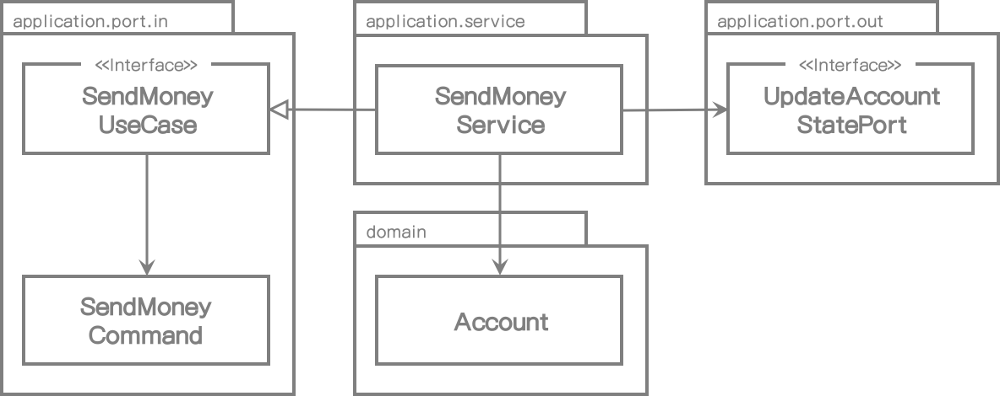
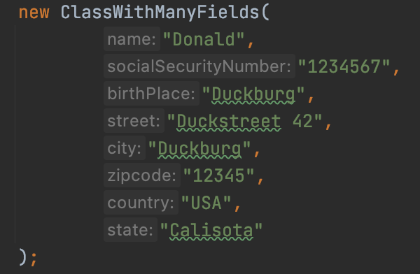

# 4. 유스케이스 구현

이제 실제 코드상으로 논의했던 아키텍처를 어떻게 나타낼 수 있는 지 한번 알아보자.

애플리케이션, 웹, 영속성 계층은 아키텍처와 느슨하게 결합되어 있어서 도메인 코드를 아주 자유롭게 모델링할 수 있다. DDD를 사용할 수도 있고 풍부(rich)하거나 빈약한(anemic) 도메인 모델을 구현할 수도 있고 또는 우리 만의 방법으로 개발할 수도 있다.

이 장에서는 이전에 소개한 헥사고날 아키텍처 스타일의 유스케이스를 구현하는 방법을 나타낸 것이다.

도메인 중심 아키텍처로 적합하기 때문에 도메인 엔터티 만드는 것부터 시작해서 그 주위에 유스케이스를 만들어 볼 것이다.


## 도메인 모델 구현하기

우리는 한 계좌에서 다른 계좌로 돈을 보내는 유스케이스를 구현할 것이다. 객체 지향 방식으로 모델링하는 방법 중 하나는 계좌에서 돈을 출금하며 대상 계좌로 입금할 수 있도록 입/출금용 **Account** 엔티티를 만드는 것이다.

```java
package buckpal.domain;

@AllArgsConstructor
@Getter
public class Account {
    private AccountId id;
    private Money baselineBalance;
    private ActivityWindow activityWindow;

    public Money calculateBalance() {
        return Money.add(
            this.baselineBalance,
            this.activityWindow.calculateBalance(this.id)
        );
    }

    public boolean withDraw(Money money, AccountId targetAccountId) {
        if (!mayWithDraw(money)) {
            return false;
        }

        Activity withDrawal = new Activity(
            this.id,
            this.id,
            targetAccountId,
            LocalDateTime.now(),
            money
        );
        this.activityWindow.addActivity(withDrawal);
        return true;
    }

    private boolean mayWithDraw(Money money) {
        return Money.add(
            this.calculateBalance(),
            money.negate()
        ).isPositive();
    }

    public boolean deposit(Money money, AccountId sourceAccountId) {
        Activity deposit = new Activity(
            this.id,
            sourceAccountId,
            this.id,
            LocalDateTime.now(),
            money
        );
        this.activityWindow.addActivity(deposit);
        return true;
    }
}

```

**Account** 엔티티는 실제 계좌의 현재 스냅샷 정보를 제공한다. 모든 출금과 입금은 **Activity** 엔티티에서 일어난다. 계좌의 모든 거래이력을 메모리로 가져오는 것은 좋은 방법이 아니기 때문에, **Account** 엔티티는 **ActivityWindow** 값 객체에 저장된 몇일 혹은 몇주의 이력만을 가져와야 한다.

현재 계좌 잔고를 계산하기 위해서 **Account** 엔티티는  **baselineBalance** 속성을 가지고 있다. 이는 ActivityWindow의 첫번째 이력 이전의 계좌 잔고를 나타낸다. 총 잔고는 모든 거래이력의 잔고를 합한 기본 잔고이다.

이 모델에서 계좌 간 출금 및 입금은 거래이력에 새 이력을 추가하는 것이고 이는 **withdraw()**와 **deposit()** 메서드에서 했던 것과 동일하다. 이제 출금하기 전에 계좌인출을 할 수 없는 규칙이 있는지 확인한다.

이제 출금 및 입금할 수 있는 **Account** 엔티티를 생성했으니 그 다음에 유스케이스를 만들어 갈 수 있다.


## 간단한 유스케이스

먼저, 유스케이스가 실제로 어떤 작업을 하는지 알아보자. 일반적으로 다음 단계를 거치게 된다.

1. 입력을 받는다.
2. 비즈니스 규칙을 확인한다.
3. 모델의 상태를 변경한다.
4. 결과를 리턴한다.

유스케이스는 입력 어댑터로부터 입력을 받는다. 내가 "입력값 검증" 단계를 왜 넣지 않았는지 의아해 할지도 모르겠다. 나는 유스케이스가 도메인 로직만 알고 있으면 되고 입력값 검증으로 그 순수성이 오염 되어서는 안된다고 생각한다. 그래서 입력값 검증은 나중에 따로 얘기할 예정이다.

그러나 유스케이스는 *비즈니스 규칙 검증*에 대한 책임은 있다. 이러한 책임은 도메인 엔티티와 서로 나눠서 가진다. 이 장 후반부에서 입력값 검증과 비즈니스 규칙 검증의 차이점에 대해서 살펴볼 것이다.

비즈니스 규칙이 준수되었다면 유스케이스는 입력값에 따라 모델 상태를 변경한다. 일반적으로 도메인 객체 상태를 변경할 것이며 이렇게 변경된 상태는 포트로 전달되어 영속성 어댑터가 그 상태를 저장하게 된다. 유스케이스는 또한 어떤 아웃바운드 어댑터도 호출할 수도 있다. 

마지막 단계는 아웃바운드 어댑터의 리턴값을 그것을 호출하는 어댑터의 출력 객체로 변환하는 것이다.

이런 단계를 숙지하고서 "Send Money" 유스케이스를 어떻게 구현할지 알아보자.

*1장(What's Wrong with Layers)*에서 논의한 넓은 범위를 가지는 서비스의 문제점을 피하기 위해서, 우리는 모든 유스케이스를 클래스 하나에 넣지 않고 각 유스케이스마다 개별 서비스 클래스로 사용할 것이다.

여기에 예제코드가 있다.

```java
@RequiredArgsConstructor
@Transactional
public class SendMoneyService implements SendMoneyUseCase {

    private final LoadAccountPort loadAccountPort;
    private final AccountLock accountLock;
    private final UpdateAccountStatePort updateAccountStatePort;

    @Override
    public boolean sendMoney(SendMoneyCommand command) {
        // TODO: validate business rules
        // TODO: manipuate model state
        // TODO: return output
    }
}
```

서비스는 인바운드 포트 인터페이스인 **SendMoneyUseCase**를 구현하고, 계좌정보를 가져오기 위해 아웃바운드 포트 인터페이스인 **LoadAccountPort**를 호출하며, 데이터베이스에 계좌 상태를 저장하기 위해 **UpdateAccountStatePort**를 호출한다. 다음 그림은 컴포넌트를 그래픽 개요로 나타낸 것이다.




[그림 4.1] 서비스는 유스케이스를 구현하고 도메인 모델을 수정한다. 그리고 수정된 상태를 저장하기 위해 아웃바운드 포트를 호출한다.


## 입력값 검증하기

이제 유스케이스 클래스의 책임이 아니라고 했던 입력값 검증에 대해 얘기해 보자. 하지만 나는 입력값 검증이 애플리케이션 계층에 있어야 한다고 아직도 생각한다. 그래서 여기서 그 이야기를 한번 해보자.

유스케이스 호출 전단계인 어댑터에서 입력값 검증을 왜 하지 말아야할까? 유스케이스에 필요한 모든 검증이 이미 됐다고 믿어서 일까? 또한, 유스케이스는 하나 이상의 어댑터에서 호출될 수 있어서 그 유효성 검증이 각 어댑터에서 구현되어야 할수도 있고 잘못 사용할 수도 있거나 검증하는 것을 잊어버릴 수도 있을 것이다.

애플리케이션 계층은 입력값 검증에 신경 써야 한다. 그렇지 않으면 애플리케이션 외부에서 잘못된 정보를 받을 수 있고 그로 인해 모델 상태에 심각한 문제를 유발할 수도 있다.

하지만 유스케이스 클래스가 하는 것이 아니라면 도대체 어디에서 입력값 검증을 해야 할까?

*입력 모델*을 만들어 그 일을 책임지게 할 것이다. "Send Money" 유스케이스에서 입력 모델은 이전 코드에서 봤던 "**SendMoneyCommand**" 클래스이다. 더 정확히 말하면, 생성자 내에서 검증을 체크할 것이다.

```java
@Getter
public class SendMoneyCommand {
		private final AccountId sourceAccountId;
		private final AccountId targetAccountId;
		private final Money money;

		public SendMoneyCommand(
				AccountId sourceAccountId,
				AccountId targetAccountId,
				Money money) {
      		this.sourceAccountId = sourceAccountId;
			 this.targetAccountId = targetAccountId;
			 this.money = money;
      		requireNonNull(sourceAccountId);
      		requireNonNull(targetAccountId);
      		requireNonNull(money);
      		requireGreaterThan(money, 0);
		}
	}
```

돈을 송금하기 위해서 보내는 사람과 받는 사람의 ID정보, 금액이 필요하다. 어떤 파라미터도 null이 되어서는 안되며 송금액도 0보다 커야 한다. 이런 조건이 위반될 때 생성자에서 예외를 던져서 객체 생성을 실패하게 만들면 된다.

**SendMoneyCommand** 필드를 final로 지정함으로써 그 객체를 사실상 불변 객체로 만든다. 그래서 일단 성공적으로 생성이 되면 유효한 상태이며 불안정한 상태로 변경될 수 없다고 확신할 수 있다.

**SendMoneyCommand**는 유스케이스 API의 일부분이기 때문에 인바운드 포트 패키지에 위치한다. 그래서 검증 작업은 애플리케이션 내부에 있지만 신성한 유스케이스 코드를 오염시키지는 않는다.

하지만 매번 유효성 확인작업을 직접 해야하는 걸까? Java 계열에서는 이런 작업의 표준방식으로 Bean Validation API(https://beanvalidation.org/)가 사용된다. 클래스 필드에 어노테이션을 붙여서 검증 규칙을 표현할 수 있다.

```java
class SendMoneyCommand extends SelfValidating<SendMoneyCommand> {

		@NotNull
		private final AccountId sourceAccountId;

		@NotNull
		private final AccountId targetAccountId;

		@NotNull
		private final Money money;

		public SendMoneyCommand(
				AccountId sourceAccountId,
				AccountId targetAccountId,
				Money money) {
			this.sourceAccountId = sourceAccountId;
			this.targetAccountId = targetAccountId;
			this.money = money;
			this.validateSelf();
		}
	}
```

**SelfValidating** 추상 클래스는 **validateSelf()** 메서드를 제공하고 생성자의 마지막 곳에서 호출한다. 이 클래스는 필드에 (이 경우는 **@NotNull**) Bean Validation 어노테이션을 검증하고 위반 시 예외를 던지게 된다. Bean Validation 방법이 유효성 검증에 필요한 정보를 명확하게 나타내지 못한다면 금액이 0보다 큰 값인지 확인했던 이전 방식처럼 여전히 그 검증작업을 직접 구현할 수도 있다. 

**SelfValidating**의 구현부는 다음과 같다.

```java
public abstract class SelfValidating<T> {

  private Validator validator;

  public SelfValidating() {
    ValidatorFactory factory = Validation.buildDefaultValidatorFactory();
    validator = factory.getValidator();
  }

  protected void validateSelf() {
    Set<ConstraintViolation<T>> violations = validator.validate((T) this);
    if (!violations.isEmpty()) {
      throw new ConstraintViolationException(violations);
    }
  }
}
```

유효성 검증을 입력 모델에 두어서 유스케이스 구현부를 사실상 반부패 계층(anti-corruption layer)으로 만들었다. 이것은 그 하위 계층을 호출하는 계층형 아키텍처에서의 계층이 아니라 호출자에게 잘못된 입력값을 내뱉는 유스케이스 주변의 얇은 보호막이다.


## 생성자의 위력

이전 입력 모델 **SendMoneyCommand**는 생성자 내에서 많은 책임을 가진다. 클래스가 불변성을 가지기 때문에 생성자의 인자들은 클래스 각 속성들의 파라미터를 포함한다. 또한 생성자는 파라미터를 검증하기 때문에 불안정한 상태의 객체 생성은 불가능하다.

우리 사례에서 생성자는 3개의 파라미터만 가지고 있다. 더 많은 파라미터가 필요하다면 어떻게 해야 할까? 좀 더 편리하게 사용하기 위해서 **Builder** 패턴을 사용할 수 있지 않을까? 긴 파라미터를 가지는 생성자를 private으로 만들고 그 호출을 **builder()** 메서드 안으로 숨길 수 있다. 20개 파라미터로 생성자를 호출하는 대신 이같이 객체를 만들 수도 있다.

```java
new SendMoneyCommandBuilder()
  	.sourceAccountId(new AccountId(41L))
  	.targetAccountId(new AccountId(42L))
  	// ... initialize many other fields
  	.build();
```

builder가 불안정한 상태의 객체를 만들 수 없으므로 여전히 생성자가 유효성 검증작업을 수행할 수 있다.

좋은 방법인 것 같지 않나? **SendMoneyCommandBuilder**에 또 다른 필드를 추가해야 하면(소프트웨어 프로젝트에서 여러번 발생하는) 어떤 일이 생길지 생각해보자. 생성자와 빌더에 새 필드를 추가한다. 그리고 나서 동료(혹은 전화, 이메일, 나비 등)는 우리가 코드에 집중하고 지속적으로 생각할 수 없게 방해한다. 잠시 휴식 후 다시 코드 작업하러 갔는데 *builder를 호출하는 코드에 새 필드를 추가하는 것을 까먹는다.*

불변 객체를 불완전한 상태로 생성할 때 컴파일러는 어떤 경고도 하지 않는다. 물론 파라미터를 빠트렸기 때문에 런타임(단위 테스트에서 발견 됬다면 더욱 다행이다)에서 검증 로직이 오류를 던질 것이다.

새 필드가 추가되거나 삭제될 때마다 builder 내부에 숨기지 않고 직접 생성자를 사용한다면 우리는 단지 코드 변경 시 표시되는 컴파일 에러만 확인하면 된다.

긴 파라미터 리스트는 보기 좋게 포맷팅 될 수도 있고 좋은 IDE의 경우 파라미터 이름에 대한 힌트도 제공해 준다.




[그림 4.2] IDE는 파라미터 목록에 힌트를 표시하여 빼먹지 않도록 도와준다.


## 유스케이스마다 다른 입력 모델

우리는 다른 유스케이스에서도 같은 입력 모델을 사용하는 경향이 있다. "계좌 등록"과 "계좌 정보 수정" 유스케이스를 생각해보자. 두개 모두 처음에는 동일 입력값, 즉 계좌 설명 같은 몇 개의 계좌 상세정보만 필요할 것이다.

둘의 차이점은 "계좌 정보 수정" 유스케이스의 경우에 특정 계좌를 수정할 수 있는 계좌 ID가 필요하다는 것이다. 그리고 "계좌 등록" 유스케이스는 계좌를 등록하기 위해 소유자의 ID가 필요할 수도 있다. 만일 양쪽 유스케이스에서 동일 입력 모델을 사용한다면 "계좌 정보 수정" 유스케이스에서는 계좌 ID에 대해 **null**을 허용해야 하고 "계좌 등록" 유스케이스에는 소유자 ID에 **null**을 허용해야 할 것이다.

불변 command 객체에서 **null**을 유효 상태로 허용하는 것은 그 자체만으로도 코드 스멜(code smell)이다. 더욱 중요한 것은 지금 입력값 검증을 어떻게 처리하고 있는가? 다른 쪽에서 필요없는 ID를 가져야 하기 때문에 등록과 수정 유스케이스에 대한 입력값 검증은 달라야 한다. 성스러운 비즈니스 코드를 입력값 검증으로 오염시키는 커스텀(custom) 입력값 검증 로직을 유스케이스 안에 만들어야 할 것이다.

또한 "계좌 등록" 유스케이스에서 계좌 ID 필드가 non-null 값이라면 어떻게 해야 하나? 에러를 던져야 하나? 그냥 무시할 수 있는가? 이것은 유지보수 엔지니어들이 코드를 볼 때 하는 질문들이다. (나중에 우리를 포함하여)

각 유스케이스 전용 입력 모델은 유스케이스를 더욱 명확하게 나타내고 예상하지 못한 부작용을 없애면서 다른 유스케이스들과 느슨하게 결합된다. 그러나 입력 데이터를 각 유스케이스마다 다른 입력 모델로 매핑해야 하므로 그만큼 비용이 드는 작업이다. *8장(Mapping between Boundaries)*에서 그 매핑 전략에 대해 알아볼 것이다.


## 비즈니스 규칙 유효성 검증

입력값 검증이 유스케이스 로직의 한 부분은 아니지만 비즈니스 규칙 검증은 유스케이스 로직의 한 부분이다. 비즈니스 규칙은 애플리케이션 내부에 있고 세심하게 처리되어야 한다. 그럼 언제 입력값 검증을 하고 언제 비즈니스 규칙 검증을 해야 할까?

이 두가지를 구분하는 실제적인 방법은 다음과 같다. 비즈니스 규칙 검증은 도메인 모델의 현재 상태 접근이 필요한 경우이고, 반면에 입력값 검증은 그렇지 않다. **@NotNull** 어노테이션에서 했던 것처럼, 입력값 검증은 선언적으로만 구현될 수도 있는 반면에 비즈니스 규칙은 더 많은 문맥이 필요하다.

입력값 검증은 구문상으로 검증하는 반면에 비즈니스 규칙 검증은 유스케이스 문맥상 의미적으로 검증한다.

"계좌는 초과 인출 되어서는 안된다"는 규칙을 한번 보자. 위의 정의에 따르면, 보내는 계좌와 받는 계좌가 존재하는지 확인할 때 모델의 현재 상태에 대한 접근이 필요하기 때문에 이것은 비즈니스 규칙이다.

반대로, "이체 금액은 0보다 커야 한다"라는 규칙은 모델에 접근 없이도 검증할 수 있으므로 입력값 검증으로 구현될 수 있다.

이런 구분 방식에 대해서는 논쟁의 여지가 많을 것이라고 생각된다. 이체 금액은 매우 중요해서 유효성 체크가 어떤 경우라도 비즈니스 규칙이어야 한다고 주장할 수도 있다.

그러나 위와 같이 구분하는 것은 우리가 검증 로직을 코드에 작성하고 나중에 그 코드의 위치를 찾을 때 도움이 된다. 유효성 검증이 현재 모델 상태로의 접근이 필요한가에 대한 단순한 답변이다. 규칙의 구현 위치를 정할 때도 도움이 되고 향후에 유지보수 엔지니어가 그 위치를 찾을 때도 도움이 된다.

그러면 비즈니스 규칙은 어떻게 구현하는 것일까?

"계좌는 초과 인출될 수 없다"라는 규칙에서 봤던 것처럼 가장 좋은 방법은 비즈니스 규칙을 도메인 엔티티 내부에 두는 것이다.

```java
package buckpal.domain;

public class Account {
  // ...
  public boolean withdraw(Money money, AccountId targetAccountId) {
		if (!mayWithdraw(money)) {
			return false;
		}
	    // ...
}
```

이런 식으로 규칙이 필요한 비즈니스 로직 바로 옆에 있기 때문에 비즈니스 규칙을 위치시키고 그 내용을 추론하기 쉽다.

도메인 엔티티 내에서 비즈니스 규칙을 검증하기가 쉽지 않다면 도메인 엔티티 작업 시작 전에 유스케이스 코드에서 할 수도 있다.

```java
@RequiredArgsConstructor
@Transactional
public class SendMoneyService implements SendMoneyUseCase {
  	// ...
  	@Override
  	public boolean sendMoney(SendMoneyCommand command) {
      	requireAccountExists(command.getSourceAccountId());
      	requireAccountExists(command.getTargetAccountId());
	  }
}
```

실제 입력값 검증을 하는 메서드를 호출하고 실패하는 경우에 전용 예외를 던진다. 사용자 측 어댑터는 오류메시지로 예외를 표시를 하거나 적당히 다른 방법으로 처리할 수 있다.

이전 예제에서 입력값 검증은 단순히 보내는 계좌와 받는 계좌가 데이터베이스에 있는지만 확인한다. 더욱 복잡한 비즈니스 규칙에서는 데이터베이스의 도메인 모델을 로딩하고 몇가지 상태를 체크해야 할지도 모른다. 게다가, "계좌는 초과 인출되어서는 안된다"라는 규칙에서 했던 것처럼 도메인 모델을 로딩해야 한다면 도메인 엔티티에서 비즈니스 규칙을 구현해야만 한다. 


## 풍부한 도메인 모델 vs 빈약한 도메인 모델

우리 아키텍처 스타일은 도메인 모델의 실제 구현 방법에 대해서는 어떤 것도 정해주지 않는다. 이 말은 우리 상황에 맞게 입맛대로 구현할 수 있어 좋기는 하지만 어떤 가이드도 없고 도움을 받을 수 없기 때문에 골치 아플 것이다.

DDD의 철학을 따르는 풍부한 도메인 모델을 구현하느냐, 빈약한 도메인 모델을 구현하느냐 하는 논의가 자주 생긴다. 둘 중 하나만을 선택하여 사용하지 않고 두가지 모두 우리 아키텍처에 어떻게 적용할 것이지 논의해보자.

많은 도메인 로직이 있는 풍부한 도메인 모델은 애플리케이션 내부 엔티티에서 구현하는 것이다. 엔티티는 상태변경을 위한 메서드를 제공하고 비즈니스 규칙에 따라 유효한 상태로만 변경된다. 이것은 전에 **Account** 엔터티 내에서 했던 방법이다.

이 시나리오에서 유스케이스 구현은 어디 있는가?

이 경우에서 유스케이스는 도메인 모델에 대한 진입점 처럼 처리된다. 유스케이스는 사용자의 의도만을 나타내며 실제 작업을 수행하는 도메인 엔티티를 호출하는 통합 메서드 호출로 변환된다. 많은 비즈니스 규칙이 유스케이스가 아닌 엔티티에 있다.

"Send Money" 유스케이스 서비스는 보내는 계좌와 받는 계좌 엔티티를 가져올 것이며 **withdraw()**, **deposit()** 메서드를 호출하여 데이타베이스에 기록한다. 실제 유스케이스에서는 계좌의 초과인출을 방지하기 위해 동시에 계좌 간 인출이 없는지 확인해야 하지만 우리는 단순하게 사용할 것이기 때문에 이런 비즈니스 규칙은 생략할 것이다.

빈약한 도메인 모델에서는 엔티티 그 자체는 매우 작다. 일반적으로 상태를 가진 필드와 필드를 읽고 변경하기 위한 getter, setter 메서드만을 가지고 있다. 어떠한 도메인 로직도 포함하지 않는다.

이 말은 도메인 로직이 유스케이스 클래스에서 구현된다는 것을 의미한다. 유스케이스는 비즈니스 규칙을 확인하고 엔티티 상태를 변경하며 데이터베이스로 저장하는 아웃바운드 포트로 전달하는 책임을 갖고 있다. "풍부함"이라는 의미가 엔티티 대신 유스케이스에서 사용된다.

두 가지 스타일과 그외 다른 스타일은 이 책에 논의된 아키텍처 접근법을 이용해 구현될 수 있다. 상황에 맞게 자유롭게 선택하면 된다.


## 유스케이스마다 다른 출력모델

유스케이스 작업을 완료하고 나서 호출자에게 어떻게 리턴해야 할까?

입력값에서 했던 것과 비슷한 방식으로 할 경우, 출력값이 특정 유스케이스에만 해당하는 경우라면 충분히 이점이 있다. 출력값은 오직 호출자가 동작하는데 필요한 데이터만을 포함해야만 한다.

이전 예제 "Send Money" 유스케이스 예제 코드에서 우리는 **boolean**을 리턴했다. 이것은 최소한의 정보이며 이 상황에서 리턴할 수 있는 가장 명백한 값이다.

호출자에게 수정된 **Account** 객체 전체를 리턴하고 싶을 수도 있다. 아마도 호출자는 계좌의 새 잔고에 관심 있을지도 모르겠다.

그러나 "Send Money" 유스케이스가 이 데이터를 리턴하고 싶을까? 호출자는 정말 그 데이터가 필요할까? 만약 그렇다면 다른 호출자에서 사용될 수 있는 데이터를 접근하는 전용 유스케이스를 만들어야 하지 않을까?

이 질문에 대한 정확한 답은 없다. 하지만 유스케이스는 가능한 명확하게 유지되도록 노력해야한다. 만일 잘 모르겠다면, 가능한 최소한의 정보만 리턴해라.

또한 유스케이스 간에 동일 출력 모델을 공유하면 유스케이스 간 결합도가 높아지는 경향이 있다. 유스케이스 중 하나의 출력 모델에서만 새 필드가 필요하다면 다른 유스케이스는 그 필드가 필요 없어도 처리해야만 한다. 모델을 공유하는 것은 결국 다양한 이유로 코드가 늘어날 수 있다. 단일 책임 원칙을 적용하고 모델을 개별로 유지하는 것은 유스케이스 간 결합도를 낮추는데 도움이 된다.

같은 이유로 출력 모델을 도메인 엔티티로 사용하고 싶을 수도 있다. 우리는 도메인 모델이 필요 이상의 이유로 변경되는 것을 원치 않는다. 하지만, 엔티티를 입/출력 모델로 사용하는 것에 대한 내용을 *11장(Tailing Shortcuts Consciously)*에서 논의해 볼 것이다. 


## 읽기 전용(read-only) 유스케이스는 어떻게 해야 할까?

이전에 우리는 모델 상태를 변경하는 유스케이스를 어떻게 구현하는지에 대해 살펴봤다. 읽기 전용일 경우 구현은 어떻게 할까?

UI는 계좌 잔고 표시를 해야한다고 가정해보자. 이를 위해 특정 유스케이스를 만들어야 할까?

이와 같이 읽기 전용 유스케이스를 얘기하는 것은 좀 어색한 면이 있다. 물론 UI에서 요청한 데이터는 "계좌 잔고 보기"라는 특정 유스케이스에서 구현할 필요가 있다. 이것이 프로젝트에서 필요한 유스케이스라면 다른 유스케이스와 동일하게 구현해야만 할 것이다.

하지만 애플리케이션 내부 관점에서 이것은 데이터에 대한 단순한 쿼리이다. 그래서 프로젝트에서 필요하지 않은 유스케이스라면 쿼리로서 구현하고 실제 유스케이스와 분리해 놓을 수 있다.

우리 아키텍처 스타일 내에서 할 수 있는 방법 중 하나는 쿼리에 대한 전용 입력 포트를 만들고 "query service"에서 구현하는 것이다.

```java
@RequiredArgsConstructor
class GetAccountBalanceService implements GetAccountBalanceQuery {

	private final LoadAccountPort loadAccountPort;

	@Override
	public Money getAccountBalance(AccountId accountId) {
		return loadAccountPort.loadAccount(accountId, LocalDateTime.now())
				.calculateBalance();
	}
}
```

query service는 유스케이스와 동일하게 동작한다. **GetAccountBalanceQuery**인 인바운드 포트를 구현하고 데이터베이스 데이터를 실제로 로딩하기 위해 **LoadAccountPort**인 아웃바운드 포트를 호출한다.

이런 식으로 읽기 전용(read-only) 쿼리는 코드상에서 유스케이스를 수정하는 경우와 명백히 구분된다. 이것은 CQS(Command-Query Separation)와 CQRS(Command-Query Responsibility Segregation) 같은 개념과 잘 맞아 떨어진다.

이전 코드에서 서비스는 아웃바운드 포트로 쿼리를 전달하는 것 외에 어떤 작업도 하지 않는다. 우리가 계층간에 동일 모델을 사용한다면 임시방편으로 처리할 수도 있고 클라이언트가 직접 아웃바운드 포트를 호출하게 할 수도 있다. *11장(Talking Shortcuts Consciously)*에서 이 임시방편으로 처리하는 것에 대해 이야기할 것이다.


## 유지보수하기 좋은 소프트웨어 개발에 어떤 도움이 되는가?

우리 아키텍처는 우리에게 맞는 도메인 로직을 구현할 수 있게 한다. 하지만 유스케이스의 입/출력 모델을 개별적으로 모델링한다면 예상치 못한 부작용을 피할 수 있다.

그렇다. 유스케이스 사이에 모델을 공유하지 않는 것이다. 각 유스케이스에는 개별 모델을 사용해야 하고 이 모델과 엔티티를 매핑해야 한다.

그러나 유스케이스별 개별 모델 사용은 유스케이스에 대한 명확한 이해를 필요로 하지만 결국 유지보수를 용이하게 한다. 또한 많은 개발자들이 다른 개발자의 영향없이 병렬로 유스케이스 작업을 할 수 있게 된다.

엄격한 입력값 검증과 함께 유스케이스별 전용 입/출력 모델을 사용하는 것은 유지보수가 용이한 코드로 가는 길을 만들어 준다.


