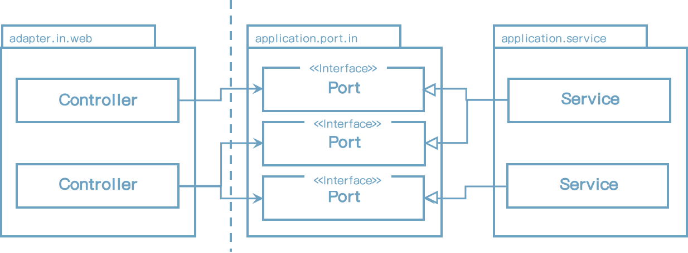
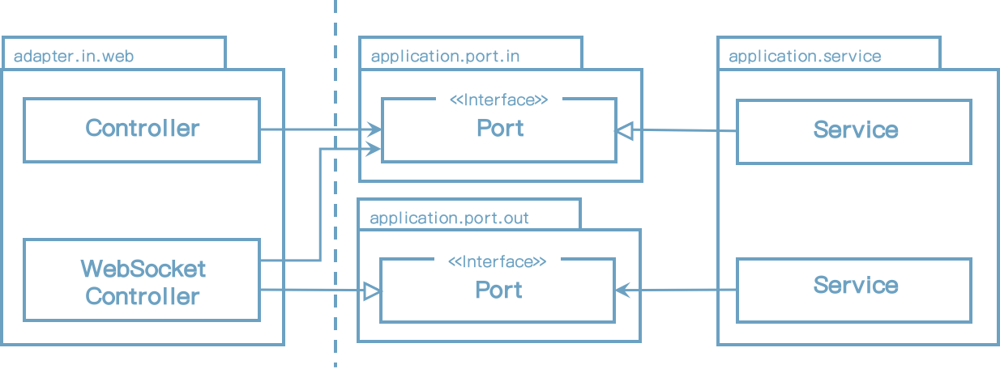

# 5 웹 어댑터 구현하기

오늘날 대부분 애플리케이션은 몇 가지 웹 인터페이스가 있다. (웹 브라우저로 상호 작용하는 UI 혹은 다른 시스템에서 우리 애플리케이션을 호출하는 HTTP API)

우리의 목표 아키텍처에서는, 외부 세계와의 모든 통신은 어댑터를 통한다. 웹 인터페이스를 제공하는 어댑터 구현 방법에 대해 논의해보자.


## 의존성 역전(Dependency Inversion)

다음은 우리가 논의하기에 적절하게 표시된 웹 어댑터의 아키텍처 요소들을 확대하여 나타낸 그림이다 - 어댑터와 애플리케이션 내부와 통신하는 포트들




[그림 5.1] 입력 어댑터는 애플리케이션 서비스에서 구현되는 전용 입력 포트를 통해 애플리케이션 계층과 통신한다.


웹 어댑터는 "영향을 주는(driving)" 혹은 "들어오는(incoming)" 어댑터이다. 외부로부터 요청을 받고 변환한 후 애플리케이션 내부를 호출한다. 제어 흐름은 웹 어댑터 컨트롤러로 부터 애플리케이션 계층 서비스로 향한다.

애플리케이션 계층은 웹 어댑터가 통신할 수 있는 특정 포트를 제공한다. 서비스는 이 포트를 구현하고 이 포트를 호출할 수 있는 웹 어댑터를 구현한다.

좀 더 가깝게 보면, **의존성 역전 원칙(Dependency Inversion Principle)**이 적용된 것을 확인할 수 있다. 제어 흐름이 왼쪽에서 오른쪽으로 향하기 때문에 웹 어댑터가 유스케이스를 직접 호출할 수 있다.


[그림 5.2] 포트 인터페이스를 삭제하고 서비스를 직접 호출할 수 있다.


그러면, 어댑터와 유스케이스를 우회하는 또 다른 계층을 왜 추가해야할까? 그 이유는 포트가 외부 세계와 애플리케이션 내부가 통신할 수 있는 곳이기 때문이다. 포트를 배치함으로써, 외부 세계와 어떤 통신이 일어나는 지 정확히 알 수 있고 이는 레거시 코드작업을 하는 유지보수 엔지니어에게 귀중한 정보이다.

이와 같은 이야기를 하자면, *11장(Taking Shortcuts Consciously)*에서 이야기 할 <u>Shortcuts</u> 중 하나는, 내부 포트를 두고 애플리케이션 서비스를 직접 호출하도록 하는 것이다.

그러나, 매우 인터렉티브(interactive)한 애플리케이션에 어느 것이 적절한가 하는 질문이 아직 남아있다. 웹소켓으로 웹브라우저로 실시간 데이터를 보내는 애플리케이션을 생각해봐라. <u>애플리케이션 내부가 이런 실시간 데이터를 어떻게 사용자 웹브라우저로 보내는 웹어댑터로 전송할까?</u>

이 시나리오에서는 분명 포트가 필요하다. 아래 그림에서 묘사된 것처럼, 이 포트는 웹 어댑터에서 구현되어야 하고 애플리케이션 내부에서 호출되어야 한다.




[그림 5.3] 애플리케이션이 웹 어댑터에게 알려야 한다면, 직접 의존을 가지는 외부 포트를 통해서 해야 한다.


기술적으로 말하면, 이는 외부 포트가 될 것이며 웹 어댑터가 내/외부 어댑터가 된다. 동일한 어댑터가 동시에 양쪽에 있을 수 없다는 이유는 없다.

이 장 남은 부분에서, 대부분의 경우에 웹 어댑터가 내부 어댑터라고 가정할 것이다.


## 웹 어댑터의 책임

웹 어댑터가 실제로 무슨 일을 하는가? BuckPal 애플리케이션에 REST API가 필요하다고 해보자. 웹 어댑터의 책임은 어디에서 시작하여 어디서 끝나는가?

웹 어댑터는 일반적으로 이런 일들을 한다.

1. HTTP 요청을 java 객체로 매핑한다.
2. 인증 확인
3. 입력값 검증
4. 입력값을 유스케이스의 입력 모델로 매핑
5. 유스케이스 호출
6. 유스케이스의 출력값을 HTTP로 매핑
7. HTTP 응답값을 리턴

우선, 웹 어댑터는 특정 URL 경로, HTTP method, content-Type와 같은 어떤 기준을 충족하는 HTTP 요청을 받아야 한다. HTTP 요청에 맞는 파라미터와 내용은 동작할 수 있는 객체로 역직렬화되어야 한다.

일반적으로, 이후 웹 어댑터는 인증, 인가 확인을 하고 실패 시 오류를 리턴한다.

그리고 나서, 내부 객체 상태가 검증될 수 있다. 하지만, 유스케이스 입력 모델에 책임 있는 입력값 검증에 대해서는 이미 논의하지 않았는가? 그렇다. 유스케이스의 입력 모델은 유스케이스 상황에서 유효한 입력값만을 허용해야 한다. 그러나 여기에서는, 웹 어댑터의 입력모델에 대해서 이야기 하고 있다. 유스케이스와는 완전히 다른 구조와 의므를 가질 지도 몰라서, 다른 검증방식으로 사용해야 할 수도 있다.

나는 유스케이스 입력 모델에서 이미 했던 방식을 웹 어댑터에서 동일하게 하고 싶지는 않다. 대신, 우리는 *웹 어댑터 입력 모델을 유스케이스의 입력 모델로 변환할 수 있는지* 확인해야 한다. 이 변환 작업이 안되면 모두 유효성 에러이다.

웹 어댑터의 다음 책임을 알아볼 차례다: 변환된 입력 모델로 유스케이스를 호출하는 것. 그 후 어댑터는 유스케이스 출력을 받고 HTTP로 직렬화하여 호출자에게 전송한다.

진행 중 문제가 생겨 예외가 발생되면, 웹 어댑터는 에러를 메시지로 변환하고 호출자에게 전송한다.

웹 어댑터에는 많은 책임이 있다. 그러나 애플리케이션 계층이 관심가져서는 안될 많은 책임이 있다. HTTP와 관련된 어떤 것도 애플리케이션 계층에 노출되어서는 안된다. 애플리케이션 내부가 외부에서 HTTP를 사용한다는 것을 안다면, HTTP를 사용하지 않는 다른 내부 어댑터가 동일한 도메인 로직을 사용할 수 없을 것이다. 좋은 아키텍처에서는, 선택의 여지를 항상 열어둬야 한다.

웹 계층 대신 도메인과 애플리케이션 계층 개발부터 시작한다면, 이러한 웹 어댑터와 애플리케이션 계층의 경계는 자연적으로 따라온다는 것을 명심해라. 내부 어댑터를 생각하지 않고서 유스케이스를 먼저 구현한다면 그 경계를 불분명하게 하지 않을 것이다.


## 컨트롤러 분할하기

Java 계열의 Spring MVC와 같은 대부분 웹 프레임워크에서, 이전에 논의한 책임을 수행하는 controller 클래스를 만든다. 그럼, 애플리케이션에 모든 요청을 처리하는 단일 controller를 만들까? 반드시 그렇게 할 필요는 없다. 웹 어댑터는 분명 한개 이상의 클래스로 구성될 수 있다.

그러나, *3장(Organizing Code)*에서 논의한 대로, 이 클래스들을 동일 부류라고 나타내는 동일한 패키지 구조에 놓아야 한다는 것을 신경써야 한다.

그럼 몇개의 컨트롤러를 만들까? 나는 너무 적은것 보다 오히려 너무 많은게 낫다라고 생각한다. 각 컨트롤러는 가능한 좁은 범위를 가지고 다른 컨트롤러와의 공유를 최소화 하는 분할된 웹 어댑터를 구현한다는 것을 명확히 해야 한다.

BuckPal 애플리케이션 내의 account 엔티티 동작을 한번 보자. 일반적인 접근 방법은 계좌와 관련된 모든 요청을 받는 단일 **AccountController** 만드는 것이다. REST API를 제공하는 Spring Controller는 다음 코드의 형태가 된다.

```java
package buckpal.adapter.web;

@RestController
@RequiredArgsConstructor
class AccountController {
	private final GetAccountBalanceQuery getAccountBalanceQuery;
    private final ListAccountsQuery listAccountsQuery;
    private final LoadAccountQuery loadAccountQuery;
  
    private final SendMoneyUseCase sendMoneyUseCase;
    private final CreateAccountUseCase createAccountUseCase;
   
    @GetMapping("/accounts")
    List<AccountResource> listAccounts() {
        
    }
  
    @GetMapping("/accounts/id")
    AccountResource getAccount(@PathVariable("accountId") Long accoutId) {
        ...
    }
  
    @GetMapping("/accounts/{id}/balance")
    long getAccountBalance(@PathVariable("accountId") Long accoutId) {
        ...
    }
  
    @PostMapping("/accounts")
    AccountResource createAccount(@RequestBody AccountResource accout) {
        ...
    }
  
    @PostMapping("/accounts/send/{sourceAccountId}/{targetAccountId}/{amount}")
    void sendMoney(
        @PathVariable("sourceAccountId") Long sourceAccountId,
        @PathVariable("targetAccountId") Long targetAccountId,
        @PathVariable("amount") Long amount,
    ) {
     	... 
    }
}
```

account 리소스의 모든 것이 단일 클래스에 있다. 좋아 보이기는 하지만 이 접근법의 단점을 알아보자.

우선, 클래스당 코드량이 적을수록 좋다. 나는 30,000 코드 라인의 대규모 클래스를 가진 레거시 프로젝트를 경험했다. 그건 실제로 단일 클래스에 30,000 라인을 만들게 한 의도적인 아키텍처 결정사항이었다: 재 배포하지 않고, .class 파일로 Java 바이트코드를 업로드 하여, 런타임 시 시스템을 변경하기 위한 것. 오직 한개 파일만 업로드 할 수 있었고 이 파일이 모든 코드를 가지고 있었던 것이었다.

웃을 일이 아니다. 시간이 지남에 따라 컨트롤러가 200라인 이상 늘어날지라도, 50 라인 이상 되면 이해하기 어려우진다. 심지어 메서드 단위로 잘 쪼개졌더라도 말이다.

이러한 논쟁은 테스트 코드에서도 해당된다. 컨트롤러에 많은 코드가 있다면 테스트 코드도 많을 것이다. 그리고 테스트 코드는 더 추상화되는 경향이 있기 때문에 운영 코드보다 이해하기가 더 어렵다. 우리는 작은 클래스에서 찾기 쉬운 운영코드의 테스트를 만들고 싶어 한다. 

그러나 마찬가지로 중요한 것은, 데이타 구조 재사용을 유발하는 단일 컨트롤러로 모든 동작을 넣어두는 것이다. 이전 코드 예에서, 많은 동작은 **AccountResource** 모델 클래스와 공유한다. 어떤 동작에 필요한 <u>양둥이</u> 처럼 처리한다. **AccountResource**는 아마도 **id** 필드가 있다. **생성(create)**에서는 필요가 없어서 아마 더 헷갈리게 할 것이다. **Account**가 **User** 객체와 일대다 관계를 가진다고 생각해보라. 예약을 생성하거나 수정할 때 그런 **User** 객체를 포함해야 할까? users는 **list** 오퍼레이션에서 리턴할까? 이것은 단순한 예이지만 규모가 큰 프로젝트에서는 몇가지 의문점을 가질 것이다.

그래서 잠재적으로는, 각 동작별 컨트롤러를 분리하여 개별 패키지에 생성하는 접근법을 선호한다. 또한 메서드와 클래스의 이름을 유스케이스에 유사하게 만들어야 한다. 

```java
@RestController
@RequiredArgsConstructor
class SendMoneyController {

	private final SendMoneyUseCase sendMoneyUseCase;

	@PostMapping(path = "/accounts/send/{sourceAccountId}/{targetAccountId}/{amount}")
	void sendMoney(
			@PathVariable("sourceAccountId") Long sourceAccountId,
			@PathVariable("targetAccountId") Long targetAccountId,
			@PathVariable("amount") Long amount) {

		SendMoneyCommand command = new SendMoneyCommand(
				new AccountId(sourceAccountId),
				new AccountId(targetAccountId),
				Money.of(amount));

		sendMoneyUseCase.sendMoney(command);
	}

}

```

또한, 각 컨트롤러는 **CreateAccountResource** 혹은 **UpdateAccountResource** 같이 각각의 모델을 가지고 있거나, 이전 예와 같이 입력값으로 기본형(primitive) 데이터를 사용할 수도 있다.

그러한 전용 모델 클래스는 다른 곳에서 재사용이 할 수 없게 컨트롤러 패키지에 private이 될 수도 있다. 컨트롤러는 여전히 모델을 공유할지도 모르지만, 다른 패키지와 공유 클래스를 사용하는 것은 더 많은 고민이 필요하고, 아마도, 필드의 반은 필요없다는 것을 알아채고, 결국 새로 만들것 이다.

또한, 컨트롤러와 서비스의 이름에 대해서 열심히 생각해보자. 예를 들어, **CreateAccount** 대신에 **RegisterAccount**가 더 좋은 이름이 아닐까? BuckPal 애플리케이션에서 계좌 생성하는 방법은 사용자가 등록하는 것이다. 클래스에서 "register"라는 단어가 이 의미를 전달하는데 더 좋은 단어이다. 유스케이스를 충분히 나타내는 **Create...**, **Update...**, **Delete...**와 같이 사용되는 케이스가 있지만 실제 사용하기 전에 두번 더 생각해보야 할지도 모르겠다.

이렇게 분리함으로써 얻는 혜택은 다른 작업과 병렬로 진행할 수 있게 한다. 만일 두명 개발자가 작업한다면 우리는 병합-머지를 원하지 않는다.


## How Does This Help Me Build Maintainable Software?

애플리케이션의 웹 어댑터 만들때, HTTP를 애플리케이션 유스케이스의 메소드 호출로 변환하고 그 결과를 HTTP로 변환하고 어떠한 도메인 로직을 실행하지 않는 어댑터를 만들고 있다는 것을 명심해야 한다.

반면, 애플리케이션 계층은 HTTP를 사용해서는 안되므로 HTTP 세부사항을 노출해서는 안된다. 이것은 필요 시 웹 어댑터가 다른 어댑터로 교체될 수 있게 해준다.

웹 컨트롤러를 분리할 때, 모델을 공유하지 않는 너무 많은 클래스를 만들지 않을까 걱정할 필요 없다. 이해 및 테스트, 병렬 작업이 쉽다. 처음 시작할 때 컨트롤러 분리작업이 더 많은 일이 될 수 있지만, 유지보수 동안 그 효과가 나타날 것이다.


