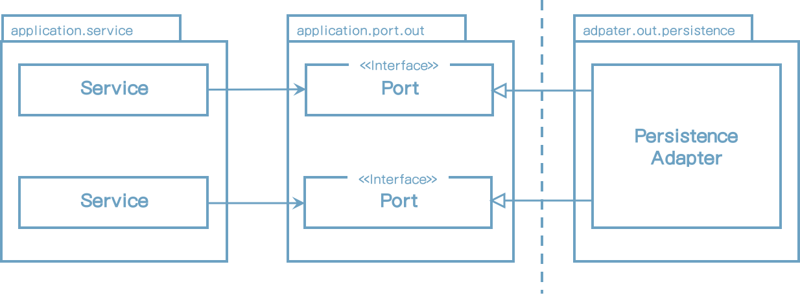
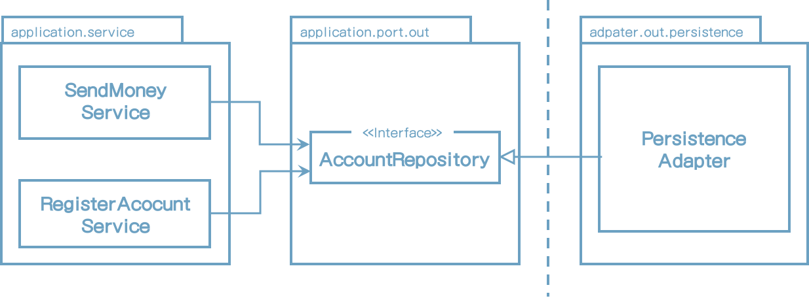
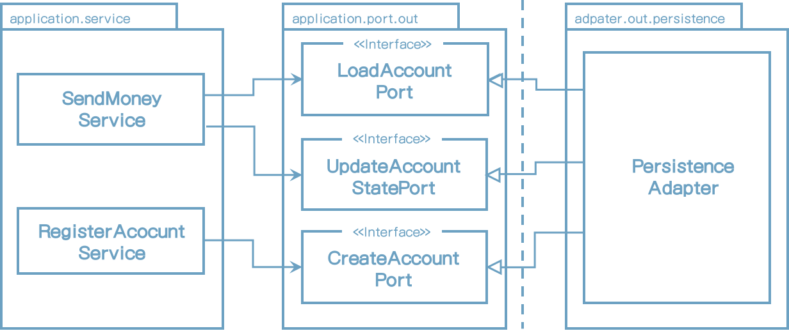
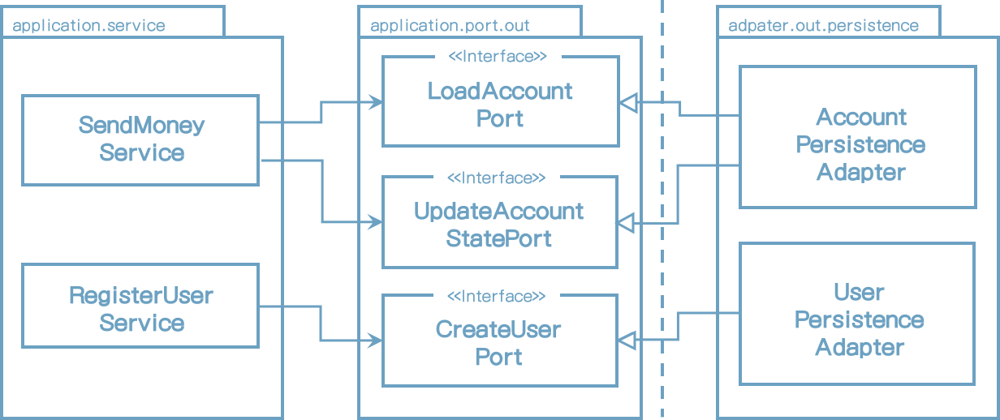
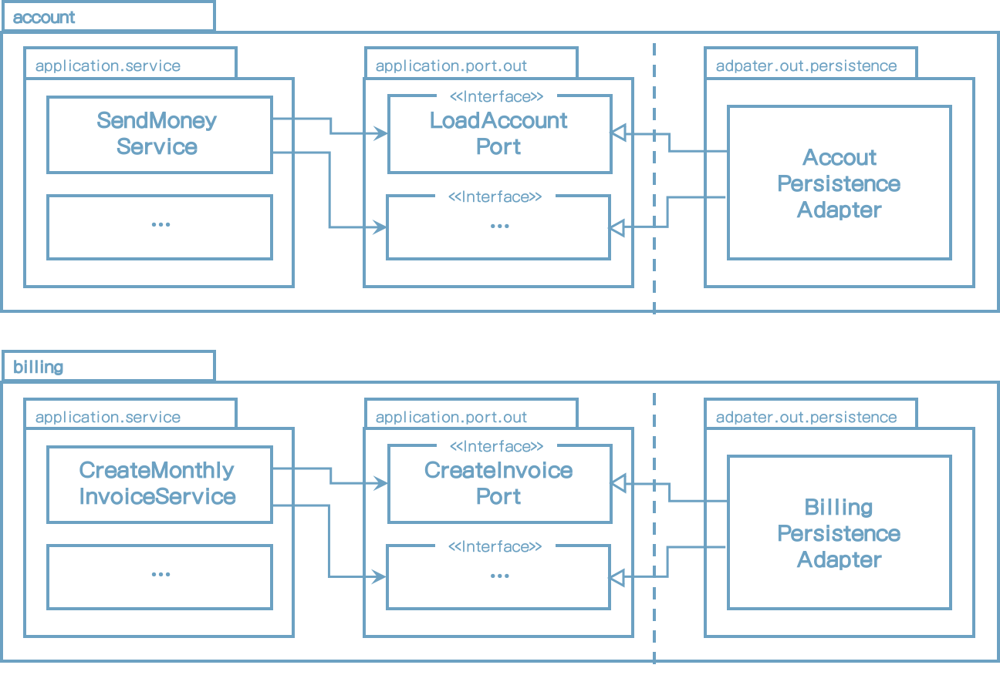

# 6 Implementing a Persistence Adapter

1장(What's Wrong with Layers)에서 전통적인 레이어방식에 대한 문제점을 이야기했고 결국에는 영속성 계층에 의존하기 때문에 데이타 주도 설계라고 주장했다. 이 장에서 영속성 레이어에 대해 의존성을 역전시키기 위한 애플리케이션 레이어에 플러그인하는 방식에 대해서 살펴볼 것이다.


## Dependency Inversion

영속성 레이이어 대신 애플리케이션 서비스에 영속성 기능을 제공하는 영속성 어댑터에 대해 이야기해볼 것이다.

다음 그림은 의존성 역전 원칙을 어떻게 적용하는지 보여준다.



[그림 6.1] 코어의 서비스들은 영속성 어댑터에 접근하기 위해 포트를 사용한다.

애플리케이션 서비스는 영속성 기능에 접근하기 위해 포트 인터페이스를 호출한다. 이러한 포트는 실제 영속성 작업을 하는 영속성 어댑터 클래스에서 구현되고 데이터베이스와 통신에 대한 책임이 있다.

헥사고날 아키텍처 용어에서는 영속성 어댑터는 "driven" 혹은 외부 어댑터이다. 왜나하면 애플리케이션에서 호출되고 그 반대로는 사용되지 않기 때문이다.

포트는 애플리케이션 서비스와 영속성 코드 사이의 간접 계층이다. 영속성 문제에 대해 생각하지 않고 도메인 코드를 변화시킬 수 있도록 간접 계층을 추가했다는 것을 다시 상기시켜보자. 이는 영속성 코드에 대한 의존성이 없다는 것을 의미한다. 영속성 코드를 리팩토링 하는 것은 코어에 코드를 반드시 변경할 필요가 없을 것이다.

런타임 시 애플리케이션 코어에서 영속성 어댑터로의 의존성은 가지고 있을 것이다. 영속성 레이어에 코드를 변경하고 버그가 생긴다면 여전히 애플리케이션 코어에 기능이 동작하지 않을 것이다. 하지만 포트의 명세가 충족이 되기만 하면 코어에 영향을 주지 않고 자유롭게 영속성 어댑터에 원하는 대로 할 수 있다.


## The Responsibilities of a Persistence Adapter

영속성 어댑터가 일반적으로 어떤 일을 하는지 한번 보자.

1. 입력을 받는다.
2. 입력을 데이터베이스 형식으로 매핑한다.
3. 입력을 데이터베이스로 보낸다.
4. 데이터베이스 결과를 애플리케이션 형식으로 매핑한다.
5. 결과값을 리턴한다.

영속성 어댑터는 포트 인터페이스를 통해 입력을 받는다. 입력 모델은 도메인 엔티티일 수도 있거나 인터페이스에서 명시된 특정 데이터베이스 전용 객체일 수도 있다.

그리고 나서 입력 모델을 데이터베이스를 수정 및 조회할 수 있는 형식으로 매핑한다. 자바 프로젝트에서는 데이터베이스와 통신하기 위해 Java Persistence API(JPA)를 사용한다. 그래서 입력값을 JPA 엔티티 객체에 매핑하여 데이터베이스 테이블 구조에 반영한다. 컨텍스트에 따라 입력 모델을 JPA 엔티티에 매핑하는 것은 많은 양의 일이 필요할지도 모른다. 그래서 8장(Mapping between Boundaries)에서 매핑하지 않는 전략에 대해 이야기해 볼 것이다.

JPA나 다른 객체-관계 매핑 프레임워크를 사용하지 않고 데이터베이스와 통신하는데 다른 기술을 사용할 수도 있다. 입력 모델을 단순 SQL 문장으로 변환하고 데이터베이스에 보낼 수도 있고 파일 형식으로 변환할 수도 있다.

중요한 부분은 

영속성 어댑터의 입력 모델은 코어 내부에 있지 영속성 어댑터에 있지 않아서 영속성 어댑터의 변화는 코어에 영향을 주지 않는다.

다음으로 영속성 어댑터는 데이터베이스를 쿼리하고 결과를 받는다.

마지막으로 데이터베이스 응답을 포트와 그 리턴값으로 출력 모델로 매핑한다.다시 출력 모델이 애플리케이션 중심에 있고 영속성 어댑터에 있지 않는다는 것은 중요하다.

입력과 출력 모델이 영속성 어댑터가 아닌 애플리케이션 중심에 심다는 사실과는 별개로, 그 책임을 전통적인 영속성 레이어의 것들과는 실제로 다르다.

그러나 이전에 나타낸대로 영속성 어댑터를 구현하는 것은 전통적인 영속성 레이어를 구현할 때 물어볼 지도 모르는 몇가지 의문을 제기할 것이다. 왜나하면 전통적인 방식에서는 그렇게 생각하지 않았기 때문이다.


## Slicing Port Interfaces

서비스 구현할때 생각나는 하나의 의문점은 애플리케이션 코어에서만 사용가능한 데이터베이스 동작을 정의하는 포트 인터페이스를 세분화하는 방법이다.

다음 그림에서 나타낸대로, 특정 엔티티의 데이터베이스 동작을 제공하는 단일 리포지토리 인터페이스를 만드는 것이 일반적인 관행이다.




[그림 6.2] 단일 외부 포트 인터페이스로의 모든 데이터베이스 오퍼레이션을 집중하는 것은 모든 서비스가 필요하지 않는 메서드를 의존하기 한다.

데이터베이스 오퍼레이션에 의존하는 각 서비스는 인터페이스의 단일 메소드만을 사용하더라도 단일 포트 인터페이스를 의존할 것이다. 이것은 코드 상 불필요한 의존관계를 가진다는 것을 의미한다.

필요하지 않는 메소드에 의존한다는 것은 코드를 이해하고 테스트를 어렵게 하게 한다. RegisterAccountService에 대한 단위 테스트를 만든다고 생각해보자. AccountRepository 인터페이스의 어느 메소드를 mock으로 생성해야 할까? AccountRepository의 어느 메소드를 서비스가 호출한다고 해야 할까? 인터페이스의 일부분은 mocking했다면 다음 사람이 테스트작업을 할때 다른 문제를 유발할 수도 있다. 그래서 몇가지 자료를 찾아봐야 할 것이다.

로버트 C.마틴의 말을 인용하자면

> 불필요한 것에 의존하는 것은 기대하지 않은 문제를 유발할 수도 있다.

인터페이스 분리 원칙은 이 문제에 대한 해답을 준다. 넓은 범위의 인터페이스는 필요한 것에만 참조하게 나눠져야 한다라고 말한다.

이것을 외부포트에 적용한다면 다음 그림과 같이 나타날 것이다.



[그림 6.3] 인터페이스 분리 원칙 적용은 불필요한 의존성을 제거하고 기존 의존성을 더욱 명확하게 한다.

이제 각 서비스는 실제로 필요한 메소드만 의존한다. 더욱 더 좋은 것은 포트의 이름에 무슨 일을 하는지 명확하게 말해준다. 테스트 코드에서는 포트 당 하나의 메소드만 가지기 때문에 어느 메소드를 mock해야 할지 알 필요가 없다. 

이 같이 포트범위를 좁힘으로써 프러그 앤 플레이 코드스타일로 만든다. 서비스와 작업할 때 필요할 때 포트를 플러그한다. 

물론 "포트 당 하나의 메소드" 접근법은 모든 환경에서 적용하지는 못할 것이다. 데이터베이스 오퍼레이션은 응집도가 높아서 단일 인터페이스로 묶어서 사용될지도 모른다.


## Slicing Persistence Adapters

이전 그림에서 모든 영속성 포트를 구현하는 단일 영속성 어댑터를 보았다. 그러나 영속성 포트가 구현될 때 한 클래스 이상 만들지 못하게 하는 규칙은 없다.

다음 그림에서 나타난것처럼, 예를 들어 영속성 오퍼레이션(DDD에서 aggregate)을 필요로 하는 도메인 클래스당 하나의 영속성 어댑터를 구현할지도 모른다.




[그림 6.4]  각 애그리게이트 당 여러개의 영속성 어댑터를 만들수도 있다.

이런식으로 영속성 어댑터는 자동으로 영속성 기능을 제공하는 도메인의 경계선을 따라 분리된다.

예를 들어 JPA나 다른 OR 매퍼와 성능향상을 위한 단순한 SQL을 사용하여 다른 포트를 사용하여 여러개의 영속성 포트를 구현할 때 영속성 어댑터를 더 많은 클래스로 분리할 수도 있다. 영속성 포트의 서브셋을 구현하는 하나의 JPA 어댑터와 하나의 SQL 어댑터를 만들 수도 있다.

도메인 코드가 영속성 포트에 정의된 명세를 수행하는 클래스에 대해 알지 못한다는 것을 명심해라. 모든 포트가 구현되는 한 영속성 레이어를 자유롭게 만들 수 있다.

"애그리거트당 하나의 영속성 어댑터" 접근법은 향후 많은 바운디드 컨텍스트에 영속성 요건을 분리하는데는 좋은 기본이 된다. 얼마 후에 빌링 유스케이스에 책임이 있는 바운디드 컨텍스트를 확인한다. 다음 그림은 이 시나리에 대한 설명을 제공해준다.




[그림 6.5] 바운디드 컨텍스트 사이에 엄격한 경계를 만들고 싶다면, 각 바운디드 컨텍스트는 자신의 영속성 어댑터를 가져야 한다.

각 바운디드 컨텍스트는 자신의 영속성 어댑터(전에 이야기한대로 하나 이상일 수도 있다)를 가진다. "바운디드 컨텍스트"라는 용어는 경계를 의미하고 이는 account 서비스가 billing 컨텍스트의 영속성 어댑터에 접근할 수 있다는 것을 의미한다. (그 반대로도 동일) 하나의 컨텍스트가 다른 컨테스트로 접근이 필요하면 전용 입력포트를 통해 접근할 수 있다.


## Example with Spring Data JPA

이전 그림의 AccountPersistentAdapter를 구현하는 코드 예제를 한번 보자. 이 어댑터는 account를 데이터베이스로 저장 및 조회를 해야 한다. 4장(Implementing a Use Case)의 Account 엔티티에서 봤다. 여기는 참고를 위한 코드이다.

```java
@AllArgsConstructor(access = AccessLevel.PRIVATE)
public class Account {
	@Getter private final AccountId id;
	@Getter private final ActivityWindow activityWindow;
	private final Money baselineBalance;

    public static Account withoutId(
					Money baselineBalance,
					ActivityWindow activityWindow) {
		return new Account(null, baselineBalance, activityWindow);
	}
  
    public static Account withId(
					AccountId accountId,
					Money baselineBalance,
					ActivityWindow activityWindow) {
		return new Account(
				accountId,
				baselineBalance, activityWindow);
	}
  
    public Money calculateBalance() {
      	// ...
    }
  
    public boolean withdraw(Money money, AccountId targetAccountId) {
      	// ...
    }
  
    private boolean mayWithdraw(Money money) {
      	// ...
    }
```

Account 클래스가 getter와 setter만을 가진 단순 데이터가 아니고 대신 가능한 immutable로 만드는 것을 명심하라. Account 엔티티를 유효한 상태로 만드는 팩토리 메소드를 제공하고 모든 메소드는 인출 전 계좌 잔고 체크와 같은 유효성 체크를 수행하여 유효하지 않은 도메인 모델을 만들지 못하게 한다.

우리는 데이터베이스와 통신하는데 Spring Data JPA를 사용할 것이므로 계좌의 데이터베이스 상태를 나타내는 @Entity 어노테이션 클래스가 필요하다.

```java
@Entity
@Table(name = "account")
@Data
@AllArgsConstructor
@NoArgsConstructor
class AccountJpaEntity {

	@Id
	@GeneratedValue
	private Long id;

}
```

activity 테이블에 대한 코드 블럭

```java
@Entity
@Table(name = "activity")
@Data
@AllArgsConstructor
@NoArgsConstructor
class ActivityJpaEntity {

	@Id
	@GeneratedValue
	private Long id;

	@Column
	private LocalDateTime timestamp;

	@Column
	private Long ownerAccountId;

	@Column
	private Long sourceAccountId;

	@Column
	private Long targetAccountId;

	@Column
	private Long amount;

}

```

계좌 상태는 이 단계에서는 단순히 ID로 구성되어 있다. 나중에 사용자 ID 같은 추가적인 필드가 추가될 수도 있다. 더욱 흥미로운건 특정 계좌의 모든 활동을 포함하는 ActivityJpaEntity이다. ActivityJpaEntity를 연결관계를 표시하기 위해 JPA의 @ManyToOne 혹은 @OneToMany 어노테이션을 이용해 연결할 수도 있다. 그러나 지금은 데이터베이스 쿼리의 부작용이 있을지도 모르지만 이렇게 남겨뒀다. 사실 이 단계에서 영속성 어댑터를 구현하는데 JPA보다는 단순 ORM을 사용하는 것이 더 쉬울지도 모르겠다. 그러나 향후에 필요할 때 사용할 것이다.

익숙한 코드인가? 이런 문제를 위해 사람들이 사용하는 방식이므로 OR 매퍼로써 JPA를 선택한다. 개발 2달 후에 eager와 lazy 로딩, 캐쉬같은 것을 사용할 수도 있다. JPA는 아주 좋은 도구이지만 많은 문제에 있어서 단순한 해결책이 더 단순할수 있을 것이다.

다음으로 데이터베이스의 특정 활동을 가져오기 위한 쿼리 뿐만 아니라 기본 CRUD 기능을 제공하는 리포지토리 인터페이스를 생성하기 위해 Spring Data를 사용한다. 

```java
interface AccountRepository extends JpaRepository<AccountJpaEntity, Long>  {
}
```

ActivityRepository 코드이다.

```java
interface ActivityRepository extends JpaRepository<ActivityJpaEntity, Long> {

	@Query("select a from ActivityJpaEntity a " +
			"where a.ownerAccountId = :ownerAccountId " +
			"and a.timestamp >= :since")
	List<ActivityJpaEntity> findByOwnerSince(
			@Param("ownerAccountId") Long ownerAccountId,
			@Param("since") LocalDateTime since);

	@Query("select sum(a.amount) from ActivityJpaEntity a " +
			"where a.targetAccountId = :accountId " +
			"and a.ownerAccountId = :accountId " +
			"and a.timestamp < :until")
	Long getDepositBalanceUntil(
			@Param("accountId") Long accountId,
			@Param("until") LocalDateTime until);

	@Query("select sum(a.amount) from ActivityJpaEntity a " +
			"where a.sourceAccountId = :accountId " +
			"and a.ownerAccountId = :accountId " +
			"and a.timestamp < :until")
	Long getWithdrawalBalanceUntil(
			@Param("accountId") Long accountId,
			@Param("until") LocalDateTime until);

}
```

Spring Boot는 자동으로 이 리포지토리를 찾고 Spring Data는 실제 데이터베이스와 통신하는 리포지토리 인터페이스의 구현체를 마법처럼 제공한다.

이제 JPA 엔터티와 리포지토리를 만들었고 애플리케이션의 영속성 기능을 제공하는 영속성 어댑터를 구현할 수 있다.

```java
@RequiredArgsConstructor
@PersistenceAdapter
class AccountPersistenceAdapter implements
		LoadAccountPort,
		UpdateAccountStatePort {

	private final AccountRepository accountRepository;
	private final ActivityRepository activityRepository;
	private final AccountMapper accountMapper;

	@Override
	public Account loadAccount(
					AccountId accountId,
					LocalDateTime baselineDate) {

		AccountJpaEntity account =
				accountRepository.findById(accountId.getValue())
						.orElseThrow(EntityNotFoundException::new);

		List<ActivityJpaEntity> activities =
				activityRepository.findByOwnerSince(
						accountId.getValue(),
						baselineDate);

		Long withdrawalBalance = orZero(activityRepository
				.getWithdrawalBalanceUntil(
						accountId.getValue(),
						baselineDate));

		Long depositBalance = orZero(activityRepository
				.getDepositBalanceUntil(
						accountId.getValue(),
						baselineDate));

		return accountMapper.mapToDomainEntity(
				account,
				activities,
				withdrawalBalance,
				depositBalance);

	}

	private Long orZero(Long value){
		return value == null ? 0L : value;
	}


	@Override
	public void updateActivities(Account account) {
		for (Activity activity : account.getActivityWindow().getActivities()) {
			if (activity.getId() == null) {
				activityRepository.save(accountMapper.mapToJpaEntity(activity));
			}
		}
	}

}
```

영속성 어댑터는 애플리케이션에서 필요한 두개의 포트를 구현한다. (LoadAccountPort, UpdateAccountStatePort)

데이터베이스로 부터 계좌정보를 요청하기 위해 AccountRepository로 부터 로드하고 ActivityRepository를 통해 특정 시간의 계좌 활동 정보를 로드한다.

유효한 상태의 Account 도메인 엔티티를 생성하기 위해 이러한 활동상태의 시작전의 잔고가 필요하고 데이터베이스로 부터 계좌의 인출 및 예금의 합을 가져온다. 마지막으로 모든 데이터를 Account 도메인 엔티티로 매핑하고 호출자에게 리턴한다.

계좌 상태를 업데이트하기 위해서 모든 Account 엔티티의 활동을 반복하고 ID가 있는지 확인한다.  만일 없다면 ActivityRepository를 통해 저장되는 새로운 활동이다.

이전 시나리오에서 나타냈듯이, Account와 Activity 도메인 모델, AccountJpaEntity와 ActivityJpaEntity 데이터베이스 모델 사이에는 양방향 관계가 있다. <u>Why make the effort of mapping back and forth?</u> Account와 Activity 클래스의 JPA 어노테이션을 데이터베이스 엔티티로써 직접 저장하게 할 수도 있지 않을까?

"매핑 없는" 전략이 좋은 선택일 수도 있다. 매핑 전략에 대해서는 8장(Mapping between Boundaries)에서 볼것이다. 그러나 JPA는 도메인 모델에서 타협안을 제시해준다. 예를 들어, JPA는 기본 생성자를 가져야 한다. 그렇지 않으면 영속성 레이어에서 @ManyToOne 관계는 성능 관점에서는 의미가 있지만 도메인 모델에서 이런 관계는 매번 데이터를 로드하기 때문에 반대방향으로 관계를 원할지도 모른다.

그래서, 영속성을 강조하지 않고 풍부한 도메인 모델을 사용하기 위해서 도메인 모델과 영속성 모델 사이를 매핑해야만 할 것이다.


## What about Database Transactions?

데이터베이스 트랜잭션 주제에 대해서는 아직 다루지 않았다. 트랜잭션 경계를 어디에다 둘까?

트랜잭션은 특정 유스케이스에서 수행될 수 있는 쓰기 오퍼레이션을 하나라도 실패하는 경우 롤백될 수 있도록 데이터베이스로 확장한다.

영속성 레이어는 다른 데이터베이스 오퍼레이션이 동일한 유스케이스인지 모르기 때문에 트랜잭션을 열과 닫아야 하는지 알수 없다. 이 책임을 영속성 어댑터 호출을 통합하는 서비스로 위임해야 한다.

java와 스프링에서 할 수있는 가장 쉬운 방법은 애플리케이션 서비스 클래스에 @Transactional 어노테이션을 붙여서 트랜잭션을 모두 public 메소드로 덮어 쓰는 것이다.

```java
package buckpal.application.service;

@Transactional
public class SendMoneyService implements SendMoneyUseCase {
  	...
}
```

서비스가 순수하게 유지하고 @Transactional 어노테이션으로 오염되지 않게 하기 위해서는 관점 지향 프로그래밍을 사용할 수 있다. (예를 들어 ApsectJ)


## How Does This Help Me Build Maintainable Software?

도메인 코드에 플러그인 처럼 영속성 어댑터를 만드는 것은 도메인 코드를 영속성의 세부사항으로 부터 자유롭게 하여 풍부한 도메인 모델을 만들수 있게 한다.

좁은 범위의 포트 인터페이스를 사용하여 이런 식의 하나의 포트와 다른 포트를 구현할 수 있는 유연성을 가지게 된다. <u>혹은 애플리케이션이 알지 못하는 다른 영속성 기술.</u> 포트 명세가 준수되는 한 완전한 영속성 레이어로 전환할 수 있다.


