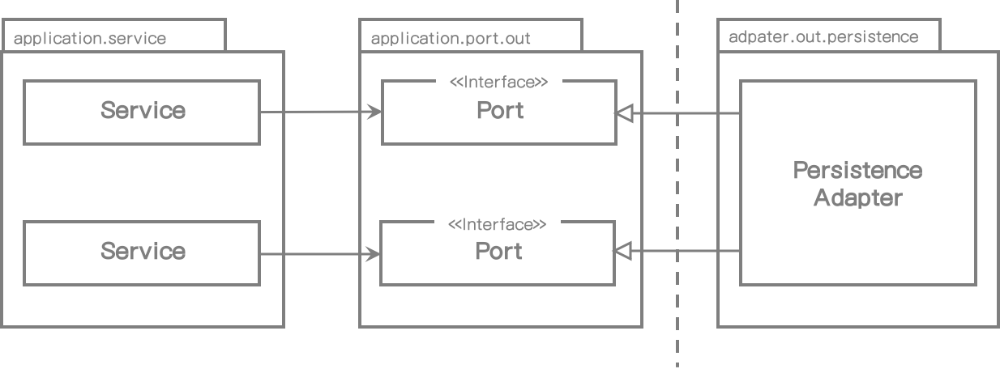
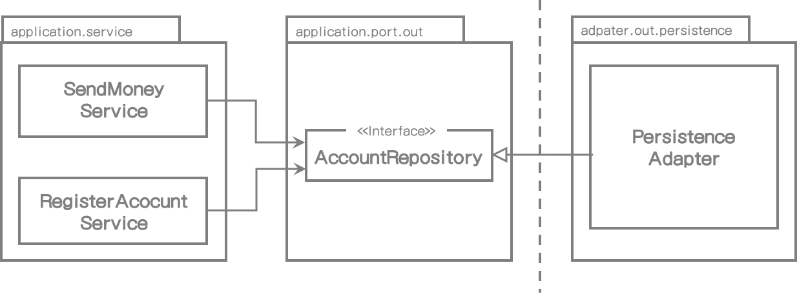
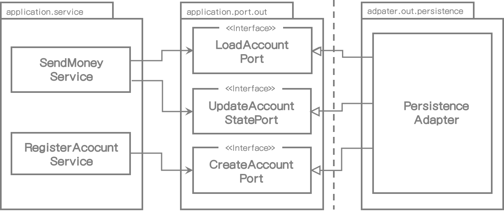
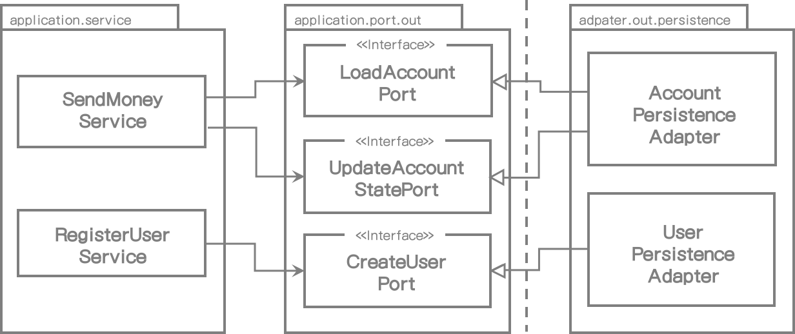
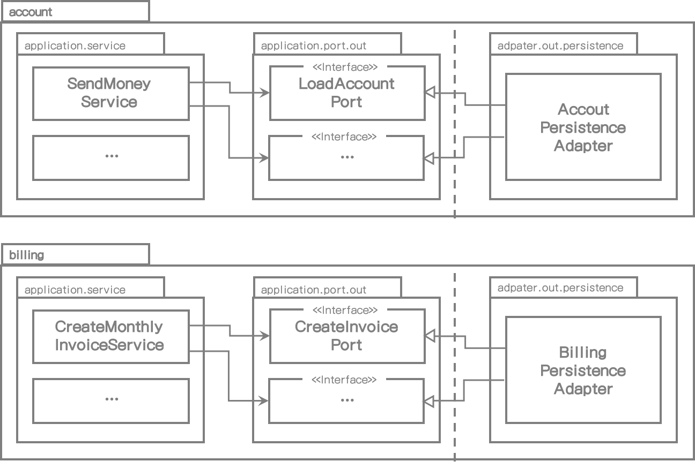

# 6. 영속성 어댑터 구현

*1장(What's Wrong with Layers)*에서 전통적인 계층형 구조의 문제점을 이야기했고 결국 모든 것이 영속성 계층에 의존하기 때문에 "데이터베이스 주도 설계"를 유도한다고 했다. 이번 장에서는 영속성 계층의 의존성을 역전시켜서 애플리케이션 계층으로 플러그인하는 방식에 대한 내용을 살펴볼 것이다.


## 의존성 역전하기

영속성 계층을 대신하여 애플리케이션 서비스에 영속성 기능을 제공해주는 영속성 어댑터에 대한 이야기를 해보자.

다음 그림은 의존성 역전 원칙을 어떻게 적용할 수 있는지 나타낸다.




[그림 6.1] 내부 서비스들은 영속성 어댑터에 접근하기 위해 포트를 사용한다.


애플리케이션 서비스는 영속성 기능을 사용하기 위해 포트 인터페이스를 호출한다. 이러한 포트들은 영속성 어댑터에서 구현되고 그 어댑터에서 실제 영속성 작업 및 데이터베이스 통신에 대한 책임을 갖는다.

헥사고날 아키텍처 용어로 영속성 어댑터는 "영향 받는(driven)" 혹은 "나가는(outgoing)" 어댑터이다. 왜냐하면 애플리케이션에서 호출되고 그 반대로는 사용되지 않기 때문이다.

포트는 애플리케이션 서비스와 영속성 코드 사이의 중간 계층이다. 영속성 코드 변경에 영향받지 않게 도메인 코드를 수정할 수 있도록 중간 계층을 추가했다는 것을 다시 생각해보자. 이 말은 영속성 코드로 의존성이 없다는 것을 의미한다. 영속성 코드를 리팩토링 하는 일은 내부 코드의 변경을 항상 유발하지는 않는다.

런타임 시에는 자연적으로 애플리케이션 내부에서 영속성 어댑터로의 의존성은 가질 것이다. 영속성 계층에 코드를 변경하고 버그가 생긴다면 여전히 애플리케이션 내부 기능은 동작하지 않을 것이다. 하지만 포트의 명세가 충족 되기만 하면 내부에 영향을 주지 않고 영속성 어댑터에서 우리가 원하는 것을 자유롭게 할 수 있다.


## 영속성 어댑터의 책임

영속성 어댑터가 일반적으로 어떤 일을 하는지 한번 보자.

1. 입력을 받는다.
2. 입력을 데이터베이스 포맷으로 매핑한다.
3. 입력을 데이터베이스로 보낸다.
4. 데이터베이스 출력을 애플리케이션 포맷으로 매핑한다.
5. 출력을 리턴한다.

영속성 어댑터는 포트 인터페이스를 통해 입력 받는다. 입력 모델은 도메인 엔티티일 수도 있고 인터페이스에서 명시된 특정 데이터베이스 전용 객체일 수도 있다.

그 후에 입력 모델을 데이터베이스 수정 및 조회할 수 있는 포맷으로 매핑한다. Java 프로젝트에서는 데이터베이스 작업에 Java Persistence API(JPA)를 일반적으로 사용한다. 그래서 입력값을 JPA 엔티티 객체에 매핑하여 데이터베이스 테이블 구조에 반영한다. 상황에 따라서는 입력 모델을 JPA 엔티티로 매핑하는 것이 작업 대비 효과가 적을 지도 모른다. 그래서 *8장(Mapping between Boundaries)*에서 매핑하지 않는 전략에 대해서도 이야기해 볼 것이다.

JPA나 다른 객체-관계 매핑 프레임워크를 사용하지 않고 데이터베이스 작업에 다른 기술을 사용할 수도 있다. 입력 모델을 단순 SQL 구문으로 변환하여 데이터베이스에 이 구문을 보내거나 혹은 입력 데이터를 파일로 직렬화하고 다시 읽어 들일 수도 있다.

중요한 것은 영속성 어댑터로 보내는 입력 모델이 영속성 어댑터가 아닌 애플리케이션 내부에 존재하기 때문에 영속성 어댑터의 변경사항이 애플리케이션 내부에 영향을 미치지는 않는다는 점이다.

다음으로 영속성 어댑터는 데이터베이스를 쿼리하고 그 결과를 받는다.

마지막으로 데이터베이스 응답을 포트 형식에 맞는 출력 모델로 매핑하고 리턴한다. 다시 말하지만, 출력 모델이 애플리케이션 내부에 있고 영속성 어댑터 내에 있지 않는다는 것도 중요한 내용이다.

입/출력 모델이 영속성 어댑터가 아닌 애플리케이션 내부에 있다는 사실을 제외하고는, 그 책임은 전통적인 영속성 계층의 책임과 동일하다.

하지만 전통적인 방식에서는 너무 익숙해서 구현할 때 물어보지도 않겠지만 영속성 어댑터 구현할 때 몇가지 의문을 제기할 것이다.


## 포트 인터페이스 분리하기

서비스 구현할때 하나의 의문점은 애플리케이션 내부에 데이터베이스 동작을 정의하는 포트 인터페이스를 어떻게 나누는가 이다.

다음 그림처럼 특정 엔티티의 모든 데이터베이스 동작을 제공하는 단일 리포지토리 인터페이스로 만드는 것이 일반적인 관행이다.




[그림 6.2] 하나의 아웃바운드 포트 인터페이스로 모든 데이터베이스 동작을 하는 것은 모든 서비스가 필요하지 않는 메서드를 의존하게 한다.


데이터베이스 동작에 의존하는 서비스는 "넓은 범위"를 가지는 단일 포트 인터페이스를 의존할 것이다. 심지어 인터페이스 중 하나의 메서드만 사용할지라도 의존한다. 이것은 코드 상 불필요한 의존관계를 의미한다.

불필요한 메서드로의 의존은 코드를 이해하고 테스트하기 어렵게 한다. 이전 그림에서 **RegisterAccountService**의 단위 테스트를 만든다고 생각해보자. **AccountRepository** 인터페이스에서 어느 메서드를 목으로 생성해야 할까? 서비스가 실제 호출하는 메서드를 **AccountRepository**에서 찾아야 한다. 만일 인터페이스의 일부분만 목으로 생성했다면 다음 사람은 그 인터페이스 전체가 목으로 생성되었다고 생각하고 테스트 작업을 하지만 실제로는 에러가 생길 수 있기 때문에 문제가 발생할 수 있다. 그래서 그들은 (다시) 코드를 봐야 할 것이다.

Robert C. Martin의 말을 인용하자면:

> *불필요한 것에 의존하는 것은 기대하지 않은 문제를 유발할 수도 있다.*


인터페이스 분리 원칙이 이러한 문제에 대한 해답을 알려준다. 넓은 범위의 인터페이스는 클라이언트가 필요한 메서드만 알 수 있게 나눠져야 한다라고 말한다.

이 내용을 아웃바운드 포트에 적용하면 다음 그림과 같이 나타날 것이다:




[그림 6.3] 인터페이스 분리 원칙 적용은 불필요한 의존성을 제거하고 현재 의존성을 더욱 명확하게 한다.


이제 각 서비스는 실제로 필요한 메서드만 의존한다. 게다가 포트 이름에서 무슨 일을 하는지 명확하게 알 수 있다. 테스트에서 포트 당 하나의 메서드만 가지기 때문에 어느 메서드를 목으로 만들어야 할지 더 이상 고민할 필요가 없다.

이와 같이 포트 범위를 좁힘으로써 코딩방식을 플러그 앤 플레이(plug-and-play) 스타일로 만들어준다. 우리는 서비스를 작업할 때 필요한 포트를 "플러그 인"하기만 하면 된다.

물론 "포트 당 메서드 하나" 접근법이 모든 환경에서 다 적용되는 것은 아니다. 응집도가 너무 높고 자주 같이 사용되어서 단일 인터페이스로 묶고 싶은 데이타베이스 동작이 있을 수도 있다.


## 영속성 어댑터 나누기

이전 그림에서 모든 영속성 포트를 구현하는 하나의 영속성 어댑터를 봤다. 그러나 영속성 포트를 구현할 때 클래스를 하나 이상 만들지 못하는 규칙은 없다.

예를 들어 다음 그림에 나타난대로 영속성 동작(DDD에서 aggregate)이 필요한 도메인 클래스당 하나의 영속성 어댑터를 구현하는 방법을 선택할 수도 있다. 




[그림 6.4]  각 애그리게이트 당 하나씩, 여러 개의 영속성 어댑터를 만들 수도 있다.


이런 식으로 영속성 어댑터는 영속성 기능을 지원하는 도메인의 경계에 맞게 자동으로 분리된다.

예를 들어 JPA나 다른 OR-매퍼를 사용하여 2-3개의 영속성 포트를 구현하고 성능 향상을 위해 단순 SQL을 사용하여 포트를 구현할 때, 영속성 어댑터를 더 많은 클래스로 분리할 지도 모른다. 그리고 나서 영속성 포트의 각 서브셋을 구현하는 하나의 JPA 어댑터와 하나의 단순 SQL 어댑터를 만들 수도 있다.

도메인 코드는 어느 클래스가 영속성 포트를 구현하는지에 대해서는 관심이 없다는 것을 기억해라. 모든 포트가 구현되기만 하면 영속성 계층 내에서는 우리가 원하는 대로 만들 수 있다.

"애그리거트당 하나의 영속성 어댑터" 접근법은 향후 많은 바운디드 컨텍스트에서 영속성 요건을 구분하는 좋은 기초지식이 된다. 얼마 후에 우리는 빌링(billing) 유스케이스에 책임이 있는 바운디드 컨텍스트를 확인한다. 다음 그림은 이 시나리오의 개요를 나타낸다.




[그림 6.5] 바운디드 컨텍스트 사이의 경계를 명확히 나누고 싶다면, 각 바운디드 컨텍스트는 자신만의 영속성 어댑터를 가져야 한다.


각 바운디드 컨텍스트는 자신의 영속성 어댑터(혹은 하나 이상)를 가진다. "바운디드 컨텍스트"라는 용어는 경계를 의미하고, 이는 **account** 서비스가 **billing** 컨텍스트의 영속성 어댑터 그리고 그 반대로 접근하지 못한다는 것을 의미한다. 컨텍스트에서 다른 컨텍스트로 접근이 필요하면 전용 인바운드 포트를 통해 접근할 수 있다.


## Spring Data JPA 예제

이전 그림의 **AccountPersistentAdapter**를 구현하는 코드 예제를 보자. 이 어댑터는 계좌를 데이터베이스로 저장 및 조회를 해야 할 것이다. 우리는 *4장(Implementing a Use Case)*에서 **Account** 엔티티를 살펴보긴 했지만 여기에서는 참고를 위한 코드 골격 정도만 보자.

```java
package buckpal.domain;

@AllArgsConstructor(access = AccessLevel.PRIVATE)
public class Account {
	@Getter private final AccountId id;
	@Getter private final ActivityWindow activityWindow;
	private final Money baselineBalance;

    public static Account withoutId(
					Money baselineBalance,
					ActivityWindow activityWindow) {
		return new Account(null, baselineBalance, activityWindow);
	}
  
    public static Account withId(
					AccountId accountId,
					Money baselineBalance,
					ActivityWindow activityWindow) {
		return new Account(
				accountId,
				baselineBalance, activityWindow);
	}
  
    public Money calculateBalance() {
      	// ...
    }
  
    public boolean withdraw(Money money, AccountId targetAccountId) {
      	// ...
    }
  
    private boolean mayWithdraw(Money money) {
      	// ...
    }
```

**Account** 클래스가 getter와 setter만을 가진 단순 데이터 클래스는 아니고 가능한 불변으로 만든다는 것을 명심하라. **Account** 엔티티를 유효한 상태로 만들 수 있는 팩토리 메서드를 제공하고, 인출 전 계좌 잔고 확인과 같은 검증을 수행하는 메소드를 제공하여 불완전한 상태의 도메인 모델을 생성할 수 없게 한다.

우리는 데이터베이스 작업에 Spring Data JPA를 사용할 것이어서 계좌에 데이터베이스 상태를 나타내는 **@Entity** 어노테이션이 표시된 클래스가 필요하다.

```java
package buckpal.adapter.persistence;

@Entity
@Table(name = "account")
@Data
@AllArgsConstructor
@NoArgsConstructor
class AccountJpaEntity {

	@Id
	@GeneratedValue
	private Long id;

}
```

**activity** 테이블의 코드 블럭:

```java
package buckpal.adapter.persistence;

@Entity
@Table(name = "activity")
@Data
@AllArgsConstructor
@NoArgsConstructor
class ActivityJpaEntity {

	@Id
	@GeneratedValue
	private Long id;

	@Column
	private LocalDateTime timestamp;

	@Column
	private Long ownerAccountId;

	@Column
	private Long sourceAccountId;

	@Column
	private Long targetAccountId;

	@Column
	private Long amount;

}

```

이 단계에서 계좌 상태는 단순히 ID로만 구성되어 있다. 나중에 사용자 ID 같은 필드가 추가될 수도 있다. 더욱 흥미로운 것은 특정 계좌의 모든 활동 내역을 담고 있는 **ActivityJpaEntity**이다. 연관관계 표시를 위해 JPA의 **@ManyToOne** 혹은 **@OneToMany** 어노테이션을 이용해 **ActivityJpaEntity** 를 **AccountJpaEntity**와 연결할 수도 있지만 데이터베이스 쿼리의 부작용이 생길 수 있기 때문에 지금은 제외하기로 했다. 사실 이 단계에서 영속성 어댑터를 구현하는데 JPA보다는 단순 ORM을 사용하는 것이 더 쉬울지도 모르겠다. 하지만 나중에 언젠가는 필요할 것이라 생각되서 지금 JPA를 사용할 것이다.

여러분에게 익숙한 코드인가? 이런 문제점들을 해결하고자 사람들이 사용하는 것이기 때문에 OR 매퍼로 JPA를 선택한다. 개발 두달 후에, eager와 lazy loading, caching 기능에 대한 불만을 이야기하고 좀 더 단순한 방식으로 사용하고 싶어한다. JPA는 아주 훌륭한 툴이다. 하지만 많은 문제들 때문에 더 단순한 방법이 더 쉬울 수도 있다.

다음으로 데이터베이스에서 활동 내역을 가져오기 위한 커스텀 쿼리 뿐만 아니라 기본 CRUD를 제공하는 리포지토리 인터페이스 생성을 위해 Spring Data를 사용한다. 

```java
interface AccountRepository extends JpaRepository<AccountJpaEntity, Long>  {
}
```

여기는 ActivityRepository 코드이다.

```java
interface ActivityRepository extends JpaRepository<ActivityJpaEntity, Long> {

	@Query("select a from ActivityJpaEntity a " +
			"where a.ownerAccountId = :ownerAccountId " +
			"and a.timestamp >= :since")
	List<ActivityJpaEntity> findByOwnerSince(
			@Param("ownerAccountId") Long ownerAccountId,
			@Param("since") LocalDateTime since);

	@Query("select sum(a.amount) from ActivityJpaEntity a " +
			"where a.targetAccountId = :accountId " +
			"and a.ownerAccountId = :accountId " +
			"and a.timestamp < :until")
	Long getDepositBalanceUntil(
			@Param("accountId") Long accountId,
			@Param("until") LocalDateTime until);

	@Query("select sum(a.amount) from ActivityJpaEntity a " +
			"where a.sourceAccountId = :accountId " +
			"and a.ownerAccountId = :accountId " +
			"and a.timestamp < :until")
	Long getWithdrawalBalanceUntil(
			@Param("accountId") Long accountId,
			@Param("until") LocalDateTime until);

}
```

Spring Boot는 자동으로 이 리포지토리를 찾고 Spring Data는 실제 데이터베이스와 통신하는 리포지토리 인터페이스의 구현체를 마치 마법처럼 제공한다.

이제 JPA 엔터티와 리포지토리를 만들었고 애플리케이션에 영속성 기능을 제공하는 영속성 어댑터를 구현할 수 있다.

```java
@RequiredArgsConstructor
@PersistenceAdapter
class AccountPersistenceAdapter implements
		LoadAccountPort,
		UpdateAccountStatePort {

	private final AccountRepository accountRepository;
	private final ActivityRepository activityRepository;
	private final AccountMapper accountMapper;

	@Override
	public Account loadAccount(
					AccountId accountId,
					LocalDateTime baselineDate) {

		AccountJpaEntity account =
				accountRepository.findById(accountId.getValue())
						.orElseThrow(EntityNotFoundException::new);

		List<ActivityJpaEntity> activities =
				activityRepository.findByOwnerSince(
						accountId.getValue(),
						baselineDate);

		Long withdrawalBalance = orZero(activityRepository
				.getWithdrawalBalanceUntil(
						accountId.getValue(),
						baselineDate));

		Long depositBalance = orZero(activityRepository
				.getDepositBalanceUntil(
						accountId.getValue(),
						baselineDate));

		return accountMapper.mapToDomainEntity(
				account,
				activities,
				withdrawalBalance,
				depositBalance);

	}

	private Long orZero(Long value){
		return value == null ? 0L : value;
	}


	@Override
	public void updateActivities(Account account) {
		for (Activity activity : account.getActivityWindow().getActivities()) {
			if (activity.getId() == null) {
				activityRepository.save(accountMapper.mapToJpaEntity(activity));
			}
		}
	}

}
```

영속성 어댑터는 애플리케이션이 필요로 하는 두 개의 포트를 구현한다. (**LoadAccountPort**와 **UpdateAccountStatePort**)

데이터베이스에서 계좌정보를 가져오기 위해 우리는 **AccountRepository**에서 로드하고 **ActivityRepository** 에서 특정 시간의 계좌 활동 정보를 로드한다.

유효한 상태의 **Account** 도메인 엔티티를 생성하기 위해, 활동내역 시작 전에 계좌에 있던 잔고가 필요하고, 그리고 나서 데이터베이스에서 계좌의 인출 및 입금의 총합을 가져온다. 마지막으로 이런 모든 데이터를 **Account** 도메인 엔티티로 매핑하고 호출자에게 리턴한다.

계좌 상태를 업데이트하기 위해서 모든 **Account** 엔티티의 활동 내역을 반복하고 ID가 있는지 확인한다. 만일 없다면 이는 **ActivityRepository**를 통해 저장되는 새로운 활동이력인 것이다.

이전 시나리오에서 나타냈듯이, **Account**와 **Activity** 도메인 모델, 그리고 **AccountJpaEntity**와 **ActivityJpaEntity** 데이터베이스 모델 사이에는 양방향 관계가 있다. 왜 양쪽에 모두 매핑을 하는 걸까? **Account**와 **Activity** 클래스만 JPA 어노테이션을 지정하고 데이터베이스 엔티티로 직접 저장할 수도 있지 않을까?

*8장(Mapping between Boundaries)*에서 보겠지만, 매핑 전략에 대해서는 "no mapping" 같은 전략이 좋은 선택일 수도 있다. 하지만 JPA는 도메인 모델에서 필요한 정보를 조절한다. 예를 들어, JPA는 기본 생성자를 가진 엔티티가 필요하다. 혹은 영속성 계층에서 **@ManyToOne** 관계가 성능적인 관점에서는 의미가 있지만, 도메인 모델에서는 이런 관계가 매번 데이터의 일부분만 로드하기 때문에 반대방향으로 원할지도 모른다.

그래서, 하위 영속성을 사용하면서 풍부한 도메인 모델을 만들고 싶다면 도메인 모델과 영속성 모델 사이를 매핑해야 할 것이다.


## 데이터베이스 트랜잭션은 어떨까?

데이터베이스 트랜잭션 주제에 대해서는 아직 다루지 않았다. 트랜잭션 경계를 어디에다 둘까?

트랜잭션은 특정 유스케이스에서 수행되는 모든 쓰기 동작을 데이터베이스로 확장해야 하고 하나라도 실패하는 경우 모두 롤백될 수 있다.

영속성 어댑터는 각 데이터베이스 동작이 동일한 유스케이스인지에서 실행된 것인지 모르기 때문에 트랜잭션을 열고 닫아야 할지 결정할 수 없다. 우리는 영속성 어댑터 호출을 통합하는 서비스로 이 책임을 위임해야 한다.

Java와 Spring에서 할 수 있는 가장 쉬운 방법은 애플리케이션 서비스 클래스에 **@Transactional** 어노테이션을 붙여서 트랜잭션을 모두 public 메서드로 덮어 쓰는 것이다.

```java
package buckpal.application.service;

@Transactional
public class SendMoneyService implements SendMoneyUseCase {
  	...
}
```

만일 서비스를 순수하게 유지하고 **@Transactional** 어노테이션으로 오염되지 않게 하기 위해서는 관점 지향(aspect-oriented) 프로그래밍을 사용할 수 있다. (예: AspectJ)


## How Does This Help Me Build Maintainable Software?

도메인 코드에 플러그인처럼 동작하는 영속성 어댑터를 만드는 것은 도메인 코드를 영속성의 세부사항으로부터 자유롭게 하여 우리는 풍부한 도메인 모델을 만들 수 있다.

좁은 범위의 포트 인터페이스를 사용하여 하나의 포트는 이런식, 다른 포트는 저런식으로 각기 다른 기술을 사용하고 애플리케이션은 알아차리지 못하는 식으로 구현할 수 있는 유연성을 가지게 된다. 포트의 명세가 준수 되기만 하면 우리는 영속성 계층를 완전히 교체할 수도 있다.


