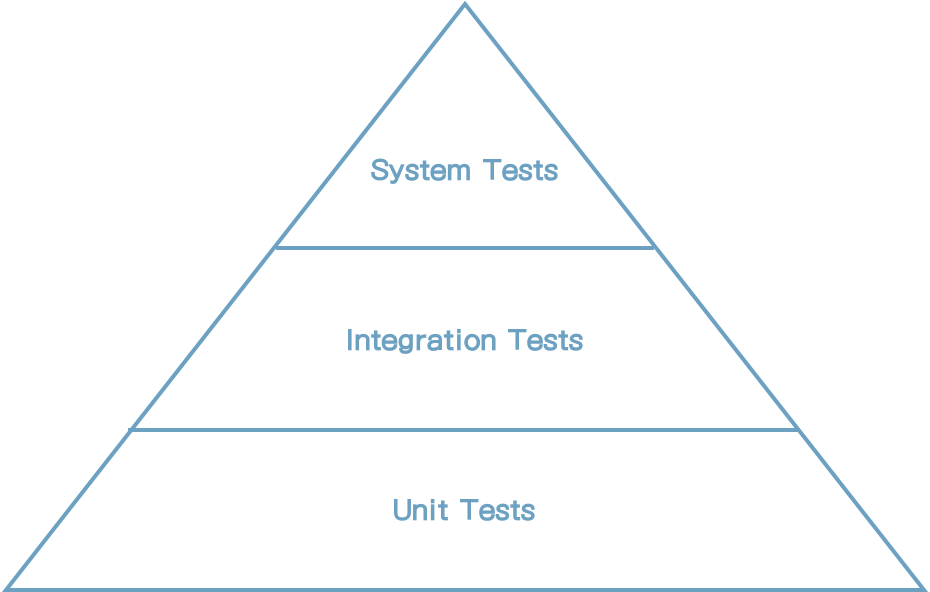

# 7 아키텍처 구성요소 테스트

많은 프로젝트에서 자동화 테스트가 <u>mystery인</u> 것을 목격했다. 모두가 위키에 문서화 된 복잡한 규칙대로 테스트를 작성한다. 하지만 그 누구도 팀의 테스트 전략을 정확한 대답을 할 수 없다.

이번 장은 헥사고날 아키텍처의 테스팅 전략을 제공한다. 아키텍처의 구성요소에 대한 테스트 유형을 살펴볼 것이다.


## 테스트 피라미드

다음 그림에 테스트 피라미터에 대해 논의해보자. 이것은 얼마나 많은 테스트를 할 지 결정하고 어떤 목적으로 테스트를 해야 하는지에 대한 도움을 준다.




[그림 7.1] 테스트 피라미드에 따르면, 비용이 적은 테스트를 만들고 비용이 비싼 테스트를 줄여야 한다.


이 그림은 작성하기 쉽고 유지보수가 용이하며, 빠르고 안정적인, 잘게 쪼개어 높은 커버리지를 가져야 한다는 것을 나타낸다. 이것은 기대한 대로 동작하는 단일 유닛(일반적으로 클래스)을 확인하는 단위 테스트이다.

일단 테스트가 여러 유닛, 유닛 간 경계, 아키텍처 경계, 혹은 시스템 경계를 결합한다면 작성이 어려워지고 실행도 느리며 쉽게 깨진다(기능 오류가 아닌 구성 에러로 인한 실패). 피라미드에서는 그러한 테스트가 작성 비용이 높아질 수록 목표 테스트 커버리지는 더 낮춰야 한다고 말해준다. 그렇지 않으면 새 기능 개발 대신 테스트 작성에 훨씬 많은 시간이 소요될 수 있기 때문이다. 

상황에 따라서 테스트 피라미드는 다른 계층에서도 보여진다. 헥사고날 아키텍처를 테스트하기로 한 계층을 한번 보자. "단위 테스트", "통합 테스트", "시스템 테스트"의 정의는 상황에 따라 다르다는 것을 알아두자. 한 프로젝트에서는 다른 프로젝트와 다른 것을 의미할 수도 있다. 다음은 이장에서 사용하는 이러한 용어에 대한 해석이다.

단위 테스트는 피라미드 상 가장 밑부분이다. 일반적으로 단위 테스트는 단일 클래스를 생성하고 인터페이스로 기능을 테스트한다. 테스트 대상 클래스는 인스턴스가 생성되지 않은 다른 클래스에 의존성이 있지만, 테스트 동안 실제 클래스 동작을 시뮬레이션 하는 mock으로 교체된다.

통합 테스트는 피라미드의 다음 단계를 나타낸다. 이 테스트는 네트워크를 연결하는 여러 단위를 인스턴스화 하고 시작 인터페이스에 특정 데이터를 보냈을 때 기대대로 동작하는지 확인한다. 우리가 해석한 바에 의하면, 통합 테스트는 두 계층 사이 경계를 넘나들고 객체간의 네트웍 연결은 불안정하거나 mock때에 따라서는 mock으로 동작해야 한다.

마지막으로, 시스템 테스트는 애플리케이션을 구성하는 전체 네트웍 객체를 연결하고 특정 유스케이스가 애플리케이션 모든 계층을 통해 기대한 대로 동작하는지 확인한다.

위의 시스템 테스트는, 애플리케이션의 UI를 포함하는 엔드 투 엔드(end-to-end) 테스트 계층일 수도 있다. 이 책에서는 백엔드 아키텍처에 대해서만 논의하고 있으므로 엔드 투 엔드 테스트는 고려하지 않을 것이다.

이제 테스트 타입을 정의했고 어느 유형의 테스트가 헥사고날 아키텍처 계층에 가장 잘 맞는지 알아보자.


## 단위 테스트로 도메인 엔티티 테스트하기

아키텍처 중심부의 도메인 엔티티부터 시작해보자. *4장 (Implementing a Use Case)* 의 ** Account** 를 다시 생각해보자. Account의 상태는 계좌의 특정 시점의 잔고, 입금 목록, 인출 목록 등으로 구성되어 있다. 우리는 **withDraw()** 메서드가 예상한 대로 작동하는지 확인해보자.

```java
class AccountTest {

	@Test
	void withdrawalSucceeds() {
		AccountId accountId = new AccountId(1L);
		Account account = defaultAccount()
				.withAccountId(accountId)
				.withBaselineBalance(Money.of(555L))
				.withActivityWindow(new ActivityWindow(
						defaultActivity()
								.withTargetAccount(accountId)
								.withMoney(Money.of(999L)).build(),
						defaultActivity()
								.withTargetAccount(accountId)
								.withMoney(Money.of(1L)).build()))
				.build();

		boolean success = account.withdraw(Money.of(555L), new AccountId(99L));

		assertThat(success).isTrue();
		assertThat(account.getActivityWindow().getActivities()).hasSize(3);
		assertThat(account.calculateBalance()).isEqualTo(Money.of(1000L));
	}
}
```

이 테스트는 **Account**를 특정 상태로 인스턴스화 하는 단순 단위 테스트이고 **withdraw()**를 호출하고 인출이 성공했고 테스트 상 **Account** 객체의 상태에 부작용이 없는지 확인한다.

이 테스트는 준비하기 쉽고 이해가 용이하며 매우 빠르게 실행된다. 이 보다 더 단순한 테스트는 없다. 이 같은 단위 테스트는 도메인 엔티티 내에 비즈니스 규칙을 확인하는 가장 좋은 방법이다. 도메인 엔티티 행위가 다른 클래스의 의존성의 영향이 없기 때문에 다른 유형의 테스트가 필요없다.


## 단위 테스트로 유스케이스 테스트하기

계층 외부로 나가서, 다음 테스트 할 아키텍처 요소는 유스케이스이다. *4장(Implementing a Use Case)*에서 논의했던 **SendMoneyService** 테스트를 한번 보자. **SendMoney** 유스케이스는 다른 트랜잭션이 잔고를 변경할 수 없게 하기 위해 보내는 사람 **Account**를 잠시 동안 잠근다. 성공적으로 계좌에서 돈을 인출했다면, 돈을 입금하기 위해서 받는 사람 계좌를 잠근다. 그러고 나서 두 계좌의 잠금을 풀 수 있다.

트랜잭션이 성공할 때 예상한 대로 진행됬는지 확인할 수 있다.

```java
class SendMoneyServiceTest {
    // declaration of fields omitted
    
    @Test
	void transactionSucceeds() {

		Account sourceAccount = givenSourceAccount();
		Account targetAccount = givenTargetAccount();

		givenWithdrawalWillSucceed(sourceAccount);
		givenDepositWillSucceed(targetAccount);

		Money money = Money.of(500L);

		SendMoneyCommand command = new SendMoneyCommand(
				sourceAccount.getId().get(),
				targetAccount.getId().get(),
				money);

		boolean success = sendMoneyService.sendMoney(command);

		assertThat(success).isTrue();

		AccountId sourceAccountId = sourceAccount.getId().get();
		AccountId targetAccountId = targetAccount.getId().get();

		then(accountLock).should().lockAccount(eq(sourceAccountId));
		then(sourceAccount).should().withdraw(eq(money), eq(targetAccountId));
		then(accountLock).should().releaseAccount(eq(sourceAccountId));

		then(accountLock).should().lockAccount(eq(targetAccountId));
		then(targetAccount).should().deposit(eq(money), eq(sourceAccountId));
		then(accountLock).should().releaseAccount(eq(targetAccountId));

		thenAccountsHaveBeenUpdated(sourceAccountId, targetAccountId);
	}
  
    // helper methods omitted
}
```

테스트 코드를 가독성을 높이기 위해서, 행위 주도(behavior-driven) 개발에서 주로 사용되는 given/when/then 부분으로 구조화 되어 있다.

"given" 영역에서 보내는 사람과 받는 사람 **Account** 객체를 생성하고 **given**...()으로 시작하는 이름을 사용하는 메소드로 올바른 상태로 만든다. 또한 유스케이스의 입력값으로 사용되는 **SendMoneyCommand** 객체를 생성한다. "when" 부분에서, 유스케이스를 실행하기 위해서 **sendMoney()** 메소드를 호출한다. "then" 부분에서 트랜잭션이 성공했고 특정 메소드가 보내는 사람과 받는 사람의 **Account**와 계좌의 lock/unlock의 책임이 있는 **AccountLock** 객체에서 호출되었다는 것을 확인한다.

내부적으로, 테스트는 **given...()** 에서 mock 객체를 생성하기 위해 Mockito 라이브러리(https://site.mockito.org/)를 사용한다. Mockito는 특정 메서드가 mock 객체에서 호출되었는지 확인하기 위해 **then()** 메서드를 제공한다.

테스트 상에 있는 유스케이스 서비스가 상태가 없기(stateless) 때문에 "then" 구문에서 상태를 확인할 수 없다. 대신 테스트는 서비스가 의존관계에 있는 어떤 메서드를 호출했는지 확인한다. 이것의 의미는 테스트가 행위 뿐만 아니라 테스트 코드의 구조 변화에 취약하다는 것을 의미한다. 차례로 테스트 대상 코드가 리팩토링 될 때 테스트도 수정될 가능성이 많다는 것을 의미한다.

<u>이것을 생각하고,</u> 테스트에서 확인하고자 하는 상호작용에 대해 더 많이 생각해야 한다. 이전 테스트에서 했던 모든 인터랙션을 확인하는 것은 좋은 생각이 아닐것이다. 대신 중요한 부분에 집중해야 한다. 그렇지 않으면 우리는 단일 변화가 있는 테스트를 테스트의 가치를 약화시키는 테스트 클래스로 변경해야 할 것이다.

<u>이 테스트가 여전히 단위 테스트이지만, 의존성 상호관계를 테스트 하고 있기 때문에 통합테스트의 경계를 긋는다.</u>


## 통합 테스트로 웹 어댑터 테스트하기

한층 더 외부로 나가면, 어댑터가 나온다. 웹 어댑터 테스트를 알아보자.

웹 어댑터는 입력값을 HTTP로 JSON 형식으로 받고, 어떤 검증을 하고 유스케이스 형식대로 입력값을 매핑하고 유스케이스로 결과값을 반환한다는 것을 생각해보자. 그리고 나서, 유스케이스 결과를 JSON으로 매핑하고 HTTP 응답을 통해 클라이언트에 반환한다.

웹 어댑터 테스트에서, 우리는 이러한 모든 단계가 예상한대로 동작하는지 확인하기를 원한다.

```java
@WebMvcTest(controllers = SendMoneyController.class)
class SendMoneyControllerTest {

	@Autowired
	private MockMvc mockMvc;

	@MockBean
	private SendMoneyUseCase sendMoneyUseCase;

	@Test
	void testSendMoney() throws Exception {

		mockMvc.perform(post("/accounts/send/{sourceAccountId}/{targetAccountId}/{amount}",
				41L, 42L, 500)
				.header("Content-Type", "application/json"))
				.andExpect(status().isOk());

		then(sendMoneyUseCase).should()
				.sendMoney(eq(new SendMoneyCommand(
						new AccountId(41L),
						new AccountId(42L),
						Money.of(500L))));
	}

}
```

이전 테스트는 Spring Boot 프레임워크에서 만든 **SendMoneyController** 웹 컨트롤러를 위한 표준 통합 테스트이다. **testSendMoney()** 메서드에서, 입력 객체를 생성하고 mock HTTP 요청을 웹 컨트롤러에 보낸다. 요청 본문은 JSON 문자열로 입력 객체를 포함한다.

**isOk()** 메소드로, HTTP 응답상태가 200인 것을 확인하고 mock 유스케이스가 호출된 것을 확인한다.

웹 어댑터의 대부분의 책임은 이 테스트에 포함된다.

**MockMvc** 객체로 mocking하고 있기 때문에 HTTP 프로토콜로 실제 테스트를 하지는 않는다. 우리는 프레임워크가 HTTP를 적절하게 변환한다고 믿는다; 프레임워크를 테스트할 필요가 없다.

하지만, JSON형식의 입력을 **SendMoneyCommand** 객체로 매핑하는 전체 경로가 포함된다. 4장, Implementing a Use Case에서 설명한 것처럼 **SendMoneyCommand** 객체를 자기 검증 command로 만들었다면, 우리는 이러한 매핑이 구문상 유스케이스에 대한 유효한 입력이라고 확인했을 것이다. 또한 유스케이스가 호출되고 HTTP 응답이 예상 결과를 가진다고 확인했을 것이다.

그러면, 이것이 왜 통합테스트이고 단위 테스트가 아닌가? 이 테스트에서 단일 웹 컨트롤러 클래스만을 테스트하는 것처럼 보여도, <u>포함하는 많은 것들이 있다.</u> **@WebMvcTest** 어노테이션으로, 우리는 Spring으로 하여금 특정 request path에 응답,, Java와 JSON의 매핑, HTTP 입력값 검증 등을 하는 네트웍 객체를 생성하게 한다. 이 테스트에서 웹 컨트롤러가 네트워크의 부분인 것처럼 동작하는 것을 확인하고 있다.

웹 컨트롤러가 Spring 프레임워크에 밀접하게 연결되어 있기 때문에, 분리하여 테스트하는 대신 이 프레임워크에서 통합하여 테스트하는 것이 의미가 있다. 웹 컨트롤러를 단순 단위 테스트로 테스트했다면 모든 매핑, 입력값 검증, HTTP 같은것을 포함하지 못할 것이며 운영상에 실제로 동작할지 확인할 수 없을 것이다. 


## 통합 테스트로 영속성 어댑터 테스트하기

비슷한 이유로 어댑터 내부 로직만 뿐만 아니라 데이터베이스와의 매핑도 확인하고 싶으므로 영속성 어댑터를 단위 테스트 대신 통합 테스트로 하는 것은 의미가 있다. 

*6장(Implementin a Persistence Adapter)*에서 만들었던 영속성 어댑터를 테스트 하기를 원한다. 어댑터는 두개의 메서드를 가지고 있다. 하나는 **Account** 엔티티를 로딩하는 것이며 다른 하나는 데이터베이스에 새 계좌 활동내역을 저장하는 것이다.

```java
@DataJpaTest
@Import({AccountPersistenceAdapter.class, AccountMapper.class})
class AccountPersistenceAdapterTest {

	@Autowired
	private AccountPersistenceAdapter adapterUnderTest;

	@Autowired
	private ActivityRepository activityRepository;

	@Test
	@Sql("AccountPersistenceAdapterTest.sql")
	void loadsAccount() {
		Account account = adapterUnderTest.loadAccount(new AccountId(1L), LocalDateTime.of(2018, 8, 10, 0, 0));

		assertThat(account.getActivityWindow().getActivities()).hasSize(2);
		assertThat(account.calculateBalance()).isEqualTo(Money.of(500));
	}

	@Test
	void updatesActivities() {
		Account account = defaultAccount()
				.withBaselineBalance(Money.of(555L))
				.withActivityWindow(new ActivityWindow(
						defaultActivity()
								.withId(null)
								.withMoney(Money.of(1L)).build()))
				.build();

		adapterUnderTest.updateActivities(account);

		assertThat(activityRepository.count()).isEqualTo(1);

		ActivityJpaEntity savedActivity = activityRepository.findAll().get(0);
		assertThat(savedActivity.getAmount()).isEqualTo(1L);
	}

}
```

**@DataJpaTest**로, 우리는 Spring에게 Spring Data 리포지토리를 포함한 데이터베이스 접근이 필요한 네트웍 객체를 인스턴스하라고 말한다. 어떤 객체가 네트워크에 추가된다는 것을 확인하게 위해 **@Import** 구문을 추가한다. 예를 들어, 이러한 객체는 테스트 대상 어댑터가 내부 도메인 객체를 데이터베이스 객체로 매핑할 때 필요하다. 

**loadAccount()** 테스트에서, 데이터베이스를 SQL 스크립트를 이용해 특정 상태로 둔다. 그리고 나서 어댑터 API로 계좌를 로드하고 SQL 스크립트로 실행했던 데이터베이스 상태를 가졌는지 확인한다.

**updateActivities()** 테스트는 반대로 진행된다. 새로운 계좌 활동을 가진 Account 객체를 만들고 어댑터가 저장하게 한다. 그리고 나서 활동 내역이  **ActivityRepository** API를 통해 데이터베이스에 저장되었는지 확인한다.

이 테스트의 중요한 관점은 데이터베이스를 mocking 하고 있지 않는다는 것이다. 테스트는 실제 데이터베이스에 연결한다. 데이터베이스를 mocking하면 테스트는 여전히 동일 코드 라인을 포함할 것이며 코드 상 동일한 높은 커버리지 라인수를 만들어 낼 것이다. 그러나 이러한 높은 커버리지에 불구하고 테스트는 SQL 구문 오류 혹은 데이터베이스 테이블과 java 객체사이 기대하지 않은 매핑 오류로 실제 데이터베이스의 준비과정에서 실패할 가능성이 높다.

기본적으로 Spring은 테스트 동안 인메모리 데이터베이스를 사용한다는 것을 명심해라. 이떤 것도 구성할 필요도 없어서 실용적이고 독립적으로 동작할 것이다.

그러나, 인메모리 데이터베이스가 우리가 운영에서 사용하는 데이터베이스는 아마도 아니기 때문에, 테스트가 인메모리에서 잘 동작했더라도 실제 데이터베이스에서는 오동작을 가능성이 여전히 있다. 예를 들어, 데이터베이스는 자신의 선호하는 SQL을 구현하는 것이 좋다.

이런 이유로, 영속성 어댑터 테스트는 실제 데이터베이스에서 실행되어야 한다. Testcontainers와 같은 라이브러리는 필요 시 Docker Container를 사용하는 등 이런 관점에서 많은 도움이 된다.

실제 데이터베이스에서 실행하는 것은 우리가 두개의 다른 데이터베이스를 신경쓸 필요가 없다는 부가적인 혜택을 가진다. 테스트 동안 인메모리 데이터베이스를 사용한다면, 어떤 방식으로든 그것을 구성해야만 할지 모르거나 각 데이터베이스의 개별 버전의 마이그레이션 스크립트를 만들어야 할지도 모른다.


## 시스템 테스트로 메인 경로 테스트하기

시스템 테스트인 프라미드 젤 윗부분에, 시스템 테스트는 전체 애플리케이션을 시작하고 모든 계층이 잘 동작하는지 확인하는 API에 요청을 실행한다.

"Send Money" 유스케이스의 시스템 테스트에서, 우리는 HTTP 요청을 애플리케이션에 보내고 계좌의 새로운 잔고 뿐만 아니라 응답값을 검증한다.

```java
@SpringBootTest(webEnvironment = WebEnvironment.RANDOM_PORT)
class SendMoneySystemTest {

	@Autowired
	private TestRestTemplate restTemplate;

	@Autowired
	private LoadAccountPort loadAccountPort;

	@Test
	@Sql("SendMoneySystemTest.sql")
	void sendMoney() {

		Money initialSourceBalance = sourceAccount().calculateBalance();
		Money initialTargetBalance = targetAccount().calculateBalance();

		ResponseEntity response = whenSendMoney(
				sourceAccountId(),
				targetAccountId(),
				transferredAmount());

		then(response.getStatusCode())
				.isEqualTo(HttpStatus.OK);

		then(sourceAccount().calculateBalance())
				.isEqualTo(initialSourceBalance.minus(transferredAmount()));

		then(targetAccount().calculateBalance())
				.isEqualTo(initialTargetBalance.plus(transferredAmount()));

	}

	private ResponseEntity whenSendMoney(
			AccountId sourceAccountId,
			AccountId targetAccountId,
			Money amount) {
		HttpHeaders headers = new HttpHeaders();
		headers.add("Content-Type", "application/json");
		HttpEntity<Void> request = new HttpEntity<>(null, headers);

		return restTemplate.exchange(
				"/accounts/send/{sourceAccountId}/{targetAccountId}/{amount}",
				HttpMethod.POST,
				request,
				Object.class,
				sourceAccountId.getValue(),
				targetAccountId.getValue(),
				amount.getAmount());
	}
  
    // some helper methods omitted
}
```

**@SpringBootTest**로 우리는 Spring이 애플리케이션을 구성하는 전체 네트워크 객체를 시작하라고 한다. 임의의 포트로 애플리케이션을 구성할 수 있다.

**test** 메소드에서, 우리는 단순히 요청을 만들고 애플리케이션에 보내고 나서 응답값과 계좌의 잔고를 확인한다.

이전 웹 어댑터 테스트에서 했던 것 처럼, 우리는 요청을 보내기 위해 **MockMvc**가 아닌 **TestRestTemplate**를 사용하고 있다. 이것은 운영환경과 좀 더 가깝게 테스트하도록 하는 실제 HTTP를 사용하고 있다는 것을 의미한다.

실제 HTTP로 진행하고 있으므로 실제 출력 어댑터를 가지고 있다. 우리의 케이스에서 이것은 애플리케이션을 데이터베이스에 연결하는 단순한 영속성 어댑터이다. 다른 시스템과 통신하는 애플리케이션에서, 우리는 추가적인 출력 어댑터를 위치 시킬수 있을 것이다. 시스템 테스트에서 조차 써드파티 시스템을 동작하게 하는 것은 쉬운 일은 아니다. 그래서 결국 mocking 해야할 것이다. 우리의 헥사고날 아키텍처는 몇개의 출력포트 인터페이스를 <u>(끄다)stub out</u> 해야하므로 더욱 쉽게 만들 수 있다.

테스트는 가능한 읽기 쉽게 만들어야 한다고 생각된다. 모든 복잡한 로직은 헬퍼 메소드로 숨겼다. 이러한 메소드들은 상태를 확인할 수 있는 도메인 전용 언어를 구성한다.

이 같은 도메인 전용 언어가 테스트 관점에서는 좋은 생각이지만 시스템 테스트에서는 더욱 중요하다. 시스템 테스트는 애플리케이션의 실제 사용자를 단위 혹은 통합 테스트가 할 수 있는 것 보다 훨씬 더 잘 만들어낸다. 그래서 우리는 그들을 사용자 관점으로부터 애플리케이션을 확인할 수 있게 한다. 이것은 적절한 단어로 사용하면 더 쉬워진다. 또한 이 단어는 프러그래머가 아닌 애플리케이션 사용자를 포함하기에 적합한 도메인 전문자가 테스트를 수행하고 피드백 할 수 있게 해준다. 행위-기반 개발에는 JGiven이라는 라이브러리가 있다. 이것은 테스트의 단어를 생성하는 프레임워크를 제공한다.

이전 장에서 나타낸 단위, 통합 테스트를 만들었다면, 시스템 테스트는 많은 동일한 코드를 포함할 것이다. 그들은 추자적인 혜택을 제공하는가? 그렇다. 일반적으로 단위와 통합테스트가 하는 것과 다른 유형의 버그를 없앤다. 계층간의 매핑은 단위, 통합테스트 단독실행으로는 발견되지 못하는 버그가 처리될 수 있다.

시나리오를 만들기 위해 다양한 유스케이스와 결합된다면, 시스템 테스트는 더욱 그 위력을 발휘한다. 각 시나리오는 사용자가 전형적으로 애플리케이션을 접하는 특정 경로를 나타낸다. 가장 중요한 시나리오가 시스템 테스트에 포함된다면, 우리는 가장 최근 수정사항에서 애플리케이션이 정상적이었고 배포할 준비가 되었다고 말할 수 있다.


## 얼마나 많은 테스트를 해야 할까?

내가 수행한 많은 프로젝트에서의 질문 사항은 얼마나 많은 테스트를 수행해야 하는가는 대답할 수 없었다. 테스트가 80% 라인을 커버하면 충분한가? 그것보다 높아야 하나?

라인 커버리지는 테스트 성공을 측정하기에 나쁜 매트릭이다. 100%가 아닌 목표는 코드의 중요부분이 전혀 커버되지 않았을 수 있기 때문에 의미가 없을 수도 있다. 심지어 100%라도 모든 버그가 없다라고 확신할 수 없다.

나는 테스트 성공을 우리가 소프트웨어를 출시하기에 얼마나 편한가에 의해서 측정하기를 제안한다. 그들 모두 실행한 다음 출시하기에 충분히 신뢰한다면, 좋은 것이다. 출시를 더 자주하면, 테스트에서 더 많이 신뢰할 수 있다. 단지 일년에 두번 출시한다면 일년에 두번만 확인하기 때문에 그 누구도 테스트를 신뢰할 수 없을 것이다.

처음 출시 두번째까지는 맹신이 필요하지만, 우리가 운영상의 버그를 수정 및 학습하는 것을 우선순위로 둔다면 잘하고 있는 것이다.

매번 운영 버그에서 우리는 의문을 가져야 한다. 우리 테스트가 버그를 왜 잡지 못했을까? 그 해결책을 문서화 하고 버그를 커버하는 테스트를 추가한다. 시간이 경과함에 따라 출시할 때 더 편해지고, 문서화가 성공으로 가는 매트릭을 점차 제공할 것이다.

그러나, 우리가 만들 테스트 전략을 시작하도록 돕는다. 헥사고날 아키텍처의 그런 전략중 하나다.

* 도메인 엔티티를 구현 시 단위 테스트를 구현하라.
* 유스케이스를 구현 시 단위 테스트를 구현하라.
* 어댑터를 구현 시 통합테스트를 구현하라.
* 사용자의 애플리케이션 사용하는 가장 중요부분을 시스템 테스트로 구현하라.

"구현 시"이라는 단어를 주시하라. 테스트가 기능 개발 후가 아닌 개발동안 수행될 때, 개발 도구가 되고 더 이상 하기 싫은 일처럼 느끼지 않게 된다.

그러나, 새로운 필드 추가할 때마다 테스트를 수정하는데 한시간씩 보내야 한다면, 우리는 뭔가 잘못하고 있는 것이다. 아마도, 우리의 테스트는 코드의 구조적 변화에 너무 깨지기 쉽고 개선방안을 마련해야 한다. 우리는 리팩토링때마다 테스트를 수정해야 한다면 테스트는 그 가치를 잃어버리는 것이다.


## How does This Help Me Build Maintainable Software?

**헥사고날 아키텍처** 스타일은 분명하게 도메인 로직과 외부와 접한 어댑터를 구분한다. 중앙 도메인 로직을 단위 테스트로 커버하고, 어댑터를 통합 테스트로 커버하는 것은 분명한 테스트 전략을 정의하도록 도움을 준다.

입력과 출력 포트는 테스트에서 매우 가시적인 mocking 지점을 제공한다. 각 포트에서, 우리는 mocking해야 할지, 실제 구현을 사용해야 할지 결정할 수 있다. 포트가 매우 작고 집중되고 있다면, 그들을 mocking하는 것을 매우 쉬운일이 될 것이다. 포트 인터페이스가 더 적은 메소드를 제공할 수록 테스트에서 mocking해야하는 메소드에 대한 혼란도 줄어든다.

어떤 것을 mocking하는게 많은 부담이 되거나 코드의 어떤 부분을 커버해야 할지 테스트 종류를 모른다면, 이는 위험 신호이다. 이런 관점에서, 테스트는 canary로 행동하는 부가적인 책임을 가지고 있다 - 아키텍처 상 결함을 알려주며 유지보수가 용이한 코드로 수정하게 하는


