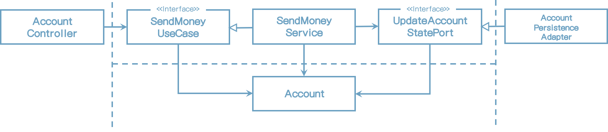
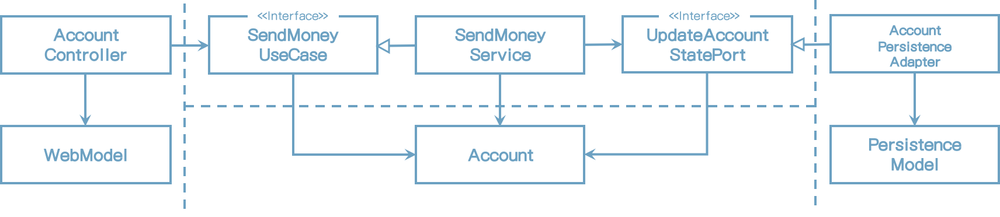
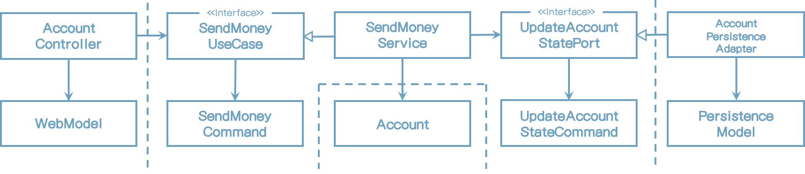
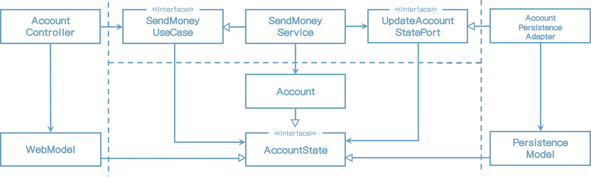

# 8 경계(Boundaries) 간 매핑

이전 장에서, 웹, 애플리케이션, 도메인, 영속성 계층, 그리고 유스케이스 구현에 필요한 계층을 살펴봤다.

그러나, 각 계층 모델 간의 <u>끔찍하고 어디에나 있는</u> 매핑 문제에 대해서는 거의 다루지 않았다. 나는 매핑을 구현을 하지 않는 두 계층간에 동일 모델을 사용할지에 대해서는 어떤 점에서는 논의했다고 확신한다.

그 논쟁은 이와 같을 것이다.

###### Pro-Mapping Devleoper:

계층간 매핑을 사용하지 않는다면, 우리는 계층간 강결합되어 있다는 것을 의미하는 양쪽 계층의 동일 모델을 사용해야 한다.

###### Contra-Mapping Developer

계층간 매핑을 사용한다면, 우리는 단순 CRUD만 사용하고 있고 계층간 사이에 동일 모델만을 가지기 때문에 많은 유스케이스에서 지나칠 만큼 많은 코드를 만들어낸다.

이같은 논의에서 종종 있듯이, <u>이런 논쟁에는 양쪽에 진실이 있다</u>. 매핑 전략의 장단점을 논의해 보고 개발자들이 결정 하는데 도움을 줄 수 있는 요소들을 알아보자.

## "No Mapping" 전략

첫번째 전략은 실제 전혀 매핑하지 않는 것이다.

[그림 8.1] 포트 인터페이스가 입출력 모델로서 도메인 모델을 사용한다면 계층 간 매핑이 필요없다.

위의 그림은 BuckPal 예제 애플리케이션의 "Send Money" 유스케이스와 관련있는 컴포넌트를 보여준다.

웹 계층에서 웹 컨트롤러는 유스케이스를 실행하기 위해 **SendMoneyUseCase** 인터페이스를 호출한다. 이 인터페이스는 **Account** 객체를 인자로 받는다. 이것은 웹 계층과 애플리케이션 계층 양쪽이 **Account** 클래스(양쪽 모두 같은 모델을 사용)가 필요하다는 것을 의미한다. 

애플리케이션 반대 쪽에서는 영속성과 애플리케이션 계층 간에 동일한 관계가 있다. 모든 계층이 동일 모델을 사용하기 때문에 그들 사이 매핑을 구현할 필요가 없다.

이런 설계 방식의 영향도는 어떨까?

웹과 영속성 계층은 모델상 특별한 요구사항이 있다. 웹 계층이 REST를 경유하여 모델을 노출할 때 모델 클래스는 특정 필드를 JSON으로 직렬화 하는 어떤 어노테이션이 필요할 지도 모른다. 우리가 데이터베이스 매핑을 정의하는 어노테이션이 필요한 ORM 프레임워크를 사용한다면 영속성 계층에서는 사실이다.

예제에서 그러한 모든 요구사항들이 도메인과 애플리케이션 레이어는 관련이 없더라도 **Account** 도메인 모델 클래스에서 처리되어야 한다. 이것은 **Account** 클래스가 웹, 애플리케이션 그리고 영속성 계층과에 관련된 이유로 변경되어야 하기 때문에 **단일 책임 원칙(Single Responsibility Principle)**을 위반한다.

기술적인 요구사항과는 별개로, 각 계층은 **Account** 클래스에서 특정 필드가 필요할 수도 있다. 이것은 하나의 계층에만 적당한 특정 필드를 가진 파편화된 도메인 모델이 될 수도 있다.

이 말은 "No Mapping" 전략을 구현하지 않아야 한다는 말인가? 그렇지는 않다.

<u>기분 나쁘게 들릴지는 몰라도 "No Mapping" 전략이 완벽한 해결책 일 수도 있다.</u>

단순 CRUD 유스케이스를 생각해보라. 웹 모델의 동일 필드를 도메인 모델의 모델로, 그리고 도메인 모델의 모델을 영속성 모델의 모델로 매핑할 필요가 있는가? 나는 그렇지 않다고 생각한다.

도메인 모델에 JSON이나 ORM 어노테이션은 어떠한가? 실제로 그들은 <u>bother us?</u> 영속성 계층에 변화가 있다면 도메인 모델에 한 두개의 어노테이션을 변경해야 한다면 어떤가?

모든 계층은 동일한 구조에서는 동일한 정보를 필요하기 때문에 "No Mapping" 전략은 완전히 유효한 옵션이다.

그러나, 애플리케이션이나 도메인 계층에서 웹이나 영속성 이슈를 처리하자마자 다른 매핑 전략으로 변경해야만 한다.

여기에 두명의 개발자에 대한 교훈이 있다. 과거에 특정 매핑 전략을 정했어도 나중에 바꿀 수 있다.

내 경험상 많은 유스케이스는 단순 CRUD 유스케이스로 시작한다. 나중에는 보다 값 비싼 매핑전략을 정당화 할 수 있는 풍부한 행위와 검증을 가진 비즈니스 유스케이스로 성장한다. <u>혹은 그들이 CRUD 상태를 계속 유지한다면, 우리는 다른 매핑 전략을 조사하지 않은 것에 만족할 수도 있다.</u>

## "Two-Way" 매핑 전략

각 계층이 자신만의 모델을 가져야 한다는 매핑 전략을 "two-way" 매핑 전략이라고 부르고 다음 그림에 표시했다.

[그림 8.2] 각 어댑터는 자신의 모델을 가지고 있고 그 어댑터는 도메인 모델 전후 매핑하는데 책임이 있다.

웹 계층이 웹 모델을 내부 포트에서 필요로 하는 도메인 모델로 매핑한다. 또한 내부 포트에서 리턴되는 도메인 모델 객체를 웹 모델로 매핑한다.

영속성 계층은 외부 포트에서 사용되는 도메인 모델과 영속성 모델 사이의 유사한 매핑에 책임이 있다.

양쪽 계층이 양방향에서 매핑되어서 그 이름을 "two-way" 매핑이라고 한다.

각 계층은 자신만의 모델을 가지고 있어서, 각 계층은 다른 계층에 영향을 주지 않고(내용이 수정되지 않는 한) 자신의 모델을 수정할 수 있다. 웹 모델은 최적의 데이터를 나타낼 수 있다. 도메인 모델은 유스케이스를 구현하는데 최적의 구조를 가질 수 있다. 영속성 모델은 객체를 데이터베이스에 저장하는 ORM에서 필요한 구조를 가질 수 있다.

또한 이 매핑 전략으로 웹이나 영속성의 관심사에 오염되지 않는 클린 도메인 모델을 만들 수 있다. JSON이나 ORM 매핑 어노테이션을 포함하지 않는다. 단일 책임 원칙도 준수한다.

"two-way" 매핑의 다른 장점은 "no mapping" 전략 다음으로 개념적으로 가장 단순한 매핑 전략이다. 매핑에 대한 책임이 분명하다. 외부 계층/어댑터는 내부 계층의 모델을 매핑한다. 내부 계층은 오직 자신의 모델만 알고 매핑 문제 대신 도메인 로직에만 집중할 수 있다.

모든 매핑 전략에 단점이 있듯이, "two-way" 매핑 또한 단점이 있다.

첫번째로, 많은 코드가 필요하다는 것이다. 코드양을 줄이는 많은 매핑 프레임워크를 사용하더라도, 모델간의 매핑을 구현하는 것은 많은 시간이 걸리는 작업이다. 이것은 주로 매핑 로직을 디버깅 하는 것이 힘들기 사실 때문이다 - 특히 제네릭 코드와 리플렉션을 사용하는 계층 뒤쪽에 내부 동작을 숨기는 매핑 프레임워크 사용할 때.

또 다른 단점은, 도메인 모델이 계층 경계 간 통신하는데 사용된다는 것이다. 내부 포트와 외부 포트는 입력 파라미터와 응답값으로 도메인 객체를 사용한다. 이것은 외부 계층의 필요에 의해서 발생하는 변화에 취약하게 한다. 반면, 도메인 로직의 필요로 발생하는 도메인 모델에서는 바람직하다.

"no mapping" 전략과 같이 "two-way" 전략은 만능 해결책이 아니다. 하지만, 많은 프로젝트에서 이러한 종류의 매핑은 전체 코드에서 지켜야 하는 신성한 법칙으로 여겨졌다. 심지어 가장 단순한 CRUD 유스케이스에서 조차도 그러했다. 이것은 불필요하게 개발속도를 늦춘다.

매핑 없는 전략을 철칙으로 여겨서는 안된다. 대신 각 유스케이스별로 결정되어야 한다.

## "Full" 매핑 전략

또 다른 매핑 전략은 다음 그림에서 나타낸 것처럼 "full" 매핑 전략이라고 하는 것이다.

[그림 8.3] 각자의 모델을 필요로 하는 동작으로, 웹 어댑터와 애플리케이션 계층은 실행하고 싶은 동작에 의한 모델로 각각의 모델을 매핑한다.

이 매핑 전략은 동작별로 개별 입/출력 모델을 사용한다. 계층 경계 간 통신에 도메인 모델을 사용하지 않고, 그림에 **SendMoneyUseCase**에 입력모델로 동작하는 **SendMoneyCommand**와 같이 각 동작에 따른 모델을 사용한다. 우리는 그러한 모델을 "commands", "requests", (혹은 유사한 어떤것) 라고 부를수 있다.

웹 계층은 입력을 애플리케이션 계층의 커맨드 객체로의 매핑 책임이 있다. 그러한 커맨드는 애플리케이션으로의 인터페이스를 해석할 필요가 없이 매우 명확하게 한다. 각 유스케이스는 자신만의 필드와 검증을 하는 커맨드를 가지고 있다. 현재 유스케이스에는 필요 없는 유효성 검증이 실행될 수 있기 때문에 어느 필드가 채워져야 하고 어느 필드가 공백으로 남겨져야 좋은지는 관해서는 명백하다.

그리고 애플리케이션 계층은 커맨드 객체를 유스케이스에 따른 도메인 모델 수정에 필요한 어떤 것에도 매핑하는 데 책임이 있다.

당연히, 한 계층에서 다른 많은 커맨드로의 매핑은 단일 웹 모델과 도메인 모델간의 매핑보다 더 많은 매핑 코드가 필요하다. 그러나 이 매핑은 <u>하나만 있는 대신에</u> 많은 유스케이스의 필요를 처리해야 하는 하나의 매핑 보다 구현 및 유지보수가 더 쉽다.

나는 이러한 매핑 전략을 전역적으로 사용할 패턴으로 선호하지는 않는다. <u>애플리케이션의 상태를 변경하는 유스케이스의 경계를 명확히 표시하기 위해 웹 계층과 애플리케이션 계층 간의 최대한 장점으로 동작한다</u>. 나는 매핑에 대한 오버헤드 때문에 애플리케이션과 영속성 계층 사이에는 사용하지는 않을 것이다.

또한, 어떤 경우에는 이런 종류의 매핑을 입력 모델로 제한할 것이고 단순히 도메인 모델을 출력 모델로만 사용할 것이다. 예를 들면, **SendMoneyUseCase**는 업데이트된 잔고를 가진 Account 객체를 리턴할 것이다.

이것은 매핑 전략이 혼합되어 사용될 수도 있다는 것을 나타낸다. 모든 계층에 걸쳐 No Mapping 전략이 글로벌 규칙으로써 필요할 수도 있다.

## "One-Way" 매핑 전략

또 다른 장단점을 가진 매핑 전략이 있다 - 다음 그림에 표시된 "one-way" 전략

[그림 8.4] 동일한 "state" 인터페이스를 구현하는 도메인 모델과 어댑터 모델로, 각 계층은 다른 계층에서 수신하는 객체만 매핑하면 된다 - 단방향

> > > > 여기

이 전략에서 모든 레이어의 모델은 적당한 속성에 맞는 getter 메소드를 제공함으로써 도메인 모델의 상태를 캡슐화 하는 동일한 인터페이스를 구현한다. 

도메인 모델 그 자체는 애플리케이션 레이어 내 서비스로 부터 접근할 수 있는 풍부한 행위를 구현할 수 있다. 만일 도메인 객체를 외부 레이어로 전달하고 싶다면 매핑 없이 할 수 있다. 왜냐하면 도메인 객체는 내/외부 포트의 상태 인터페이스를 구현하기 때문이다.

외부 레이어는 자신의 모델로 매핑할지 혹은 인터페이스와 매핑할 지 결정할 수 있다. 행위 수정이 상태 인터페이스에 노출되지 않기 때문에 도메인 객체의 상태를 수정할 수 없다.

외부 레이어에서 애플리케이션 레이어로 전달하는 객체는 상태 인터페이스를 구현한다. 그리고 나서 애플리케이션 레이어는 행동에 접근하기 위해서 실제 도메인 모델로 매핑해야 한다. 그 매핑은 DDD의 팩토리와 잘 맞아 떨어진다. DDD에서의 팩토리는 특정 상태의 도메인 객체를 재구성하는데 책임이 있다.

매핑 책임은 분명하고. 레이어가 다은 레이어에서 객체를 수신하면 레이어서 동작하는 어떤것과 메핑한다. 그러므로 각 레이어는 단방향으로 매핑하고 "one-way" 매핑 전략이라고 한다.

레이어간의 매핑에서 이 전략은 개념으로 다른 전략보다 더 어렵다.

이 전략은 레이어가 유사한 모델일 때 더욱 힘을 발휘한다. 읽기 전용 동작일 때는 필요한 모든 정보를 상태 인터페이스가 제공하기 때문에 웹 레이어는 모델로 전혀 매핑할 필요가 없다. 

## When to Use Which Mapping Strategy?

이것은 100만불달러 질문이지 않는가?

대답은 실망스럽겠지만, "상황에 따라"이다.

각 매핑 전략이 다른 장단점을 가지기 때문에 전체 코드에서 단일 전략으로 사용해서는 안될 것이다. 동일 코드에서 패턴을 섞어쓰는것은 일관성이 없어 보이기 때문에 이상하게 느껴진다. 그러나 패턴을 잘 선택하는 것은 특정 업무에 최선의 패턴은 아니다. <u>단지 깔끔하게 처리하고 무책임하고, 단순한 것이다.</u>

소프트웨어는 시간이 지남에 따라 진화한다. 어제 좋다고 선택한 전략이 오늘 최선의 선택이 아닐 수 있다. 코드를 빠르게 변화할 수 있는 단순 전략으로 시작할 지도 모르고 향후에 레이어의 결합도를 나춰줄 좀 더 복잡한 전략으로 바꿀지도 모른다.

사용할 전략을 선택하고 팀내에 가이드라인에 대해 언제 동의를 한 것인가. 이 가이드라인은 어느 매핑전략이 해당 상황에서 최선의 선택이어었는가에 대한 대답이어야 한다. 그러한 이유가 몇시간 후에도 여전히 적용할지는 왜 그런 선택을 했는지에 대한 대답을 해야만 한다.

예를 들어 쿼리를 하는 것 보다 유스케이스를 수정하는데 다른 매핑 가이드라인을 정의할 지도 모르겠다. 또한 웹과 애플리케이션 레이어 그리고 애플리케이션과 영속성 레이어 사이의 다른 매핑전략을 사용할지도 모르겠다.

이러한 경우의 가이드라인은 이같이 보일 것이다.

만일 유스케이스 수정 작업을 하고 있다면 웹과 애플리케이션 레이어 사이에는 유스케이스의 결합도를 낮추기 위해 "full mapping" 전략이 좋을 것이다. 이것은 유스케이스당 유효성 검증을 분명히 하고 있고 어떤 유스케이스에서 필요없는 필드를 처리할 필요가 없을 것이다.

만일 유스케이스를 수정하는 작업을 하고 있다면 매핑 오버헤드 없이 코드를 빠르게 변화할 수 있도록 애플리케이션과 영속성 레이어 사이에 "no mappping" 전략이 첫번째 선택일 수도 있다. 애플리케이션 레이어에 영속성 이유를 다뤄야 한다면 영속성 레이어에 영속성 이슈를 유지하는 "two-way" 매핑 전략으로 바꿀 수도 있다.

쿼리 작업을 하고 있다면 패밍 오버헤드 없이 코드를 빠르게 변화할 수 있도록 웹과 애플리케이션 레이어 그리고 애플리케이션과 영속성 레이어 사이에 "no mapping" 전략이 첫번째 선택일 수 있다. 애플리케이션 레이어에 웹 혹은 영속성 이슈를 다뤄야 한다면 웹과 애플리케이션 레이어 혹은 애플리케이션 레이어와 영속성 레이어 각각 "two-way" 매핑 전략으로 바꿀 수도 있다.

이 같은 가이드라인을 적용하기 위해서는 개발자의 마음속에 있어야 한다. 팀내의 노력으로 가이드라인이 논의되고 수정 되어야 할 것이다.

## How Does This Help Me Build Maintainable Software?

애플리케이션 레이어 사이의 대문처럼 동작하는 내외부 포트로, 레이어들이 서로 어떻게 통신하고 레이어사이 어떤게 매핑할지 알아봤다.

각 유스케이스에 적절하게 좁은 포트로, 유스케이스마다 다른 매핑 전략을 선택할 수 있고 시간이 지남에 따라 다른 유스케이스에 영향을 주지 않을 수 있고 어느 시점에 최선을 전략을 선택할 수도 있다.

이러한 매핑 전략 선택과정은 모든 상황에 대한 동일 매핑전략을 사용하는 것보다 더 힘들고 많은 의사소통이 필요하다. 하지만 매핑 가이드라인이 정해지만 코드상 팀내에서 보상받을 수 있고 실행 및 유지보수하기 더 쉬워진다.

