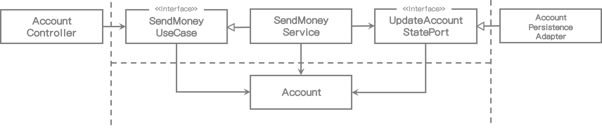
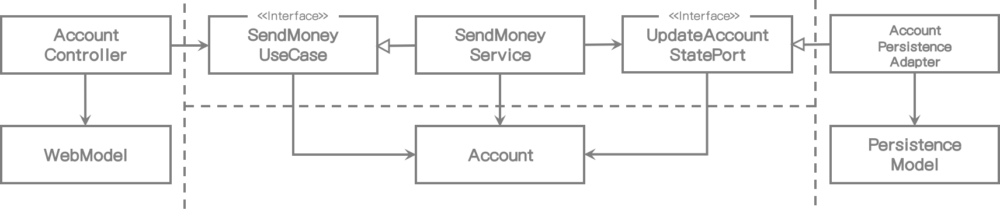
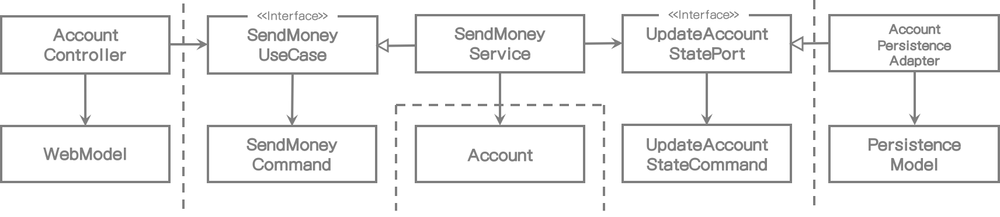
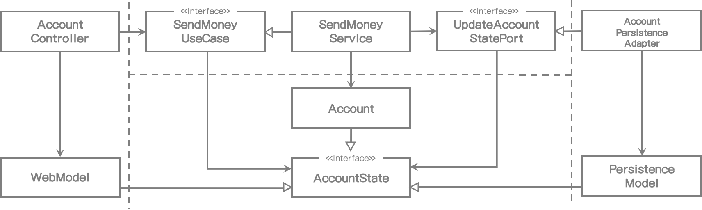

# 8. 경계 간 매핑

> > > 여기

이전 장에서 우리는 웹, 애플리케이션, 도메인, 영속성 계층을 살펴봤고 유스케이스 구현에 필요한 계층이 어떤 것인지도 알아봤다.

하지만 각 계층의 모델 간에 항상 생기는 끔찍한 매핑 문제에 대해서는 거의 다루지 않았다. 계층간 매핑을 사용하지 않도록 두 계층에서 동일모델을 사용할지에 대한 논의는 이미 조금은 다뤘다고 장담한다.

그 논쟁은 아마 이와 같을 것이다.

###### Pro-Mapping Developer:

계층간 매핑을 사용하지 않는다면, 우리는 계층 간에 강한 결합이 되었음을 의미하는 동일 모델을 사용해야 한다.

###### Contra-Mapping Developer

하지만 계층간 매핑을 사용한다면, 오직 CRUD만 사용하고 계층간 모델이 같아서 많은 유스케이스에서 지나칠 만큼 많은 코드를 만들어낸다.

이같은 논의는 종종 발생하지만, 양쪽 다 맞는 말이다. 매핑 전략의 장단점을 논의해 보고 개발자들이 결정 하는데 도움을 줄 수 있는 요소들을 알아보자.

## "No Mapping" 전략

첫번째 전략은 실제 전혀 매핑하지 않는 것이다.

[그림 8.1] 포트 인터페이스가 입출력 모델로서 도메인 모델을 사용한다면 계층 간 매핑이 필요없다.

위의 그림은 BuckPal 예제 애플리케이션의 "Send Money" 유스케이스와 관련된 컴포넌트를 나타낸다.

웹 계층에서 웹 컨트롤러는 유스케이스를 실행하기 위해 **SendMoneyUseCase** 인터페이스를 호출한다. 이 인터페이스는 **Account** 객체를 인자로 받는다. 이것은 웹 계층과 애플리케이션 계층 양쪽에서 **Account** 클래스(양쪽 모두 같은 모델을 사용)가 필요하다는 것을 의미한다. 

애플리케이션 반대 쪽인 영속성과 애플리케이션 계층 간에 동일한 관계가 있다. 모든 계층이 동일 모델을 사용하기 때문에 계층 간 매핑은 구현할 필요가 없다.

이러한 설계 방식의 영향도는 어떨까?

웹과 영속성 계층은 모델상 특별한 요구사항이 있다. 예를 들면 웹 계층이 REST를 경유하여 모델을 노출할 때 모델 클래스는 특정 필드를 JSON으로 직렬화 하는 어떤 어노테이션이 필요할 수도 있다. 우리가 데이터베이스 매핑 어노테이션이 필요한 ORM 프레임워크를 사용한다면 영속성 계층에서도 동일하게 적용된다.

이 예제에서는 모든 요구사항들이 도메인과 애플리케이션 계층과 관련 없을지라도 **Account** 도메인 모델 클래스에서 처리되어야 한다는 것이다. 이것은 **Account** 클래스가 웹, 애플리케이션 그리고 영속성 계층과에 관련된 이유로 변경되어야 하기 때문에 **단일 책임 원칙(Single Responsibility Principle)**을 위반한다.

기술적인 문제와는 별개로, 각 계층은 **Account** 클래스에서 특정 필드가 필요할 수도 있다. 이는 하나의 계층에서만 필요한 특정 필드를 가진 파편화된 도메인 모델이 될 수도 있다.

그러면 "No Mapping" 전략을 사용하지 말아야 한다는 말인가? 그렇지는 않다.

<u>심지어 난잡해 보일 수도 있지만</u> <u>"No Mapping" 전략만으로 충분히 해결될 수도 있다.</u>

단순 CRUD 유스케이스를 생각해보자. 웹 모델의 동일 필드를 도메인 모델로 매핑하고 그 도메인 모델을 영속성 모델로 매핑할 필요가 있는가? 나는 그렇게 생각하지는 않는다.

도메인 모델에 JSON이나 ORM 어노테이션을 붙이면 어떻게 될까? 실제 그것 때문에 복잡해 보이는가? 영속성 계층에 변화가 있을 때 도메인 모델에 한 두개의 어노테이션만 변경해야 한다면 어떨까?

모든 계층이 동일 구조에서 동일한 정보만 필요하다면 "No Mapping" 전략이 가장 최선의 선택사항이다.

하지만 애플리케이션이나 도메인 계층에서 웹이나 영속성에서 발생하는 이슈를 처리하자마자 바로 다른 매핑 전략으로 변경해야 할 것이다.

<u>여기에 두명의 개발자를 위한 교훈이 있다</u>: 이전에 특정 매핑 전략을 정했을 지라도 나중에 그 전략은 바꿀 수 있다.

내 경험상 많은 유스케이스는 단순 CRUD 유스케이스로 시작한다. 나중에는 보다 값 비싼 매핑 전략을 정당화 할 수 있는 풍부한 행위와 검증을 가진 비즈니스 유스케이스로 성장한다. 혹은 CRUD 상태를 계속 유지하고 다른 매핑 전략을 찾아보지 않은 채 현재 상태에 만족할 수 있다.

## "Two-Way" 매핑 전략

각 계층이 자신만의 모델을 가져야 한다는 매핑 전략을 "two-way" 매핑 전략이라고 부르고 다음 그림에 나타냈다.

[그림 8.2] 각 어댑터는 자신의 모델을 가지고 있고 그 어댑터는 도메인 모델 전후에 대한 매핑의 책임이 있다.

각 계층은 도메인 모델과 완전히 다른 구조를 가지는 자신만의 모델을 가지고 있다.

웹 계층은 웹 모델을 도메인 모델로 매핑하고 이는 인바운드 포트에서 필요하다. 또한 인바운드 포트에서 리턴되는 도메인 모델 객체를 웹 모델로 매핑한다.

영속성 계층은 아웃바운드 포트에서 사용되는 도메인 모델과 영속성 모델 사이의 매핑에 책임이 있다.

양쪽 계층이 양방향에서 매핑 되어서 그 이름을 "two-way" 매핑이라고 한다.

각 계층은 자신만의 모델을 가지고 있어서 다른 계층에 영향을 주지 않고(내용이 수정되지 않는 한) 자신의 모델을 수정할 수 있다. 웹 모델은 최적의 데이터를 나타낼 수 있다. 도메인 모델은 유스케이스를 구현하는데 최적의 구조를 가질 수 있다. 영속성 모델은 객체를 데이터베이스에 저장하는 ORM에서 필요한 구조를 가질 수 있다.

또한 이 매핑 전략으로 웹이나 영속성의 관심사항으로 오염되지 않는 클린 도메인 모델을 만들 수 있다. JSON이나 ORM 매핑 어노테이션을 포함하지 않는다. 단일 책임 원칙도 준수한다.

"two-way" 매핑의 또 다른 장점은 "no mapping" 전략 다음으로 개념적으로 가장 단순한 매핑 전략이다. 매핑에 대한 책임이 분명하다. 외부 계층/어댑터는 내부 계층으로 모델을 매핑한다. 내부 계층은 오직 자신의 모델만 알고 있고 매핑문제에 신경쓰지 않고 도메인 로직에만 집중할 수 있다.

모든 매핑 전략에 단점이 있듯이, "two-way" 매핑 또한 단점이 있다.

첫번째로, 많은 코드가 필요하다는 것이다. 코드 양을 줄이기 위해 매핑 프레임워크 중 하나를 사용하더라도 모델간의 매핑은 구현에 시간이 많이 걸린다. 이는 주로 매핑 로직 디버깅이 힘들다는 사실 때문이다 - 특히 제네릭 코드와 리플렉션을 사용하는 계층 뒤쪽의 내부 동작을 숨기는 매핑 프레임워크 사용할 때 그러하다.

또 다른 단점은, 도메인 모델이 계층 간 통신하는데 사용된다는 것이다. 인바운드 포트와 아웃바운드 포트는 입력 파라미터와 응답값으로 도메인 객체를 사용한다. 이것은 외부 계층의 필요에 의해 발생되는 변경에 취약하다. 반면, 도메인 로직 변경에 의한 도메인 모델 변경은 문제가 되지는 않는다.

"no mapping" 전략과 같이 "two-way" 전략은 만능 해결책(silver bullet)이 아니다. 하지만, 많은 프로젝트에서 이러한 종류의 매핑이 전체 코드, 심지어 가장 단순한 CRUD 유스케이스조차 지켜야 하는 신성한 법칙으로 생각한다. 이로 인해 불필요하게 개발속도가 늦어진다.

매핑 없는 전략을 철칙으로 여겨서는 안된다. 대신 각 유스케이스별로 결정되어야 한다.

## "Full" 매핑 전략

또 다른 매핑 전략은 다음 그림에서 나타낸 것처럼 "full" 매핑 전략이라고 하는 것이다.

[그림 8.3] 자신의 모델이 필요한 각 동작에서, 웹 어댑터와 애플리케이션 계층은 자신의 모델을 동작에 따른 개별 모델로 매핑한다.

이 매핑 전략은 *동작 별로* 개별 입/출력 모델을 사용한다. 계층 간 통신에 도메인 모델을 사용하지 않고, 그림에 나타난대로 **SendMoneyUseCase** 입력 모델로 동작하는 **SendMoneyCommand**와 같이, 각 동작에 따른 모델을 사용한다. 우리는 그러한 모델을 "commands", "requests", (혹은 유사한 어떤 것) 라고 부를 수 있다.

웹 계층은 그 입력정보를 애플리케이션 계층의 커맨드 객체로의 매핑 책임이 있다. 그런 command는 애플리케이션 계층의 인터페이스를 좀 더 명확히 나타낸다. 각 유스케이스는 필드와 유효성 검증을 하는 자신만의 커맨드를 가지고 있다. 어떤 필드는 값이 있어야 하고 어떤 필드는 공백이 더 좋을지에 대한 추측이 필요 없다. 그렇지 않으면 현재 유스케이스에는 필요 없는 유효성 검증이 실행될 수 있기 때문이다.

애플리케이션 계층은 커맨드 객체를 유스케이스에 따른 도메인 모델 수정이 필요한 어떤 것에도 매핑 책임이 있다.

자연적으로 한 계층에서 많은 커맨드로의 매핑하는 것이 단일 웹 모델과 도메인 모델간 매핑하는 것 보다 매핑하는 데 더 많은 코드가 필요하다. 그러나 이 매핑은 한 개 이상의 유스케이스를 처리해야 한다면 하나의 매핑보다 구현 및 유지보수가 더 쉽다.

나는 이러한 매핑 전략을 전역적으로 사용하는 것으로는 선호하지 않는다. 애플리케이션의 상태변경을 하는 유스케이스 간의 경계를 명확히 구분하기 위해서 웹 계층(혹은 다른 인바운드 어댑터)과 애플리케이션 계층 사이에서는 최대한 그 효과를 발휘할 수 있다. 나는 매핑에 대한 오버헤드 때문에 애플리케이션과 영속성 계층 사이에는 사용하지는 않을 것이다.

또한, 어떤 경우에는 이런 종류의 매핑을 입력 모델로만 제한할 것이고 출력 모델로는 단순히 도메인 모델을 사용할 것이다. 예를 들면, **SendMoneyUseCase**는 업데이트된 잔고를 가진 **Account** 객체를 리턴할 것이다.

이것은 매핑 전략이 혼합되어 사용될 수도 있다는 것을 나타낸다. 모든 계층에 걸쳐 No Mapping 전략이 글로벌 규칙으로써 필요할 수도 있다.

## "One-Way" 매핑 전략

장단점을 가지고 있는 또 다른 매핑 전략이 있다 - 다음 그림에 표시된 "one-way" 전략

[그림 8.4] 동일한 "state" 인터페이스를 구현하는 도메인 모델과 어댑터 모델로, 각 계층은 다른 계층에서 수신하는 객체만 매핑하면 된다 - 단방향

이 전략에서 모든 계층의 모델은 동일 인터페이스를 구현하고 각 속성에 getter 메서드를 제공하여 도메인 모델 상태를 캡슐화한다.

도메인 모델 그 자체만으로 많은 기능을 구현할 수 있고 애플리케이션 계층 내의 서비스에서 접근할 수 있다. 만약 우리가 도메인 객체를 외부 계층으로 전달하고 싶다면 매핑 없이 할 수 있다. 왜냐하면 도메인 객체는 인바운드/아웃바운드 포트에서 사용되는 상태 인터페이스를 구현하기 때문이다.

외부 계층은 인터페이스와 매핑할 지 혹은 자신의 모델로 매핑할지를 결정할 수 있다. 행위 수정이 상태 인터페이스에서 노출되지 않기 때문에 도메인 객체의 상태를 의도치 않게 수정할 수는 없다.

외부 계층에서 애플리케이션 계층으로 전달하는 객체 또한 상태 인터페이스를 구현한다. 그리고 나서 애플리케이션 계층은 그 행위에 접근하기 위해서 실제 도메인 모델로 매핑해야 한다. 이러한 매핑은 DDD의 팩토리와 잘 맞아 떨어진다. DDD에서의 팩토리는 특정 상태의 도메인 객체를 재구성하는데 책임이 있고 실제 우리가 하고 있는 것과 같다. (*Domain-Driven Design by Eric Evans, 2004*)

매핑의 책임은 분명하다: 만일 하나의 계층이 다른 계층에서 객체를 수신하면 그것을 그 계층에서 동작하는 어떤 것과 매핑한다. 그러므로 각 계층은  단방향으로만 매핑하고 이것을 "one-way" 매핑 전략이라고 한다.

그러나 계층 간에 매핑되기 때문에 이 전략은 개념적으로 다른 전략보다 더 어렵다.

만일 계층간 모델이 유사하다면 이 전략은 더욱 그 위력을 발휘한다. 예를 들어 읽기 전용 동작일 때, 필요한 모든 정보를 상태 인터페이스가 제공하기 때문에 웹 계층은 자신의 모델로 전혀 매핑할 필요가 없다. 

## 어떤 매핑 전략을 언제 사용해야 할까?

이것은 100만 달러 질문이지 않는가?

대답은 평범하고 실망스럽겠지만, "상황에 따라 다르다"이다.

각 매핑 전략이 각각 다른 장단점을 가지기 때문에 전체 코드에서 고정되어 사용되는 글로벌 규칙을 단일 전략으로 사용해서는 안될 것이다. 동일 코드에서 패턴을 섞어쓰는 것은 일관성이 없어 보이기 때문에, 본능적으로 꺼려진다. 그러나 패턴이 특정 경우에 적당하지는 않지만 단지 일관성을 위해서 선택하는 것이라면 정말로 무책임한 것이다.

또한, 소프트웨어는 시간이 지남에 따라 진화하기 때문에, 어제 그 상황에서 선택한 전략이 오늘 최선의 선택이 아닐 수 있다. 하나의 매핑 전략으로 시작하여 계속 유지하는 대신에 - 어떤 것이든 간에 - 코드를 빠르게 변경할 수 있는 단순 전략으로 시작하고 나중에 계층 간 결합도를 더 낮출 수 있는 복잡한 전략으로 갈아탈 수도 있다.

사용할 전략을 결정하고 팀 내 어떤 가이드라인를 만들 시기를 정해야 한다. 이 가이드라인은 어느 매핑 전략이 어떤 상황에서 첫번째 선택이어야 하는지에 대한 설명을 할 수 있어야 한다. 또한 왜 첫 번째 선택이었는지 설명할 수 있어야 하고 몇일 뒤에도 그런 이유가 여전히 적용되는지 평가할 수 있어야 한다.

예를 들어 쿼리 조회용과는 다르게 유스케이스 수정에는 다른 매핑 가이드라인을 정의할 수도 있다. 또한 웹과 애플리케이션 계층 간, 그리고 애플리케이션과 영속성 계층 간에 다른 매핑 전략을 사용할 수도 있다.

이런 경우에 대한 가이드라인은 이와 같을 것이다.

만일 우리가 *유스케이스 수정* 작업을 하고 있다면, 유스케이스 간의 결합도를 낮추기 위해 "full mapping" 전략이 웹과 애플리케이션 계층 사이에 첫번째 선택이다. 이렇게 함으로써 유스케이스당 유효성 검증 규칙을 명확하게 하고 특정 유스케이스에서 필요하지 않는 필드는 다룰 필요가 없을 것이다.

만일 우리가 *유스케이스 수정* 작업을 하고 있다면, 매핑 오버헤드 없이 코드를 빠르게 변화할 수 있도록. "no mapping" 전략이 애플리케이션과 영속성 계층 사이에 첫번째 선택이다. 하지만, 애플리케이션 계층에서 웹이나 영속성 문제를 다뤄야 한다면 영속성 문제를 영속성 계층에서 처리하기 위해서 "two-way" 매핑 전략으로 바꿀 수도 있다.

만일, 쿼리 작업을 하고 있다면, 매핑 오버헤드 없이 코드를 빠르게 변경할 수 있도록 *웹과 애플리케이션 계층 간*, 그리고 *애플리케이션과 영속성 계층 간*에 "no mapping" 전략이 첫번째 선택이 된다. 하지만, 애플리케이션 계층에 웹 혹은 영속성 문제를 다뤄야 한다면 웹과 애플리케이션 계층 간, 혹은 애플리케이션 계층과 영속성 계층 간 각각 "two-way" 매핑 전략으로 바꿀 수도 있다.

이 같은 가이드라인을 성공적으로 적용하기 위해서는 이러한 것들이 개발자의 머리속에 있어야 한다. 그래서 가이드라인이 팀 내의 노력으로 지속적으로 논의되고 수정 되어야 한다.

## How Does This Help Me Build Maintainable Software?

애플리케이션 계층 사이를 통하는 대문 역할을 하는 인바운드/아웃바운드 포트로, 계층들이 서로 어떻게 통신하고 계층 간에 매핑해야 방법에 대해서 살펴봤다.

각 유스케이스에서 사용되는 포트의 범위를 좁힘으로써, 우리는 유스케이스마다 다른 매핑 전략을 선택할 수 있고 시간이 지남에 따라 다른 유스케이스에 영향을 주지 않을 수 있으며 특정 시점에 특정 경우에 맞는 최선의 전략을 선택하면서 진화할 수 있다.

상황에 따른 이런 매핑 전략 선택 과정은 모든 상황에 대한 동일 매핑 전략을 사용하는 것보다 더 힘들고 많은 의사소통이 필요하다. 하지만 매핑 가이드라인이 정해지만 팀내에서 가치가 있는 일이고 실행 및 유지보수하기 더 쉬워진다.

