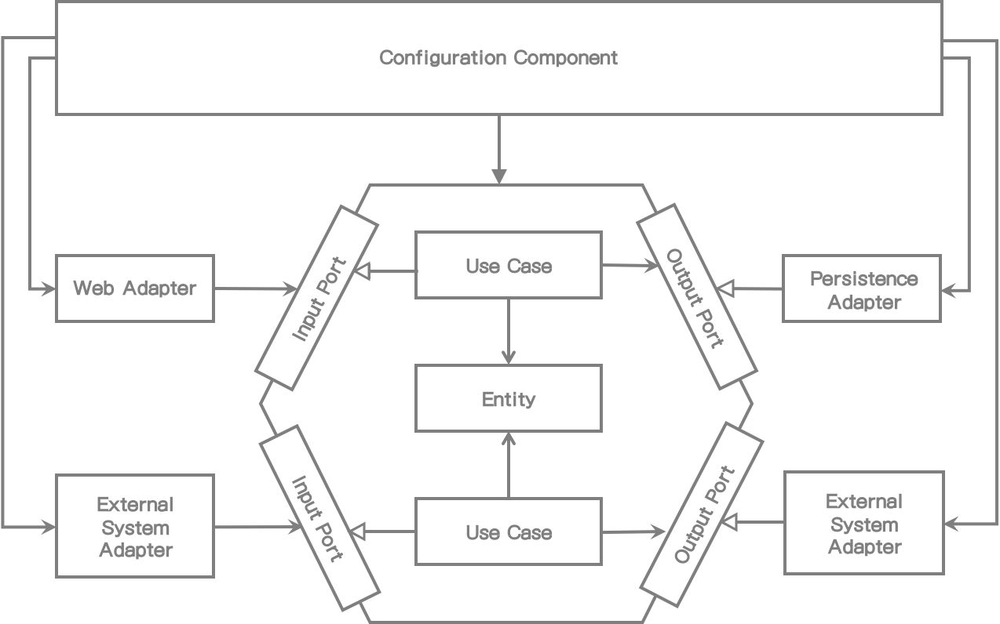

# 9. 애플리케이션 모으기

> > > 여기

이제, 우리는 몇 개의 유스케이스, 웹 어댑터, 영속성 어댑터를 구현해봤고 그것들을 하나의 애플리케이션으로 모을 필요가 있다. *3장(Organizing Code)*에서 논의한 대로 클래스를 인스턴스화 하기 위해 의존성 주입 매커니즘을 사용하고 시작할 때 연결한다. 이 장에서는, Java와 Spring 그리고 Spring Boot 프레임워크에서 사용할 수 있는 몇가지 접근법에 대해 논의할 것이다.


## 왜 조합(Assembly)에 관심을 가져야 하나?

우리는 유스케이스와 어댑터가 필요할 때 바로 그 위치에서 왜 객체생성을 하지 않았나? 왜냐하면 코드간의 의존성을 올바른 방향으로 향하게 하고 싶었기 때문이다. 기억하라: 모든 의존성은 안쪽으로, 즉 애플리케이션의 도메인 코드로 향해야 하고 외부 계층의 변화에 도메인 코드는 영향이 없어야 한다.

만약에 유스케이스에서 영속성 어댑터 호출이 필요해서 바로 객체 생성을 한다면, 이는 코드의 의존이 잘못된 방향으로 생성한 것이다. 이는 아웃바운드 포트 인터페이스를 생성한 이유이기도 하다. 유스케이스는 오직 인터페이스만 알고 런타임 시 이 인터페이스의 구현체로 제공받는다.

이런 프로그래밍 스타일의 좋은 효과는 생성하는 코드의 테스트가 용이하다는 것이다. 만일 클래스에서 필요한 모든 객체를 생성자에 넣는다면, 실제 객체 대신 목으로 전달할 수 있다. 이것이 단위테스트를 클래스와 분리하여 생성하기 쉽게 한다.

그래서 객체 인스턴스를 누가 생성해야 하나? 의존성 규칙을 위반하지 않고 어떻게 할 수 있나?

다음 그림에 나타난 대로 그 대답은 우리 아키텍처의 중립적인 위치에 있고 인스턴스화 하기 위한 모든 클래스에 의존성을 가지고 있는 구성 컴포넌트(configuration component)이어야 한다는 것이다.




[그림 9.1] 중립 구성 컴포넌트(configuration component)는 객체 생성을 위해 모든 클래스에 접근할 수도 있다.


*2장(Inverting Dependencies)*에서 소개한 클린 아키텍처에서는, 이 구성 컴포넌트(configuration component)는 최외부 원에 있고 의존성 규칙에서 정의된 모든 내부 계층에 접근할 수 있다.

구성 컴포넌트는 애플리케이션을 모으는 책임이 있다.

다음과 같을 것이다:

* 웹 어댑터 인스턴스를 생성한다.
* HTTP 요청이 실제 웹 어댑터로 전달되었는지 확인한다.
* 유스케이스의 객체를 생성한다.
* 웹 어댑터에 유스케이스 객체를 제공한다.
* 영속성 어댑터를 생성한다.
* 유스케이스에 영속성 어댑터 객체를 제공한다.
* 영속성 어댑터가 실제 데이터베이스에 접근할 수 있는지 확인한다.

그 외에, 구성 컴포넌트(configuration component)는 구성 파일 혹은 command-line 파라미터 같은 구성 파라미터의 특정 소스에 접근할 수 있어야 한다. 애플리케이션을 조합하는 동안, 구성 컴포넌트(configuration component)는 데이터베이스에 접근하거나 이메일을 발송 서버를 찾는 것과 같은 행위를 제어하기 위해 이런 파라미터를 애플리케이션 컴포넌트로 전달한다.

이런 것들은 많은 책임이 있다("변경의 이유"). 여기서 단일 책임 원칙을 위반하는 것 같지 않은가? 그렇다. 애플리케이션을 클린하게 유지하고 싶다면 연결하는 외부 컴포넌트가 필요하다. 이 컴포넌트는 동작하는 애플리케이션으로 만들기 위한 모든 것을 알아야 한다.


## 단순한 코드로 모으기

애플리케이션을 모으는 역할을 하는 구성 컴포넌트(configuration component)의 구현방법에는 여러가지가  있다. 의존성 주입 프레임워크 없이 애플리케이션을 만든다면 우리는 단순한 코드로 컴포넌트를 생성할 수 있다.

```java
package copyeditor.configuration;

class Application {
    public static void main(String [] args) {
        AccountRepository accountRepository = new AccountRepository();
        ActivityRepository acitivityRepository = new ActivityRepository();
        AccountPersistenceAdapter accountPersistenceAdapter = new AccountPersistenceAdapter(accountRepository, activityRepository);
      
        SendMoneyUseCase sendMoneyUseCase = new SendMoneyUseService(
            accountPersistenceAdapter, // LoadAccountPort
            accountPersistenceAdapter, // UpdateAccountStatePort
        );
      
       SendMoneyController sendMoneyController = new SendMoneyController(sendMoneyUseCase);
      
       startProcessingWebRequests(sendMoneyController); 
    }
}
```

이 코드는 구성 컴포넌트에 대한 단순 예제이다. Java에서는 애플리케이션이 **main** 메서드에서 시작한다. 이 메서드 내에서, 웹 컨트롤러부터 영속성 어댑터까지 우리가 필요한 모든 클래스를 인스턴스화 하고 그들을 서로 결합한다.

마지막으로, HTTP를 통해 웹 컨트롤러를 노출하는 **startProcessingWebRequests()** 이름의 신비로운 메서드를 호출한다. 이 메서드는 HTTP를 통해 웹 어댑터 노출에 필요한 시작 표시이다. 그리고 나면 애플리케이션은 요청을 처리할 준비가 된 것이다.

이 단순한 코드 접근법은 애플리케이션을 조합하는 가장 기본적인 방법이다. 하지만 몇가지 단점이 있다.

첫번째로, 이전 코드는 하나의 웹 컨트롤러, 유스케이스, 영속성 어댑터만 가지고 있다. 이 같은 코드가 엔터프라이즈 애플리케이션에서는 얼마나 많은 코드가 있어야 할 것인지 생각해봐라.

두번째는, 패키지 외부의 모든 클래스를 인스턴스화 하기 때문에 필요한 모든 클래스는 public이어야 한다. 예를 들어 public인 경우 Java에서는 유스케이스가 직접 영속성 어댑터에 접근할 수 있다는 것을 의미한다. package를 private 가시성을 사용하여 원치 않은 의존성을 피하면 좋을 것이다.

다행히도 private 의존성을 유지할 수 있는 의존성 주입 프레임워크가 있다. Spring 프레임워크는 현재 Java 진영에서 가장 인기있는 프레임워크다. Spring은 웹과 데이터베이스 지원 등 더 많은 것을 제공하므로 신비의 **startProcessingWebRequests** 메서드를 구현할 필요가 없다.


## Spring Classpath Scanning으로 조합하기

애플리케이션 조합에 Spring 프레임워크를 사용한다면, 이를 application context라고 부른다. application context는 애플리케이션을 구성하는 모든 객체를 포함한다.

Spring은 각기 장단점을 가지고 있는 application context를 조합하는 여러가지 접근 방법을 제공한다. 가장 인기있는(그리고 가장 편리한) 접근방법을 알아보자: classpath scanning

classpath scanning에서, Spring은 **@Component** 어노테이션이 있는 classpath 상의 모든 클래스를 읽어들인다. 그리고 나서 프레임워크는 그 클래스의 객체를 생성한다. *6장(Implementing a Persistence Adapter)*의 **AccountPersistenceAdapter**와 같이 클래스는 인자로 모든 필드를 가진 생성자가 있어야 한다. 

```java
@RequiredArgsConstructor
@PersistenceAdapter
class AccountPersistenceAdapter implements
		LoadAccountPort,
		UpdateAccountStatePort {

	private final AccountRepository accountRepository;
	private final ActivityRepository activityRepository;
	private final AccountMapper accountMapper;

	@Override
	public Account loadAccount(
					AccountId accountId,
					LocalDateTime baselineDate) {
	    // ...
      }
      
      @Override
	public void updateActivities(Account account) {
    	// ...
    }
}
```

이 경우에는 생성자를 작성하지 않고 **@RequireArgsContructor** 어노테이션을 이용한 Lombok 라이브러리를 사용했다. 이것은 인자로 **final** 필드를 가지는 생성자를 만든다.

Spring은 이 생성자를 찾고 필요한 인자타입의 **@Component** 어노테이션 클래스를 찾고 application context에 추가하는 단순한 방법으로 객체를 생성할 것이다. 모든 객체가 사용 가능하다면 **AccountPersistenceAdapter** 생성자를 호출할 것이고 application context 응답객체에 추가할 것이다.

classpath scanning은 애플리케이션을 조합하는데 매우 편리한 방식이다. 코드에서 **@Component** 어노테이션을 표시해야 하고 적절한 생성자를 제공해야 한다.

또한 Spring이 사용할 수 있게 우리가 만든 정형화된 유형의 어노테이션도 만들 수 있다. 예를 들어, **@PersistenceAdapter** 어노테이션을 만들 수 있다.

```java
@Target({ElementType.TYPE})
@Retention(RetentionPolicy.RUNTIME)
@Documented
@Component
public @interface PersistenceAdapter {

  @AliasFor(annotation = Component.class)
  String value() default "";

}
```

이 어노테이션은 classpath scanning하는 동안 Spring이 알 수 있는 **@Component**로 표시된 메타(meta) 어노테이션이다. 영속성 어댑터 클래스에서 애플리케이션의 일부분임을 표시하기 위해서 **@Component** 대신 **@PersistenceAdpater**를 사용할 수 있다. 이러한 어노테이션의 도움으로 아키텍처 상에서 코드를 좀 더 쉽게 읽을 수 있게 한다.

그러나 classpath scanning 접근법의 단점도 있다. 첫 번째로 클래스에 프레임워크의 특정 어노테이션을 넣어야 해서 침투성(invasive)이 높다. 만일 클린 아키텍처를 추구하는 사람이라면 프레임워크 전용 코드를 넣는 것은 금기사항이라고 말할 것이다.

나는 일반적인 애플리케이션 개발에서, 단일 어노테이션을 클래스에 붙이는 것은 큰 문제는 아니며 필요 시 쉽게 리팩토링 될 수 있다고 생각한다.

하지만, 다른 개발자가 사용할 라이브러리 혹은 프레임워크를 만들 때와 같이, 다른 의미에서는 Spring 프레임워크 의존성으로 사람들에게 영향을 주고 싶지 않기 때문에 그렇게 해서는 안될 지도 모르겠다.

classpath scanning의 다른 잠재적인 단점은 마법과 같은 일이 발생하지도 모른다는 것이다. "마법"이라는 단어는 나쁜 의미를 뜻한다. Spring 전문가가 아니어서 설명에 몇일 걸릴지 모르는 많은 일들이 발생할 수 있다는 것을 의미한다.

애플리케이션 조합에 classpath scanning은 매우 위협적인 무기와 같아서 마법과 같은 일이 발생한다. 우리는 단순하게 애플리케이션 상위 패키지에 Spring을 지정하고 **@Component** 어노테이션이 있는 클래스를 찾으라고 말한다.

애플리케이션 내에 존재하는 모든 단일 클래스를 머리 속에 기억하고 있는가? 아마 그렇지 않을 것이다. 애플리케이션 context에 두고 싶지 않는 클래스는 있기 마련이다. 아마도 이 클래스는 잘못된 방법으로 application context를 사용할 것이고 추적하기 힘든 에러를 유발할 것이다.

우리가 조금 더 직접 제어할 수 있는 방법을 한번 보자.


## Spring Java Config로 조합

classpath scanning 방식이 애플리케이션을 조합하는데 곤봉(cudgel)이라면 Spring Java Config는 수술용 칼(scalpel)이다. 이 접근법은 이 장의 처음에 소개했던 단순한 코드로 모으는 방법과 유사하다. 하지만 단순하고 프레임워크를 통해 적용할 수 있어서 모든 것을 수작업으로 할 필요가 없다.

이 접근법에서는 application context에 추가되어야 하는 beans 생성 책임이 있는 구성 클래스를 만든다.

예를 들어 영속성 어댑터의 객체를 생성하는 configuration 클래스를 만들 수 있다.

```java
@Configuration
@EnableJpaRepositories
class PersistenceAdapterConfiguration {
    @Bean
    AccountPersistenceAdapter accountPersistenceAdapter(
        AccountRepository accountRepository,
        ActivityRepository activityRepository,
        AccountMapper accountMapper) {
        	return  new AccountPersistenceAdapter(
           		 accountRepository,
            	  activityRepository,
           	 	  accountMapper
        	);
    }
  
    @Bean
    AccountMapper accountMapper() {
        return new AccountMapper();
    }
}
```

**@Configuration** 어노테이션으로 Spring이 해당 클래스를 classpath scanning을 할 수 있도록 configuration 클래스로 표시한다. 그래서 이 경우에는, 여전히 classpath scanning을 사용하지만 모두 단일 bean을 사용하는 대신 구성 클래스에서 선택한 것만 사용한다. 이는 악마와 같은 매직이 발생할 가능성을 줄여준다.

Beans는 구성 클래스의 **@Bean** 어노테이션 팩토리 메서드 내에서 생성된다. 이전 경우에서는 영속성 어댑터를 application context에 추가한다. 두 개의 리포지토리가 필요하고 생성자를 매핑한다. Spring 자동적으로 팩토리 메서드의 입력값으로 이 객체들을 제공한다.

그러나 Spring은 리포지토리 객체를 어디에서 가져오는 것일까? 다른 configuration 클래스의 팩토리 메서드에서 수동으로 생성했다면 Spring은 자동으로 입력 파라미터로 제공할 것이다. 하지만 이 경우에는 **@EnableJpaRepositories** 어노테이션으로 Spring이 생성했다. Spring Boot가 이 어노테이션을 찾는다면 자동으로 Spring Data 리포지토리 인터페이스의 구현체를 제공할 것이다.

Spring Boot에 익숙하다면 class configuration 대신에 **@EnableJpaRepositories** 어노테이션을 메인 클래스에 추가했다는 것을 알 것이다. 그렇다. 이렇게 할 수도 있지만 애플리케이션이 기동될 때마다 Java Persistence API (JPA) 리포지토리를 활성화할 것이다. - 심지어 영속성을 필요로 하지 않는 테스트로 시작하더라도. 그래서 "feature annotations"을 개별 구성 "module"로 옮김으로써, 더욱 유연해지고 항상 전체를 시작하지 않고 부분적으로 시작할 수 있다.

**PersistenceAdapterConfiguration** 클래스로, 우리는 영속성 계층에 필요한 모든 객체를 생성하는 강하게 엮여있는 영속성 모듈을 만들었다. 이는 Spring classpath scanning에 의해 자동으로 선택될 것이며 application context에 추가된 beans에 대한 제어를 가질 것이다.

비슷하게 웹 어댑터에 대한 구성 클래스 혹은 애플리케이션 계층 내에 특정 모듈을 만들 수 있다. 그리고 나서 특정 모듈을 포함하지만 테스트할 때 유연함을 제공하는 다른 모듈의 beans을 목객체로 제공하는 application context를 만들 수 있다. 우리 코드에서 그러한 모듈에 대한 코드를 사용할 수도 있거나 Java Archive(JAR) 파일을 사용할 수도 있다.

또한 classpath scanning방식에서 했던 것처럼, 이런 접근법은 **@Component** 어노테이션을 코드상에 흩어지지 않게 한다. Spring 의존성 없이 애플리케이션 계층을 깨끗하게 유지할 수 있다.

그러나 이런 해결책에는 문제가 있다. 구성 클래스가 생성한 bean의 클래스와 동일한 패키지 내에 있지 않는다면 클래스 파일이 public이어야만 한다. 가시성을 제한하기 위해 모듈 경계로서 패키지를 사용할 수 있고 전용 구성 클래스를 각각 패키지로 사용할 수 있다. 하지만, 이런 방식으로는 *10장(Enforcing Architecture Boundaries)*에 논의될 하위 패키지를 사용할 수 없다.


## How Does This Help Me Build Maintainable Software?

Spring과 Spring Boot는 편리한 많은 기능을 제공한다. 주요 특징 중 하나는 개발자가 직접 하는 것처럼 애플리케이션을 모아주는 것이다.

classpath scanning은 매우 편리한 기능이다. Spring으로 하여금 패키지를 지정하고 클래스로부터 모으게 한다. 이것으로 인해 애플리케이션에 대해 생각할 필요가 없는 빠른 개발를 하게 해준다. 

코드라인이 점점 많아짐에 따라 이것은 투명성이 부족할 수 있다. 어느 bean이 application context에 로드되었는지 모른다. 또한 테스트에서 사용될 applicaiton context부분을 분리하여 쉽게 시작할 수도 없다.

애플리케이션을 조합하는데 책임이 있는 전용 구성 컴포넌트를 만듦으로써 애플리케이션 코드에서 이런 책임을 분리할 수 있다. (변경의 이유) - SOLID의 S를 기억하라. 서로 격리되어 시작할 수 있으면 매우 응집된 모듈의 가치가 있고 쉽게 코드 내에서 옮길 수 있다. 일반적으로 구성 컴포넌트를 유지하는데는 더 많은 시간이 필요하다.

