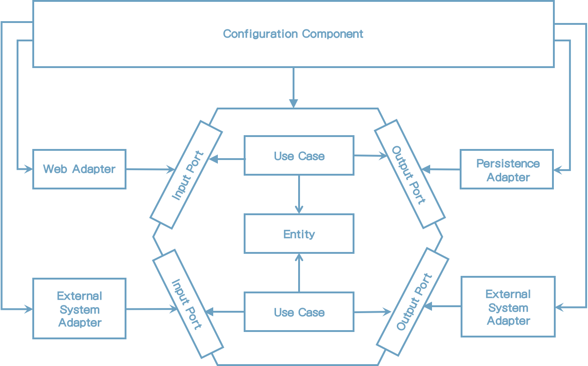

# 9 Assembling the Application

몇개의 유스케이스, 웹 어댑터, 영속성 어댑터를 구현했고 하나의 작동하는 애플리케이션으로 모을 필요가 있다. 3장(Organizing Code)에서 논의한 대로 클래스를 인스턴스화 하기 위해 의존성 주입을 사용하고 시작 시 연결한다. 이 장에서 java와 Spring 그리고 Spring Boot 프레임워크를 어떻게 사용할 수 있는지에 대한 방법을 논의할 것이다.


## Why Event Care About Assembly?

우리는 유스케이스와 인스턴스를 필요할 때 인스턴스를 하지 않았나? 왜냐하면 코드 의존성을 올바른 방향으로 가리키게 하고 싶었기 때문이다. 모든 의존성은 내부인 애플리케이션의 도메인 코드로 향해야 하고 도메인 코드는 외부 레이어 변화에 영향이 없어야 한다.

유스케이스가 영속성 어댑터를 호출할 필요가 있고 인스턴스화 한다면 우리는 코드 의존성을 잘못된 방향으로 생성했다는 것을 의미한다. 우리가 외부 포트 인터페이스를 생성한 이유이다. 유스케이스는 오직 인터페이스만 알고 있고 런타임 시 이 인터페이스의 구현체로 제공받는다.

이러한 프로그래밍 스타일의 좋은 부족용은 생성하는 코드가 테스트가 용이하다는 것이다. 만일 클래스가 필요한 모든 객체를 생성자에 넣는다면 실제 객체 대신에 mock으로 전달할 수 있다. 이것은 클래스의 격리된 단위 테스트를 생성하기 쉽게 한다.

그래서 객체 인스턴스를 누가 생성해야 하나? 의존성 규칙을 위반하지 않고 어떻게 할 수 있나?

그 대답은 다음 그림에 나타난 대로 우리 아키텍처에 중립이며 인스턴스 하기 위해 모든 클래스에 의존성이 있는 configuration component이어야 한다는 것이다.



[그림 9.1] neutral configuration component는 인스턴스화 하기 위해 모든 클래스에 접근할 지도 모른다.

2장(Inverting Dependencies)에서 소개한 클린 아키텍처에서 이 구성 컴포넌트는 최외각 원에 있고 의존성 규칙에 정의된 모든 내부 레이어에 접근할 수 있다.

Configuration component는 우리가 제공하는 애플리케이션을 모으는 책임이 있다.

It must:

* 웹 어댑터를 생성
* HTTP 요청이 실제 웹 어댑터로 전달되었는지 확인
* 유스케이스의 웹 어뎁터 인스턴스화
* 영속성 어댑터 생성
* 영속성 어댑터의 유스케이스 생성
* 영속성 어댑터가 실제 데이터베이스에 접근하는지 확인

게다가, configuration component는 구성 파일 혹은 command-line 파라미터 같은 구성 파라미터의 특정 소스를 접근할 수 있어야 한다. 애플리케이션 조합 동안, 구성 컴포넌트는 데이터베이스에 접근하거나 이메일을 발송하는것과 같은 행위를 제어하기 위해 이 파라미터를 애플리케이션 컴포넌트로 전달한다.

많은 책임이 있다. (변경의 이유). 여기서 단일 책임 원칙을 위배하는 것 같지 않은가? 그렇다. 애플리케이션을 클릭하게 유지하고 싶다면 연결에 관심이 있는 외부 컴포넌트가 필요하다. 이 컴포넌트는 애플리케이션으로 조합하는 모든 것을 알아야 한다.


## Assembling via Plain Code

애플리케이션을 조합하는데 책임이 잇는 구성 컴포넌트를 구현하는 여러가지 방법이 있다. 의존성 주입 프레임워크 없이 애플리케이션을 만든다면 단순히 컴포넌트를 생성할 수 있다.

```java
package copyeditor.configuration;

class Application {
    public static void main(String [] args) {
        AccountRepository accountRepository = new AccountRepository();
        ActivityRepository acitivityRepository = new ActivityRepository();
        AccountPersistenceAdapter accountPersistenceAdapter = new AccountPersistenceAdapter(accountRepository, activityRepository);
      
        SendMoneyUseCase sendMoneyUseCase = new SendMoneyUseService(
            accountPersistenceAdapter, // LoadAccountPort
            accountPersistenceAdapter, // UpdateAccountStatePort
        );
      
       SendMoneyController sendMoneyController = new SendMoneyController(sendMoneyUseCase);
      
       startProcessingWebRequests(sendMoneyController); 
    }
}
```

이 코드는 구성 콤포넌트가 어떻게 보이는지에 대한 단순 예제이다. java에서는 애플리케이션이 main 메소드에서 시작한다. 이 메소드 내에서 웹 컨트롤러에서 영속성 어댑터로, 그리고 그들을 결합하는 등 필요한 모든 클래스를 인스턴스화 한다.

마지막으로 HTTP를 통한 웹 컨트롤러를 노출하는 startProcessingWebRequests() 메소드를 호출한다. 이 메서드는 HTTP를 통한 웹 어댑터를 노출하는데 필요한 시작 로직에 대한 표시이다. 애플리케이션은 요청을 처리할 준비가 된 것이다.

이 단순한 코드 접근은 애플리케이션을 조합하는 가장 기본적인 방법이다. 하지만 몇가지 단점이 있다.

첫번째로 이전 코드는 하나의 웹 컨트롤러, 유스케이스, 퍼시스턴스 어댑터만 가지고 있다. 이같은 코드가 엔터프라이즈 애플리케이션에서는 얼마나 많은 코드가 있어야 할 것이라고 생각해봐라.

두번째는 패키지 외부의 모든 클래스를 인스턴스화 하기 때문에 필요한 모든 클래스는 public이어야 한다. 예를 들어 java는 public이기 때문에 유스케이스가 직접 영속성 어뎁터에 접근을 방해하지 않는다는 것을 의미한다. package를 private 가시성을 사용하여 원치 않은 의존성을 피하면 좋을 것이다.

운좋게도 private 의존성을 유지할 수 있도록 의존성 주입 프레임워크가 있다. Spring 프레임워크는 현자 java 진영에서 가장 인기가 좋은 프레임워크이다. Spring은 웹과 데이터베이스 지원과 다른 많은 것을 지원하므로 startProcessingWebRequests를 구현할 필요가 없다.


## Assembling via Spring's Classpath Scanning

애플리케이션 조합에 Spring 프레임워크를 사용한다면 Application context를 사용하는 것이다. application context는 애플리케이션을 구성하는 모든 객체를 포함한다.

Spring은 각각의 장단점을 가지고 있는 application context를 조합하는 여러가지 접근 방법을 제공한다. 가장 인기있는 접근방법을 알아보자: classpath scanning

클래스패스 스캐닝으로 Spring은 @Component 어노테이션이 있는 클래스패스상의 모든 클래스를 읽어들인다. 프레임워크는 클래스의 객체를 생성한다. 6장(Implementing a Persistence Adapter)의 AccountPersistenceAdapter와 같이 클래스는 인자로 모든 필드를 가진 생성자가 있어야 한다. 

```java
@RequiredArgsConstructor
@PersistenceAdapter
class AccountPersistenceAdapter implements
		LoadAccountPort,
		UpdateAccountStatePort {

	private final AccountRepository accountRepository;
	private final ActivityRepository activityRepository;
	private final AccountMapper accountMapper;

	@Override
	public Account loadAccount(
					AccountId accountId,
					LocalDateTime baselineDate) {
	    // ...
      }
      
      @Override
	public void updateActivities(Account account) {
    	// ...
    }
}
```

이 경우에 생성자를 작성하지 않고 @RequireArgsContructor 어노테이션을 사용한 Lombok 라이브러리를 사용했다. 이것은 final 필드의 인수를 생성자를 생성한다.

Spring은 이 생성자를 찾고 필요한 인자타입의 @Component 어노테이션 클래스를 찾고 application context에 추가함으로써 객체를 생성할 것이다. 모든 객체가 사용 가능하다면 AccountPersistenceAdapter 생성자를 호출할 것이고 application context 응답객체에 추가할 것이다.

클래스패스 스캐닝은 애플리케이션을 조합하는데 매우 편리한 방식이다. 코드에서 @Component 어노테이션을 표시해야 하고 적절한 생성자를 제공해야 한다.

또한 Spring이 선택하게끔 자신만의 어노테이션을 만들 수 있다. 예를 들어 @PersistenceAdapter 어노테이션을 만들 수 있다.

```java
@Target({ElementType.TYPE})
@Retention(RetentionPolicy.RUNTIME)
@Documented
@Component
public @interface PersistenceAdapter {

  @AliasFor(annotation = Component.class)
  String value() default "";

}
```

이 어노테이션은 클래스패스 스캐밍하는 동안 Spring이 알게 하기 위해 @Component로 표시된 메타 어노테이션이다. 애플리케이션에서 영속성 어댑터 클래스에 @Component 대신 @PersistenceAdpater를 사용할 수 있다. 그래서 아키텍처로 하여금 코드를 더 분명하게 나타낸다.

그러나 클래스패스 스캐닝 접근법은 단점도 있다. 첫번째로 클래스에 프레임워크 전용 어노테이션을 넣어야 하는 하는 것은 침투성이 높다. 당신이 클린 아키텍처 강경파라면 프레임워크 전용 코드를 넣는것은 금지라고 말할 것이다.

일반적인 애플리케이션 개발에서 클래스에 단일 어노테이션은 큰 문제가 안되며 필요 시 쉽게 리팩토링 될 수 있다고 말할 것이다.

다른 개발자가 사용할 라이브러리 혹은 프레임워크 개발할 때와 같이 다른 의미에서는 Spring 프레임워크 의존성으로 사람들에게 영향을 주고 싶지 않기 때문에 해서는 안될지도 모르겠다.

클래스패스 스캐닝의 다른 잠재적인 단점은 마법과 같은일이 발생하지도 모른다는 것이다. "마법"이라는 단어를 나쁜 의미를 의미한다. Spring 전문가가 아니므로 설명하는데 몇일 걸릴지 모르는 설명할 수 없는 일들이 발생할 수 있다는 일들을 의미한다.

애플리케이션 조합에 클래스 패스 스캐잉은 매우 무딘 무기이기 때문에 마법이 일어난다. 우리는 애플리케이션 상위 패키지에 Spring을 지정하고 @Component 어노테이션 클래스를 찾으라고 말한다.

애플리케이션 내에 존재하는 모든 단일 클래스를 마음으로 알고 있는가? 아마도 그렇지 않을 것이다. 애플리케이션 context에 있길 원하지 않는 클래스에 경계가 있다. 아마도 이 클래스는 나쁜 방법으로 applicaiton context를 사용할 것이고 추적하기 힘든 에러를 유발할 것이다.

약간 더 통제할 수 있는 또 다른 접근법을 보자.


## Assembling via Spring's Java Config

클래스패스 스캐닝이 애플리케이션 조합의 곤봉(cudgel)이라면 Spring의 Java Config는 수술용 칼(scalpel)이다. 이 접근법은 이 장의 처음에 소개했던 단순 코드 접근법과 유사하다. 덜 복잡하고 프레임워크를 제공해서 손으로 모든것을 작성할 필요가 없다.

이 접근법에서 application context에 추가되어야 하는 beans를 구성하는데 책임이 있는 구성 클래스를 만든다.

예를 들어 영속성 어댑터를 객체화하는데 책임이 있는 구성 클래스를 만들수 있다.

```java
@Configuration
@EnableJpaRepositories
class PersistenceAdapterConfiguration {
    @Bean
    AccountPersistenceAdapter accountPersistenceAdapter(
    	AccountRepository accountRepository,
        ActivityRepository activityRepository,
        AccountMapper accountMapper) {
        return  new AccountPersistenceAdapter(
        	accountRepository,
            activityRepository,
            accountMapper
        );
    }
  
    @Bean
    AccountMapper accountMapper() {
        return new AccountMapper();
    }
}
```

@Configuration 어노테이션은 이 클래스로 하여금 Spring의 클래스패스 스캐닝을 할 수 있도록 구성 클래스로 표시한다. 그래서 이 경우에는 여전히 클래스패스 스캐닝을 사용하지만 악마같은 매직이 발생할 가능성을 줄여주는 모든 단일 빈을 사용하는 대신 구성 클래스에서 선택한 것만 사용한다.

Beans는 구성 클래스의 @Bean 어노테이션 팩토리 메소드 내에 생성된다. 이전 케이스에선 영속성 어댑터를 application context에 추가한다. 두 개의 리포지토리가 필요하고 생성자를 매핑한다. 스프링은 자동적으로 팩토리 메서드에서 입력값으로 이 객체를 제공한다.

그러나 스프링이 리포지토리 객체를 어디에서 가져오는 것일까? 다른 구성 클래스의 팩토리 메소드에서 수동으로 생성했다면 스프링은 자동으로 입력 파라미터로 제공할 것이다. 이 경우에는 @EnableJpaRepositories 어노테이션에서 스프링이 생성하였다. 스프링 부트가 이 어노테이션을 찾는다면 자동으로 Spring Data 리포지토리 인터페이스의 구현을 제공할 것이다.

스프링 부트에 익숙하다면 클래스 구성 대신에 @EnableJpaRepositories 어노테이션을 메인 클래스에 추가했다는 것을 알것이다. 그렇다. 이것은 가능한 일이지만 애플리케이션이 기동될 때마다 Java Persistence API (JPA) 리포지토리를 활성화 하는 것이다. - 심지어 영속성을 필요로 하지 않는 테스트로 시작하더라도. 그래서 "feature annotations"을 개별 구성 "module"로 옮김으로써, 전체를 시작하는 대신 더욱 유연하고 애플리케이션 각 부분을 시작할 수 있다.

PersistenceAdapterConfiguration 클래스에 우리는 영속성 레이어에 필요한 모든 객체를 인스턴스화 하는 강하게 엮어있는 영속성 모듈을 만들었다. 스프링 클래스패스 스캐닝에 의해 자동으로 선택될 것이며 application context에 추가된 beans에 대한 제어를 가질 것이다.

비슷하게 웹 어댑터에 대한 구성 클래스 혹은 애플리케이션 레이어 내에 특정 모듈을 만들 수 있다. 그리고 나서 특정 모듈을 포함하지만 테스트할 때 유연함을 제공하는 다른 모듈의 beans을 mock하는 application context를 만들 수 있다. 우리의 코드에서 그러한 모듈에 대한 코드를 사용할 수도 있거나 Java Archive(JAR) 파일을 사용할 수도 있다.

또한 이런 접근법은 클래스패스 스캐닝방식이 했던 것처럼 @Component 어노테이션을 코드상 흩트러지게 하지 않는다. 스프링 의존성이 없이 애플리케이션 레이어를 깨끗하게 유지할 수 있다.

그러나 이러한 해결책에는 문제가 있다.구성 클래스가 생성한 bean의 클래스와 동일한 패키지 내에 있지 않는다면 클래스파일이 public이어야만 한다. 가시성을 제한하기 위해 모듈 경계로서 패키지를 사용할 수 있고 전용 구성 클래스를 각각 패키지로 사용할 수 있다. 하지만, 이런식으로 10장(Enforcing Architecture Boundaries)에 논의될 하위 패키지를 사용할 수 없다.


## How Does This Help Me Build Maintainable Software?

Spring과 Spring Boot는 편리한 많은 기능을 제공한다. 주요 특징 중 하나는 개발자가 하듯이 애플리케이션을 모아주는 것이다.

클래스패스 스캐닝은 매우 편리한 기능이다. 스프링으로 하여금 파키지를 지정하고 클래스로 부터 모으게 한다. 이것으로 인해 애플리케이션에 대해 생각할 필요가 없는 빠른 개발를 하게 해준다. 

코드라인이 점점 많아짐에 따라 이것이 투명성 부족이 될 수 있다. 어느 bean이 applicaiton context에 로드되었는지 모른다. 또한 테스트에서 사용될 applicaiton context의 분리된 부분을 쉽게 시작할 수도 없다.

애플리케이션을 조합하는데 책임이 있는 전용 구성 컴포넌트를 만듦으로써 애플리케이션 코드로 하여금 이런 책임으로 부터 독립하게 할 수 있다. (변경의 이유) - SOLID의 S를 기억하라. 서로 격리되어 시작할 수 있으면 매우 응집된 모듈의 가치가 있고 쉽게 코드내에서 옮길수 있다. 일반적으로 구성 컴포넌트를 유지하는데 추가적인 시간을 보내는 대가이다.

