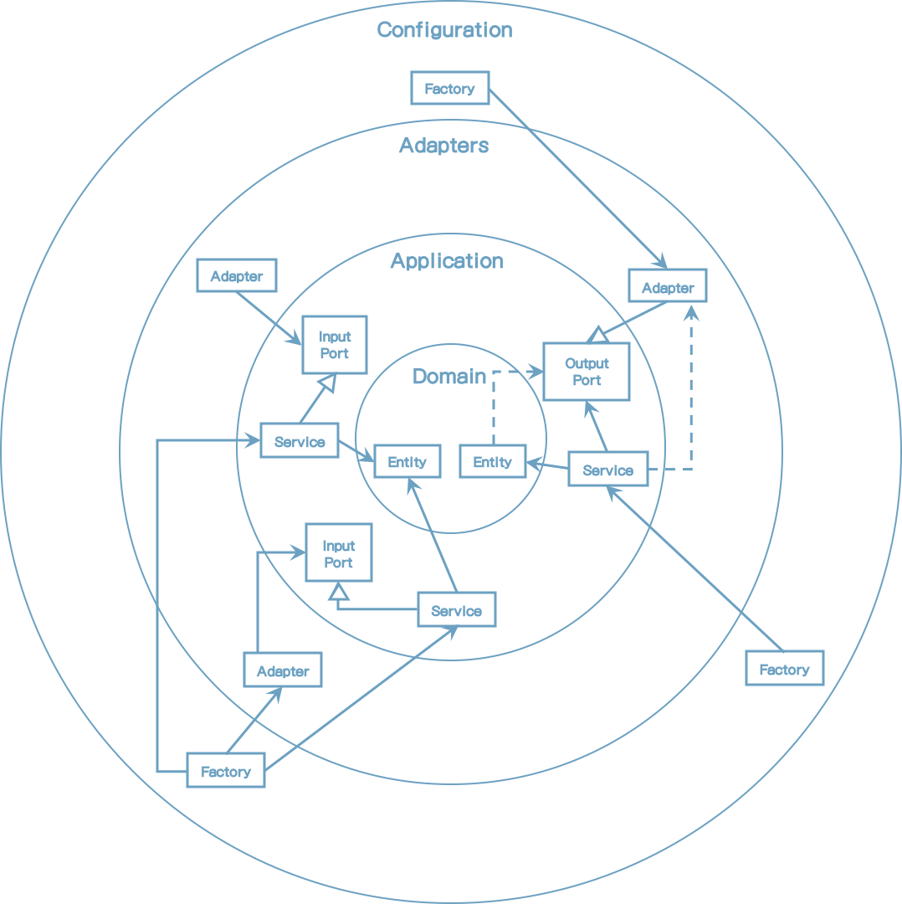
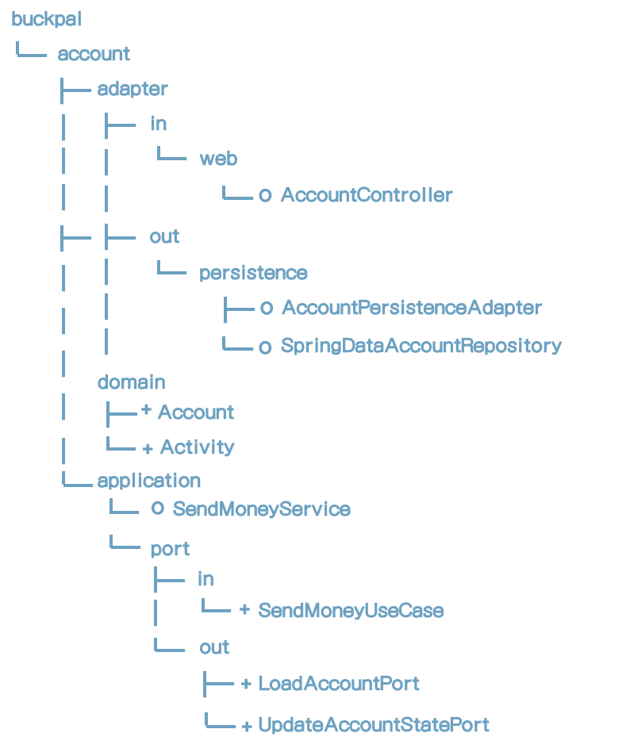
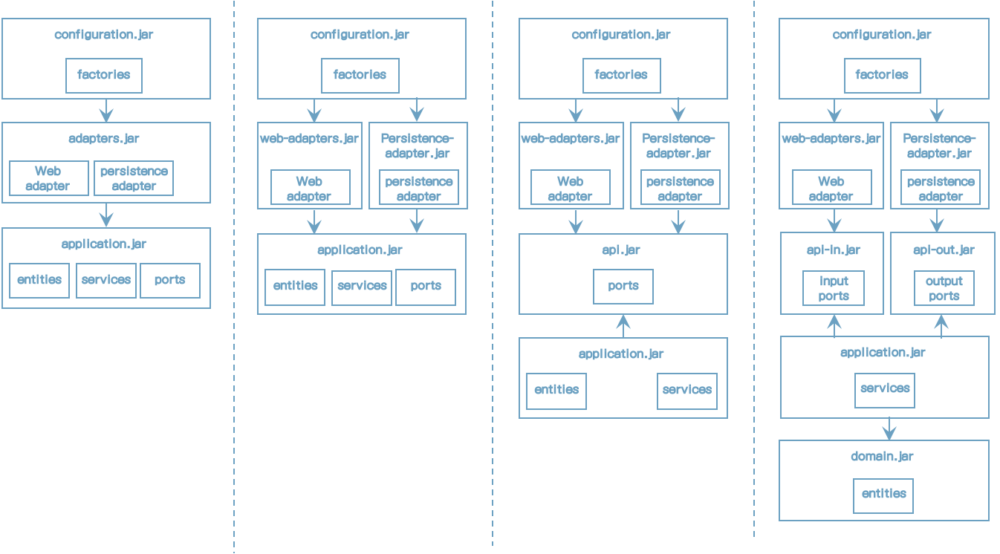

# 10 Enforcing Architecture Boundaries

우리는 이전 장에서 아키텍처에 대해 많은 이야기를 했고코드를 작성하고 어디에 두어야 할지 결정하는 가이드를 해주는 아키텍처를 가지게 되어 기분이 좋다.

위의 소프트웨어 프로젝트에서 아키텍처는 시간이 지남에 따라 훼손되는 경향이 있다. 레이어 사이의 경계는 약해지고 코드는 테스트가 힘들며 새 기능 개발에 더 많은 시간이 필요하다.

이 장에서 아키텍처 경계를 강화하고 훼손을 맞서 싸울수 있는 방법들은 알아볼 것이다.


## Boundaries and Dependencies

아키텍처 경계를 강화하는 다른 방법을 알아보기 전에 경계가 아키텍처내에 어디에 있고 경계를 강화하는 일이 무엇인지 알아보자.




[그림 10.1] 아키텍처 경계를 강화하는 것은 올바른 방향으로 의존성을 가르키도록 강화하는 것을 의미한다. 점섬 화살표는 아키텍처에 허용되지 않는 의존성을 나타낸다.

이전 그림은 헥사고날 아키텍처의 요소가 2장(Inverting Dependencies)에서 소개한 클린 아키텍처와 유사항 네 개의 레이어로 분산되어 있는 것을 나타낸다.

최내부의 레이어는 도메인 엔티티를 포함한다. 애플리케이션 레이어는 이 도메인 엔티티가 애플리케이션 서비스 내부 유스케이스를 구현하도록 접근할지도 모른다. 어댑터는 내부 포트 혹은 외부 포트의 서비스에 의해 접근될 수 있다. 마지막으로 Configuration 레이어는 어댑터와 서비스 객체를 생성하고 의존성 주입 매커니즘을 제공한다.

이전 그림에서, 아키텍처 경계는 꽤 분명해진다. 각 레이어와 내/외부 간에 경계가 있다. 의존성 규칙에 따르면 그러한 레이어 경계 사이의 의존성은 항상 내부를 향해야만 한다.

이 장은 의존성 규칙을 강화하는 방법에 관한 내용이다. 잘못된 방향을 가르키는 의존성이 없기를 바란다. (그림에서 점선 화살표)


## Visibility Modifiers

java에서 경계를 강화하는 기본적인 도구를 한번 보자.

접근 제어자는 지난 몇년동안 했던 면접시험에서 항상 나왔던 질문이었다. 나는 지원자들에게 접근 제어자가 무엇이며 차이점이 무엇인지 질문했었다.

지원자 대부분은 public, protected, private 제어자만 이야기했다. 대부분 Package private(혹은 default)에 대해서는 아무도 몰랐다. 접근 제어자가 이전 지식의 대답을 추상화할 수 있는지 알아낼 수 있는지 지원자에게 물어보는 것은 좋은 기회였다.

그래서, package private 제어자가 왜 중요할까? 왜냐하면 java package는 클래스를 응집력있는 모듈로 그룹핑 하도록 하기 때문이다. 모듈 내의 클래스는 서로 볼 수 있지만 패키지 외부에서는 접근할 수 없다. 모듈의 진입점으로서 클래스를 public으로 명시할 수도 있다. 이것은 잘못된 방향으로 의존성을 도입하는 의존성 규칙을 위한하는 위험을 줄여준다.

3장(Organizing Code)에서 논의한 패키지 구조를 다시 한번 보자.



[그림 10.2] 패키지 구조의 접근 제어자

외부에서 접근할 필요가 없기 때문에 영속성 패키지 클래스를 package-private(위의 그림에서 "o"로 표시)으로 할 수 있다. 영속성 어댑터는 구현하는 외부 포트를 통해서 접근된다. 같은 이유로 SendMoneyService 클래스를 package-private으로 할 수 있다. 일반적으로 의존성 주입 메커니즘은 클래스를 인스턴스 하는데 리플렉션을 사용한다. 그래서 여전히 package-private일지라도 클래스를 인스턴스화 할 수 있다.

스프링으로 9장(Asssembling with Application)에 논의한 클래스패스 스캐닝 방법을 상요하며 이 접근방법이 작동한다. 하지만 다른 접근방법은 객체 생성을 public 접근을 필요로 하는 객체 자신의 인스턴스를 생성을 필요로 한다.

예제에서 클래스의 나머지 부분은 아키텍처 정의 상 public이어야만 한다(+로 표시).  도메인 패키지는 다른 레이어에서 접근이 필요하고 애플리케이션 레이어는 웹과 영속성 어댑터에서 접근이 필요하다.

package-private 제한자는 매우 작은 모듈에 효과가 크다. 패키지가 클래스에 도달할 때 동일 패키지에 많은 클래스를 가지고 있으면 혼란스럽다. 이 경우에 코드를 찾기 쉽게 하기 위해서 서브 패키지를 만들 것이다. java는 서브패키지를 다른 패키지로 인식하고 서브패키지의 package-private 멤버를 접근할 수 없기 때문에 private-package 제어자가 실패하는 지점이기도 하다. 그래서 서브 패키지내의 멤버는 public이어야 하고 외부 세계에 노출하여 잘못된 의존관계에 취약하게 만든다.


## Post-Compile Checks

클래스에 public modifier를 사용하면 의존성 방향이 잘못된 방향일 지라도 컴파일러는 다른 클래스가 그 클래스를 사용하게 한다. 컴파일러는 이런 케이스에는 도움이 되지 않으므로 의존성 규칙이 위배되었는지 체크하는 다른 방법을 강구해야 한다.

하나의 방법은 post-compile 체크를 도입하는 것이다. 말하자면 코드가 컴파일 되었을 때 런타임시 수행되는 체크이다. 그런 런타임 체크는 지속적인 통합 빌드 내에 자동화 테스트 수행에 최적이다.

java에서 이런 종류의 체크를 하는 도구는 ArchUnit이 있다. 다른 툴 중에서 ArchUnit은 의존성이 예상 방향으로 나타나는지 체크하는 API를 제공한다. 위배되었을 때 예외를 던진다. 의존성 위반 시 테스트가 실패하도록 JUnit 같은 단위 테스트 프레임워크에서 실행할 때 좋다.

이전 장에서 논의한 패키지 구조에서 정의된 것처럼, 각 레이어는 자신의 패키지를 가지고 있다고 가정하고 ArchUnit으로 레이어 사이의 의존성을 체크할 수 있다. 예를 들어 도메인 레이어에서 외부 애플리케이션 레이어로의 의존성이 없는 것을 확인할 수 있다.

```java
class DependencyRuleTests {
    @Test
    void domainLayerDoesNotDependOnApplicationLayer() {
        noClasses()
        .that()
        .resizeInPackage("buckpal.domain..")
        .should()
        .dependOnClassesThat()
        .resideInAnyPackage("buckpal.application..")
        .check(new ClassFileImporter()
              .importPackages("buckpal.."));
    }
}
```

약간의 작업으로 헥사고날 아키텍터 내부의 패키지를 명시하도록 하는 ArchUUnit API의 DSL(Domain Specific Language)을 만들 수 있고 자동적으로 패키지가 올바른 방향으로 의존성을 가지는지 확인할 수 있다.

```java
class DependencyRuleTests {

	@Test
	void validateRegistrationContextArchitecture() {
		HexagonalArchitecture.boundedContext("io.reflectoring.buckpal")
				.withDomainLayer("domain")
				.withAdaptersLayer("adapter")
				.incoming("web")
				.outgoing("persistence")
				.and()
				.withApplicationLayer("application")
				.services("service")
				.incomingPorts("port.in")
				.outgoingPorts("port.out")
				.and()
				.withConfiguration("configuration")
				.check(new ClassFileImporter()
						.importPackages("io.reflectoring.buckpal.."));
	}
}
```

이전 코드 예제에서, 바운디드 컨텍스트의 상위 패키지를 확인했다(단일 바운디드 컨텍스트로만 사용되면). 그리고 나서 도메인, 어댑터, 애플리케이션, configuration 레이어의 서브 패키지를 확인한다. 파지막 check()을 호출하면 실제로 실행되고 패키지 의존성이 의존 규칙에 따라 유효한지 확인한다. 이 헥사고날 아키텍처 DSL 코드는 HezogonalArchitecture 예제 클래스는 https://github.com/thombergs/buckpal 에서 받을 수 있다.

post-compile 부적절한 의존성 확인해 많은 도움이 되지만 만능책은 아니다. 이전 코드 예제에서 buckpal 이름을 잘못 썼다면 테스트를 실행할 클래스가 없고 의존관계 실패도 하지 않을 것이다. 단 하나의 오타 혹은 더 중요한 리팩토링이 테스트를 유용하지 못하게 할 수 있다. 클래스가 없는 경우에 실패하는 케이스를 추가함으로써 이 경우를 수정할 수 있지만 리팩토링에는 여전히 취약하다. post-compile 체킹은 코드와 병행하여 유지되어야 한다.


## Build Artifacts

지금까지 코드 상 아키텍처 경계를 표시하는 유일한 도구는 패키지이다. 우리 코드는 모노리틱 빌드 아키텍트였다.

빌드 아티팩트는 빌드의 결과다. java 진영에서 가장 인기있는 빌드 도구는 maven과 gradle이다. 지금까지 단일 maven 혹은 gradle 스크립트를 가지고 있고 컴파일, 테스트, 단일 jar파일로 패키징한다는 것을 생각해봐라.

빌드 도구의 주요 기능은 의존성 해결이다. 특정 코드를 빌드 아티팩트로 변환하기 위해서 빌드 도구는 먼저 의존하는 모든 아티팩트가 사용 가능한지 체크한다. 가능하지 않다면 아티팩트 repository에서 가져오기를 시도할 것이다. 실패한다면 코드를 컴파일 하기도 전에 빌드는 에러와 함께 실패할 것이다.

우리는 아키텍터의 모듈과 레이어간의 의존관계(경계를 식별)를 강화하기 위해 이것을 활용할 수 있다.각 모듈 혹은 레이어에서 자신만의 코드와 각각 빌드 아티팩트(jar 파일)로 각각의 빌드 모듈을 만들 수 있다. 각 모듈의 빌드 스크립트에서 아키텍처에 허용된 다른 모듈과의 의존관계를 확인할 수 있다. 개발자는 클래스가 클래스패스에 없고 에러를 만날것이기 때문에 부적절한 의존관계를 만들 수 없을 것이다.



[그림 10.3] 아키텍처를 잘못된 의존을 방지하기 위해 여러 개의 빌드 아티팩트로 나누는 다른 방법

이전 그림은 아키텍처를 각각의 빌드 아티팩트로 나누는 불완전한 선택사항을 나타낸다.

왼쪽에서 시작하여 configuration, adapter, application layer에 해당하는 기본 세 개의 모듈을 확인한다. configuration 모듈은 application 모듈에 접근할 수 있는 adapter 모듈에 접근할 수 있다. configuration 모듈은 또한 그들 사이에 내포되거나 전이된 의존관계 때문에 application 모듈에 접근할 수 있다.

adapter 모듈은 persistence adapter 뿐만 아니라 web adapter를 포함하는 것을 명시하라. 이것은 빌드 도구가 그러한 adapter 사이의 의존관계를 금지하지 않는다는 것을 의미한다. 그러한 adapter 사이의 의존관계는 의존관계 규칙을 엄격히 금지하지는 않고(양쪽 adapter가 동일한 외부 레이어에 있기 때문에), 대부분의 경우 각각 분리된 adapter를 가지는 것은 합당한 일이다.

결국 persistence 레이어에서 web 레이어와 그 반대로 노출되는 것을 원하지 않는다. (단일 책임 원칙을 기억하라)

특정 써드파티 API에 애플리케이션을 연결하는 adapter와 같이 다른 유형의 adapter도 유효하다. 그러한 API가 adapter사이의 의존관계가 우연치 않게 생긱ㄴ는 것을 원하지 않는다.

그러므로, 그림 10.2의 두번째 컬럼에 표시된 것처럼, 각 adapter별 한개에 해당하는 단일 adapter 모듈을 여러개의 빌드 모듈로 나눌수도 있다.

다음으로 애플리케이션 모듈을 더 나눌지 결정할 수 있다. 현재 애플리케이션의 내외부 포트, 그 포트를 사용하는 서비스들, 도메인 로직을 포함하는 도메인 엔티티를 포함하고 있다.

도메인 엔티티가 포트 내에 객체를 전송하도록 사용되지 않기로 했다면 의존성 역전 원칙을 적용하여 포트 인터페이스만을 포함하는 개별 API 모듈을 사용할 수 있다.

어댑터 모듈과 애플리케이션 모듈은 API 모듈에 접근할 수 있지만 반대 방향은 안된다. API 모듈은 도메인 엔티티에 접근해서는 안되며 포트 인터페이스 내에서 사용할 수 없다. 또한 어댑터는 엔티티와 서비스로의 접근은 할 수 없고 포트를 통해서 해야 한다.

API 모듈을 두 개로 나눌 수도 있다. 하나는 내부 포트를 포함하고 다른 하나는 외부 포트(그림 10.1에서 네번째 컬럼)를 포함한다. 이런식으로 특정 어댑터가 입력 혹은 출력 포트만 의존함으로써 내부 어댑터이거나 외부 어댑터인지 분명히 할 수 있다.

또한, 서비스와 다른 도메인 엔티티만 포함하는 모듈을 만듦으로써 애플리케이션 모듈을  나눌 수 있다. 이것ㅇ느 엔티티가 서비스에 접근하지 않고 다른 애플리케이션(다른 유스케이스와 다른 서비스)이 도메인 빌드 아티팩트상의 의존관계를 선언함으로써 동일 도메인 엔티티를 사용하게 한다는 것을 확인한다.

그림 10.2는 애플리케이션을 빌드 모듈로 나누는 많은 다양한 방법을 나타내고 그림에서 묘사된 네 가지 이외의 방법이 있다. 핵심은 모듈을 더 잘게 나누면 그들 사이의 의존관계를 더 많이 제어할 수 있다는 것이다. 더 잘게 나누면 모듈사이에 더 많은 매핑 있고 8장(Mapping between Boundaries)에서 설명한 매핑 전략이 필요하다.

게다가 빌드 모듈로 아키텍처 경계를 명확히 하는 것은 경계로써 단순 패키지를 사용하는 것에 대한 많은 이득이 가져다 줄 수 있다.

우선, 빌드 툴은 순환 의존성을 절대적으로 싫어한다. 순환 의존관계는 하나의 모듈의 변화가 다른 모듈의 변화를 의미하므로 나쁜 방법이고 단일 책임 원칙의 위반이다. 빌드 툴은 무한루프를 만들 수 있기 때문에 순환 의존을 허용하지 않는다. 그러므로 빌드 모듈 사이에 순환 의존이 없다는 것을 확인할 수 있다.

반면에, java 컴파일러는 두개 혹은 그 이상 패키지에서 순환 의존성이 있는지 관심이 없다.

두번째, 빌드 모듈은 다른 모듈을 고려하지 않고 특정 모듈 내의 분리된 코드 변화를 허용한다. 특정 어댑터의 일시적인 컴파일 에러를 유발하는 애플리케이션 레이어의 주요 리팩토링을 해야 한다고 가정해보자. 어댑터와 애플리케이션 레이어가 동일 빌드 모듈에 있다면 어댑터의 컴파일 에러를 발생시키는 대부분의 IDE는 어댑터가 수정될 필요가 없을지라도 애플리케이션 레이어에서 테스트를 실행하기 전에 수정되어야 한다. 애플리케이션 레이어가 자신만의 밸드 모듈에 있다면 IDE는 그 시점에 어댑터에 대해 모르고 애플리케이션 레이어를 실행할 수 있을 것이다. maven 혹은 gradle으로 빌드를 실행할 때 동일하다. 양쪽 레이어가 동일 빌드 모듈에 있다면 빌드는 컴파일 에러 때문이 실패할 것이다.

그래서, 여러개의 빌드 모듈은 각 모듈 상에 개별 변화를 허용한다. 다른 팀이 다른 모듈을 유지보수 할 수 있도록 하기 위해서 각각의 모듈을 자신의 리포지토리에 놓도록 할 수 있다.

마지막으로, 각 내부 모듈간의 의존성은 빌드 스크립트에서 선언되고 추가된 새 의존성은 <u>become a conscious act instead of an accident.</u> 접근할 수 없는 특정 클래스에 접근이 필요한 개발자는 빌드 스크립트에 추가하기 전에 어느 의존성이 합당한가에 대한 생각을 줄 수 있다.

이러한 이점은 빌드 스크립트를 추가해야 하는 부가적인 댓가가 따르고 아키텍처는 다른 빌드 모듈을 나누기 전에 안정적이어야만 한다.


## How Does This Help Me Build Maintainable Software?

소프트웨어 아키텍처는 기본적으로 아키텍처 요소간의 의존관계 관리하는 것이다. 의존관계가 복잡해지면 아키텍처도 복잡해진다.

그래서, 아키텍처를 시간이 지남에 따라 유지하기 위해서 의존관계가 올바르게 되어 있는지 지속적으로 확인해야 한다.

내 코드 혹은 기존코드 리팩토링을 할 때 패키지 외부로부터 접근되어서는 안되는 클래스의 의존관계를 피하기 위해 패키지 구조를 확인해야 하고 package-private 가시성을 사용해야 한다.

단일 빌드 모듈 내 그리고 package 구조가 허용하지 않는 package-private 접근 내의 아키텍처 경계를 명시하고자 한다면 ArchUnit같은 post-compile 툴을 이용할 수 있다.

세 개의 접근방법은 아키텍처 경계를 강화하고 코드를 유지보수가 용이하게 만드는데 사용될 수 있다.


