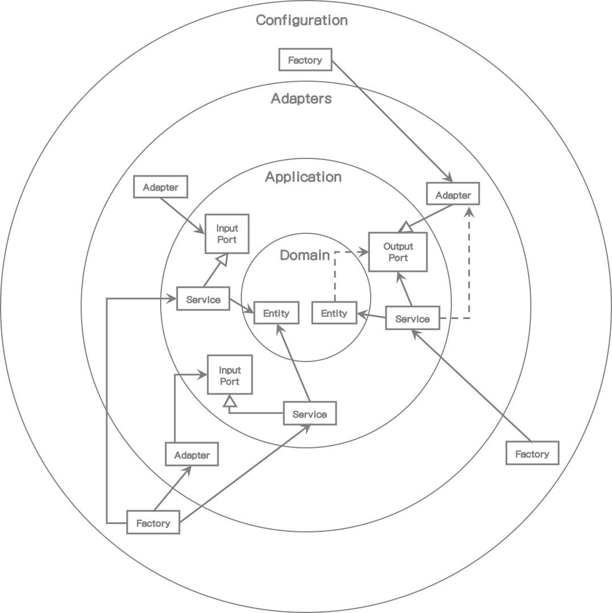
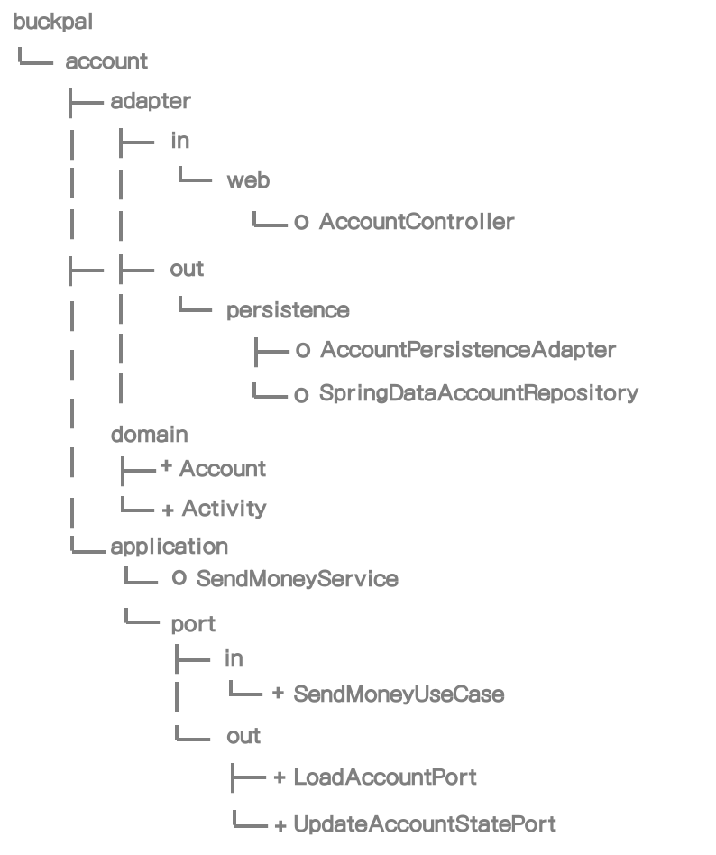
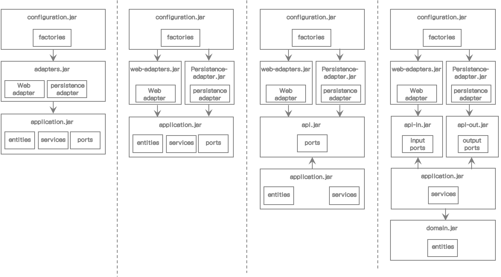

# 10. 아키텍처 경계 강화

이전 장에서 우리는 아키텍처에 대한 많은 이야기를 했고 코드 작성 후에 어느 곳에 둘것인지 가이드해 줄 수 있는 목표 아키텍처를 가지게 된 것 같다.

그러나 모든 소프트웨어 프로젝트에서는, 시간이 지남에 따라 아키텍처 구조가 점점 약화되는 경향이 있다. 계층 간의 경계는 흐릿해지고 테스트도 힘들어지며 새 기능 개발에는 더 많은 시간이 필요하게 된다.

이 장에서는 아키텍처 경계를 강화하고 훼손하지 않는 방법들을 알아볼 것이다.


## 경계와 의존성

아키텍처 경계를 강화하는 다양한 방법을 알아보기 전에, 우선 아키텍처의 경계가 어디에 있고 "경계를 강화하는 것"이 무슨 의미인지 알아보자.




[그림 10.1] 아키텍처 경계를 강화한다는 것은 의존의 방향이 올바르게 향하도록 하는 것을 의미한다. 점섬 화살표는 아키텍처에서 허용되지 않는 의존방향을 나타낸다.


위의 그림은 헥사고날 아키텍처의 요소가 *2장(Inverting Dependencies)*에서 소개한 클린 아키텍처와 유사한 네 개의 계층으로 나눠진 것을 나타낸다.

가장 안쪽 계층은 도메인 엔티티를 포함한다. 애플리케이션 계층은 애플리케이션 서비스 내의 유스케이스를 구현하기 위해 도메인 엔티티에 접근할 수도 있다. 어댑터는 인바운드 포트를 통해 서비스에 접근하거나 아웃바운드 포트를 통해 서비스에서 접근될 수 있다. 마지막으로 구성 계층은 어댑터와 서비스 객체를 생성하여 거기에 의존성 주입 매커니즘을 제공하는 팩토리를 포함한다.

위의 그림에서 아키텍처 경계는 꽤 명확하다. 각 계층과 내/외부 간에 경계가 있다. 의존성 규칙에 따르면 그러한 계층 경계 사이의 의존성은 항상 내부를 향해야만 한다.

이 장은 의존성 규칙을 강화하는 방법에 관한 내용이다. 잘못된 방향으로 향하는 의존성을 없애도록 해보자. (그림에서 점선 화살표)


## 접근 제어자

Java에서 경계를 식별하는 기본적인 방법을 한번 보자.

접근 제어자(visibility modifier)는 지난 몇년 동안 면접시험에 항상 나왔던 질문이었다. 나는 지원자들에게 접근 제어자가 무엇이며 그 차이점이 무엇인지 질문 했었다.

지원자 대부분은 public, protected, private 제어자의 목록만을 나열했다. 어느 누구도 package-private(혹은 default)에 대해서는 몰랐다. 좋은 질문 중 하나는 지원자들이 그들이 가진 사전 지식으로 접근 제어자가 왜 의미가 있는지 물어보는 것이었다.

그러면 package-private 제어자가 왜 중요할까? 왜냐하면 Java의 패키지는 클래스를 응집력있는 모듈로 그룹핑 하기 때문이다. 모듈 내의 클래스는 서로 볼 수 있지만 패키지 외부에서는 접근할 수 없다. 모듈의 진입점에 있는 클래스를 public으로 명시할 수도 있다. 이것은 잘못된 방향으로 의존할 수 있는 의존성 규칙 위반에 대한 위험을 줄여준다.

*3장(Organizing Code)*에서 살펴본 패키지 구조에 대해 접근 제어자를 생각하면서 다시 한번 보자.




[그림 10.2] 패키지 구조의 접근 제어자


외부에서 접근할 필요가 없기 때문에 **persistence** 패키지 클래스를 package-private(위의 그림에서 "o"로 표시)으로 둘 수 있다. 영속성 어댑터는 아웃바운드 포트를 통해서 접근된다. 같은 이유로 **SendMoneyService** 클래스를 package-private으로 둘 수 있다. 일반적으로 의존성 주입 메커니즘은 클래스를 인스턴스화할 때 리플렉션을 사용한다. 그래서 package-private일지라도 클래스를 인스턴스화 할 수 있다.

Spring에서는 *9장(Asssembling with Application)*에서 살펴본 classpath scanning 방법을 사용하는 경우에만 이 방법이 동작한다. 하지만 다른방법으로는 public 접근이 필요한 객체에 대해 인스턴스를 생성해야 한다.

예제에서 나머지 클래스들은 아키텍처 정의상 public이어야만 한다(+로 표시).  도메인 패키지는 다른 계층에서 접근이 필요하고, 애플리케이션 계층은 웹과 영속성 어댑터에서 접근이 필요하다.

package-private 제어자는 많은 클래스가 없는 매우 작은 모듈에 그 효과가 크다. 하나의 패키지에 많은 클래스가 있으면 혼란스럽다. 이 경우에는 코드를 쉽게 찾기 위해서 서브 패키지를 만들 것이다. Java에서는 서브 패키지를 다른 패키지로 인식하고 서브 패키지의 package-private 멤버를 접근할 수 없기 때문에 private-package 제어자를 사용할 수 없게 된다. 그래서 서브 패키지 내의 멤버는 public이어야 하고 외부에 노출도 해야 하므로 아키텍처의 의존관계를 복잡하고 잘못된 방향으로 만들어지기 쉽다.


## Post-Compile 체크

클래스에 public 제어자를 사용할 경우 의존이 잘못된 방향을 향할지라도 다른 클래스에서 그 클래스를 사용할 수 있다. 이런 케이스에는 컴파일러 오류가 발생하지 않아서 의존 규칙이 위반여부를 확인할 수 없으므로 우리는 다른 방법을 강구해야 한다.

이를 확인하는 방법 중 하나는 post-compile 체크를 도입하는 것이다. 말하자면 이미 컴파일된 코드를 런타임시 수행하는 방법이다. 그러한 런타임 체크 방식은 지속적인 통합 빌드가 이뤄지는 자동화 테스트가 수행될 때 가장 좋다.

Java에서 이런 종류의 체크를 하는 도구로는 ArchUnit(https://github.com/TNG/ArchUnit)이 있다. 그런 도구들 중에서 ArchUnit은 의존의 방향이 예상 방향으로 향하는지 체크하는 API를 제공한다. 만일 규칙이 위반되었을 때는 예외를 던진다. 의존성 위반 시 테스트가 실패하도록 하는 JUnit 같은 단위 테스트 프레임워크에서 실행될 때 가장 좋다.

이전 장의 패키지 구조에 정의된 것처럼, 각 계층은 패키지를 가지고 있다고 가정하고 ArchUnit을 이용하여 계층 간에 의존성을 체크할 수 있다. 예를 들어 도메인 계층에서 외부 애플리케이션 계층으로 의존성이 없는 것을 확인할 수 있다.

```java
class DependencyRuleTests {
    @Test
    void domainLayerDoesNotDependOnApplicationLayer() {
        noClasses()
        .that()
        .resizeInPackage("buckpal.domain..")
        .should()
        .dependOnClassesThat()
        .resideInAnyPackage("buckpal.application..")
        .check(new ClassFileImporter()
              .importPackages("buckpal.."));
    }
}
```

헥사고날 아키텍처 내의 모든 패키지를 명시할 수 있도록 ArchUnit API 상단에 DSL로 간단히 만들 수 있고 자동적으로 패키지가 올바른 방향으로 의존성을 가지는지 확인할 수 있다.

```java
class DependencyRuleTests {

	@Test
	void validateRegistrationContextArchitecture() {
		HexagonalArchitecture.boundedContext("io.reflectoring.buckpal")
				.withDomainLayer("domain")
				.withAdaptersLayer("adapter")
				.incoming("web")
				.outgoing("persistence")
				.and()
				.withApplicationLayer("application")
				.services("service")
				.incomingPorts("port.in")
				.outgoingPorts("port.out")
				.and()
				.withConfiguration("configuration")
				.check(new ClassFileImporter()
						.importPackages("io.reflectoring.buckpal.."));
	}
}
```

위의 코드 예제에서는 먼저 바운디드 컨텍스트 내의 상위 패키지를 명시한다. 그리고 나서 도메인, 어댑터, 애플리케이션, 구성 계층의 서브 패키지를 명시한다. 마지막 **check()**을 호출하면 실제 실행이 되고 패키지 의존성이 의존 규칙에 따라 유효한지 확인한다. 이 헥사고날 아키텍처 DSL 코드는 https://github.com/thombergs/buckpal 예제 프로젝트의 HexagonalArchitecture 클래스에서 받을 수 있다.

post-compile 체크가 잘못된 의존성 확인에는 많은 도움이 되지만 이 방법도 만능책은 아니다. 위의 코드 예제에서 **buckpal** 이름을 잘못 썼다면 테스트를 실행할 클래스를 못찾게 되고 의존관계도 실패하지 않을 것이다. 단 하나의 오타 혹은 더 중요한 리팩토링이 전체 테스트를 쓸모없게 할 수도 있다. 클래스가 없는 경우에 실패하는 케이스를 추가함으로써 이런 경우를 수정할 수는 있지만 리팩토링에는 여전히 취약하다. post-compile 체크는 코드와 병행하여 유지되어야 한다.


## 빌드 아티팩트 (Build Artifacts)

지금까지 코드에서 아키텍처 경계를 표시하는 유일한 도구는 패키지이다. 모든 코드는 동일한 모노리틱 빌드 아티팩트의 일부분이었다.

빌드 아티팩트는 빌드의 결과물다. 현재 Java 진영에서 가장 인기있는 빌드 도구는 maven과 gradle이다. 지금까지는 하나의 maven 혹은 gradle 스크립트만 있고 이 스크립트가 컴파일, 테스트 그리고 애플리케이션 코드를 단일 jar파일로 패키징할 수 있다.

빌드 도구의 주요 기능은 의존성을 해결하는 것이다. 특정 코드를 빌드 아티팩트로 변환하기 위해서 빌드 도구는 먼저 의존하는 모든 아티팩트가 사용 가능한지를 체크한다. 존재하지 않는 아티팩트는 repository에서 가져올 것이다. 만일 이런 것들이 실패한다면 코드를 컴파일 하기도 전에 빌드 에러와 함께 실패할 것이다.

우리는 아키텍처 모듈과 계층간 의존관계(경계를 식별)를 강화하기 위해 이것을 활용할 수 있다. 각 모듈 혹은 계층에서 각각의 코드와 빌드 아티팩트(jar 파일)로 각각의 빌드 모듈을 만들 수 있다. 각 모듈의 빌드 스크립트에서 아키텍처에서 허용된 다른 모듈과의 의존관계를 확인할 수 있다. 클래스가 클래스 패스에 없다면 에러가 발생할 것이기 때문에 개발자는 실수로 잘못된 의존관계를 만들 수는 없을 것이다.




[그림 10.3] 아키텍처의 잘못된 의존을 방지하기 위해 여러 개의 빌드 아티팩트로 나누는 다양한 방법


이전 그림은 아키텍처를 개별 빌드 아티팩트로 나누는 다양한 방법을 나타낸다.

왼쪽에서 시작하여 구성, 어댑터, 애플리케이션 계층에 해당하는 기본 세 개의 모듈을 확인한다. 구성 모듈은 어댑터 모듈에 접근하고 차례로 애플리케이션 모듈에 접근한다. 또한 구성 모듈은 연관되거나 전이된 의존성 때문에 애플리케이션 모듈에 접근할 수 있다.

어댑터 모듈은 영속성 어댑터 뿐만 아니라 웹 어댑터를 포함하는 것을 주목하라. 이 말은 빌드 도구가 어댑터들 간 의존을 금지하지 않는다는 것을 의미한다. 그러한 어댑터 간의 의존 관계는 의존관계 규칙에 따라 엄격히 금지하지는 않기 때문에(양쪽 어댑터가 동일한 외부 계층에 있기 때문에), 대부분의 경우 각각 분리된 어댑터를 가지는 것이 좋을 것이다.

결국 영속성 계층의 변경으로 인해 웹 계층, 혹은 그 반대의 경우로 영향을 주는 것을 원하지 않는다. (단일 책임 원칙을 기억하라)

> > > > 여기

애플리케이션을 어떤 써드파티 API로 연결하는 어댑터와 같이, 다른 유형의 어댑터에서도 이런 내용이 해당된다. 어댑터 사이에 의존관계를 실수로 추가함으로써 그런 API의 세부내용이 다른 어댑터에 노출되는 것을 원하지 않는다.

그러므로 *그림 10.2*의 두번째 컬럼에 표시된 것처럼, 단일 어댑터 모듈을 여러 개의 빌드 모듈(각 어댑터 당 하나씩)로 나눌 수도 있다.

다음으로 애플리케이션 모듈을 더 세분화 하여 나눌지 결정할 수 있다. 현재 애플리케이션 모듈은 인바운드/아웃바운드 포트, 그 포트를 사용하는 서비스들, 도메인 로직을 포함하는 도메인 엔티티를 가지고 있다.

도메인 엔티티가 포트 내에서 전송용 객체로 사용되지 않는다면(즉, *Chapter 8, Mapping between Boundaries*의 "No Mapping" 전략을 허용하지 않음) 의존성 역전 원칙을 적용하여 포트 인터페이스만을 포함하는 개별 API 모듈로 빼낼 수 있다. (그림 10.2의 세번째 컬럼)

어댑터 모듈과 애플리케이션 모듈은 API 모듈에 접근할 수 있지만 반대방향으로는 안된다. API 모듈은 도메인 엔티티에 접근하지 못하며 포트 인터페이스 내에서 도메인 엔티티를 사용할 수 없다. 또한 어댑터는 엔티티와 서비스로 직접 접근은 할 수 없고 포트를 통해서만 가능하다.

API 모듈을 두 개로 나눌 수도 있다. 하나는 인바운드 포트이고 다른 하나는 아웃바운드 포트이다(그림 10.1에서 네번째 컬럼). 이런 식으로 인바운드 포트 혹은 아웃바운드 포트의 의존성을 명시함으로써 특정 어댑터가 인바운드 어댑터인지 아웃바운드 어댑터인지 명확히 나타낼 수 있다.

또한 서비스만을 가지는 모듈 하나와 도메인 엔티티만을 가지는 모듈 하나로 애플리케이션 모듈을 더  나눌 수 있다. 도메인 빌드 아티팩트상의 의존관계를 명시함으로써 이것은 엔터티가 서비스로 접근하지 못하고 다른 애플리케이션(유스케이스와 서비스)이 동일 도메인 엔티티를 사용하게 만든다.

*그림 10.2*는 애플리케이션을 빌드 모듈로 나누는 다양한 방법을 나타내고 있으며, 물론 그림에서 묘사된 네 가지 외에 더 많은 방법도 있다. 그 핵심내용은 모듈을 더 잘게 나누면 그들 사이의 의존관계를 더 강력하게 제어할 수 있다는 것이다. 하지만 더 잘게 나누게 되면 모듈 사이의 매핑 많아지고 *8장(Mapping between Boundaries)*에서 소개한 매핑 전략 중 하나를 사용해야 한다.

게다가 빌드 모듈로 아키텍처 경계를 구분하는 것은 단순 패키지로 경계를 나누는 것보다 더 많은 장점이 있다.

우선 빌드 툴은 순환 의존을 사용할 수 없다. 순환 의존 관계는 하나의 모듈의 변화가 다른 모듈의 변화를 의미하므로 잘못된 방법이고 단일 책임 원칙의 위반이다. 빌드 툴은 무한루프를 만들 수 있기 때문에 순환 의존을 허용하지 않는다. 그러므로 빌드 모듈 간에는 순환 의존이 없다는 것을 확신할 수 있다.

반면에 Java 컴파일러는 두개 혹은 그 이상 패키지에서 순환 의존성이 있는지 전혀 알 수 없다.

두번째, 빌드 모듈은 다른 모듈에 영향없이 그 모듈 내에서 해당 코드만 변경할 수 있다. 특정 어댑터의 일시적인 컴파일 에러이 발생할 수 있는 애플리케이션 계층의 대규모 리팩토링을 해야 한다고 가정해보자. 어댑터와 애플리케이션이 동일한 빌드 모듈에 있다면 어댑터내의 모든 컴파일 에러는 애플리케이션 계층 테스트를 실행하기 전에 모두 수정되어야 한다. 심지어 어댑터는 테스트에서 컴파일이 필요 없을 지라도 수정되어야 한다. 하지만 만약에 애플리케이션 계층이 개별 모듈에 있다면 IDE는 어댑터와는 무관하게 애플리케이션 계층 테스트를 마음대로 실행할 수 있다. maven 혹은 gradle으로 빌드를 실행할 때도 동일하다. 양쪽 계층이 동일한 모듈 내에 있다면 빌드는 컴파일 에러 때문에 실패할 것이다.

그래서 다중 빌드 모듈은 각 모듈에서 개별 변경을 할 수 있다. 각각의 팀이 각자 다른 모듈을 유지보수할 수 있도록 개별 모듈을 자신의 리포지토리에 둘 수도 있다.

마지막으로, 빌드 스크립트에 각 모듈간의 의존성을 명확히 나타냄으로써 새로운 의존성이 실수로 추가되지 않도록 한다. 접근할 수 없는 클래스로의 접근이 필요한 개발자는 의존성을 추가하기 전에 어느 의존성이 맞을지 고민하게 된다.

이런 장점은 있지만 빌드 스크립트를 유지보수해야 하는 노력이 필요하다. 그래서 빌드 모듈을 나누기 전에 아키텍처는 안정적인 상태이어야만 한다.


## How Does This Help Me Build Maintainable Software?

소프트웨어 아키텍처는 기본적으로 아키텍처 요소간의 의존관계를 관리하는 것이다. 의존관계가 복잡해지면 아키텍처도 복잡해진다.

그래서 아키텍처를 지속적으로 유지하기 위해서 의존관계가 올바르게 되어 있는지 꾸준하게 확인해야 한다.

내가 작성한 코드 혹은 기존코드 리팩토링을 할 때에는, 패키지 외부로부터 접근되어서는 안되는 클래스간의 의존관계를 피하기 위해서 패키지 구조를 확인해야 하고 package-private 제어자를 사용해야 한다.

단일 빌드 모듈 내에서 아키텍처 경계를 강화하고 package-private 제어자가 허용되지 않는 패키지 구조때문에 동작하지 않는다면, ArchUnit 같은 post-compile 툴을 사용할 수도 있다.

그리고 아키텍처가 충분히 안정적이다고 느낄 때, 의존성에 대해 좀 더 명확히 제어할 수 있도록 아키텍처요소들을 개별 빌드 모듈로 떼어내야한다.

세 개의 접근방법은 아키텍처 경계를 강화하는데 사용될 수 있고 코드의 유지보수를 용이하게 만들 수 있다.


