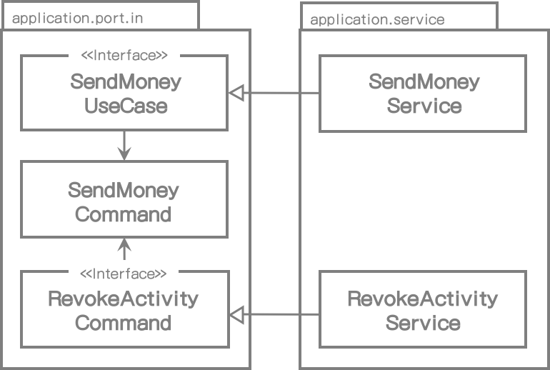
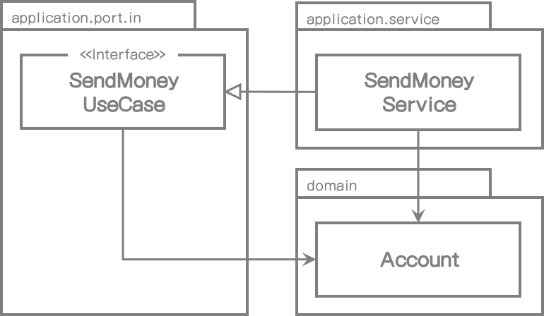
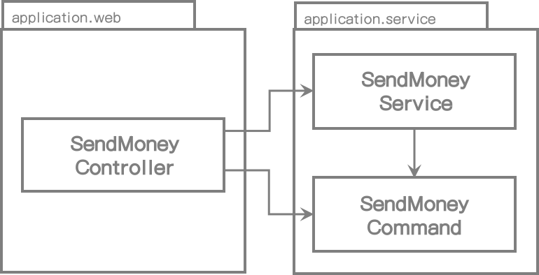

# 11. 의도적인 응급처치

이 책의 첫부분에서, 나는 많은 기술부채만 만들어내고 결코 수정되지 않을 임시방편으로 처리할 수밖에 없는 사실을 비난했다.

임시방편으로 처리하지 않기 위해서는 그 내용을 인지하고 있어야 한다. 그래서 이 장의 목표는 잠재가능성이 있는 임시방편식의 처리방법에 대한 의식을 높이고 그 효과를 논의해보는 것이다.

이러한 정보를 통해서 우연히 발생하는 임시방편식의 처리를 인지하고 고쳐 나갈 수 있다. 혹은 그럴게 할 수 밖에 없는 경우라면, 우리는 임시방편식 작업을 의도적으로 선택할 수도 있다. 

건축공학 도서나 혹은 더욱 끔찍하겠지만 항공기술관련 도서에서 이런 임시방편식 작업이 있다고 생각해보자. 하지만 우리 대부분은 고층건물이나 항공기 관련 소프트웨어를 만들지는 않는다. 소프트웨어는 하드웨어보다 더 부드러워야 하고 변경이 쉬워야 한다. 그래서 우선 임시방편으로 처리하고 나중에(결코 하지 않겠지만) 수정하는 것이 더 경제적일 수도 있다.

## 임시방편 작업이 깨진 유리창과 같은 이유

1969년에 심리학자 Philip Zimbardo는 하나의 실험을 진행했고 그 이후에 깨진 유리창 이론(https://www.theatlantic.com/ideastour/archive/windows.html)으로 알려지게 되었다.

그는 번호판 없는 자동차 한대를 브론스 근처에 주차했고 다른 한대는 생활환경권이 더 좋다고 알려진 팔로 알토에 주차했다. 그리고 나서 기다렸다.

브론스에 있는 차는 24시간만에 귀중품이 전부 도난당했고 지나가는 사람들도 그 차를 닥치는 대로 부수기 시작했다. 

팔로 알토에 있는 차는 일주일 동안은 아무도 건드리지 않았서 Zimbardo가 차의 창문 하나를 깨뜨렸다. 그때부터 차는 브론스에 있는 차와 비슷한 상태가 되었고 지나가는 사람들에 의해 금방 부서졌다.

차의 물건을 훔치거나 부수는 사람들은 모두 사회 계층 사람들이고 법을 준수하는 선량한 시민들이었다.

이러한 인간의 행동은 깨진 유리창 법칙 이론으로 알려지게 되었다.

> 파손되고 훼손되거나 버려진 어떤 것이 있다면 사람의 뇌는 더 부수고 훼손되게 한다.

이 이론은 우리의 삶에 많은 곳에서 적용된다.

* 반달리즘(공공 기물 파손)이 흔한 곳에서는 내버려진 차를 훼손하거나 파손하는 한계점은 낮아진다.
* 차의 창문이 깨졌다면 좋은 생활환경권에 있더라도 더 훼손될 가능성은 높아진다.
* 청결하지 못한 침실에서 옷장에 옷을 넣을 가능성은 낮아진다.
* 왕따가 많은 그룹내에서는 사람들을 괴롭힐 가능성은 높아진다.

코드에 적용해보면 이러하다.

* 낮은 품질의 코드로 작업할 때 더 낮은 품질의 코드가 추가될 가능성은 높아진다.
* 위반사항이 많은 코드로 작업할 때 추가되는 코드의 위반사항도 많아진다.
* 임시방편 로직이 많은 코드로 작업할 때 임시방편 코드가 추가될 가능성은 높아진다.

이런 내용을 생각해볼때, 소위 "레거시"라고 불리는 많은 코드 품질이 시간이 지남에 따라 더 나빠진다는 사실이 놀랍지 않은가?

## 클린(Clean)하게 시작해야 할 책임

코드로 작업하는 것이 차를 부수는 것과 같지는 않지만 우리는 깨진 유리창 이론을 무의식적으로 실행하기 쉽다. 임시방편 작업을 줄이고 기술 부채를 가능한 만들지 않고 프로젝트를 깨끗하게 시작하는 것이 중요하다. 임시방편 작업이 슬며시 생기기 시작하면 깨진 유리창처럼 더 많은 임시방편 작업을 유발한다.

소프트웨어 프로젝트는 많은 비용과 오랜 기간의 노력이 필요하기 때문에, 깨진 유리창을 계속 가지고 있다는 것은 소프트웨어 개발자로서 더 많은 책임감을 느끼게 한다. 우리는 프로젝트를 제때 완료하지 못하고 다른 누군가에게 넘겨줘야 할 경우도 생긴다. 그들과는 전혀 관련이 없는 레거시 코드이며 깨진 유리창을 만들 가능성을 높여준다.

그러나 작업하는 코드 내용이 크게 중요하지 않거나 프로토타이핑이나 경제적인 이유로 임시방편으로 작업하는 경우도 있다.

그렇게 의도적으로 추가된 임시방편 작업은 해당 내용을 문서화해야만 한다. 이 내용은 Michael Nygard가 그의 블로그(http://thinkrelevance.com/blog/2011/11/15/documenting-architecture-decisions)에서 제안한 Architecture Decision Records(ADRs) 공식문서에서 볼 수 있다. 우리는 우리 자신과 우리의 후임자에게 빚을 지고 있는 것이다. 팀 구성원 모두가 이 문서를 알고 있다면, 그들 모두에게 임시방편 작업은 의도적이고 긍정적인 이유로 해야 한다고 알고 있기 때문에 깨진 유리창 효과는 줄어들 것이다.

다음 내용은 이 책에 나타난 헥사고날 아키텍처의 임시방편 작업이라고 생각되는 패턴을 살펴볼 것이다. 임시방편 작업의 효과와 논쟁거리, 그 내용에 대한 다양한 의견들을 살펴볼 것이다.

## 유스케이스간의 모델 공유

*4장(Implementing a Use Case)*에서 각 유스케이스마다 각각의 입/출력 모델을 가져야 한다고 이야기했다. 이는 입력 파라미터 유형과 리턴값의 유형은 다르게 사용되어야 한다는 것을 의미한다.

다음 그림은 동일 입력 모델을 공유하는 두 개의 유스케이스의 사례를 보여준다.

[그림 11.1] 유스케이스 간 입/출력 모델을 공유하는 것은 유스케이스 간의 결합도를 높인다.

> > > > 여기

이 상황에서 모델을 공유함으로써 발생되는 영향도는 **SendMoneyUseCase**와 **RevokeActivityUseCase**가 서로 결합된다는 것을 나타낸다. **SendMoneyCommand** 클래스를 수정하면 양쪽 케이스 모두 영향받는다. 단일 책임 원칙에 의해 변경해야 할 이유를 공유한다. 양쪽 유스케이스가 동일 출력모델을 공유할 때도 동일하다.

유스케이스 간 입/출력 모델을 공유하는 것은 각 유스케이스가 기능적으로 경계가 구분된다면 가능하다. 즉, 어떤 요구사항을 공유하는 경우라면. 이 경우에는 *특정 부분을 수정하면 실제 양쪽 유스케이스가 영향을 받는다.*

두 개의 유스케이스가 서로 독립적으로 변경되어야 한다면, 이것은 잘못된 방법이다. 코드를 처음 작성할 때는 같은 것처럼 보여서 이것이 입/출력 클래스를 중복처럼 느껴질지 모르겠지만 이런 경우에는 시작할 때 부터 유스케이스를 분리해야만 한다.

그래서 비슷한 개념의 여러 유스케이스를 만들 때, 유스케이스가 각각 다르게 변경될 것인지에 대해 주기적으로 의문을 제기하는 습관을 길러야 한다. "그렇다"라면 입/출력 모델을 분리해야할 시기가 온 것이다.

## 입/출력 모델로 도메인 엔티티 사용하기

**Account** 도메인 엔티티가 있고 입력 포트(**SendMoneyUseCase**)가 있다면 다음 그림에 나타낸대로 입력 포트의 입/출력 모델로서 엔티티를 사용하고 싶어진다.

[그림 11.2] 유스케이스의 입/출력 모델로서 도메인 엔티티를 사용하는 것은 도메인 엔티티와 유스케이스와의 결합도를 높인다.

인바운드 포트는 도메인 엔티티로의 의존성을 가진다. 이런 작업의 결과는 **Account** 엔티티에 대한 변경의 또 다른 이유를 추가했다는 것을 의미한다.

잠깐, **Account** 엔티티는 **SendMoneyUseCase** 입력 포트에 의존을 가지지 않는데 어떻게 입력 포트가 엔티티에 대한 변경 이유가 될 수 있을까?

**Account** 엔티티에 현재 없는 유스케이스인 계좌에 대한 정보가 필요하다고 하자. 이 정보는 **Account** 엔티티에 저장되지 않고 다른 도메인 혹은 바운디드 컨텍스트에 저장된다. 그럼에도 불구하고 유스케이스 인터페이스에서 이미 사용할수 있기 때문에 **Account** 엔티티에 새 필드를 추가하기 싶어질 것이다.

단순 생성, 수정 유스케이스에서는, 유스케이스 인터페이스 내의 도메인 엔티티는 더 쪼개질 수 있다. 엔티티는 정확히 정보를 가지고 있기 때문에 데이터베이스에 그 상태를 저장할 필요가 있다.

유스케이스가 단순히 데이터베이스 필드 몇개를 수정하는 것이 아니고 좀 더 복잡한 도메인 로직을 구현하는 것이라면, 유스케이스 인터페이스의 전용 입/출력 모델을 사용해야 한다. 왜냐하면 유스케이스 변경으로 도메인 엔티티가 수정되는 것을 원하지 않기 때문이다.

이러한 임시방편식 작업의 위험요소는 많은 유스케이스가 단순 생성, 수정만으로 최초 작성되지만 시간이 지남에 따라 복잡한 도메인 로직 덩어리로 변경될 가능성이 높다는 사실이다. 특히 MVP(minimum viable product)로 시작해서 점진적으로 기능이 추가되는 애자일 환경에서 특히 그렇다. 만일 처음 시작할 때 입력 모델로서 도메인 엔티티를 사용했다면 도메인 엔티티와 무관한 전용 입력모델로 바꿔야 할 시기를 찾아야 한다.

## 인바운드 포트 생략하기

아웃바운드 포트가 애플리케이션 계층과 아웃바운드 어댑터 간의 의존성 역전시키는데 필수적인 요소이지만, 의존성 역전에 인바운드 포트는 사용할 필요는 없다. 다른 그림에 나타낸 대로 인바운드 포트 없이 인바운드 어댑터가 애플리케이션 서비스를 직접 접근하도록 할 수 있다.

[그림 11.3] 입력 포트가 없다면 도메인 로직으로 진입점을 잃어버리게 된다.

인바운드 포트를 제거함으로써 인바운드 어댑터와 애플리케이션 계층 사이의 추상화 계층을 줄였다. 추상화 계층을 제거하는 것이 뭔가 좀 더 좋아 보인다.

그러나 인바운드 포트는 애플리케이션 내부로의 진입점을 의미한다. 포트를 제거하게 되면, 특정 유스케이스를 구현에 필요한 서비스 메서드를 찾기 위해 애플리케이션 내부를 더 많이 알아야 한다. 전용 입력 포트를 유지함으로써, 애플리케이션의 진입점을 쉽게 확인할 수 있다. 코드의 흐름을 파악하려는 신입 개발자에게 특히 더 쉬울 수 있다.

인바운드 포트를 유지하는 또 다른 이유는 아키텍처를 손쉽게 견고하게 한다는 것이다. *10장(Enforcing Architecture Boundaries)*에서 설명한 경계를 강화할 수 있는 요소들로, 인바운드 어댑터가 애플리케이션 서비스가 아닌 오직 입력 포트만을 호출하게 할 수 있다. 이것은 애플리케이션 계층으로 향하는 모든 진입점을 의도적으로 나타낸다. 인바운드 어댑터에서 호출될 의도가 아닌 서비스 메서드를 실수로 호출하는 일은 없을 것이다.

애플리케이션이 매우 작거나 오직 하나의 인바운드 어댑터만 있어서 인바운드 포트 없이도 전체 제어 흐름을 이해할 수 있다면, 인바운드 포트 없이도 할 수 있을 것이다. 그러나 애플리케이션이 계속 작을 것이고 단일 인바운드 어댑터만을 있는 경우가 얼마나 있겠는가?

## 애플리케이션 서비스 생략하기

다음 그림에서 나타낸대로, 인바운드 포트 외에 어떤 유스케이스에서는 애플리케이션 계층을 생략할 수도 있을 것이다.

[그림 11.4] 애플리케이션 서비스가 없다면 도메인 로직을 둘 적당한 위치가 없다.

여기서 아웃바운드 어댑터 내의 **AccountPersistenceAdapter** 클래스가 직접 인바운드 포트를 구현하여 입력 포트를 구현하는 애플리케이션 서비스를 대체할 수 있다.

이 상황에서 애플리케이션 서비스는 보통 어떤 도메인 로직도 추가하지 않고 영속성 어댑터로의 생성, 수정, 삭제만 전송하기 때문에 단순 CRUD 유스케이스에서는 이렇게 하고 싶어진다. 영속성 어댑터가 직접 유스케이스를 구현하게 할 수 있다.

그러나 이것은 인바운드 어댑터와 아웃바운드 어댑터 사이의 Account 도메인 엔티티의 공유 모델이 필요하다. 그래서 위에서 나타낸 것과 같이 도메인 모델을 입력 모델로 사용하고 있다는 것을 의미한다.

게다가 애플리케이션 내부에서 유스케이스의 구현체가 더 이상 존재하지 않는다. 시간이 흘러서 CRUD 유스케이스가 더 복잡해진다면 유스케이스가 이미 그곳에서 구현되었기 때문에 도메인 로직을 아웃바운드 어댑터로 직접 추가하고 싶어질 것이다. 이것은 도메인 로직을 여러 곳에 흩어지게 만들 것이고 찾아서 유지보수 하기도 힘들어진다.

결국에는 단순 CRUD 유스케이스에서 애플리케이션 서비스를 건너뛰도록 할지도 모르겠다. 그러나 엔티티의 생성, 수정, 삭제 작업 이상을 하는 유스케이스에 대해서는 애플리케이션 서비스를 사용하도록 하는 명확한 가이드를 작성해야 한다.

## How Does This Help Me Build Maintainable Software?

임시방편의 작업이 경제적인 관점에는 의미가 있을 수도 있다. 이 장은 임시방편의 작업이 도움이 될지 결정하는데 필요한 몇 가지 인사이트를 제공한다.

여기에서의 논의는 단순 CRUD 유스케이스를 위해 전체 아키텍처를 구현하는 건 오버스펙으로 느낄 수 있기 때문에 임시방편으로 작업하기 쉽다는 것을 보여준다. 모든 애플리케이션이 처음에는 작게 시작하기 때문에, 유스케이스가 최초 CRUD상태로 시작할 때 팀의 합의가 필요하다는 사실은 매우 중요하다. 결국에는 팀 구성원들만이 임시방편 작업을 유지보수가 용이한 아키텍처로 바꿀 수 있다.

어떤 유스케이스는 단순 CRUD만 필요하다. 유지보수의 비용이 많이 들지 않기 때문에 결국 임시방편 작업으로 적절히 유지하는 것도 나쁘지 않다.

어떤 경우에는 미래에 우리의 결정을 재평가할 수 있도록 임시방편 선택한 이유에 대한 아키텍처와 그 결정사항에 대해서 문서로 기록해야 한다.

