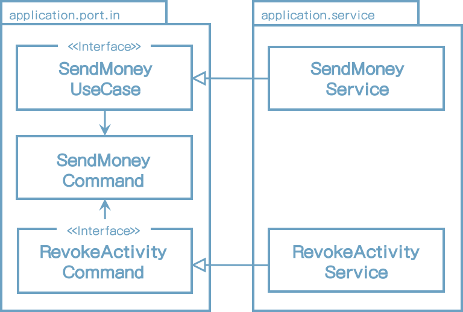
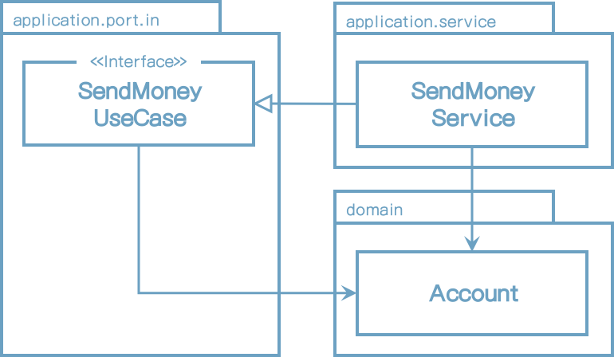
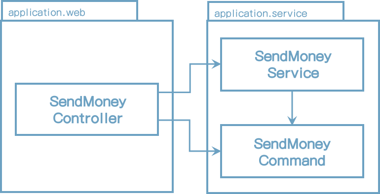
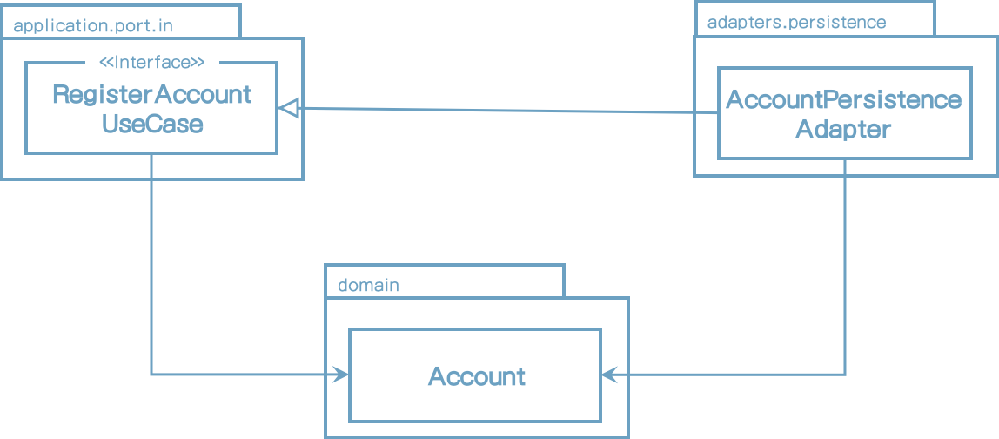

# 11 <u>Taking Shortcuts Consciously</u>

이 책 서문에서, 개선될 가능성이 없는 많은 기술 부채가 생길 위험이 있는 <u>shortcut으로</u> 작업하는 것을 불평해왔다.

shortcut을 방지하기 위해서 우리는 그들을 확인할 수 있어야 한다. 그래서 이 장의 목표는 잠재적인 shortcut에 대한 의식을 높이고 그 효과를 논의해보는 것이다.

이러한 정보로 우연히 발생하는 shortcut을 인지하고 고쳐 나갈 수 있다. 만일 정당화된다면 shortcut의 효과를 의식적으로 정당화 할 수도 있다.

건축공학 책이나 혹은 더욱 끔직한건 항공기술관련 책에서 이전 문장을 상상해봐라. 그러나 우리 대부분은 고층건물 소프트웨어나 항공기관련 소프트웨어를 만들고 있지 않다. 소프트웨어는 하드웨어보다 부드러워야 하고 더 변경이 쉬워야 한다. 그래서 우선 shortcut을 선택하고 나중에(결코 하지 않겠지만) 수정하는 것이 더 경제적일 수는 있다.

## Why Shorcuts Are Like Borken Windows

1969년에 심리학자 필립 짐바도(Philip Zimbardo)는 실험을 했고 깨진 유리창 이론(https://www.theatlantic.com/ideastour/archive/windows.html)으로 알려진 실험을 진행했다.

그는 브론스 근처에 번호판 없는 카를 한대 주차했고 팔로 알토(Palo Alto)에 더 좋다고 알려진 곳에 다른 차 한대를 주차했다. 그리고 기다렸다.

브론스에 있는 차는 24시간 내에 귀중품이 도난됬고 통행인도 그것을 부수기 시작했다. 

팔로 알토에 있는 차는 일주일 동안 안전했고 짐바도는 창문을 깨뜨렸다. 그때 부터 차는 브론스의 차와 비슷하게 되었고 지나가는 사람들에 의해 짧은 시간동안 부서졌다.

차의 물건을 훔치거나 보서는 사람들은 사회적 높은 지원이거나 법을 준수하고 선량한 시민들이었다.

이런 인간의 행동은 깨진 유리창 법칙 이론으로 알려져 있다. 

> 형편없고 훼손거나 내버려둔 어떤것이 있다면 사람의 뇌는 동일하게 그렇게 만들게 한다.

이 이론은 인생의 많은 영역에도 해당된다.

* 반달리즘(공공 기물 파손)이 흔한 곳에서 내버려진 카를 훼손하거나 망가뜨리는 한계점은 낮아진다.
* 차의 창문이 깨졌다면 좋은 장소에 있더라도 더 훼손될 가능성은 높아진다.
* 청결하지 못한 침실에서 옷장에 옷을 넣을 가능성은 낮아진다.
* 왕따가 많은 그룹내에서는 사람들을 괴롭힐 가능성은 높아진다.

코드에 적용해보면 이러하다.

* 낮은 품질의 코드로 작업할 때 더 낮은 품질의 코드를 추가할 가능성이 높아진다.
* 많은 위반이 있는 코드와 작업할 때 추가되는 코드의 위반은 높아진다.
* 많은 shortcuts이 있는 코드로 작업할 때 shortcut이 추가될 가능성은 높아진다.

소위 "레거시"라고 불리는 코드 품질이 시간이 지남에 따라 더 나빠진다는 사실이 놀랍지 않은가?

## <u>The Responsibility of Starting Clean</u>

코드 작업이 차를 훼손하는 것과 같지는 않지만 우리는 깨진 유리창 이론을 무의식적으로 실행하기 쉽다. 이것은 적은 shortcuts과 가능한 적은 기술 부채로 프로젝트를 깨끗하게 시작하는 게 중요하게 한다. shortcut이 슬며시 생기면 깨진 유리창 처럼 동작하며 더 많은 shortcut을 유발한다.

소프트웨어 프로젝트는 더욱 비싸고 오래 걸리는 노력이 필요하다. 그리고 궁지에 몰린 깨진 유리창이 소프트웨어 개발자로서 더 많은 책임감을 느끼게 한다. 우리가 프로젝트 완료하지 못하고 다른 누군가 인수해야 할수도 있다. 그들에게는 그것은 그들과는 관계없는 깨진 유리창을 만드는 한계점을 낮추는 레거시 코드이다.

그러나 프로젝트에서 중요하지 않거나 단순 프로토타이핑이나 경제적인 이유로 진행하는 코드의 일부이기 때문에 shortcut이 빠르게 결정되어야 할때 일어난다.

그렇게 의식적으로 추가된 shortcut을 문서화하는데 관심을 기울어야 한다. 이는 미카엘 니가드(Michael Nygard)가 그의 블로그에서 제안한 In the form of Architecture Decision Records(ADRs) 공식문서에서 볼 수 있다. 우리 자신과 후임자에 빚을 지고 있는 것이다. 팀은 shortcut의 의식적으로 취해야하고 좋은 이유로 취해야 한다는 것을 알기 때문에 팀의 모든 구성원은 이 문서를 인지하고 있고 깨진 유리창 효과를 줄일 것이다.

다음 부분은 이 책의 나타난 헥사고날 아키텍처의 shortcut이라고 생각되는 패턴을 논의해볼 것이다. shortcut의 효과와 옹호하거나 반대 의견을 말하는 논쟁을 살펴볼 것이다.

## Sharing Models between Use Cases

*4장(Implementing a Use Case)*에서 다른 유스케이스는 입력 파라미터 유형과 리턴값의 유형은 달라야 한다고 의미하는 다른 입력, 출력 모델을 가져야 한다고 주장했다.

다음 그림은 동일 입력 모델을 공유하는 두 개의 유스케이스의 예를 보여준다.

[그림 11.1] 유스케이스 간 입력/출력 모델을 공유하는 것은 유스케이스 사이의 결합도를 높인다.

이 케이스에서 공유의 영향도는 **SendMoneyUseCase**와 **RevokeActivityUseCase**가 서로 결합되어 있다는 것을 나타낸다. **SendMoneyCommand** 클래스를 수정하면 양쪽 케이스 모두 영향받는다. 단일 책임 원칙에 의해 변경해야 할 이유를 공유한다. 양쪽 유스케이스가 동일 출력모델을 공유할 때도 동일하다.

유스케이스 간 입/출력 모델을 공유하는 것은 유스케이스가 기능적으로 경계가 있다면 유효하다. 즉, 어떤 요구사항을 공유한다면. 이 경우에는 실제 어떤 상세부분을 수정한다면 양쪽 유스케이스가 영향을 받는다.

양쪽 유스케이스가 서로 독립적으로 변경되어야 한다면, 이것은 shortcut이다. 이 경우 시작할 때 동일하게 보이고 입/출력 클래스가 중복되지만 시작부터 유스케이스를 분리해야만 한다.

그래서 비슷한 개념의 여러개의 유스케이스를 만들때, 유스케이스가 각각 다르게 변경될 것인지 확인하는 것은 의미가 있는 작업이다. 대답이 "그렇다"라면 입/출력 모델을 분리할 때다.

## 입/출력 모델로써 도메인 엔티티 사용하기

**Account** 도메인 엔티티가 있고 입력 포트(SendMoneyUseCase)가 있다면, 다음 그림에 나타낸대로 입력포트의 입/출력 모델로서 엔티티를 사용하기 쉽다.

[그림 11.2] 유스케이스의 입/출력 모델로서 도메인 엔티티를 사용하는 것은 도메인 엔티티를 유스케이스와의 결합도를 높인다.

내부 포트는 도메인 엔티티를 의존한다. 이러한 작업의 결과는 **Account** 엔티티의 변경의 또 다른 이유를 추가했다는 것을 의미한다.

잠깐, **Account** 엔티티는 **SendMoneyUseCase** 입력 포트에 의존을 가지고 있지 않고 입력 포트가 어떻게 엔티티의 변경 이유가 될수 있을까?

**Account** 엔티티에서 현재 사용할 수 없는 유스케이스의 계좌에 대한 정보가 필요하다. 이 정보는 **Account** 엔티티에 저장되지 않고 다른 도메인 혹은 바운디드 컨텍스트에 저장된다. 그럼에도 불구하고 유스케이스 인터페이스에서 이미 사용가능하기 때문에 **Account** 엔티티에 새 필드를 추가하기 쉽다.

단순 생성 및 수정 유스케이스에서 유스케이스 인터페이스의 도메인 엔티티는 더 쪼개질 수 있다. 엔티티는 정확한 정보를 포함하기 때문에 데이터베이스에 상태를 저장할 필요가 있다.

유스케이스가 단순히 데이터베이스 몇개 필드를 수정하는 것이 아니고 좀 더 복잡한 도메인 로직을 구현하는 것이라면, 유스케이스 인터페이스의 전용 입/출력 모델을 사용해야 한다. 왜냐하면 유스케이스의 변화가 도메인 엔티티에 영향을 주기를 원하지 않기 때문이다.

이러한 shortcut이 위험한 것은 많은 유스케이스가 단순 생성, 수정 유스케이스로 시작해서 시간이 지남에 따라 복잡한 도메인 로직 덩어리가 될 가능성이 높다는 사실이다. 특히 MVP(minimum viable product)로 시작하고 점진적으로 기능을 추가하는 애자일 환경에서 특히 그렇다. 만일 시작할 때 입력 모델로서 도메인 엔티티를 사용했다면 도메인 엔티티와 무관한 전용 입력모델로 바꿔야 할 시기를 찾아야 한다.

## 내부(incoming) 포트 생략하기

외부 포트가 애플리케이션 레이어와 외부 어댑터 간의 의존성 역전에 필요하지만, 의존성 역전에 내부 포트를 사용할 필요는 없다. 다른 그림에 나타낸 대로 내부포트 없이 내부 어댑터가 애플리케이션 서비스를 직접 접근하도록 할 수 있다.

[그림 11.3] 입력 포트가 없다면 도메인 로직으로 진입점을 잃어버리게 된다.

입력 포트를 제거함으로써 입력 어댑터와 애플리케이션 계층 사이의 추상화 계층을 줄였다. 추상화 레이어를 제거하는 일반적으로 더 좋아 보인다.

그러나 입력 포트는 애플리케이션 내부로의 진입점을 의미한다. 그들을 제거하면 어떤 유스케이스를 구현하기 위해 호출할 수 있는 서비스 메서드를 찾아내기 위해 애플리케이션 내부에 대해 더 많이 알아야 한다. 전용 입력 포트를 유지함으로써, 애플리케이션의 진입점을 쉽게 확인할 수 있다. 코드에서 영향을 가진 신입 개발자에게 특히 쉽게 한다.

입력 포트를 유지하는 또 다른 이유는 아키텍처를 쉽게 강화하게 한다는 것이다. *10장(Enforcing Architecture Boundaries)*의 강화된 옵션으로, 입력 어댑터가 애플리케이션 서비스가 아닌 오직 입력 포트를 호출할 수 있게 한다. 이것은 애플리케이션 계층으로 모든 진입점이 의도적으로 결정되게 한다. 내부 어댑터에서 호출될 의도가 아닌 서비스 메소드를 우연히 호출할 수 없다.

애플리케이션이 매우 작고 단일 입력 어댑터만을 가지고 있어서 입력포트의 도움 없이 제어 흐름을 이해할 수 있다면, 내부 포트 없이 할 수 있을것이다. 그러나 애플리케이션이 작거나 단일 내부 어댑터만을 가질 것이라고 얼마나 자주 이야기할 수 있을까?

## 애플리케이션 서비스 생략하기

입력 포트와는 별개로 어떤 유스케이스에서는 다음 그림에서 나타낸대로 전체로써 애플리케이션 계층을 생략할 수도 있을 것이다.

[그림 11.4] 애플리케이션 서비스가 없다면 도메인 로직을 둘 적당한 위치가 없다.

여기서 외부 어댑터 내의 **AccountPersistenceAdapter** 클래스가 직접 내부 포트를 구현하고 입력 포트를 구현하는 애플리케이션 서비스를 대체할 수 있다.

이 케이스에서 애플리케이션 서비스는 일반적으로 어떤 도메인 로직도 추가하지 않고 영속성 어댑터로의 생성, 수정, 삭제만 전송하기 때문에 단순 CRUD 유스케이스에서는 이렇게 하기 쉽다. 전송하는 대신 유스케이스가 직접 구현하는 영속성 어댑터를 둘 수도 있다.

그러나, 이것은 Account 도메인 엔티티인 내부 어댑터와 외부 어댑터 사이의 공유 모델을 필요로 한다. 그래서 도메인 모델을 전에 나타낸 것과 같이 입력 모델로 사용하고 있다는 것을 의미한다.

게다가, 애플리케이션 코어 내부 유스케이스를 더 이상 나타내지 않는다. CRUD 유스케이스가 시간이 지남에 따라 더 복잡해진다면 유스케이스가 여기서 구현되었기 때문에 외부 어댑터로 직접 도메인 로직을 추가하기 쉽다. 이것은 도메인 로직을 분산하게 하고, 찾기 힘들고 유지보수하기도 힘들게 한다.

결국 서비스를 관통하는 <u>보일러플레이트를</u> 방지하기 위해 결국 단순 CRUD 유스케이스에 애플리케이션 서비스를 건너뛸 수도 있을지도 모른다. 그러나 팀은 엔티티를 생성, 수정, 삭제 작업 이상을 하는 유스케이스에 대해서 애플리케이션 서비스를 도입하는 분명한 가이드를 개발해야만 한다.

## How Does This Help Me Build Maintainable Software?

shortcuts이 경제적인 관점에는 합당할 때가 있다. 이 장은 shortcuts이 도움이 될지 아닐지 결정하는데 몇가지 인사이트를 제공한다.

여기에서의 논의는 단순 CRUD 유스케이스를 위해 전체 아키텍처를 구현하는건 과다하다고 느낄 수 있기 때문에 shortcuts을 도입하기 쉽다는 것을 보여준다. 모든 애플리케이션이 작게 시작하기 때문에, 유스케이스가 CRUD상태로 시작할 때 팀의 합의가 필요하다는 것은 매우 중요하다. 팀은 shortcut을 결국에는 유지보수가 용이한 아키텍터로 대체할 수 있다.

어떤 유스케이스는 CRUD 상태로 되지 않는다. 유지보수 오버헤드를 수반하지 않기 때문에 결국 shortcut를 적절하게 유지하는 것이 좋다.

어떤 경우에는 미래 결정을 재평가할 수 있도록 shortcut을 선택한 아키텍처와 결정사항을 문서화 해야 한다.

