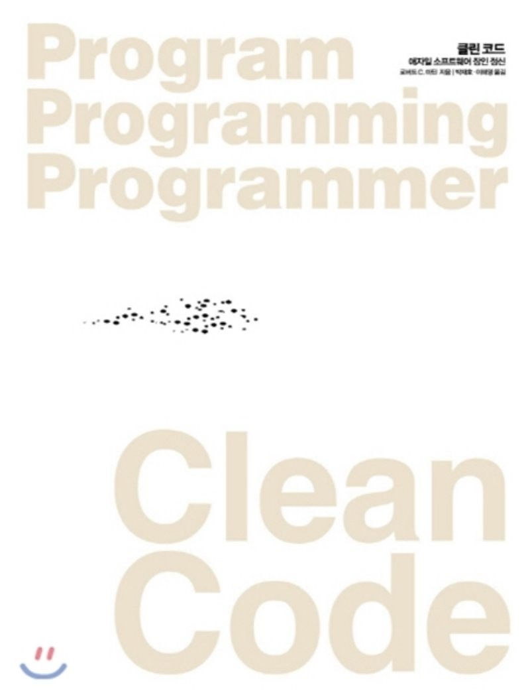

# 0장 들어가면서

* 돌아간다고 생각했던 코드를 허겁지겁 디버깅하는가? 
* 고객이 무더기로 이탈하고, 관리자가 압박을 가하는가?

어떻게 해야 하나? 답은 <u>장인 정신</u>이다.

장인 정신을 익히는 과정은 두 단계로 나뉜다. 바로 이론과 실전이다.

1. 장인에게 필요한 원칙, 패턴, 기법, 경험이라는 지식을 습득해야 한다.
2. 열심히 일하고 연습해 지식을 몸과 마음으로 체득해야 한다.


자전거 타기

- 물리적인 지식을 가르칠 수 있다. (중력, 마찰력, 각 운동량, 질량 중심)
- 그래도 자전거를 처음 타는 사람이라면 100% 넘어진다.

구현도 마찬가지다

* 깨끗한 코드를 만드는 "그럴듯한" 원칙을 모두 적어주고 알아서 하라고 버려둔다면??
* 깨끗한 코드를 작성하는 방법은 <u>배우기 어렵다</u>.
* 고생을 해야 한다.
* 스스로 연습하고 실패도 맛봐야 한다.
* 남들이 시도하다 실패하는 모습도 봐야 한다.
* 그들이 넘어지고 일어서는 모습도 봐야 한다.
* 결정을 내리느라 고민하는 모습
* 잘못된 결정으로 대가를 치르는 모습도 봐야 한다.


# 1장 깨끗한 코드

이 책을 읽고 있다면 이유는 두 가지다.

1. 프로그래머라서
2. 더 나은 프로그래머가 되려고


* 이 책은 좋은 프로그램 작성 요령을 설명하는 책이다.
* 코드를 최대한 다양한 각도에서 살펴본다.
* 이 책을 읽고 나면 코드에 대한 많은 사실을 배운다.
* 좋은 코드와 나쁜 코드를 구분하는 능력도 생긴다.
* 좋은 코드를 작성하는 방법도 익힌다. 
* 나쁜 코드를 좋은 코드로 바꾸는 실력도 쌓인다.


##### 코드가 존재하리라

코드를 자동으로 생성하는 시대가 다가온다?

* 헛소리! 앞으로 코드가 사라질 가망은 전혀 없다. 왜? <u>코드는 요구사항을 상세히 표현하는 수단이니까!</u>
* 어느 정도 수준이 되면 코드의 도움없이 요구사항을 표현하기란 불가능하다. 요구사항을 명시하는 수밖에 없다.
* 기계가 실행할 정도로 상세하게 요구사항을 명시하는 작업, 바로 이것이 프로그래밍이다. 그 결과가 코드다.
* 절대로 불가능한 기대다. 창의력과 직관을 보유한 우리 인간조차도 고객의 막연한 감정만 갖고는 성공적인 시스템을 구현하지 못한다.
* 궁극적으로 코드는 요구사항을 표현하는 언어라는 사실을 명심한다.


##### 나쁜 코드

프로그래머라면 누구나 당연히 나쁜 코드로 고생한 경험이 있다.

* 어째서 나쁜 코드를 짯는가?
* 급해서? 서두르느라? 제대로 짤 시간이 없다고 생각해서, 코드를 다듬느라 시간을 보냈다가 상사한테 욕 먹을까봐, 지겨워서 빨리 끝내려고, 다른 업무가 너무 밀려 후딱 해치우고 밀린 업무로 넘어가려고...
* <u>우리 모두는 자신이 짠 쓰레기 코드를 쳐다보며 나중에 손보겠다고 생각한 경험이 있다.</u>
* 우리는 르블랑 법칙 (lebranc's Law)를 몰랐다. <u>나중은 결코 오지 않는다.</u>


##### 나쁜 코드로 치르는 대가

* 나쁜 코드는 개발 속도를 크게 떨어뜨린다.
* 코드를 고칠 때마다 엉뚱한 곳에서 문제가 생긴다.
* 나쁜 코드가 쌓일 수록 팀 생산력은 떨어진다. 그러다가 마침내 0에 근접한다.
* 생산성이 떨어지면 관리층은 인력을 추가 투입한다.
* 하지만 새 인력은 설계 의도에 맞는 변경과 설계 의도에 반하는 변경을 구분하지 못한다.


###### 원대한 재설계의 꿈

* 이처럼 혐오스러운 코드로는 더 이상 일하지 못하겠다며 관리층에게 재설계를 요구한다.
* 새로운 타이거 팀이 구성된다. 모두가 합류하고 싶어한다. 나머지는 계속 현재 시스템을 유지보수한다.
* 이제 두 팀은 경주를 시작한다. 타이거팀은 기존 시스템을 모두 제공하는 새 시스템을 내놓아야 한다.
* 때로는 경주는 아주 오래 이어진다. 10년 넘게 걸릴수도...
* 새 시스템이 기존 시스템을 따라 잡을 즈음이면 초창기 타이거 팀원들은 모두 팀을 떠났고 새로운 팀원들이 새 시스템을 설계하자고 나선다. 왜? 현재 시스템이 너무 엉망이라서.


###### 태도

한 줄만 고치면 되리라 예상했다가 모듈을 수백 개 건드린 경험이 있는가?

* 코드가 왜 그렇게 되었을까? 우리는 온갖 이유를 들이댄다.
* 원래 설계를 뒤집는 방향으로 <u>요구사항이 변했다고 불평한다</u>. 
* 일정이 촉박해 제대로 할 시간이 없었다고 한탄한다. 
* 멍청한 관리자와 조급한 고객과 쓸모없는 마케팅 부서와 전화기 살균제 탓이라고 떠벌인다.
* 하지만 딜버트씨, 잘못은 전적으로 우리 프로그래머에게 있답니다. 우리가 전문가답지 못했기 때문입니다.


어째서 우리 잘못인가?

* 요구사항? 일정? 멍청한 관리자와 쓸모없는 마케팅 인간들? 그들에게는 잘못이 없다는 말인가?
* 일정에 쫓기더라도 대다수 관리자들은 좋은 코드를 원한다. 
* <u>그들이 일정과 요구사항을 강력하게 멀어붙이는 이유는 그것이 그들의 책임이기 때문이다.</u>
* 좋은 코드를 사수하는 일은 바로 우리 프로그래머의 책임이다.


자신이 의사라고 가정하자.

* 어느 환자가 수술 전에 손을 씻지 말라고 요구한다. 시간이 너무 걸리니까.
* 질병과 감염의 위험은 환자보다 의사가 더 잘 아니까.
* 나쁜 코드의 위험을 이해하지 못하는 관리자 말을 그대로 따르는 행동은 전문가답지 못하다.


###### 원초적 난제

* 프로그래머는 나쁜 코드가 업무 속도를 늦춘다는 사실을 익히안다.
* 그럼에도 모든 프로그래머가 기한에 맞추려면 나쁜 코드를 양산할 수밖에 없다고 느낀다.
* 오히려 엉망진창인 상태로 인해 속도가 곧바로 늦어지고, 결국 기한을 놓친다.
* 기한을 맞추는 유일한 방법은, 언제나 코드를 최대한 깨끗하게 유지하는 습관이다.


###### 깨끗한 코드라는 예술?

깨끗한 코드를 어떻게 작성할까? 

* 깨끗한 코드를 구현하는 행위는 그림을 그리는 행위와 비슷하다.
* 잘 그린 그림을 구분하는 능력이 그림을 잘 그리는 능력은 아니다. 
* 다시 말해, 깨끗한 코드와 나쁜 코드를 구분할 줄 안다고 깨끗한 코드를 작성할 줄 안다는 뜻은 아니다.
* 깨끗한 코드를 작성하려면 자잘한 기법들을 적용하는 절제와 규율이 필요하다. 열쇠는 '코드 감각'이다.
* 코드 감각이 없는 프로그래머도 때로는 나쁜 모듈을 알아본다. 하지만 그것으로 끝이다.
* 코드 감각이 있는 프로그래머는 나쁜 모듈을 보면 좋은 모듈로 개선할 방안을 떠올린다.


###### 깨끗한 코드란?

###### 비야네 스트롭스트룹

C++창시자

* 깨끗한 코드는 '보기에 즐거운'코드다.
* 나쁜 코드는 나쁜 코드를 유혹한다.
* 깨진 유리창
* 깨끗한 코드는 세세한 사항까지 꼼꼼하게 처리하는 코드다.
* 깨끗한 코드는 한 가지를 잘 한다고 단언한다. 
* 나쁜 코드를 너무 많은 일을 하려 애쓰다가 의도가 뒤섞이고 목적이 흐려진다.
* 깨끗한 코드는 한 가지에 '집중'한다.


###### 그래디 부치

Object Oriented Analysis and Design with Application 저자

* 가독성을 강조


###### 큰 데이브 토마스

OTI 창립자이며 이클립스 전략의 대부

* 깨끗한 코드는 다른 사람이 고치기 쉽다고 단언한다.
* 테스트 케이스가 없는 코드는 깨끗한 코드가 아니다.
* 코드는 '문학적'이어야 한다. 요즘은 인간이 읽기 좋은 코드를 작성하라는 말이다.


###### 마이클 페더스

Working Effectively with Legacy Code 저자

* 깨끗한 코드는 주의 깊게 작성한 코드다.


###### 론 제프리스

Extreme Programming Installed와 Extreme Programming Adventure in C# 저자

* 중복을 피하라. 한 기능만 수행하라. 제대로 표현하라. 작게 추상화하라


###### 워드 커닝햄

위키 창시자, 피트(FIT) 창시자, 익스트림 프로그래밍 공동 창시자

* 코드를 읽으면서 짐작했던 기능을 각 루틴이 그대로 수행한다면 깨끗한 코드라 불러도 되겠다.
* ...짐작했던 기능을 그대로 수행한다면...
* 깨끗한 코드는 읽으면서 놀랄 일이 없어야 한다고 워드는 말한다.


###### 우리들 생각

내(밥 아저씨) 생각은 어떻느냐고?

* 깨끗한 변수 이름, 깨끗한 함수, 깨끗한 클래스를 만드는 방법을 소개
* 이 책은 오브젝트 멘토 진영이 생각하는 깨끗한 코드를 설명한다.
* 우리 생각이 절대적으로 '옳다'라는 단정은 금물이다.


###### 우리는 저자다

* 새 코드를 짜면서 우리는 끊임없이 기존 코드를 읽는다.
* 주변 코드가 읽기 쉬우면 새 코드를 짜기도 쉽다.
* <u>서둘러 끝내려면, 쉽게 짜려면, 읽기 쉽게 만들면 된다.</u>


###### 보이스카우트 규칙

> 캠프장은 처음 왔을 때보다 더 깨끗하게 해놓고 떠나라

* 체크아웃할 때보다 좀 더 깨끗한 코드를 체크인한다면 코드는 절대 나빠지지 않는다.
* 변수 이름 하나를 개선하고, 조금 긴 함수 하나를 분할하고, 약간의 중복을 제거하고, 복잡한 if문 하나를 정리하면 충분하다.


###### 프리퀄과 원칙

이 책은 2002년에 출판한 Agile Software Development의 프리퀄(속편)이다.

다양한 설계 원칙: SRP, OCP, DIP


###### 결론

* 이 책을 읽는다고 뛰어난 프로그래머가 된다는 보장은 없다.
* '코드 감각'을 확실히 얻는다는 보장도 없다.
* 단지 뛰어난 프로그래머가 생각하는 방식과 그들이 사용하는 기술과 기교와 도구를 소개할 뿐이다.
* 연습


# 2장 의미 있는 이름

##### 들어가면서

소프트웨어에서 이름은 어디나 쓰인다.

* 변수, 함수, 인수와 클래스, 패키지, 소스파일, 디렉토리, jar파일, war파일, ear 파일
* 이 장에서는 이름을 잘 짓는 간단한 규칙을 몇가지 소개한다.


##### 의도를 분명히 밝혀라

* 의도가 분명한 이름이 정말로 중요하다는 사실을 거듭 강조한다.
* <u>좋은 이름을 지으려면 시간이 걸리지만 좋은 이름으로 절약하는 시간이 훨씬 더 많다.</u>

주석이 필요하다면 의도를 분명히 드러내지 못했다는 말이다.

```java
int d; // 경과 시간(단위: 날짜)
```

이름 d는 아무 의미도 드러나지 않는다. 경과시간이나 날짜라는 느낌이 안든다. 측정하려는 값과 단위를 표현하는 이름이 필요하다.

```java
int elapsedTimeInDays;
int daysSinceCreation;
int daysSinceModification;
int fileAgeInDays;
```

의도가 드러나는 이름을 사용하면 코드 이해와 변경이 쉬워진다.

다음 코드는 무엇을 할까?

```java
public List<int []) getThem() {
  List<int []> list1 = new ArrayList<int[]>();
  for (int [] x : theList)
  	if (x[0] == 4)
      	list1.add(x);
  return list1;
}
```

코드가 하는 일을 짐작하게 어렵다. 복잡한 문장은 없다.

문제는 코드의 단순성이 아니라 코드의 함축성이다. 코드 맥락이 코드 자체에 명시적으로 드러나지 않는다.

```java
public Likst<int []> getFlaggedCells() {
  List<int []> flaggedCells = new Arraylist<int []>();
  for (int [] cell : gameBoard)
    	if (cell[STATUS_VALUE] == FLAGGED)
        	flaggedCells.add(cell);
  return flaggedCells;
}
```

이를 조금 더 개선하면

```java
public Likst<Cell> getFlaggedCells() {
  List<Cell> flaggedCells = new Arraylist<Cell>();
  for (Cell cell : gameBoard)
    	if (cell.isFlagged())
        	flaggedCells.add(cell);
  return flaggedCells;
}
```

단순히 이름만 고쳤는데도 함수가 하는 일을 이해하기 쉬워졌다. 바로 이것이 좋은 이름이 주는 위력이다.


##### 그릇된 정보를 피하라

* hp, aix, sco는 변수 이름을 적합하지 않다.

* 실제 List가 아니라면 accountList라 명명하지 않는다.
* 서로 흡사한 이름을 사용하지 않도록 주의한다.
    * 한 모듈에서 XYXControllerForEfficientHandlingOfStrings라는 이름을 사용하고 다른 모듈에서 XYXControllerForEfficientStorageOfStrings라는 이름을 사용한다면 그 차이는?

* 유사한 개념은 유사한 표기법을 사용한다.
* 소문자 L이나 대문자 O변수다.

* 소문자 L은 숫자 1처럼 보이고 대문자 O는 숫자 0처럼 보인다.

```java
int a = 1;
if (O == 1)
  a == O1;
else
  1 = 01;
```


##### 의미 있게 구분하라

```java
public static void copyChars(char a1[], char a2[]) {
  for (int i=0; i < a1.length; i++) {
  	a2[i] = a1[i];
  }
}
```

* 함수 인수 이름으로 source, destination을 사용한다면 코드 읽기가 훨씬 더 쉬워진다.
* 불용어를 추가한 이름 역시 아무런 정보를 제공하지 못한다. 
* Product라는 클래스, ProductInfo, ProductData라 부른다면 Info나 Data는 a, an, the와 마찬가지로 의미가 불분명한 불용어다.
* 불용어를 사용하지 말라는 이야기는 아니다.
* zork라는 변수가 있다는 이유만으로 theZork라 이름 지어서는 안된다는 말이다.
* 불용어는 중복이다. variable, table이라는 단어도 마찬가지다.
* NameString이 Name보다 뭐가 나은가?
* Customer와 CustomerObject의 차이를 알겠는가?

```java
getActiveAccount();
getActiveAccounts();
getActiveAccountInfo();
```

* 명확한 관계가 없다면 변수 moneyAmount와 money는 구분이 안된다.
* customerInfo와 customer, accountData는 account와, theMessage와 message와 구분이 안 된다.
* 읽는 사람이 차이를 알도록 이름을 지어라.


##### 발음하기 쉬운 이름을 사용하라

```java
class DtaRcrd102 {
  private Date genymdhms;
  private final String pszqint = "102";
}
```

젠 와이 엠 디 에이취 엠 에스


```java
public Customer {
  private Date generationTimestamp;
  private Date modificationTimestamp;
  private final String recordId = "102";
}
```


##### 검색하기 쉬운 이름을 사용하라

* MAX_CLASS_PER_STUDENT는 grep으로 찾기가 쉽지만, 숫자 7은 은근히 까다롭다.
* e라는 문자도 변수 이름으로 적합하지 못하다.
* 개인적으로는 간단한 메서드에서 로컬 변수만 한 문자를 사용한다.


```java
for (int j=0; j<34; j++) {
  s += (t[j]*4)/5;
}
```

```java
int realDaysPerIdealDay = 4;
const int WORK_DAYS_PER_WEEK = 5;
int sum = 0;
for (int j=0; j < NUMBER_OF_TAKS; j++) {
  int realTaskDays = taskEstimate[j] * realDaysPerIdealDay;
  int realTaskWeeks = (realTaskDays / WORK_DAYS_PER_WEEK);
  sum += realTaskWeeks;
}
```

위의 코드에서 WORK_DAYS_PER_WEEK를 찾기가 얼마나 쉬운지 생각해보라.


##### 인코딩을 피하라

###### 헝가리식 표기법

* 포트란은 첫 글자로 유형을 표현했다.
* 초창기 베이식은 글자 하나에 숫자 하나만 허용했다.
* 과거 윈도 C API는 헝가리식 표기법을 굉장이 중요하게 여겼다.
* 자바 프로그래머는 변수 이름에 타입을 인코딩할 필요가 없다.

```java
PhoneNumber phoneString;
// 타입이 바뀌어도 이름은 바꾸지 않는다.
```


###### 멤버 변수 접두어

멤버 변수에 m_이라는 접두어를 붙일 필요가 없다.

```java
public class Part {
  private String m_dsc; // 설명 문자열
  void setName(String name) {
    m_dsc = name;
  }
}
```


```java
public class Part {
  String description;
  void setDescription(String description) {
    this.description = description;
  }
}
```


###### 인터페이스 클래스와 구현 클래스

* 인터페이스 클래스와 구현 클래스. IShapeFactory와 ShapeFactory?
* 개인적으로 인터페이스 이름은 접두어를 붙이지 않는 편이 좋다고 생각한다.
* 옛날 코드에서 많이 사용하는 접두어 I는 주의를 흐트리고 과도한 정보를 제공한다.
* 차라리 구현 클래스에 붙이는 것이 낫다. (ShapeFactoryImp나 CShapeFactory가 IShapeFactory보다 좋다)


##### 자신의 기억력을 자랑하지 마라

* 문자 하나만 사용하는 변수 이름은 문제가 있다.
* 루프에서 반복 횟수를 세는 변수 i,j,k는 괜찮다. (l은 절대 안된다)
* r이라는 변수가 호스트와 프로토콜을 제외한 소문자 URL이라는 사실을 기억한다면 확실히 똑똑한 사람이다.
* 전문가 프로그래머는 명료함이 최고라는 사실을 이해한다.


##### 클래스 이름

* 클래스 이름과 객체 이름은 명사나 명사구가 적합하다.

* Customer, WikiPage, Account, AddressParser 등이 좋은 예다.
* Manager, Processor, Data, Info 등과 같은 단어는 피하고 동사는 사용하지 않는다.


##### 메서드 이름

* 메서드 이름은 동사나 동사구가 적합하다.
* postPayment, deletePage, save 등이 좋은 예다.
* 접근자, 변경자, 조건자는 javabean 표준에 따라 값 앞에 get, set, is를 붙인다.

```java
String name = employee.getName();
customer.setName("mike");
if (paycheck.isPosted()) ...
```


##### 기발한 이름은 피하라

* HolyHandGrenade라는 함수가 무엇을 하는지 알겠는가? 기발한 이름이지만 DeleteItems가 더 좋다.

* kill대신 whack()이나 abort() 대신 eatMyShort()라 부른다.


##### 한 개념에 한 단어를 사용하라

* 똑같은 메서드를 클래스마다 fetch, retrieve, get으로 부르면 혼란스럽다.

* 동일 코드 기반에 controller, manager, driver 섞어 쓰면 혼란스럽다.


##### 말장난을 하지 마라

* 한 단어를 두 가지 목적으로 사용하지 마라. 다른 개념에 같은 단어를 사용한다면 그것은 말장난에 불과하다.
* add 메서드: 기존 값 두 개를 더하거나 새로운 값을 만든다고 가정
* 새로 작성하는 메서드 집합에 값 하나 추가 <-- 이 메서드를 add라 불러야 할까? Insert, append일까?


##### 해법 영역에서 가져온 이름을 사용하라

* 전산 용어, 알고리즘 이름 ,패턴 이름, 수학 용어 등을 사용해도 괜찮다.

* AccountVisitor, JobQueue


##### 문제 영역에서 가져온 이름을 사용하라.

* 적절한 '프로그래머 용어'가 없다면 문제 영역에서 이름을 가져온다.
* 문제 영역 개념과 관련이 깊은 코드라면 문제 영역에서 이름을 가져와야 한다.


##### 의미 있는 맥락을 추가하라

* state가 주소의 일부라는 것을 알까?
* addrFirstName, addrLastName, addrState라 쓰면 맥락이 좀 더 분명해진다.


##### 불필요한 맥락을 없애라

* 고급 휘발유 충전소(Gas Station Deluxe)라는 애플리케이션을 짠다고 가정하자. 
* 모든 클래스 이름을 GSD로 시작하겠다는 생각은 전혀 바람직하지 못하다.
* accountAccount와 customerAddress는 Address 클래스 인스턴스로는 좋은 이름이나 클래스 이름으로는 적합하지 못하다.
* Address는 클래스 이름으로 적합하다.


##### 마치면서

* 좋은 이름을 선택하려면 설명 능력이 뛰어나야 하고 문화적인 배경이 같아야 한다. 이것이 제일 어렵다.
* 좋은 이름을 선택하는 능력은 기술, 비즈니스, 관리 문제가 아니라 교육 문제다.


# 3장 함수

##### 작게 만들어라!

함수를 만드는 첫째 규칙은 '작게!'다. 둘째 규칙은 '더 작게'다.

얼마나 짧아야 하느냐고?

```java
public static String renderPageWithSetupsAndTeardowns(PageData pageData, boolean isSuite) {
    if (isTestPage(pageData)) 
        includeSetupAndTeardownPages(pageData, isSuite);
    return pageData.getHtml();
)
```


###### 블록과 들여쓰기

* if문/else문/while 문 등에 들어가는 블록은 한 줄이어야 한다는 의미다. 
* 함수에서 들여쓰기 수준은 1단이나 2단을 넘어서면 안된다.


##### 한 가지만 해라!

> 함수는 한 가지를 해야 한다. 그 한 가지를 잘 해야 한다. 그 한 가지만을 해야 한다.

지정된 함수 이름 아래에서 추상화 수준이 하나인 단계만 수행한다면 그 함수는 한가지 작업만 한다. 우리가 함수를 만드는 이유는 큰 개념을 다음 추상화 수준에서 여러 단계로 나눠 수행하기 위해서가 아니던가.

함수가 '한 가지'만 하는지 판단하는 방법이 하나 더 있다. <u>의미 있는 이름으로 다른 함수를 추출할 수 있다면 그 함수는 여러 작업을 하는 셈이다</u>.


##### 함수 당 추상화 수준은 하나로!

함수가 '한 가지' 작업만 하려면 함수 내 모든 문장의 추상화 수준이 동일해야 한다.

한 함수 내에 추상화 수준을 섞으면 코드를 읽는 사람이 헷갈린다. 근본 개념을 뒤섞기 시작하면, 깨어진 창문처럼 사람들이 함수에 세부사항을 점점 더 추가한다.


###### 위에서 아래로 코드 읽기: 내려가기 규칙

코드는 위에서 아래로 이야기처럼 읽혀야 좋다.


##### Switch 문

switch 문은 작게 만들기 어렵다. 본질적으로 switch 문은 N가지를 처리한다.

```java
public Money calculatePay(Employee e) throws InvalidEmployeeType {
    switch (e.type) {
        case COMMISSIONED:
            return calculateCommissionedPay(e);
        case HOURLY:
            return calculateHourlyPay(e);
        case SALARIED:
            return calculateSalariedPay(e);
        default: 
            throw new InvalidEmployeeType(e.type);
    }
}
```

위 함수의 문제점

첫째, 함수가 길다.

둘째, '한 가지' 작업만 수행하지 않는다.

세째, SRP를 위반한다. 코드를 변경할 이유가 여럿이기 때문이다.

네째, OCP를 위반한다. 새 직원 유형을 추가할 때마다 코드를 변경하기 때문이다.


##### 서술적인 이름을 사용하라!

서술적인 이름이 짧고 어려운 이름보다 좋다.

길고 서술적인 이름이 길고 서술적인 주석보다 좋다.


##### 함수 인수

한수에서 이상적인 인수 개수는 0개다. 다음으로 1개고, 다음으로 2개다. 3개는 가능한 피하는 편이 좋다.


###### 많이 쓰는 단항 형식

이벤트 함수는 조심해서 사용한다. 이벤트라는 사실이 코드에 명확히 드러나야 한다.

StringBuffer transform(StringBuffer in)이 void transform(StringBuffer out)보다 좋다.
변환 함수 형식을 따르는 편이 좋다.


###### 플래그 인수

* 플래그 인수는 추하다.
* 함수로 부울 값을 넘기는 관례는 정말로 끔찍하다. 
* 함수가 한꺼번에 여러 가지를 처리한다고 대놓고 공표하는 셈이니까!

render(true) 라는 코드는 헷갈리기 십상이다.
--> renderForSuite()와 renderForSingleTest()라는 함수로 나눠야 마땅하다.


###### 이항 함수

writeField(name)는 writeField(outputStream, name)보다 이해하기 쉽다.
==> outputStream.write(FieldName)으로 호출한다.

assertEquals(expected, actual)의 문제는 expected 다음에 actual이 온다는 순서를 기억해야 한다는 것이다.


###### 삼항 함수

인수가 3개인 함수는 인수가 2개인 함수보다 훨씬 더 이해하기 어렵다.

assertEquals(message, expected, actual)이라는 함수를 살펴보자. 
첫 인수가 expected라고 예상하지 않았는가?


###### 인수 객체

인수가 2-3개 필요하다면 클래스 변수로 선언할 가능성을 짚어본다.

```java
Circle makeCircle(double x, double y, double radius);
Circle makeCircle(Point center, double radius);
```


###### 인수 목록

인수 개수가 가변적인 함수도 필요하다. String.format 메서드가 좋은 예다.

```java
String.format("%s worked %.2f hours.", name, hours);
```


###### 동사와 키워드

write(name)은 '이름'이 무엇이든 '쓴다'는 뜻이다. 좀 나은 이름은 writeField(name)이다.

assertEquals보다 assertExpectedEqualsActual이 더 좋다. 그러면 인수 순서를 기억할 필요가 없다.


###### 부수 효과를 일으키지 마라!

Session.initialize() 같은 시간적인 결합은 혼란을 일으킨다.

시간적 결합이 필요하다면 함수 이름에 분명히 명시한다. --> checkPasswordAndInitializeSession이라는 이름이 훨씬 좋다.


###### 출력 인수

```java
appendFooter(s);
```

이 함수는 무언가에 s를 바닥글로 첨부할까? 아니면 s에 바닥글을 첨부할까?
appendFooter는 다음과 같이 호출하는 방식이 좋다.

```java
report.appendFooter()
```


###### 명령과 조회를 분리하라!

함수는 뭔가를 수행하거나 뭔가에 답하거나 둘 중 하나만 해야 한다.
둘 다 하면 안 된다. 객체 상태를 변경하거나 아니면 객체 정보를 반환하거나 둘 중 하나다.
둘 다 하면 혼란을 초래한다. 예를 들어, 다음 함수를 살펴보자.

```java
public boolean set(String attribute, String value);

if (set("username", "unclebob")) ...
```

username이 unclebob으로 설정되어 있는지 확인하는 코드인가? 아니면 username을 unclebob으로 설정하는 코드인가?

진짜 해결책은 명령과 조회를 분리해 혼란을 애초에 뿌리뽑는 방법이다.

```java
if (attributeExists("username")) {
  setAttribute("username", "unclebob");
  ...
}
```


###### 오류 코드보다 예외를 사용하라!

```java
if (deletePage(page) == E_OK)
```

위 코드는 여러 단계로 중첩되는 코드를 야기한다. 오류 코드를 반환하면 오류 코드를 곧바로 처리해야 한다는 문제에 부딪힌다.
오류 코드 대신 예외를 사용하면 오류 처리 코드가 원래 코드에서 분리되므로 코드가 깔끔해진다.

```java
if (deletePage(page) == E_OK) {
  if (registry.deleteReference(page.name) == E_OK) {
    if (configKeys.deleteKey(page.name.makeKey()) == E_OK) {
      logger.log("page deleted");
    } else {
      logger.log("configKey not deleted");
    }
  } else {
    logger.log("deleteReference from registry failed");
  }
} else {
  logger.log("delete failed");
  return E_ERROR;
}
```

반면 오류 코드 대신 예외를 사용하면 오류 처리 코드가 원래 코드에서 분리되므로 코드가 깔끔해진다.

```java
try {
  deletePage(page);
  registry.deleteKey(page.name.makeKey());
  configKeys.deleteKey(page.name.makeKey());
} catch (Exception e) {
  logger.log(e.getMessage());
}
```


###### Try/Catch 블록 뽑아내기

try/catch 블록은 원래 추하다. 코드 구조에 혼란을 일으키며, 정상 동작과 오류 처리 동작을 뒤섞는다. 그러므로 try/catch 블록을 별도 함수로 뽑아내는 편이 좋다.

```java
public void delete(Page page) {
  try {
    deletePageAndAllReferences(page);
  } catch (Exception e) {
    logError(e);
  }
}
```

```java
private void deletePageAndAllReferences(Page page) throws Exception {
  deletePage(page);
  registry.deleteReference(page.name);
  configKeys.deleteKey(page.name.makeKey());
}

private void logError(Exception e) {
  logger.log(e.getMessage());
}
```

위에서 delete함수는 모든 오류 를 처리한다.
실제로 페이지를 제거하는 함수는 deletePageAndAllReferences다.

이렇게 정상 동작과 오류 처리 동작을 분리하면 코드를 이해하고 수정하기 쉬워진다.


###### 오류 처리도 한 가지 작업이다.

함수는 '한 가지' 작업만 해야 한다. 오류 처리도 '한 가지' 작업에 속한다.


###### Error.java 의존성 자석

```java
public enum Error {
    OK,
    INVALID,
    NO_SUCH,
    LOCKED,
    OUT_OF_RESOURCES,
    WAITING_FOR_EVENT;
}
```

위와 같은 클래스는 의존성 자석이다. Error 클래스 변경이 어려워진다.
프로그래머는 재컴파일/재배치가 번거롭기에 새 오류 코드를 정의하고 싶지 않다.

오류 코드 대신 예외를 사용하면 새 예외는 Exception 클래스에서 파생된다.


##### 반복하지 마라!

중복은 소프트웨어에서 모든 악의 근원이다. 많은 원칙과 기법이 중복을 없애거나 제어할 목적으로 나왔다. 

* 관계형 데이터베이스: 정규화
* 객체지향 프로그래밍: 부모 클래스로 몰아 중복을 없앤다.
* 구조적 프로그래밍, AOP, COP 모두 중복 제거 전략이다.


##### 구조적 프로그래밍

함수는 return문이 하나여야 한다.

하지만 함수를 작게 만든다면 간혹 return, break, continue를 여러 차례 사용해도 괜찮다.


##### 함수를 어떻게 짜죠?

소프트웨어를 짜는 행위는 여느 글짓기와 비슷하다.
처음에는 길고 복잡하다. 들여쓰기도 많고 중복된 루프도 많다. 인수목록도 길다. 이름은 즉흥적이고 코드는 중복된다. 하지만 나는 그 서투른 코드를 빠짐없이 테스트하는 단위 테스트 케이스도 만든다.

그런 다음 코드를 다듬고, 함수를 만들고, 이름도 바꾸고, 중복을 제거한다. 메서드를 줄이고 순서를 바꾼다. 전체 클래스를 쪼개기도 한다. 이 와중에도 코드는 항상 단위 테스트를 통과한다.

최종적으로는 이장에서 설명한 규칙을 따르는 함수가 얻어진다. <u>처음부터 탁 짜내지 않는다. 그게 가능한 사람은 없으리라.</u>


##### 결론

대가 프로그래머는 시스템을 구현할 프로그램이 아니라 풀어갈 이야기로 여긴다. 프로그래밍 언어라는 수단을 사용해 좀 더 풍부하고 좀 더 표현력이 강한 언어를 만들어 이야기를 풀어간다. 시스템에서 발생하는 모든 동작을 설명하는 함수 계층이 바로 그 언어에 속한다.


# 4장 주석

> 나쁜 코드에 주석을 달지 마라. 새로 짜라.
>
> - 브라이언 W. 커니핸, P.J.플라우거

잘 달린 주석은 그 어떤 정보보다 유용하다. 경솔하고 근거 없는 주석은 코드를 이해하기 어렵게 만든다. 오래되고 조잡한 주석은 거짓과 잘못된 정보를 퍼뜨려 해악을 미친다.

주석은 '순수하게 선하지' 못하다. 사실상 주석은 기껏해야 필요악이다.
프로그래밍 언어 자체가 표현력이 풍부하다면, 아니 우리에게 프로그래밍 언어를 치밀하게 사용해 의도를 표현할 능력이 있다면, 주석은 거의 필요하지 않으리라. 아니, 전혀 필요하지 않으리라.

우리는 코드로 의도를 표현하지 못해, 그러니깐 실패를 만회하기 위해 주석을 사용한다. <u>주석은 언제나 실패를 의미한다.</u>
때때로 주석 없이는 자신을 표현할 방법을 찾지 못해 할 수 없이 주석을 사용한다.

그러므로 주석이 필요한 상황에 처하면 곰곰히 생각하기 바란다. 상황을 역전해 코드로 의도를 표현할 방법은 없을까?
<u>주석을 달 때마다 자신에게 표현력이 없다는 사실을 푸념해야 마땅하다.</u>

주석은 오래될수록 코드에서 멀어진다. 오래될수록 완전히 그릇될 가능성도 커진다. 이유는 단순하다. 프로그래머들이 주석을 유지하고 보수하기란 현실적으로 불가능하니까.

프로그래머들이 주석을 엄격하게 관리해야 한다고, 그래서 복구성과 관련성과 정확성이 언제나 높아야 한다고 주장할지도 모르겠다. 그 의견에 동의한다.
하지만 나라면 코드를 깔끔하게 정리하고 표현력을 강화하는 방법으로, 그래서 애초에 주석이 필요 없는 방향으로 에너지를 쏟겠다.

부정확한 주석은 아예 없는 주석보다 훨씬 더 나쁘다. 부정확한 주석은 독자를 현혹하고 오도한다. 부정확한 주석은 결코 이뤄지지 않을 기대를 심어준다.
진실은 한곳에만 존재한다. 바로 코드다. 코드만이 자기가 하는 일을 진실되게 말한다. <u>그러므로 우리는 주석을 가능한 줄이도록 꾸준히 노력해야 한다.</u>


##### 주석은 나쁜 코드를 보완하지 못한다.

코드에 주석을 추가하는 일반적인 이유는 코드 품질이 나쁘기 때문이다.
모듈을 짜고 보니 짜임새가 엉망이고 알아먹기 어렵다. 그래서 자신에게 이렇게 말한다.
"이런! 주석을 달아야겠다!" 아니다! 코드를 정리해야 한다!

표현력이 풍부하고 깔끔하며 주석이 거의 없는 코드가, 복잡하고 어수선하며 주석이 많이 달린 코드보다 훨씬 좋다.
<u>자신이 저지른 난장판을 주석으로 설명하려 애쓰는 대신에 그 난장판을 깨끗이 치우는 데 시간을 보내라!</u>


##### 코드로 의도를 표현하라!

어느 코드가 더 나은가?

```java
// 직원에게 복지 혜택을 받을 자격이 있는지 검사한다.
if ((employee.flags && HOURLY_FLAGS) && (employee.age > 65))
```

다음 코드

```java
if (employee.isEligibleForFullBenefits())
```

몇 초만 더 생각하면 코드로 대다수 의도를 표현할 수 있다.


##### 좋은 주석

###### 법적인 주석

각 소스 파일 첫 머리에 주석으로 들어가는 저작권 정보와 소유권 정보는 필요하고도 타당하다.

```java
// Copyright (C) 2003,2004,2005 by Object  Mentor, Inc. All rights reserved.
// GNU General Public License 버전 2 이상을 따르는 조건으로 배포한다.
```


###### 정보를 제공하는 주석

때로는 기본적인 정보를 주석으로 제공하면 편리하다.

```java
// 테스트 중인 Responder 인스턴스를 반환한다.
protected abstract Responder responderInstance();
```

위 코드는 함수 이름을 responderBeingTested로 바꾸면 주석이 필요 없어진다.

```java
// kk:mm:ss EEE, MMM dd, yyyy 형식이다.
Pattern timeMatcher = Pattern.compile(
"\\d*:\\d*:\\d* \\w* \\d*, \\d*");
```

이왕이면 시각과 날짜를 변환하는 클래스를 만들어 코드로 옮겨주면 더 좋고 더 깔끔하겠다.


###### 의도를 설명하는 주석

// 오른쪽 유형이므로 정렬 순위가 더 높다.

// 스레드를 대량 생성하는 방법으로 어떻게든 경쟁 조건을 만들려 시도한다.


###### 의미를 명료하게 밝히는 주석

인수나 반환값이 표준 라이브러리나 변경하지 못하는 코드에 속한다면 의미를 명료하게 밝히는 주석이 유용하다.

assertTrue(a.compareTo(a) == 0) // a == a
assertTrue(a.compareTo(b) != 0) // a != b
assertTrue(ab.compareTo(ab) == 0) // ab == ab


###### 결과를 경고하는 주석

```java
// 여유 시간이 충분하지 않다면 실행하지 마십시오.
public void _testWithReallyBigFile() {
  ...
}
```

```java
public static SimpleDateFormat makeStandardHttpDateFormat() {
  // SimpleDateFormat은 스레드에 안전하지 못하다.
  // 따라서 각 인스턴스를 독립적으로 생성해야 한다.
  SimpleDateFormat df = new SimpleDateFormat("EEE, dd MMM yyyy HH:mm:ss z");
  dt.setTimeZone(TimeZone.getTimeZone("GMT"));
  return df;
}
```


###### TODO 주석

'앞으로 할 일'을 // TODO 주석으로 남겨두면 편하다.

```java
// tODO-MdM 현재 필요하지 않다.
// 체크아웃 모델을 도입하면 함수가 필요 없다.
protected VersionInfo makeVersion() throws Exception {
  return null;
}
```

TODO 주석은 프로그래머가 필요하다 여기지만 당장 구현하기 어려운 업무를 기술한다.


###### 중요성을 강조하는 주석

```java
String listItemCount = match.group(3).trim();
// 여기서 trim은 정말 중요하다. trim 함수는 문자열에서 시작 공백을 제거한다.
// 문자열에 시작 공백이 있으면 다른 문자열로 인식되기 때문이다.
new ListItemWidget(this, listItemContent, this.level + 1);
return buildList(text.substring(match.end()));
```


###### 공개 API에서 Javadocs

공개 API를 구현한다면 반드시 훌륭한 Javadocs를 작성한다. 하지만 이 장에서 제시하는 나머지 충고도 명심하기 바란다.


##### 나쁜 주석

###### 주절거리는 주석

특별한 이유 없이 의무감으로 주석을 단다면 시간낭비다. 주석을 달기로 결정했다면 충분한 시간을 들여 최고의 주석을 달도록 노력한다.


###### 같은 이야기를 중복하는 주석

예제는 헤더에 달린 주식이 같은 코드 내용을 그대로 중복한다.

```java
// this.closed가 true일 때 반환되는 유틸리티 메서드다.
// 타임아웃에 도달하면 예외를 던진다.
public synchronized void  waitForClose(final long timeoutMillis) throws Exception {
  
}
```

위와 같이 주석을 달아놓는 목적이 무엇일까? 주석이 코드보다 더 많은 정보를 제공하지 못한다.

다음은 톰캣에서 가져온 코드다.

```java
public abstract class ContainerBase implements Container, Lifecycle, Pipeline, MBeanRegistration, Serializable {
  /**
    * 이 컴포넌트의 프로세서 지연값
    */
  protected int backgroundProcessorDelay = -1;
  
  /**
    * 이 컴포넌트를 지원하기 위한 생명주기 이벤트\
    */
  protected LifecycleSupport lifecycle = new LifecycleSupport(this);
  
  /**
    * 컨테이너와 관련된 Loader 구현
    */
  protected Loader loader = null;
}
```


###### 오해할 여지가 있는 주석

의도는 좋았으나 프로그래머가 딱 맞을 정도로 엄밀하게는 주석을 달지 못하기도 한다.


###### 의무감으로 다는 주석

모든 함수에 Javadocs를 달거나 모든 변수에 주석을 달아야 한다는 규칙은 어리석기 그지없다.

```java
/**
  *
  * @param title CD 제목
  * @param author CD 저자
  * @param tracks CD 트랙 숫자
  * @param durationInMinutes CD 길이(단위: 분)
  */
public void addCD(String title, String author, int tracks, int durationInMinutes) {
  CD cd = new CD();
  cd.title = title;
  cd.author = author;
  cd.tracks = tracks;
  cd.duration = durationInMinutes;
  cdList.add(cd);
}
```


###### 이력을 기록하는 주석

모듈 첫 머리 주석은 지금까지 모듈에 가한 변경을 모두 기록하는 일종의 일지 혹은 로그가 된다.

```java
/*
  * 변경 이력 (11-Oct-2001부터)
  * ------------------------------
  * 11-Oct-2001: 클래스를 다시 정리하고 새로운 패키지인 com.jrefinery.date로 옮겼다(DG);
  * 05-Nov-2001: getDescription() 메서드를 추가했으며 NotableDate class를 제거했다. (DG);
  * 12-Nov-2001: ...
  * ...
  */
 
```


###### 있으나 마나 한 주석

때로는 있으나 마나 한 주석을 접한다.

```java
/**
  * 기본 생성자
  */
protected AnnualDateRule() {
  
}

/** 월 중 일자 */
private int dayOfMonth;

/**
  * 월 중 일자를 반환한다.
  *
  * @return 월 중 일자
  */
public int getDayOfMonth() {
  return dayOfMonth();
}
```


###### 무서운 잡음

때로는 Javadocs도 잡음이다. 다음은 잘 알려진 오픈 소스 라이브러리에서 가져온 코드다.

```java
/** The name */
private String name;

/** The version */
private String version;

/** The licenceName */
private String licenceName;

/** The version */
private String info;
```

잘라서 붙여넣기 오류가 보인다.


###### 함수나 변수로 표현할 수 있다면 주석을 달지 마라.

```java
// 전역 목록 <smodule>에 속하는 모듈이 우리가 속한 하위 시스템에 의존하는가?
if (smodule.getDependSubsystems().contains(subSysMod.getSubSystem()))
```

이 코드에서 주석을 없애고 다시 표현하면

```java
ArrayList moduleDependees = smodule.getDependSubsystems();
String ourSubSystem = subSysMod.getSubSystem();
if (moduleDependees.contains(ourSubSystem))
```


###### 위치를 표시하는 주석

때때로 프로그래머는 소스 파일에서 특정 위치를 표시하려 주석을 사용한다.

```java
// Actions /////////////////////////////
```

위와 같은 배너 아래 특정 기능을 모아놓으면 유용한 경우가 있긴 하다. 하지만 일반적으로 가독성만 낮추므로 제거해야 마땅하다.
너무 자주 사용하지 않는다면 눈에 띄며 주의를 환기한다. 그러므로 반드시 필요할 때만, 아주 드물게 사용하는 편이 좋다.


###### 닫는 괄호에 다는 주석

때로는 프로그래머들이 닫는 괄호에 특수한 주석을 달아놓는다.
괄호를 닫는 주석을 달아야겠다는 생각이 든다면 대신에 함수를 줄이려 시도하자.

```java
public static void main(String [] args) {
  ...
    try {
          while ((line == in.readLine()) != null) {
      	...
    	} // while
    } // try
}
```


###### 공로를 돌리거나 저자를 표시하는 주석

```java
/* 릭이 추가함 */
```

위와 같은 정보를 소스 코드 관리 시스템에 저장하는 편이 좋다.


###### 주석으로 처리한 코드

주석으로 처리한 코드만큼 밉살스러운 관행도 드물다. 다음과 같은 코드는 작성하지 마라!

```java
InputStreamResponse response = new InputStreamResponse();
response.setBody(formatter.getResultStream(), formatter.getByteCount());
// InputStream resultsStream = formatter.getResultStream();
// StreamReader reader = new StreamReader(resultsStream);
// response.setContent(reader.read(formatter.getByteCount()));
```


###### HTML 주석

소스 코드에서 HTML 주석은 혐오 그 자체다. HTML 주석은 편집기/IDE에서조차 읽기 어렵다.

```java
/**
  * 적합성 테스트를 수행하기 위한 과업
  * 이 과업은 적합성 테스트를 수행해 결과를 출력한다.
  * <p />
  * <pre>
  * 용법:
  * &lt;taskdef name=&quot;execute-fitnesse-tests&quot;
  *     classname=&quot;fitnesse.ant.ExecuteFitnesseTestsTask&quot;
  * </pre>
  */
```


###### 전역 정보

주석을 달아야 한다면 근처에 있는 코드만 기술하라. 코드 일부에 주석을 달면서 시스템의 전반적인 정보를 기술하지 마라.

```java
/**
  * 적합성 테스트가 동작하는 포트: 기본값은 <b>8082</b>
  *
  * @param fitnessePort
  */
public void setFitnessePort(int fitnessePort) {
  this.fitnessePort =. fitnessePort;
}
```


###### 너무 많은 정보

주석에다 흥미로운 역사나 관련 없는 정보를 장황하게 늘어놓지 마라.

```java
/*
  RFC 2045.- Multipurpose Internet Mail Extensions (MIME)
  1부: 인터넷 메시지 본체 형식
  6.8절. Base64 내용 전송 인코딩
  인코딩 과정은 입력 비트 중 24비트그룹을 인코딩된 4글자로 구성된
  출력 문자열로 표현한다. 왼쪽에서 오른쪽으로 진행해가며, 3개를 묶어 8비트 입력
  그룹을 형성한다. ..
  ...
  */
```


###### 모호한 관계

주석과 주석이 설명하는 코드는 둘 사이 관계가 명확해야 한다.

```java
/*
  * 모든 픽셀을 담을 만큼 충분한 배열로 시작한다(여기에 필터 바이트를 더한다).
  * 그리고 헤더 정보를 위해 200바이트를 더한다.
  */
this.pngBytes = new byte[((thiswidth + 1) * this.height * 3) + 200];
```

여기서 필터 바이트란 무엇인가? +1과 관련이 있을까? 아니면 *3과 관련이 있을까? 한 필셀이 한 바이트인가? 200을 추가하는 이유는?


###### 함수 헤더

짧은 함수는 긴 설명이 필요 없다. 짧고 한 가지만 수행하며 이름을 잘 붙인 함수가 주석으로 헤더를 추가한 함수보다 훨씬 좋다.


 ###### 비공개 코드에서 javadocs

공개하지 않을 코드라면 Javadocs는 쓸모가 없다.


# 5장 형식 맞추기

뚜껑을 열었을 때 독자들은

* 코드가 깔끔하고
* 일관적이며
* 꼼꼼하다고 감탄하면 좋겠다.
* 질서 정연하다고 탄복하면 좋겠다.
* 모듈을 읽으며 두 눈이 휘둥그래 놀라면 좋겠다.
* 전문가가 짰다는 인상을 심어주면 좋겠다.

프로그래머라면 형식을 깔깜하게 맞춰 코드를 짜야 한다. 팀으로 일한다면 팀이 합의해 규칙을 정하고 모두가 그 규칙을 따라야 한다.


##### 형식을 맞추는 목적

코드 형식은 중요하다! 너무 중요해서 무시하기 어렵다.
코드 형식은 의사소통의 일환이다. 의사소통은 전문 개발자의 일차적인 의무다.

어쩌면 '돌아가는 코드'가 전문 개발자의 일차적인 의무라 여길지도 모르겠다.
오늘 구현한 기능이 다음 버전에서 바뀔 확률은 아주 높다.
코드가 바뀌어도 맨 처음 잡아놓은 구현 스타일과 가독성 수준은 유지보수 용이성과 확장성에 계속 영향을 미친다. 원래 코드는 사라질지라도 개발자의 스타일과 규율은 사라지지 않는다.


##### 적절한 행 길이를 유지하라

소스 코드는 얼마나 길어야 적당할까?

* jUnit, FitNesse, Time and Money: 대다수 200줄 미만
* Tomcat, Ant: 절반 이상이 200줄이 넘어선다
* Fitnesse: 평균 65줄

우리에게 무엇을 말하느냐고? 대부분 200줄 정도 파일로도 커다란 시스템을 구축할 수 있다는 사실이다. 일반적으로 큰 파일보다 작은 파일이 이해하기 쉽다.


###### 신문 기사처럼 작성하라

아주 좋은 신문 기사를 떠올려보라. 독자는 위에서 아래로 읽는다.
첫 문단은 전체 기사 내용을 요약한다. 세세한 사실은 숨기고 커다란 그림을 보여준다. 쭉 읽으며 내려가면 세세한 사실이 조금씩 드러난다. 날짜, 이름, 발언, 주장, 기타 세부사항이 나온다.

소스 파일도 신문 기사처럼 작성한다.

* 이름은 간단하면서도 설명이 가능하게 짓는다. 
* 이름만 보고도 올바른 모듈을 살펴보고 있는지 판단할 정도로 신경써서 짓는다.
* 소스파일 첫 부분은 고차원 개념과 알고리즘을 설명한다.
* 아래로 내려갈수록 의도를 세세하게 묘사한다.
* 마지막에는 가장 저차원 함수와 세부 내역이 나온다.


###### 개념은 빈 행으로 분리하라

빈 행은 새로운 개념을 시작한다는 시각적 단서다. 코드를 읽어내려가다 보면 빈 행 바로 다음 줄에 눈길이 멈춘다.


###### 세로 밀집도

서로 밀접한 코드 행은 세로로 가까이 놓여야 한다는 뜻이다.


###### 수직 거리

서로 밀접한 개념은 세로로 가까이 둬야 한다.


**변수 선언.** 변수는 사용하는 위치에 최대한 가까이 선언한다.

**인스턴스 변수.** 인스턴스 변수는 클래스 맨 처음에 선언한다.

**종속 함수.** 한 함수가 다른 함수를 호출한다면 두 함수는 세로로 가까이 배치한다. 또한 가능하다면 호출하는 함수를 호출되는 함수보다 먼저 배치한다. 그러면 프로그램이 자연스럽게 읽힌다.

**개념적 유사성.** 어떤 코드는 서로 끌어당긴다. 개념적인 친화도가 높기 때문이다. 친화도가 높을수록 코드를 가까이 배치한다.


###### 세로 순서

호출되는 함수를 호출하는 함수보다 나중에 배치한다. 그러면 소스 코드 모듈이 고차원에서 저차원으로 자연스럽게 내려간다.


##### 가로 형식 맞추기

한 행은 가로로 얼마나 길어야 적당할까?

100자나 120자에 달해도 나쁘지 않다. 그 이상은 솔직히 주의부족이다.

예전에는 오른쪽으로 스크롤할 필요가 절대로 없게 코드를 짰다. 하지만 요즘 모니터는 아주 크다. 글꼴 크기를 줄여서 200자로 맞추긴 하지만 가급적 그렇게 하지 마라.
개인적으로 120자 정도로 행 길이를 제한한다.


###### 가로 공백과 밀집도

```java
private void measureLine(String line) {
    lineCount++;
    int lineSize = line.length();
    totalChars += lineSize;
    lineWidthHistogram.addLine(lineSize, lineCount);
    recordWidestLine(lineSize);
}
```

* 할당 연산자를 강조하려고 앞뒤에 공백을 줬다.
* 함수 이름과 이어지는 괄호 사이에는 공백을 넣지 않았다. 


연산자 우선순위를 강조하기 위해서도 공백을 사용한다.

```java
public class Quadratic {
  public static double root1(double a, double b, double c) {
    double determinant = determinant(a, b, c);
    return (-b + Math.sqrt(determinant)) / (2*a);
  }
  
  public static double root2(int a, int b, int c) {
    double determinant = determinant(a, b, c);
    return (-b - Math.sqrt(determinant)) / (2*a);
  }
  private static double determinant(double a, double b, double c) {
    return b*b - 4*a*c;
  }
}
```

승수 사이에는 공백이 없다 .곱셈은 우선순위가 가장 높기 때문이다.


###### 가로 정렬

```java
public class FitNesseExpediter implements ResponseSender {
  private		Socket					socket;
  private		InputStream			  input;
  private		outputStream		  input;
  private		Request					request;
  private		Response			    response;
  private		FitnesseContext		context;
  
  public FitNesseExpediter(Socker			      s,
                        				     FitNesseContext context) throws Exception {
  	this.context = 					    context;
 	 	socket =						   	  s;
  	input = 								s.getInputStream();
	  output =						   	  s.getOutputStream();
	  requestParsingTimeLimit = 1000;
	}
}
```

이렇게 정렬하는게 별로 유용하지 못하다. 코드가 엉뚱한 부분을 강조해 진짜 의도가 가려지기 때문이다.
위 선언부를 읽다보면 변수 유형은 무시하고 변수 이름부터 읽게 된다.

그래서 아래코드 처럼 정렬해야 한다.

```java
public class FitnesseExpediter implements ResponseSender {
  private Socket socket;
  private InputStream input;
  private outputStream input;
  private Request request;
  private Response response;
  private FitnesseContext context;
  
  public FitNesseExpediter(Socker s, FitNesseContext context) throws Exception {
  	this.context = context;
 	 	socket = s;
  	input = s.getInputStream();
	  output = s.getOutputStream();
	  requestParsingTimeLimit = 1000;
	}
}
```


###### 들여쓰기

소스 파일은 윤곽도(outline)와 비슷하다. 
파일 전체에 적용되는 정보가 있고, 파일 내 개별 클래스에 적용되는 정보가 있고, 클래스 내 각 메서드에 적용되는 정보가 있고, 블록 내 블록에 재귀적으로 적용되는 정보가 있다.

이렇듯 범위로 이뤄진 계층을 표현하기 위해 우리는 코드를 들여쓴다.

* 클래스 내 메서드는 클래스보다 한 수준 들여쓴다.
* 메서드 코드는 메서드 선언보다 한 수준 들여쓴다. 
* 블록 코드는 블록을 포함하는 코드보다 한 수준 들여쓴다.

다음 두 코드는 문법과 의미가 동일하다.

```java
public class FitNesseServer implements SocketServer { private FitNesseContext context;  public FitNesseServer(FitNesseContext context) { this.context = context;  }  public void serve(Socket s) { serve(s, 10000); }  public void serve(Socket s, long requestTimeout) { try { FitNesseExpediter sender = new FitNesseExpediter(s, context);
 sender.setRequestParsingTImeLimit(requestTimeout); sender.start(); } catch (Exception e) { e.printStackTrace(); } } }
```

```java
public class FitNesseServer implements SocketServer {
  private FitNesseContext context;
  public FitNesseServer(FitNesseContext context) {
    this.context = context;
  }
  
  public void serve(Socket s) {
    serve(s, 10000);
  }
  
  public void serve(Socket s, long requestTimeout) {
    try {
      FitNesseExpediter sender = new FitNesseExpediter(s, context);
      sender.setRequestParsingTImeLimit(requestTimeout);
      sender.start();
    } catch (Exception e) {
      e.printStackTrace();
    }
  }
}
```

들여쓰기한 파일은 구조가 한눈에 들어온다. 반면, 들여쓰기 하지 않은 코드는 열심히 분석하지 않는 한 거의 불가능하다.

들여쓰기 무시하기. 때로는 간단한 If문, 짧은 while문, 짧은 함수에서 들여쓰기 규칙을 무시하고픈 유혹이 생긴다. 
이런 유혹에 빠질 때마다 나는 항상 원점으로 돌아가 들여쓰기를 넣는다.

```java
public class CommentWidget extends TextWidget {
  public static final String REGEXP = "^#[^\r\n]*(?:(?:\r\n)|\n|\r)?";
  
  public CommentWidget(ParentWidget parent, String text) { super(parent, text);}
  public String render() throws Exception { return ""; }
}
```

대신, 다음과 같이 들여쓰기로 범위를 제대로 표현한 코드를 선호한다.

```java
public class CommentWidget extends TextWidget {
  public static final String REGEXP = "^#[^\r\n]*(?:(?:\r\n)|\n|\r)?";
  
  public CommentWidget(ParentWidget parent, String text) { 
    super(parent, text);
  }
  
  public String render() throws Exception { 
    return ""; 
  }
}
```


###### 가짜 범위

때로는 빈 while문이나 for 문을 접한다. 나는 이런 구조를 좋아하지 않기에 가능한 한 피하려 애쓴다.

```java
while (dis.read(buf, 0, readBufferSize) != -1)
;
```


##### 팀 규칙

프로그래머라면 각자 선호하는 규칙이 있다. 하지만 팀에 속한다면 자신이 선호해야 할 규칙은 바로 팀 규칙이다.
팀은 한 가지 규칙에 합의해야 한다. 그리고 모든 팀원은 그 규칙을 따라야 한다. 그래야 소프트웨어가 일관적인 스타일을 보인다.


# 6장 객체와 자료 구조

변수를 비공개(private)로 정의하는 이유가 있다. 남들이 변수에 의존하지 않게 만들고 싶어서다.


##### 자료 추상화

두 클래스 모두 2차원 점을 표현한다. 그런데 한 클래스는 구현을 외부로 노출하고 다른 클래스는 구현을 완전히 숨긴다.

```java
public class Point {
  public double x;
  public double y;
}
```

```java
public interface Point {
  double getX();
  double getY();
  void setCatesian(double x, double y);
  double getR();
  double getTheta();
  void setPolar(double r, double theta);
}
```

추상 인터페이스를 제공해 사용자가 구현을 모른 채 자료의 핵심을 조작할 수 있어야 진정한 의미의 클래스다.

다음은 자동차 연료 상태를 구체적인 숫자 값으로 알려준다.

[목록 6-3] 구체적인 Vehicle 클래스

```java
public interface Vehicle {
    double getFuelTankCapacityInGallons();
    double getGallonsOfGasoline();
}
```

[목록 6-4] 추상적인 Vehicle 클래스

```java
public interface Vehicle {
    double getPercentFuelRemaining();
}
```

목록 6-4가 더 좋다. 자료를 세세하게 공개하기보다는 추상적인 개념으로 표현하는 편이 좋다.


##### 자료/객체 비대칭

객체는 추상화 뒤로 자료를 숨긴 채 자료를 다루는 함수만 공개한다.

자료 구조는 자료를 그대로 공개하며 별다른 함수는 제공하지 않는다.


##### 디미터 법칙

모듈은 자신이 조작하는 객체의 속사정을 몰라야 한다는 법칙이다.
객체는 자료를 숨기고 함수를 공개한다. 즉, 객체는 조회 함수로 내부 구조를 공개하면 안 된다는 의미다.

디미터 법칙은 "클래스 C의 메서드 f는 다음과 같은 객체의 메서드만 호출해야 한다"고 주장한다.

* 클래스 C
* f가 생성한 객체
* f 인수로 넘어온 객체
* C 인스턴스 변수에 저장된 객체

낯선 사람은 경계하고 친구랑만 놀라는 의미다.

다음 코드는 디미터 법칙을 어기는 듯이 보인다.

```java
final String outputDir = ctxt.getOptions().getScratchDir().getAbsolutePath();
```


###### 기차 충돌

흔히 위와 같은 코드를 기차 충돌(train wreck)이라 부른다. 다음과 같이 나누는 편이 좋다.

```java
Options opts = ctxt.getOptions();
File scratchDir = opts.getScratchDir();
final String outputDir = scratchDir.getAbsolutePath();
```


###### 잡종 구조

절반은 객체, 절반은 자료 구조인 잡종 구조가 나온다.

> 객체는 자료를 다루는 함수만 공개한다.
>
> 자료구조는 자료를 그대로 공개하며 별 다른 함수를 제공하지 않는다.


###### 구조체 감추기


##### 자료 전달 객체

자료 구조체의 전형적인 형태는 공개 변수만 있고 함수가 없는 클래스다. 이런 자료 구조체를 때로는 자료 전달 객체(Data Transfer Object, DTO)라 한다.
좀 더 일반적인 형태는 '빈(bean)' 구조다. 일종의 사이비 캡슐화로, 일부 OO 순수주의자나 만족시킬 뿐 별다른 이익을 제공하지 않는다.


###### 활성 레코드

활성 레코드는 DTO의 특수한 형태다. 공개 변수가 있거나 비공개 변수에 조회/설정 함수가 있는 자료 구조이다.
활성 레코드에 비즈니스 규칙 메서드를 추가해 이런 자료 구조를 객체로 취급하는 개발자가 흔하다. 하지만 이는 바람직하지 않다.


##### 결론

객체는 동작을 공개하고 자료를 숨긴다. 그래서 기존 동작을 변경하지 않으면서 새 객체 타입을 추가하기는 쉬운 반면, 기존 객체에 새 동작을 추가하기는 어렵다.
자료 구조는 별다른 동작 없이 자료를 노출한다. 그래서 기존 자료 구조에 새 동작을 추가하기는 쉬우나, 기존 함수에 새 자료 구조를 추가하기는 어렵다.


# 7장 오류 처리

여기 저기 흩어진 오류 처리 코드 때문에 실제 코드가 하는 일을 파악하기가 거의 불가능하다는 의미다. 오류 처리는 중요하다. 하지만 <u>오류 처리 코드로 인해 프로그램 논리를 이해하기 어려워진다면 깨끗한 코드라 부르기 어렵다.</u>


###### 오류 코드보다 예외를 사용하라

```java
public class DeviceController {
    public void sendShutDown() {
        DeviceHandle handle = getHandle(DEV1);
        // 디바이스 상태를 점검한다
        if (handle != DeviceHandle.INVALID) {
            // 레코드 필드에 디바이스 상태를 저장한다.
            retrieveDeviceRecord(handle);
            // 디바이스가 일시정지 상태가 아니라면 종료한다.
            if (record.getStatus() != DEVICE_SUSPENDED) {
                pauseDevice(handle);
                clearDeviceWorkQueue(handle);
                closeDevice(handle);
            } else {
                logger.log("Device suspended. Unable to shut down");
            }
        } else {
            logger.log("Invalid handle for: " + DEV1.toString());
        }
    }
}
```

위와 같은 방법을 사용하면 호출자 코드가 복잡해진다. 그래서 오류가 발생하면 예외를 던지는 편이 낫다. 그러면 호출자 코드가 더 깔끔해진다. 논리가 오류 처리 코드와 뒤섞이지 않으니까.

다음은 오류를 발견하면 예외를 던지는 코드다.

```java
public class DeviceController {
  ...
  public void sendShutDown() {
    try {
      tryToShutDown();
    } catch (DeviceShutDownError e) {
      logger.log(e);
    }
  }
  
  public void tryToShutDown() throws DeviceShutDownError {
    ...
  }
}
```

코드가 확실히 깨끗해지지 않았는가! 단순히 보기만 좋아지지 않았다. 코드 품질도 나아졌다.
디바이스를 종료하는 알고리즘과 오류를 처리하는 알고리즘을 분리했기 때문이다.


##### Try-Catch-Finally 문부터 작성하라

테스트케이스 작성 시 try, catch, finally로 작성하라.


##### 미확인(unchecked) 예외를 사용하라

자바 첫 버전이 확인된 예외를 선보였던 당시는 확인된 예외가 멋진 아이디어로 여겨졌다.
확인된 예외는 OCP를 위반한다. 하위 단계에서 코드를 변경하면 상위 단계 메서드 선언부를 전부 고쳐야 한다는 말이다.
때로는 확인된 예외는 유용하다. 아주 중요한 라이브러리를 작성한다면 모든 예외를 잡아야 한다. 하지만 일반적인 애플리케이션은 의존성이라는 비용이 이익보다 크다.


##### 예외에 의미를 제공하라

예외를 던질 때는 전후 상황을 충분히 덧붙인다. 그러면 오류가 발생한 원인과 위치를 찾기가 쉬워진다.
오류 메시지에 정보를 담아 예외와 함께 던진다. 실패한 연산 이름과 실패 유형도 언급한다.


##### 호출자를 고려해 예외 클래스를 정의하라

애플리케이션에서 오류를 정의할 때 프로그래머에게 가장 중요한 관심사는 오류를 잡아내는 방법이 되어야 한다.

```java
ACMEPort port = new ACMEPort(12);

try {
  port.open();
} catch (DeviceResponseException e) {
  reportPortError(e);
  logger.log("Device response exception", e);
} catch (ATM1212UnlockedExcepiton e) {
  reportPortError(e);
  logger.log("Unlock exception", e);
} catch (GMXError e) {
  reportPortError(e);
  logger.log("Device response exception");
} finally {
  ...
}
```

위 코드는 중복이 심하지만 그리 놀랍지 않다. 대다수 상황에서 우리가 오류를 처리하는 방식은 비교적 일정하다.
호출하는 라이브러리 API를 감싸면서 예외 유형 하나를 반환하면 된다.

```java
LocalPort port = new LocalPort(12);
try {
  port.open();
} catch (PortDeviceFailure e) {
  reportError(e);
  logger.log(e.getMessage(), e);
} finally {
  ...
}
```

여기서 LocalPort 클래스는 단순히 ACMEPort 클래스가 던지는 예외를 잡아 변환하는 감싸기 클래스일 뿐이다.

```java
public class LocalPort {
  private ACMEPort innerPort;
  
  public LocalPort(int portNumber) {
    intPort = new ACMDPort(portNumber);
  }
  
  try {
    port.open();
  } catch (DeviceResponseException e) {
    throw new PortDeviceFailure(e);
  } catch (ATM1212UnlockedExcepiton e) {
    throw new PortDeviceFailure(e);
  } catch (GMXError e) {
    throw new PortDeviceFailure(e);
  }
  ...
}
```

LocalPort 클래스처럼 ACMEPort를 감싸는 클래스는 매우 유용하다.

흔히 예외 클래스가 하나만 있어도 충분한 코드가 많다. 


##### 정상 흐름을 정의하라

앞 절에서 충고한 지침을 충실히 따른다면 비즈니스 논리와 오류 처리가 잘 분리된 코드가 나온다.


##### null을 반환하지 마라

```java
public void registerItem(Item item) {
    if (item != null) {
        ItemRegistry registry = persistentStore.getItemRegistry();
        if (registry != null) {
          Item existing = registry.getItem(item.getID());
          if (existing.getBillingPeriod().hasRetailOwner()) {
            existing.register(item);
          }
        }
    }
}
```

이런 코드 기반에서 코드를 짜왔다면 나쁘다고 느끼지 않을지도 모르겠다. 하지만 위 코드는 나쁜 코드다. 누구 하나라도 null 확인을 빼먹는다면 애플리케이션이 통제 불능에 빠질지도 모른다.

위 코드에서 둘째 행에 null 확인이 빠졌다는 사실을 눈치챘는가?
위 코드는 null 확인이 누락된 문제라 말하기 쉽다. 하지만 실상은 null확인이 너무 많아 문제다.

다음 코드를 보자.

```java
List<Employee> employees = getEmployee();
if (employees != null) {
  for (Employee e : employees) {
    totalPays += e.getPay();
  }
}
```

위에서 getEmployees는 null도 반환한다. 하지만 반드시 null을 반환할 필요가 있을까? getEmployees를 변경해 빈 리스트를 반환한다면 코드가 훨씬 깔끔해진다.

```java
List<Employee> employees = getEmployee();
  for (Employee e : employees) {
    totalPays += e.getPay();
}
```

다행스럽게 자바에는 Collections.emptyList()가 있어 읽기 전용 리스트를 반환한다.

```java
public List<Employee> getEmployees() {
  if ( .. 직원이 없다면 ..) 
    return Collections.emptyList();
}
```

이렇게 코드를 변경하면 코드도 깔끔해질뿐더라 NullPointerException이 발생할 가능성도 줄어든다.


##### null을 전달하지 마라

메서드에서 null을 반환하는 방식도 나쁘지만 메서드로 null을 전달하는 방식은 더 나쁘다.

다음은 두 지점 사이의 거리를 계산하는 간단한 메서드다.

```java
public class MetricsCalculator {
  public double xProjection(Point p1, Point p2) {
    return (p2.x - p1.x) * 1.5;
  }
  ...
}
```

누군가 인수로 null을 전달하면 어떤 일이 벌어질까?

```java
calculator.xProjection(null, new Point(12, 13));
```

당연히 NullPointerException이 발생한다.

어떻게 고치면 좋을까?

```java
public class MetricsCalculator {
  public double xProjection(Point p1, Point p2) {
    if (p1 == null || p2 = null) {
      throw InvalidArgumentException("Invalid argument for MetricsCalculator.xProjection");
    }
    return (p2.x - p1.x) * 1.5;
  }
  ...
}
```

대다수 프로그래밍 언어는 호출자가 실수로 넘기는 null을 적절히 처리하는 방법이 없다. 즉, 애초에 null을 넘기지 못하도록 금지하는 정책이 합리적이다. 즉, 인수로 null이 넘어오면 코드에 문제가 있다는 말이다.


##### 결론

오류 처리를 프로그램 논리와 분리하면 독립적인 추론이 가능해지며 코드 유지보수성도 크게 높아진다.


# 8장 경계

시스템에 들어가는 모든 소프트웨어를 직접 개발하는 경우는 드물다. 때로는 패키지도 사고, 때로는 오픈 소스를 이용한다. 때로는 사내 다른 팀이 제공하는 컴포넌트를 사용한다. 어떤 식으로든 이 외부 코드를 우리 코드에 깔끔하게 통합해야만 한다.


##### 외부 코드 사용하기

Map은 굉장히 다양한 인터페이스로 수많은 기능을 제공한다. 하지만 그만큼 위험도 크다.

* Map 사용자라면 누구나 Map 내용을 지울 권한이 있다는 말이다.
* 객체 유형을 제한하지 않는다.

```java
Map sensors = new HashMap();

Sensor s = (Sensor) sensors.get(sensorId);
```

이 코드를 다음 처럼 제네릭을 사용하면 코드 가독성이 크게 높아진다.

```java
Map<String, Sensor> sensors = new HashMap<Sensor>();
Sensor s = sensors.get(sensorId);
```

하지만 위 방법도 "Map<String, Sensor>가 사용자에게 필요하지 않는 기능까지 제공한다"는 문제는 해결하지 못한다.

더 깔끔하게 사용한 코드다.

```java
public class Sensors {
    private Map sensors = new HashMap();
    
    public Sensor getById(String id) {
        return (Sensor) sensors.get(id);
    }
}
```

Map 클래스를 사용할 때마다 위와 같이 캡슐화하라는 소리가 아니다. Map을 여기저기 넘기지 말라는 말이다. Map 같은 경계 인터페이스를 이용할 때는 이를 이용하는 클래스나 클래스 계열 밖으로 노출되지 않도록 주의한다.


##### 경계 살피고 익히기

외부 코드를 사용하면 적은 시간에 더 많은 기능을 출시하기 쉬워진다. 만약 외부에서 가져온 패키지를 사용하고 싶다면 어디서 어떻게 시작해야 좋을까? 외부 패키지 테스트는 우리 책임은 아니다. 하지만 우리 자신을 위해 우리가 사용할 코드를 테스트하는 편이 바람직하다.

외부 코드를 익히기는 어렵다. 우리 코드를 작성해 외부 코드를 호출하는 대신 먼저 간단한 테스트 케이스를 작성해 외부 코드를 익히면 어떨까? 짐 뉴커크는 이를 **학습 테스트**라 부른다.
학습 테스트는 프로그램에서 사용하려는 방식대로 외부 API를 호출한다. 학습 테스트는 API를 사용하려는 목적에 초점을 맞춘다.


##### log4j 익히기

LogTest를 작성하고 모든 지식을 독자적인 로거 클래스로 캡슐화한다. 그러면 나머지 프로그램은 log4j 경계 인터페이스를 몰라도 된다.


##### 학습 테스트는 공짜 이상이다

학습 테스트는 이해도를 높여주는 정확한 실험이다. 투자하는 노력보다 얻는 성과가 더 크다. 패키지 새 버전이 나온다면 학습 테스트를 돌려 차이가 있는지 확인한다.


##### 아직 존재하지 않는 코드를 사용하기

> 지정한 주파수를 이용해 이 스트림에서 들어오는 자료를 아날로그 신호로 전송하라.

저쪽 팀이 아직 API를 설계하지 않았으므로 구체적인 방법은 몰랐다.

이쪽 코드를 진행하고자 우리는 자체적으로 인터페이스를 정의했다.
Transmitter라는 간단한 클래스를 만든 후 transmit라는 메서드를 추가했다.

이와 같은 설계는 테스트도 아주 편하다. 적절한 FakeTransmitter 클래스를 사용하면 CummunicationsController 클래스를 테스트할 수 있다.


##### 깨끗한 경계

변경이 대표적인 예다. 소프트웨어 설계가 우수하다면 변경하는데 많은 투자와 재작업이 필요하지 않다. 엄청난 시간과 노력과 재작업을 요구하지 않는다.

경계에 위치하는 코드는 깔끔하게 분리한다. 또한 기대치를 정의하는 테스트 케이스도 작성한다.


# 9장 단위 테스트

##### TDD 법칙 세 가지

* **첫째 법칙**: 실패하는 단위 테스트를 작성할 때까지 실제 코드를 작성하지 않는다.
* **둘째 법칙**: 컴파일은 실패하지 않으면서 실행이 실패하는 정도로만 단위 테스트를 작성한다.
* **셋째 법칙**: 현재 실패하는 테스트를 통과할 정도로만 실제 코드를 작성한다.

이렇게 일하면 매일 수십 개, 매달 수백 개, 매년 수천 개에 달하는 테스트케이스가 나온다. 하지만 실제 코드와 맞먹을 정도로 방대한 테스트 코드는 심각한 관리 문제를 유발하기도 한다.


##### 깨끗한 테스트 코드 유지하기

테스트 코드가 지저분할수록 변경하기 어려워진다. 테스트 코드가 복잡할수록 실제 코드를 짜는 시간보다 테스트 케이스를 추가하는 시간이 더 걸리기 십상이다.

새 버전이 출시할 때마다 팀이 테스트 케이스를 유지하고 보수하는 비용도 늘어난다. 점차 테스트 코드는 개발자 사이에서 가장 큰 불만으로 자리잡는다. 관리자가 예측값이 너무 큰 이유를 물어보면 팀은 테스트 코드를 비난한다.

테스트 코드는 실제 코드 못지 않게 중요하다.


###### 테스트는 유연성, 유지보수성, 재사용성을 제공한다

* 코드에 유연성, 유지보수성, 재사용성을 제공하는 버팀목이 바로 단위 테스트다. 
* 이유는 단순하다. 테스트 케이스가 있으면 변경이 두렵지 않으니까! 테스트 케이스가 없다면 모든 변경이 잠정적인 버그다. 
* 아키텍처가 아무리 유연하더라도, 설계를 아무리 잘 나눴더라도, 테스트 케이스가 없으면 개발자는 변경을 주저한다. 버그가 숨어들까 두렵기 때문이다.
* 하지만 테스트 케이스가 있으면 공포는 사실상 사라진다.
* 테스트 코드가 지저분하면 코드를 변경하는 능력이 떨어지며 코드 구조를 개선하는 능력도 떨어진다. 
* 테스트 코드가 지저분할수록 실제 코드도 지저분해진다. 결국 테스트 코드를 잃어버리고 실제 코드도 망가진다.


##### 깨끗한 테스트 코드

깨끗한 테스트 코드를 만들려면? 세 가지가 필요하다. 가독성, 가독성, 가독성
어쩌면 가독성은 실제 코드보다 테스트 코드에 더더욱 중요하다.
테스트 코드에서 가독성을 높이려면? 명료성, 단순성, 풍부한 표현력이 필요하다. 테스트 코드는 최소의 표현으로 많은 것을 나타내야 한다.


###### 도메인에 특화된 테스트 언어


###### 이중 표준

실제 환경에서는 절대로 안 되지만 테스트 환경에서는 전혀 문제없는 방식이 있다. 코드의 깨끗함과는 철저히 무관하다.


##### 테스트 당 assert 하나

JUnit으로 테스트 코드를 짤때는 함수마다 assert 문을 단 하나만 사용해야 한다고 주장하는 학파가 있다.

```java
public void testGetPageHierarchyAsXml()  throws Exception {
  givenPages("PageOne", "PageOne.ChildOne", "PageTwo");
  
  whenRequestIsIssued("root", "type:pages");
  
  thenResponseShouldBeXML();
}
```

위에서 함수 이름을 바꿔 given-when-then 이라는 관계를 사용했다는 사실에 주목한다. 그러면 테스트 코드를 읽기 쉬워진다.


###### 테스트 당 개념 하나

어쩌면 "테스트 함수마다 한 개념만 테스트하라"는 규칙이 더 낫겠다. 이것저것 잡다한 개념을 연속으로 테스트하는 긴 함수는 피한다.


##### F.I.R.S.T

**빠르게(Fast):** 테스트는 빨라야 한다. 테스트는 빨리 돌아야 한다는 말이다. 테스트가 느리면 자주 돌릴 엄두를 못 낸다. 자주 돌리지 못하면 초반에 문제를 찾아내 고치지 못한다. 코드를 마음껏 정리하지도 못한다. 결국 코드 품질이 망가지기 시작한다.

**독립적으로(Independent):** 각 테스트는 서로 의존하면 안 된다. 한 테스트가 다음 테스트가 실행될 환경을 준비해서는 안된다. 각 테스트는 독립적으로 그리고 어떤 순서로 실행해도 괜찮아야 한다. 테스트가 서로에게 의존하면 하나가 필요할 때 나머지도 잇달아 실패하므로 원인을 진단하기 어려워지며 후반 테스트가 찾아내야 할 결함이 숨겨진다.

**반복가능하게(Repeatable):** 테스트는 어떤 환경에서도 반복 가능해야 한다. 실제 환경, QA환경, 버스를 타고 집으로 가는 길에 사용하는(네트웍이 연결되지 않은) 노트북에서도 실행할 수 있어야 한다. 테스트가 돌아가지 않는 환경이 하나라도 있다면 테스트가 실패한 이유를 둘러댈 변명이 생긴다. 게다가 환경이 지원되지 않기에 테스트를 수행하지 못하는 상황에 직면한다.

**자가검증하는(Self-Validating):** 테스트는 부울(bool)값으로 결과를 내야 한다. 성공 아니면 실패다. 통과 여부를 알려고 로그 파일을 읽게 만들어서는 안된다. 통과 여부를 보려고 텍스트 파일 두 개를 수작업으로 비교하게 만들어서도 안 된다. 테스트가 스스로 성공과 실패를 가늠하지 않는다면 판단은 주관적이 되며 지루한 수작업 평가가 필요하게 된다.

**적시에(Timely):** 테스트는 적시에 작성해야 한다. 단위 테스트는 테스트하려는 실제 코드를 구현하기 직전에 구현한다. 실제 코드를 구현한 다음에 테스트 코드를 만들면 실제 코드가 테스트하기 어렵다는 사실을 발견할지도 모른다. 어떤 실제 코드는 테스트하기 너무 어렵다고 판명날지 모른다. 테스트가 불가능하도록 실제 코드를 설계할지도 모른다.


##### 결론

사실상 깨끗한 테스트 코드라는 주제는 책 한 권을 할애해도 모자랄 주제다. 테스트 코드는 실제 코드만큼이나 프로젝트 건강에 중요하다. 어쩌면 실제 코드보다 더 중요할지도 모르겠다. 테스트 코드는 실제 코드의 유연성, 유지보수성, 재사용성을 보정하고 강화하기 때문이다. 그러므로 테스트 코드는 지속적으로 깨끗하게 관리하자. 표현력을 높이고 간결하게 정리하자. 테스트 API를 구현해 도메인 특화 언어를 만들자. 그러면 그만큼 테스트 코드를 짜지가 쉬워진다.


# 10장 클래스

##### 클래스 체계

* 정적 공개(static public) 상수가 있다면 맨 처음에 나온다.
* 다음으로 정적 비공개(private) 변수가 나오며
* 이어서 비공개 인스턴스 변수가 나온다.
* 변수 목록 다음에 공개 함수가 나온다.
* 비공개 함수는 자신을 호출하는 공개 함수 직후에 넣는다.

추상화 단계가 순차적으로 내려간다. 그래서 프로그램은 신문 기사처럼 읽힌다.


###### 캡슐화

변수와 유틸리티 함수는 가능한 공개하지 않는 편이 낫지만 반드시 숨겨야 한다는 법칙도 없다. 때로는 변수나 유틸리티 함수를 protected로 선언해 테스트 코드에 접근을 허용하기도 한다.

캡슐화를 풀어주는 결정은 언제나 최후의 수단이다.


##### 클래스는 작아야 한다

클래스를 만들 때 첫 번째 규칙은 크기다. 클래스는 작아야 한다.
두 번째 규칙도 크기다. 더 작아야 한다. 

얼마나 작아야 하나?

목록 10-1은 SuperDashboard라는 클래스로, 공개 메서드 수가 대략 70개 정도다. 대다수 개발자는 클래스가 엄청나게 크다는 사실에 동의하리라. SuperDashboard 클래스를 '만능 클래스'라 부르는 개발자가 있을지도 모르겠다.

클래스 이름은 해당 클래스 책임을 기술해야 한다.
실제로 작명은 클래스 크기를 줄이는 첫 번째 관문이다. 간결한 이름이 떠오르지 않는다면 필경 클래스 크기가 너무 커서 그렇다.
예를 들어, 클래스 이름에 Processor, Manager, Super 등와 같이 모호한 단어가 있다면 클래스에다 여러 책임을 떠안겼다는 증거다.

또한 클래스 설명은 if, and, or, but을 사용하지 않고 25단어 내외로 가능해야 한다.


###### 단일 책임 원칙

단일 책임 원칙은 클래스나 모듈을 변경할 이유가 하나, 단 하나뿐이어야 한다는 원칙이다. SRP는 '책임'이라는 개념을 정의하면 적절한 클래스 크기를 제시한다. 클래스는 책임, 즉 변경할 이유가 하나여야 한다는 의미다.

책임, 즉 변경할 이유를 파악하려 애쓰다 보면 코드를 추상화하기도 쉬워진다. 더 좋은 추상화가 더 쉽게 떠오른다.

SRP는 객체 지향 설계에서 더욱 중요한 개념이다. 또한 이해하고 지키기 수월한 개념이기도 하다. 하지만 이상하게도 SRP는 클래스 설계자가 가장 무시하는 규칙 중 하나다. 우리는 수많은 책임을 떠안은 클래스를 꾸준하게 접한다. 왜일까?

소프트웨어를 돌아가게 만드는 활동과 소프트웨어를 깨끗하게 만드는 활동은 완전히 별개다.
<u>우리들 대다수는 두뇌 용량에 한계가 있어 '깨끗하고 체계적인 소프트웨어'보다 '돌아가는 소프트웨어'에 초점을 맞춘다.</u> 전적으로 올바른 태도다.

문제는 우리들 대다수가 프로그램이 돌아가면 일이 끝났다고 여기는 데 있다. '깨끗하고 체계적인 소프트웨어'라는 다음 관심사로 전환하지 않는다. 프로그램으로 되돌아가 만능 클래스를 단일 책임 클래스 여럿으로 분리하는 대신 다음 문제로 넘어가버린다.

게다가 <u>많은 개발자는 자잘한 단일 책임 클래스가 많아지면 큰 그림을 이해하기 어려워진다고 우려한다.</u> 큰 그림을 이해하려면 이 클래스 저 클래스를 수없이 넘나들어야 한다고 걱정한다.

작은 서랍은 많이 두고 기능과 이름이 명확한 컴포넌트를 나눠 넣고 싶은가? 아니면 큰 서랍 몇 개를 두고 모두를 던저 넣고 싶은가?

강조하는 차원에서 한 번 더 말하겠다. 큰 클래스 몇 개가 아니라 작은 클래스 여럿으로 이뤄진 시스템이 더 바람직하다. 작은 클래스는 각자 맡은 책임이 하나며, 변경할 이유가 하나며, 다른 작은 클래스와 협력해 시스템에 필요한 동작을 수행한다.


###### 응집도

* 클래스는 인스턴스 변수 수가 작아야 한다. 
* 각 클래스 메서드는 클래스 인스턴스 변수를 하나 이상 사용해야 한다. 
* 일반적으로 메서드가 변수를 더 많이 사용할수록 메서드와 클래스는 응집도가 더 높다. 
* 모든 인스턴스 변수를 메서드마다 사용하는 클래스는 응집도가 가장 높다.

응집도가 높다는 말은 클래스에 속한 메서드와 변수가 서로 의존하며 논리적인 단위로 묶인다는 의미기 때문이다.

'함수를 작게, 매개변수 목록을 짧게'라는 전략을 따르다 보면 때로는 몇몇 메서드만이 사용하는 인스턴스 변수가 아주 많아진다. 이는 십중팔구 새로운 클래스로 쪼개야 한다는 신호다. 응집도가 높아지도록 변수와 메서드를 적절히 분리해 새로운 클래스 두세 개로 쪼개준다.


###### 응집도를 유지하면 작은 클래스가 여럿이 나온다

큰 함수를 작은 함수 여럿으로 나누기만 해도 클래스 수가 많아진다. 예를 들어, 변수가 아주 많은 큰 함수가 있다. 큰 함수 일부를 작은 함수 하나로 빼내고 싶은데, 빼내려는 코드가 큰 함수에 정의된 변수 넷을 사용한다. 그렇다면 변수 네 개를 새 함수에 인수로 넘겨야 옳을까?

전혀 아니다. 만약 네 변수를 클래스 인스턴스 변수로 승격한다면 새 함수는 인수가 필요없다. 그 만큼 함수를 쪼기기 쉬워진다.

불행히도 이렇게 하면 클래스가 응집력을 잃는다. 몇몇 함수만 사용하는 인스턴스 변수가 점점 더 늘어나기 때문이다. 그런데 잠깐만! 몇몇 함수가 몇몇 변수만 사용한다면 독자적인 클래스로 분리해도 되지 않는가? 당연하다. 클래스가 응집력을 잃는다면 쪼개라!


##### 변경하기 쉬운 클래스

대다수 시스템은 지속적인 변경이 가해진다. 뭔가 변경할 때마다 시스템이 의도대로 동작하지 않을 위험이 따른다. 깨끗한 시스템은 클래스를 체계적으로 정리해 변경에 수반하는 위험을 낮춘다.

경험에 의하면 클래스 일부에서만 사용되는 비공개 메서드는 코드를 개선할 잠재적인 여지를 시사한다. 

[목록 10-9] 변경이 필요해 '손대야'하는 클래스

```java
public class Sql {
    public Sql(String table, Column[] columns)
    public String create();
    public String insert(Object[] fields)
    public String selectAll()
    public String findByKey(String keyColumn, String keyValue)
    public String select(Column column, STring pattern)
    public String select(Criteria criteria)
    public String preparedInsert()
    private String columnList(Column[] columns)
    private String valuesList(Object[] fields, final Column[] columns)
    private String selectWithCriteria(String criteria)
    private String placeholderList(Colum[] columns)
}
```

* 새로운 SQL문을 지원하려면 반드시 Sql 클래스에 손대야 한다.
* 기존 SQL문 하나를 수정할 때도 반드시 Sql 클래스에 손대야 한다. 예를 들어 select문에 내장된 select 문을 지원하려면 Sql 클래스를 고쳐야 한다.
* 이렇듯 변경할 이유가 두 가지이므로 Sql클래스는 SRP를 위반한다.


[목록 10-10] 닫힌 클래스 집합

```java
abstract public class Sql {
    public Sql(String table, Column[] columns)
    abstract public String generate();
}

public class CreateSql extends Sql {
    public CreateSql(String table, Column[] columns)
    @Override
    public String generate()
}

public class SelectSql extends Sql {
    public SelectSql(String table, Column[] columns)
    @Override
    public String generate()
}

public class InsertSql extends Sql {
    public InsertSql(String table, Column[] columns)
    @Override
    public String generate()
}

public class SelectWithCriteriaSql extends Sql {
    public SelectWithCriteriaSql(String table, Column[] columns)
    @Override
    public String generate()
}

public class SelectWithMatchSql extends Sql {
    public SelectWithMatchSql(String table, Column[] columns)
    @Override
    public String generate()
}

public class FindByKeySql extends Sql {
    public FindByKeySql(String table, Column[] columns)
    @Override
    public String generate()
}

public class PreparedInsertSql extends Sql {
    public PreparedInsertSql(String table, Column[] columns)
    @Override
    public String generate()
}

public class Where {
    public Where(String criteria)
    public String generate()
}

public class ColumnList {
    public ColumnList(Column[] columns)
    public String generate()
}
```

* 각 클래스는 극도로 단순하다.
* 함수 하나를 수정했다고 다른 함수가 망가질 위험도 사실상 사라졌다.
* update 문을 추가할 때 기존 클래스를 변경할 필요가 전혀 없다는 사실 역시 중요하다.
* SRP를 지원한다.
* OCP도 지원한다.
* 새 기능을 수정하거나 기존 기능을 변경할 때 건드릴 코드가 최소인 시스템 구조가 바람직하다.


###### 변경으로부터 격리

요구사항은 변하기 마련이다. 따라서 코드도 변하기 마련이다.

상세한 구현에 의존하는 코드는 테스트가 어렵다. 예를 들어, Portfolio 클래스를 만든다고 가정하자. 그런데 Portfolio 클래스는 외부 TokyoStockExchange API를 사용해 포트폴리오 값을 계산한다. 따라서 우리 테스트 코드는 시세 변화에 영향을 받는다.

Portfolio 클래스에서 TokyoStockExchange API를 직접 호출하는 대신 StockExchange라는 인터페이스를 생성한 후 메서드 하나를 선언한다.

```java
public interface StockExchange {
    Money currentPrice(String symbol);
}
```

다음으로 TokyoStockExchange 클래스를 구현한다.

```java
public Portfolio {
    private StockExchange exchage;
    public Portfolio(StockExchange exchange) {
        this.exchange = exchange;
    }
}
```

이제 TokyoStockExchange 클래스를 흉내내는 테스트용 클래스를 만들 수 있다.

```java
public class PortfolioTest {
    private FixedStockExchangeStub exchange;
    private Portfolio portfolio;
    
    @Before
    protected void setUp() throws Exception {
        exchange = new FixedStockExchangeStub();
        exchange.fix("MSFT", 100);
        portfolio = new Portfolio(exchange);
    }
    
    @Test
    public void GevenFiveMSFTTotalShouldBe500() throws Exception {
        portfolio.add(5, "MSFT");
        Assert.assertEquals(500, portfolio.value());
    }
}
```

이렇게 결합도를 최소로 줄이면 자연스럽게 또 다른 클래스 설계 원칙인 DIP를 따르는 클래스가 나온다. 본질적으로 DIP는 클래스가 상세한 구현이 아니라 추상화에 의존해야 한다는 원칙이다.


# 11장 시스템

> "복잡성은 죽음이다. 개발자에게서 생기를 앗아가며, 제품을 계획하고 제작하고 테스트하기 어렵게 만든다."
>
> - 레이 오지, 마이크로소프트 최고 기술 책임자


##### 도시를 세운다면?

여러분이 도시를 세운다면? 온갖 세세한 사항을 혼자서 직접 관리할 수 있을까?

* 이미 세워진 도시라도 한 사람의 힘으로는 무리다. 그럼에도 불구하고 도시는 잘 돌아간다.
* 왜? 수도 관리팀, 전력 관리팀, 교통 관리 팀, 치안 관리 팀, 건축물 관리 팀 등 각 분야를 관리하는 팀이 있기 때문이다.
* 도시에는 큰 그림을 그리는 사람들도 있으며 작은 사항에 집중하는 사람들도 있다.
* 도시가 돌아가는 또 다른 이유는 적절한 추상화와 모듈화 때문이다.


##### 시스템 제작과 시스템 사용을 분리하라

우선 제작(construction)은 사용(use)과 아주 다르다는 사실을 명심한다.

> 소프트웨어 시스템은 (애플리케이션 객체를 제작하고 의존성을 서로 '연결'하는) 준비 과정과 (준비 과정 이후에 이어지는) 런타임 로직을 분리해야 한다.

관심사 분리는 우리 분야에서 가장 오래되고 가장 중요한 설계 기법 중 하나다.

대부분 애플리케이션은 시작 단계라는 관심사를 분리하지 않는다. 다음이 전형적인 예다.

```java
public Service getService() {
    if (service == null) {
        service = new MyServiceImpl(...); // 모든 상황에 적합한 기본값일까?
        return service;
    }
}
```

이것이 초기화 지연(Lazy Initialization) 혹은 계산 지연(Lazy Evaluation)이라는 기법이다.

장점은 여러 가지다.

1. 실제로 필요할 때까지 객체를 생성하지 않으므로 불필요한 부하가 걸리지 않는다. 따라서 애플리케이션을 시작하는 시간이 그만큼 빨라진다.
2. 어떤 경우에도 null 포인터를 반환하지 않는다.

하지만 getService가 MyServiceImpl과 생성자 인수에 명시적으로 의존한다. 런타임 로직에서 MyServiceImpl 객체를 전혀 사용하지 않더라도 의존성을 해결하지 않으면 컴파일이 안 된다.

테스트도 문제다. getService 메서드 호출하기 전에 적절한 테스트 전용 객체(TEST DOUBLE이나 MOCK OBJECT)를 service 필드에 할당해야 한다. service가 null인 경로와 null이 아닌 경로 모두 테스트해야 한다. 작게나마 단일 책임 원칙을 깬다는 말이다.

초기화 지연 기법을 한 번 정도 사용한다면 별로 심각한 문제가 아니다. 하지만 수시로 사용한다.


###### Main 분리

시스템 생성과 시스템 사용을 분리하는 한 가지 방법으로, 생성과 관련한 코드는 모두 main이나 main이 호출하는 모듈로 옮기고, 나머지 시스템은 모든 객체가 생성되었고 모든 의존성이 연결되었다고 가정한다.

애플리케이션은 main이나 객체가 생성되는 과정을 전혀 모른다는 뜻이다.


###### 팩토리

때로는 객체가 생성되는 시점을 애플리케이션이 결정할 필요도 생긴다.
예를 들어, 주문처리 시스템에서 애플리케이션은 LineItem 인스턴스를 생성해 Order에 추가한다. 이때는 Abstract Factory 패턴을 사용한다.


###### 의존성 주입

사용과 제작을 분리하는 강력한 매커니즘 하나가 의존성 주입이다. 의존성 주입은 제어역전(IoC) 기법을 의존성 관리에 적용한 매커니즘이다.

스프링 프레임워크는 가장 널리 알려진 자바 DI 컨테이너를 제공한다.
대다수 컨테이너는 필요할 때까지는 객체를 생성하지 않고, 대부분은 계산 지연이나 비슷한 최적화에 쓸 수 있도록 팩토리를 호출하거나 프록시를 생성하는 방법을 제공한다.


###### 확장

군락은 마을로, 마을은 도시로 성장한다. 처음에는 좁거나 사실상 없던 길이 포장되며 점차 넓어진다. 작은 건물과 공터는 큰 건물로 채워지고 결국 곳곳에 고층 건물이 들어선다.

그렇지만 성장에는 고통이 따른다. '확장'공사로 꽉 막힌 도로에서 "<u>왜 처음부터 넓게 만들지 않았지?</u>"라고 자문한 적이 얼마나 많던가?

성장할지 모른다는 기대로 자그만 마을에 6차선을 뚫는데 들어가는 비용을 정당화할 수 있을까? 아니, 어느 조그만 마을이 6차선을 반길까?

<u>'처음부터 올바르게' 시스템을 만들 수 있다는 믿음은 미신이다.</u> 대신에 우리는 오늘 주어진 사용자 스토리에 맞춰 시스템을 구현해야 한다. 내일은 새로운 스토리에 맞춰 시스템을 조정하고 확장하면 된다. 이것이 반복적이고 점전적인 애자일 방식의 핵심이다. 테스트 주도 개발, 리팩터링, 깨끗한 코드는 코드 수준에서 시스템을 조정하고 확장하기 쉽게 만든다.

하지만 시스템 수준에서는 어떨까? 시스템 아키텍처는 사전 계획이 필요하지 않을까? 단순한 아키텍처를 복잡한 아키텍처로 조금씩 키울 수 없다는 현실은 정확하다. 맞는 말 아닌가?

> 소프트웨어 시스템은 물리적인 시스템과는 다르다. 관심사를 적절히 분리해 관리한다면 소프트웨어 아키텍처는 점진적으로 발전할 수 있다.


###### 횡단(cross-cutting) 관심사


##### 자바 프록시

프록시를 사용하면 깨끗한 코드를 작성하기 어렵다!


##### 순수 자바 AOP 프레임워크

##### AspectJ 관점

##### 테스트 주도 시스템 아키텍처 구축

##### 의사 결정을 최적화하라

##### 명백한 가치가 있을 때 표준을 현명하게 사용하라

##### 시스템은 도메인 특화 언어가 필요하다

##### 결론


# 12장 창발성

창발성: 남이 모르거나 하지 아니한 것을 처음으로 또는 새롭게 밝혀내거나 이루어 내는 성질.

착실하게 따르기만 한다면 우수한 설계가 나오는 간단한 규칙 네 가지가 있다면?
그래서 SRP나 DIP와 같은 원칙을 적용하기 쉬워진다면? 네 가지 규칙이 우수한 설계의 창발성을 촉진한다면?

##### 창발적 설계로 깔끔한 코드를 구현하자

켄트 벡이 제시한 단순한 설계 규칙 네 가지

* 모든 테스트를 실행한다.
* 중복을 없앤다.
* 프로그래머 의도를 표현한다.
* 클래스와 메서드 수를 최소로 줄인다.


##### 단순한 설계 규칙 1: 모든 테스트를 실행하라

무엇보다 먼저, 설계는 의도한 대로 돌아가는 시스템을 내놓아야 한다. 문서로는 시스템을 완벽하게 설계했지만, 시스템이 의도한 대로 돌아가는지 검증할 간단한 방법이 없다면, 문서 작성을 위해 투자한 노력에 대한 가치는 인정받기 어렵다.

* 테스트를 철저히 거쳐 모든 테스트 케이스를 항상 통과하는 시스템은 '테스트가 가능한 시스템'이다.
* 테스트가 불가능한 시스템은 검증도 불가능하다.
* 테스트가 가능한 시스템을 만들려고 애쓰면 설계 품질이 더불어 높아진다.
* 크기가 작고 목적 하나만 수행하는 클래스가 나온다.
* SRP를 준수하는 클래스는 테스트가 훨씬 더 쉽다.
* 테스트 케이스가 많을수록 개발자는 테스트가 쉽게 코드를 작성한다.
* 결합도가 높으면 테스트 케이스를 작성하기 어렵다.
* 테스트 케이스를 많이 작성할수록 개발자는 DIP와 같은 원칙을 적용하고 의존성 주입, 인터페이스, 추상화 등과 같은 도구를 사용해 결합도를 낮춘다.
* 놀랍게도 "테스트 케이스를 만들고 계속 돌려라"라는 간단하고 단순한 규칙을 따르면 시스템은 낮은 결합도와 높은 응집력이라는, 객체 지향 방법론이 지향하는 목표를 저절로 달성한다. 즉, 테스트 케이스를 작성하면 설계 품질이 높아진다.


##### 단순한 설계 규칙 2~4: 리팩터링

테스트 케이스를 모두 작성했다면 이제 코드와 클래스를 정리해도 괜찮다.

* 구체적으로는 코드를 점진적으로 리팩터링 해나간다.
* 코드 몇 줄을 추가할 때마다 잠시 멈추고 설계를 조감한다.
* 새로 추가하는 코드가 설계 품질을 낮추는가?
* 그렇다면 깔끔히 정리한 후 테스트케이스를 돌려 기존 기능을 깨뜨리지 않았다는 사실을 확인한다.
* 코드를 정리하면서 시스템이 깨질까 걱정할 필요가 없다. 테스트 케이스가 있으니까!

리팩터링 단계에서는 소프트웨어 설계 품질을 높이는 기법이라면 무엇이든 적용해도 괜찮다.

* 응집도를 높이고
* 결합도를 낮추고
* 관심사를 분리하고
* 시스템 관심사를 모듈로 나누고
* 함수와 클래스 크기를 줄이고
* 더 나은 이름을 선택
* 이 단계는 단순한 설계 규칙 중 나머지 3개를 적용해 중복을 제거하고, 프로그래머의 의도를 표현하고, 클래스와 메서드 수를 최소로 줄이는 단계이기도 하다.


##### 중복을 없애라

우수한 설계에서 중복은 커다란 적이다. 중복은 추가 작업, 추가 위험, 불필요한 복잡도를 뜻하기 때문이다.
똑같은 코드는 당연히 중복이다. 비슷한 코드는 더 비슷하게 고쳐주면 리팩터링이 쉬워진다.

```java
int size() {}
boolean isEmpty() {}
```

isEmpty 메서드에서 size 메서드를 이용하면 코드를 중복해 구현할 필요가 없어진다.

```java
boolean isEmpty() {
  return 0 == size();
}
```

깔끔한 시스템을 만들려면 단 몇 줄이라도 중복을 제거하겠다는 의지가 필요하다.

```java
public void scaleToOneDimension (float desiredDimension, float imageDimension) {
  if (Math.abs(desiredDimension - imageDimension) < errorThreshold)
    return;
  float scalingFactor = desiredDimension / imageDimension;
  scalingFactor = (float) (Math.floor(scalingFactor * 100) * 0.01f);
  
  RenderOp newImage = ImageUtilities.getScaledImage(image, scalingFactor, scalingFactor);
  image.dispose();
  System.gc();
  image = newImage;
}

public synchronized void rotate(int degrees) {
  RenderedOp newImage = ImageUtilities.getRotatedImage(image, degrees);
  image.dispose();
  System.gc();
  image = new Image;
}
```

scaleToOneDimension 메서드와 rotate 메서드를 살펴보면 일부 코드가 동일하다. 다음과 같이 코드를 정리해 중복을 제거한다.

```java
public void scaleToOneDimension (float desiredDimension, float imageDimension) {
  if (Math.abs(desiredDimension - imageDimension) < errorThreshold)
    return;
  float scalingFactor = desiredDimension / imageDimension;
  scalingFactor = (float) (Math.floor(scalingFactor * 100) * 0.01f);
  replaceImage(ImageUtilities.getScaledImage(image, scalingFactor, scalingFactor));
}

public synchronized void rotate(int degrees) {
  replaceImage(ImageUtilities.getScaledImage(image, degrees));
}

private void replaceImage(RenderedOp newImage) {
  image.dispose();
  System.gc();
  image = new Image;
}
```

공통적인 코드를 새 메서드로 뽑고 보니 클래스가 SRP를 위반한다. 그러므로 새로 만든 replaceImage 메서드를 다른 클래스로 옮겨도 좋겠다.


Template Method 패턴은 고차원 중복을 제거할 목적으로 자주 사용하는 기법이다.

```java
public class VacationPolicy {
  public void accrueUSDivisionVacation() {
    // 지금까지 근무한 시간을 바탕으로 휴가 일수를 계산하는 코드
    // ...
    // 휴가 일수를 미국 최소 법정 일수를 만족하는지 확인하는 코드
    // ...
    // 휴가 일수를 급여 대장에 적용하는 코드
    // ...
  }
  
  public void accrueEUDivisionVacation() {
    // 지금까지 근무한 시간을 바탕으로 휴가 일수를 계산하는 코드
    // ...
    // 휴가 일수를 미국 최소 법정 일수를 만족하는지 확인하는 코드
    // ...
    // 휴가 일수를 급여 대장에 적용하는 코드
    // ...
  }
}
```

최소 법정일수를 계산하는 코드만 제외하면 두 메서드는 거의 동일하다.

여기에 Template Method 패턴을 적용해 눈에 들어오는 중복을 제거한다.

```java
abstract public class VacationPolicy {
  public void accrueVacation() {
    calculateBaseVacationHours();
    alterForLegalMinimums();
    applyToPayRoll();
  }
  
  private void calculateBaseVacationHours() { /* ... */ }
  abstract protected void alterForLegalMinimums();
  private void applyToPayroll() { /* ... */ }
}

public class USVacationPolicy extends VacationPolicy {
  @Override
  protected void alterForLegalMinimums() {
    // 미국 최소 법정 일수를 사용한다.
  }
}

public class EUVacationPolicy extends VacationPolicy {
  @Override
  protected void alterForLegalMinimums() {
    // 유럽연합 최소 법정 일수를 사용한다.
  }
}
```


##### 표현하라

아마 우리 대다수는 스스로 엉망인 코드를 내놓은 경험도 있으리라. 자신이 이해하는 코드를 짜기는 쉽다. 코드를 짜는 동안에는 문제에 푹 빠져 코드를 구석구석 이해하니까. 하지만 나중에 코드를 유지보수할 사람이 코드를 짜는 사람만큼이나 문제를 깊이 이해할 가능성은 희박하다.

* 소프트웨어 프로젝트 비용 중 대다수는 장기적인 유지보수에 들어간다. 
* 코드를 변경하면서 버그의 싹을 심지 않으려면 유지보수 개발자가 시스템을 제대로 이해해야 한다. 
* 하지만 시스템이 점차 복잡해지면서 유지보수 개발자가 시스템을 이해하느라 보내는 시간은 점점 늘어나고 동시에 코드를 오해할 가능성도 점점 커진다. 
* 그러므로 코드는 개발자의 의도를 분명히 표현해야 한다. 
* 개발자가 코드를 명백하게 짤수록 다른 사람이 그 코드를 이해하기 쉬워진다. 
* 그래야 결함이 줄어들고 유지보수 비용이 적게 든다.


1. 우선, 좋은 이름을 선택한다. 이름과 기능이 완전히 딴판인 클래스나 함수로 유지보수 담당자를 놀라게 해서는 안 된다.
2. 함수와 클래스 크기를 가능한 줄인다. 작은 클래스와 작은 함수는 이름 짓기도 쉽고, 구현하기도 쉽고, 이해하기도 쉽다.
3. 표준 명칭을 사용한다. 예를 들어, 디자인 패턴은 의사소통과 표현력 강화가 주요 목적이다. 그러면 다른 개발자가 클래스 설계 의도를 이해하기 쉬워진다.
4. 단위 테스트 케이스를 꼼꼼히 작성한다. 테스트 케이스는 소위 '예제로 보여주는 문서'다. 다시 말해, 잘 만든 테스트 케이스를 읽어보면 클래스 기능이 한눈에 들어온다.

하지만 표현력을 높이는 가장 중요한 방법은 노력이다. 흔히 코드만 돌린 후 다음 문제로 직행하는 사례가 너무도 흔하다. 나중에 읽을 사람을 고려해 조금이라도 읽기 쉽게 만들려는 충분한 고민은 거의 찾기 어렵다. <u>하지만 나중에 코드를 읽을 사람이 바로 자신일 가능성이 높다는 사실을 명심하자.</u>


##### 클래스와 메서드 수를 최소로 줄여라

중복을 제거하고, 의도를 표현하고, SRP를 준수한다는 기본적인 개념도 극단으로 치달으면 득보다 실이 많아진다.

때로는 무의미하고 독단적인 정책 탓에 클래스 수와 메서드 수가 늘어나기도 한다. 클래스마다 무조건 인터페이스를 생성하라고 요구하는 구현 표준이 좋은 예다. 자료 클래스와 동작 클래스를 무조건 분리해야 한다고 주장하는 개발자도 좋은 예다. 가능한 독단적인 견해는 멀리하고 실용적인 방식을 택한다.

다시 말해, 클래스와 함수 수를 줄이는 작업도 중요하지만, 테스트 케이스를 만들고 중복을 제거하고 의도를 표현하는 작업이 더 중요하다는 뜻이다.


##### 결론

경험을 대신할 단순한 개발 기법이 있을까? 당연히 없다.


# 13장 동시성

동시성과 깔끔한 코드는 양립하기 어렵다. 아주 어렵다.
스레드를 하나만 실행하는 코드는 짜기 쉽다. 겉으로 보기에는 멀쩡하나 깊숙한 곳에 문제가 있는 다중 스레드 코드도 짜기 쉽다. 이런 코드는 시스템이 부하를 받기 전까지 멀쩡하게 돌아간다.


##### 동시성이 필요한 이유

동시성은 결합(coupling)을 없애는 전략이다.  무엇(what)과 언제(when)를 분리하는 전략이다.

무엇과 언제를 분리하면 애플리케이션 구조와 효율이 극적으로 나아진다. 구조적인 관점에서 프로그램은 거대한 루프 하나가 아니라 작은 협력 프로그램 여럿으로 보인다. 따라서 시스템을 이해하기가 쉽고 문제를 분리하기도 쉽다.

예를 들어, 웹 애플리케이션이 표준으로 사용하는 서블릿 모델을 살펴보자.
서블릿은 웹이라는 우산 아래서 돌아가는데, 이들 컨테이너는 동시성을 부분적으로 관리한다.

* 웹사이트 수집기: 한 번에 한 사이트를 방문하는 대신 다중 스레드 알고리즘을 이용하면 수집기 성능을 높일 수 있다.
* 한 번에 한 사용자를 처리하는 시스템: 많은 사용자를 동시에 처리하면 시스템 응답 시간을 높일 수 있다.


###### 미신과 오해

동시성과 관련한 일반적인 미신과 오해

* 동시성은 항상 성능을 높여준다.
    대기 시간이 아주 길어 여러 스레드가 프로세서를 공유할 수 있거나, 여러 프로세서가 동시에 처리할 독립적인 계산이 충분히 많은 경우에만 성능이 높아진다.
* 동시성을 구현해도 설계는 변하지 않는다.
    단일 스레드 시스템과 다중 스레드 시스템은 설계가 판이하게 다르다.
* 웹 또는 EJB 컨테이너를 사용하면 동시성을 이해할 필요가 없다.
    실제로는 컨테이너가 어떻게 동작하는지, 어떻게 동시 수정, 데드락 등과 같은 문제를 피할 수 있는지를 알아야만 한다.

동시성과 관련된 타당한 생각 몇 가지

* 동시성은 다소 부하를 유발한다. 성능 측면에서 부하가 걸리며, 코드도 더 짜야한다.
* 동시성은 복잡하다. 간단한 문제라도 동시성은 복잡하다.
* 일반적으로 동시성 버그는 재현하기 어렵다. 그래서 진짜 결함으로 간주되지 않고 일회성 문제로 여겨 무시하기 쉽다.
* 동시성을 구현하려면 흔히 근본적인 설계 전략을 재고해야 한다.


##### 난관

```java
public class X {
  private int lastIdUsed;
  
  public int getNextId() {
    return ++lastIdUsed;
  }
}
```

lastIdUsed 필드를 42로 설정한 다음, 두 스레드가 해당 인스턴스를 공유한다. 두 스레드가 getNextId()를 호출한다고 가정하자. 결과는 셋 중 하나다.

* 한 스레드는 43을 받는다.다른 스레드는 44를 받는다. lastIdUsed는 44가 된다.
* 한 스레드는 44를 받는다. 다른 스레드는 43을 받는다. lastIdUsed는 44가 된다.
* 한 스레드는 43을 받는다. 다른 스레드는 43을 받는다. lastIdUsed는 43이 된다.

두 스레드가 같은 변수를 동시에 참조하면 세 번째와 같이 놀라운 결과가 발생한다.


##### 동시성 방어 원칙

###### 단일 책임 원칙

동시성 관련 코드는 다른 코드와 분리해야 한다는 뜻이다. 동시성은 복잡성 하나만으로도 따로 분리할 이유가 충분하다.

> 권장사항: 동시성 코드는 다른 코드와 분리하라.


###### 따른 정리: 자료 범위를 제한하라

앞서 봤듯이, 객체 하나를 공유한 후 동일 필드를 수정하던 두 스레드가 서로 간섭하므로 예상치 못한 결과를 내놓는다. 이런 문제를 해결하는 방안으로 synchronized 키워드로 보호하라고 권장한다.

> 권장사항: 자료를 캡슐화하라. 공유 자료를 최대한 줄여라.


###### 따름 정리(corollary): 자료 사본을 사용하라

공유 자료를 줄이려면 처음부터 공유하지 않는 방법이 제일 좋다. 어떤 경우에는 객체를 복사해 읽기 전용으로 사용하는 방법이 가능하다.
공유 객체를 피하는 방법이 있다면 코드가 문제를 일으킬 가능성도 아주 낮아진다.


###### 따름 정리: 스레드는 가능한 독립적으로 구현하라

자신만의 세상에 존재하는 스레드를 구현한다. 즉, 다른 스레드와 자료를 공유하지 않는다. 각 스레드는 클라이언트 요청 하나를 처리한다. 모든 정보는 비공개 출처에서 가져오며 로컬 변수에 저장한다. 그러면 각 스레드는 세상에 자신만 있는 듯이 돌아갈 수 있다. 다른 스레드와 동기화할 필요가 없으므로.

예를 들어, HttpServlet 클래스에서 파생한 클래스는 모든 정보를 doGet과 doPost 매개변수로 받는다. 그래서 각 서블릿은 마치 자신이 독자적인 시스템에서 동작하는 양 요청을 처리한다. 서블릿 코드가 로컬 변수만 사용한다면 서블릿이 동기화 문제를 일으킬 가능성은 전무하다.

> 권장사항: 독자적인 스레드로, 가능하면 다른 프로세서에서, 돌려도 괜찮도록 자료를 독립적인 단위로 분할하라.


##### 라이브러리를 이해하라

자바 5로 스레드 코드를 구현한다면 다음을 고려하기 바란다.

* 스레드 환경에 안전한 컬렉션을 사용한다. 자바 5부터 제공한다.
* 서로 무관한 작업을 수행할 때는 executor 프레임워크를 사용한다.
* 가능하다면 스레드가 차단되지 않는 방법을 사용한다.
* 일부 클래스 라이브러리는 스레드에 안전하지 못하다.


###### 스레드 환경에 안전한 컬렉션

java.util.concurrent 패키지가 제공하는 클래스는 다중 스레드 환경에서 사용해도 안전하며, 성능도 좋다.

실제로 ConcurrentHashMap은 거의 모든 상황에서 HashMap보다 빠르다.

| 용어           | 설명                                                         |
| -------------- | ------------------------------------------------------------ |
| ReentrantLock  | 한 메서드에서 잠그고 다른 메서드에서 푸는 락(lock)이다.      |
| Semaphore      | 전형적인 세마포다. 개수가 있는 락이다.                       |
| CountDownLatch | 지정한 수만큼 이벤트가 발생하고 나서야 대기 중인 스레드를 모두 해제하는 락이다. 모든 스레드에게 동시에 공평하게 시작할 기회를 준다 |


##### 실행 모델을 이해하라

기본 용어부터 이해하자.

| 용어                        | 설명                                                         |
| --------------------------- | ------------------------------------------------------------ |
| 한정된 자원(Bound Resource) | 다중 스레드 환경에서 사용하는 자원으로, 크기나 숫자가 제한적이다. 데이터베이스 연결, 길이가 일정한 읽기/쓰기 버퍼 등이 예다. |
| 상호 배제(Mutual Exclusion) | 한 번에 한 스레드만 공유 자료나 공유 자원을 사용할 수 있는 경우를 가리킨다. |
| 기아(Starvation)            | 한 스레드나 여러 스레드가 굉장히 오랫동안 혹은 영원히 자원을 기다린다. 예를 들어, 항상 짧은 스레드에게 우선순위를 준다면, 짧은 스레드가 지속적으로 이어질 경우, 긴 스레드가 기아 상태에 빠진다. |
| 데드락(Deadlock)            | 여러 스레드가 서로 끝나기를 기다린다. 모든 스레드가 각기 필요한 자원을 다른 스레드가 점유하는 바람에 어느 쪽도 더 이상 진행하지 못한다. |
| 라이브락 (Livelock)         | 락을 거는 단계에서 각 스레드가 서로를 방해한다. 스레드는 계속해서 진행하려 하지만, 공명(resonance)으로 인해, 굉장히 오랫동안 혹은 영원히 진행하지 못하다. |


###### 생산자-소비자(Producer-Consumer)

* 하나 이상의 생산자 스레드가 정보를 생성해 버퍼나 대기열에 넣는다. 
* 하나 이상의 소비자 스레드가 대기열에서 정보를 가져와 사용한다.
* 생산자 스레드와 소비자 스레드가 사용하는 대기열은 한정된 자원이다. 
* 생산자 스레드는 대기열에 빈 공간이 있어야 정보를 채운다.
* 생산자 스레드는 대기열에 정보를 채운 다음 소비자 스레드에게 "대기열에 정보가 있다"는 시그널을 보낸다.
* 소비자 스레드는 대기열에서 정보를 읽어 들인 후 "대기열에 빈 공간이 있다"는 시그널을 보낸다.
* 따라서 잘못하면 생산자 스레드와 소비자 스레드가 둘 다 진행 가능함에도 불구하고 동시에 서로에게서 시그널을 기다릴 가능성이 존재한다.


###### 읽기-쓰기(Readers-Writers)

* 읽기 스레드를 위한 주된 정보원으로 공유 자원을 사용하지만, 쓰기 스레드가 이 공유 자원을 이따금 갱신한다고 하자. 이런 경우 처리율(throughput)이 문제의 핵심이다.
* 처리율을 강조하면 기아 현상이 생기거나 오래된 정보가 쌓인다.
* 갱신을 허용하면 처리율에 영향을 미친다.
* 대개는 쓰기 스레드가 버퍼를 오랫동안 점유하는 바람에 여러 읽기 스레드가 버퍼를 기다리느라 처리율이 떨어진다.


###### 식사하는 철학자들

* 둥근 식탁에 철학자 한 무리가 둘러앉았다. 각 철학자 왼쪽에는 포크가 놓였다.
* 식탁 가운데는 커다란 스파게티 한 접시가 놓였다. 
* 배가 고프면 양손에 포크를 집어들고 스파게티를 먹는다. 양손에 포크를 쥐지 않으면 먹지 못한다. 
* 왼쪽 철학자나 오른쪽 철학자가 포크를 사용하는 중이라면 그쪽 철학자가 먹고 나서 포크를 내려놓을 때까지 기다려야 한다.
* 여기서 철학자를 스레드로, 포크를 자원으로 바꿔 생각해보라.

> 권장사항: 위에서 설명한 기본 알고리즘과 각 해법을 이해하라.


##### 동기화하는 메서드 사이에 존재하는 의존성을 이해하라

> 권장사항: 공유 객체 하나에는 메서드 하나만 사용하라.


##### 동기화하는 부분을 작게 만들어라

자바에서 synchronized 키워드를 사용하면 락을 설정한다. 락은 스레드를 지연시키고 부하를 가중시킨다. 그러므로 여기저기서 synchronized 문을 남발하는 코드는 바람직하지 않다.

> 권장사항: 동기화하는 부분을 최대한 작게 만들어라.


##### 올바른 종료 코드는 구현하기 어렵다

깔끔하게 종료하는 코드는 올바로 구현하기 어렵다. 가장 흔히 발생하는 문제가 데드락이다. 즉, 스레드가 절대 오지 않을 시그널을 기다린다.

> 권장사항: 종료 코드를 개발 초기부터 고민하고 동작하게 초기부터 구현하라. 생각보다 오래 걸린다. 생각보다 어려우므로 이미 나온 알고리즘을 검토하라.


##### 스레드 코드 테스트하기

> 권장사항: 문제를 노출하는 테스트 케이스를 작성하라. 프로그램 설정과 시스템 설정과 부하를 바꿔가며 자주 돌려라. 테스트가 실패하면 원인을 추적하라. 다시 돌렸더니 통과하더라는 이유로 그냥 넘어가면 절대로 안 된다.


고려할 사항이 아주 많다는 뜻이다. 아래에 몇 가지 구체적인 지침을 제시한다.

* 말이 안 되는 실패는 잠정적인 스레드 문제로 취급하라.
* 다중 스레드를 고려하지 않은 순차 코드부터 제대로 돌게 만들자.
* 다중 스레드를 쓰는 코드 부분을 다양한 환경에 쉽게 끼워 넣을 수 있도록 스레드 코드를 구현하라.
* 다중 스레드를 쓰는 코드 부분을 상황에 맞춰 조정할 수 있게 작성하라.
* 프로세서 수보다 많은 스레드를 돌려보라.
* 다른 플랫폼에서 돌려보라.
* 코드에 보조 코드를 넣어 돌려라. 강제로 실패를 일으키게 해보라.


# 14장 점진적인 개선

#### Args 구현

여기저기 뒤적일 필요 없이 위에서 아래로 코드가 읽힌다는 사실에 주목한다.


##### 어떻게 짯느냐고?

나는 위 프로그램을 처음부터 저렇게 구현하지 않았다. 더욱 중요하게는 여러분이 깨끗하고 우아한 프로그램을 한 방에 뚝딱 내놓으리라 기대하지 않는다. 지난 수십여년 동안 쌓아온 경험에서 얻은 교훈이라면, 프로그래밍은 과학보다 공예에 가깝다는 사실이다. <u>깨끗한 코드를 짜려면 먼저 지저분한 코드를 짠 뒤에 정리해야 한다는 의미다.</u>

초등학교 시절 선생님들도 작문할 때 초안부터 쓰라고 하셨다. 먼저 1차 초안을 쓰고, 그 초안을 고쳐 2차 초안을 만들고, 계속 고쳐 최종안을 만들라 말씀하셨다. 깔끔한 작품을 내놓으르면 단계적으로 개선해야 한다고 가르치려 애쓰셨다.

대다수 신참 프로그래머는 이 충고를 충실히 따르지 않는다. 그들은 무조건 돌아가는 프로그램을 목표로 잡는다. 일단 프로그램이 '돌아가면' 다음 업무로 넘어간다. '돌아가는' 프로그램은 그 상태가 어떻든 그대로 버려둔다. 경험이 풍부한 프로그래머라면 이런 행동이 전문가로서 자살 행위라는 사실을 잘 안다.


##### 점진적으로 개선하다

프로그램을 망치는 가장 좋은 방법 중 하나는 개선이라는 이름 아래 구조를 크게 뒤집는 행위다. 어떤 프로그램은 그저 그런 '개선'에서 결코 회복하지 못한다. '개선' 전과 똑같이 프로그램을 돌리기가 아주 어렵기 때문이다.


##### 결론

나쁜 코드도 깨끗한 코드로 개선할 수 있다. 하지만 비용이 엄청나게 많이 든다.

반면 처음부터 코드를 깨끗하게 유지하기란 상대적으로 쉽다. 아침에 엉망으로 만든 코드를 오후에 정리하기는 어렵지 않다. 더욱이 5분 전에 엉망으로 만든 코드는 지금 당장 정리하기 아주 쉽다.

그러므로 코드는 언제나 최대한 깔끔하고 단순하게 정리하자. 절대로 썩어가게 방치하면 안 된다.


# 17장 냄새와 휴리스틱

마틴 파울리의 Refactoring에서 '코드 냄새'와 내가 맡은 냄새를 추가했다.


##### 주석

###### C1: 부적절한 정보

다른 시스템에 (예를 들어, 소스 코드 관리 시스템, 버그 추적 시스템, 이슈 추적 시스템, 기타 기록 관리 시스템에) 저장할 정보는 주석으로 적절하지 못하다.
일반적으로 작성자, 최종 수정일, SPR(Software Problem Report) 번호 등과 같은 메타 정보만 주석으로 넣는다.
주석은 코드와 설계에 기술적인 설명을 부연하는 수단이다.


###### C2: 쓸모 없는 주석

* 오래된 주석, 엉뚱한 주석, 잘못된 주석은 더 이상 쓸모가 없다.
* 주석은 빨리 낡는다. 
* 쓸모 없어질 주석은 아예 달지 않는 편이 가장 좋다. 
* 쓸모 없어진 주석은 재빨리 삭제하는 편이 가장 좋다.
* 쓸모 없는 주석은 일단 들어가고 나면 코드에서 쉽게 멀어진다.


###### C3: 중복된 주석

코드만으로 충분한데 구구절절 설명하는 주석이 중복된 주석이다.

```java
i++; // i 증가
```

또 다른 예가 함수 서명만 달랑 기술하는 javadoc이다.


```java
/**
  * @param sellRequest
  * @return
  * @throws ManagedComponentException
  */
public SellResponse beginSellItem(SellRequest sellRequest) throws ManagedComponentException
```


###### C4: 성의 없는 주석

작성할 가치가 있는 주석은 잘 작성할 가치도 있다. 주석을 달 참이라면 시간을 들여 최대한 멋지게 작성한다. 단어를 신중하게 선택한다. 문법과 구두점을 올바로 사용한다. 주절대지 않는다. 당연한 소리를 반복하지 않는다. 간결하고 명료하게 작성한다.


###### C5: 주석 처리된 코드

코드를 읽다가 주석으로 처리된 코드가 줄줄이 나오면 신경이 아주 거슬린다. 얼마나 오래된 코드인지, 중요한 코드인지 아닌지, 알 길이 없다. 그럼에도 아무도 삭제하지 않는다. 누군가에게 필요하거나 다른 사람이 사용할 코드라 생각하기 때문이다.

그래서 코드는 그 자리에 남아 매일매일 낡아간다. 더 이상 존재하지 않는 함수를 호출한다. 이름이 바뀐 변수를 사용한다. 더 이상 사용하지 않는 표기법을 따른다. 자신이 포함된 모듈을 오염시킨다. 읽는 사람을 헷갈리게 만든다.

주석으로 처리된 코드를 발견하면 즉각 지워버려라!


##### 환경

###### E1: 여러 단계로 빌드해야 한다

빌드는 간단히 한 단계로 끝나야 한다. 한 명령으로 전체를 체크아웃해서 한 명령으로 빌드할 수 있어야 한다.

```
svn get mySystem
cd mySystem
ant all
```


##### E2: 여러 단계로 테스트해야 한다

모든 단위 테스트는 한 명령으로 돌려야 한다. IDE에서 버튼 하나로 모든 테스트를 돌린다면 가장 이상적이다.


##### 함수

###### F1: 너무 많은 인수

함수에서 인수 개수는 작을수록 좋다. 아예 없으면 가장 좋다. 다음으로 하나, 둘, 셋이 차례로 좋다. 넷 이상은 그 가치가 아주 의심스러우므로 최대한 피한다.


###### F2: 출력 인수

일반적으로 독자는 인수를 입력으로 간주한다. 함수에서 뭔가의 상태를 변경해야 한다면 함수가 속한 객체의 상태를 변경한다.


###### F3: 플래그 인수

boolean 인수는 함수가 여러 기능을 수행한다는 명백한 증거다. 플래그 인수는 혼란을 초래하므로 피해야 마땅하다.


###### F4: 죽은 함수

아무도 호출하지 않는 함수는 삭제한다. 죽은 코드는 낭비다. 과감히 삭제하라.


##### 일반

###### G1: 한 소스 파일에 여러 언어를 사용한다

소스 파일 하나에 언어 하나만 사용하는 방식이 가장 좋다. 현실적으로는 여러 언어가 불가피하다. 하지만 최대한 줄이도록 애써야 한다.


###### G2: 단연한 동작을 구현하지 않는다

최소 놀람의 원칙(The Principle of Least Surprise)에 의거해 함수나 클래스는 다른 프로그래머가 당연하게 여길 만한 동작과 기능을 제공해야 한다.

```java
Day day = DayDate.StringToDay(String dayName);
```

함수가 'Monday'를 Day.MONDAY로 변환하리라 기대한다. 일반적인 요일 약어도 변환하리라 기대한다. 대소문자는 당연히 구분하지 않으리라 기대한다.


###### G3: 경계를 올바로 처리하지 않는다

부지런함을 대신할 지름길은 없다. 모든 경계 조건, 모든 구석진 곳, 모든 예외는 우아하고 직관적인 알고리즘을 좌초시킬 암초다. 스스로의 직관에 의존하지 마라. 모든 경계 조건을 찾아내고, 모든 경계 조건을 테스트하는 테스트 케이스를 작성하라.


###### G4: 안전 절차 무시

체르노빌 원전 사고는 책임자가 안전 절차를 차례로 무시하는 바람에 일어났다. 실험을 수행하기에 번거롭다는 이유에서였다.

안전 절차를 무시하면 위험하다. 컴파일러 경고 일부를 꺼버리면 빌드가 쉬워질지 모르지만 자칫하면 끝없는 디버깅에 시달린다.


###### G5: 중복

이 책에 나오는 가장 중요한 규칙 중 하나이므로 심각하게 숙고하기 바란다.

* 데이비드 토머스와 앤디 헌트는 이를 DRY(Don't Repeat Yourself) 원칙이라 부른다.
* 켄트 벡은 익스트림 프로그래밍의 핵심 규칙 중 하나로 선언한 후 "한 번, 단 한 번만(Once, and only once)"이라 명명했다.
* 롤 제프리스는 이 규칙을 "모든 테스트를 통과한다"는 규칙 다음으로 중요하게 꼽았다.


코드에서 중복을 발견할 때마다 추상화할 기회로 간주하라. 중복된 코드를 하위 루틴이나 다른 클래스로 분리하라.
이렇듯 추상화로 중복을 정리하면 설계 언어의 어휘가 늘어난다. 추상화 수준을 높였으므로 구현이 빨라지고 오류가 적어진다.

* 가장 뻔한 유형은 똑같은 코드가 여러 차례 나오는 중복이다.
    * 간단한 함수로 교체한다.
* switch/case나 if/else 문으로 확인하는 중복이다.
    * 다형성으로 대체해야 한다.
* 알고리즘은 유사하나 코드가 서로 다른 중복이다.
    * template method 패턴이나 strategy 패턴으로 제거

사실 최근 15년 동안 나온 디자인 패턴은 대다수가 중복을 제거하는 잘 알려진 방법에 불과하다.


###### G6: 추상화 수준이 올바르지 못하다

추상화는 저차원 상세 개념에서 고차원 일반 개념을 분리한다. 모든 저차원 개념을 파생 클래스에 넣고, 모든 고차원 개념은 기초 클래스에 넣는다.

예를 들어, 세부 구현과 관련된 상수, 변수, 유틸리티 함수는 기초 클래스에 넣으면 안 된다. 기초 클래스는 구현 정보에 무지해야 마땅하다.


###### G7: 기초 클래스가 파생 클래스에 의존한다

개념을 기초 클래스와 파생 클래스로 나누는 가장 흔한 이유는 고차원 기초 클래스 개념을 저차원 파생 클래스 개념으로부터 분리해 독립성을 보장하기 위해서다. 일반적으로 기초 클래스는 파생 클래스를 아예 몰라야 마땅하다.


###### G8: 과도한 정보

우수한 소프트웨어 개발자는 클래스나 모듈 인터페이스에 노출할 함수를 제한할 줄 알아야 한다. 클래스가 제공하는 메서드 수는 작을수록 좋다. 함수가 아는 변수 수도 작을수도 좋다.

* 자료를 숨겨라
* 유틸리티 함수를 숨겨라
* 상수와 임시 변수를 숨겨라
* 메서드나 인스턴스 변수가 넘쳐나는 클래스는 피하라.
* 하위 클래스에서 필요하다는 이유로 protected 변수나 함수를 마구 생성하지 마라.
* 인터페이스를 매우 작게 그리고 매우 깐깐하게 만들어라.
* 정보를 제한해 결합도를 낮춰라.


###### G9: 죽은 코드

죽은 코드는 실행되지 않는 코드를 가리킨다.
불가능한 조건을 확인하는 if 문과 throw 문이 없는 try 문에서 catch 블록이 좋은 예다. 아무도 호출하지 않는 유틸리티 함수와 switch/case 문에서 불가능한 case 조건도 또 다른 좋은 예다.

죽은 코드는 시간이 지나면 악취를 풍기기 시작한다. 죽은 지 오래될수록 악취는 강해진다. 죽은 코드는 설계가 변해도 제대로 수정되지 않기 때문이다.


###### G10: 수직 분리

변수와 함수는 사용되는 위치에 가깝게 정의한다. 지역변수는 처음으로 사용하기 직전에 선언하여 수직으로 가까운 곳에 위치해야 한다. 선언한 위치로부터 몇백 줄 아래에서 사용하면 안 된다.

비공개 함수는 처음으로 호출한 직후에 정의한다. 비공개 함수는 처음으로 호출되는 위치를 찾은 후 조금만 아래로 내려가면 쉽게 눈에 띄어야 한다.


###### G11: 일관성 부족

어떤 개념을 특정 방식으로 구현했다면 유사한 개념도 같은 방식으로 구현한다. 앞서 언급한 '최소 놀람의 법칙(The Principle of Least Surprise)'에도 부합한다. 표기법은 신중하게 선택하며, 일단 선택한 표기법은 신중하게 따른다.

한 함수에서 response라는 변수에 HttpServletResponse 인스턴스를 저장했다면 다른 함수에서도 일관성 있게 동일한 변수 이름을 사용한다. 한 메서드를 processVerificationRequest라 명명했다면 다른 메서드도 ProcessDeletionRequest처럼 유사한 이름을 사용한다.


###### G12: 잡동사니

비어있는 기본 생성자가 왜 필요한가? 쓸데없이 코드만 복잡하게 만든다. 아무도 사용하지 않는 변수, 아무도 호출하지 않는 함수, 정보를 제공하지 못하는 주석 등이 좋은 예다. 모두가 코드만 복잡하게 만들 뿐이므로 제거해야 마땅하다. 소스 파일은 언제나 깔끔하게 정리하라! 잡동사니를 없애라!


###### G13: 인위적 결합

서로 무관한 개념을 인위적으로 결합하지 않는다. 예를 들어, 일반적인 enum은 특정 클래스에 속할 이유가 없다. enum이 클래스에 속한다면 enum을 사용하는 코드가 특정 클래스를 알아야 한다.

일반적으로 인위적인 결합은 직접적인 상호작용이 없는 두 모듈 사이에 일어난다. 뚜렷한 목적 없이 변수, 상수, 함수를 당장 편한 위치에 넣어버린 결과다.

함수, 상수, 변수를 선언할 때는 시간을 들여 올바른 위치를 고민한다. 그저 당장 편한 곳에 선언하고 내버려두면 안 된다.


###### G14: 기능 욕심

마틴 파울러가 말하는 코드 냄새 중 하나다. 클래스 메서드는 자기 클래스의 변수와 함수에 관심을 가져야지 다른 클래스의 변수와 함수에 관심을 가져서는 안된다.

```java
public class HourlyPayCalculator {
  public Money calculateWeeklyPay(HourlyEmployee e) {
    int tenthRate = e.getTenthRate().getPennies();
    int tenthsWorked = e.getTenthsWorked();
    int straightTime = Math.min(400, tenthsWorked);
    int overTime = Math.max(0, tenthsWorked - straightTime);
    int straightPay = straightTime * tenthRate;
    int overtimePay = (int) Math.round(overTime*tenthRate*1.5);
    return new Money(straightPay + overtimePay);
  }
}
```

calculateWeeklyPay 메서드는 HourlyEmployee 객체에서 온갖 정보를 가져온다. 

기능 욕심은 한 클래스의 속사정을 다른 클래스에 노출하므로, 별다른 문제가 없다면, 제거하는 편이 좋다. 하지만 때로는 어쩔 수 없는 경우도 생긴다. 다음 코드를 살펴보자.

```java
public class HourlyEmployeeReport {
  private HourlyEmployee employee;
  
  public HourlyEmployeeReport(HourlyEmployee e) {
    this.employee = e;
  }
  
  String reportHours() {
    return String.format(
      "Name: %s\tHours:%d.%1d\n",
      employee.getName(),
      employee.getTenthsWorked()/10,
      employee.getTenthsWorked()%10
    )
  }
}
```
확실히 reportHours 메서드는 HourlyEmployee 클래스를 욕심낸다. 하지만 그렇다고 HourlyEmployee 클래스가 보고서 형식을 알 필요는 없다. HourlyEmployee가 보고서 형식과 결합되므로 보고서 형식이 바뀌면 클래스도 바뀐다.


###### G15: 선택자 인수

함수 호출 끝에 달리는 false 인수만큼이나 밉살스런 코드도 없다. 도대체 무슨 뜻인가? true로 바꾸면 뭐가 달라지는가? 선택자(selector) 인수는 목적을 기억하기 어려울 뿐 아니라 각 선택자 인수가 여러 함수를 하나로 조합한다. 선택자 인수는 큰 함수를 작은 함수 여럿으로 쪼개지 않으려는 게으름의 소산이다.

```java
public int calculateWeeklyPay(boolean overtime) {
  int tenthRate = getTenthRate();
  int tenthsWorked = getTenthsWorked();
  int straightTime = Math.min(400, tenthsWorked);
  int overTime = Max.max(0, tenthsWorked - straightTime);
  int straightPay = straightTime * tenthRate;
  double overtimeRate = overtime ? 1.5 : 1.0 * tenthRate;
  int overtimePay = (int)Math.round(overtime*overtimeRate);
  return straightPay + overtimePay;
}
```

초과근무 수당을 1.5배로 지급하면 true고 아니면 false다. 독자는 calculateWeeklyPay(false)라는 코드를 발견할 때마다 의미를 떠올리느라 골치를 앓는다. 안타깝게도 저자는 다음과 같이 코드를 구현할 기회를 놓쳤다.

```java
public int straightPay() {
  return getTenthsWorked() * getTenthRate();
}

public int overTimePay() {
  int overTimeTenths = Math.max(0, getTenthsWorked() - 400);
  int overTimePay = overTimeBonus(overTimeTenths);
  return straightPay() + overTimePay;
}

private int overTimeBonus(int overTimeTenths) {
  double bonus = 0.5 * getTenthRate() * overTimeTenths;
  return (int) Math.round(bonus);
}
```

물론 부울 인수만이 문제라는 말은 아니다. enum, int 등 함수 동작을 제어하려는 인수는 하나 같이 바람직하지 않다. 일반적으로 인수를 넘겨 동작을 선택하는 대신 새로운 함수를 만드는 편이 좋다.


###### G16: 모호한 의도

코드를 짤 때는 의도를 최대한 분명히 밝힌다. 행을 바꾸지 않고 표현한 수식, 헝가리식 표기법, 매직 번호 등은 모두 저자의 의도를 흐린다.

```java
public int m_otCalc() {
  return iThsWkd * iThsRte +
    (int) Math.round(0.5 * iThsRte * 
		Math.max(0, iThsWkd - 400)
	);
}
```


###### G17: 잘못 지운 책임

소프트웨어 개발자가 내리는 가장 중요한 결정 중 하나가 코드를 배치하는 위치다.

예를 들어, 직원이 근무한 총 시간을 보고서로 출력하는 함수가 필요하다 가정하자. 보고서를 출력하는 함수에서 총계를 계산하는 방법이 있다. 아니면 근무 시간을 입력 받는 코드에서 총계를 보관하는 방법이 있다.

어느 쪽이든 상관없지만 이런 사실을 반영해 함수 이름을 제대로 지어야 한다. (computeRunningTotalOfHours)


###### G18: 부적절한 static 함수

Math.max(double a, double b)는 좋은 static 메서드다. 특정 인스턴스와 관련된 기능이 아니다. new Math().max(a, b)나 a.max(b)라 하면 오히려 우습다. Math.max 메서드를 재정의할 가능성은 거의 아니 전혀 없다.

간혹 우리는 static으로 정의하면 안 되는 함수를 static으로 정의한다.

```java
HourlyPayCalculator.calculatePay(employee, overtimeRate);
```

언뜻 보면 static 함수로 여겨도 적당하다. 특정 객체와 관련이 없으면서 모든 정보를 인수에서 가져오니까. 하지만 함수를 재정의할 가능성이 존재한다. 예를 들어 OvertimeHourlyPayCalculator와 StraightHourlyPayCalculator를 분리하고 싶을지도 모른다. 그러므로 위 함수는 static 함수로 정의하면 안 된다. Employee 클래스에 속하는 인스턴스 함수여야 한다.


###### G19: 서술적 변수

```java
Matcher match = headerPattern.matcher(line);
if (match.find()) {
    String key = match.group(1);
    String value = match.group(2);
    headers.put(key.toLowerCase(), value);
}
```

서술적인 변수 이름을 사용한 탓에 첫 번째로 일치하는 그룹이 키(key)이고 두 번째로 일치하는 그룹이 값(value)이라는 사실이 명확하게 드러난다.

서술적인 변수 이름은 많이 써도 괜찮다. 일반적으로 많을수록 더 좋다.


###### G20: 이름과 기능이 일치하는 함수

```java
Date newDate = date.add(5);
```

5일을 더하는 함수인가? 아니면 5주? 5시간? date 인스턴스를 변경하는 함수인가? 아니면 예전 date 인스턴스는 그대로 두고 새로운 Date를 반환하는 함수인가? 코드만 봐서는 알 수가 없다.

Date 인스턴스에 5일을 더해 date 인스턴스를 변경하는 함수라면 addDaysTo 혹은 increaseByDays라는 이름이 좋다. 반면, date 인스턴스는 변경하지 않으면서 5일 뒤인 새 날짜를 반환한다면 daysLater나 DaysSince라는 이름이 좋다.


###### G21: 알고리즘을 이해하라

대다수 괴상한 코드는 사람들이 알고리즘을 충분히 이해하지 않은 채 코드를 구현한 탓이다. 잠시 멈추고 실제 알고리즘을 고민하는 대신 여기저기 if 문과 플래그를 넣어보며 코드를 돌리는 탓이다.

알고리즘을 안다고 생각하지만 실제는 코드가 '돌아갈'때까지 이리저리 찔러보고 굴려본다. '돌아간다'는 사실은 어떻게 아냐고? 생각할 수 있는 테스트 케이스를 모두 통과하니까.

이 방식이 틀렸다는 말이 아니다. 사실상 대다수 상황에서는 원하는 대로 함수를 돌리는 유일한 방법이다. 하지만 '돌아간다'고 말하기는 뭔가 부족하다.

구현이 끝났다고 선언하기 전에 함수가 돌아가는 방식을 확실히 이해하는지 확인하라. 테스트 케이스를 모두 통과한다는 사실만으로 부족하다. 작성자가 알고리즘이 올바르다는 사실을 알아야 한다.

알고리즘이 올바르다는 사실을 확인하고 이해하려면 기능이 뻔히 보일 정도로 함수를 깔끔하고 명확하게 재구성하는 방법이 최고다.


###### G22: 논리적 의존성은 물리적으로 드러내라

한 모듈이 다른 모듈에 의존한다면 물리적인 의존성도 있어야 한다. 논리적인 의존성만으로는 부족하다.

```java
public class HourlyReporter {
  private HourlyReporFormatter formatter;
  private List<LineItem> page;
  private final int PAGE_SIZE = 55;
  
  ...
}
```

위 코드는 논리적인 의존성이 존재한다. 무엇인지 알겠는가? 바로 PAGE_SIZE라는 상수다. 어째서 HourlyReporter 클래스가 페이지 크기를 알아야 하는가? 페이지 크기는 HourlyReportFormatter가 책임질 정보다.

HourlyRepoter 클래스는 HourlyReportFormatter가 페이지 크기를 알 거라고 가정한다. 바로 이 가정이 논리적 의존성이다.

HourlyReportFormatter에 getMaxPageSize()라는 메서드를 추가하면 논리적인 의존성이 물리적인 의존성으로 변한다. HourlyReporter 클래스는 PAGE_SIZE 상수를 사용하는 대신 getMaxPageSize() 함수를 호출하면 된다.


###### G23: If/Else 혹은 Switch/Case 문보다는 다형성을 사용하라

* 대다수 개발자가 switch문을 사용하는 이유는 그 상황에서 가장 올바른 선택이기보다는 당장 손쉬운 선택이기 때문이다. 그러므로 switch를 선택하기 전에 다형성을 먼저 고려하라는 의미다.
* 유형보다 함수가 더 쉽게 변하는 경우는 드물다. 그러므로 모든 switch문을 의심해야 한다.

나는 'switch 문 하나' 규칙을 따른다. 즉, 선택 유형 하나에는 switch 문을 한번만 사용한다. 같은 선택을 수행하는 다른 코드에서는 다형성 객체를 생성해 switch 문을 대신한다.


###### G24: 표준 표기법을 따르라

팀은 업계 표준에 기반한 구현 표준을 따라야 한다. 구현 표준은 인스턴스 변수 이름을 선언하는 위치, 클래스/메서드/변수 이름을 정하는 방법, 괄호를 넣는 위치 등을 명시해야 한다. 표준을 설명하는 문서는 코드 자체로 충분해야 하며 <u>별도 문서를 만들 필요는 없어야 한다.</u>

팀이 정한 표준은 팀원들 모두가 따라야 한다. 실제 괄호를 넣는 위치는 중요하지 않다. <u>모두가 동의한 위치에 넣는다는 사실이 중요하다.</u>


###### G25: 매직 숫자는 명명된 상수로 교체하라

예를 들어, 86,400이라는 숫자는 SECONDS_PER_DAY라는 상수 뒤로 수긴다. 쪽 당 55줄을 인쇄한다면 숫자 55는 LINES_PER_PAGE 상수 뒤로 숨긴다.

어떤 상수는 이해하기 쉬우므로, 코드 자체가 자명하다면, 상수 뒤로 숨길 필요가 없다.

```java
double milesWalked = feetWalked/5280.0;
int dailyPay =. ourlyRate * 8;
double circumference =. adius * Math.PI * 2;
```

위 예제에서 FEET_PER_MILE, WORK_HOURS_PER_DAY, TWO라는 상수가 반드시 필요할까? 어떤 공식은 그냥 숫자를 쓰는 편이 훨씬 좋다.

'매직 숫자'라는 용어는 단지 숫자만 의미하지 않는다. 의미가 분명하지 않은 토큰을 모두 가리킨다.

```java
assertEquals(7777, Employee.find("john Doe").employeeNumber());
```

위 코드는 다음과 같이 해석된다.

```java
assertEquals(
  HOURLY_EMPLOYEE_ID, 
  Employee.find("john Doe").employeeNumber());
```


###### G26: 정확하라

* 검색 결과 중 첫 번째 결과만 유일한 결과로 간주하는 행동은 순진하다(naive).
* 부동소수점으로 통화를 표현하는 행동은 거의 범죄에 가깝다.
* 갱신할 가능성이 희박하다고 잠금과 트랜잭션 관리를 건너뛰는 행동은 아무리 잘 봐줘도 게으름이다.
* List로 선언할 변수를 ArrayList로 선언하는 행동은 지나친 제약이다.
* 모든 변수를 protected로 선언한 코드는 무절제하다.

코드에서 뭔가를 결정할 때는 정확히 결정한다.


###### G27: 관례보다 구조를 사용하라

설계 결정을 강제할 때는 규칙보다 관례를 사용한다. 명명 관례도 좋지만 <u>구조 자체로 강제하면 더 좋다</u>. 예를 들어, enum 변수가 멋진 switch/case 문보다 추상 메서드가 있는 기초 클래스가 더 좋다. switch/case 문을 매번 똑같이 구현하게 강제하기는 어렵지만, 파생 클래스는 추상 메서드를 모두 구현하지 않으면 안 되기 때문이다.


###### G28: 조건을 캡슐화하라

부울 논리는 이해하기 어렵다. 조건의 의도를 분명히 밝히는 함수로 표현하라.

```java
if (shouldBeDeleted(timer))
```

라는 코드는 다음 코드보다 좋다

```java
if (time.hasExpired() && !timer.isReccurent())
```


###### G29: 부정 조건은 피하라

부정 조건은 긍정 조건보다 이해하기 어렵다. 가능하면 긍정 조건으로 표현한다.

```java
if (buffer.shouldCompact())
```

라는 코드가 아래 코드보다 좋다.

```java
if (!buffer.shouldCompact())
```


###### G30: 함수는 한 가지만 해야 한다

함수를 짜다보면 한 함수 안에 여러 단락을 이어, 일련의 작업을 수행하고픈 유혹에 빠진다. 이런 함수는 한 가지만 수행하는 함수가 아니다. 한 가지만 수행하는 좀 더 작은 함수 여럿으로 나눠야 마땅하다.

```java
public void pay() {
    for (Employee e: employees) {
        if (e.isPayday()) {
            Money pay = e.calculatePay();
            e.deliverPay(pay);
        }
    }
}
```

위 코드는 세 가지 임무를 수행한다. 직원 목록을 루프로 돌며, 각 직원의 월급일을 확인하고, 해당 직원에게 월급을 지급한다. 위 함수는 다음 함수 셋으로 나누는 편이 좋다.

```java
public void pay() {
    for (Employee e: employees) {
        payIfNeccesary(e);
}
    
private void payIfNeccesary(Employee e) {
    if (e.isPayday(()) {
        calculateAndDeliverPay(e);
    }
}
        
private void calculateAndDeliverPay(Employee e) {
    Money pay = e.calculatePay();
    e.deliverPay();
}
```


###### G31: 숨겨진 시간적인 결합

때로는 시간적인 결합도 필요하다. 하지만 시간적인 결합을 숨겨서는 안 된다.

```java
public class MoogDiver() {
    Gradient gradient;
    List<Spline> splines;
    
    public void dive(String reason) {
        saturateGradient();
        reticulateSpines();
        diveForMoog(reason);
    }
}
```

위 코드에서 세 함수가 시행되는 순서가 중요하다. 프로그래머가 reticulateSpines를 먼저 호출하고 saturateGradient를 다음으로 호출하는 바람에 UnsaturatedGradientException 오류가 발생해도 막을 도리가 없다.

다음 코드가 더 좋다.

```java
public class MoogDiver() {
    Gradient gradient;
    List<Spline> splines;
    
    public void dive(String reason) {
        Gradient gradient = saturateGradient();
        List<Spline> splines = reticulateSplines(gradient);
        diveForMoog(splines, reason);
    }
}
```

위 코드는 <u>시간적인 결합</u>을 노출한다. 각 함수가 내 놓는 결과는 다음 함수에 필요하다. 그러므로 순서를 바꿔 호출할 수가 없다.


###### G32: 일관성을 유지하라

코드 구조를 잡을 때는 이유를 고민하라. 그리고 그 이유를 코드 구조로 명백히 표현하라. 구조에 일관성이 없어 보이다면 남들이 맘대로 바꿔도 괜찮다고 생각한다.


###### G33: 경계 조건을 캡슐화하라

경계 조건은 빼먹거나 놓치기 십상이다. 경계 조건은 한 곳에서 별도로 처리한다.

```java
if (level + 1 < tags.length) {
    parts = new Parse(body, tags, level + 1, offset + endTag);
    body = null;
}
```

level + 1이 두 번 나온다. 이런 경계 조건은 변수로 캡슐화하는 편이 좋다.

```java
int nextLevel = level + 1;
if (nextLevel < tags.length) {
    parts = new Parse(body, tags, nextLevel, offset + endTag);
    body = null;
}
```


###### G34: 함수는 추상화 수준을 한 단계만 내려간다

함수 내 모든 문장은 추상화 수준이 동일해야 한다. 그리고 그 추상화 수준은 함수 이름이 의미하는 작업보다 한 단계만 낮아야 한다.

HR 태그 예시


###### G35: 설정 정보는 최상위 단계에 둬라

추상화 최상위 단계에 둬야 할 기본값 상수나 설정 관련 상수를 저차원 함수에 숨겨서는 안 된다.


###### G36: 추이적 탐색을 피하라

A가 B를 사용하고 B가 C를 사용한다 하더라도 A가 C를 알아야 할 필요는 없다는 뜻이다. (예를 들어 a.getB().getC().doSomething();은 바람직하지 않다.)

이를 디미터의 법칙이라 부른다. 실용주의 프로그래머들은 '부끄럼 타는 코드 작성'이라고 한다.

다시 말해, 다음과 같은 간단한 코드로 충분해야 한다.

```java
myCollaborator.doSomething();
```


##### 자바

###### J1: 긴 import 목록을 피하고 와일드카드를 사용하라

패키지에서 클래스를 둘 이상 사용한다면 와일드카드를 사용해 패키지 전체를 가져오라.

```java
import package.*;
```

명시적인 import 문은 강한 의존성을 생성하지만 와일드카드는 그렇지 않다. 명시적으로 클래스를 import하면 그 클래스가 반드시 존재해야 한다. 하지만 와일드카드로 패키지를 지정하면 특정 클래스가 존재할 필요는 없다. 그러므로 모듈 간에 결합성이 낮아진다.


###### J2: 상수는 상속하지 않는다

어떤 프로그래머는 상수를 인터페이스에 넣은 다음 그 인터페이스를 상속해 해당 상수를 사용한다.

```java
public class HourlyEmployee extends Employee {
  private int tenthsWorked;
  private double hourlyRate;
  
  public Money calculatePay() {
    int straightTime = Math.min(tenthsWorked, TENTHS_PER_WEEK);
    int overTime = tenthsWorked - straightTime;
    return new Money(hourlyRate * (tenthsWorked + OVERTIME_RATE * overtime));
  }
}
```

TENTHS_PER_WEEK과 OVERTIME_RATE라는 상수는 어디서 왔을까? Employee클래스에서 왔을지도 모른다.

```java
public abstract class Employee implements PayrollConstants {
  public abstract boolean isPayday();
  public abstract Money calculatePay();
  public abstract void deliverPay(Money pay);
}
```

아니다. 상수가 없다. 그렇다면 어디서 왔을까? PayrollConstants라는 인터페이스를 구현한다.

```java
public interface PayrollConstants {
  public static final int TENTHS_PER_WEEK = 400;
  public static final double OVERTIME_RATE = 1.5;
}
```

참으로 끔찍한 관행이다! 상수를 상속 계층 맨 위에 숨겨놨다. 우엑! 상속을 이렇게 사용하면 안 된다. 대신 static import를 사용하라.

```java
import static PayrollConstants.*;

public class HourlyEmployee extends Employee {
  private int tenthsWorked;
  private double hourlyRate;
  
  public Money calculatePay() {
    int straightTime = Math.min(tenthsWorked, TENTHS_PER_WEEK);
    int overTime = tenthsWorked - straightTime;
    return new Money(hourlyRate * (tenthsWorked + OVERTIME_RATE * overtime));
  }
}
```


###### J3: 상수 대 Enum

자바 5는 enum을 제공한다. 마음껏 활용하라. public static final int라는 옛날 기교를 더 이상 사용할 필요가 없다.

한 가지 덧붙이자면, enum 문법을 자세히 살펴보기 바란다. 메서드와 필드도 사용할 수 있다. int보다 훨씬 더 유연하기 서술적인 강력한 도구다.

```java
public enum HourlyPayGrade {
  APPRENTICE {
    public double rate() {
      return 1.0;
    }
  },
  LIEUTENANT_LOURNEYMAN {
    public double rate() {
      return 1.2;
    }
  },
  JOURNEYMAN {
    public double rate() {
      return 1.5;
    }
  },
  MASTER {
    public double rate() {
      return 2.0;
    }
  }
}
```


##### 이름

###### N1: 서술적인 이름을 사용하라

이름은 성급하게 정하지 않는다. 서술적인 이름을 신중하게 고른다. 소프트웨어가 진화하면 의미도 변하므로 선택한 이름이 적합한지 자주 되돌아본다.

단순히 '듣기 좋은' 충고가 아니다. <u>소프트웨어 가독성의 90%는 이름이 결정한다</u>. 그러므로 시간을 들여 현명한 이름을 선택하고 유효한 상태로 유지한다.


###### N2: 적절한 추상화 수준에서 이름을 선택하라

구현을 드러내는 이름은 피하라. 작업 대상 클래스나 함수가 위치하는 추상화 수준을 반영하는 이름을 선택하라. 쉽지 않은 작업이다.


###### N3: 가능하면 표준 명명법을 사용하라

기존 명명법을 사용하는 이름은 이해하기 더 쉽다. 예를 들어, DECORATOR 패턴을 활용한다면 장식하는 클래스 이름에 Decorator라는 단어를 사용해야 한다.

자바에서 객체를 문자열로 변환하는 함수는 toString이라는 이름을 많이 쓴다. 이런 이름은 관계를 따르는 편이 좋다.

에릭 에반스는 이를 프로젝트의 유비쿼터스 언어라 부른다.


###### N4: 명확한 이름

함수나 변수의 목적을 명확히 밝히는 이름을 선택한다.

```java
private String doRename() throws Exception {
  if (refactorReferences)
    renameReferences();
  renamePage();
  
  pathToRename.removeNameFromEnd();
  pathToRename.addNameToEnd(newName);
  return PathParser.render(pathToRename);
}
```

doRename 함수 안에 renamePage라는 함수가 있어 더더욱 모호하다. 이름만으로도 두 함수 사이의 차이점이 드러나는가? 전혀 아니다.

renamePageAndOptionallyAllReferences라는 이름이 더 좋다. 아주 길지만 모듈에서 한 번만 호출된다. 길다는 단점을 서술성이 충분히 메꾼다.


###### N5: 긴 범위는 긴 이름을 사용하라

이름 길이는 범위 길이에 비례해야 한다. 범위가 작으면 아주 짧은 이름을 사용해도 괜찮다. 하지만 범위가 길어지면 긴 이름을 사용한다.

범위가 5줄 안팎이라면 i나 j와 같은 변수 이름도 괜찮다.

```java
private void rollMany(int n, int pins) {
  for (int i=0; i<n; i++)
    g.roll(pins);
}
```

깔끔한 코드다. 오히려 변수 i를 rollCount라고 썼다면 헷갈릴 터이다.


###### N6: 인코딩을 피하라

이름에 유형 정보나 범위 정보를 넣어서는 안 된다. 오늘날 개발 환경에서는 이름 앞에 m_이나 f와 같은 접두어가 불필요하다. 헝가리안 표기법의 오염에서 이름을 보호하라.


###### N7: 이름으로 부수 효과를 설명하라

함수, 변수, 클래스가 하는 일을 모두 기술하는 이름을 사용한다. 이름에 부수효과를 숨기지 않는다.

```java
public ObjectOutputStream getOos() throws IOException {
  if (m_oos == null) {
    m_oos = new ObjectOutputStream(m_socket.getOutputStream());
  }
  return m_oos;
}
```

위 함수는 단순히 "oos"만 가져오지 않는다. 기존에 "oos"가 없으면 생성한다.
그러므로 createOrReturnOos라는 이름이 더 좋다.


##### 테스트

###### T1: 불충분한 테스트

테스트 케이스는 몇 개나 만들어야 충분할까?
테스트 케이스는 잠재적으로 깨질 만한 부분을 모두 테스트해야 한다. 테스트 케이스가 확인하지 않는 조건이나 검증하지 않는 계산이 있다면 그 테스트는 불완전하다.


###### T2: 커버리지 도구를 사용하라!

커버리지 도구는 테스트가 빠뜨리는 공백을 알려준다. 커버리지 도구를 사용하면 테스트가 불충분한 모듈, 클래스, 함수를 찾기가 쉬워진다.


###### T3: 사소한 테스트를 건너뛰지 마라

사소한 테스트는 짜기 쉽다. 사소한 테스트가 제공하는 문서적 가치는 구현에 드는 비용을 넘어선다.


###### T4: 무시한 테스트는 모호함을 뜻한다

때로는 요구사항이 불분명하기에 프로그램이 돌아가는 방식을 확신하기 어렵다. 불분명한 요구사항은 테스트 케이스를 주석으로 처리하거나 테스트 케이스에 @ignore를 붙여 표현한다.


###### T5: 경계 조건을 테스트하라

경계 조건은 각별히 신경 써서 테스트한다. 알고리즘의 중앙 조건은 올바로 짜놓고 경계 조건에서 실수하는 경우가 흔하다.


###### T6: 버그 주변은 철저히 테스트하라

버그는 서로 모이는 경향이 있다. 한 함수에서 버그를 발견했다면 그 함수를 철저히 테스트하는 편이 좋다. 십중팔구 다른 버그도 발견하리라.


###### T7: 실패 패턴을 살펴라

때로는 테스트 케이스가 실패하는 패턴으로 문제를 진단할 수 있다. 테스트 케이스를 최대한 꼼꼼히 짜라는 이유도 여기에 있다. 

간단한 예로, 입력이 5자를 넘기는 테스트 케이스가 모두 실패한다면? 함수 둘째 인수로 음수를 넘기는 테스트 케이스가 실패한다면? 때로는 테스트 보고서에서 빨간색/녹색 패턴만 보고도 "아!"라는 깨달음을 얻는다.


###### T8: 테스트 커버리지 패턴을 살펴라

통과하는 테스트가 실행하거나 실행하지 않는 코드를 살펴보면 실패하는 테스트 케이스의 실패 원인이 드러난다.


###### T9: 테스트는 빨라야 한다

느린 테스트 케이스는 실행하지 않게 된다. 일정이 촉박하면 느린 테스트 케이스를 제일 먼저 건너뛴다. 그러므로 테스트 케이스는 빨리 돌아가게 최대한 노력한다.


