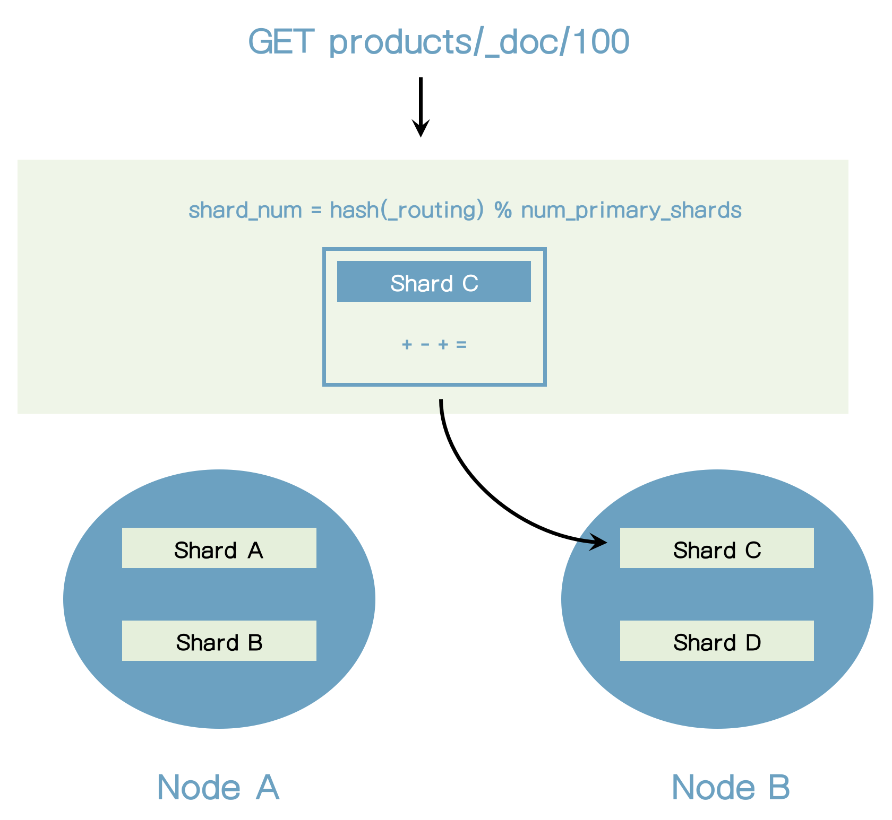
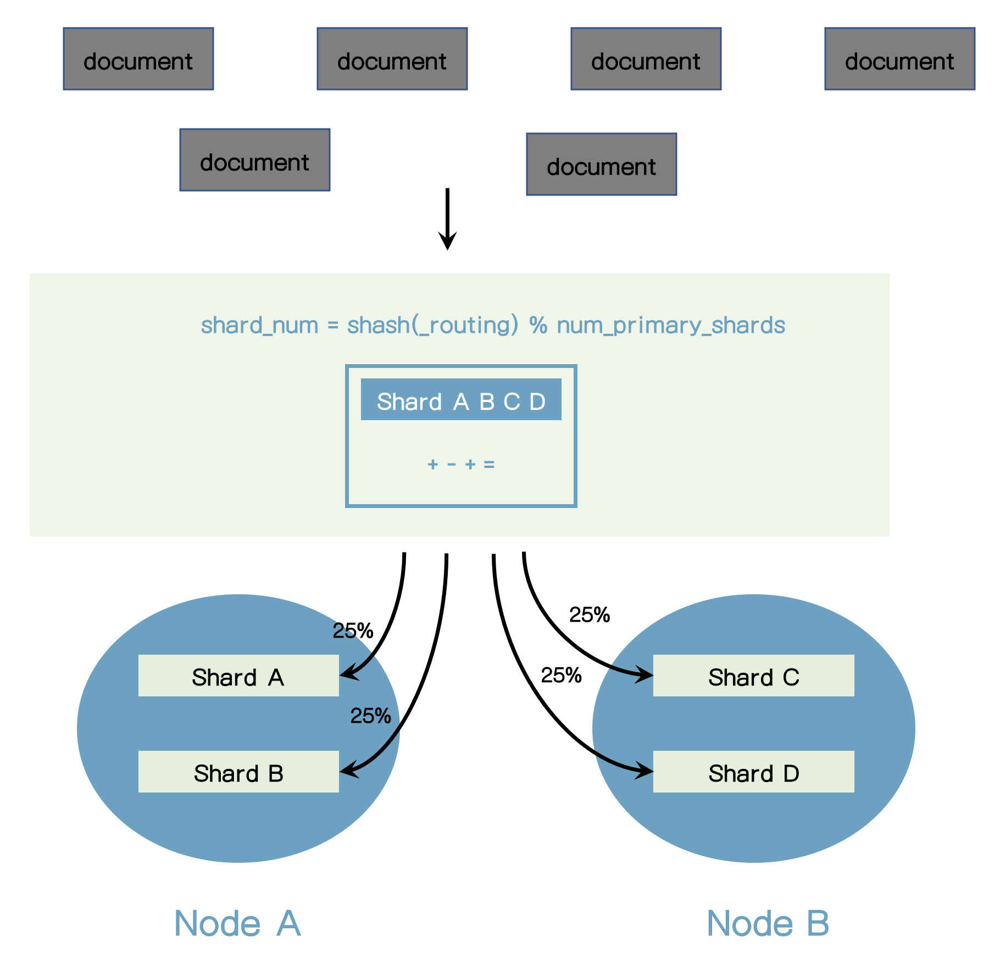
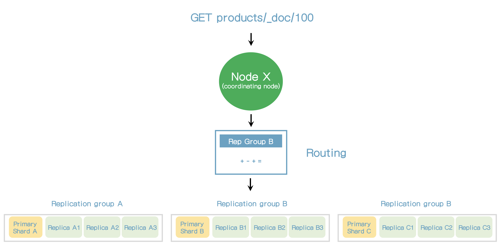
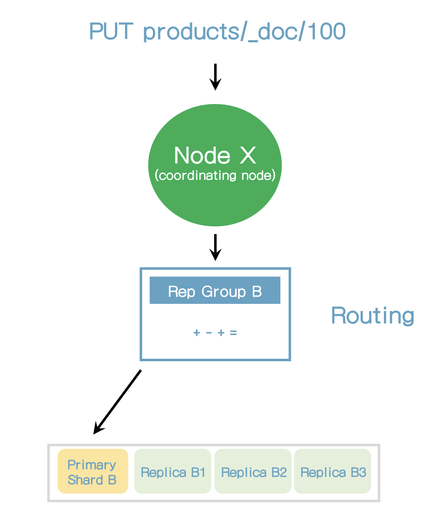
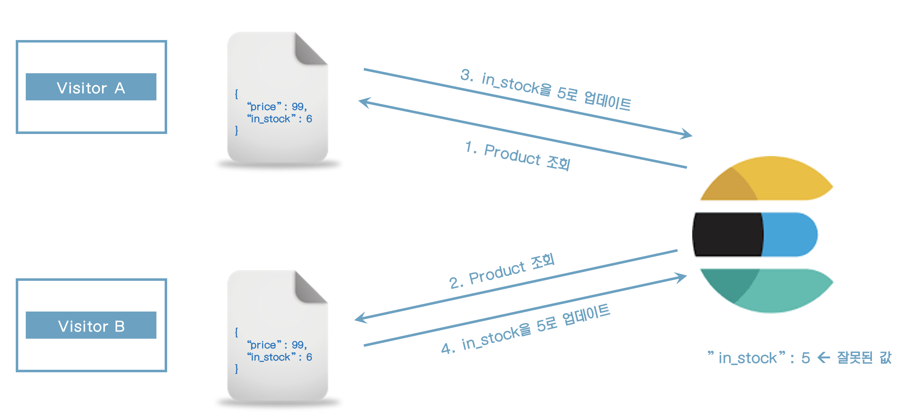
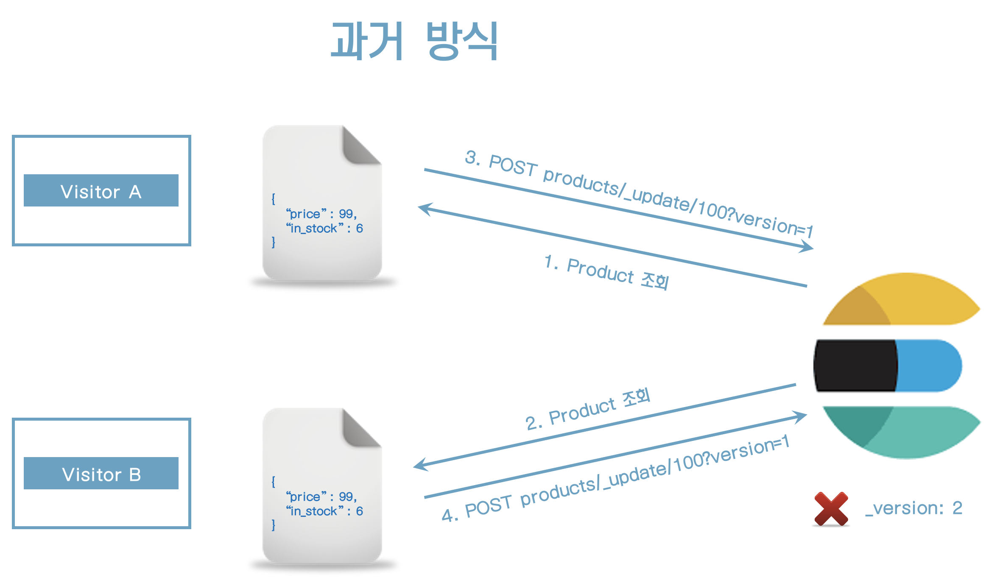
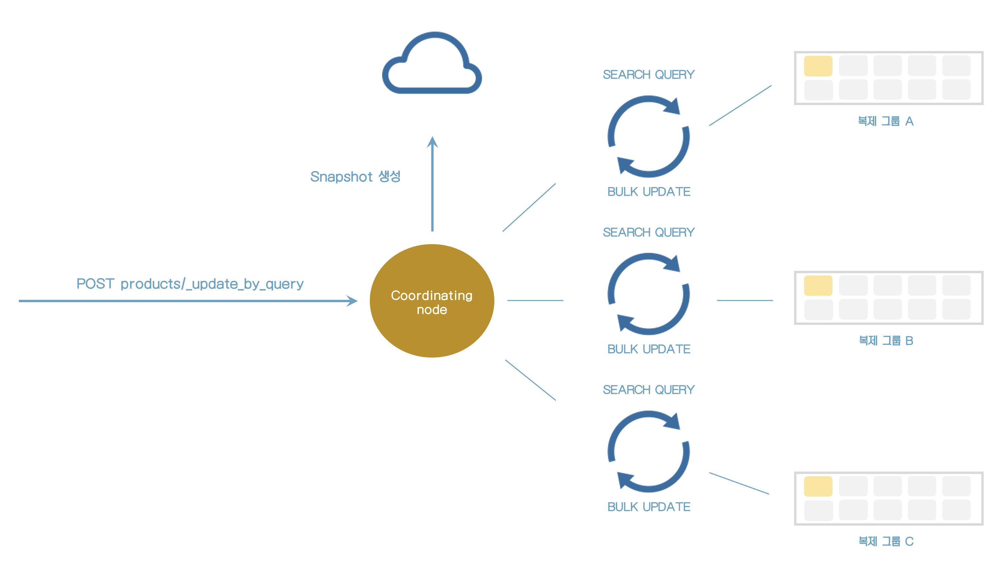

## Documents 관리하기


### 18. Indices 생성 및 삭제

#### 생성

```
PUT products
{
  "settings": {
    "number_of_shards": 2,
    "number_of_replicas": 2
  }
}
```

#### 삭제

```
DELETE products
```


### 19. Documents 인덱싱

```
POST prodcts/_doc
{
  "name": "Coffee Maker",
  "price": 64,
  "in_stock": 10
}
```

#### 결과

```
{
  "_index" : "prodcts",
  "_type" : "_doc",
  "_id" : "sRA_l4IBt484IutFSnQZ",
  "_version" : 1,
  "result" : "created",
  "_shards" : {
    "total" : 2,
    "successful" : 1,
    "failed" : 0
  },
  "_seq_no" : 7,
  "_primary_term" : 1
}
```

아래와 같이 수정을 하는 경우에도 새로 생성이 된다.

```
PUT products/_doc/100
{
  "name": "Toaster",
  "price": 49,
  "in_stock": 10
}
```

> action.auto_create_index setting에서 존재하지 않는 문서를 새로 추가할 것인지 설정이 된다. (default: true)


### 20. document의 ID로 조회하기

#### 조회

```
GET products/_doc/100
```

결과

```json
{
  "_index" : "products",
  "_type" : "_doc",
  "_id" : "100",
  "_version" : 1,
  "_seq_no" : 0,
  "_primary_term" : 1,
  "found" : true,
  "_source" : {
    "name" : "Toaster",
    "price" : 49,
    "in_stock" : 10
  }
}
```


### 21. Documents 수정

#### 기존 필드 수정

```
POST products/_update/100
{
  "doc": {
    "in_stock": 3
  }
}
```

없는 필드를 수정하는 경우에도 사용할 수 있다.

```
POST products/_update/100
{
  "doc": {
    "tags": ["electronics"]
  }
}
```


#### Documents는 immutable하다.

* Elasticsearch Documents는 immutable하다. 기존 document를 수정할 수 없다.
* 기존 문서를 수정하는 경우는? 사실은 수정이 아니라 새로 만들었다.
* Update API는 문서를 update하는 것처럼 보인다. (Create -> delete)
* Update API는 단순하고 네트워크 트래픽을 줄여준다. 
    * 문서가 저장된 샤드 내에 1번의 요청만 발생, 
    * update api가 없다면 2번 요청을 해야 한다. (create -> delete)


#### Update API는 어떻게 동작하는가?

* 현재 문서가 조회된다.
* 필드값이 변경된다.
* 기존 문서는 수정된 문서로 대체된다.
* Application 수준에서 동일하게 작업할 수 있다.


### 22. Script로 수정하기

* ctx는 context의 약어이다.
* _source를 통해 기존 문서에 접근할 수 있다.

```
POST products/_update/100
{
  "script": {
    "source": "ctx._source.in_stock--"
  }
}
```

기존 필드에 값을 대입하려면

```
POST products/_update/100
{
  "script": {
    "source": "ctx._source.in_stock = 10"
  }
}
```

params를 통해 값을 대입받을 수 있다.

```
POST products/_update/100
{
  "script": {
    "source": "ctx._source.in_stock -= params.quantity",
    "params": {
      "quantity": 4
    }
  }
}
```

> _update api는 변경사항이 없으면 result가 noop이다.
>
> 하지만 scripted update는 항상 updated로 표시가 된다.


source에 조건문을 추가하려면

```
POST products/_update/100
{
  "script": {
    "source": """
      if (ctx._source.in_stock == 0) {
        ctx.op = 'noop';
      }
      
      ctx._source.in_stock--;
    """,
    "params": {
      "quantity": 4
    }
  }
}
```

in_stock이 0보다 적으면 result가 noop이고 그렇지 않으면 updated로 표시될 것이다.

혹은 아래와 같이 표현할 수 있다.

```
POST products/_update/100
{
  "script": {
    "source": """
      if (ctx._source.in_stock > 0) {
        ctx._source.in_stock--;
      }
    """,
    "params": {
      "quantity": 4
    }
  }
}
```

또는 in_stock이 1보다 적으면 문서를 delete하게 하는 방법이다.

```
POST products/_update/100
{
  "script": {
    "source": """
      if (ctx._source.in_stock < 1) {
        ctx.op = 'delete';
      }
      
      ctx._source.in_stock--;
    """,
    "params": {
      "quantity": 4
    }
  }
}
```


### 23. Upsert

upsert는 문서가 존재하는지 여부에 따라 조건적으로 update하거나 insert하는 것을 의미한다.

```
POST products/_update/101
{
  "script": {
    "source": "ctx._source.in_stock++"
  },
  "upsert": {
    "name": "Blender",
    "price": 399,
    "in_stock": 5
  }
}
```

위의 스크립트를 실행하면 101문서는 존재하지 않기 때문에 새로 생성이 될 것이다.

다시 한번 실행이 되면 source에 있는 스크립트가 실행이 될 것이다.


### 24. Replacing Documents

문서의 내용을 변경하는 기능이다.

기존에 있던 모든 컬럼은 수정하는 문서의 내용으로 변경이 된다.

```
PUT products/_doc/100
{
  "name": "Toaster",
  "price": 79,
  "in_stock": 10
}
```


### 25. Deleting Documents

```
DELETE products/_doc/101
```


### 26. Routing의 이해

#### Routing 소개

* Elasticsearch가 문서를 어디에 저장할지를 어떻게 알 수 있는가?
* 문서는 인덱싱 된 후 어떻게 찾을 수 있는가?
* 그 해답은 Routing이다.
* Routing은 문서의 샤딩을 찾는 과정이다.

> shard_num = hash(_routing) % num_primary_shards

_routing은 기본적으로 문서의 ID이다.





#### Custom routing

* Routing은 Elasticsearch를 사용할 때 100% 투명하다.
* Elasticsearch를 사용하고 배우기 쉽다.
* 여러가지 목적으로, routing을 커스트마이징하는 것이 가능하다.
* 기본 routing 전략은 문서들을 골고루 분배되는 것을 보장한다.
* shard의 수는 인덱스가 생성된 후에는 변경될 수 없다.
    * shard의 수가 변경되면 routing되는 shard가 변경되어서 문서가 제대로 찾을 수 없기 때문이다.
    * Shard 수를 변경하려면 인덱스를 새로 만들어야 한다. (Reindex)





### 27. Elasticsearch가 데이터를 어떻게 읽는가?

* 읽기 요청을 받는 노드는 요청을 처리하는 책임을 갖고 이 노드는 코디네이팅 노드라고 한다.
* 첫번째 단계는 문서가 어디에 저장되어 있는지 찾는 것이다.
* 이는 라우팅을 통해 해결된다.




* Elasticsearch가 primary 샤드에서 직접 요청을 받는다면, 모든 요청은 동일 샤드에서 처리될 것이다.
* 복제노드에서 요청을 받으면 elasticsearch는 Adaptive Replica Selection(ARS)라고 불리는 기술을 사용한다.
* ARS는 최적의 복제본을 선택하는 것이다.
* ARS는 응답시간을 줄여준다.
* 코디네이팅 노드는 응답을 모아서 클라이언트로 보낸다.


### 28. Elasticsearch가 데이터를 어떻게 저장하는가?

* 복제 그룹내의 샤드에 요청을 라우팅 하지 않고 항상 primary 샤드로 라우팅한다.
* primary 샤드는 요청을 검증하는 책임을 가지고 있다.
* 요청의 구조를 검증하고 필드 값을 검증한다.
* 예를 들어 숫자 필드에 객체 유형을 추가할 때 에러를 유발할 수 있다.
* 그리고 나서, primary 샤드는 복제 샤드로 복제하기 전에 로컬에 쓰기작업을 수행한다.
* 성능향상을 위해서 primary 샤드는 복제샤드로 병렬로 전달한다.
* 복제노드에 복제될 수 없더라도 이 동작은 성공한다.




#### Primary terms

* 이전 샤드와 새로운 primary 샤드를 구분하는 방법
* primary 샤드가 얼마나 많이 변경되었는지에 대한 수치
* primary term은 쓰기 작업에서 추가된다.

> 현재 Primary 샤드가 다운되고 다른 샤드가 primary 샤드가 되면 Primary Term이 증가한다.


#### Sequence numbers

* primary term과 같이 쓰기 동작에서 추가된다.
* 쓰기 작업에 증가된 수치
* primary 샤드는 sequence number를 증가시킨다.
* elasticsearch가 쓰기 작업을 가능하게 한다.


#### primary 샤드가 실패할 때 복구하기

* Primary terms와 sequence number는 elsticsearch가 primary 샤드의 다운으로부터 복구하는데 필요한 키이다.
    * elasticsearch가 쓰기 동작이 어디에서 적용되어야 할지 알 수 있다.
* 대규모 인덱스에서 이 과정은 비싼 작업일 수 있다.
    * 속도를 증가시키기 위해 elasticsearch는 checkpoint를 사용한다.


#### global/local checkpoints

* Sequence number
* 각 복제 그룹은 global checkpoint를 가지고 있다.
* 각 복제 샤드는 local checkpoint를 가지고 있다.
* global checkpoint
    * 복제그룹 내의 모든 active 샤드에서 sequence number는 오름차순으로 정렬되어 있다. (이는 seqeunce number를 포함하는 모든 동작은 global checkpoint보다 낮다는 뜻이다)
* local checkpoints
    * 마지막 쓰기 동작이 수행된 sequence number


### 29. Document versioning 이해하기

#### versioning 소개

* 문서의 리비전 이력이 아니다.
* elasticsearch는 모든 문서에 `_version` 메타데이터 필드를 저장한다.
    * 값은 interger이다.
    * 문서를 수정할 때 1씩 증가한다.
    * 문서를 삭제할 때 값은 60초동안 유지된다.
        * 새 문서를 만들 때 60초 안에 동일한 ID로 만들면 _version이 유지된다.
        * index.gc_deletes 설정
    * `_version`필드는 문서를 조회할 때 출력된다.


```
{
  "_index" : "products",
  "_type" : "_doc",
  "_id" : "101",
  "_version" : 4,
  "_seq_no" : 6,
  "_primary_term" : 1,
  "found" : true,
  "_source" : {
    "name" : "Blender",
    "price" : 399,
    "in_stock" : 8
  }
}
```

* 기본 versioning 타입은 `internal` 버저닝이라고 한다.
* `external` 버저닝 타입도 있다.
    * 버전이 Elasticsearch 외부에서 관리될 때 유용하다.
    * 예) 문서가 RDBMS에 저장될 때


#### versioning의 요점은 무엇인가?

* 문서가 얼마나 많이 수정되었는가 확인할 수 있다.
    * 유용하지는 않을 수 있다.
* 버저닝은 더이상 사용되지 않고 이전에 있었던 것이다.
* 이전에는 optimistic 동시성 제어를 하기 위한 방법이었다.
    * 지금은 더 나은 방법이 있다.
* 이 필드는 이전 버전을 사용하는 클러스터에서 확인할 수 있을 것이다.


### 30. Optimistic concurrency control

### 소개

* 동시 작업으로 인한 의도치 않은 문서 수정을 방지한다.
* 이런 일이 발생할 많은 시나리오가 있다.
    * 예) 웹 애플리케이션에서 동시 방문자 처리




* elasticsearch는 위의 시나리오가 잘못된 것으로 인지하지 못하고 in_stock 필드를 5로 업데이트를 한다.
* 어떻게 수정할 수 있는가?
* 문서를 조회한 이후에 수정이 되었다면 수정작업이 실패할 필요가 있다.




* 과거 방식은 update 요청 시 _version 필드를 사용하는 것이다.
* version정보가 저장된 version과 맞지 않을 경우 Update 작업은 실패할 것이다.
* 이러한 접근 방식은 대부분 잘 동작하지만 잘못된 경우가 있다.
* primary terms와 sequence number가 해결하는 문제들이 더 많다.
* 그래서 새로운 접근 방식은 primary terms와 sequence number를 사용하는 것이다.


* elasticsearch는 기존 문서가 의도치 않게 수정하는 것을 방지하도록 primary_term과 seq_no을 사용한다.


아래 문서를 조회하면

```
GET products/_doc/100
```

다음과 같은 결과가 출력된다.

```json
{
  "_index" : "products",
  "_type" : "_doc",
  "_id" : "100",
  "_version" : 1,
  "_seq_no" : 1,
  "_primary_term" : 1,
  "found" : true,
  "_source" : {
    "name" : "Toaster",
    "price" : 79,
    "in_stock" : 10
  }
}
```

위에서 _seq_no과 _primary_term값으로 문서를 수정하자.

```
POST products/_update/100?if_primary_term=1&if_seq_no=1
{
  "doc": {
    "in_stock": 123
  }
}
```

문서가 정상적으로 수정이 된다.

한번 더 실행해보면 수정이 실패하는 것을 알 수 있다.

```
{
  "error" : {
    "root_cause" : [
      {
        "type" : "version_conflict_engine_exception",
        "reason" : "[100]: version conflict, required seqNo [1], primary term [1]. current document has seqNo [8] and primary term [1]",
        "index_uuid" : "Ige3pk0ZRLacmIoeV1wDFg",
        "shard" : "0",
        "index" : "products"
      }
    ],
    "type" : "version_conflict_engine_exception",
    "reason" : "[100]: version conflict, required seqNo [1], primary term [1]. current document has seqNo [8] and primary term [1]",
    "index_uuid" : "Ige3pk0ZRLacmIoeV1wDFg",
    "shard" : "0",
    "index" : "products"
  },
  "status" : 409
}
```


#### 실패를 어떻게 처리할 수 있는가?

* 애플리케이션 레벨에서 이 상황을 처리한다.
    * 문서를 다시 조회한다.
    * 새로운 update 요청에 _primary_term과 _seq_no을 사용한다.


### 31. update by query

#### 소개

* 한번에 한개의 문서를 업데이트하는 방법을 배웠다.
* 단일 쿼리로 여러 문서를 업데이트 해보자.
    * RDBMS에서 WHERE절에서 UPDATE하는 것과 유사하다.
* 쿼리는 방금 배웠던 3가지 개념을 사용한다.
    * Primary terms
    * Sequence numbers
    * Optimistic concurrecy control


* 어떤 사람이 여러 개의 상품을 구입했고 "in_stock"을 줄여야 한다고 가정하자.
* 각 문서를 업데이트 할수 있지만 한번의 쿼리로 업데이트 하다고 하자.
* 이를 위해 update_by_query를 사용할 수 있다.

```
POST products/_update_by_query
{
  "script": {
    "source": "ctx._source.in_stock--"
  },
  "query": {
    "match_all": {}
  }
}
```

```
{
  "took" : 46,
  "timed_out" : false,
  "total" : 2,
  "updated" : 2,
  "deleted" : 0,
  "batches" : 1,
  "version_conflicts" : 0,
  "noops" : 0,
  "retries" : {
    "bulk" : 0,
    "search" : 0
  },
  "throttled_millis" : 0,
  "requests_per_second" : -1.0,
  "throttled_until_millis" : 0,
  "failures" : [ ]
}
```

* 2개의 문서가 수정되었음을 알 수 있다.


#### update_by_query 실행 시 내부적으로 어떤 일이 일어나는지 알아보자.



* update_by_query가 처리될 때 index의 snapshot이 만들어진다.
* snapshot이 만들어질때 쿼리와 맞는 문서를 찾기 위해서 각 쿼리가 인덱스 샤드에 보내진다.
* 검색 쿼리가 문서와 일치할 때마다 bulk request가 문서를 update하기 위해 보내진다.
* 쿼리는 수천개의 결과를 처리하기 위해서 내부적으로 scroll API를 사용한다.
* <u>검색(search)과 bulk request가 순차적으로 보내진다</u>. (한번에 하나씩)
* 모든 것을 동시에 하지 않는 이유는 에러를 어떻게 처리하는냐와 관련이 있다.
* 검색과 bulk쿼리를 수행 중 에러가 있다면 elasticsearch는 자동으로 10번 재시도한다.
* 재시도 수는 "retries"에 표시되어 있다.
* query가 정상적이지 않다면 전체 쿼리가 취소된다.
* 에러가 발생할 때 많은 문서가 수정된다면 요청이 실패하더라도 수정된 상태로 남아있게 된다.
* 많은 데이터베이스에서 보았던 트랜잭션으로 실행되지 않는다.
* API에서 부분적으로 성공/실패를 확인할 수 있다.


#### snapshot이 어떻게 사용되는가

* snapshot이 만들어진 후 변경된 것을 덮어쓰는 것을 방지한다.
    * 많은 문서를 업데이트 한다면 오래 걸릴 수도 있다.
* 각 문서의 primary term과 sequence number가 사용된다.
    * 문서는 값이 snapshot과 같은 것일 때만 수정된다.
    * 알고 있는 것지만, 이런 방식을 `optimistic concurrency control`이라고 한다.
* 버전의 #은 version_conflicts 키에서 확인할 수 있다.

```
POST products/_update_by_query
{
  "conflicts": "proceed", 
  "script": {
    "source": "ctx._source.in_stock--"
  },
  "query": {
    "match_all": {}
  }
}
```

conflicts는 버전 충돌 시 진행할지 여부이다.


### 32. Delete by query

#### 소개

* 단일 쿼리로 여러개의 문서를 삭제해보자.
* 쿼리는 update by query API와 매우 유사하다.

```POST products/_delete_by_query
{
  "query": {
    "match_all": {}
  }
}
```


### 33. Batch processing

#### Bulk API 소개

* 하나의 쿼리로 여러 문서에 특정 동작을 수행할 수 있는 방법을 알아보자.
* Bulk API는 NDJSON 명세를 사용한다.
         action_and_metadata \n
         optional_source\n
         action_and_metadata\n
         optional_source\n


새 문서를 인덱싱해보자.

```
POST _bulk
{ "index": { "_index": "products", "_id": 200 } }
{ "name": "Espresso Machine", "price": 199, "in_stock": 5 }
{ "create": { "_index": "products", "_id": 201 } }
{ "name": "Milk Frother", "price": 149, "in_stock": 14 }
```

* index와 create의 차이점은 무엇인가?
    * `create`는 문서가 존재한다면 실패한다.
    * `index`는 실패하지 않는다. 즉, 문서가 없다면 추가되지만 있다면 수정이 된다.


수정 및 삭제를 해보자.

products에 bulk를 하는 것이므로 url에 products를 추가하면 _index 필드는 필요가 없어진다.

```
POST products/_bulk
{ "update": { "_id": 201 } }
{ "doc": { "price": 129} }
{ "delete": { "_id": 200 } }
```


#### 알아야 할 내용 (1/3)

* HTTP content-Type 헤더가는 다음과 같이 설정되어야 한다.
    * Content-Type: application/x-ndjson
    * application/json은 잘못된 방법이다.
* Console tool은 알아서 처리해준다.
    * elasticsearch SDK 또한 알아서 처리해준다.
    * HTTP client를 사용할 때 우리 스스로 처리해야 한다.

#### 알아야 할 내용 (2/3)

* 각 라인은 new line 문자로 끝나야 한다. (\n 혹은 \r\n)
    * 마지막 라인은
        * 텍스트 에디터에서, 마지막 라인은 공백이어야 한다는 것을 나타낸다.
    * console tool에서는 자동으로 처리된다.
    * 일반적으로 bulk 파일을 만드는 script에서는 이러한 것들을 처리해야 한다.
    * 마지막 라인에 \n 혹은 \r\n으로 끝나지 말아야 한다.

#### 알아야 할 내용 (3/3)

* 하나의 액션이 실패가 되면 다른 액션에 영향을 주지 않는다. 정상실행이 된다.
    * bulk request 전체가 실패한 것으로 하지 않는다.
* bulk api는 각 액션에 대한 상세 정보를 리턴한다.
    * 액션이 성공했는지 알아보려면 *items* 키를 확인하라.
        * 순서는 요청된 액션과 동일하다.
    * errors 키는 에러가 발생할 때 알려준다.


#### bulk API를 언제 사용해야 할까

* 동시에 많은 쓰기 작업을 수행할 때
    * 예) 많은 데이타 임포트 혹은 수정
* bulk API는 개별 쓰기 요청을 보내는 것보다 더 효율적이다.
    * 많은 네트워크 라운드트립을 없앨수 있다.


#### 2가지 더

* Routing은 문서 샤드를 결정할 때 사용된다.
    * routing은 필요하다면 커스트마이징 될 수 있다.
* Bulk API는 optimistic concurrency control을 지원한다.
    * action metadata 내에 if_primary_term과 if_seq_no을 포함하라.


### 34. cURL로 데이터 임포트하기

products-bulk.json 파일을 products 인덱스로 임포트

```
curl -H "Content-Type: application/x-ndjson" -XPOST http://localhost:9200/products/_bulk --data-binary "@products-bulk.json"
```

제대로 임포트 되었는지 확인

```
GET _cat/shards?v
```

```
index                  shard prirep state       docs   store ip         node
products               0     p      STARTED     1000 395.1kb 172.20.0.2 02743a720ed3
products               0     r      UNASSIGNED                          
```

총 1000개의 문서가 임포트되었다.
