### 37. analysis 소개

#### Analysis

* text analysis라고 불린다.
* text  필드/값에 적용된다.
* text 값은 문서를 인덱싱할 때 분석된다.
* 결과는 효과적인 검색을 위해  데이터 구조에 저장된다.
* _source 객체는 문서 검색할 때는 사용되지 않는다.
    * 문서 인덱싱할 때 정확한 값을 포함한다.


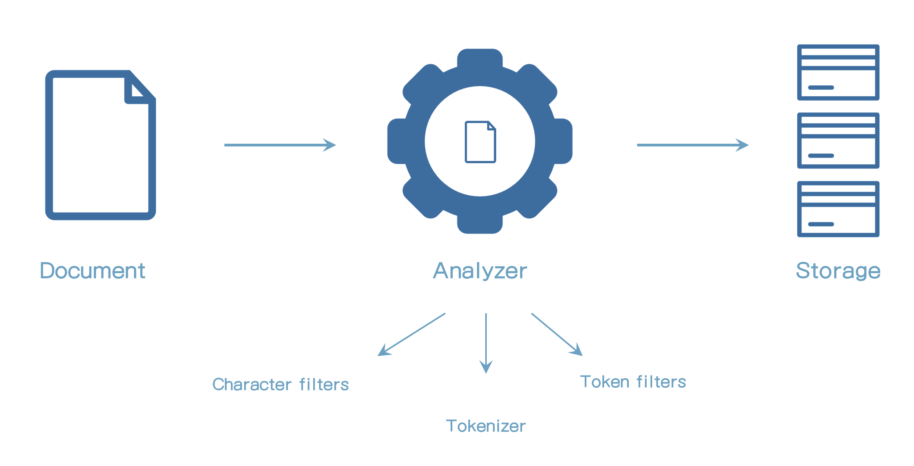

* analyzer는 3가지 블록으로 구성되어 있다. (character filters, tokenizer, token filters)
* text를 analyzing하는 결과는 검색가능한 데이터 구조에 저장된다.


#### Character filters

* 문자를 추가, 삭제, 변경한다.
* Analyzer는 0개 이상의 character filter를 포함한다.
* character filter는 정의된 순서대로 적용된다.
* 예(html_stripe 필터)
    * Input: "I&apos;m in a \<em>good\</em> mood\&nbsp;-\&nbsp;and I \<strong> love \</strong> açaí!"
    * Output: "I'm in a good mood - and I love açaí!"


#### Tokenizers

* Analyzer는 하나의 tokenizer를 포함한다.
* 문자를 토크나이징한다. 예) 토큰으로 짜른다.
* 문자는 토큰의 부분으로 자른다.
* 예
    * Input: "I REALLY like beer!"
    * Output: ["I", "REALLY", "like", "beer"]


#### Token filters

* 입력으로 토크나이저이ㅡ 결과를 받는다. (Ex: 토큰)
* token filter는 토큰을 추가, 수정, 삭제할 수 있다.
* analyzer는 0개 이상의 token filter를 가진다.
* token filter는 정의된 순서대로 적용된다.
* 예: lowercase filter
    * Input: ["I", "REALLY", "like", "beer"]
    * Output: ["i", "really", "like", "beer"]


#### built-in, custom 컨포넌트

* Built-in analyzer, character filters, token filters를 사용할 수 있다.
* 또한 Custom analyzer를 사용할 수 있다.


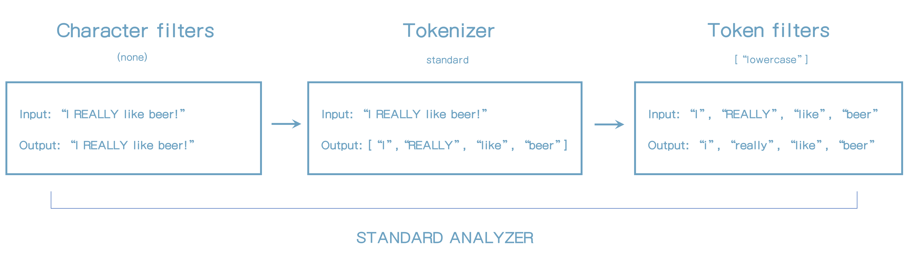


### 38. Analyzer API 사용하기

아래 문장을 analyzer로 실행하면 standard analyzer로 실행이 된다.

```
POST _analyze
{
  "text": "2 guys walk into   a bar, but the third... DUCKS! :-)",
  "analyzer": "standard"
}
```

Standard analyzer는 특수문자는 모두 제거한다.

```
{
  "tokens" : [
    {
      "token" : "2",
      "start_offset" : 0,
      "end_offset" : 1,
      "type" : "<NUM>",
      "position" : 0
    },
    {
      "token" : "guys",
      "start_offset" : 2,
      "end_offset" : 6,
      "type" : "<ALPHANUM>",
      "position" : 1
    },
    {
      "token" : "walk",
      "start_offset" : 7,
      "end_offset" : 11,
      "type" : "<ALPHANUM>",
      "position" : 2
    },
    {
      "token" : "into",
      "start_offset" : 12,
      "end_offset" : 16,
      "type" : "<ALPHANUM>",
      "position" : 3
    },
    {
      "token" : "a",
      "start_offset" : 19,
      "end_offset" : 20,
      "type" : "<ALPHANUM>",
      "position" : 4
    },
    {
      "token" : "bar",
      "start_offset" : 21,
      "end_offset" : 24,
      "type" : "<ALPHANUM>",
      "position" : 5
    },
    {
      "token" : "but",
      "start_offset" : 26,
      "end_offset" : 29,
      "type" : "<ALPHANUM>",
      "position" : 6
    },
    {
      "token" : "the",
      "start_offset" : 30,
      "end_offset" : 33,
      "type" : "<ALPHANUM>",
      "position" : 7
    },
    {
      "token" : "third",
      "start_offset" : 34,
      "end_offset" : 39,
      "type" : "<ALPHANUM>",
      "position" : 8
    },
    {
      "token" : "ducks",
      "start_offset" : 43,
      "end_offset" : 48,
      "type" : "<ALPHANUM>",
      "position" : 9
    }
  ]
}

```

이는 아래와 같다.

```
POST _analyze
{
  "text": "2 guys walk into   a bar, but the third... DUCKS! :-)",
  "char_filter": [], 
  "tokenizer": "standard", 
  "filter": ["lowercase"]
}
```


### 39. 역색인(inverted indices) 이해하기

#### 소개

* 필드값들이 여라가지 데이터 구조 중 하나로 저장된다.
    * 데이터 구조는 필드 데이터 유형에 따라 다르다.
* 효율적인 데이타 접근을 보장한다 - 예. 검색
* Elasticsearch가 아니라 아파치 루씬이 처리한다.
* 이번 내용은 역색인에 초점을 두고 있다.


#### 역색인

* 텀(term) 사이 매핑과 어느 문서가 포함하는가
* 분석기 외부 관점에서는 텀(term)이라는 용어를 사용한다.
    * 토큰(token)이라는 용어는 분석기 관점에서만 사용된다.
    * 대부분은 텀(term)이라고 사용한다.
* 텀(term)은 알파벳순으로 정렬되어 있다.
* 역색인은 단순히 텀(term)과 문서 ID보다 더 많은 정보를 가지고 있다.
    * 예) 스코어를 위한 정보
* 하나의 텍스트 필드 당 하나의 역색인 파일이 생긴다.
* 예를 들면 다른 데이터 타입은 BKD 트리를 사용한다. (예: 숫자, 날짜, 위치)


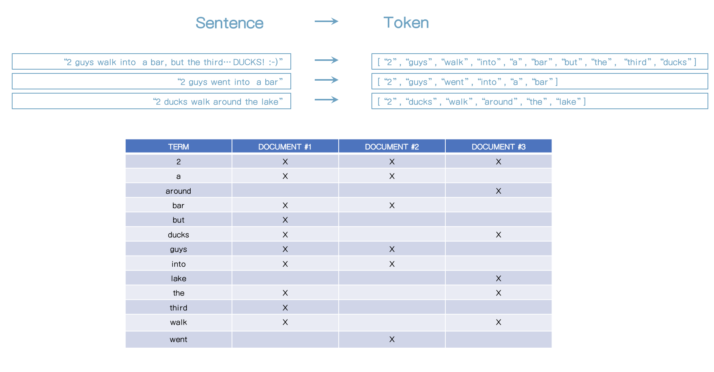

* ducks 를 검색할 때 역색인에서 어느 문서가 ducks를 포함하고 있는지 확인하면 된다. (#1, #3)


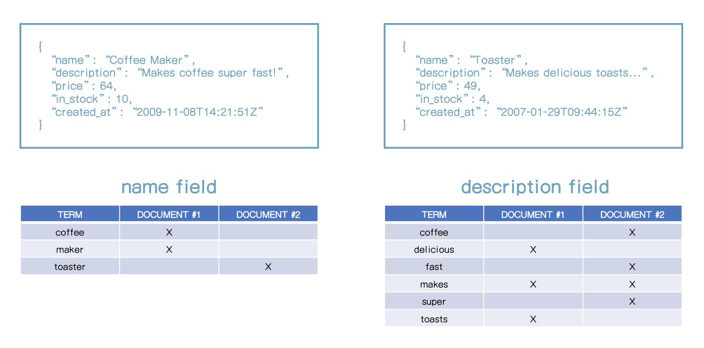

* 위와 같이 다른 2개의 문서를 인덱싱을 하면 역색인 파일은 각 필드별로 각각 만들어진다. (name 필드, description 필드)


### 40. Mapping 소개

#### mapping은 무엇인가?

* 문서 구조를 정의한다 (예: 필드와 데이터 타입)
    * 또한 값이 어떻게 인덱싱되는지 구성하는데 사용
* 관계형 DB에서 테이블 스키마와 유사
* 명시적인 매핑
    * 우리가 직접 필드 매핑을 정의
* 동적 매핑
    * elasticsearch가 필드 매핑을 정의한다.


### 41. 데이터 타입

object, text, float, boolean, interger, double, short, date


#### object 데이터 타입

* JSON object에 사용
* objects는 nested가 될 수 있다.
* Properties 파라미터를 사용하여 매핑된다.
* objects는 루씬에 객체로 저장되지 않는다.
    * objects는 유효한 JSON을 인덱싱할 수 있도록 변형된다.
    * 특별한 경우에 objects는 flatten된다.


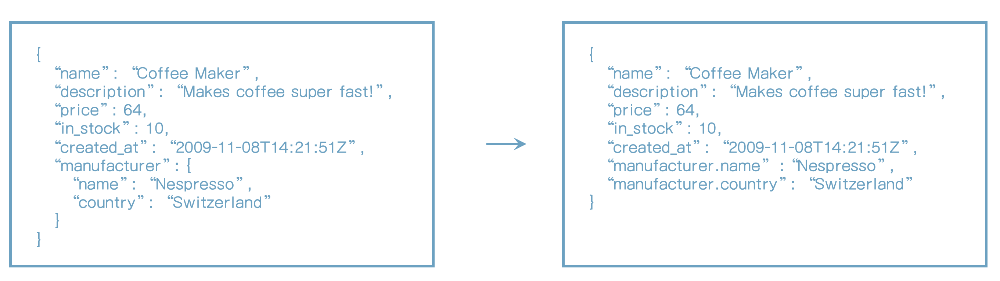

객체 array인 경우는 아래처럼 저장된다.

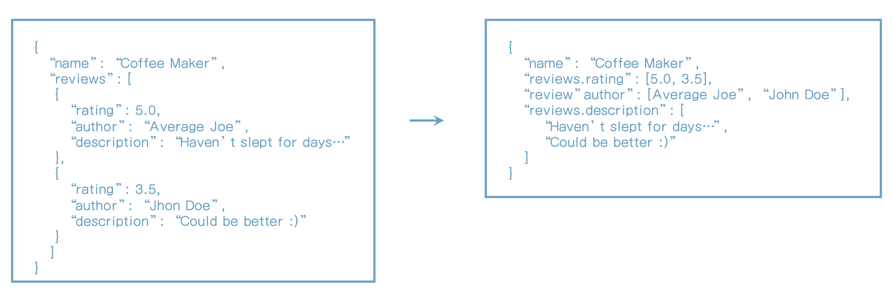

```
QUERY: MATCH products WHERE review.author == "John Doe" AND reviews.rating >= 4.0
```

위와 같이 쿼리를 실행하면 해당 문서가 검색되는 것으로 나온다. 하지만 실제로는 John Doe는 3.5이라서 검색되지 않아야 한다.

이는 우리가 원하는 결과가 아니다.


#### nested 데이터 타입

* Object 데이터 타입과 유사하지만 객체간의 관계를 유지한다.
    * objects 배열을 인덱싱할 때 유용하다.
* 독립적으로 objects를 쿼리할 수 있게 한다.
    * nested 쿼리를 사용해야 한다.
* nested object는 숨겨진 문서로 저장된다.

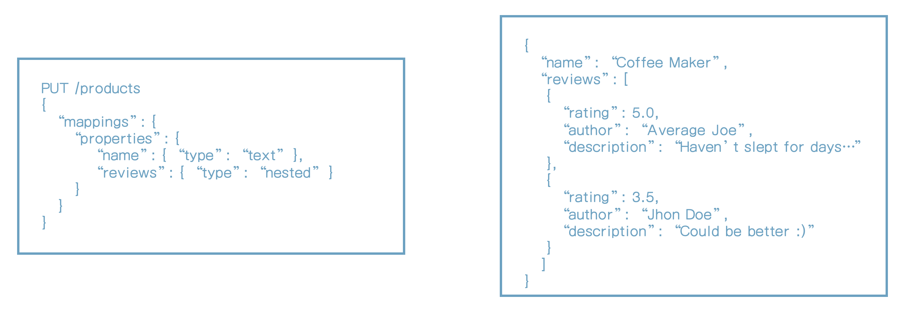

```
QUERY: MATCH products WHERE review.author == "John Doe" AND reviews.rating >= 4.0
```

객체는 독립적으로 저장되기 때문에 쿼리는 예상대로 동작한다.


루씬은 object의 개념이 없기 때문에 이러한 객체는 어떻게 저장될까?

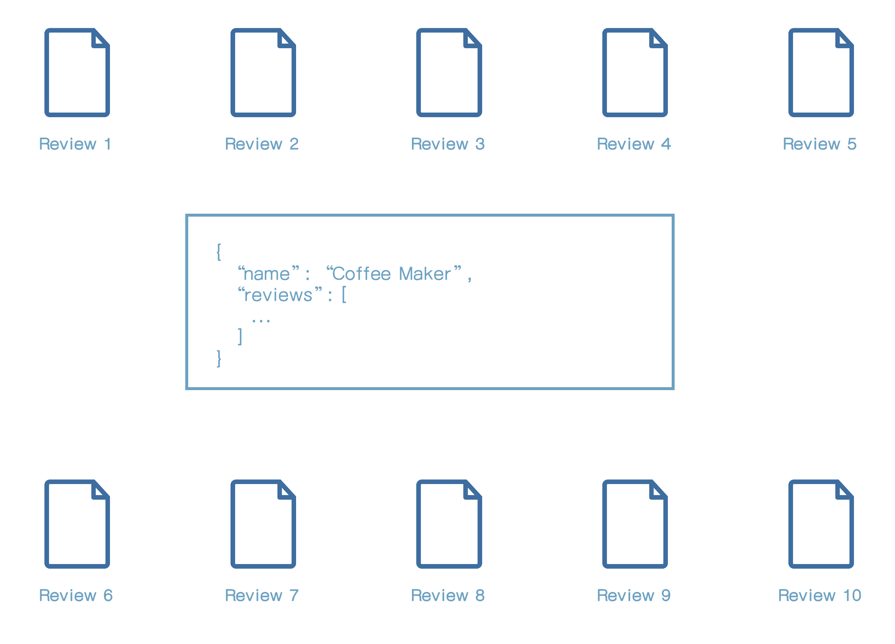

위와 같이 review를 10개 가진 하나의 문서(product)를 저장하면 총 11개의 문서가 저장된다. (1개의 product + 10개의 review)


#### keyword 데이터 타입

* 정확한 값이 일치할 때 사용
* 일반적으로 필터링, 집합(aggregation), 정렬에 사용된다.
* 예) PUBLISHED 상태의 기사를 검색
* Full-text 검색을 위해서는 text 데이터 타입을 사용해라.
    * 예) 기사 내용을 검색


### 42. Keyword 데이터 유형은 어떻게 동작하는가?

#### keyword 필드는 어떻게 분석되는가?

* Keyword 필드는 keyword analyzer로 분석된다.
* keyword analyzer는 no-op analyzer이다. (어떤 것도 하지 않는다는 뜻)
    * 단일 토큰으로 수정되지 않은 문자열을 출력
    * 이 토큰이 역색인 파일에 추가된다.
* keyword 필드는 정확히 일치, 집합(aggregation), 정렬에 사용된다.

```
POST _analyze
{
  "text": "2 guys walk into   a bar, but the third... DUCKS! :-)",
  "analyzer": "keyword"
}
```

```json
{
  "tokens" : [
    {
      "token" : "2 guys walk into   a bar, but the third... DUCKS! :-)",
      "start_offset" : 0,
      "end_offset" : 53,
      "type" : "word",
      "position" : 0
    }
  ]
}
```


### 43. type coercion 이해

* 데이터 유형이 문서 인덱싱될 때 확인된다.
    * 검증되고 어떤 값들은 실패한다.
    * 예) text 필드에 객체 인덱싱할 때
* 때로는, 잘못된 데이터 타입도 가능하다.


아래 쿼리를 차례대로 실행하자.

```
PUT coercion_test/_doc/1
{
  "price": 7.4
}
```

price에 float 타입으로 자동으로 지정된다.

```
PUT coercion_test/_doc/2
{
  "price": "7.4"
}
```

"7.4" 문자열 입력 시 7.4의 float타입으로 변경되어 저장된다.

```
PUT coercion_test/_doc/3
{
  "price": "7.4m"
}
```

"7.4m" 문자열 입력 시 float 타입으로 변경을 할 수 없으므로 실패한다.


조회를 해보자.

```
GET coercion_test/_doc/1
```

```
{
  "_source" : {
     "price" : 7.4
  }
}
```

7.4 float타입으로 조회된다.

2번 문서를 조회하면

```
GET coercion_test/_doc/2
```

```
{
  "_source" : {
    "price" : "7.4"
  }
}
```

"7.4" 문자열로 저장된다.


#### _source object의 의해

* 인덱싱할 때 제공된 값을 가진다. ("7.4")
    * 인덱싱된 값이 아니다 (7.4)
* 검색 쿼리는 인덱싱된 값을 사용한다. (_source값이 아니다)
    * BKD tree, 역색인, etc
* _source는 갑싱 어떻게 인덱싱되었는지를 나타내지 않는다.
    * _source에서 값을 사용하려면 coercion을 유지해라.
    * 이 예제에서는 string 혹은 float이 될 수 있다.


#### 몇 가지 더

* Integer 필드에 floating point를 넣으면 integer로 들어갈 것이다.
* coercion은 동적 매핑에서는 사용되지 않는다.
    * 새 필드에 "7.4"를 넣으면 text 매핑을 만들것이다.
* 항상 올바른 데이터 유형을 사용하도록 노력해라.
    * 특히 필드를 처음 인덱싱 할 때
* coercion을 비활성화 하는 것은 선택사항이다.
    * 기본값은 enabled이다.


### 44. Arrays 이해

* Array 데이터 타입은 없다.
* 어떤 필드도 0개 이상의 값을 가질수 있다.
    * 특별한 설정이나 매핑정보가 필요 없다.
    * 문서 인덱싱할 때 array를 사용하면 된다.
* Product 인덱스에 tags 필드를 사용했었다.


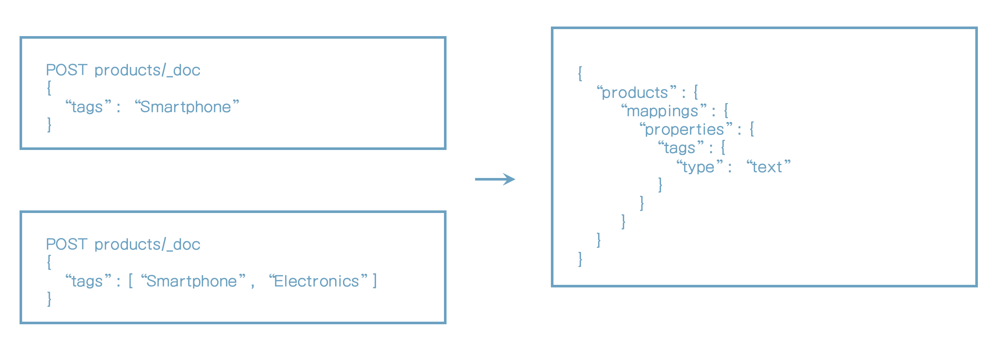

array를 위한 특별한 표시는 없다.

내부적으로 어떻게 저장이 되는 걸까?

```POST _analyze
{
  "text": ["Strings are simply", "merged together"],
  "analyzer": "standard"
}
```

```
{
  "tokens" : [
    {
      "token" : "strings",
      "start_offset" : 0,
      "end_offset" : 7,
      "type" : "<ALPHANUM>",
      "position" : 0
    },
    {
      "token" : "are",
      "start_offset" : 8,
      "end_offset" : 11,
      "type" : "<ALPHANUM>",
      "position" : 1
    },
    {
      "token" : "simply",
      "start_offset" : 12,
      "end_offset" : 18,
      "type" : "<ALPHANUM>",
      "position" : 2
    },
    {
      "token" : "merged",
      "start_offset" : 19,
      "end_offset" : 25,
      "type" : "<ALPHANUM>",
      "position" : 3
    },
    {
      "token" : "together",
      "start_offset" : 26,
      "end_offset" : 34,
      "type" : "<ALPHANUM>",
      "position" : 4
    }
  ]
}
```

이 의미는 string은 배열이 아니라 하나의 문자열로 취급된다는 의미이다.


#### 제약사항

* Array 값은 동일한 데이터 타입이어야 한다.

```
// correct data type
[ "electronics", "expensive", "popular" ]
[ 37, 45, 9 ]
[ true, false, true ] 
[ {"name": "Coffee Maker"}, {"name": "Toaster"}, {"name": "Blendar"} ]

//coercion
[ true, false, "true"]
[ "electronics", "expensive", 47]
[ 37, 45, "9" ]
[ true, false, "true" ]

// cannot coercion
[ {"name": "Coffee Maker"}, {"name": "Toaster"}, false]
```

* Coercion은 이미 매핑된 필드에서만 동작한다.
    * 동적 매핑으로 필드 매핑을 만들려면 array는 동일한 데이터 타입이어야 한다.
* coercion을 추천하지 않는다. (적어도 의도적으로는 사용하지 마라)


#### Nested arrays

* Arrays는 nested array를 포함할 수도 있다.
* Arrays는 인덱싱될 때 flatten 된다.
* [ 1, [2, 3] ]은 [ 1, 2, 3 ]이 된다.


### 45. 명시적인 매핑 추가

```
PUT reviews
{
  "mappings": {
    "properties": {
      "rating": { "type": "float" },
      "content": { "type": "text" },
      "product_id": { "type": "integer" },
      "author": {
        "properties": {
          "first_name": { "type": "text" }, 
          "last_name": { "type": "text" },
          "email": { "type": "keyword" }
        }
      }
    }
  }
}
```

```PUT reviews/_doc/1
{
  "rating": 5.0,
  "content": "Outstanding course! Bo really taught me a lot about Elasticsearch!",
  "product_id": 123,
  "author": {
    "first_name": "John",
    "last_name": "Doe",
    "email": "johndoe123@example.com"
  }
}
```


### 46. 매핑 조회

```
GET reviews/_mapping
```

```
{
  "reviews" : {
    "mappings" : {
      "properties" : {
        "author" : {
          "properties" : {
            "email" : {
              "type" : "keyword"
            },
            "first_name" : {
              "type" : "text"
            },
            "last_name" : {
              "type" : "text"
            }
          }
        },
        "content" : {
          "type" : "text"
        },
        "product_id" : {
          "type" : "integer"
        },
        "rating" : {
          "type" : "float"
        }
      }
    }
  }
}
```

특정 필드를 조회

```
GET reviews/_mapping/field/content
```

```
{
  "reviews" : {
    "mappings" : {
      "content" : {
        "full_name" : "content",
        "mapping" : {
          "content" : {
            "type" : "text"
          }
        }
      }
    }
  }
}
```


### 47. 필드명에 .(dot)을 사용하기

```
PUT reviews_dot_notation
{
  "mappings": {
    "properties": {
      "rating": { "type": "float" },
      "content": { "type": "text" },
      "product_id": { "type": "integer" },
      "author.first_name": { "type": "text" }, 
      "author.last_name": { "type": "text" },
      "author.email": { "type": "keyword" }
    }
  }
}
```

```
GET reviews_dot_notation/_mapping
```

```
{
  "reviews_dot_notation" : {
    "mappings" : {
      "properties" : {
        "author" : {
          "properties" : {
            "email" : {
              "type" : "keyword"
            },
            "first_name" : {
              "type" : "text"
            },
            "last_name" : {
              "type" : "text"
            }
          }
        },
        "content" : {
          "type" : "text"
        },
        "product_id" : {
          "type" : "integer"
        },
        "rating" : {
          "type" : "float"
        }
      }
    }
  }
}
```

객체로 설정한 것과 결과가 같다.


### 48. 기존 인덱스에 매핑 추가하기

Review 인덱스에 created_at 추가하기

```
PUT reviews/_mapping
{
  "properties": {
    "created_at": { "type": "date" }
  }
}
```


### 49. elasticsearch에 date는 어떻게 동작하는가?


### 50. 필드를 생략하면 어떻게 처리될까?

#### 필드 생략

* 모든 필드는 선택사항이다.
* 문서를 인덱싱할 때 필드를 생략할 수 있다.
* 예) null값을 허용하는 RDB와는 다르다.
* 애플리케이션 레벨에서 무결성 체크가 필요하다.
    * 예) 필수값
* 필드매핑을 추가하는 것은 필드를 필수값으로 만들지는 않는다.
* 검색은 자동으로 생략된 필드를 처리한다.


### 51. 매핑 파라미터

#### format 파라미터

* Date 필드의 포맷을 정의
* 가능하다면 기본 포맷을 사용하기를 권장
    * "strict_date_optional_time||epoch_millis"
* java의 DateFormatter 구문 사용하기
    * 예) "dd/MM/yyyy"
* 내장 포맷 사용하기
    * 예) "epoch_second"

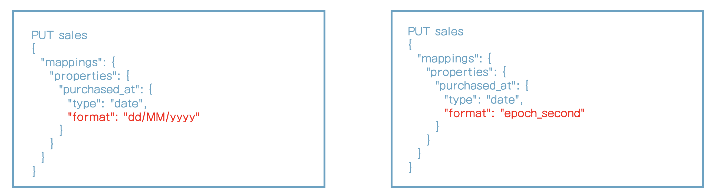


#### properties 파라미터

* object와 nested 필드의 nested 필드를 정의한다.

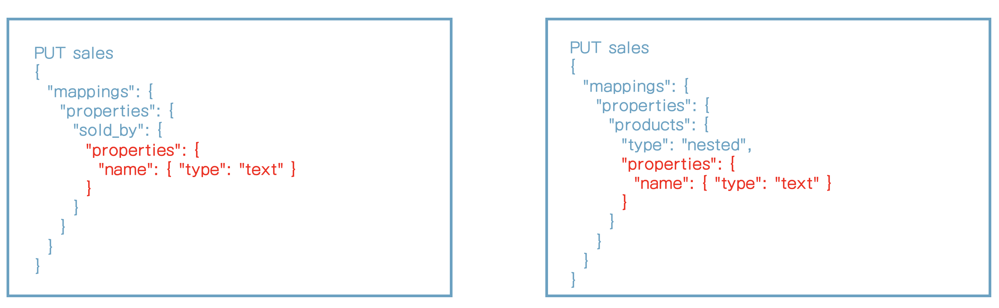

#### coerce 파라미터

* 값을 coercion을 가능/불가능하게 한다. (기본값: enabled)

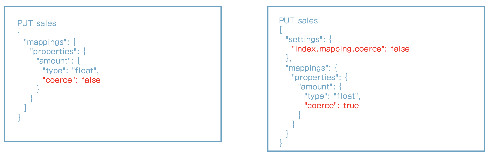

#### doc_values 소개

* elasticsearch는 다양한 데이타 구조를 사용한다.
    * 하나의 데이터 구조는 다양한 용도로 사용하지 못한다.
* 역색인은 text를 검색하는데 효과적이다.
    * 이 타입은 다른 다양한 패턴을 잘 처리하지 못한다.
* "Doc values"는 루씬에서 사용되는 다른 데이터 구조이다.
    * 다른 데이터 패턴에 최적화되어 있다 (document -> terms)
* 특히 inverted되지 않은 역색인
* 정렬, 집합, 스크립팅
* 대체용이 아닌 추가적인 데이터 구조이다.
* elsticsearch는 자동으로 적절한 데이터 구조를 조회한다.


#### doc_values 비활성화

* 디스크 저장공간을 절약하기 위해 doc_values를 false로 설정
    * 인덱싱 속도를 약간 증가시킨다.
* 집합, 정렬, 스크립팅을 사용하지 않는다면 doc values를 비활성화해라.
* 특히 대규모 인덱스에 유용하다. 작을 때는 의미 없다.
* 문서를 새 인덱스로 reindexing하지 않고는 변경될 수 없다.


#### norms 파라미터

* scoring을 위한 Normalization 요소
* 종종 결과를 필터링하지 않고 순위를 매길수 있다.
* Norms는 디스크 공간을 저장하기 위해 비활성화 될 수 있다.
    * scoring에 사용되지 않는 필드에 유용하다.
    * 여전히 필드는 필터링과 집합에 사용될 수 있다.


#### index 파라미터

* 필드를 인덱싱하지 않는다.
* 값은 여전히 _source 내에 저장된다.
* 필드를 검색쿼리에서 싸용하지 않는다면 유용하다.
* 디스크 공간 절약하는 것은 인덱싱 속도를 약간 증가시킨다.
* 종종 time series 데이터에 사용된다.
* indexing을 disabled한 필드는 여전히 집합(aggregation)에 사용될 수 있다.


#### null_value 파라미터

* NULL 값은 인덱싱 혹은 검색될 수 없다.
* NULL값을 다른 값으로 변경하기 위해 이 파라미터를 사용해라.
* NULL 값에서만 동작한다.
* 변경될 값은 필드의 데이터 타입과 동일해야 한다.
* _source내에 저장된 값에는 영향을 주지 않는다.


#### copy_to 파라미터

* 다양한 필드 값을 group 필드로 복사하는 데 사용
* 단순히 대상 필드의 이름을 값으로 명시
* 예) first_name과 last_name -> full_name
* term/token이 아닌 값이 복사된다.
    * 대상 필드의 analyzer는 값에 대해 사용된다.
* 대상 필드는 _source의 일부분이 아니다.


### 52. 기존 매핑 수정

* product ID는 문자를 포함한다고 하자.
* product_id 필드의 데이터 타입을 text 혹은 keyword로 변경하자
    * Full-text 검색으로 사용하지 않을 것이다.
    * 필터링 용으로 사용해서 keyword 데이터 타입이 좋다.

기존에 integer로 되어 있는 product_id를 keyword로 변경하자.

```
PUT reviews/_mapping
{
  "properties": {
    "product_id": {
      "type": "keyword"
    }
  }
}
```

```
{
  "error" : {
    "root_cause" : [
      {
        "type" : "illegal_argument_exception",
        "reason" : "mapper [product_id] of different type, current_type [integer], merged_type [keyword]"
      }
    ],
    "type" : "illegal_argument_exception",
    "reason" : "mapper [product_id] of different type, current_type [integer], merged_type [keyword]"
  },
  "status" : 400
}
```

오류가 발생한다.


#### 매핑 수정의 제약사항

* 일반적으로 elastic search 필드 매핑은 변경될 수 없다.
* 새 필드 매핑을 추가할 수 있다.
* 몇 개의 매핑 파라미터는 기존 매핑에 수정될 수 있다.

email필드에 ignore_above를 추가

```
PUT reviews/_mapping
{
  "properties": {
    "author": {
      "properties": {
        "email": {
          "type": "keyword",
          "ignore_above": 256
        }
      }
    }
  }
}
```

* 매핑을 수정하는 것은 기존 문서에 문제가 될 수 있다.
    * 예를 들면 Text 값은 이미 분석되었다.
    * 어떤 데이터 타입간의 변경이 전체 데이터 구조를 새로 만들어야 할 수도 있다.
* 인덱스에 데이터가 없는 경우라도 매핑을 수정할 수 없다.
* 필드 매핑은 삭제될 수 없다.
    * 다만 문서를 인덱싱할 때 필드를 남겨둔다.
* update by query API는 디스크 공간을 복구하는데 사용될 수 있다.
* 해결책은 문서를 새 인덱스로 reindex하는 것이다.


### 53. Reindex API로 문서를 재색인하기

```
PUT reviews_new
{
  "mappings" : {
      "properties" : {
        "author" : {
          "properties" : {
            "email" : {
              "type" : "keyword",
              "ignore_above" : 256
            },
            "first_name" : {
              "type" : "text"
            },
            "last_name" : {
              "type" : "text"
            }
          }
        },
        "content" : {
          "type" : "text"
        },
        "created_at" : {
          "type" : "date"
        },
        "product_id" : {
          "type" : "keyword"
        },
        "rating" : {
          "type" : "float"
        }
      }
    }
  }
}
```

reviews를 reviews_new로 reindex해보자.

```
POST _reindex
{
  "source": {
    "index": "reviews"
  },
  "dest": {
    "index": "reviews_new"
  }
}
```

#### _source 데이터 타입

* 데이터 타입은 값이 어떻게 인덱싱되는지 반영되지 않는다.
* _source 는 인덱싱될 때 제공된 필드값을 포함한다.
* 검색 결과에 _source값을 사용하는 것이 일반적이다.
    * Keyword 필드에 문자열을 기대할 것이다.
* reindexing할 때 _source를 수정할 수 있다.
* 선택적으로 애플리케이션 레벨에서 처리될 수 있다.


reindexing할 때 _source값을 변경해보자.

```
POST _reindex
{
  "source": {
    "index": "reviews"
  },
  "dest": {
    "index": "reviews_new"
  },
  "script": {
    "source": """
      if (ctx._source.product_id != null) {
        ctx._source.product_id = ctx._source.product_id.toString();
      }
    """
  }
}
```


Matching 쿼리를 사용하여 문서를 reindexing하기

```
POST _reindex
{
  "source": {
    "index": "reviews",
    "query": {
      "match_all": {}
    }
  },
  "dest": {
    "index": "reviews_new"
  }
}
```


필드를 제거하고 reindexing하기

```
POST _reindex
{
  "source": {
    "index": "reviews",
    "_source": ["content", "created_at", "rating"]
  },
  "dest": {
    "index": "reviews_new"
  }
}
```


필드명 변경 (content -> comment)

```
POST _reindex
{
  "source": {
    "index": "reviews"
  },
  "dest": {
    "index": "reviews_new"
  },
  "script": {
    "source": """
      ctx._source.comment = ctx._source.remove("content");
    """
  }
}
```

rating이 4.0이하는 무시하기

```
POST _reindex
{
  "source": {
    "index": "reviews"
  },
  "dest": {
    "index": "reviews_new"
  },
  "script": {
    "source": """
      if (ctx._source.rating < 4.0) {
        ctx.op = "noop"; # delete로 설정할 수도 있다.
      }
    """
  }
}
```


#### script로 ctx.op 사용하기

* 일반적으로 query 파라미터 사용은 가능하다.
* 좀 더 폭넓은 경우에 ctx.op가 사용될 수 있다.
* query 파라미터를 사용하는 것이 성능상 더 좋다.
* "delete" 를 명시하면 대상 인덱스에서 문서를 삭제한다.


#### reindex API 파라미터

* 더 많은 파라미터가 사용될 수 있다.
    * 예) version conflict 처리
* 문서를 reindexing하기 전에 snapshot이 생성된다.
* version conflict가 발생하면 기본적으로 취소된다.
* 대상 인덱스는 반드시 데이터가 있어야 한다.


#### batch & throttling

* reindex API는 batch로 동작한다.
    * Update by query와 delete by query API와 같다.
    * 내부적으로 scroll API를 사용한다.
    * 수백만거의 문서가 효과적으로 인덱싱될 수 있다.
* throttling은 성능에 영향도를 제한하기 위해 사용될 수 있다.
    * 운영 cluster에 유용하다.
* 많은 문서를 reindex하려면 문서를 확인해라.


### 54. 필드 alias 정의

#### 필드 alias

* 필드명은 문서를 reindexing할 때 변경될 수 있다.
    * 많은 문서에서는 의미 없을 수도 있다.
* 필드 alias를 사용하는 것이 선택사항이다.
    * 문서를 reindex할 필요가 없다.
    * comment를 content로 변경해보자.
    * alias는 쿼리 내에서 사용될 수 있다.
    * alias는 필드매핑을 정의된다.

content에 alias로 comment를 추가하자.

```
PUT reviews/_mapping
{
  "properties": {
    "comment": {
      "type": "alias",
      "path": "content"
    }
  }
}
```

content로 검색하면 결과가 나온다.

```
GET reviews/_search
{
  "query": {
    "match": {
      "content": "outstanding"
    }
  }
}
```

alias로 설정한 comment로 검색해도 결과가 나온다.

```
GET reviews/_search
{
  "query": {
    "match": {
      "comment": "outstanding"
    }
  }
}
```

#### 필드 alias 업데이트

* 필드 alias는 실제로 업데이트 될 수 있다.
    * 실제 대상 필드
* 단순히 새 path값으로 매핑 업데이트를 수행한다.
* alias는 인덱싱에 영향을 주지 않으므로 가능하다.
    * Query 수준의 구성이다.

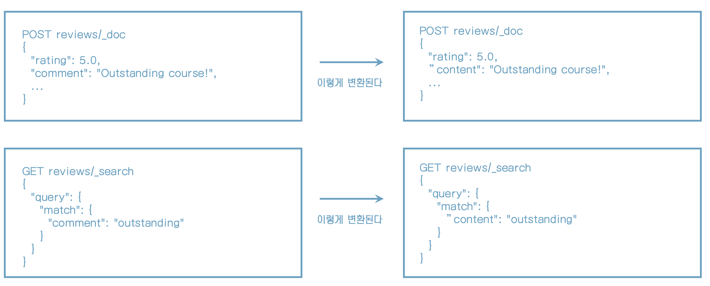

#### index alias

* 필드 alias와 유사하게 elasticsearch는 index alias를 지원한다.
* 일반적으로 대용량을 처리할 때 사용된다.


### 55.  multi 필드 매핑

```
PUT multi_field_test
{
  "mappings": {
    "properties": {
      "description": {
        "type": "text"
      },
      "ingredients": {
        "type": "text",
        "fields": {
          "keyword": {
            "type": "keyword" 
          }
        }
      }
    }
  }
}
```

ingredients에 text타입 외에 keyword 타입을 정의

```
POST multi_field_test/_doc
{
  "description": "To make this spaghetti carbonara, you first need to...",
  "ingredients": ["Spaghetti", "Bacon", "Eggs"]
}
```

아래와 같이 검색해도 동일한 결과가 나온다.

```
GET multi_field_test/_search
{
  "query": {
    "match": {
      "ingredients": "Spaghetti"
    }
  }
}

GET multi_field_test/_search
{
  "query": {
    "term": {
      "ingredients.keyword": "Spaghetti"
    }
  }
}
```


### 56. index template

#### index template 소개

* index template은 settings와 mappings를 명시한다.

* 한개 이상의 패턴과 일치하는 인덱스에 적용된다.

* 패턴은 wildcard를 포함할 수 있다.

* index template은 새 인덱스를 만들 때 적용된다.

    

```
PUT _template/access-logs
{
  "index_patterns": ["access-logs-*"], 
  "settings": {
    "number_of_shards": 2,
    "index.mapping.coerce": false
  }, 
  "mappings": {
    "properties": {
      "@timestmap": {
        "type": "date"
      },
      "url.original": {
        "type": "keyword"
      },
      "http.request.referer": {
        "type": "keyword"
      },
      "http.response.status.code": {
        "type": "long"
      }
    }
  }
}
```

Index template을 정의했다.

새 인덱스를 만들자.

```
PUT access-logs-2020-01-01
```

매핑 정보를 조회해보자.

```
GET access-logs-2020-01-01/_mapping
```

index pattern에서 만들 패턴으로 생성이 되었다.

```
{
  "access-logs-2020-01-01" : {
    "mappings" : {
      "properties" : {
        "@timestmap" : {
          "type" : "date"
        },
        "http" : {
          "properties" : {
            "request" : {
              "properties" : {
                "referer" : {
                  "type" : "keyword"
                }
              }
            },
            "response" : {
              "properties" : {
                "status" : {
                  "properties" : {
                    "code" : {
                      "type" : "long"
                    }
                  }
                }
              }
            }
          }
        },
        "url" : {
          "properties" : {
            "original" : {
              "type" : "keyword"
            }
          }
        }
      }
    }
  }
}
```


#### index template의 우선순위

* 새 인덱스는 여러가지 index template에 해당될 수 있다.
* Order 파라미터가 index template의 우선순위를 정의하는데 사용될 수 있다.
    * 값은 integer이다.
    * 작은 값을 가진 template이 우선이다.


#### index template 수정하기

``` 
PUT _template/access-logs
```

#### index template 조회하기

```
GET _template/access-logs
```

#### index template 삭제하기

```
DELETE _template/access-logs
```


### 57. Elastic Common Schema(ECS) 소개 

#### ECS는 무엇인가?

* 공통 필드에 대한 명세이고 어떻게 매핑되는가
* ECS 전에필드 이름간 연결이 없었다.
* nginx에서 로그를 취합하는 것은 apache와 다른 이름을 사용할 것이다.
* ECS는 동일한 것에 대한 공통 필드를 의미한다.
    * 예) @timestamp
* 사용 케이스와 무관하다.
* 필드 그룹은 필드 셋을 의미한다.


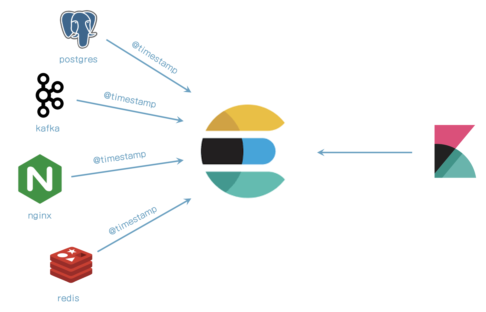

#### ECS의 사용

* ECS에서 문서는 이벤트를 의미한다.
    * ECS는 이벤트가 아닌 필드를 사용할 수 없다.
* 주로 표준 이벤트에 유용하다.
    * 예) 웹서버 로그, 운영체제 지표 등
* ECS는 자동으로 elastic stack 제품군에서 처리된다.
    * 만일 그것을 사용한다면 ECS를 처리할 필요가 없다.
* ECS 사용할 필요가 없지만 무엇인지 알 필요는 있다.


### 58. 동적 매핑 소개

```
POST my-index/_doc
{
  "tags": ["computer", "electronics"],
  "in_stock": 4,
  "created_at": "2020/01/01 00:00:00"
}
```

문서를 추가하면 아래 처럼 자동으로 매핑이 생긴다.

```
{
  "my-index" : {
    "mappings" : {
      "properties" : {
        "created_at" : {
          "type" : "date",
          "format" : "yyyy/MM/dd HH:mm:ss||yyyy/MM/dd||epoch_millis"
        },
        "in_stock" : {
          "type" : "long"
        },
        "tags" : {
          "type" : "text",
          "fields" : {
            "keyword" : {
              "type" : "keyword",
              "ignore_above" : 256
            }
          }
        }
      }
    }
  }
}
```

| JSON                  | ELASTICSEARCH                                                |
| --------------------- | ------------------------------------------------------------ |
| string                | 다음 중 하나<br/>keyword 매핑을 가진 text 필드<br/>date 필드<br/>(float 혹은 long 필드) |
| integer               | long                                                         |
| floating point number | float                                                        |
| boolean               | boolean                                                      |
| object                | object                                                       |
| Array                 | 첫번째 값이 non-null인지에 따라                              |


### 59. 명시적인 매핑과 동적 매핑 연결

```
PUT people
{
  "mappings": {
    "properties": {
      "first_name": {
        "type": "text"
      }
    }
  }
}
POST people/_doc
{
  "first_name": "Bo",
  "last_name": "Andersen"
}
GET people/_mapping
```


### 60. 동적 매핑 구성하기

```
PUT people
{
  "mappings": {
    "dynamic": false,
    "properties": {
      "first_name": {
        "type": "text"
      }
    }
  }
}
POST people/_doc
{
  "first_name": "Bo",
  "last_name": "Andersen"
}
```

매핑을 조회하면

```
GET people/_mapping
```

last_name만 매핑으로 연결되어 있다.

```
{
  "people" : {
    "mappings" : {
      "dynamic" : "false",
      "properties" : {
        "first_name" : {
          "type" : "text"
        }
      }
    }
  }
}
```

데이터를 조회하면 데이터는 입력되어 있다.

```
GET people/_search
```


#### dynamic을 false로 설정

* 새 필드가 무시된다.
    * 인덱싱이 되지 않지만 _source에는 여전히 표시된다.
* last_name 필드에 역색인파일이 생성이 되지 않는다.
    * 필드 조회를 하면 결과가 나오지 않는다.
* 필드는 매핑없이 인덱싱되지 않는다.
    * enabled될 때 값을 인덱싱하기 전에 동적 매핑을 생성한다.
* 새 필드는 명시적인 매핑되어야 한다.


#### 더 좋은 방법

* dynamic을 strict으로 설정
* Elsticsearch는 매핑되지 않은 필드를 무시한다.
    * 모든 필드는 명시적으로 매핑되어야 한다.
    * 관계형 DB와 유사

```
PUT people
{
  "mappings": {
    "dynamic": "strict",
    "properties": {
      "first_name": {
        "type": "text"
      }
    }
  }
}
```

매핑되지 않은 값을 입력하면

```
POST people/_doc
{
  "first_name": "Bo",
  "last_name": "Andersen"
}
```

오류가 발생한다.

```
{
  "error" : {
    "root_cause" : [
      {
        "type" : "strict_dynamic_mapping_exception",
        "reason" : "mapping set to strict, dynamic introduction of [last_name] within [_doc] is not allowed"
      }
    ],
    "type" : "strict_dynamic_mapping_exception",
    "reason" : "mapping set to strict, dynamic introduction of [last_name] within [_doc] is not allowed"
  },
  "status" : 400
}
```


### 61. 동적 template


### 62. 매핑 권장사항

#### 명시적인 매핑을 사용하라.

* 동적 매핑은 편하지만 운영에서는 좋은 방법이 아니다.
* 많은 문서를 저장할 때 디스크 공간을 절약하라
* dynamic을 false가 아닌 strict로 설정하라.
    * 기대하지 않은 결과를 없애라.


#### text 필드 매핑

* string을 text와 keyword 둘다 매핑하지 마라.
    * 일반적으로 하나만 필요하다.
    * 각 매핑은 디스크 공간을 필요로 한다.
* Full-text 검색이 필요한가?
    * Text 매핑을 추가하라
* 집합, 정렬, 필터링이 필요한가?
    * keyword를 사용하라.


#### coercion을 비활성화해라

* coercion은 잘못될 일이 발생할 수 있다.
* 의도한 대로 하도록 노력해라.
* 가능하면 올바른 데이터 타입을 사용해라.


#### 적절한 numeric 데이터 타입을 사용하라.

* 일반적인 숫자에서는 integer 데이터 타입이면 충분하다.
    * long은 많은 숫자를 저장할 수 있지만 많은 디스크 공간을 사용한다.
* decimal 숫자에서는 float 데이터 타입이면 충분하다.
    * double은 좀 더 정확하지만 디스크 공간을 2배 사용한다.
    * 보통 float이면 충분하다.


#### 매핑 파라미터

* 정렬, 집합, 스크립팅이 필요없다면 doc_values를 false로 설정하라.
* scoring이 필요없다면 norms를 false로 설정하라.
* 값을 filtering할 필요 없다면 index를 false로 설정하라.
    * 여전히 집합(aggregation)을 사용할 수 있다.


### 63. stemming & stop words

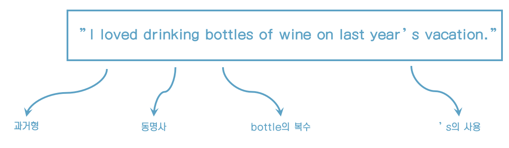


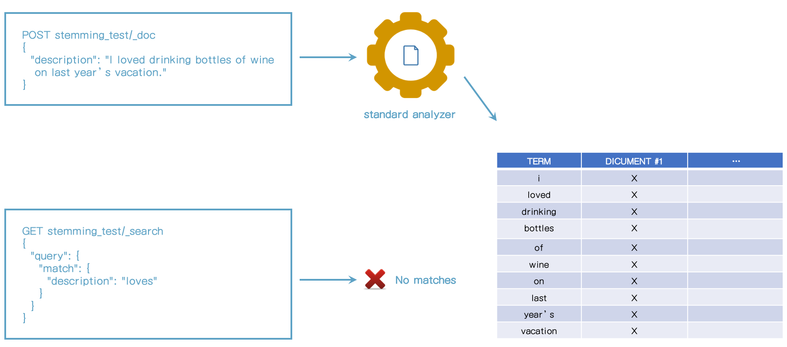


#### stemming 소개

* stemming은 단어들을 기본형으로 줄여준다.
    * 예) loved -> love, drinking -> drink
    * 모든 단어를 올바르게 줄이지는 못한다.


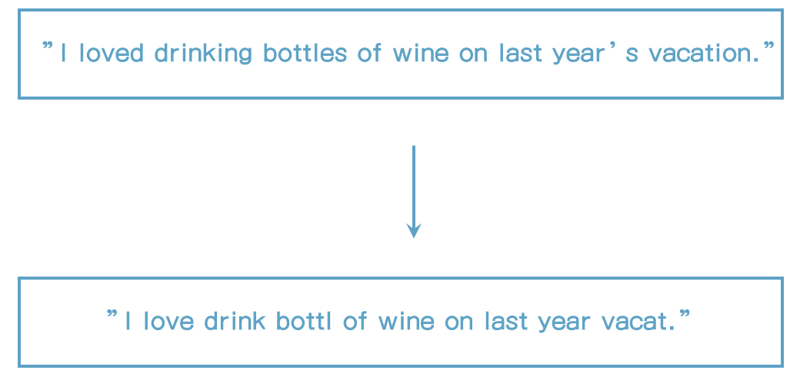


#### stop words 소개

* Text 분석에 필터링 되어야 할 단어들
    * "a", "the", "at", "of", "on" 등과 같은 단어들
* scoring할 때 값이 없다.
* 특정 단어를 없앨 때 사용
    * 과거보다는 현재 elasticsearch에서 덜 사용한다.
        * Relevance 알고리즘이 많이 좋아졌다.
* 기본은 제거되지 않고 일반적으로 권장되지 않는다.


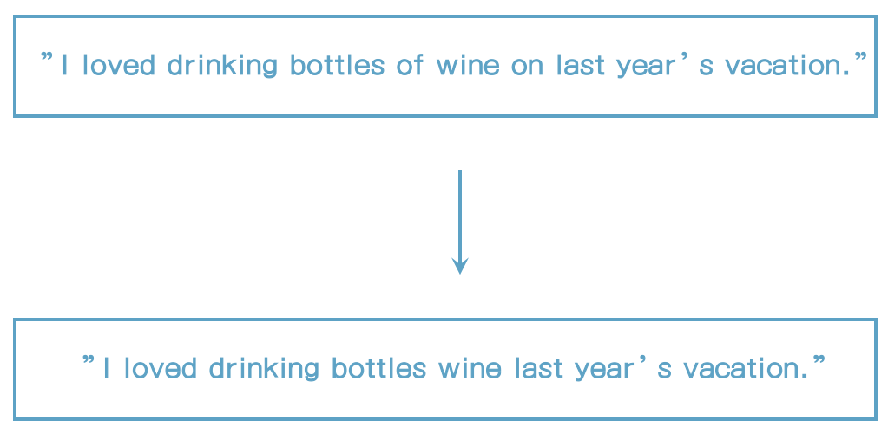


### 64. Analyzer와 검색 쿼리

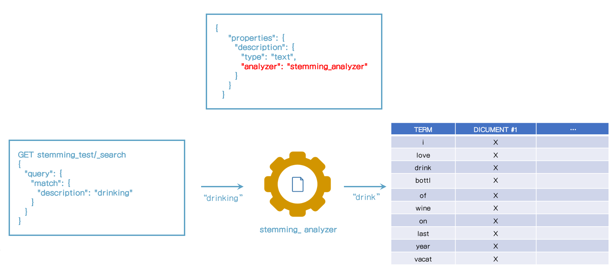


### 65. 내장 analyzer

#### standard analyer

* text를 단어 단위로 짜르고 구두점을 제거한다.
    * standard tokenizer
* lowercase token filter로 문자를 소문자로 바꾼다.
* stop token filter를 포함 (기본은 비활성화)


#### 예제

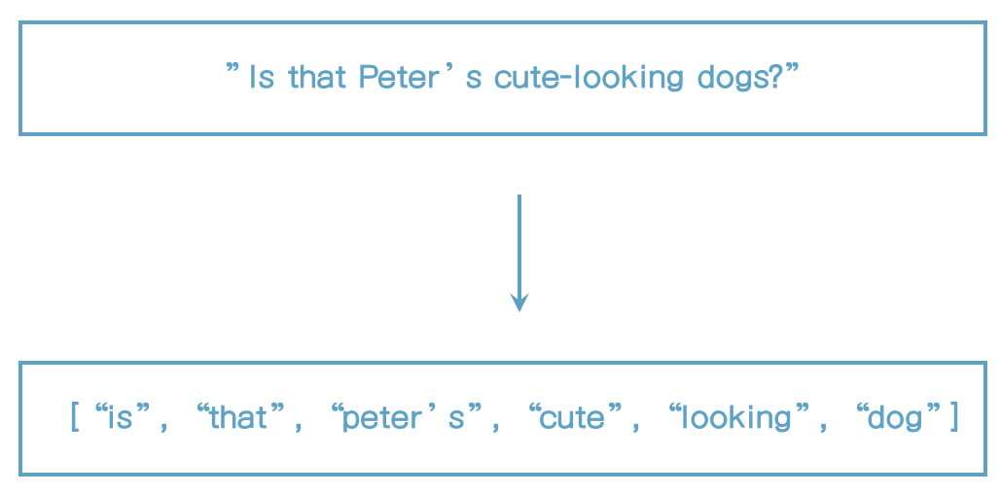


#### simple analyzer

* standard analyzer와 유사
    * 문자 외에 다른 단어를 만나면 토큰으로 구분
* 문자를 lowercase tokenizer로 소문자로 변환


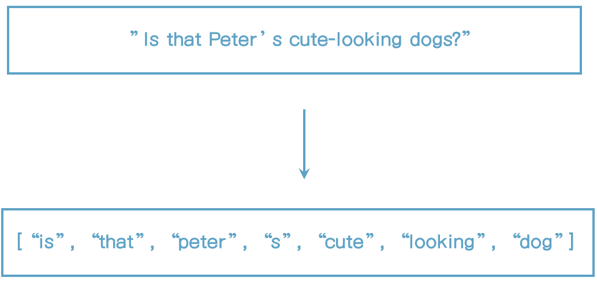


#### whitespace analyzer

* 공백으로 토큰을 분리
* 문자를 소문자로 바꾸지 않는다.

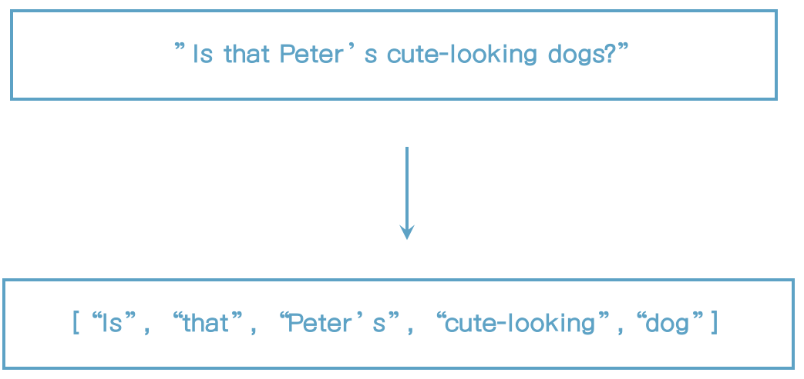


#### keyword analyzer

* 입력 text를 그대로
    * 하나의 토큰으로 사용
* Keyword 필드에 기본으로 사용

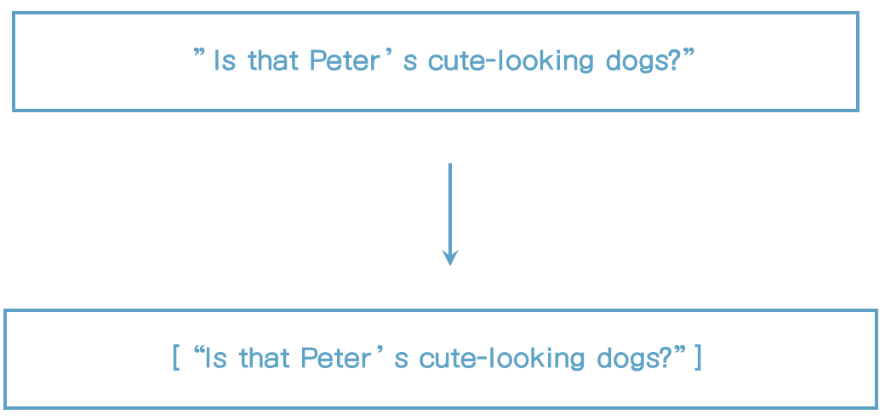


#### pattern analyzer

* 토큰을 분리하기 위해 정규 표현식이 사용된다.
    * 일치하는 text를 토큰으로 구분한다.
* 이 analyzer는 유연하게 사용할 수 있다.
* 기본 패턴을 단어가 글자이다. (\W+)
* 소문자가 기본이다.

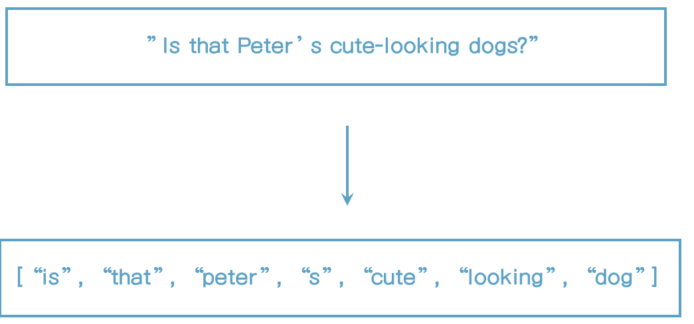


#### english analyzer

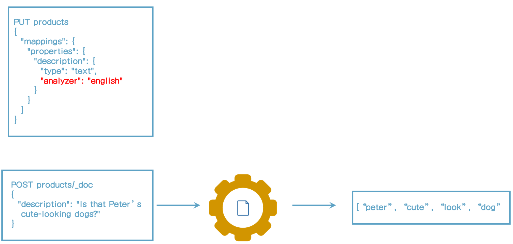


#### 내장 analyzer 구성하기

````
PUT products
{
  "settings": {
    "analysis": {
      "analyzer": {
        "remove_english_stop_words": {
          "type": "standard",
          "stopwords": "_english_"
        }
      }
    }
  }
}
````


### 68. custom analyzer 생성

```
PUT analyzer_test
{
  "settings": {
    "analysis": {
      "analyzer": {
        "my_custom_analyzer": {
          "type": "custom",
          "char_filter": ["html_strip"],
          "tokenizer": "standard",
          "filter": [
            "lowercase",
            "stop",
            "asciifolding"
          ]
        }
      }
    }
  }
}
```

```
POST analyzer_test/_analyze
{
  "analyzer": "my_custom_analyzer", 
  "text": "I&apos;m in a <em>good</em> mood&nbsp;-&nbsp;and I <strong>love</strong> açaí!"
}
```

결과는 다음과 같다.

```
{
  "tokens" : [
    {
      "token" : "i'm",
      "start_offset" : 0,
      "end_offset" : 8,
      "type" : "<ALPHANUM>",
      "position" : 0
    },
    {
      "token" : "good",
      "start_offset" : 18,
      "end_offset" : 27,
      "type" : "<ALPHANUM>",
      "position" : 3
    },
    {
      "token" : "mood",
      "start_offset" : 28,
      "end_offset" : 32,
      "type" : "<ALPHANUM>",
      "position" : 4
    },
    {
      "token" : "i",
      "start_offset" : 49,
      "end_offset" : 50,
      "type" : "<ALPHANUM>",
      "position" : 6
    },
    {
      "token" : "love",
      "start_offset" : 59,
      "end_offset" : 72,
      "type" : "<ALPHANUM>",
      "position" : 7
    },
    {
      "token" : "acai",
      "start_offset" : 73,
      "end_offset" : 77,
      "type" : "<ALPHANUM>",
      "position" : 8
    }
  ]
}
```


### 69. 기존 인덱스에 analyzer 추가

위에서 만든 custom_analyer를 변경하자.

```
PUT analyzer_test/_settings
{
  "analysis": {
    "analysis": {
      "analyzer": {
        "my_second_analyzer": {
          "type": "custom",
          "char_filter": ["html_strip"],
          "tokenizer": "standard",
          "filter": [
            "lowercase",
            "stop",
            "asciifolding"
          ]
        }
      }
    }
  }
}
```

실행하면 아래와 같은 오류가 발생한다.

```
{
  "error" : {
    "root_cause" : [
      {
        "type" : "illegal_argument_exception",
        "reason" : "Can't update non dynamic settings [[index.analysis.analysis.analyzer.my_second_analyzer.char_filter, index.analysis.analysis.analyzer.my_second_analyzer.type, index.analysis.analysis.analyzer.my_second_analyzer.tokenizer, index.analysis.analysis.analyzer.my_second_analyzer.filter]] for open indices [[analyzer_test/iINbtwEpRW6k9TXwQDEoVA]]"
      }
    ],
    "type" : "illegal_argument_exception",
    "reason" : "Can't update non dynamic settings [[index.analysis.analysis.analyzer.my_second_analyzer.char_filter, index.analysis.analysis.analyzer.my_second_analyzer.type, index.analysis.analysis.analyzer.my_second_analyzer.tokenizer, index.analysis.analysis.analyzer.my_second_analyzer.filter]] for open indices [[analyzer_test/iINbtwEpRW6k9TXwQDEoVA]]"
  },
  "status" : 400
}
```


#### open & closed 인덱스

* Open 인덱스는 인덱싱하고 조회할 때 사용할 수 있다.
* Close 인덱스는 요청을 거부한다.
    * 읽기/쓰기 요청이 거부된다.
    * 특정 동작을 수행할 때 필요하다.


#### dynamic, static settings

* dynamic settings는 인덱스를 close하지 않고 변경될 수 있다.
    * 다운타임이 필요 없다.
* static settings는 인덱스를 먼저 closed해야 한다.
    * 인덱스는 사용할 수 없다.
* Analysis settings는 static settings이다.


analyzer_test를 close해보자.

```
POST analyzer_test/_close
```

다시 custom_analyzer를 변경하자.

```
PUT analyzer_test/_settings
{
  "analysis": {
    "analysis": {
      "analyzer": {
        "my_second_analyzer": {
          "type": "custom",
          "char_filter": ["html_strip"],
          "tokenizer": "standard",
          "filter": [
            "lowercase",
            "stop",
            "asciifolding"
          ]
        }
      }
    }
  }
}
```

인덱스를 open하자.

```
POST analyzer_test/_open
```

_settings를 조회하면 analyzer가 추가된 것을 확인할 수 있다.

```
GET analyzer_test/_settings
```


#### 인덱스 open/close

* 빠르지만 운영 클러스터에서는 사용해서는 안된다.
    * 예) 다운타임이 있으면 안되는 중요 업무
* 선택적으로 문서를 새 인덱스로 reindex할 때
    * 새로운 setting정보로 인덱스를 생성할 때
    * 인덱스 alias를 사용


### 70. Analyzer 수정하기

