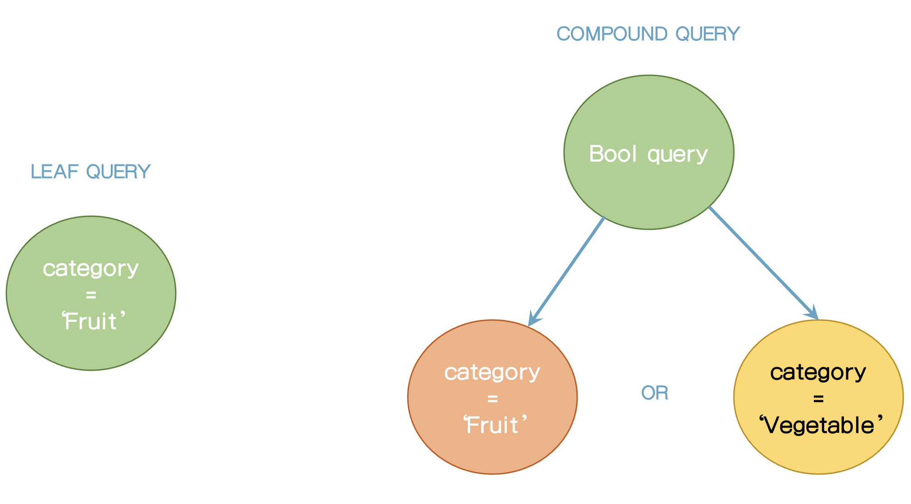
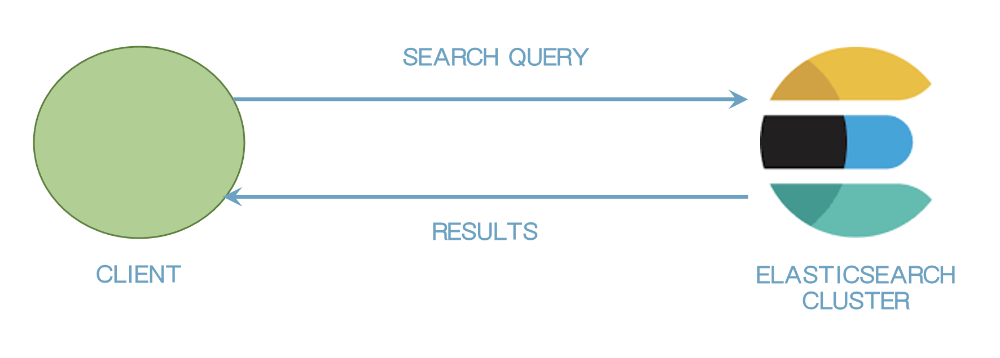
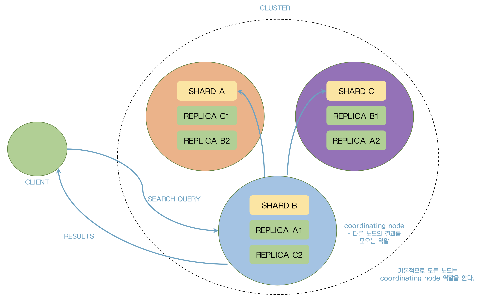
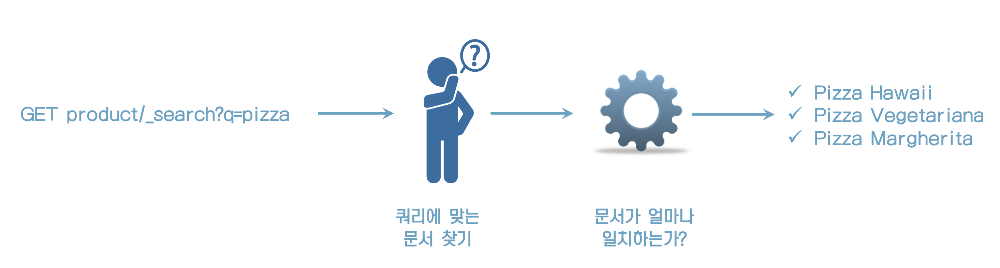
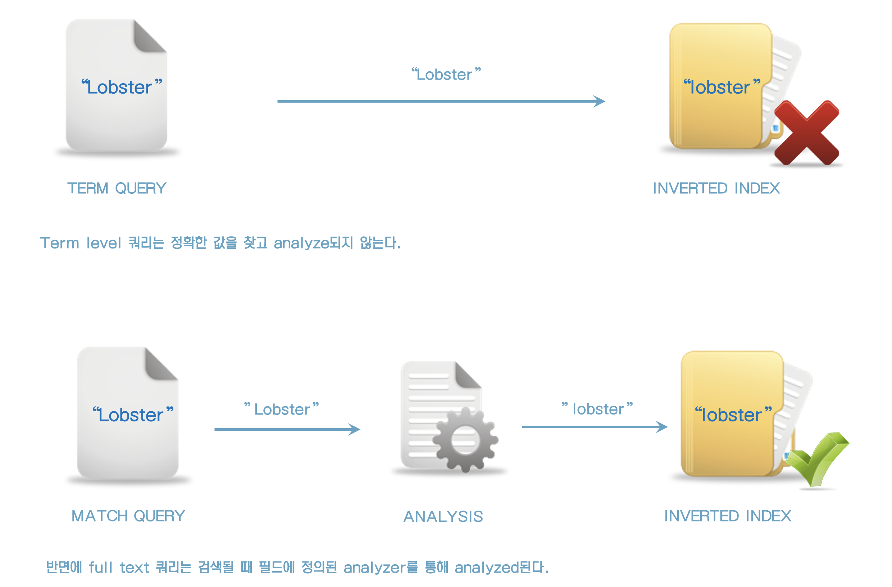

### 71. Search methods

```
GET products/_search
{
  "query": {
    "query_string": {
      "query": "name:pasta"
    }
  }
}
```


 ### 72. Request URI로 검색

```
GET products/_search?q=name:pasta
```


### 73. Query DSL 소개

* Leaf Query - 단일 쿼리
* Compound Query - 복합 쿼리



```
GET products/_search
{
  "query": {
    "match_all": {}
  }
}
```


### 74. 데이터 검색







### 75. 검색 결과의 이해

```
{
  "took" : 0, // 쿼리를 실행하는데 걸리는 시간
  "timed_out" : false, // search query가 time out이 발생했는지 여부 
  "_shards" : { // shard 수
    "total" : 1,
    "successful" : 1,
    "skipped" : 0,
    "failed" : 0
  },
  "hits" : {
    "total" : {
      "value" : 1, // search 조건에 맞는 결과 수 
      "relation" : "eq"
    },
    "max_score" : 1.0, // 가장 높은 score
    "hits" : [
      {
        "_index" : "people",
        "_type" : "_doc",
        "_id" : "qqNRMIMB72KeG_cXn_n8",
        "_score" : 1.0,
        "_source" : {
          "first_name" : "Bo",
          "last_name" : "Andersen"
        }
      }
    ]
  }
}

```


### 76. Relevance score 이해

문서가 얼마나 일치하는가 계산하기 전에 elasticsearch는 boolean 모델을 사용하여 문서가 일치하는지 찾는다.



#### relevance score 이해

최근까지 elasticsearch는 TF/IDF를 사용했었다.

이제는 Okapi BM25 알고리즘을 사용한다.


* **Term Frequency (TF)**
    * term이 문서내의 필드에 얼마나 많이 일치하는가?
    * 예를 들어 salad라는 term이 2번 일치하는 문서가 1번 일치하는 문서보다 score가 높다.
* **Inverse Document Frequency (IDF)**
    * 인덱스 내에 term이 얼마나 나오는가? (모든 문서에서)
    * term이 더 많이 있을 수록 score가 낮아진다.
    * 많은 나오는 단어는 덜 중요하다.
* **Field-length norm**
    * 필드가 얼마나 긴지를 판단
    * 50글자의 salad term은 5000글자에서 보다 더 중요하다.


이 값들은 문서의 term 가중치를 계산하는 데 사용된다.

* **BM25 알고리즘과 비교**
    * stop word 처리할 때 좋다
    * field-length norm 요소를 향상시킨다.
    * 파라미터와 구성될 수 있다.


### 77. 예기치 못한 검색결과 디버깅

```
GET analyzer_test/_doc/raN6MIMB72KeG_cXnPlw/_explain
{
  "query": {
    "match": {
      "description": "dog"
    }
  }
}
```


### 78. Query Context

Query context는 score에 영향을 주지만 filter context는 영향이 없다.


### 79. Full text 쿼리 vs Term 쿼리

아래 3개의 쿼리를 실행해보자.

lobster를 term 쿼리로 조회

```
GET /products/_search
{
  "query": {
    "term": {
      "name": "lobster"
    }
  }
}
```

결과는 5개

```
{
  "took" : 1,
  "timed_out" : false,
  "_shards" : {
    "total" : 1,
    "successful" : 1,
    "skipped" : 0,
    "failed" : 0
  },
  "hits" : {
    "total" : {
      "value" : 5,
      "relation" : "eq"
    },
    "max_score" : 5.8983326,
    "hits" : [
      {
        "_index" : "products",
        "_type" : "_doc",
        "_id" : "19",
        "_score" : 5.8983326,
        "_source" : {
          "name" : "Lobster - Live",
          ...
      },
      {
        "_index" : "products",
        "_type" : "_doc",
        "_id" : "55",
        "_score" : 5.0624013,
        "_source" : {
          "name" : "Lobster - Baby Boiled",
          ...
      }
      ...
  }
}
```

다음 쿼리 (대문자로 조회)

```
GET /products/_search
{
  "query": {
    "term": {
      "name": "Lobster"
    }
  }
}
```

결과는 0이다.

다음 쿼리

```
GET /products/_search
{
  "query": {
    "match": {
      "name": "Lobster"
    }
  }
}
```

결과는 5개


Term level쿼리는 analyze되지 않기 때문에 대소문자를 구분하여 검색하고

Match level 쿼리는 analyze되기 때문에 필드에 정의된 standard analyzer로 lowercase로 변환되기 때문에 검색이 된다.



