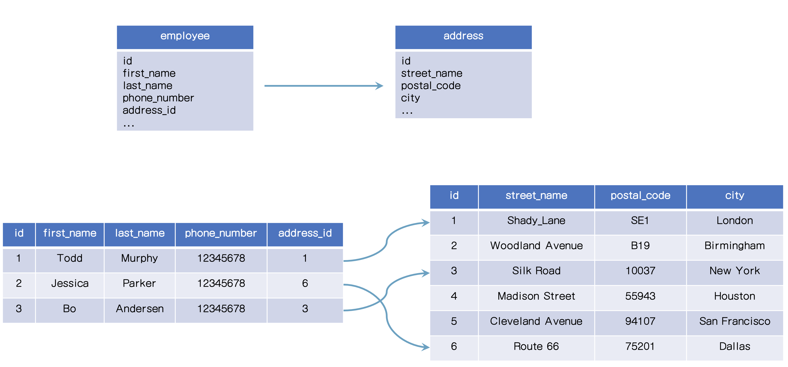
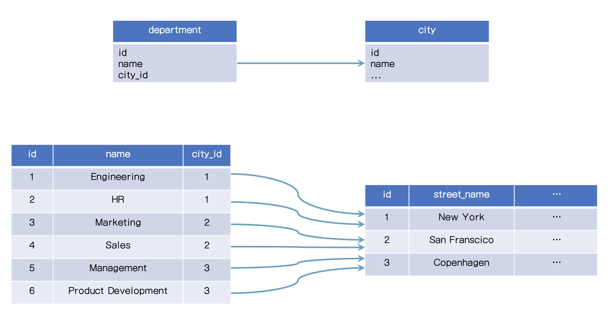
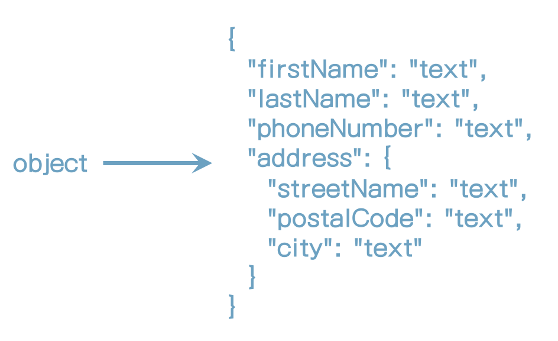
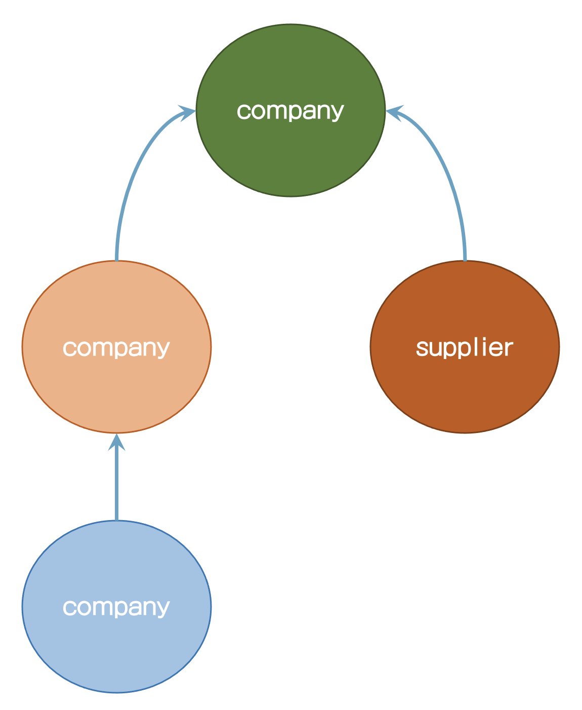

### 98. 이 장의 소개










#### 저장공간의 비효율성?

#### elasticsearch를 메인 데이터 저장소로 사용하지 마라

#### 비정규화로 검색 성능을 최적화해라

#### 성능 > 데이터 저장

#### 조인의 비용은 비싸다


### 99. nested object 쿼리

```
PUT /department
{
  "mappings": {
    "properties": {
      "name": {
        "type": "text"
      },
      "employees": {
        "type": "nested"
      }
    }
  }
}
```

```
PUT /department/_doc/1
{
  "name": "Development",
  "employees": [
    {
      "name": "Eric Green",
      "age": 39,
      "gender": "M",
      "position": "Big Data Specialist"
    },
    {
      "name": "James Taylor",
      "age": 27,
      "gender": "M",
      "position": "Software Developer"
    },
    {
      "name": "Gary Jenkins",
      "age": 21,
      "gender": "M",
      "position": "Intern"
    },
    {
      "name": "Julie Powell",
      "age": 26,
      "gender": "F",
      "position": "Intern"
    },
    {
      "name": "Benjamin Smith",
      "age": 46,
      "gender": "M",
      "position": "Senior Software Engineer"
    }
  ]
}

PUT /department/_doc/2
{
  "name": "HR & Marketing",
  "employees": [
    {
      "name": "Patricia Lewis",
      "age": 42,
      "gender": "F",
      "position": "Senior Marketing Manager"
    },
    {
      "name": "Maria Anderson",
      "age": 56,
      "gender": "F",
      "position": "Head of HR"
    },
    {
      "name": "Margaret Harris",
      "age": 19,
      "gender": "F",
      "position": "Intern"
    },
    {
      "name": "Ryan Nelson",
      "age": 31,
      "gender": "M",
      "position": "Marketing Manager"
    },
    {
      "name": "Kathy Williams",
      "age": 49,
      "gender": "F",
      "position": "Senior Marketing Manager"
    },
    {
      "name": "Jacqueline Hill",
      "age": 28,
      "gender": "F",
      "position": "Junior Marketing Manager"
    },
    {
            "name": "Donald Morris",
      "age": 39,
      "gender": "M",
      "position": "SEO Specialist"
    },
    {
      "name": "Evelyn Henderson",
      "age": 24,
      "gender": "F",
      "position": "Intern"
    },
    {
      "name": "Earl Moore",
      "age": 21,
      "gender": "M",
      "position": "Junior SEO Specialist"
    },
    {
      "name": "Phillip Sanchez",
      "age": 35,
      "gender": "M",
      "position": "SEM Specialist"
    }
  ]
}
```

쿼리를 해보자

```
GET department/_search
{
  "query": {
    "bool": {
      "must": [
        {
          "match": {
            "employees.position": "intern"
          }
        },
        {
          "term": {
            "employees.gender.keyword": {
              "value": "F"
            }
          }
        }
      ]
    }
  }
}
```

nested쿼리는 이런 식으로는 검색되지 않는다.

아래 처럼 쿼리해야 한다.

```
GET department/_search
{
  "query": {
    "nested": {
      "path": "employees",
      "query": {
        "bool": {
          "must": [
            {
              "match": {
                "employees.position": "intern"
              }
            },
            {
              "term": {
                "employees.gender.keyword": {
                  "value": "F"
                }
              }
            }
          ]
        }
      }
    }
  }
}
```


### 100. nested inner hits

```
GET department/_search
{
  "_source": false, 
  "query": {
    "nested": {
      "path": "employees",
      "inner_hits": {}, 
      "query": {
        "bool": {
          "must": [
            {
              "match": {
                "employees.position": "intern"
              }
            },
            {
              "term": {
                "employees.gender.keyword": {
                  "value": "F"
                }
              }
            }
          ]
        }
      }
    }
  }
}
```

inner_hits로 nested에 match된 결과를 알 수 있다.


### 101. Document 관계 매핑

```
PUT department
{
  "mappings": {
    "properties": {
      "join_field": {
        "type": "join",
        "relations": {
          "department": "employee"
        }
      }
    }
  }
}
```


### 102. document 추가

```
PUT department/_doc/1
{
  "name": "Development",
  "join_field": "department"
}
PUT department/_doc/2
{
  "name": "Marketing",
  "join_field": "department"
}
PUT department/_doc/3?routing=1
{
  "name": "Bo Andersen",
  "age": 28,
  "gender": "M",
  "join_field": {
    "name": "employee",
    "parent": 1
  }
}
PUT department/_doc/4?routing=2
{
  "name": "John Doe",
  "age": 44,
  "gender": "M",
  "join_field": {
    "name": "employee",
    "parent": 2
  }
}
PUT /department/_doc/5?routing=1
{
  "name": "James Evans",
  "age": 32,
  "gender": "M",
  "join_field": {
    "name": "employee",
    "parent": 1
  }
}
PUT /department/_doc/6?routing=1
{
  "name": "Daniel Harris",
  "age": 52,
  "gender": "M",
  "join_field": {
    "name": "employee",
    "parent": 1
  }
}
PUT /department/_doc/7?routing=2
{
  "name": "Jane Park",
  "age": 23,
  "gender": "F",
  "join_field": {
    "name": "employee",
    "parent": 2
  }
}
PUT /department/_doc/8?routing=1
{
  "name": "Christina Parker",
  "age": 29,
  "gender": "F",
  "join_field": {
    "name": "employee",
    "parent": 1
  }
}
```


### 103. parent ID로 쿼리

```
GET department/_search
{
  "query": {
    "parent_id": {
      "type": "employee",
      "id": 1
    }
  }
}
```


### 104. parent로 child document 쿼리

```
GET department/_search
{
  "query": {
    "has_parent": {
      "parent_type": "department",
      "score": true,
      "query": {
        "term": {
          "name.keyword": "Development"
        }
      }
    }
  }
}
```


### 105. Child document로 parent 쿼리

```
GET department/_search
{
  "query": {
    "has_child": {
      "type": "employee",
      "query": {
        "bool": {
          "must": [
            {
              "range": {
                "age": {
                  "gte": 50
                }
              }
            }
          ],
          "should": [
            {
              "term": {
                "gender.keyword": "M"
              }
            }
          ]
        }
      }
    }
  }
}
```


| Score mode | 설명                                         |
| ---------- | -------------------------------------------- |
| min        | Child 문서에 가장 낮은 score가 parent에 매핑 |
| max        | Child 문서에 가장 높은 score가 parent에 매핑 |
| sum        | Child 문서의 score 합이 parent에 매핑        |
| avg        | Child 문서의 score 평균이 parent에 매핑      |
| none        | document의 socre가 무시. 기본값 |

```
{
  "query": {
    "has_child": {
      "type": "employee",
      "score_mode": "sum", 
      "min_children": 2, 
      "max_children": 5, 
      "query": {
        "bool": {
          "must": [
            {
              "range": {
                "age": {
                  "gte": 50
                }
              }
            }
          ],
          "should": [
            {
              "term": {
                "gender.keyword": "M"
              }
            }
          ]
        }
      }
    }
  }
}
```


### 106. Multi-level relations



```PUT company
{
  "mappings": {
    "properties": {
      "join_filed": {
        "type": "join",
        "relations": {
          "company": ["department", "supplier"],
          "department": "employee"
        }
      }
    }
  }
}
```


```
PUT /company/_doc/1
{
  "name": "My Company Inc.",
  "join_field": "company"
}
PUT /company/_doc/2?routing=1
{
  "name": "Development",
  "join_field": {
    "name": "department",
    "parent": 1
  }
}
PUT /company/_doc/3?routing=1
{
  "name": "Bo Andersen",
  "join_field": {
    "name": "employee",
    "parent": 2
  }
}
```


### 109. Join 제약사항

* document는 동일 인덱스에 저장되어야 한다.
* parent & child document는 동일 샤드에 있어야 한다.
* index당 하나의 join만 가능
* child는 기존 parent에만 추가될 수 이/ㅆ다.
* 하나의 parent document만 가능 (one-to-many)


### 110. Join field 성능 고려사항

* Join field를 사용하는 것은 느리다.
* 특정 케이스를 제외하고는 가능한 Join field를 피해라.
