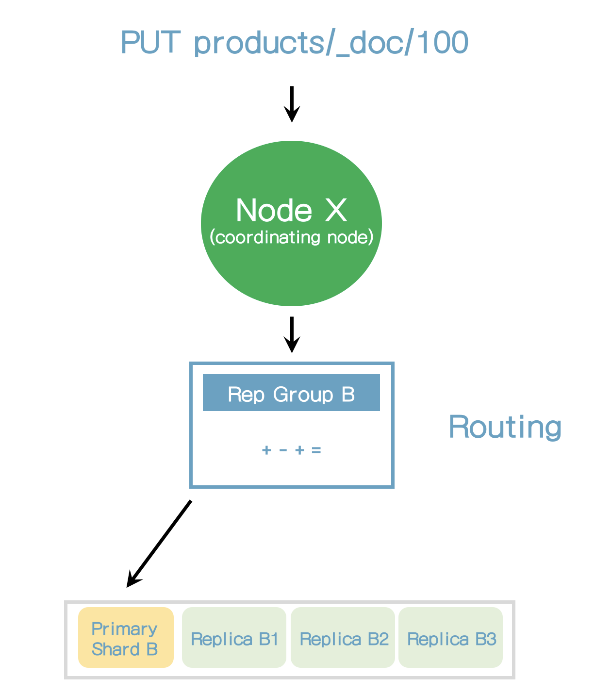

## Documents 관리


### 18. Indices 생성 및 삭제

#### 생성

```
PUT products
{
  "settings": {
    "number_of_shards": 2,
    "number_of_replicas": 2
  }
}
```

#### 삭제

```
DELETE products
```


### 19. Documents 인덱싱

```
POST prodcts/_doc
{
  "name": "Coffee Maker",
  "price": 64,
  "in_stock": 10
}
```

#### 결과

```
{
  "_index" : "prodcts",
  "_type" : "_doc",
  "_id" : "sRA_l4IBt484IutFSnQZ",
  "_version" : 1,
  "result" : "created",
  "_shards" : {
    "total" : 2,
    "successful" : 1,
    "failed" : 0
  },
  "_seq_no" : 7,
  "_primary_term" : 1
}
```

아래와 같이 수정을 하는 경우에도 새로 생성이 된다.

```
PUT prodcts/_doc/100
{
  "name": "Toaster",
  "price": 49,
  "in_stock": 10
}
```

이는 actoin.auto_create_index setting에서 존재하지 않는 문서를 새로 추가할 것인지 설정이 된다. (default: true)


### 20. document의 ID로 조회하기

#### 조회

```
GET products/_doc/100
```


### 21. Documents 수정

#### 기존 필드 수정

```
POST products/_update/100
{
  "doc": {
    "in_stock": 3
  }
}
```

없는 필드를 수정하는 경우에도 사용할 수 있다.

```
POST products/_update/100
{
  "doc": {
    "tags": ["electronics"]
  }
}
```


#### Documents는 immutable하다.

* Elasticsearch Documents는 immutable하다. 기존 document를 수정할 수 없다.
* 기존 문서를 수정하는 경우는? 사실 수정하지 않고 대체했다.
* Update API는 문서를 update하는 것처럼 보인다. (Create -> delete)
* Update API는 단순하고 네트워크 트래픽을 줄여준다. 
    * 문서가 저장된 샤드 내에 1번의 요청만 발생, 
    * update api가 없다면 2번 요청을 해야 한다. (create -> delete)


#### Update API가 어떻게 동작하는가?

* 현재 문서가 조회된다.
* 필드값이 변경된다.
* 기존 문서는 수정된 문서로 대체된다.
* Application 수준에서 동일한 작업을 할 수 있다.


### 22. Script로 수정하기

* ctx는 context의 약어이다.
* _source를 통해 기존 문서에 접근할 수 있다.

```
POST products/_update/100
{
  "script": {
    "source": "ctx._source.in_stock--"
  }
}
```

기존 필드에 값을 대입하려면

```
POST products/_update/100
{
  "script": {
    "source": "ctx._source.in_stock = 10"
  }
}
```

params를 통해 값을 대입받을 수 있다.

```
POST products/_update/100
{
  "script": {
    "source": "ctx._source.in_stock -= params.quantity",
    "params": {
      "quantity": 4
    }
  }
}
```

source에 조건문을 추가하려면

```
POST products/_update/100
{
  "script": {
    "source": """
      if (ctx._source.in_stock == 0) {
        ctx.op = 'noop';
      }
      
      ctx._source.in_stock--;
    """,
    "params": {
      "quantity": 4
    }
  }
}
```

in_stock이 0보다 적으면 result가 noop이고 그렇지 않으면 updated로 표시될 것이다.

혹은 아래와 같이 표현할 수 있다.

```
POST products/_update/100
{
  "script": {
    "source": """
      if (ctx._source.in_stock > 0) {
        ctx._source.in_stock--;
      }
    """,
    "params": {
      "quantity": 4
    }
  }
}
```

또는 in_stock이 1보다 적으면 문서를 delete하게 하는 방법이다.

```
POST products/_update/100
{
  "script": {
    "source": """
      if (ctx._source.in_stock < 1) {
        ctx.op = 'delete';
      }
      
      ctx._source.in_stock--;
    """,
    "params": {
      "quantity": 4
    }
  }
}
```


### 23. Upsert

upsert는 문서가 존재하는지 여부에 따라 조건적으로 update하거나 insert하는 것을 의미한다.

```
POST products/_update/101
{
  "script": {
    "source": "ctx._source.in_stock++"
  },
  "upsert": {
    "name": "Blender",
    "price": 399,
    "in_stock": 5
  }
}
```

위의 스크립트를 실행하면 101문서는 존재하지 않기 때문에 새로 생성이 될 것이다.

다시 한번 실행이 되면 source에 있는 스크립트가 실행이 될 것이다.


### 24. Replacing Documents

문서의 내용을 변경하는 기능이다.

기존에 있던 모든 컬럼은 수정하는 문서의 내용으로 변경이 된다.

```
PUT products/_doc/100
{
  "name": "Toaster",
  "price": 79,
  "in_stock": 10
}
```


### 25. Deleting Documents

```
DELETE products/_doc/101
```


### 26. Routing의 이해

#### Routing 소개

* Elasticsearch가 문서를 어디에 저장할지를 어떻게 알 수 있는가?
* 문서는 인덱싱 된 후 어떻게 찾을 수 있는가?
* 그 해답은 Routing이다.
* Routing은 문서의 샤딩을 찾는 과정이다.

> shard_num = shash(_routing) % num_primary_shards

_routing은 기본적으로 문서의 ID이다.


#### Custom routing

* Routing은 Elasticsearch를 사용할 때 100% 투명하다.
* 이런 것들이 Elasticsearch를 사용하고 배우기 쉽게 만든다.
* 여러가지 목적으로, routing을 커스트마이징하는 것이 가능하다.
* 기본 routing 전략은 문서들을 골고루 분배되는 것을 보장한다.
* shard의 수는 인덱스가 생성된 후에는 변경될 수 없다.
    * shard의 수가 변경되면 routing되는 shard가 변경되어서 문서가 제대로 찾을 수 없기 때문이다.
    * Shard 수를 변경하려면 인덱스를 새로 만들어야 한다. (Reindex)


### 27. Elasticsearch가 데이터를 어떻게 읽는가?

* 읽기 요청을 받는 노드는 요청을 처리하는 책임을 갖고 이 노드는 코디네이팅 노드라고 한다.
* 첫번째 단계는 문서가 어디에 저장되어 있는지 찾는 것이다.
* 이는 라우팅을 통해 해결된다.


* Elasticsearch가 primary 샤드에서 직접 요청을 받는다면, 모든 요청은 동일 샤드에서 처리될 것이다.
* 복제노드에서 요청을 받으면 elasticsearch는 Adaptive Replica Selection(ARS)라고 불리는 기술을 사용한다.
* ARS는 최적의 복제본을 선택하는 것이다.
* ARS는 응답시간을 줄여준다.
* 코디네이팅 노드는 응답을 모아서 클라이언트로 보낸다.


### 28. Elasticsearch가 데이터를 어떻게 저장하는가?

* 복제 그룹내의 샤드에 요청을 라우팅 하지 않고 항상 primary 샤드로 라우팅한다.
* primary 샤드는 요청을 검증하는 책임을 가지고 있다.
* 요청의 구조를 검증하고 필드 값을 검증한다.
* 예를 들어 숫자 필드에 객체 유형을 추가할 때 에러를 유발할 수 있다.
* 그리고 나서, primary 샤드는 복제 샤드로 복제하기 전에 로컬에 쓰기작업을 수행한다.
* 성능향상을 위해서 primary 샤드는 복제샤드로 병렬로 전달한다.
* 복제노드에 복제될 수 없더라도 이 동작은 성공한다.




#### Primary terms

* 예전과 새로운 primary 샤드를 구분하는 방법
* primary 샤드가 얼마나 많이 변경되었는지에 대한 수치
* primary term은 쓰기 작업에서 추가된다.


#### Sequence numbers

* primary term과 같이 쓰기 동작에서 추가된다.
* 쓰기 작업에 증가된 숫자
* primary 샤드는 sequence number를 증가한다.
* elasticsearch가 쓰기 작업을 가능하게 한다.


#### primary 샤드가 실패할 때 복구하는 법

* Primary terms와 sequence number는 elsticsearch가 primary 샤드가 실패할 때 복구하는데 필요한 키이다.
    * elasticsearch가 쓰기 동작이 어디에서 적용되어야 할지 알 수 있다.
* 대규모 인덱스에서 이 과정은 비싼 작업일 수 있다.
    * 속도를 증가시키기 위해 elasticsearch는 checkpoint를 사용한다.


#### global/local checkpoints

* Sequence number
* 각 복제 그룹은 global checkpoint를 가지고 있다.
* 각 복제 샤드는 local checkpoint를 가지고 있다.
* global checkpoint
    * 복제그룹 내의 모든 active 샤드에서 sequence number는 오름차순으로 정렬되어 있다. (이는 seqeunce number를 포함하는 모든 동작은 global checkpoint보다 낮다는 뜻이다)
* local checkpoints
    * 마지막 쓰기 동작이 수행된 sequence number


