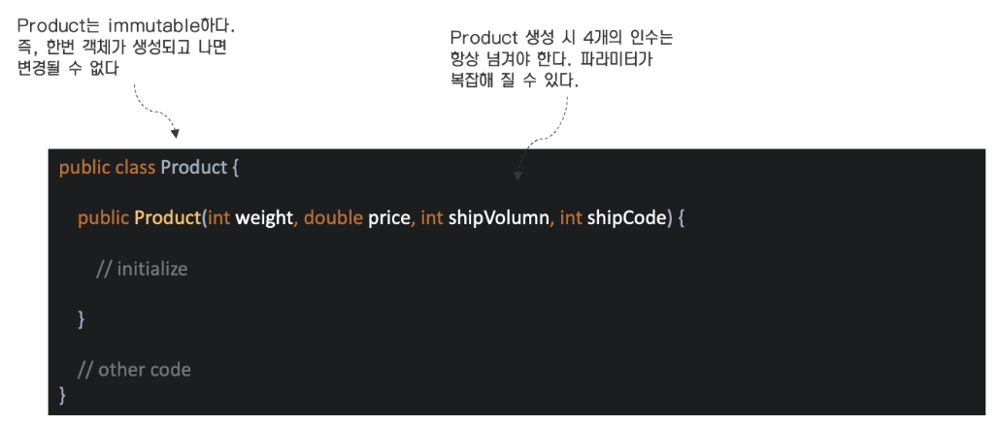
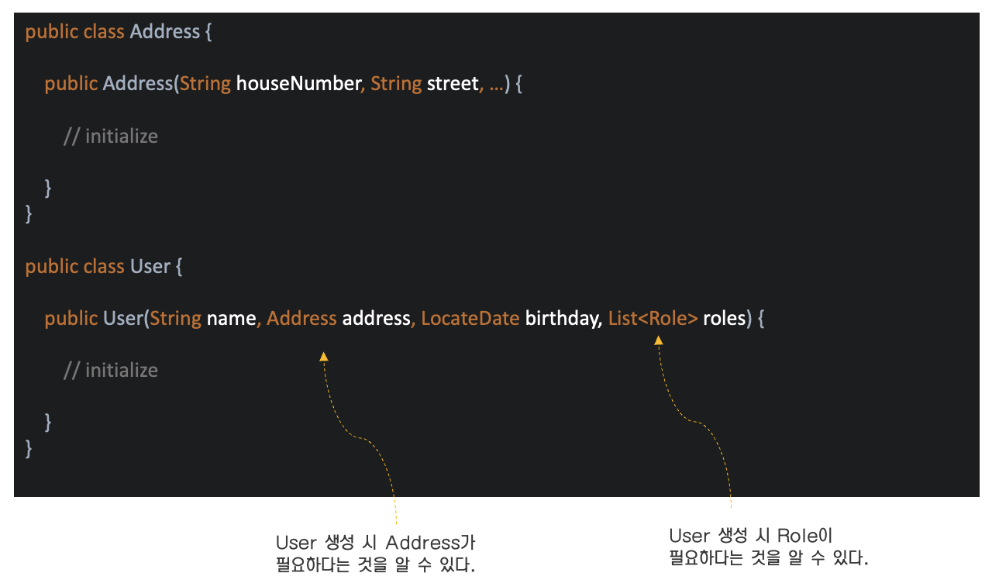
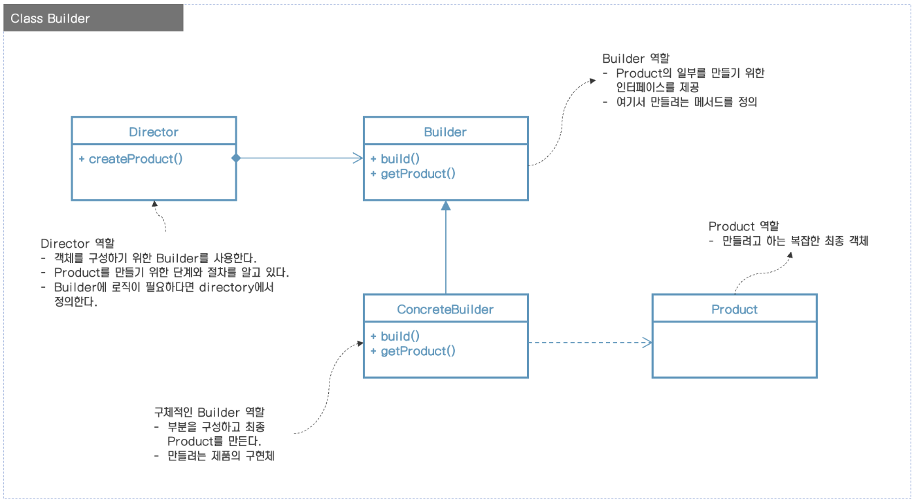
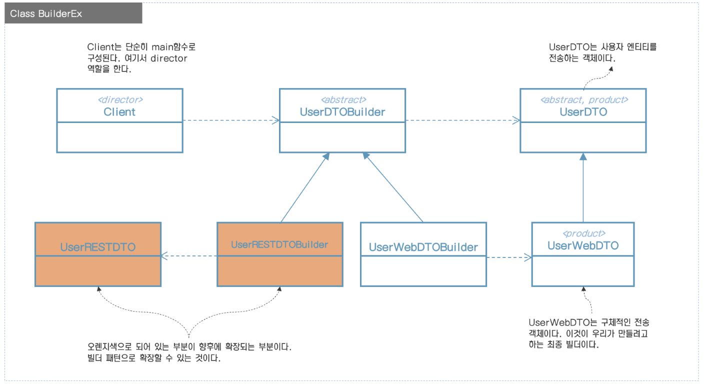

# 빌더(builder) 패턴

<u>udemy 강좌(Java Design Patterns & SOLID Design Principles)를 정리한 내용이다.</u>

https://www.udemy.com/course/design-patterns-in-java-concepts-hands-on-projects/learn/lecture/9604610?start=0#overview

<br/>

빌더 패턴에 대해 알아보자.
빌더 패턴은 생성 디자인 패턴이고 객체 생성할 때 빌더를 사용한다는 것을 의미한다.
디자인 패턴 세부사항으로 들어가기 전에 우선 이 패턴이 해결하려고 하는 몇 가지 문제를 먼저 보자.

#### 빌더 디자인 패턴이 해결하려고 하는 문제

- 생성자에 많은 정보가 필요하다.



이 객체는 불변(immutable)하다고 하자. 객체가 한번 생성되고 나면 변경할 수 없다는 의미다. 그래서 String 객체를 만들고 나면 그 값은 변경할 수 없다.
일반적으로 불변 클래스를 만들 때 생성자 내에 객체의 모든 정보를 넘겨야 하므로 여러 개의 파라미터가 포함됨을 알 수 있다.

많은 인수를 가지는 메소드나 생성자가 있는 코드에서 그 코드를 사용하는 사람이 정확한 값이 무엇이며 어떤 순서를 넘겨야 하는 알아내야 하기 때문에 나쁜 코드로 생각된다. 그리고 인수들이 비슷하거나 동일한 데이터라면
문제는 더 복잡해진다.

예제에서, Product 생성자는 4개의 인수가 필요하다. 어떤 사람들은 파라미터 이름이 문서화 될 수 있다고 생각하지만, 우리의 코드는 컴파일된 코드나 jar 파일로 배포가 된다. 그래서 파라미터 이름 그 자체는
소용이 없다. 이 파라미터를 알아내는 유일한 방법은 문서를 참고하는 것 뿐이다.

빌더 디자인 패턴이 이러한 상황에서 실제로 도움이 된다. 빌더 패턴이 주는 두 가지 장점은 아래와 같다.

첫 번째는 객체 생성을 할 때 생성자 인수를 사용하기 쉽게 된다. 그리고 두 번째는 처음 코드 작성할 때 많은 인수들을 받는 생성자를 만들 필요가 없는 것이다.

#### 빌더 디자인 패턴이 해결하려고 하는 문제



이제 User 클래스의 생성자를 한번 보자, Address 객체와 Rule 컬렉션이 필요하다는 것을 알 수 있다. User 객체를 만드는 데 이러한 객체들이 사용된다는 것을 알 수 있다.

그래서 객체를 만드는데 여러가지 구성요소가 필요한 경우가 있을 때 빌더 디자인 패턴을 사용할 수 있다.

두 번째는 생성자를 보면 우선 Address 객체와 Role 컬렉션을 만들고 나서 User 컬렉션을 호출할 수 있다는 것을 알 수 있다.
즉, User 객체를 만들기 전에 따라야 할 몇 가지 단계가 있다는 것이다.

그래서 빌더 디자인 패턴은 많은 도움을 준다.

## 빌더는 무엇인가?

* 객체를 생성할 때 여러 단계의 복잡한 과정이 있는 경우 빌더 패턴이 도움이 될 수 있다.
* 빌더에서 클라이언트 코드와 개별 클래스로 추상화함으로써 객체 생성과 관련된 로직을 제거한다.

## UML



## 빌더 구현하기

빌더를 구현하는 방법을 알아보자.

* builder를 만들면서 시작한다.
  * product의 일부분을 확인하고 그런 부분을 만드는 메소드를 제공한다.
  * 그 다음, assemble 메소드를 제공하거나 product/object를 만들기 위한 메소드를 제공해야 한다.
  * build 객체를 가져오기 위한 방법을 제공한다. 나중에 재사용 가능하게 builder는 선택적으로 product에 참조값을 가질 수도 있다.
* director가 별개 클래스가 될 수 있거나 클라이언트가 directory 역할을 할 수 있다.
  * 클라이언트가 빌더를 사용하는 방법을 알아야 한다는 의미이다.

## 예제: UML



## Java 구현

구현하기 위해 필요한 소스는 아래와 같다.

```java
// DTO를 구성하기 위해 사용되는 엔티티 클래스
@Getter
@Setter
public class User {

  private String firstName;

  private String lastName;

  private LocalDate birthday;

  private Address address;
}
```

```java
@Getter
@Setter
public class Address {

  private String houseNumber;

  private String street;

  private String city;

  private String zipcode;

  private String state;
}
```

```java
public interface UserDTO {

  String getName();

  String getAddress();

  String getAge();
}
```

```java
@Getter
@Setter
@AllArgsConstructor
@ToString
public class UserWebDTO implements UserDTO {

  private String name;

  private String address;

  private String age;
}
```

```java
// Abstract Builder
public interface UserDTOBuilder {

  UserDTOBuilder withFirstName(String fname);

  UserDTOBuilder withLastName(String lname);

  UserDTOBuilder withBirthday(LocalDate date);

  UserDTOBuilder withAddress(Address address);

  // 최종 Product를 구성할 때 사용하는 메소드
  UserDTO build();

  // 이미 만들어진 객체를 가져올 때 사용하는 메소드
  UserDTO getUserDTO();
}
```

여기서 구현해야 할 UserWebDTOBuilder가 있다.

```java
// UserWebDTO를 위한 구체적인 빌더
public class UserWebDTOBuilder {
}
```

구현을 하면 아래와 같다.

```java
// UserWebDTO를 위한 구체적인 빌더
public class UserWebDTOBuilder implements UserDTOBuilder {

  private String firstName;

  private String lastName;

  private String age;

  private String address;

  private UserWebDTO dto;

  @Override
  public UserDTOBuilder withFirstName(String fname) {
    this.firstName = fname;
    return this;
  }

  @Override
  public UserDTOBuilder withLastName(String lname) {
    this.lastName = lname;
    return this;
  }

  @Override
  public UserDTOBuilder withBirthday(LocalDate date) {
    Period ageInYears = Period.between(date, LocalDate.now());
    this.age = Integer.toString(ageInYears.getYears());
    return this;
  }

  @Override
  public UserDTOBuilder withAddress(Address address) {
    this.address = address.getHouseNumber() + ", " + address.getState() + "\n"
            + address.getCity() + "\n"
            + address.getState() + " " + address.getZipcode();
    return this;
  }

  @Override
  public UserDTO build() {
    this.dto = new UserWebDTO(firstName + " " + lastName, address, age);
    return this.dto;
  }

  @Override
  public UserDTO getUserDTO() {
    return this.dto;
  }
}
```

다음은 클라이언트를 구현할 차례이다.

```java
public class Client {

  public static void main(String[] args) {
    User user = createUser();
    UserDTOBuilder builder = new UserWebDTOBuilder();

    UserDTO dto = directBuild(builder, user);
    System.out.println(dto);
  }

  // Director
  private static UserDTO directBuild(UserDTOBuilder builder, User user) {
    return builder
            .withFirstName(user.getFirstName())
            .withLastName(user.getLastName())
            .withAddress(user.getAddress())
            .withBirthday(user.getBirthday())
            .build();
  }

  // sample User를 리턴
  public static User createUser() {
    User user = new User();
    user.setBirthday(LocalDate.of(1960, 5, 6));
    user.setFirstName("Ron");
    user.setLastName("Swanson");
    Address address = new Address();
    address.setHouseNumber("100");
    address.setStreet("State Street");
    address.setCity("Pawnee");
    address.setState("Indiana");
    address.setZipcode("12345");
    user.setAddress(address);

    return user;
  }
}
```

다음은 빌더를 구현하는 또 다른 방법을 알아볼 것이다.

```java
// Product 클래스
@Getter
@Setter
@ToString
public class UserDTO {

  private String name;

  private String address;

  private String age;

  public static UserDTOBuilder getBuilder() {
    return new UserDTOBuilder();
  }

  public static class UserDTOBuilder {
    private String firstName;

    private String lastName;

    private String age;

    private String address;

    private UserDTO userDTO;

    public UserDTOBuilder withFirstName(String fname) {
      this.firstName = fname;
      return this;
    }

    public UserDTOBuilder withLastName(String lname) {
      this.lastName = lname;
      return this;
    }

    public UserDTOBuilder withBirthday(LocalDate date) {
      Period ageInYears = Period.between(date, LocalDate.now());
      this.age = Integer.toString(ageInYears.getYears());
      return this;
    }

    public UserDTOBuilder withAddress(com.example.design.builder.type1.Address address) {
      this.address = address.getHouseNumber() + ", " + address.getStreet() + "\n"
              + address.getCity() + "\n"
              + address.getState() + " " + address.getZipcode();
      return this;
    }

    public UserDTO build() {
      this.userDTO = new UserDTO();
      userDTO.setName(firstName + " " + lastName);
      userDTO.setAddress(address);
      userDTO.setAge(age);

      return this.userDTO;
    }

    public UserDTO getUserDTO() {
      return this.userDTO;
    }
  }
}
```

여기서 Builder가 inner 클래스로 구현되어 있다. 내부 클래스로 되어 있어 빌더에 대한 명확한 이름을 제공한다.

또한 객체 생성을 외부에서 사용할 수 없으므로 캡슐화에 장점이 있다.

클라이언트 코드는 아래와 같다.

```java
public class Client {

  public static void main(String[] args) {
    User user = createUser();
    UserDTO dto = directBuild(UserDTO.getBuilder(), user);
    System.out.println(dto);
  }

  // Director
  private static UserDTO directBuild(UserDTO.UserDTOBuilder builder, User user) {
    return builder
            .withFirstName(user.getFirstName())
            .withLastName(user.getLastName())
            .withAddress(user.getAddress())
            .withBirthday(user.getBirthday())
            .build();
  }

  // sample User를 리턴
  public static User createUser() {
    User user = new User();
    user.setBirthday(LocalDate.of(1960, 5, 6));
    user.setFirstName("Ron");
    user.setLastName("Swanson");
    Address address = new Address();
    address.setHouseNumber("100");
    address.setStreet("State Street");
    address.setCity("Pawnee");
    address.setState("Indiana");
    address.setZipcode("12345");
    user.setAddress(address);

    return user;
  }
}
```

## 구현 고려사항

* inner static 클래스로 빌더를 구현함으로써 immutable 클래스를 손쉽게 만들 수 있다. immutability가 주요 관심사가 아니더라도 이런 유형의 구현이 더 선호된다는 것을 알게 될 것이다.
  왜냐하면 product 클래스 내부에 빌드를 가지는 것이 namespace를 부여하는데 좀 더 좋기 때문에 여러분은 빌더를 찾기 위해 코드를 찾을 필요가 없다.

## 디자인 고려사항

* Director 역할은 개별 클래스에서 거의 구현되지 않고 일반적으로 객체 인스턴스를 사용하는 곳이나 클라이언트에서 그 역할을 한다.
* Abstract 빌더는 product 자체가 상속구조의 한부분이 아닌 경우에는 필요하지 않다. 구체적인 빌더를 직접 생성할 수 있다. abstract를 사용할 지 말지는 여러분이 선택하면 된다.
* 여러분이 "너무 많은 생성자 인수" 문제를 마주치고 있다면 빌더 패턴이 도움이 된다는 것을 나타낸다.

## 단점

특정 디자인 패턴의 단점을 이야기할 때 새로운 클래스를 많이 만들어야 하고 기존 코드를 리팩토링 하는 노력이 많이 필요하며, 이해하기 더 복잡해진다.

그런 점을 고려해볼때, 빌더 디자인 패턴은 어떤 단점을 가지고 있지 않다. 하지만 이 패턴이 완전 무결하다는 것을 의미하지는 않는다.

* 빌더 메소드가 리턴하는 객체의 메소드 체이닝 때문에 신입들에게는 복잡해 보일 수가 있다.
* 부분적으로 객체가 초기화될 가능성이 있다. 코드는 withXXX 메소드로 몇 개의 속성만을 세팅하고 build()를 호출할 수 있다. 필요한 속성이 빠졌을 때 빌더 메소드는 적절한 기본값 부여하거나 예외를
  던저야만 한다.
