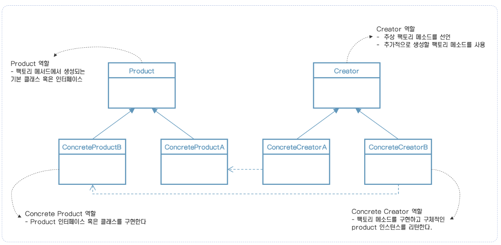

> 이 내용은 udemy의 design pattern 강의를 정리한 것입니다.
>
> https://www.udemy.com/course/design-patterns-in-java-concepts-hands-on-projects/

# 팩토리 메소드 패턴

## 팩토리 메소드는 무엇인가?

* 코드에서 객체 생성 로직을 개별 클래스로 옮기고 싶다.
* 어느 클래스에서 미리 초기화할지 모르며, 새로운 유형의 클래스들이 추가될 수 있으며 클라이언트 코드에 영향을 주지 않고  생성을 처리할 필요가 있는 경우에 이 패턴을 사용한다.
* 팩토리 메소드를 오버라이딩을 통해 서브클래스에서 객체 초기화를 할 수 있게 한다.

## UML

