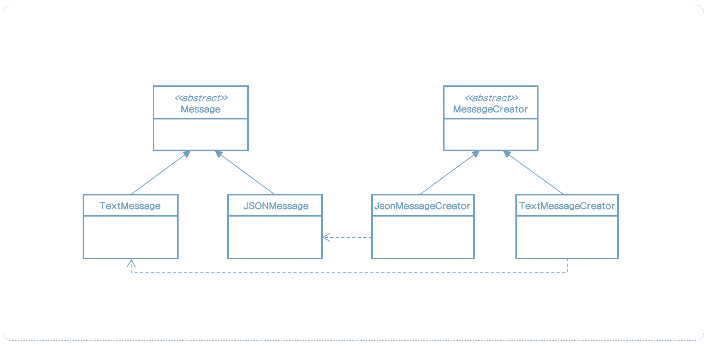

> 이 내용은 udemy의 design pattern 강의를 정리한 것입니다.
>
> https://www.udemy.com/course/design-patterns-in-java-concepts-hands-on-projects/


# 팩토리 메소드 패턴

## 팩토리 메소드는 무엇인가?

* 코드에서 객체 생성 로직을 개별 클래스로 옮기고 싶다.
* 어느 클래스에서 미리 초기화할지 모르며, 새로운 유형의 클래스들이 추가될 수 있으며 클라이언트 코드에 영향을 주지 않고  생성을 처리할 필요가 있는 경우에 이 패턴을 사용한다.
* 팩토리 메소드를 오버라이딩을 통해 서브클래스에서 객체 초기화를 할 수 있게 한다.


## UML


## 팩토리 메소드 구현방법

* 생성자에 대한 클래스를 생성함으로서 시작한다.
    * 생성자는 구체적인 타입이 될 수 있다. 
    * 구현부는 메소드를 오버라이드하고 객체를 리턴한다.


## 예제: UML




## 팩토리 메소드 구현

Message에 대한 인터페이스를 나타낸다.

```java
/**
 * 이 클래스는 Message에 대한 인터페이스를 나타낸다.
 * 구현부에서 contentType을 명시할 것이다.
 */
public abstract class Message {

    public abstract String getContent();

    public void addDefaultHeaders() {
    }

    public void encrypt() {
    }
}
```

Message에는 JSON과 Text 타입이 있다고 생각하자.

우선 JSONMessage를 만든다.

```java
public class JSONMessage extends Message {

    @Override
    public String getContent() {
        return "{\"JSON\":[]}";
    }
}
```

그 다음은 TestMessage를 만든다.

```java
public class TextMessage extends Message {

    @Override
    public String getContent() {
        return "Text";
    }
}
```

그 다음은 Message를 객체를 생성하는 팩토리 메소드를 정의하자.

```java
public abstract class MessageCreator {

    public Message getMessage() {
        Message message = createMessage();
        message.addDefaultHeaders();
        message.encrypt();

        return message;
    }

    // 팩토리 메소드
    public abstract Message createMessage();
}
```

JSONMessageCreator 생성

```java
public class JSONMessageCreator extends MessageCreator {
    @Override
    public Message createMessage() {
        return new JSONMessage();
    }
}
```

TextMessageCreator 생성

```java
public class TextMessageCreator extends MessageCreator {
    @Override
    public Message createMessage() {
        return new TextMessage();
    }
}
```

이제 실제 Message를 사용할 Client 코드를 작성하자.

```java
public class Client {

    public static void main(String[] args) {
        printMessage(new JSONMessageCreator()); // com.example.designpattern.factorymethod.message.JSONMessage@24d46ca6
        printMessage(new TextMessageCreator()); // com.example.designpattern.factorymethod.message.TextMessage@4517d9a3
    }

    private static void printMessage(MessageCreator creator) {
        Message message = creator.getMessage();
        System.out.println(message);
    }
}
```


## 구현 시 고려사항

* 생성자는 구체적인 클래스가 될 수 있고 팩토리 메소드의 default 구현을 제공할 수도 있다. 그런 경우에는 상위 생성자에서 default 객체를 만들 수도 있다.
* 또한 다른 객체 유형을 선택하기 위해 추가적인 인수를 받는 방식으로 팩토리를 사용할 수도 있다. 서브클래스는 어떤 조건에 대해 다른 객체를 선택적으로 생성하도록 팩토리 메소드를 오버라이드 할 수 있다.


## 디자인 고려사항

* 팩토리 메소드 패턴에서 생성자의 계층 구조는 만들려는 객체 구조를 나타낸다. 일반적으로 객체 유형 당 구체적인 생성자로 생긴다.
* 템플릿 메소드 디자인 패턴은 보통 팩토리 메소드를 사용한다.
* "추상 팩토리"라고 불리는 또 다른 생성 디자인 패턴은 팩토리 메소드 패턴을 사용한다.


## 팩토리 메소드 예제

* java.util.Collection (혹은 java.util.AbstractCollection)은 iterator()라는 추상 팩토리를 가지고 있다. 이 메소드는 팩토리 메소드의 예이다.

```java
public abstract class AbstractCollection<E> implements Collection<E> {
    /**
     * Sole constructor.  (For invocation by subclass constructors, typically
     * implicit.)
     */
    protected AbstractCollection() {
    }

    // Query Operations

    /**
     * Returns an iterator over the elements contained in this collection.
     *
     * @return an iterator over the elements contained in this collection
     */
    public abstract Iterator<E> iterator();
}
```

* 팩토리 메소드 패턴의 대부분의 특징은 서브클래스가 실제 인스턴스를 제공한다는 점을 기억해라. 그래서 객체 인스턴스를 리턴하는 정적 메소드는 기술적으로는 GoF 팩토리 메소드 패턴이 아니다.


## 위험요소

* 구현하기 더 복잡해진다. 더 많은 클래스가 관여되고 단위 테스트가 필요하다.
* 처음부터 팩토리 메소드 디자인 패턴으로 시작해야 한다. 기존 코드를 팩토리 메소드 패턴으로 리팩토링 하는일은 쉽지 않다.
* 때로는 이러한 패턴을 사용함으로써 서브클래스에서 적절한 인스턴스를 생성하도록 유도한다.


## 빠른 요약

* 객체 초기화를 서브클래스로 위임하고 싶을 때 팩토리 메소드를 사용해라. 객체 상속 구조를 가지고 있고 미래에 추가될 가능성이 있을 경우에 사용하면 좋다.
